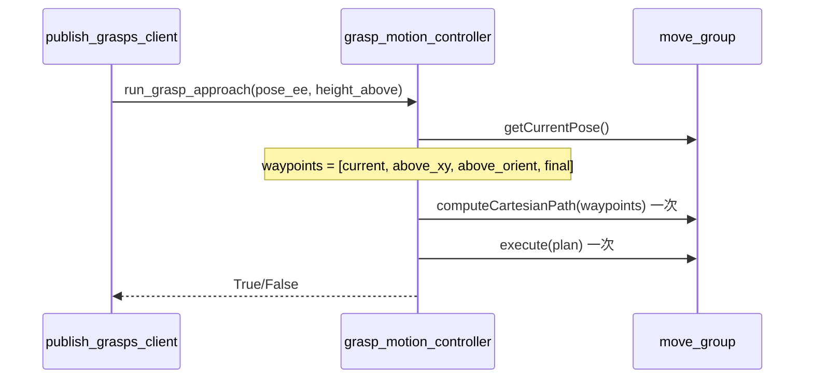

# 抓取运动：MoveIt2 Python API 三阶段运动方案

## 目标

- 运动顺序与 [moveit_arcline_demo.cpp](aubo_ros2_ws/src/aubo_ros2_driver/demo_driver/src/moveit_arcline_demo.cpp) / [moveit_arcline_gripper_worker.cpp](aubo_ros2_ws/src/aubo_ros2_driver/demo_driver/src/moveit_arcline_gripper_worker.cpp) 的笛卡尔路径风格一致，逻辑上分为三阶段，但**整体规划只一次、执行轨迹只一次**：
  1. **笛卡尔 XY**：末端只动 X、Y，到抓取点正上方（Z = 抓取高度 + 安全高度），姿态保持当前。
  2. **姿态旋转**：位置不变 (gx, gy, z_above)，仅姿态变为抓取四元数。
  3. **笛卡尔 Z**：沿 Z 轴直线下降至最终抓取位姿。
- 实现方式：将上述三阶段**合并为一条笛卡尔路径**的 waypoints，**只调用一次** `computeCartesianPath(waypoints, ...)`，得到一条轨迹后**只调用一次** `execute(plan)`，与 C++ 中 `runArcPathSequence` 的“多段一次规划、一次执行”一致。
- 不依赖现有 `/move_to_pose`、`/move_to_joints` 等服务，全部通过 **MoveIt2 的 Python 接口**完成。
- **新建独立运动控制模块**，[publish_grasps_client.py](aubo_ros2_ws/src/graspnet_ros2/graspnet_ros2/publish_grasps_client.py) 只负责：发布抓取、选抓取、算 end-effector 位姿，然后**调用该模块**执行上述三阶段运动。

## 依赖与选型

- 当前工作空间**未**包含 `pymoveit2` 或 `moveit_py`；[graspnet_ros2/package.xml](aubo_ros2_ws/src/graspnet_ros2/package.xml) 也未声明 MoveIt 相关依赖。
- C++ 侧逻辑（[move_to_pose_server.cpp](aubo_ros2_ws/src/aubo_ros2_driver/demo_driver/src/move_to_pose_server.cpp)）：`MoveGroupInterface::getCurrentPose` → `computeCartesianPath(waypoints, eef_step, jump_threshold, trajectory)` → `execute(plan)`；位姿目标用 `setPoseTarget` + `plan()` + `execute()`。
- **推荐**：引入 **pymoveit2** 作为 MoveIt2 的 Python 接口（Humble 可用，基于 ROS2 actions/services，支持笛卡尔与位姿目标）。若不可用，备选为 **moveit_py**（若环境中已安装）。
- 需在 [package.xml](aubo_ros2_ws/src/graspnet_ros2/package.xml) 中增加对 MoveIt2 / pymoveit2（或 moveit_py）的依赖，并在新模块中统一封装“连接 move_group、规划、执行、笛卡尔路径”的调用。

## 运动序列（与 C++ 对齐，整体一次规划一次执行）

- **Waypoints 构造**（4 个点，一条轨迹）：
  - `waypoints[0]`：当前末端位姿（getCurrentPose）。
  - `waypoints[1]`：`(gx, gy, z_above)`，姿态与当前相同（笛卡尔 XY 到上方）。
  - `waypoints[2]`：`(gx, gy, z_above)`，姿态改为 `pose_ee.orientation`（姿态旋转，位置不变）。
  - `waypoints[3]`：`pose_ee` 完整位姿（笛卡尔 Z 下降至抓取）。
- **一次规划、一次执行**：对上述 waypoints 调用 `computeCartesianPath(waypoints, eef_step, jump_threshold, trajectory)`，若 fraction >= 1.0 则 `execute(plan)` 一次，不再分三次 plan/execute。
- **高度**：`z_above = pose_ee.position.z + height_above`（如 height_above=0.05 m）。

## 文件与接口设计

### 1. 新建运动控制模块（建议路径）

- **路径**：`graspnet_ros2/graspnet_ros2/grasp_motion_controller.py`（或 `moveit_grasp_motion.py`）。
- **职责**：
  - 依赖 MoveIt2 Python API（pymoveit2 或 moveit_py），连接已有 `move_group` 节点（规划组名与 [moveit_arcline_demo](aubo_ros2_ws/src/aubo_ros2_driver/demo_driver/include/demo_driver/moveit_arcline_demo.h) / [move_to_pose_server](aubo_ros2_ws/src/aubo_ros2_driver/demo_driver/src/move_to_pose_server.cpp) 一致，如 `manipulator`、末端 `tool_tcp`、base `base_link`）。
  - 提供**纯函数**或**单例/类**接口，例如：
    - `run_grasp_approach(pose_ee, height_above=0.05, node=None, velocity_scaling=0.3)`  
    入参：`pose_ee` 为 `geometry_msgs.msg.Pose`（base_link 下 end-effector 目标），`height_above` 为上方安全高度，`node` 为 rclpy 节点（用于创建 MoveIt2 接口时传入 context），返回 `bool`。
  - 内部实现：**一条笛卡尔路径、一次执行**。
    - 取当前末端位姿 `current`。
    - 构造 4 个 waypoints：`[current, above_xy_same_ori, above_xy_grasp_ori, pose_ee]`（同上节）。
    - 调用一次 `computeCartesianPath(waypoints, eef_step, jump_threshold, trajectory)`，检查 fraction >= 1.0。
    - 若成功则调用一次 `execute(plan)`，不拆成多次 plan/execute。
  - 参数与 C++ 对齐：`eef_step`（如 0.01）、`jump_threshold`（如 0.0）、速度/加速度缩放（可从参数或入参传入）。

### 2. publish_grasps_client 修改

- **删除**：对 `/move_to_pose` 的依赖（`MoveToPose` 服务、`call_move_service`、等待该服务的逻辑）。
- **保留**：发布抓取、TF 获取、垂直度筛选、`build_grasp_to_end_effector_transform`、`apply_transformation_to_pose`，得到 `transformed_pose`（end-effector 目标位姿）。
- **替换**：原“步骤 3: 调用运动控制服务”改为调用新模块，例如：
  - `from graspnet_ros2.grasp_motion_controller import run_grasp_approach`
  - `success = run_grasp_approach(self, transformed_pose, height_above=0.05)`  
  （若接口需要节点引用则传入 `self`。）
- 可选：将 `height_above`、速度缩放等作为 launch/参数传入 client，再传给运动模块。

### 3. 配置与依赖

- **package.xml**：为 `graspnet_ros2` 增加对 MoveIt2 及 Python 接口的依赖（例如 `pymoveit2` 或 `moveit_py`，视最终选用哪个而定）；若 pymoveit2 以源码形式放入工作空间，则用 `exec_depend` 或 `build_depend` 指向该包。
- **setup.py / setup.cfg**：若有 entry_points，保持 `publish_grasps_client` 的 console 脚本不变；无需为新模块单独加 entry_point，仅作为库被 client 导入。
- 规划组名、末端 link、base frame 与 [aubo_moveit_config](aubo_ros2_ws/src/aubo_ros2_driver/aubo_moveit_config) 及 [move_to_pose_server](aubo_ros2_ws/src/aubo_ros2_driver/demo_driver/src/move_to_pose_server.cpp) 一致（如 `manipulator`、`tool_tcp`、`base_link`），可在运动模块内写死或通过参数/构造函数注入。

## 实现要点（与 C++ 一致）

- **一条轨迹**：waypoints 为 4 个 Pose（当前 → 上方同姿态 → 上方抓取姿态 → 最终抓取），只调用一次 `computeCartesianPath` 和一次 `execute`，与 [moveit_arcline_demo.cpp](aubo_ros2_ws/src/aubo_ros2_driver/demo_driver/src/moveit_arcline_demo.cpp) 中 `runArcPathSequence` 的“多段一次规划、一次执行”一致。
- **笛卡尔参数**：`eef_step`、`jump_threshold` 与 C++ 一致（如 0.01、0.0）。
- **不调用服务**：全程仅用 MoveIt2 Python API（getCurrentPose、computeCartesianPath、execute），不调用 /move_to_pose 等。
- **错误处理**：若 computeCartesianPath 的 fraction < 1.0 或 execute 失败，返回 False 并打日志。

## 小结

| 项目   | 内容                                                                                                                                                          |
| ---- | ----------------------------------------------------------------------------------------------------------------------------------------------------------- |
| 新建文件 | `graspnet_ros2/graspnet_ros2/grasp_motion_controller.py`（或等价命名）                                                                                             |
| 修改文件 | [publish_grasps_client.py](aubo_ros2_ws/src/graspnet_ros2/graspnet_ros2/publish_grasps_client.py)、[package.xml](aubo_ros2_ws/src/graspnet_ros2/package.xml) |
| 运动顺序 | 笛卡尔 XY → 姿态旋转 → 笛卡尔 Z（一条 waypoints，一次 computeCartesianPath，一次 execute）                                                                                      |
| 接口风格 | 不调用 /move_to_pose 等服务，仅用 MoveIt2 Python API                                                                                                                 |
| 依赖   | 增加 pymoveit2（或 moveit_py），与现有 move_group 节点配合                                                                                                               |

实现时需在目标环境中确认 pymoveit2 或 moveit_py 已安装并可连接当前 aubo move_group；若 pymoveit2 不在仓库内，需在文档或 README 中说明安装与 source 步骤。