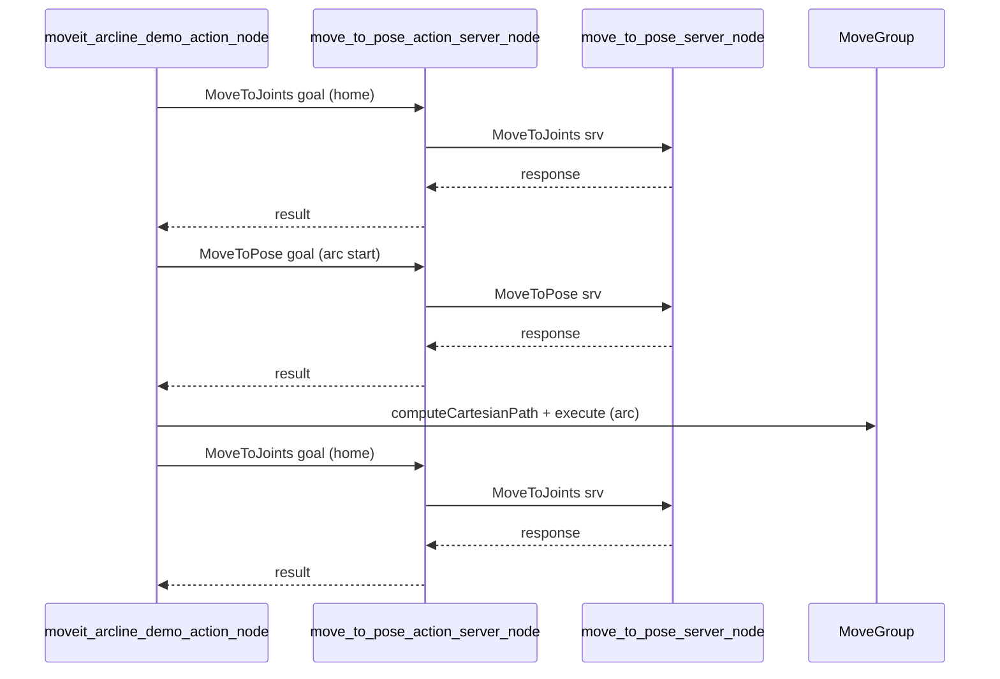

# 圆弧 Demo 动作版实现计划

## 现状与目标

- **现有实现**：[moveit_arcline_demo.cpp](aubo_ros2_ws/src/aubo_ros2_driver/demo_driver/src/moveit_arcline_demo.cpp) 通过 **Service 客户端** 调用 `/move_to_pose`、`/move_to_joints`（由 [move_to_pose_server.cpp](aubo_ros2_ws/src/aubo_ros2_driver/demo_driver/src/move_to_pose_server.cpp) 提供），步骤 3 在本节点内用 MoveGroup 做笛卡尔圆弧。
- **目标**：新建一套实现，**行为完全一致**（四步流程、home/圆弧起点/圆弧/home、重试与等待逻辑不变），但改为使用 **Action Server + Action Client** 调用。**不修改** [move_to_pose_server.cpp](aubo_ros2_ws/src/aubo_ros2_driver/demo_driver/src/move_to_pose_server.cpp) 与 [move_to_pose_server.h](aubo_ros2_ws/src/aubo_ros2_driver/demo_driver/include/demo_driver/move_to_pose_server.h)；Action 由**新建的独立节点**提供，该节点内部调用现有 `/move_to_pose`、`/move_to_joints` 服务。

## 1. 在 demo_interface 中定义 Action

- **路径**：在 `demo_interface` 包下新建 `action/` 目录，增加两个 action 文件，字段与现有 srv 对齐，并增加可选的 feedback。
- **MoveToPose.action**  
  - Goal：与 [MoveToPose.srv](aubo_ros2_ws/src/aubo_ros2_driver/demo_interface/srv/MoveToPose.srv) 的 Request 一致（`geometry_msgs/Pose target_pose`、`bool use_joints`、`float32 velocity_factor`、`float32 acceleration_factor`）。  
  - Result：与 Response 一致（`bool success`、`int32 error_code`、`string message`）。  
  - Feedback：可选，例如 `float32 progress`（0~1）或 `string status_message`，便于客户端显示进度。
- **MoveToJoints.action**  
  - Goal：与 [MoveToJoints.srv](aubo_ros2_ws/src/aubo_ros2_driver/demo_interface/srv/MoveToJoints.srv) 的 Request 一致（`float64[] joint_positions_rad`、`float32 velocity_factor`、`float32 acceleration_factor`）。  
  - Result：与 Response 一致（`bool success`、`int32 error_code`、`string message`）。  
  - Feedback：同上，可选。
- **修改**：  
  - [demo_interface/CMakeLists.txt](aubo_ros2_ws/src/aubo_ros2_driver/demo_interface/CMakeLists.txt)：在 `rosidl_generate_interfaces` 中加入上述两个 action，并添加对 `geometry_msgs` 和 `action_msgs` 的依赖（action 依赖 action_msgs）。  
  - [demo_interface/package.xml](aubo_ros2_ws/src/aubo_ros2_driver/demo_interface/package.xml)：增加 `action_msgs` 依赖（以及若尚未包含的 `trajectory_msgs` 等，按现有 srv 依赖为准）。

## 2. 新建独立节点：Action Server（服务桥接）

- **原则**：**不修改** move_to_pose_server.cpp 与 move_to_pose_server.h。Action 由单独的可执行节点提供。
- **新建文件**：  
  - 源文件：`demo_driver/src/move_to_pose_action_server.cpp`（无需单独头文件亦可，或按需增加 `include/demo_driver/move_to_pose_action_server.h`）
- **节点职责**：  
  - 创建两个 Action Server：`/move_to_pose`、`/move_to_joints`（类型为 `demo_interface::action::MoveToPose`、`MoveToJoints`）。  
  - 创建两个 Service Client：调用现有的 `/move_to_pose`、`/move_to_joints` 服务（由已运行的 `move_to_pose_server_node` 提供）。  
  - **handle_goal**：接受 goal（可做简单校验，如 joint 数量、速度系数范围）。  
  - **handle_cancel**：接受取消；因实际执行在服务端，可在调用 service 前检查 `goal_handle->is_canceling()`，若已取消则直接设 aborted，不调用服务。  
  - **handle_accepted**：在单独线程中：  
    - 将 goal 转为对应 srv 的 Request，调用 `client->async_send_request(...)` 并 `future.wait_for(...)` 等待结果；  
    - 用 srv 的 Response 填充 action 的 Result，成功则 `goal_handle->succeed(result)`，失败则 `goal_handle->abort(result)`；  
    - 执行期间可发布简单 feedback（如 `status_message = "executing"`），因服务调用阻塞，feedback 可在调用前后各发一次。
- **依赖与构建**：在 [demo_driver/CMakeLists.txt](aubo_ros2_ws/src/aubo_ros2_driver/demo_driver/CMakeLists.txt) 中新增可执行文件 `move_to_pose_action_server_node`，依赖 rclcpp、rclcpp_action、demo_interface（srv + action）、geometry_msgs；并在 `install(TARGETS ...)` 中加入该节点。
- **运行顺序**：需先启动 `move_to_pose_server_node`，再启动 `move_to_pose_action_server_node`，最后启动 `moveit_arcline_demo_action_node`。

## 3. 新建“动作版”圆弧 Demo 节点（Action Client）

- **新建文件**：  
  - 头文件：`demo_driver/include/demo_driver/moveit_arcline_demo_action.h`  
  - 源文件：`demo_driver/src/moveit_arcline_demo_action.cpp`
- **行为**：与 [moveit_arcline_demo.cpp](aubo_ros2_ws/src/aubo_ros2_driver/demo_driver/src/moveit_arcline_demo.cpp) **完全一致**：  
  - 步骤 1：移动到 home（调用 **MoveToJoints** action）。  
  - 步骤 2：移动到圆弧起点 (0.4, 0, 0.45)（调用 **MoveToPose** action）。  
  - 步骤 3：本节点内使用 MoveGroup 做笛卡尔圆弧（`computeCartesianPath` + `execute`），逻辑与现有 `runArcPath()` 相同（含 2 秒初始等待、最多 5 次重试、2 秒间隔）。  
  - 步骤 4：再次移动到 home（调用 **MoveToJoints** action）。
- **实现要点**：  
  - 使用 `rclcpp_action::Client<demo_interface::action::MoveToPose>` 和 `MoveToJoints`，action 名称与**新建的 Action Server 节点**一致（如 `/move_to_pose`、`/move_to_joints`）。  
  - 节点结构可复用现有 demo：静态工厂 `create()` + `initMoveGroup()`，避免构造函数内 `shared_from_this()`；`waitForActionServers(timeout)` 替代 `waitForServices`；`moveToJoints(...)` / `moveToPose(...)` 改为 `async_send_goal` + 等待 result（如 `rclcpp_action::Client::GoalResponse` / `ResultCode`），超时与现有 `kCallTimeoutSeconds` 一致（如 60s）。  
  - 可选：在 `send_goal` 时传入 feedback 回调，打印或记录 progress/status_message。  
  - main：同样使用 `MultiThreadedExecutor` + 后台 spin 线程，先 `waitForActionServers`，再 `run()`，退出码逻辑一致。
- **常量**：home 关节角、圆弧参数、重试次数/延迟等与 [moveit_arcline_demo.cpp](aubo_ros2_ws/src/aubo_ros2_driver/demo_driver/src/moveit_arcline_demo.cpp) 保持一致（可复制或引用相同常量）。

## 4. 构建与安装

- **demo_driver/CMakeLists.txt**：  
  - 添加可执行文件 `move_to_pose_action_server_node`（见第 2 节）。  
  - 添加可执行文件 `moveit_arcline_demo_action_node`，源文件为 `src/moveit_arcline_demo_action.cpp`。  
  - 为其添加与 `moveit_arcline_demo_node` 相同的 ament 依赖（rclcpp, geometry_msgs, demo_interface, moveit_core, moveit_ros_planning_interface），并确保 demo_interface 已能提供 action 类型（通常无需额外依赖）。  
  - 在 `install(TARGETS ...)` 中加入 `move_to_pose_action_server_node` 和 `moveit_arcline_demo_action_node`。
- **demo_interface**：先编译以生成 action 头文件与库，再编译 demo_driver（workspace 内 `colcon build --packages-select demo_interface demo_driver` 即可）。

## 5. 可选：文档与 launch

- 若 [demo_driver/README.md](aubo_ros2_ws/src/aubo_ros2_driver/demo_driver/README.md) 中有圆弧 demo 的启动说明，可增加一节“动作版圆弧 Demo”：先启动 `move_to_pose_server_node`，再启动 `move_to_pose_action_server_node`，最后启动 `moveit_arcline_demo_action_node`；并说明与 service 版行为一致，仅调用方式改为 Action，且 **move_to_pose_server 代码无需改动**。

## 数据流概览（动作版）

## 小结

| 项目                  | 内容                                                                                                            |
| ------------------- | ------------------------------------------------------------------------------------------------------------- |
| 新增接口                | demo_interface: `MoveToPose.action`, `MoveToJoints.action`                                                    |
| move_to_pose_server | **不修改** move_to_pose_server.cpp / move_to_pose_server.h                                                       |
| 新节点（Action Server）  | move_to_pose_action_server_node：提供 MoveToPose/MoveToJoints action，内部调用现有 `/move_to_pose`、`/move_to_joints` 服务 |
| 新节点（Action Client）  | moveit_arcline_demo_action_node（Action Client + 本节点 MoveGroup 圆弧），流程与 service 版一致                             |
| 构建                  | demo_interface 注册 action；demo_driver 新增两个可执行文件并 install                                                       |

