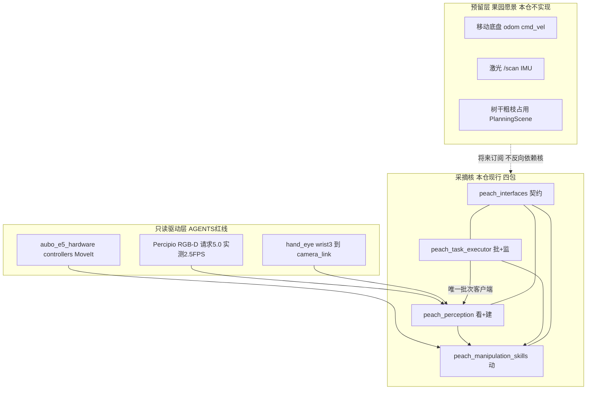
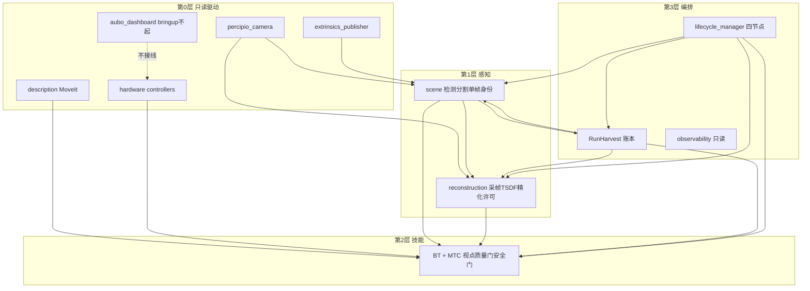
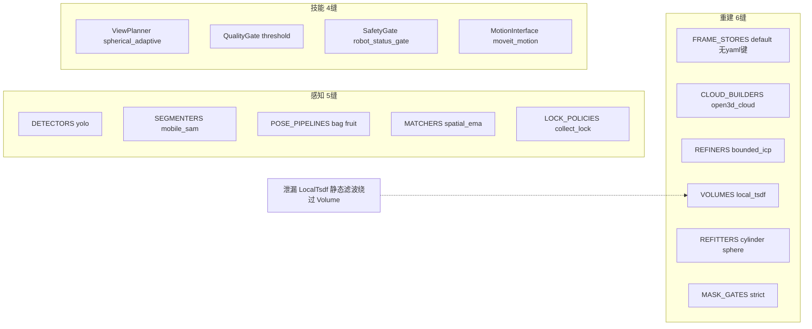
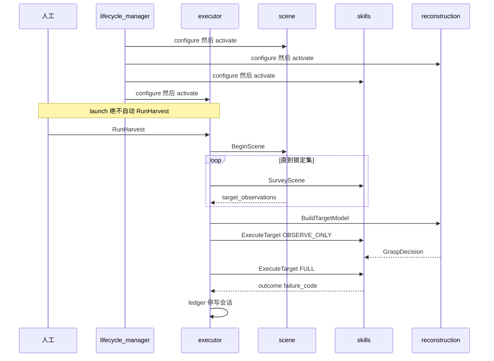
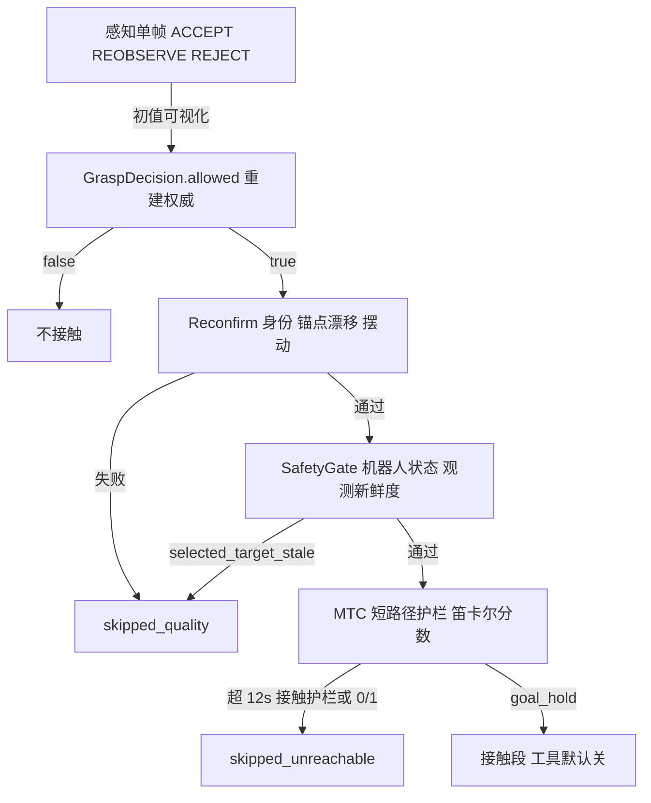
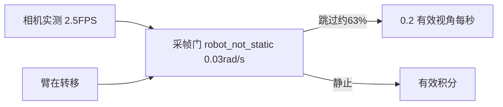

# 视觉机械臂采摘：产品架构与研发方案

> 本计划是 2026-08-25 冻结稿。**现行文档只有三份：** [docs/architecture.md](docs/architecture.md)、[docs/io.md](docs/io.md)、[docs/testing.md](docs/testing.md)。

## 产品定位（本方案的北极星）

- **愿景产品：** 果园套袋桃采摘（室外光照、枝叶遮挡、将来底盘移动）。
- **本仓库现行产品：** 固定座 AUBO E5 + Percipio RGB-D，四包采摘核。无履带、无雷达、无 IMU（源码零命中 `/scan` `/imu` odom）。
- **范围处理（已确认）：** 果园是愿景；**遵守 AGENTS**：四包不拆、不加空包、本仓不做底盘/雷达/IMU 实现。架构把移动与环境感知写成**预留层**，当前把固定座核做扎实。
- **近期成功标准：** [docs/testing.md](docs/testing.md) 单目标接触验收（`tool.enabled=false`）。树干进 PlanningScene 是预留缝，不进本次实现。
- **明确非目标：** launch 自动 `RunHarvest`；感知发运动；技能写账本；学习模型补深度；nvblox 替换 TSDF；改只读驱动栈。

现场基线（归档，[docs/testing.md](docs/testing.md) / [process-data-analysis-2026-08-24.md](reports/process-data-analysis-2026-08-24.md)）：

- 相机已运行 **~2.4–2.5 FPS**（不是 launch 请求 5.0，也不是参考文 0.8）。
- 08-24 五批 10 目标全 skipped：一半观察（`selected_target_stale`），一半 MTC 接近。
- 有效视角常 4–6；`robot_not_static` 可占跳过 63%，把 2.5 FPS 稀释到 ~0.2 有效视角/秒。
- 唯一全流程成功：`coverage_fix:target_2`，15 视角、51.6 s，拒绝以 `same_stamp`/`near_duplicate` 为主。
- 几何 `GraspDecision.allowed=true` 之后仍会 `skipped_quality` / `skipped_unreachable`（接近预计 25–29 s > 12 s 护栏）。

**产品结论：** 架构已经能跑通全流程；产品失败不在「缺包」，而在观察节拍、身份新鲜度、可达性门、会话隔离四条链路没有按 2.5 FPS 停走式相机做成一等公民。

---

## 原则（可扩展 / 稳定 / 高效）

对照 Nav2（lifecycle 有序托管 + `nav2_core` 插件面 + BT 恢复子树 + 机器可读 error_code）、MoveIt/MTC（stage 组合 + 轨迹护栏）、Autoware（组件图 + 话题契约表）、ros2_control（参数库 + 硬件抽象只读借用）。

1. **契约先于实现。** 跨包只走 [interface_manifest.yaml](src/peach_interfaces/config/interface_manifest.yaml)（23 条）。新增话题必须先改清单。感知不发运动；批次唯一所有者是执行器。
2. **替换走缝位，不拆包。** 现有 15 缝 / 17 实现（Python `Registry` + C++ 工厂 if 链）。不上 pluginlib（`MotionInterface` 构造绑定 MoveIt/TF/`std::function`）。换检测器 = 新类 + 注册一行 + yaml 一键。
3. **失败可定位、可跳过。** 对标 Nav2 error_code：每个目标必须有 `failure_code`，观察失败不接触，规划失败不执行残缺轨迹。
4. **停走式感知是产品相机模型。** 设计节拍按 **2.5 FPS + 静止门**，不是 5 Hz 连续积分，也不是参考文 0.8 FPS。覆盖预算（有效视角 + 基线）优于 `max_views=24`。
5. **抓取几何唯一权威是 `GraspDecision.allowed`。** 感知 ACCEPT 只当初值/可视化。`allowed=false` 时入口/轴是占位，禁止消费。
6. **会话有边界。** 一次 `RunHarvest` 对应一份 run 目录；批次结束必须停写 jsonl（归档曾出现结束后再写 65 分钟空帧）。
7. **预留层不加空包。** 底盘/雷达/树干占用只在架构图与 IDL 注释里留接口形状，实现进本仓须另授权。

---

## 目标架构：三层产品 + 四包核

依赖只向下：预留层将来消费核的 `base_link` 几何，核永不依赖底盘。树干占用将来作为技能侧 PlanningScene 输入（§9），不是第五个 peach 包。

### 图 A — 核内分层与依赖（现行）

### 图 B — 15 个缝位（可扩展面）

硬编码、明确**不是缝位**（避免乱开）：RGB-D 同步、TF 查询策略、采帧门顺序、发布器、`TargetRegistry`/`GlobalHarvestPlan`/`InferenceEngine` 本体、`GraspTask`/MTC stage、16 个 BT 节点、`select.py`、lifecycle 名单。果园预留也不开成缝位，直到有真实输入。

装配点：

- 感知：[peach_pose_node.py](src/peach_perception/peach_perception/scene/peach_pose_node.py) 159–209；注册 [impls.py](src/peach_perception/peach_perception/scene/peach_pose/impls.py) 43–48；yaml [peach_pose.yaml](src/peach_perception/config/peach_pose.yaml) 59–64。
- 重建：[reconstruction_node.py](src/peach_perception/peach_perception/reconstruction/reconstruction_node.py) 181–207、738；yaml [reconstruction.yaml](src/peach_perception/config/reconstruction.yaml) 118–123。`FRAME_STORES.create('default')` 写死。
- 技能：[approach_grasp_node.cpp](src/peach_manipulation_skills/src/approach_grasp_node.cpp) 432、448、456、500；[impl_factory.hpp](src/peach_manipulation_skills/include/peach_manipulation_skills/impl_factory.hpp)。

### 图 C — 批次控制流（产品主路径）

### 图 D — 产品决策栈（稳定的关键）

现场失败发生在「几何过了」之后。架构必须把决策画成栈，消费方不得跳层。

`selected_target_stale` 来源：[safety_gate.cpp](src/peach_manipulation_skills/src/safety_gate.cpp) 75–77（`received_s` 超龄）。BT 在 MTC 前对 stale 再等一窗（[bt_nodes.cpp](src/peach_manipulation_skills/src/bt_nodes.cpp) 732–748）。08-24 观察失败主因就是这条新鲜度门与派发时序。

### 图 E — 观察效率（产品相机模型）

目标架构把「到位 → 停稳窗口 → 采 1 帧 → 短基线再走」写成观察策略，而不是在转移中用 2.5 FPS 去撞静止门。成功对照：15 视角那次拒绝以同戳/近重复为主，说明停稳与拍摄对齐时门是健康的。

---

## 产品缺口（源码 + 归档，不是文笔）

| 产品目标 | 现场/源码事实 | 架构含义 |
|----------|----------------|----------|
| 可扩展换检测器 | 15 缝已在；`FRAME_STORES` 已有 `frame_store.impl`；TSDF 滤波仍直调 `LocalTsdf` | 泄漏列为确认后修复 |
| 稳定：节点挂了能发现 | lifecycle_manager 普通 Node、一次性转换、无 bond/心跳；observability 不在名单 | 文档记录；补心跳是后续确认项，不照搬 Nav2 bond 除非授权 |
| 稳定：失败可归因 | ledger 已有 `failure_code`；消息无 `algo_version`/`config_version`；清单脚本未进 lint | 契约门禁进 lint 不违反「只 lint」 |
| 稳定：会话不泄漏 | 批次结束后 events.jsonl 再写 65 分钟空帧 | 记录器绑定 `RunHarvest` 生命周期 |
| 稳定：身份新鲜度 | 08-24 `selected_target_stale` ×4 | 门限不预填 EMA；OBSERVED 可用 `updated_s`；非 OBSERVED 仍按末次 live `received_s` |
| 高效：观察 | 6 视角用 33.5 s；`max_views=24` 与现场 4–6 脱节 | 覆盖预算 + 停稳窗口一等公民；不改相机 launch |
| 高效：接触 | 08-24 单段 25–29 s 撞 **12 s** MTC 护栏；笛卡尔 0.967；`(0/1)` | 过渡点切短路径；护栏仍拒绝绕行。拍照位另用 25 s transit 门 |
| 果园预留 | 无 `/scan`/odom；§9 树干未进场景 | 架构图预留；不加包 |

机制已用：LifecycleNode ×4、MT executor、callback groups、message_filters、latched QoS、action cancel、`generate_parameter_library`、BT.CPP、MTC。明确不做：`rclcpp_components`（Python 感知无法与 C++ 共进程）、pluginlib、本轮 MCAP 扩白名单、空导航包。

---

## 研发路线（架构冻结 → 按失败模式补齐）

检查 → 报告 → 确认 → 才改。本轮只出架构资产。

**R0 架构冻结（本轮执行）**

- [docs/architecture.md](docs/architecture.md)：分层、缝位、已拍板决策、规约。
- [docs/io.md](docs/io.md)：跨包话题/动作/服务、TF、深度、GraspDecision。
- [docs/testing.md](docs/testing.md)：lint、干跑、验收门、归档基线 + [scripts/replay_metrics.py](scripts/replay_metrics.py)。
- 对照协议：本方案即 Phase 4「目标功能包与工作空间结构」的产品答案——**保持四包**，不采用协议第六节空包树。

**R1 契约与会话（稳定性，确认后）**

- 清单校验进 `BUILD_TESTING`（lint）。
- 记录器随批次起停。
- 消息版本字段单列，改 IDL 另确认。

**R2 观察效率（对标 2.5 FPS 停走）**

- 覆盖预算替代「凑满 24」；停稳窗口与视点到位对齐。
- 不改 Percipio `frame_rate`。

**R3 可达性一等公民**

- 接触前短 IK/笛卡尔预检；超 12 s 的绕行保持 `skipped_unreachable`，不硬闯。

**R4 新鲜度与派发时序**

- 固化 SafetyGate / Reconfirm 与 OBSERVED `updated_s`；消灭「跟踪已 OBSERVED 仍 stale」。

**R5 果园预留（文档级）**

- §9 树干占用作为技能 PlanningScene 输入形状；底盘层接口形状。无实现、无空包。

---

## 本轮交付与红线

产出：markdown + 只读 `replay_metrics.py`。不改采摘业务代码、不改驱动、不删 `_archive/runs/`、不提交 git、不自动 RunHarvest。

缺陷三条（说明书否则说假话）等你逐条点头再动：

1. `FRAME_STORES` 补 yaml 键。
2. TSDF 后置滤波收进 `Volume` ABC。
3. `check_interface_manifest.py` 进 lint。
