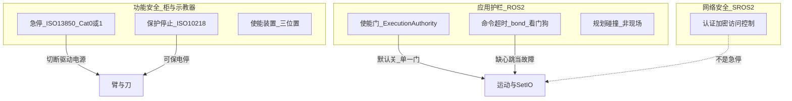
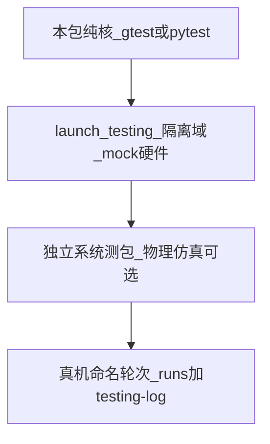

# AGENTS.md — ROS 2 机器人工作流百科

**MUST（先读）：** 未授权不得真机运动或 SetIO（操作员在 real 上发起 launch/操作台指令=授权）。硬件急停不经 ROS。驱动栈只读。`numpy == 1.26.4`。autostart 是部署参数（默认关）。**任何测试或程序结束后必须停干净并清进程。**

入口：

```bash
source /opt/ros/jazzy/setup.bash
cd /home/mu/Desktop/aubo_e5_jazzy_ws
colcon build --cmake-args -DCMAKE_BUILD_TYPE=Release -DCMAKE_EXPORT_COMPILE_COMMANDS=ON
source install/setup.bash
pgrep -af 'ros2 launch|component_container|extrinsics_publisher|ros2 run'
ros2 launch peach_bringup harvest_system.launch.py hardware_mode:=mock camera_enabled:=false
```

真机另需 `hardware_mode:=real camera_enabled:=true robot_ip:=169.254.10.98`，示教器上电。怎么跑、命名、验收门细节见 [docs/testing.md](docs/testing.md)。

现行系统快照：[docs/architecture.md](docs/architecture.md)、[docs/io.md](docs/io.md)、[docs/testing.md](docs/testing.md)。过程记录只追加：[docs/testing-log.md](docs/testing-log.md)、[docs/REFACTORING.md](docs/REFACTORING.md)。`docs/` 不新增第四份活文档。

**怎么改以本文为准。** 三份活文档是 SNAPSHOT（现在跑什么），不是“永远必须这样”。非完美适配则跟 ROS 2 / 优秀 GitHub 主流，同轮改活文档。

```mermaid
flowchart TB
  subgraph must [MUST 不可破]
    Safety[未授权不动臂_硬件急停不经ROS]
    HW[驱动栈只读]
    Distro[Jazzy_C++17_numpy1.26.4]
    Cleanup[测完即停_pgrep清残留]
  end
  subgraph default [默认采用]
    Community[官方与优秀GitHub主流]
  end
  subgraph keep [仅当完美适配]
    Fit[真机或产品最小必要表达]
  end
  subgraph snapshot [现行记录]
    Current[三份活文档里的现状]
  end
  must --> default
  default --> keep
  keep -->|"否"| Community
  Current -->|"有完美适配理由则KEEP否则UNWIND"| keep
```

## 目录

- [0. 怎么用](#0-怎么用)
- [1. MUST 红线](#1-must-红线)
- [2. 机器人安全](#2-机器人安全)
- [3. 编写前必须检索](#3-编写前必须检索)
- [4. 项目设计指南](#4-项目设计指南)
- [5. 接口与 API](#5-接口与-api)
- [6. 文件树与包布局](#6-文件树与包布局)
- [7. 高质量代码](#7-高质量代码)
- [8. 文档编写](#8-文档编写)
- [9. 运行](#9-运行)
- [10. 测试与核对](#10-测试与核对)
- [11. SNAPSHOT](#11-snapshot)
- [12. 偏离表](#12-偏离表)
- [13. 改前 / 改后清单](#13-改前--改后清单)

---

## 0. 怎么用

先读 MUST 与第 2 章安全，按任务跳 DEFAULT 对应章，最后核对 SNAPSHOT。现行实现和设计**默认视为可能不合理**。对照 ROS 2 官方与优秀 GitHub（UR ROS2 Driver、MoveIt 2、Nav2、Autoware、ros2_control_demos、TurtleBot 4 / Stretch、OSU apple-harvest）之后：

| 标签 | 含义 |
|------|------|
| **MUST** | 不可破：安全、发行版/ABI、测完清进程、不提交 `build/` `install/` `log/` `_archive/` |
| **DEFAULT** | 主流。新代码、重构触及处、文档与代码已漂移处，都跟主流 |
| **KEEP** | 仅当完美适配当前真机/产品（下三条同时成立） |
| **SNAPSHOT** | 三份活文档里**现在跑什么**。不是“永远必须这样” |
| **UNWIND** | 不是完美适配。改到那一块就改成主流，禁止用“现行 architecture 这么写的”挡回去 |

**KEEP 本地须同时成立：**

1. 约束来自这台机器人/这套工艺（AUBO SDK、关节序、Percipio 停走节拍、套袋刀、示教器、cv_bridge ABI），不是“当时的偏好”
2. 本地做法是表达该约束的**最小**方式，没有再造一套与主流平行的框架
3. 不阻止使用主流 API（例如可以 pluginlib，同时保留一个直接构造的默认实现）

写任何源码 / IDL / launch / yaml **之前**做第 3 章检索。检索用一句话写进提交说明或 PR 即可，不必另开文档。SNAPSHOT 与 DEFAULT 冲突：先问是否完美适配；**不是则跟主流**，同轮改三份活文档。本地设计与现行代码已经对不上（文档漂移）时，不要把本地发明圆回去，改走主流。

本轮文档权威已改；**不立刻拆包、不立刻补 CI / Gazebo / 回迁 GPL**。后续改到那一块再改成主流。

### 权威来源（蒸馏进各章，写代码时回链）

- [Jazzy Developer Guide](https://docs.ros.org/en/jazzy/The-ROS2-Project/Contributing/Developer-Guide.html)：测试金字塔、公有 API、文件系统布局、防御式、`colcon test`
- [Testing Main](https://docs.ros.org/en/jazzy/Tutorials/Intermediate/Testing/Testing-Main.html) + [launch_testing](https://docs.ros.org/en/jazzy/p/launch_testing/)：gtest / pytest / isolated domain；默认 CI 不依赖真机
- [REP-2004](https://reps.openrobotics.org/rep-2004/) 质量等级；[REP-2005](https://reps.openrobotics.org/rep-2005/) 包质量声明
- [Code style](https://docs.ros.org/en/jazzy/The-ROS2-Project/Contributing/Code-Style-Language-Versions.html)：Jazzy C++17；Google C++ 改版；Python PEP8
- ros2_control + mock_components；MoveIt 2 / MTC / Pilz；Nav2 lifecycle + pluginlib + bond + Collision Monitor
- UR ROS2 Driver（mock / dashboard / JTC 分离；P-stop 后禁止 resume 原程序）；Autoware fail-safe 命令门；TurtleBot 4 / Stretch 分包与 runstop
- 功能安全不在 ROS：[ISO 10218](https://www.iso.org/standard/73933.html) 停功能、[IEC 60204-1](https://webstore.iec.ch/publication/55347) 停止类别、[ISO 13850](https://www.iso.org/standard/59970.html) 急停、[ISO/TS 15066](https://www.iso.org/standard/62996.html) 协作接触；ROS Answers（gvdhoorn）：`ros_control` **不是** e-stop

---

## 1. MUST 红线

每条写清**为什么**是红线，不是口号。

- **驱动栈只读：** `aubo_e5_hardware`、`aubo_e5_controllers`、`aubo_dashboard`、`aubo_e5.ros2_control.xacro`、`bringup.launch.py`、对应 `controllers.yaml`。厂商 SDK / 柜协议与应用分仓，与 UR ROS2 Driver 同类：应用仓 Include bringup，不改 `SystemInterface`。
- bringup **不起** `aubo_dashboard`；禁止调用该包。`auto_power_on=false`。上电、抱闸用示教器。规划 / FK / IK 用 MoveIt。停轨 = 透传取消 + 硬件 `RobotMoveStop`（对齐 UR：dashboard 仅真机；本仓选择不用远程上电，避免软件误上电）。
- 未授权不得真机运动或 SetIO。授权是人的口头/书面确认，不是 8090 按钮、不是 yaml 里某个 `true`。
- Python：`aubo_py3.12`。ROS 2 依赖走 Jazzy apt；其余第三方钉进 `requirements.txt` 装 venv。**numpy == 1.26.4**（Jazzy `cv_bridge` 按 numpy 1.x 编译；升 2.x 会 ABI 崩）。
- 用 venv 时：先 source Jazzy，再 source 工作区，再确认 `python3` 指向 `aubo_py3.12`。venv 若抢 `PYTHONPATH` 导致 `cv_bridge` 进错副本，按 testing.md 清再 source。不要 `pip install numpy --upgrade`。
- 关节序冻结：`shoulder_joint, upperArm_joint, foreArm_joint, wrist1_joint, wrist2_joint, wrist3_joint`。顺序与 URDF / `joint_states` / 控制器 yaml 必须一致，否则透传点会拧腕。
- 启动前：`pgrep -af 'ros2 launch|component_container|extrinsics_publisher|ros2 run'`。多代 `robot_state_publisher` 或 `extrinsics_publisher` 会叠同一 child frame，TF 静默错。
- **测完即停、不允许残留：** 任何测试或程序（整栈 `ros2 launch`、`ros2 run`、采集器、`ros2 bag record`、探针、演示节点）运行结束后必须退出并清进程，不允许挂在后台。残留订户会占 FastDDS SHM、以死订户卡住 RELIABLE 大图流，使下一轮新订户 0 帧、TF 叠 child frame（2026-09-21：4 个挂死 `ros2 bag record` 堵死 `/camera/depth/image_raw`）。与「启动前 pgrep」成对：前清后清。收尾步骤见第 9 章。
- 不向 `build/`、`install/`、`log/`、`_archive/` 提交。
- launch 有 `autostart` **部署参数**（默认关，清洁重写轮 2026-09-16 核定删原红线）：true 时栈就绪自动发 `RunHarvest`。**授权语义=操作员在 real 上发起本 launch**（红线 3）；使能档=操作台运行时开关（意图源 supervisor、强制点臂侧命令门）。mock 自由。
- **硬件急停不经 ROS。** 示教器红钮 / 柜安全回路是 ISO 13850 急停（IEC 60204-1 Category 0 或 1：切断驱动电源）。`RobotMoveStop`、取消 action、8090、DDS 话题都是应用停轨，**不得称为 e-stop**，也不得替代硬件急停（[ROS Answers / gvdhoorn](https://answers.ros.org/question/401774/e-stop-handling-on-ros-control/)：`ros_control` 不是安全额定急停）。
- 保护停止解除、远程上电、`unlock_protective_stop` 类接口：本仓不用 dashboard；须人在示教器上确认原因后再复位（UR Driver：用户负责确认保护停止原因；P-stop / EM-stop 往往只是暂停程序，**resume 会继续原动作**，应停程序再重新下发，不要接着跑）。

碰到“方便调试所以 launch 里直接 goal”时：用 8090 单步或人手 `ros2 action send_goal`，不要把接触写进 bringup。

---

## 2. 机器人安全

ROS 2 社区把安全分成三层。混为一谈会把网页按钮当成急停。真机操作纪律在 [docs/testing.md](docs/testing.md)。



### 分层（DEFAULT 先记住）

| 层 | 做什么 | 不做 | 权威来源 |
|----|--------|------|----------|
| **功能安全** | 急停、保护停止、安全限速、安全 I/O、使能装置 | 不跑在 DDS / 普通 Linux 用户态上 | ISO 10218-1 三种停；IEC 60204-1 Cat 0/1/2；ISO 13850；UR 安全功能典型 PLd Cat 3 |
| **应用护栏** | 使能默认关、命令仲裁、超时停、规划碰撞、lifecycle 心跳、诊断 | 不宣称 SIL / PLe / 功能安全认证 | Nav2 Collision Monitor（**明文：无硬实时认证**）；Autoware 正常命令/MRM 命令门；Stretch 固件 runstop + 命令超时；Isaac Safety Controller（**明文：非功能安全架构**） |
| **网络安全** | SROS2 / DDS-Security：加密、认证、权限 | 不是功能安全，挡不住臂已经在动 | [ROS 2 DDS-Security](https://design.ros2.org/articles/ros2_dds_security.html) |

库存 ROS 2 不是 ISO 26262 / IEC 61508 认证栈（Apex.OS 一类产品才走那条认证分叉）。本仓应用栈按护栏设计，**不假装柜安全 PLC**。

IEC 60204-1 停止类别（写代码时用对词）：

- **Category 0：** 立即切断驱动电源。
- **Category 1：** 先受控停，再切断电源。急停只允许 0 或 1。
- **Category 2：** 停但**不断**驱动电源（UR Safeguard Stop 常是 Cat 2）。软件 `RobotMoveStop` 更接近应用层受控停，不是 Cat 0/1。

ISO 10218 要求独立的正常停止、保护停止、急停，且急停优先于其他控制。协作接触力/压强限制走 ISO/TS 15066，须在**真实工具+工件**上测，yaml 里写个速度不够。本仓有套袋刀：不是“协作臂出厂认证 = 人可站在工作空间”。

### 应用护栏怎么做（DEFAULT）

1. **单一命令门。** Autoware：异常时把输出从正常控制切到 MRM（舒适停 / 紧急停），应用不能绕过这扇门直写执行器。本仓 `ExecutionAuthority` 是同类 KEEP。新运动源（Servo、imu_follow、IVG、8090）必须进同一扇门或硬件急停，禁止旁路话题直写透传。
2. **使能是运行时开关，意图源单一，强制点在最后写硬件的一环。** OSU apple-harvest `enable_*`；Stretch runstop 后拒一切运动。本仓现行（清洁重写轮）：`execution/grasp/tool` 使能=操作台 `SetEnables` 运行时开关（意图源=supervisor，广播 `/peach/batch/enables`，臂侧命令门强制；无操作台广播时臂侧本地参数权威）；autostart 是部署参数（授权=发起 launch）。
3. **缺心跳 = 故障。** Autoware `timeout_hazard_status`（默认 0.5 s）收不到危害状态就紧急停。Nav2 Collision Monitor `source_timeout` / `stop_pub_timeout`：传感器断流不当“前方清空”。Stretch：ROS 0.5 s 无 Twist 则平滑停，**固件再 1 s 硬停**（驱动进程死了底层仍停）。本仓四托管节点已接 bond（2026-09-20 W14，C++ 生效、Python 待 apt bondpy，见 SNAPSHOT）；新托管节点同样加 bond 或等价 watchdog。
4. **安全过滤必须是命令链最后一环。** Nav2：Collision Monitor **必须**是发布 `cmd_vel` 的最后节点；前面再聪明，被旁路就失效。`twist_mux` 优先级挡不住有人直接往执行话题发。臂侧同类：最后写硬件的是控制器 + 柜，不要在应用里再开一条平行写口。
5. **规划碰撞不是现场安全。** MoveIt 只看见 PlanningScene 里的障碍；Pilz LIN **不避障，碰了整条拒**。octomap / 胶囊是护栏，不是安全激光。场景没有的枝条、人、桌子，规划器看不见。
6. **指令断流要停。** ros2_control：`read`/`write`/`update` 返回 `ERROR` 则停用相关控制器。JTC `cmd_timeout`、流式控制的 `command_timeout`、Stretch 超时都是“没人说话就停”，不要做成“没人说话就保持上次速度”。流式 Servo / Twist 必须有超时；开环跟到底的透传轨迹靠取消 + `RobotMoveStop`。
7. **故障后禁止 resume 原轨迹。** [UR ROS2 Driver](https://docs.universal-robots.com/Universal_Robots_ROS_Documentation/rolling/doc/ur_robot_driver/ur_robot_driver/doc/robot_state_helper.html)：保护停止 / 急停往往只暂停程序，解除后若直接继续会接着做刚才的事。正确顺序：取消 ROS goal → 人确认现场 → 示教器复位 → **重新**下发，不要 `unlock` 完自动 play。本仓不用 dashboard 远程复位是 KEEP。
8. **刀具 / SetIO 与动臂同级危险。** 切断、气动、夹爪不是“再开一个 bool”。默认 `tool.enabled=false`；`GraspDecision.allowed` 只授权套入/剪切。8090 不得 SetIO。
9. **mock 不证明安全。** mock 验证接线与使能门逻辑；碰撞、电流、急停回路、刀、人在环只在真机 KEEP。
10. **人在工作空间要另做风险评估。** 示教常见 TCP ≤ 250 mm/s + 三位置使能装置（松开或握死都停）。ISO/TS 15066 的力/压限是测出来的，不是“轻量臂所以安全”。套袋接触默认当工业单元：人离开可达范围，急停手能摸到。

### 本仓对照

**KEEP：** 示教器上电与抱闸；不起 dashboard、不远程上电；`ExecutionAuthority`；使能默认关；launch 不自动接触；停轨 = 透传 abort + `RobotMoveStop`（失败再 `robotMoveFastStop`）；`robot_status` 给安全门看抱闸 / `motion_possible` / 急停**状态**（观测，不是急停通道）；刀默认关。

**UNWIND / 缺口：** lifecycle bond 已接线（2026-09-20 W14：`peach_arm` bondcpp 生效、Python 三节点守卫式 bondpy——本机缺 `ros-jazzy-bondpy` 时降级 WARN，apt 装上并把 launch `bond_timeout` 置 8.0 即开 nav2_lm 进程死检；未开启期死检仍由 supervisor HeartbeatWatchdog 承担）；`diagnostic_updater` 2026-09-29 观测性轮起**全节点覆盖**（`peach_arm` 9 任务、感知/重建/调度/lifecycle_manager/scene_obstacles/observability/vegetation/stereo/serial_imu；`/diagnostics` 由 observability 订阅聚合进 8090）；腕轴 `ContactMonitor` 已有、默认关（须真机标定），不是 Nav2 Collision Monitor，**不能**代替柜急停；`imu_follow` 开运动时不经 `authorizeStage`（默认 `motion.enabled=false`；Servo 已有 `incoming_command_timeout`）。

### 真机操作纪律

发真运动或 SetIO 之前：示教器急停手能摸到；工作空间无人或已隔离；使能仍为默认关，直到口头/书面授权；先 mock 再 real。急停按下之后：先处理现场，再复位硬件，再取消并丢弃 ROS 在途 goal，最后才允许重新授权。不要在急停复位后让旧 `ExecuteTarget` 接着跑。

### 不要做

- 把 ROS 话题 / 服务 / 8090 按钮命名或宣传成 e-stop
- 用 DDS、SROS2、网页鉴权当功能安全
- 自动解锁保护停止或自动 `power_on`
- 旁路 `authorizeStage` 直写透传 / SetIO（含 IVG、已开运动的 `imu_follow`：真机须另授权）
- 靠 MoveIt 碰撞检查当人可站在臂下的理由
- 用协作臂出厂认证覆盖带刀的套袋工艺

硬件/控制器先读：[ros2_control 错误停控制器](https://control.ros.org/rolling/doc/ros2_control/controller_manager/doc/userdoc.html)、[Nav2 Collision Monitor](https://docs.nav2.org/tutorials/docs/using_collision_monitor.html)、[UR robot_state_helper](https://docs.universal-robots.com/Universal_Robots_ROS_Documentation/rolling/doc/ur_robot_driver/ur_robot_driver/doc/robot_state_helper.html)、[Autoware fail-safe](https://autowarefoundation.github.io/autoware-documentation/main/design/autoware-architecture-v1/interfaces/ad-api/features/fail-safe/)。

---

## 3. 编写前必须检索

找不到高质量现成模式，**不准发明第二套**。顺序：

1. 本发行版官方文档：[docs.ros.org/en/jazzy](https://docs.ros.org/en/jazzy/)
2. 对应 REP（103 / 105 / 117 / 132 / 144 / 149 / 2000 / 2004 / 2005）
3. 同发行版分支教程与驱动：`ros-controls/ros2_control_demos`、`moveit/moveit2_tutorials`、`ros-navigation/navigation2`、`UniversalRobots/Universal_Robots_ROS2_Driver`、`ros2/common_interfaces`、`ros2/launch_ros`
4. 应用栈范例：Autoware interface spec、TurtleBot 4 / Stretch 分包、OSU apple-harvest 的 `enable_*`
5. 本仓 SNAPSHOT：三份活文档 + 同职责现有包（先看结构，再按 DEFAULT 改进）

| 要做的事 | 先读 |
|----------|------|
| 新包 | [Creating a package](https://docs.ros.org/en/jazzy/Tutorials/Beginner-Client-Libraries/Creating-Your-First-ROS2-Package.html)、[ament_cmake](https://docs.ros.org/en/jazzy/How-To-Guides/Ament-CMake-Documentation.html)、[REP-144](https://www.ros.org/reps/rep-0144.html)、[REP-149](https://www.ros.org/reps/rep-0149.html) |
| 新 IDL | [Creating custom interfaces](https://docs.ros.org/en/jazzy/Tutorials/Beginner-Client-Libraries/Custom-ROS2-Interfaces.html)、`common_interfaces` 源码、[Topics vs Services vs Actions](https://docs.ros.org/en/jazzy/How-To-Guides/Topics-Services-Actions.html) |
| 新节点 | pub/sub 教程、[Managed Nodes](https://docs.ros.org/en/jazzy/Concepts/About-Lifecycle.html)、[Executors](https://docs.ros.org/en/jazzy/Concepts/Intermediate/About-Executors.html)、[Callback groups](https://docs.ros.org/en/jazzy/How-To-Guides/Using-callback-groups.html) |
| 参数 | [generate_parameter_library](https://github.com/PickNikRobotics/generate_parameter_library)、Using parameters in a class、[Autoware 参数指南](https://autowarefoundation.github.io/autoware-documentation/main/contributing/coding-guidelines/ros-nodes/parameters/) |
| 硬件/控制器 | [ros2_control](https://control.ros.org/jazzy/doc/getting_started/getting_started.html)、[mock_components](https://control.ros.org/rolling/doc/ros2_control/hardware_interface/doc/mock_components_userdoc.html)、UR `ur_control.launch.py` |
| 规划/接触 | MoveIt launch files、MTC、[Pilz](https://moveit.picknik.ai/main/doc/how_to_guides/pilz_industrial_motion_planner/pilz_industrial_motion_planner.html) |
| 感知高带宽 | Composable nodes、`image_transport`、`message_filters`、tf2 `MessageFilter` |
| 测试 | [Testing](https://docs.ros.org/en/jazzy/Tutorials/Intermediate/Testing/Testing-Main.html)、gtest/pytest、[launch_testing](https://docs.ros.org/en/jazzy/p/launch_testing/)、isolated `ROS_DOMAIN_ID` |
| 文档 | [Documenting a ROS 2 package](https://docs.ros.org/en/jazzy/How-To-Guides/Documenting-a-ROS-2-Package.html)、Developer Guide README 七要素 |
| 风格 | [Code style](https://docs.ros.org/en/jazzy/The-ROS2-Project/Contributing/Code-Style-Language-Versions.html) + 本包 linter |
| 安全 / 急停 / 使能 | 第 2 章；ISO 10218 / IEC 60204-1 / ISO 13850；[Nav2 Collision Monitor](https://docs.nav2.org/tutorials/docs/using_collision_monitor.html)；[UR robot_state_helper](https://docs.universal-robots.com/Universal_Robots_ROS_Documentation/rolling/doc/ur_robot_driver/ur_robot_driver/doc/robot_state_helper.html)；[Autoware fail-safe](https://autowarefoundation.github.io/autoware-documentation/main/design/autoware-architecture-v1/interfaces/ad-api/features/fail-safe/)；Stretch runstop。禁止把 ROS 当 SIL |
| 选用/接入库 | 该库**本发行版**文档相关章 + 源码头文件/demo + `package.xml` 依赖方式（apt vs venv） |

禁止：凭记忆用 Humble API；复制 ROS 1 / catkin；用参数传递话题名；再造硬件 / 参数 / lifecycle 框架。

### 成熟库优先

有现成、仍在维护、且被 ROS 2 / Jazzy 广泛使用的库，**直接用**。目标：跟社区同构、吃库的性能与正确性、本仓只留薄适配。不要为同一问题再写一套。

怎么算成熟（按此顺序挑）：

1. 本发行版 apt：`ros-jazzy-*`（`tf2`、`image_transport`、`message_filters`、`cv_bridge`、`pcl_ros`、`diagnostic_updater`、`generate_parameter_library`、`ros2_control`、MoveIt、Nav2 组件）
2. [REP-2005](https://reps.openrobotics.org/rep-2005/) 与 [index.ros.org](https://index.ros.org/) 上有质量声明的包
3. 官方/准官方 GitHub 的 **jazzy 或 distro 分支**（`ros2/*`、`moveit/*`、`ros-controls/*`、`ros-navigation/*`、`UniversalRobots/*`）
4. 本仓 `requirements.txt` 已钉版本的第三方（Open3D、scipy、torch 等）。**新第三方必须钉版本进 venv**，并核对与 numpy 1.26.4 / cv_bridge ABI 不冲突
5. 不要用：无发行版分支、长期停更、无文档、或必须再包一层才能用的玩具库

### 用库之前的全量阅读（硬门）

禁止只看博客 / 记忆 / 函数签名就调用。对每一个新用到的库或新 API 面，写代码前做完：

1. 打开该库**本发行版**官方文档（教程 + API），读完本次用法相关章节：限制、线程模型、QoS、生命周期、异常、性能注释
2. 打开对应源码（优先工作区 `install/` 或 `/opt/ros/jazzy/` 头文件与 demo；否则 GitHub 同分支），核对公有 API、默认参数、错误如何返回、是否分配/拷贝、是否要求特定 executor / callback group、是否 `use_sim_time` 敏感
3. 文档与源码不一致：以源码 + 本发行版行为为准，注释写清偏差
4. 只写适配层（节点回调 → 库调用 → 填 IDL）。不要把库 API 再包成第三套“本仓风格门面”，除非必须隔离 ABI 或 MUST 红线
5. 能组合两个成熟库解决的，不要自研中间层算法框架

典型应优先用、禁止重写：

| 问题 | 用 | 不要 |
|------|----|------|
| 坐标变换 | `tf2_ros` Buffer / TransformListener | 手写变换树、自维护 latest TF 缓存当积分源 |
| 多话题时间同步 | `message_filters`（ApproximateTime / ExactTime） | 自己按 stamp 对队列而不设 slop / 丢弃策略 |
| 图像传输 | `image_transport`、`cv_bridge` | 自研压缩话题、绕过 cv_bridge 改 numpy 主版本 |
| 诊断 | `diagnostic_updater` + `/diagnostics` | 只在自研 HTTP 里报健康 |
| 参数声明 | generate_parameter_library 或现有 `ParamListener` | 第三套手写参数生成器 |
| 轨迹 | `joint_trajectory_controller` / MoveIt | 在应用节点里重采样关节点 |
| 滤波 / 几何 | Eigen、tf2、scipy | 手写四元数乘法，除非有基准证明需要 |
| 点云容器 | `sensor_msgs/PointCloud2` + `pcl_ros` / Open3D（已钉版本） | 自研点列表当跨节点契约 |
| 生命周期管理 | Nav2 `lifecycle_manager` + bond | 再写一套无心跳的“激活名单” |

读源码时优先看：头文件里的 `throws` / 返回码；demo 的 QoS 与 executor；`package.xml` 是 `depend` 还是 `exec_depend`。apt 包不要再 pip 一份同名。

---

## 4. 项目设计指南

应用栈质量目标 [REP-2004](https://reps.openrobotics.org/rep-2004/) **QL3～QL2**，不要假装核心库 QL1（95% 覆盖只适用于核心库）。QL2 期望：feature 系统测 + 覆盖率追踪 + lint。本仓现行离 QL2 仍有缺口（见第 10、12 章），新代码按 QL2 方向走，不要再加宽缺口。

### 包怎么切

对照 UR Driver、Stretch、TurtleBot 4、ros2_control_demos：

| 包类 | 职责 |
|------|------|
| `*_description` | URDF / xacro / meshes / `<ros2_control>` 标签 |
| `*_hardware` / 相机驱动 | pluginlib 硬件组件，**无业务** |
| `*_bringup` | 唯一整机入口：controller_manager + spawners。应用 launch `Include` 它，不要复制一份 |
| `*_moveit_config` | SRDF、规划管线、控制器映射；mock/real 只换控制器 yaml |
| `*_interfaces`（本仓 SNAPSHOT 名 `peach_interfaces`） | 跨包唯一 IDL；节点包不互 import 业务模块。不要再开第三份契约包 |

应用能力按**可替换边界**切（感知事实 / 运动执行 / 任务决策）。SNAPSHOT 里现在是四个 peach 包；切法不是不可动，改切必须同轮改 architecture + io，跨包仍只走 IDL。

- 依赖单向：interfaces ← 能力包；能力包之间禁止 import 业务模块；驱动包不被应用包改
- 标准消息优先：`std_msgs/Header`、`geometry_msgs/PoseStamped`、`sensor_msgs/Image|PointCloud2|JointState|Imu`、`trajectory_msgs`、`vision_msgs`、`diagnostic_msgs`、`lifecycle_msgs`。自定义 IDL 仅当标准不够
- 包名：小写+下划线，Python 模块名 = 包名（[REP-144](https://www.ros.org/reps/rep-0144.html)）
- 语言：Jazzy C++17；新 C++ 跟官方 `rclcpp` / `pluginlib` 样例
- 纯核：状态机 / 几何 / 协议放零 ROS 函数，节点只做 I/O（本仓 `harvest_fsm.react` 是范例）
- 失败可定位：稳定 `failure_code`；规划失败不执行残缺轨迹
- 授权：运动 / IO 收敛单一权威；默认关执行
- 会话：一次作业一个 run 目录，结束停写
- 默认分支始终可编可测（Developer Guide）。把“只有真机才知道对错”留给田间验收，不要拿它挡 unit / integration
- 改完先本地 `colcon test --packages-select …` 再提。绿的是 lint + 纯核 / gtest / 将来的 launch_testing，不是套袋方向

质量等级对照：本仓是**应用栈**，目标 QL3～QL2。不要用核心库的 95% 行覆盖当门；也不要用“应用所以不测”当借口。lint + 纯核 + 逐步 launch_testing 是最低向前走的路径。

### 通信

| 需要 | 通道 | 例子 |
|------|------|------|
| 连续、允许丢 | Topic | 图像、`/joint_states`、观测流 |
| 短、要结果 | Service | `BeginScene`、`CheckReachability` |
| 长、可取消、要反馈 | Action | `SurveyScene`、`ExecuteTarget`、`RunHarvest` |
| 部署期配置 | Parameter | 超时、使能、预算；**不是**话题名 |

- 传感 QoS：BEST_EFFORT + volatile；命令 / 动作 / lifecycle：RELIABLE
- `/tf` volatile；`/tf_static` transient_local。禁止第二套 TF 广播器叠同一 child frame
- 固定座用 URDF 树。若恢复移动底盘必须 [REP-105](https://www.ros.org/reps/rep-0105.html) `map → odom → base_link`，不要自创平行世界系
- 图像 / 点云与 TF 对齐：积分 / 重建 **精确 stamp**；`TimePointZero` / latest 只允许诊断并打 stale（KEEP：已是 tf2 主流）
- 仿真全图 `use_sim_time:=true` 且有 `/clock`；真机禁止误开
- 多节点同 stamp 工作：`message_filters` + tf2 `MessageFilter`，不要“等到 latest TF 再积”
- 合法帧集以 URDF + 单一 `extrinsics_publisher` 为准（现行树见 architecture L0）。多出来的 child frame = 旧实例污染，预检拒启。新静态 TF 进 xacro，不要节点里 `StaticTransformBroadcaster` 再发一份已有的 parent→child

### 深度与单位（产品例外要标出来）

Percipio 深度是 uint16 毫米（SNAPSHOT 例外，KEEP 因为相机驱动如此）。管线内部换算必须在边界完成，IDL 新字段优先米。不要在技能 C++ 里再假设毫米而不写单位。光学系命名 `*_optical`，符合 REP-103。

### Lifecycle 顺序

硬件邻接节点按 [Managed Nodes](https://docs.ros.org/en/jazzy/Concepts/About-Lifecycle.html)：configure 建资源（打开设备、分配缓冲），activate 才进实时路径。拆栈反向：deactivate → cleanup。Nav2 `lifecycle_manager` 对每个托管节点建 **bond**：进程死则整栈降级，而不是名单上显示 Active 其实已经没了。本仓四托管节点已接 bond（W14；`bond_timeout` 参数默认 0，开启前装 apt bondpy）；新生命周期节点加 bond，或显式 watchdog 等价物，并写进 architecture。

### 可替换缝位

- 算法 / 控制器 / 规划器：**pluginlib**（Nav2、ros2_control、MoveIt）。现行 dict `*.impl` 是 UNWIND。新可替换算法默认 pluginlib；默认可仍直接构造一个实现（KEEP 门槛第 3 条：不阻止主流 API）
- 高带宽感知：优先 **composable node** + intra-process。本仓仅 Percipio 在用，peach 节点 UNWIND
- 参数：新 **C++** 包默认 **generate_parameter_library**。Python peach 节点 SNAPSHOT 是 `config/<节点>.yaml` 直读 + `attach(node)`（决策 0024，不追求 Python GPL 生成物）；`peach_arm` 仍 GPL（2c）
- Lifecycle：能力节点 `on_activate` 才接运动 / IO。管理器名单有序（传感器/感知 → 规划 → 执行 → 调度），反向拆。社区默认 **bond**；本仓已接线（W14，Python 侧待 apt bondpy 生效）。新生命周期节点按 Nav2 加 bond 或显式 watchdog，禁止静默再扩“无 bond”面
- 失败：每个目标 / 动作有稳定 `failure_code`；接触失败可跳过

pluginlib 最小形态（新缝用这个，不要再加 yaml dict）：`PLUGINLIB_EXPORT_CLASS` + `plugins.xml` + `package.xml` 的 `member_of_group`；节点用 `pluginlib::ClassLoader<Base>` 按参数名 load。默认可 load 一个内置实现，yaml 只给类名，不再维护本仓 `PIPELINES_BY_IMPL` 那种平行注册表。现有 dict 缝改到那一块再迁。

### 臂与控制

对照 UR ROS2 Driver + MoveIt 2 教程，本仓 bringup 结构已经是主流（KEEP mock 切换方式）：

- 只在 xacro 切换 `mock_components/GenericSystem` / 真机 `SystemInterface` / 将来 `gz_ros2_control` 或 `topic_based_ros2_control`（Isaac）。控制器与 MoveIt launch 尽量不变
- `ur_control.launch.py` 与 `ur_moveit.launch.py` 分离；`use_mock_hardware` 时不起 dashboard。mock 用标准 JTC——**scaled JTC 不兼容 mock**（UR 文档原话量级的约束，本仓同样）
- mock 用标准 `joint_trajectory_controller`；真机用厂商透传 / scaled 控制器
- 工业直线 / 关节：Pilz `PTP` / `LIN` / `CIRC`（Pilz **不避障，碰了整条拒**）；自由空间避障：OMPL。不要用 OMPL 兜底“贴球面环绕”
- MTC：stage 序列；`plan(1)` 只下发第一条；碰撞以当前 PlanningScene 为准。场景里没有的障碍，规划器看不见
- 执行监测：MoveIt TEM 与 scaled / 透传控制器可能打架（UR 文档常关 TEM）。本仓 2026-09-24 起已声明 `trajectory_execution.execution_duration_monitoring: false`（决策 0029）；`allowed_execution_duration_scaling` 5.0 保留，超时防线=`moveit.execute_timeout_s` boundedExecute
- Servo 独立配置（MoveIt Servo 不与接触 LIN 混成一条规划链）。Servo 话题 QoS 常是 BEST_EFFORT；可靠发布对不上会静默收不到

### 仿真与真机同一管线

TurtleBot 4 / Stretch / UR 的做法：同一套控制器与 MoveIt，只换硬件 plugin 与 clock。将来补 Gazebo Harmonic 或 Isaac，应走 `gz_ros2_control` / `topic_based_ros2_control`，不要为仿真再写一套关节话题。本仓 `scripts/sim_field_targets.py` 是手工系统测（UNWIND），应逐步收进独立 `*_tests` 包。真机仍是套袋方向 / 接触的最终权威（KEEP）。

### 不要做的设计

- 感知节点调 MoveIt / 写账本
- 应用逻辑写进 hardware 包
- 第二套自研 lifecycle、自研参数生成、自研“类 ros2_control”
- 把 8090 Web 做成带登录的产品前端（纯调试客户端可 KEEP）
- 成熟库已覆盖的功能再手写一遍（自研 TF、时间同步、轨迹插值、四元数、参数框架），或只看了签名就开始调库
- 用“不上 pluginlib / 禁止 launch_testing / 已删 GPL”当永久禁令（那些是 UNWIND，见第 12 章）
- 把 ROS / 8090 / SROS2 当成功能安全急停，或故障后自动继续原轨迹

---

## 5. 接口与 API

### 选通道

- Topic：连续 / 可丢的流（图像、关节、观测）
- Service：短 RPC（`BeginScene`、`CheckReachability`、`ControlTask`）
- Action：可抢占、有反馈的长任务（`SurveyScene`、`ExecuteTarget`、`RunHarvest`、`BuildTargetModel`）
- 参数：部署配置，**不是**图上的数据通道。禁止 `declare_parameter("image_topic")` 当主接线（默认相对名 + launch remap；[Autoware](https://autowarefoundation.github.io/autoware-documentation/main/contributing/coding-guidelines/ros-nodes/parameters/) 同样禁止）

### 类型怎么写

- 文件名 UpperCamelCase：`GraspDecision.msg`；字段 `snake_case`（字母开头、无首尾/连续 `_`）；常量 `UPPER_CASE`（[ROS 2 interface design](https://design.ros2.org/articles/legacy_interface_definition.html)）
- 带位姿 / 图像的消息必须有 `std_msgs/Header`；IDL 注释写清 `frame_id` 与 stamp 语义（图像 stamp = 采集时刻，optical frame）
- 单位 [REP-103](https://www.ros.org/reps/rep-0103.html)：m、rad、s。体轴 x 前 y 左 z 上；光学系 `_optical` 为 z 前 x 右 y 下。深度若用 mm 必须在字段名或注释标明（本仓 uint16 毫米是 SNAPSHOT 例外；新字段优先米）
- 能嵌 `PoseStamped` / `Image` / `PointCloud2` 就嵌，不要手写 x,y,z
- 失败用专用 `FailureCode`，不要散落 string
- 接口包 **不跑节点、不声明运行参数**。QoS 写在 [interface_manifest.yaml](src/peach_interfaces/config/interface_manifest.yaml)，当传输契约不当阈值

### 图名

- 小写+下划线，描述性（`planner_state` 而非 `state`）
- 禁止 `__` 与数字开头
- 节点私有用 `~/state`；跨包稳定名写进 manifest
- 相对名可随 namespace 搬迁；绝对 `/` 名谨慎（多机/多臂会撞）
- 改字段：IDL → 接口 README / manifest → [docs/io.md](docs/io.md) → 各端 pub/sub → **先编接口包再编下游**
- 核对：`python3 src/peach_interfaces/scripts/check_interface_manifest.py`（Autoware 同类：manifest 与实现对齐，漂移即失败）
- 消费者列必须对上真实订阅：调度订 `target_observations`、`grasp_decision`（闩锁许可令牌缓存，3c-2a，非选果输入）与 `managed_nodes_activated`；`initial_pose` 只进重建，不是调度订阅（KEEP：这是契约正确性，不是禁 pluginlib）
- 预留 IDL（导航等）放 manifest `reserved_interfaces`，无生产方；不要假装有节点在发

### C++ / Python 公有 API

- 安装头 = 公有 ABI（[Developer Guide](https://docs.ros.org/en/jazzy/The-ROS2-Project/Contributing/Developer-Guide.html)）；不安装的头放 `src/`。改安装头视为 breaking，走 semver 意识（应用仓无对外发行版，仍避免静默改签名）
- Python 在 README 显式列出可依赖符号；`_` 前缀当私有
- 节点类：构造声明参数 / 接口；`on_configure` 建资源；`on_activate` 才 pub 运动 / IO。LifecyclePublisher 必须 activate（本仓 `grasp_hypothesis` 已如此，KEEP）
- 回调：小消息 `const Msg &`；大消息 `unique_ptr<Msg>`。不要在默认互斥组里做重计算而不设有界 worker
- 不要对 `shared_ptr` 再绑引用（可悬空）

### QoS

- 传感：`SensorDataQoS` ≈ BEST_EFFORT + volatile + 小 depth
- 命令 / 状态 / latch：RELIABLE；晚订户要最后一帧 → transient_local depth 1（`HarvestState`、`GraspDecision` 已如此）
- `/tf_static`、`robot_description` 用 transient_local
- 两端必须兼容，否则静默无连接。改 QoS 必改 manifest + io.md
- 兼容规则（蒸馏）：RELIABLE 订阅收不到 BEST_EFFORT 发布；volatile 订阅收不到“只为晚到者准备的”历史。怀疑没连上时先 `ros2 topic info -v`，不要先改算法

### 参数 API（与话题分离）

- 声明在代码或 GPL yaml；部署值在 `config/*.yaml`；描述给 `ros2 param describe` 或行内注释
- 启动期非法 → 拒绝启动（不要带着错超时跑接触）
- 运行期 on-set 校验；运动中拒改（本仓技能 KEEP）
- 新包参数：**C++ 用 GPL** 嵌套 struct；**Python 用 yaml 直读 `attach`**（决策 0024：`config/<节点>.yaml` 单源 + 规则表校验）。键名稳定（真机命令零破坏是 KEEP）
- Autoware：不要把话题名放进参数。本仓同样

---

## 6. 文件树与包布局

官方 [Developer Guide filesystem layout](https://docs.ros.org/en/jazzy/The-ROS2-Project/Contributing/Developer-Guide.html) 标准树（新包必须长这样）：

```
<pkg>/
  package.xml          # format 3，build_type ament_cmake | ament_python
  CMakeLists.txt       # 或 setup.py + setup.cfg + resource/<pkg>
  README.md
  LICENSE / CHANGELOG.rst
  include/<pkg>/*.hpp  # 仅安装的公有头
  src/*.cpp            # 实现 + 不安装的私有头
  <pkg>/               # Python：模块名 = 包名
  msg/ srv/ action/    # 仅接口包；节点包不要夹带 IDL
  launch/
  config/
  test/
  doc/                 # 可选；本仓活文档在仓库 docs/，包 README 链过去
```

- `package.xml` format 3（[REP-149](https://www.ros.org/reps/rep-0149.html)）；依赖字母序；build/exec/test 分栏写对
- CMake：`target_include_directories(... PUBLIC "$<BUILD_INTERFACE:${CMAKE_CURRENT_SOURCE_DIR}/include>" "$<INSTALL_INTERFACE:include/${PROJECT_NAME}>")`；只把 `.cpp` 交给 `add_library` / `add_executable`
- Python：`data_files` 安装 `launch/` 与 `config/`；`entry_points.console_scripts` 与 launch `executable=` 同名。`setup.cfg` 写 `[develop]` / `[install]` 的 `script_dir` 以免 Jazzy 包装入口找不到
- `resource/<pkg>` 必须存在且与包名一致，否则 `ros2 pkg list` 看不到
- 混合包用 `ament_cmake_python`，不要同时搞一套 setup.py 当主构建
- 拆文件按职责，不是按“层级”。一起改的放一起。旧路径若有 import 则留 shim，并 **re-export 模块级常量**（不只 class/def）
- 图名（节点 / 话题 / 动作）不因整理文件而改
- 驱动九包文件树 **MUST 不动**
- 一仓多包：`src/<pkg>/`。`build/` `install/` `log/` 不入库
- 不要在包根乱放脚本。可复现的入口进 `launch/` 或 `scripts/` 并在 README 写清；一次性实验进 `_archive/` 或不要入库

### 硬件 plugin 与应用的边界

```
description (URDF + ros2_control 标签)
    → bringup (controller_manager + spawners)
        → moveit_config (planning)
            → 应用能力包 (peach_* 现行)
```

应用包 `Include` bringup，传 `hardware_mode` / `robot_ip` / `tool_profile`。不要在 peach launch 里再 `Node(robot_state_publisher)` 一份。UR 就是这条链。

---
- Autoware 习惯：ROS 参数 `*.param.yaml`，非 ROS 配置普通 `*.yaml`，schema 校验。本仓 SNAPSHOT 是 `config/<节点>.yaml` 全量清单；新文件可向 `.param.yaml` 靠，不要第三套命名
- launch 文件：Python launch 用 `OpaqueFunction` 只在需要运行期计算时；能 `IncludeLaunchDescription` 就不要复制 bringup。参数文件用 `ParameterFile(..., allow_substs=True)` 时写清哪些键会被替换
- 测试文件：`test/test_*.py` / `test_*_cpp.cpp`；`ament_add_gtest` / `ament_add_pytest_test` / `add_ros_isolated_launch_test` 进 `BUILD_TESTING`

现行 peach 树见 [docs/architecture.md](docs/architecture.md)「命名与文件树」，此处不复制。新文件先问：它属于 description、bringup、moveit_config、interfaces，还是某个能力包？不要往驱动九包塞业务。

---

## 7. 高质量代码

### 风格

- C++：Jazzy C++17；[Google C++ 风格改版](https://docs.ros.org/en/jazzy/The-ROS2-Project/Contributing/Code-Style-Language-Versions.html)：行宽 100；头 `.hpp`、实现 `.cpp`；类 `CamelCase`；函数 `snake_case` 或与本文件已有风格一致；指针 `char * p`；`public:` 顶格；成员尽量 private
- 文档注释 `///` / `/** */`，实现注 `//`
- 新头可用 `#pragma once`（MoveIt）或 include guard，**一包内统一**
- 优先 `std::`；避免 Boost，除非绝对需要。用 `override`、`nullptr`、`make_unique`、range-for
- Python：PEP8；官方偏好单引号；模块名 = 包名；新代码要有类型注解
- lint 进 `BUILD_TESTING`：`ament_lint_auto`。本仓 C++ 以 uncrustify 为准（cpplint 与版权头冲突是 SNAPSHOT）
- include / import / xml depend **字母序**
- 官方常见 linter：`ament_uncrustify`、`ament_cpplint`、`ament_flake8`、`ament_pep257`、`ament_cppcheck`、`ament_xmllint`。新包默认全开；要跳过某一项在 CMake 里显式 `FOUND TRUE` 并在 architecture 记原因（本仓 cpplint 已如此）
- 不要关 lint 来过门。缺版权头就补头，不要 `set(ament_cmake_copyright_FOUND TRUE)` 当习惯

### 正确性

- 防御式：检查返回值；假设尽早失败；变量最小作用域；const 默认
- 异常允许，**析构不得抛**。回调内可恢复错误：catch → log → 填 Result / `failure_code`。不要让未捕获异常把 executor 置于未定义状态（可抛但会冲出 `spin`）
- 日志走节点 logger，禁止 `<<` stdout。级别 DEBUG/INFO/WARN/ERROR/FATAL 按语义用，不要 INFO 刷热路径
- 热路径：每帧一次 DEBUG 都可能打满盘。用节流（`RCLCPP_*_THROTTLE`）或计数
- 不要在日志里打整帧点云 / 图像。失败码 + 关键标量足够复盘；细节进 bag
- 诊断：周期 `diagnostic_updater` 任务（硬件超时、队列丢弃、TF stale）比“出了再 ERROR 一行”更接近 Nav2 / ros2_control
- Executor 默认组是 **MutuallyExclusive**。需要并行或“timer + 同步 service.call”必须拆 callback group，否则死锁（同组内同步调用等于单线程自己等自己）
- 时间：节点用 `this->get_clock()`；仿真全图 `use_sim_time`；TF 重建精确 stamp
- 参数：启动期非法即拒绝启动；运行期 on-set 校验；技能运动中拒改（本仓已有，KEEP）

### 性能与库

- 热路径不分配可不分配；图像 / 点云用 `unique_ptr` 回调；不要长期持有 loaned message
- 感知 worker 有界队列（本仓 `BoundedWorker` drop_oldest 是范例）
- 不要在默认互斥组里做长时间 CPU
- 能调用成熟库完成的功能不要手写；调用前已完成第 3 章对该库的文档 + 源码阅读。适配层保持薄：不复制库内已有的滤波、TF、同步、轨迹插值
- 新依赖：ROS 走 apt / `package.xml`；其余钉进 `requirements.txt`，并验证 numpy 1.26.4
- 纯核（零 `rclpy` / `rclcpp`）可单测、可复用。节点文件只接线：订、发、转 lifecycle、填 IDL。业务判断进纯核，方便 gtest / pytest 而不造 DDS 现场
- **节点 / 纯核 API（对齐 Nav2 `computeVelocityCommands`、Autoware `FooCore`、本仓 `harvest_fsm.react`）：** 节点 = Lifecycle + 接线 + `decode` / `process` / `publish`。纯核 = `from_params` + 一个热路径动词 + 结果对象，不持有 Node（时钟用适配器）。映射表只出现一次、在产生它的模块；禁止节点与模块各写一份过滤/开关。新能力加模块方法，节点多一行调用。不上第二套注册表（现有 `make_pipeline` / `select_refitter` 字典留在原模块）
- include 本包公有头用 `#include "pkg/foo.hpp"`，不要相对 `../include`
- C++ 编译：`-Wall -Wextra -Wpedantic` 跟官方包；不要全局关警告来“过 CI”

### Executor 与回调组（易踩）

- 单线程 `SingleThreadedExecutor`：所有回调互斥。适合大多数节点
- `MultiThreadedExecutor` **不会**自动让同一默认组并行。要并行必须 `Reentrant` 或拆成多个 `MutuallyExclusive` 组
- 在订阅回调里 `client->call()` 等同一节点的服务：默认组会自死锁。拆组，或改异步 `async_send_request`
- Action worker 与状态 timer 同组时，长规划会卡住心跳。技能节点把重活放到有界 worker（本仓已有），新节点抄这个结构，不要再在 timer 里规划

---

## 8. 文档编写

包 README 七要素（[Developer Guide](https://docs.ros.org/en/jazzy/The-ROS2-Project/Contributing/Developer-Guide.html)）：目的、公有 API、例子、如何 build/install、如何测、如何生成文档、许可。接口包额外：谁发谁订、QoS、改字段流程。可选 [rosdoc2](https://github.com/ros-infrastructure/rosdoc2)。

**本仓三份活文档（不新增第四份）：**

| 文件 | 写什么 |
|------|--------|
| [docs/architecture.md](docs/architecture.md) | 现行分层 / 流程 / 决策。每条尽量能回答「现行 / 来源 / 原因」 |
| [docs/io.md](docs/io.md) | 跨包名字、类型、QoS、TF、权威字段 |
| [docs/testing.md](docs/testing.md) | 怎么跑、命名、验收门 |

[docs/testing-log.md](docs/testing-log.md) 与 [docs/REFACTORING.md](docs/REFACTORING.md) 只追加，不驱动设计。改行为 = 源码 + 对应活文档同一轮。注释不得与活文档或源码打架。发现不一致：两边一起改到一致再继续。

IDL 文件头写通道语义；字段行内写单位与取值。代码注释解释非显然的 **为什么**，不要复述下一行。行为变化写提交说明或 `CHANGELOG.rst`（[REP-132](https://www.ros.org/reps/rep-0132.html)）；轮次散文不写回 testing.md。公有 C++ 头必须 `///`。

如何演化以**本文**为准：非完美适配则主流，并同轮改三份活文档。不要把当时否决（不上 pluginlib、禁止 launch_testing）当永久禁令。

代理写文档时：SNAPSHOT 用现在时（“现行 … 是 …”）；DEFAULT 用祈使（“新代码 …”）；UNWIND 标明“不是完美适配”。禁止把 SNAPSHOT 写成红线，也禁止把 MUST 写成“建议”。

改活文档时同一轮改源码或 yaml（标成「缺口 / 预留 / 归档」的除外）。AGENTS 改的是**怎么演化**；architecture 改的是**现在是什么**。两者打架时：MUST 优先，然后问 KEEP，否则跟 AGENTS DEFAULT 并改 architecture 口吻（例如删掉“不上 pluginlib”“不回退 GPL”）。

---

## 9. 运行


- Overlay：`source /opt/ros/jazzy/setup.bash` → 工作区 `install/setup.bash`。venv 抢 `PYTHONPATH` 时按 testing.md 清再 source
- 构建：`colcon build --cmake-args -DCMAKE_BUILD_TYPE=Release -DCMAKE_EXPORT_COMPILE_COMMANDS=ON`。Python 迭代可加 `--symlink-install`
- 依赖：`rosdep install --from-paths src --ignore-src -r -y` 只解 ROS 键；其余进 venv
- 入口结构与 UR 相同（bringup + 应用 launch Include）；本仓 SNAPSHOT 命令见文首。真机另需示教器上电
- 隔离：本机多栈用不同 `ROS_DOMAIN_ID`；launch_test 必须 isolated（`add_ros_isolated_launch_test`）
- 运行中检查：`ros2 control list_controllers` / `list_hardware_interfaces`；`ros2 lifecycle get`；`ros2 topic hz`；`ros2 run tf2_ros tf2_echo`
- 时间：仿真必须全图 `use_sim_time` + `/clock`；真机禁止误开。rosbag `--use-sim-time` 等到 `/clock` 再写
- 录制：rosbag2 默认 **MCAP**。本仓过程录制是会话 bag：`runs/session_*/bag/`，随 observability 启停（决策 0019）。批次账本另根 `runs/<request_id>/ledger.json`
- 诊断：优先 `diagnostic_updater` + `/diagnostics`（`peach_arm` W5 起已用、`serial_imu` 已用；感知/重建/调度/观测 UNWIND）。8090 是 SNAPSHOT 调试面，不是第二控制面，**绕不过** `authorizeStage`
- 停栈 / 测完清进程（MUST，与启动前 pgrep 成对；整栈、单测探针、采集器、bag 一律适用）：
  1. **结束即停**：launch 终端 Ctrl+C；一次性命令带 `timeout` 前缀跑，不裸挂（`ros2 bag record -d N` 自停不可靠，用 `timeout -s INT -k 10` 包裹）。
  2. **结束即复核**：`pgrep -af 'ros2 launch|component_container|extrinsics_publisher|ros2 run|bag record|collect|probe'`。有预期时长超时后还在进程表里就是挂死。不要留下第二套 RSP。
  3. **挂死按 PID 清**：`kill -TERM <pid>`，2 秒仍存活则 `kill -9`，再复核。不要宽泛 `pkill`（会自匹配/误伤）。
  4. **别人的残留先报告再清理**；清后复验数据流（探针或 `ros2 topic echo --once`）。残留会占 FastDDS SHM（`/dev/shm/fastrtps_*`）并堵 RELIABLE 大图。
- 环境：官方建议 `ros2 doctor`；本仓启动前与结束后都 pgrep
- 日志：现场复盘靠 bag + `runs/` jsonl，不靠终端滚动。`RCLCPP_INFO` 写节拍与目标 ID，不写矩阵

带相机 / MoveIt / IMU 的 launch 参数与真机干跑步骤见 [docs/testing.md](docs/testing.md)。不要把 testing.md 的命令表再贴一遍。

### 冒烟最小集（mock）

栈起来之后、发 `RunHarvest` 之前：

1. `ros2 control list_controllers`：JTC / 透传控制器 `active`
2. `ros2 topic echo /joint_states --once`：六关节名与 MUST 关节序一致
3. `ros2 run tf2_ros tf2_echo world tcp`（或现行 TCP 帧）：有变换、无跳变警告风暴
4. lifecycle 名单上的节点都是 `active`（现行：场景 → 重建 → 技能 → 调度）
5. 再人手发意图。launch 里不要自动这一步

真机冒烟另加：示教器已上电、急停手能摸到、工作空间无人、`hardware_mode:=real`、相机 hz、未开 `execution_enabled` 时规划应能动画面不动臂。未授权到此为止。急停后不要 resume 原轨迹。

---

## 10. 测试与核对

[ROS 2 Developer Guide](https://docs.ros.org/en/jazzy/The-ROS2-Project/Contributing/Developer-Guide.html)：unit 在本包 + mock；integration 在本包；system 独立包以免环依赖。默认测试不得要求真机或人在环。默认分支始终可编可测；改完先本地 `colcon test` 再提。决策 0006 禁止 launch_testing / gtest 是 **UNWIND**，不是套袋工艺的完美适配。



| 层 | 社区工具 | 测什么 | 本仓现状 |
|----|----------|--------|----------|
| Lint | `ament_lint_auto` / flake8 / pep257 / uncrustify / cppcheck | 风格 | 已有 |
| Unit | gtest / pytest + mock；零 ROS 纯核也合法 | FSM、几何、协议 | 仅纯核 pytest；**新 C++ 允许 gtest** |
| Integration | `launch_testing`：`generate_test_description` + `ReadyToTest` + 运行中 TestCase + `@post_shutdown_test` 查退出码；`add_ros_isolated_launch_test` 隔离域；`mock_components` | launch、lifecycle、话题接线、MoveIt piping | **缺口 / UNWIND** |
| System | 独立 `*_tests` 包；Gazebo Harmonic / Isaac / MuJoCo + clock bridge | 跨包端到端 | **缺口**。`scripts/sim_field_targets.py` 是手工系统测，应逐步收进 colcon |
| Field | 真机 + bag + 命名 `request_id` | 方向 / 接触 / IO | KEEP：采摘对错的最终权威 |

硬规则：

- 改动后本地 `colcon test --packages-select …` + `colcon test-result --verbose`
- 新功能：先单测，再 launch_testing，最后才真机
- **测完即停：** 探针 / bag / 采集 / 演示栈 / mock 冒烟结束后必须退出并 `pgrep` 复核（MUST 第 1 章；步骤第 9 章）。`colcon test` 与 isolated launch_testing 本身会拆栈，但本机手工起的进程不在其列。
- 真机命名：[docs/testing.md](docs/testing.md) 的 `field_pregrasp_*` / `field_full_*`；`request_id` 不复用
- `colcon test` 绿 **不等于** 采摘方向验收；也不再把“禁止仿真测”写成原则
- CI DEFAULT：[industrial_ci](https://github.com/ros-industrial/industrial_ci) GitHub Action，`ROS_DISTRO: jazzy`，跑 build+test。真机 job 不进 PR 必过门。本仓 `.github/workflows/jazzy.yaml`：`peach-core` = `scripts/r0_gate.sh`；`industrial_ci` job 编测驱动+peach（忽略 IVG / `imu_follow` / `percipio_camera` / `camera_calibration`；apt scipy/pytest/yaml，不 Docker pip）

### launch_testing 怎么写（新接线用这个，不再禁止）

官方形态（[launch_testing](https://docs.ros.org/en/jazzy/p/launch_testing/)）：

1. `generate_test_description()` 返回 launch 描述 + `ReadyToTest` 动作
2. 运行中 `TestCase` 查话题、lifecycle 状态、服务是否就绪（用 `mock_components`，不要真机）
3. `@post_shutdown_test` 查进程退出码，避免“测过了但节点已经 SIGABRT”
4. CMake：`add_ros_isolated_launch_test`，给独立 `ROS_DOMAIN_ID`，避免和开发机上正在跑的栈抢域

测什么：launch 参数是否把节点拉起来、QoS 是否对得上、lifecycle 能否 Active、mock 下 `/joint_states` 是否出。不要在 launch_testing 里断言套袋方向——那是真机 KEEP。

### 物理仿真（缺口，不是禁令）

Gazebo Harmonic（Jazzy 搭配）或 Isaac / MuJoCo：同一 URDF，换 `gz_ros2_control`，全图 `use_sim_time`。系统测放独立包，避免能力包与测试包环依赖。本仓尚未落地（UNWIND）。未落地之前，用 mock_components 做集成测，用 `scripts/sim_field_targets.py` 做手工系统测，**不要**把“还没有 Gazebo”写成“禁止仿真测”。

---

### 改后核对（做完改动要跑）

1. 风格：受影响包 `colcon test --packages-select <pkg>`（lint + 纯核 / gtest）
2. 接口：改了 IDL / 接线则跑 `python3 src/peach_interfaces/scripts/check_interface_manifest.py`；`ros2 interface show` 对得上 io.md
3. 图：无重复节点；TF `tf2_echo` 无叠 child frame
4. Launch：mock 能起；lifecycle Active；**停栈后** pgrep 无残留（含 bag record / collect / probe）
5. 行为：运动路径至少 `hardware_mode:=mock` 走通；真机另需授权
6. 文档：architecture / io / testing 与源码同一轮
7. 静态：C++ 改完 **Clangd: Restart language server**（`CMAKE_EXPORT_COMPILE_COMMANDS`）
8. 环境：`ros2 doctor`；启动前与结束后都 pgrep

gtest 放本包 `test/`，链到纯核静态库，不 `spin` 整个技能节点。pytest 纯核不 `import rclpy`（现行 `test_harvest_fsm.py` 是范例，KEEP 这种切法）。需要图的，走 launch_testing，不要在 pytest 里手动 `rclpy.init` 抢默认域。

---

## 11. SNAPSHOT

只记录现在跑什么。没有 KEEP 理由的条目见第 12 章，标 UNWIND。细节链到三份活文档，不把 architecture 复制进来。

产品：固定座 AUBO E5 + Percipio RGB-D；愿景含底盘。`peach_navigation` 已归档 `_archive/parked_2026-09/`。IVG 三包不是 peach，不进 `harvest_system` / lifecycle（产品范围 KEEP）。`imu_follow` 不是 peach、不进 lifecycle；仅 `adaptive_shear_v1` 随 `harvest_system` Include（shear/bite 两档不起）。`imu_follow` 开运动时不经 `authorizeStage`（peach 接触窗只调 Trigger；`motion.enabled` 默认 false），真机须另授权。

### KEEP（完美适配当前实现）

- Jazzy + C++17；numpy 1.26.4（cv_bridge ABI）
- AUBO 关节序；驱动只读面见第 1 章（hardware / controllers / dashboard / `ros2_control.xacro` / bringup / `controllers.yaml`；0020 授权 bringup 只透传 `tool_profile`）；bringup 不起 dashboard；示教器上电（不远程 `power_on`）
- 未授权不动臂 / SetIO（操作员发起 real launch/操作台指令=授权）；硬件急停不经 ROS；autostart 是部署参数（默认关）；使能=操作台运行时开关；`execute_pregrasp_only` 默认 true
- 保护停止 / 急停后不 resume 原轨迹；停轨是应用层 `RobotMoveStop`，不是 ISO 13850 急停
- mock = `mock_components/GenericSystem` + 标准 JTC（与 UR 主流一致，这是主流不是特例）
- 重建积分精确 stamp TF（tf2 主流）
- 采摘能力包跨包只走 `peach_interfaces` + manifest 核对（Autoware 同类）；柜侧 `RobotStatus` / `SetIO` 走 `aubo_msgs`
- 套袋工艺：`GraspDecision` 许可令牌族只授权套入 / 剪切（`allowed` 为汇总位，臂侧 CONTACT/TOOL 各查 radial/axial 余量——批次4 分档）；`PREGRASP_ONLY` 不要求许可；停走式相机节拍（产品相机模型，不是 5 Hz 连续积分）
- `harvest_fsm.react` 纯核；节点禁止手写 `batch_state`
- 调度订 `target_observations`、`grasp_decision`（闩锁许可令牌缓存，非选果输入）与 `managed_nodes_activated`；`initial_pose` 只进重建
- 感知不发运动、不选下一颗、不写 `ledger.json`（可写 `perception_data` 事件）；技能不写 `ledger.json`、不调重建 Trigger
- LifecyclePublisher（如 `grasp_hypothesis`）须 `on_activate`
- 8090 作为**纯调试客户端**（无令牌；运动另需 `debug.motion_enabled`）可 KEEP；不得做成第二控制面或产品前端
- 图名保持契约；拆文件 shim 须 re-export 模块级常量
- IVG 不进 harvest_system、navigation 归档：产品范围 KEEP，不是架构偏好
- 技能去 BT.CPP、显式 `stages.cpp`：接触序列用 MTC stage 而非 Nav2 BT（套袋接触可 KEEP；不要把“禁止一切树”扩成禁 pluginlib）
- `message_filters` slop 0.05 s 做 RGB-D 同步（KEEP 用库；具体 slop 是产品调参）
- C++ 风格门以 uncrustify 为准（cpplint 版权头冲突是 SNAPSHOT 例外，不是禁 gtest 的理由）

现行应用包职责摘要（清洁重写轮 3a 并包后；跨包仍走 IDL）：

| 包 | 现行职责 | 不做什么 |
|----|----------|----------|
| `peach_interfaces` | 唯一 IDL + manifest 双向核对 | 不跑节点 |
| `peach_common` | Python 共享库（对齐 nav2_common）：yaml_params/param_rules/qos/paths 单源（W1 起，各包旧路径留 shim） | 不跑节点、不进 launch |
| `peach_harvester` | 大脑一进程三节点：`vision`（场景观测+目标重建）+ `supervisor`（批次 FSM/选果/视点两档/批次策略/操作台服务/账本+补采清单）+ `peach_scene_obstacles` 场景障碍快照独立进程（0035，Survey 触发护相机）；台架独立入口保留 | 不发关节命令、不做 IK（问臂） |
| `peach_arm` | `MoveTo` / 接触 `ExecuteTarget`（检查点+令牌双路）/ `CheckReachability`；命令门=enables×clearance×robotReady׬cancel；GPL 参数单源 | 不写 `ledger.json`、不选目标 |
| `peach_bringup` | 整栈入口、预检、nav2_lm 托管、autostart 客户端、生命周期桥 | 不含业务 |
| `peach_observability` | 8090 / 会话 bag / `peach_bag_report` | 不发运动 |
| `peach_vegetation` | GPU 枝/叶 2D 掩膜（独立 launch） | 不写 PlanningScene、不进 harvest_system |
| `peach_system_tests` | isolated mock launch_testing + 回放塔 | 不进运行 launch |

lifecycle 名单现行（nav2_lm 承载，`bond_timeout` launch 参数默认 0；四托管节点已接线心跳——C++ bondcpp 生效、Python 待 apt bondpy）：场景 → 重建 → 技能 → 调度；observability / vegetation 不进名单。若重划包边界，这张表与 [docs/io.md](docs/io.md) 消费者列必须同轮改。

### UNWIND（不是完美适配；禁止当红线）

- 四包切分本身：职责（契约 / 视觉 / 臂 / 调度）可保留，**切法可按主流重划**（description / bringup / moveit_config / interfaces / app 才是 UR / Stretch 主流；peach 四包不是不可动）
- 不上 pluginlib / 只 dict `*.impl`
- lifecycle 无 bond
- peach 节点不用 composition（已核实平台阻断：Python 无组件容器；LifecycleNode 不入 ComponentManager，证据见 architecture 偏离表——进程隔离+bond 是当前可达上限）
- 禁止 gtest / launch_testing / 采摘仿真测（决策 0006）
- 无 Gazebo / Isaac 系统测；industrial_ci 已进 workflow（忽略 IVG / `imu_follow` / `percipio_camera` / `camera_calibration`）
- ~~diagnostic_updater 仅三包在用~~ 已收口（2026-09-29 观测性轮：全节点 + `/diagnostics` 消费闭环进 8090；peach_stereo 包 lint 预存红未修）
- 8090 若越权成第二控制面（纯调试客户端仍 KEEP）
- 腕轴 `ContactMonitor` 默认关；无 Nav2 Collision Monitor 同类独立监视（**不能**代替柜急停）
- `imu_follow` 开运动时旁路 `authorizeStage`（默认门关；Servo 已有命令超时）

---

## 12. 偏离表

完美适配为「否」的，新代码直接主流，并改活文档。不要先“兼容现行偏好”再考虑主流。

| 主题 | 社区主流 | 现行 | 完美适配？ | 新代码 |
|------|----------|------|------------|--------|
| 算法缝 | pluginlib（Nav2 / ros2_control / MoveIt） | 直接构造 + yaml `*.impl` dict | 否 | pluginlib；默认可仍直接构造一个实现 |
| Composition | 高带宽 composable + intra-process | 仅 Percipio；peach 节点独立进程 | 否（peach） | 新高带宽节点优先 composable |
| Bond | Nav2 lifecycle_manager 有 bond | 四节点已接线（arm 生效；Python 待 apt bondpy，lm 超时默认 0） | 是（接线完成） | 新生命周期节点一律加 bond 或显式 watchdog |
| 参数 | generate_parameter_library | Python peach：yaml 直读 + `attach`（0024）；`peach_arm` C++ GPL（2c） | Python 侧否（KEEP 可读 yaml）；C++ 技能是 | 新 C++ 包 GPL；Python peach 不要再引入 params_gen |
| 单测 | gtest + pytest | 仅零 ROS pytest；禁 gtest | 否 | 新 C++ 用 gtest |
| 集成测 | launch_testing + isolated domain | 禁止 launch_testing（0006） | 否 | 新接线/生命周期用 launch_testing |
| 系统测 | 独立 `*_tests` 包；Gazebo / Isaac | 手工 `scripts/sim_field_targets.py` | 否 | 逐步收进 colcon；真机仍最终权威 |
| CI | industrial_ci | `.github/workflows/jazzy.yaml` 有 r0_gate + industrial_ci（忽略 IVG/`imu_follow`/`percipio_camera`/`camera_calibration`） | 否（切法） | 真机 job 仍不进 PR 必过门 |
| 诊断 | `diagnostic_updater` | `peach_arm`（W5 双轨）与 `serial_imu` 已用；其余包未用；8090 自研 | 部分 | 新健康信号走 `/diagnostics` |
| 话题名当参数 | 默认名 + remap | 多数已相对名 | — | 禁止 `declare_parameter("image_topic")` |
| 自研 TF / 插值 | tf2 / MoveIt / JTC | 部分几何自研 | 视情况 | 库已有的不要重写 |
| 四包切法 | description / bringup / moveit_config / interfaces / app | peach 四包叠在应用层 | 否（切法） | 改切可以；跨包仍只走 IDL |
| 参数当话题名 | 默认相对名 + remap | 多数已相对名 | — | 禁止 `declare_parameter("image_topic")` 当主接线 |
| GPL 回退 | 新 C++ 包 GPL；Python 节点 yaml 直读（0024） | `peach_arm` 已回迁（2c）；Python 侧 0017→0024 已收敛 | 部分 | C++ 缺口按包迁；Python 不要再引入 params_gen / 手写 ParamListener |
| 急停通道 | 柜/示教器 ISO 13850；ROS 只做应用护栏 | `RobotMoveStop` + 使能门 | 分层是 | 软件停不得称 e-stop；不经 ROS 切断电源 |
| 故障恢复 | 停程序再重新下发（UR Driver） | 示教器复位（KEEP） | 是（不用 dashboard） | 禁止自动 unlock 保护停止后接着跑旧 goal |
| 命令超时 | Stretch 固件+ROS 双超时；Autoware hazard timeout | 透传靠取消；bond 已接线（lm 超时默认 0） | 部分 | 新流式控制必须超时；新生命周期节点加 bond |

当时否决（0002 不上 pluginlib、0006 禁止 launch_testing、0017 已删 GPL）记在 architecture 决策表里作**历史**，态度改为 UNWIND。新代码碰到这些行，跟 Nav2 / 官方测试塔 / generate_parameter_library，而不是继续维护该禁令。

抽查：可以加 launch_testing；不可以改 hardware 包；不可以未授权动臂；不可以把 ROS 话题叫 e-stop；不可以测完留下进程；不可以跳过编写前检索去发明第二套参数框架，或在未读 tf2 / MoveIt 源码前手写变换 / 插值。

---

## 13. 改前 / 改后清单

**改前**

1. MUST：是否碰到驱动 / 真机 / IO；急停是否仍在柜/示教器而不在 DDS
2. 第 3 章检索：官方 / 优秀 GitHub 主流做法是什么；有无成熟库（文档 + 源码都读过）；动臂/IO 另核第 2 章安全分层
3. 现行本地做法是否 **完美适配** 当前真机 / 产品？不是则按主流设计，不要迁就现行拆包 / 禁测 / 手写框架
4. 新接口能否用标准 msg；通道选对 Topic / Service / Action
5. 文件落在标准树哪一层；会不会改图名
6. 测试落在金字塔哪一层

**改后**

7. lint + 单测绿；接口改了则 manifest 绿
8. mock 冒烟或 launch_testing
9. 同轮三份活文档（若改为主流，删掉旧“禁止 / 不上”口吻）
10. 未授权则不动真机
11. 测完 / 跑完 pgrep 无残留（MUST）

### 加一个新节点（流程）

1. 第 3 章：有无现成节点类型（Lifecycle vs 普通、composable vs 独立进程）
2. 标准树建包或在现有能力包加可执行文件；`package.xml` 依赖字母序
3. 接口：能用标准 msg 就用；否则先改 `peach_interfaces` + manifest + io.md
4. 参数：Python 用 `yaml_params.attach` + `config/<节点>.yaml`（规则表入 params 模块）；C++ 用 GPL；话题相对名 + remap
5. 纯核与节点分开；gtest / pytest 先绿
6. launch Include，不复制 bringup；lifecycle 名单若托管则加 bond
7. mock 冒烟 + 改后核对 8 条
8. 同轮 architecture（职责）+ io（接线）

### 改一个跨包字段（流程）

1. 改 IDL 与字段注释（单位、frame、stamp）
2. 改接口 README 与 `interface_manifest.yaml`
3. 改 [docs/io.md](docs/io.md) 对应表
4. **先** `colcon build --packages-select peach_interfaces`
5. 改各端 pub/sub；跑 `check_interface_manifest.py`
6. launch_testing 或 mock 冒烟证明两端仍连得上

不要只改一边源码让另一端“下次再跟”。

### 常见反模式（看到就改成主流）

| 反模式 | 改成 |
|--------|------|
| “architecture 写了不上 pluginlib” | 新缝 pluginlib；决策 0002 是 UNWIND |
| “禁止 launch_testing / gtest” | 官方测试塔；决策 0006 是 UNWIND |
| “GPL 已删永不回退” | 新 C++ 包 GPL；Python 跟 0024 yaml 直读（0017 已被 0024 推翻） |
| 在应用节点手写关节插值 | JTC / MoveIt |
| `lookupTransform(latest)` 做 TSDF 积分 | 精确 stamp + timeout |
| launch 结束自动 `RunHarvest` | 人手或 8090；MUST |
| 改 `aubo_e5_hardware` 修业务 | 应用包改；驱动只读 |
| 为话题名加 `*_topic` 参数 | 相对名 + remap |
| 未读 tf2 源码就写变换缓存 | 先读文档+头文件 |
| 8090 直接 SetIO | `ExecutionAuthority` |
| 把 ROS 话题叫 e-stop | 硬件急停；软件只做应用停轨 |
| 保护停止后 resume 原程序 | 取消 goal，示教器确认，重新下发 |
| 流式控制无超时 | 命令超时 + 底层固件/柜停 |
| 感知 import 技能模块 | 只走 IDL |
| pytest 里 `rclpy.init` 打开发机域 | launch_testing isolated |
| 第三套参数框架 | C++ 用 GPL；Python 用 `yaml_params.attach`（0024） |
| 测完 / bag 录完不杀进程 | 停栈 + pgrep 复核；挂死按 PID 清（MUST） |

### 本文不写什么

- 不把 [docs/architecture.md](docs/architecture.md) 全文复制进来（SNAPSHOT 摘要 + 链接）
- 不把 [docs/testing.md](docs/testing.md) 的命令表再贴一遍（入口 + 分层原则即可）
- 不在 `docs/` 再开第四份活文档
- 不大段粘贴 Google C++ 指南原文（只蒸馏本仓要用的条目）


