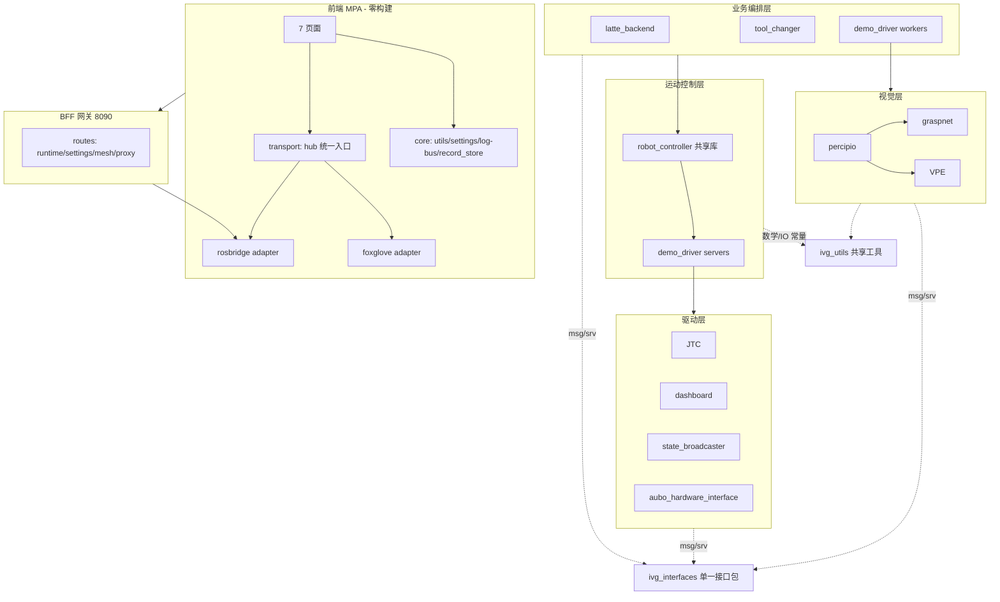

# IVG 全项目深度审查与优化方案

> 审查日期：2026-06-12
> 方法：以 `aubo_ros2_ws/start_aubo_new_driver.sh` 为入口，三轮递进式源码审查（启动链+全包盘点 → 包内部实现 → 配置/驱动/算法/前端细读）+ 仓库根盘点 + **第四轮质疑驱动复审**（调用点追踪 + 运行时日志/服务图验证）。约 150 条确证问题，全部人工核验到 文件:行号。源码为唯一真相，注释/文档按源码修正喵~
>
> **复审纪律**（第四轮固化）：任何"必失败/永不/白屏"级论断必须同时满足 ① 可疑代码在实际执行路径上（调用点已追踪）② src 与 install 两份均核验 ③ 有运行时证据（`~/.ros/log` 日志或 ROS graph）。注意陷阱：`ros2 service list` 会列出**仅有 client 无 server** 的服务（须用 `ros2 node info` 区分 Servers/Clients 段定论）喵~

---

## 目录

1. [项目健康度总评](#一项目健康度总评)
2. [P0 — 功能直接不可用](#二p0--功能直接不可用)
3. [P1 — 真机正确性/安全性](#三p1--真机正确性安全性)
4. [P2 — 行为/体验修正](#四p2--行为体验修正)
5. [删除清单](#五删除清单零引用实证)
6. [仅记录 / 需真机验证项](#六仅记录--需真机验证防误判)
7. [仓库根盘点与处置](#七仓库根盘点与处置)
8. [目标软件设计框架](#八目标软件设计框架)
9. [注释/文档按源码修正清单](#九注释文档按源码修正清单)
10. [执行路线与验证闭环](#十执行路线与验证闭环)

---

## 一、项目健康度总评

| 维度 | 结论 |
|------|------|
| 包结构 | 健康：14 个 colcon 包全部接入启动链（11 直接启动 + aubo_description/ivg_interfaces/ivg_utils 依赖），无孤立包 |
| 核心链路 | 真机主链可用，但存在 7 处服务名漂移、JTC 并发缺陷、cancel 不停止发送等真机正确性问题 |
| 前端 | 2 页白屏级缺陷、设置保存必 500、约 15 处生命周期/订阅泄漏；零构建 MPA 架构本身合理 |
| 算法层 | VPE 抓取角度走源码自标 "Buggy" 的 2D 路径（修正版已实现仅打日志）；相机断线自愈链断裂 |
| 冗余度 | 约 60 项零引用死代码/死配置/死文件；文档与源码矛盾 30+ 处 |

**仲裁剔除的误判**（防止错误修复）：
- `tools.yaml.mesh_visual` 并非死字段 —— BFF `gateway/routes/tool_geometries.py:121` 在消费
- `foxglove_transport.js` 问题实为 `debug_panel.html` 引用不存在的 `js/core/n.js`
- "`aubo_description` 大量 mesh 缺失" 不成立 —— visual（7 DAE + 16 STL）与 collision（23 STL）齐全
- **"publish_grasps 真机夹爪 IO 必失败" 不成立**（用户质疑后经源码+运行日志复核）—— `runOneCycle` 步骤 5/7/10 实际走 `robot_->setGripper()` → `/set_robot_io`（正确）；指向 `/aubo_driver/set_io` 的 `setGripperIo()`/`aubo_set_io_client_` 全文件零调用，是死代码；运行日志证实启动仅打一条无害 WARN（"服务 /aubo_driver/set_io 未就绪"），抓取循环 IO 全部正常。降级为死代码清理项
- **"视觉抓取页 #conn-status/#result-mjpeg/#cam-mjpeg 缺失为 P0 缺陷" 降级**（第四轮复审）—— 三处全部有 `if (!el) return` 空保护（vision_grasp_panel.js:271-272、subscription_binder.js:46-48,54-60），静默无操作不崩溃；工件模式结果图实际走 `#result-foxglove-canvas`，旧 img 分支为迁移残留。降级为 P2（连接状态指示缺失）+ 死路径清理

**第四轮运行时复证**（2026-06-12 09:55 会话，真机模式）：
- `/aubo_driver/get_fk|get_ik|set_io` 在 ROS graph 中**仅有 CLIENT 无 SERVER**（`ros2 node info` 区分段确认；foxglove_bridge 的条目亦为 client）—— 服务名漂移论断坐实；注意 `ros2 service list` 会列出仅 client 服务，勿被误导
- `/aubo/get_fk`、`/aubo/get_ik`、`/set_robot_io`、`/latte/run_workflow`、`/set_display_tool` 均有 server 在线；`/set_latte_do2|do4`、`/latte_di_status` 不存在 —— 无提供者论断坐实
- dashboard 正常 `configured (20 services)` + `activated`；graspnet 正常发布抓取位姿；`_pcv.start()` 论断经 `pointcloud_viewer.js:193-200` 导出表核实成立（无 start/isConnected）

---

## 二、P0 — 功能直接不可用

| # | 问题 | 位置与证据 | 解决方案 |
|---|------|-----------|---------|
| 1 | debug/tf_monitor 两页 JS 全部失效 | `web/public/js/debug_panel.js:3`、`tf_monitor_panel.js:3` import 不存在的 `core/record_store.js`（**src 与 install 均已核验缺失**；ES module 解析失败 → 静态 HTML 可渲染但全部交互死亡） | 新建 `js/core/record_store.js`（localStorage 实现 load/save/clearRecords） |
| 2 | 设置保存必 500 | `aubo_ros2_web_dashboard/config.py:219-224` 用 `os.fdopen/os.replace/os.unlink` 但全文件无 `import os`（**src 与 install 均已核验**） | 补 `import os` |
| 3 | 视频代理路由 404 | `gateway/routes/upstream_proxy.py:348` 空 `APIRouter()` 覆盖 30 行带 `/api/ivg/proxy/web-video/*` 路由的同名变量 | 删除 348 行 |
| 4 | debug 页脚本 404 + 点云按钮 TypeError | HTML 引用不存在的 `js/core/n.js`；`debug_panel.js:1114-1121` 调 `_pcv.start()/isConnected`，`pointcloud_viewer.js:193-200` 未导出 | 删 script 标签 + 对齐 viewer API |
| 5 | 拉花前端脱节 + **预览安全隐患** | `latte_controls.js`：livePreview 默认开启（58 行）+ 200ms 防抖直调 `/latte/run_workflow`；`RunLatteWorkflow.srv` 请求体为空、无 preview 概念 —— **调用即真机执行**（当前因 rosbridge 字段校验失败而"安全地坏着"）；519/574/602 行参数前缀 `latte_imitation:`（节点已删，后端实为 `latte_workflow_node` + `lwf_*`，运行时已确认 `/latte_workflow_node/*` 参数服务在线）；UI 4 种图案 vs 后端仅 heart | 预览/执行解耦（预览本地渲染或移除）；执行 = `/rosapi/set_param` 写 `latte_workflow_node:lwf_*` + 空请求调服务；图案仅 heart |

---

## 三、P1 — 真机正确性/安全性

### 3.1 驱动层（aubo_driver_ros2 / demo_driver / tool_changer）

- **JTC 并发缺陷**（`joint_trajectory_controller.cpp`）：
  - `precomputed_/precomputed_idx_` 在 sendLoop 线程（133-165）与 action 回调线程（74-75,219）间无锁读写；`has_active_goal_/active_goal_` 同样跨回调组无同步 → mutex 保护
  - **`handleCancel` 仅 return ACCEPT（65-66）不停止发送**，全文无 `is_canceling()` —— 安全相关 → cancel 路径调 `abortActiveGoal()` 并返回 canceled
- **dashboard**（`aubo_dashboard_node.cpp`）：
  - `onGetFK/onGetIK` 未连接时 `return` 不填响应（595,617）→ 填 success=false+message
  - `on_cleanup`(157) 与 `on_shutdown`(168) 均无条件 `hw_->shutdown()` → 二次 logout，加幂等防护
  - `restoreTcp2CanIfNeeded()`(213-221) 零调用 → 删除并注明 Dashboard 不进 TCP2CAN 的不变量
- **硬件接口**（`aubo_hardware_interface.cpp`）：
  - `readFullIOStatus` 忽略 SDK 返回值恒返回 true（288-289,353）→ 检查返回值
  - **工具 IO 字段映射断裂**：数字量读数全部填 `digital_outputs`（334-341），而 `read_robot_io_server.cpp:120-128` 的 `tool_digital_input` 查询 `digital_inputs` —— 永远读不到；模拟量同构 → 修复前先核 SDK `GetAllToolDigitalIOStatus` 语义
- **state_broadcaster**：注册回调 `event_cb=nullptr`（50-51），断连后 `is_online` 永真 → 注册事件回调
- **服务名漂移 7 处**（dashboard 实注册 `/aubo/get_fk`、`/aubo/get_ik`、`/set_robot_io`，全启动链无 remap）：
  - `get_current_state_server.cpp:31`、`plan_trajectory_server.cpp:30`、`set_robot_pose_server.cpp:52` → `/aubo_driver/get_fk|get_ik`（仅 MoveIt 回退兜底）
  - `debug_panel.js:368,408,454`、`compute_dock_ik.py:46`（`/aubo_dashboard/get_ik`）
  - 注：`publish_grasps_client_worker.cpp:62` 的 `/aubo_driver/set_io` 经复核为**零调用死代码**（实际夹爪 IO 走 `robot_->setGripper` → `/set_robot_io`，运行日志验证正常），归入删除清单而非服务名修复
- **workers**：
  - `execute_grasp_pose_worker.cpp`：单次抓取 `runOneCycle()`(819) 不设 `cycle_in_progress_`，可与循环抓取并发驱动机械臂 → RAII 互斥
  - `gripper_swap_worker.cpp:619-631`：释放阶段 IO 已开（`tool_released=true`）后运动失败 → 软件状态丢失无恢复；642-645 取工具失败不回 home → 补状态恢复/回 home 路径
- `services.js:280` 用废弃 `demo_interface/srv/MoveToPose`（服务端 `gripper_swap_worker.cpp:765` 实为 `ivg_interfaces`）→ 改类型

### 3.2 相机栈（percipio_camera / camera_control）

- `percipio_device.cpp:461-470`：`Release()` 不置 `alive=false`；`Reconnect()`(165-177) 不重注册 `TYRegisterEventCallback`(608-614) → **二次掉线无法自动重连**
- `percipio_camera_node_driver.cpp:63-74`：枚举/初始化失败 `while(true)` 忙等无退避
- `percipio_camera_node.cpp:953-1008`：深度点云过滤无效点后不 `resize`（对比彩色 943-946 有）
- `percipio_camera_node.cpp:330-346,475-488,882`：运行时开 `color_point_cloud_enable` 不创建 publisher 即解引用
- `exposure_time/gain` 未在相机节点声明（110-196，且全包无 `allow_undeclared_parameters`），camera_control `set_parameters` 下发将失败（代码级确证；本次运行会话无人调参，真机调参时显现）
- `camera_control_node.cpp`：`camera_id` 校验与软触发不一致（238 vs 343）；`is_connected_` 默认 true 且忽略 `DeviceTimeout`（101,196-200）；`/camera_status` 曝光/增益从不回读（207-212 空 try）
- `percipio_device.cpp:703-724`：GigeE2.1 TOF 参数空操作返回 true；1228-1241 去畸变把 RGB 缓冲标 BGR 传 SDK
- `percipio_camera.launch.py:16`：`serial_number` 默认值含内嵌引号

### 3.3 VPE / graspnet / hand_eye

- **抓取角度双路径（最高价值）**：`pose_estimator.py` 修正版 3D 角度（`dtheta_3d_correct`/`R_z_correct`，1067-1189）已实现但仅打 `[VPE_VERIFY]` 日志，`result.T_B_E_grasp`(1227) 仍用 2D 角路径，源码日志自标 "Buggy vs Correct"（1240-1252）→ **先收集真机 [VPE_VERIFY] 日志确认偏差，再切换，不盲切**
- `main.py:40` 声明 `depth_scale/depth_search_radius` 但未接线，`pose_estimator.py:1114-1119` 硬编码 0.00025
- `ros2_communication.py`：`update_params` 不刷新 PoseEstimator（1926-1941）；`params_json` 硬编码写 preprocessor 段（1916）；`list_templates` 返回工件 ID 当模板 ID（1868-1875）；`_validate_images` 失败不填 message（1096-1099）；rembg 成功仍打错误 warning（1401-1413）
- `pose_estimator.py:1127-1131`：模板中心深度直接用目标深度且前提注释错误
- `ParamsManager` 未 `load()` 即 `save()`（`node_runtime.py:100` + `native_api.py:757`）→ 首次改参截断 `debug_thresholds.json`
- `feature_extractor.py:460-467`：阀体圆失败静默返回角度 0；`ivg_utils/math.py:115-119` 只用 `contours[0]` 算外接矩形
- `graspnet_demo_points_node.py:383-387`：TF 查询用最新时间非点云时间戳；281 行每次推理 `np.random.seed(1)`
- hand_eye：`solver_method` 归档硬编码 TSAI（1505-1516）；`camera_topic/robot_status_topic` 声明未用；launch 传节点未声明的参数

### 3.4 前端生命周期与交互

- `latte/main.js:303-309`：onPause 已 unsubscribeAll，onResume 不重建订阅 → 后台切回订阅全丢
- hub 路径清理缺口：`ros.js:197-206` unsubscribe 不清 `hub._subRegistry`；`disconnect()` 不关 foxglove；`foxglove/adapter.js:37-50` 重连累积 handler；`client.js` 不清 `_pendingCalls`
- `log-ros-bridge.js` 仅 patch `ivgTransport.callService`，hub 路径调用不被记录
- **Foxglove 图像话题冻结**：`vision_grasp_panel.js:102-106` 仅初始化时取默认 topic，改设置不生效
- 左栏 URDF 面板 `forceUrdfOnly` 下仍订阅 `/grasp_markers`+点云（HTML 隐藏域 251-252 + `session.js:568,645`）；`/tool_changer_status` 双路订阅（`urdf_panel.js:76` + panel:421）
- `projection_overlay.js:14-24` 加载即全局劫持 `console.log`；441-443 自动勾选 graspnet 覆盖用户选择
- `callGripperSwap` 同工具早退不调 `done`（`services.js:112-114`）
- 泄漏：`monitoring-collapse.js` destroy 不移除 resize 监听（112,119-122）；`joint-chart.js` ResizeObserver 无 teardown（226-234）；`ivg_status_bar.js` setInterval 永不清理（162-168）
- （由 P0 降级）`#conn-status` 连接状态指示缺失（vision_grasp/tf_monitor 两页，有空保护无害）；`#cam-mjpeg`/`#result-mjpeg` 旧 img 分支为 Foxglove 迁移残留死路径 —— 补状态指示元素或删旧分支
- 设置键三方断裂：`defaults.yaml:73` `topic-tool-status` vs `config.js:20` `topic-tool-changer-status`；拉花 IO（`defaults.yaml:101-104` 键 `ivg_vision_grasp_topics_v3` vs `coffee_latte_io.js:12` 键 `ivg_latte_settings_v1` vs HTML id `topic-latte-di`）；`vision_grasp_panel.js:421` 硬编码话题 → 以 `defaults.yaml` 为单一数据源统一
- `/set_latte_do2|do4`、`/latte_di_status` 全 src/ 无提供者（原 latte_io 随 latte_imitation 删除）→ 实现时确认：隐藏 UI 或用 `/set_robot_io` 指定 pin 重定向
- `settings_panel.html` 是 7 页中唯一未引 `log-ros-bridge.js` 的 → 补一行

---

## 四、P2 — 行为/体验修正

- `lwf_heart_roll_draw` 非动态时无效：`latte_trajectory.cpp:254-257` 固定传 `roll_draw_start` → 非动态分支改用 `hp.roll_draw`
- 日志数字错误：`scene_attach_worker.cpp:484-486` wait 2s 报"超时(5s)"；`latte_workflow_node.cpp:616` 5 段报"(3段)"；`projection_overlay.js:434` 注释 20 帧实际 60 帧
- `tool_changer/scripts` 未 install（CMake 无 `install(PROGRAMS)`）→ 补 install
- `log-bus.js` `clear` 跨页不同步（onmessage 只处理 `type==='log'`，376-378 vs 245-248）；`log_panel.js:111-117` rAF 批渲染遇 null 丢同批后续；`settings_panel.js:188-211` 按钮无 null 防护
- 设置 POST 读-改-写无并发保护（`config.py:199-212`，低频，文件锁或记录）
- 启动脚本：恢复 [16] rosbag 录制段（`SKIP_ROSBAG`/`IVG_ROSBAG_FULL`/`IVG_ROSBAG_TOPICS` 三模式）；删 `cleanup()` 中已删包 pkill（58-59）；步骤编号按实际执行顺序重排（现 0,1,2,2.5,15,3,4,6,7,14,8,9-12,13）；`start_latte_test.sh:125` 传 launch 不声明的 `use_fake_hardware:=true`

---

## 五、删除清单（零引用实证）

### 5.1 前端（`aubo_ros2_web_dashboard/web/public/js/`）

| 项 | 依据 |
|----|------|
| `core/ros_connector.js`、`entities/ui_state_store.js`、`core/settings.js` | 全局零 import |
| `core/foxglove_transport.js` + debug_panel.html 的 `n.js` 标签 | n.js 不存在，shim 零引用 |
| `transport/foxglove/vendor/` 除 `foxglove_cdr.js` 外 10 个拆分件 | 仅 cdr（自包含 3844 行）被 `adapter.js:12` 引用；`MessageWriter.js:15` import 不存在的 `stringLengthUtf8.js` |
| `ros.js` `onControlJson/_controlHandlers`、`hub.js:174-195` `setMode` 死分支 | 零调用 |
| `layoutVisionUrdfViewer`(301)、空壳 `refreshAiGraspnetColorImages`+白跑 setTimeout(344-366)、`_lastDrawState`、`buildBridgeSelector/updateBridgeDot`、`btn-dbg-move-xyz` 死绑定、内嵌 `#topic-settings-modal` 死路径 | 零调用/零 DOM |

### 5.2 C++

| 项 | 依据 |
|----|------|
| `demo_driver/include/demo_driver/movel_server.h`、`set_robot_io_server.h`、`system_logger.h` | 无 .cpp、未进 CMake |
| `system_monitor_node.cpp` + `NodeStatus.msg` + `SystemLog.msg` + CMake/接口注册 | 已确认删除：未被 launch，msg 无消费者 |
| JTC：`feedback_pub_`(38)、`blendToFirstPoint` 声明、6 个死成员、`readerwriterqueue.h` include | 零使用（feedback 实由 state_broadcaster 发布） |
| `readDiagnosisOnStatus()`(196-206)、`restoreTcp2CanIfNeeded()`(213-221) | 零调用 |
| execute_grasp 两 stub（`buildGraspToEndEffectorTransform` 返回单位阵、`createOrientationFromZRotation`） | 注释自证 |
| `robot_controller.h:42` `moveToPosition` 声明、`read_robot_io_server::spin`、`set_robot_enable_server::spin`、set_speed_factor 无用 cb 组 | 无实现/零调用 |
| gripper_swap：`runCartesianPath`(330-382)、`setGripperIo`(401-424)、`initMoveGroup()` 声明 | 零调用/无实现 |
| publish_grasps：`kAuboSetIOService`(62)、`aubo_set_io_client_`(186)、`setGripperIo()`(316-360)、`waitForServices` 误导 WARN(309) + 79/1068/1094/1137 行过时注释文案 | 零调用（实际走 `robot_->setGripper` → `/set_robot_io`，2026-06-12 运行日志验证）|
| percipio `StreamDistortionMapInit`(958-1062) | 零调用 |

### 5.3 配置

| 项 | 依据 |
|----|------|
| xacro `use_fake_hardware`（宏体硬编码 `fake_components/GenericSystem` 不引用参数）、`ros2_control_hardware_type` | 死参数 |
| `moveit_controllers.yaml`（`moveit_manage_controllers=False` 且无 launch 引用）、pilz 两 yaml、`joint_names.yaml` | 孤儿配置 |
| `lwf_approach_height`、`lwf_heart_verbose` | 声明并读取但零消费 |
| `tools.yaml` 各工具 `dock_pose` 字段（**`mesh_visual` 保留**——BFF 在用） | 三消费者均不读 |
| `graspnet_ros2/package.xml` `<depend>ivg_interfaces</depend>` | 全包零引用 |
| aubo_moveit_config 8 个模板 launch（demo/move_group/rsp/spawn_controllers/warehouse_db/setup_assistant/moveit_rviz/static_virtual_joint_tfs） | 不被脚本/文档引用 —— **删除前再确认** |

### 5.4 Python

| 项 | 依据 |
|----|------|
| `web/resources.py:158-192` 两个 resolve 函数、`node_runtime.py:661` `write_plc_register`+死字段 | 零调用 |
| hand_eye：`current_point_cloud`、3 个 `_opencv_*` 死函数（2783,3263,3415）、恒 None 的 `current_camera_info` 路径 | 零调用/已断链 |
| `pose_estimator.py:371-384` 委托残留、未用形参 `camera_matrix`(138) | 零调用 |
| `demo_driver/scripts/` 7 个分析脚本 | 不在启动链 —— 移至 tools/ 或 README 标注，不直接删 |
| `start_IVG_graspnet_points_fastapi_web_legacy.sh` | 已确认删除 |
| `start_hand_eye_calibration.sh:62-66`（启动已删除的 `percipio_camera_interface`/`image_data_bridge`）修正；`start_web_ui.sh:46` 补 `enable_image_data_converter:=true` | 引用已删包 |
| `hand_eye/web/static/` 未被模板引用的旧脚本（`script` 无扩展名、`script_v2_auto_calib_addon*` 等，删前核模板） | 多套并存 |

### 5.5 用户决定保留（仅文档标注）

ivg_interfaces 13 个零引用接口（8 msg + 5 srv，含 `Movel`/`SetIO`/`IOStates` 簇）、`ivg_utils.io/robot` 模块、`robotwebtools/ros2djs/`、hand_eye tests 的 `.bak` 与 9 个 `test_*.html`、`aubo_ros2_ws/11.zip`（349MB 未核）、graspnet `publish_grasps_client` console_script（标注"仅独立调试"）

---

## 六、仅记录 / 需真机验证（防误判）

- **VPE 角度修正切换** —— 需真机 `[VPE_VERIFY]` 日志确认偏差后执行（带验证门槛的 P1）
- `step4_pour()` 被注释（`latte_workflow_node.cpp:219`）—— 可能是真机调参结论，只报告不恢复
- 手眼 TF 取逆三处语义不一致（`hand_eye_static_tf_node.py` 不取逆 vs `hand_eye_calibration_tf_publisher.py`/VPE 取逆）—— 真机链路若正常说明 YAML 语义匹配前者，仅文档记录
- SRDF `gripper1milkcup_Link` ACM 激活但默认 URDF 无此 link（MoveIt 仅警告）；SRDF manipulator 链不含快换支路（设计现状）
- demo 节点未加载 `kinematics.yaml`（solver 配置与 move_group 不一致，影响未知）
- VPE/hand_eye 线程模型（FastAPI 同步路由阻塞 event loop、跨线程 create_subscription、Flask 与主线程双 spin、图像全局状态无锁）；graspnet 单线程 spin + GPU 推理阻塞、`_latest_pc_msg` 无同步、PoseArray 不带 Z 翻转（下游已处理）—— **架构级，单独立项**
- `path_resolver` vs `resources` 双轨：内参候选路径不一致（`calibration_results/ost.yaml` vs `calibrationdata/ost.yaml`）→ VPE 节点可能找不到内参而 Web 可以 —— 后续高优先
- percipio `point_cloud_enable` 与 color 互斥行为正确（launch 默认值有误导性）
- 三 Web 入口（8070/8088/8090）、8 server 进程合并、`aubo_hardware_interface.cpp` 4 target 重复编译（无 static 状态）、TimerAction 魔数、双 WebSocket 设计、`aubo_callback_monitor` 保留

---

## 七、仓库根盘点与处置

| 路径 | 性质 | 处置 |
|------|------|------|
| `tmp/`、空 `Web/` | 临时/空占位 | 删除 |
| `RVIZ-RQT-VISUAL/` | 独立 Vue/FastAPI 可视化实验仓（~81M），Bridge v3 成果已反哺主项目 | 归档标注，不进构建链 |
| `latte_art_robot_research/` | 调研资料 + 少量脚本（硬编码旧路径） | 保留归档（设计溯源） |
| `.scratch/old-web-comparison/` | 旧版 Web 快照 | 归档标注 |
| `CONTEXT-MAP.md` | 指向不存在的 `docs/USAGE.md`、`docs/architecture.md` | 修复链接指向现有文档 |
| `.gitignore:108,122` | 仍含已删除的 `latte_imitation` 规则 | 清理 |
| `docs/superpowers/plans/2026-05-26-single-arm-latte-art.md` | 针对已删包的旧计划 | 标注"已被 latte_backend 替代" |
| `pyrightconfig.json`、`skills-lock.json` | 工具链 | 保留（pyright 路径按本机修正） |

---

## 八、目标软件设计框架

以**最小重构**收敛，不推翻现有包结构。

### 六条设计规则（本次修复的依据）

1. **服务命名单一注册表**：所有 SDK 服务名以 `aubo_dashboard_node.cpp` 实际注册为准（`/aubo/*` + `/set_robot_io`），常量化进 `ivg_interfaces` 头/`topics.js` —— 消灭本次 7 处硬编码漂移的根因
2. **共享代码以库链接，不复制源文件**：`robot_controller` 仅以 `demo_driver::robot_controller` 共享库被消费（tool_changer 改造，消除选择性构建版本漂移）；跨 worker 重复的抓取运动/数学函数下沉 `ivg_utils` 或共享库
3. **配置单一数据源**：前端设置项 = BFF `config/defaults.yaml` 唯一 schema；工具几何 = `tools.yaml`；轨迹参数 = `lwf_*` ROS 参数（前端经 rosapi 读写）
4. **线程模型规约**：驱动层跨线程共享必 mutex/atomic；SDK 回调只做 atomic 写；service 回调不长阻塞；前端订阅/定时器/监听器必须对称清理
5. **传输层单轨化（方向）**：前端以 `transport/hub` 为唯一连接入口，`ivgTransport` 直连路径逐步收编（本次修清理缺口与日志桥绕过，整轨合并列后续）
6. **预览与执行物理隔离**：任何触发真机运动的服务调用必须由显式用户操作发起

### 后续架构项（单独立项）

- VPE/hand_eye 线程模型重设计（执行器隔离、去全局可变状态）；hand_eye 5380 行单体拆分
- `path_resolver`/`resources` 路径解析统一；三套调试参数机制（config_reader/params_manager/config.py）合并
- 三 Web 入口整合到 BFF；8 个 demo_driver server 进程合并为多服务节点
- VPE 抓取角度切换到修正路径（真机日志确认后）；传输层整轨合并

---

## 九、注释/文档按源码修正清单

- **CLAUDE.md**：删 `SKIP_RVIZ`（脚本无实现）；latte launch 包名 `aubo_moveit_config`→`latte_backend`；前端目录树（`latte/execute.js`、`preview.js` 不存在）；遗留目录表（本地 moveit 复刻已不在 src/）；`forceContextLoss` 描述与实现不符；`/set_latte_do2|do4` 按提供者结论更新；标注 13 个零引用接口与保留项
- **launch/xacro/头文件**：`aubo_new_driver.launch.py` "真机/仿真分支"注释 vs 恒 fake mapping；`aubo_e5.ros2_control.xacro` 宏参数误导；`aubo_hardware_interface.h:153-157` 流控描述（实际在上层 JTC）；state_broadcaster "Event 自行处理"实为 nullptr（51）；关机日志 "leave TCP2CAN" 从未进入（269）；`MoveToPose.srv:16-17` "SDK MoveL" 实为 MoveIt `computeCartesianPath`
- **hand_eye/camport**：标定 YAML `description` "相机→基座" vs TF 节点按 "相机→末端" 取逆使用（5803-5807 vs tf_publisher:99-107，统一表述）；`image_data_converter_node.py:6-7` 旧包名；camport README 包列表（12-15）；hand_eye README 话题/类型（120-125）；"不用 CameraInfo" vs API 文案矛盾
- **VPE**：模块头 "2D 对齐矩阵" 不存在；`template_standardizer` "旋转到标准方向" 实为不旋转（93-94）；`load_template_poses` 文档语义；`T_C_E` 注释方向反（254）；`update_params` "所有模块" 实为两个；`moveit2_tcp_pose_publisher.py` "MoveIt2 FK" 实为 TF lookup 且默认 link 与规划链不一致
- **latte/tool_changer README**：step4 状态列（实际被注释）、45° 基准、`roll_draw` 回退语义、step5 段数、补 `dock_above` 回退字段说明
- **过时注释**：`gripper_swap_worker.cpp:400`、`execute_grasp_pose_worker.cpp:58` 的 `/aubo_driver/set_io`→`/set_robot_io`；`compute_dock_ik.py:10`；`settings_panel.html:20` "本地存储" 文案（实际双写 YAML）

---

## 十、执行路线与验证闭环

| 阶段 | 内容 |
|------|------|
| P0 | 6 项白屏/500/安全缺陷（record_store、import os、空 router、n.js、_pcv、拉花前端重写、DOM 对齐） |
| P1 驱动 | JTC 加锁+cancel、dashboard 响应/双 logout、工具 IO 映射（先核 SDK）、state_broadcaster 回调、worker 互斥、快换状态恢复、服务名 7 处 |
| P1 相机/VPE | percipio 自愈链 6 项、camera_control 3 项、VPE 参数/接口 6 项 |
| P1 前端 | 生命周期清理、Foxglove 话题冻结、设置键统一、拉花 IO 决策 |
| P2 | roll_draw、日志数字、SN 引号、脚本恢复 rosbag/重排/删 legacy |
| 删冗余 | 五类删除清单（见第五部分） |
| 模块化 | tool_changer 链接库、C++ 去重 4 处、前端工具收敛 |
| 文档 | 30+ 处按源码修正（见第九部分） |
| 仓库根 | tmp/Web 删除、CONTEXT-MAP 修链、.gitignore 清理 |

**带门槛项**：VPE 角度切换（真机日志）、工具 IO 映射方向（SDK 语义）、8 个模板 launch 删除（再确认）。

**验证**：
1. `colcon build` 全量 + `bash -n start_aubo_new_driver.sh`
2. `SKIP_BUILD=1 ./start_aubo_new_driver.sh` 实测（rosbag 生成 + Ctrl+C metadata.yaml 写出）
3. 7 页面逐页冒烟（debug/tf_monitor 能加载、settings 保存 200、coffee_latte 参数走 `latte_workflow_node:lwf_*`、视觉抓取改话题生效、视频代理 curl）
4. **安全验证**：拉花预览零真机调用；JTC cancel 后停止发送（仿真）；快换失败路径状态一致
5. 仿真空请求调 `/latte/run_workflow` 确认契约；`colcon test` 相关包
