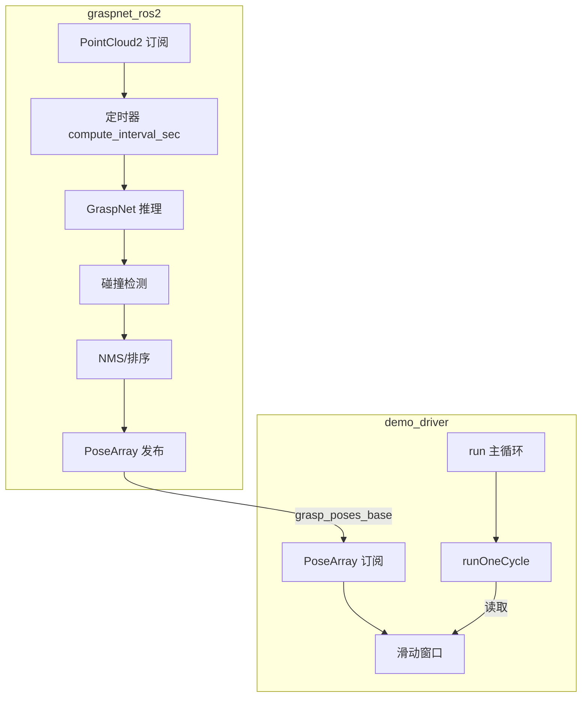

# Grasp 抓取放置调用逻辑

## 一、整体架构



**数据流**：点云 → GraspNet 推理 → base_link 下 PoseArray → C++ 订阅 → 窗口缓存 → 选优 → 运动执行

---

## 二、Python 侧：graspnet_demo_points_node

### 2.1 启动流程

```
main()
  └─ GraspNetDemoPointsNode.__init__()
       ├─ 加载模型 (_load_model)
       ├─ 订阅 PointCloud2 (input_pointcloud_topic)
       ├─ 创建定时器 (compute_interval_sec)
       ├─ 发布 grasp_poses_pub (grasp_poses_topic)
       └─ 发布 marker_pub (marker_topic)
```

### 2.2 定时循环

```
_timer_callback() [每 compute_interval_sec 秒]
  └─ _compute_grasps(_latest_pc_msg)
       ├─ _get_and_process_data()   # PointCloud2 → end_points
       ├─ _get_grasps()             # 网络推理
       ├─ _collision_detection()    # 碰撞检测
       ├─ gg.nms() / sort_by_score  # 后处理
       └─ 写缓存 processed_gg
  └─ publish_marker_array()
       ├─ 发布 MarkerArray
       └─ 发布 PoseArray 到 grasp_poses_topic (base_link 下)
```

### 2.3 关键话题

| 订阅 | 发布 |
|------|------|
| `input_pointcloud_topic` (PointCloud2) | `grasp_poses_topic` (PoseArray, base_link) |
| | `marker_topic` (MarkerArray) |

---

## 三、C++ 侧：publish_grasps_client_worker_node

### 3.1 main() 入口

```
main(argc, argv)
  ├─ rclcpp::init()
  ├─ PublishGraspsClientWorker::create(options)
  │    ├─ 构造节点
  │    └─ initMoveGroup()
  ├─ MultiThreadedExecutor + 后台 spin 线程
  ├─ 注册 SIGINT/SIGTERM 处理
  ├─ waitForServices()  # 等待 Aubo SetIO
  ├─ node->run()        # 主循环（阻塞）
  ├─ onShutdown()       # 回安全位、开夹爪
  └─ rclcpp::shutdown()
```

### 3.2 run() 主循环

```
run()
  while (rclcpp::ok() && !shutdown_requested_ && (max_cycles < 0 || cycle_count < max_cycles))
    success = runOneCycle()
    if success:
      cycle_count++
      success_count++
      publishStatus(...)
    else:
      fail_count++
      sleepInterruptible(fail_retry_delay_sec)
    sleepInterruptible(cycle_delay_sec)
```

### 3.3 runOneCycle() 单周期（11 步）

```
runOneCycle()
  ├─ [0] moveToHome()               # 回安全位，识别前到位
  ├─ [1] clearGraspWindow()         # 清空旧数据
  ├─ [2] waitForGraspWindowReady()   # 等待 >= min_groups_before_pick 组
  ├─ [3] selectBestFromWindow()     # 选优（prefer_vertical 或 latest）
  ├─ [4] buildGraspToEndEffectorTransform() + applyTransformationToPose()
  │      # gripper_tip → end_effector 变换
  ├─ [5] runGraspApproach()         # 4 点笛卡尔抓取接近
  ├─ [6] setGripperIo(true)         # 闭夹爪
  ├─ [7] runArcPath('z', lift_offset)  # 抬起
  ├─ [8] moveToPose / moveToJoints  # 移动到放置位
  ├─ [9] setGripperIo(false)        # 开夹爪
  └─ [10] moveToHome()              # 回安全位
```

### 3.4 订阅回调与窗口

```
graspPosesCallback(msg)
  if msg->poses 非空:
    加锁
      latest_grasp_poses_ = msg
      grasp_groups_window_.push_back(msg)
      若 size > grasp_window_size: pop_front
    解锁
```

### 3.5 runGraspApproach 内部

```
runGraspApproach(pose_ee, height_above, vel, acc)
  ├─ applyGraspZFlip180(pose_ee)    # GraspNet Z 轴 180° 修正
  ├─ getCurrentPose(eef_link)
  ├─ 构建 4 waypoints:
  │    p0: 当前位姿
  │    p1: 目标 XY + 安全高度，保持当前姿态
  │    p2: 同位置，quatSameHemisphere 抓取姿态
  │    p3: 目标 Z 下降
  ├─ computeCartesianPath() 重试最多 3 次
  ├─ 若 fraction<1 或 点数>60: 直接返回 false（不回退）
  └─ scaleTrajectoryTime + execute()
```

---

## 四、调用链汇总

| 层级 | 函数/流程 | 说明 |
|------|-----------|------|
| 进程 | main() | 初始化、创建节点、注册信号、run、onShutdown |
| 节点 | run() | 主循环，循环 runOneCycle |
| 周期 | runOneCycle() | 11 步：home→清空→等待→选优→变换→接近→闭夹爪→抬起→放置→开夹爪→home |
| 选优 | selectBestFromWindow() | 加锁读窗口，verticalityScore 或 latest |
| 运动 | runGraspApproach() | 4 点笛卡尔，Z 轴修正、quatSameHemisphere |
| 基类 | moveToHome, runArcPath, setGripperIo, moveToPose | MoveitGripperIoBase 提供 |

---

## 五、话题与依赖

| 话题 | 类型 | 方向 | 说明 |
|------|------|------|------|
| grasp_poses_base | PoseArray | GraspNet → Worker | base_link 下抓取位姿 |
| grasp_place_status | String (JSON) | Worker 发布 | cycle_count, success_count, fail_count |
| /aubo_driver/set_io | SetIO 服务 | Worker 调用 | 夹爪 IO 控制 |

---

## 六、循环数据生命周期

```
周期 N 开始
  ├─ moveToHome          # 机械臂在安全位
  ├─ clearGraspWindow    # 清空上一周期缓存的旧数据
  ├─ waitForGraspWindowReady  # 等待本周期新识别数据（GraspNet 定时发布）
  ├─ selectBestFromWindow    # 从新数据中选优
  └─ 执行抓取→放置→回安全位

周期 N 结束 → 周期 N+1 开始（重复）
```

**要点**：每周期必须先清空窗口，再等待新数据；否则会沿用上一周期已失效的抓取位姿。
