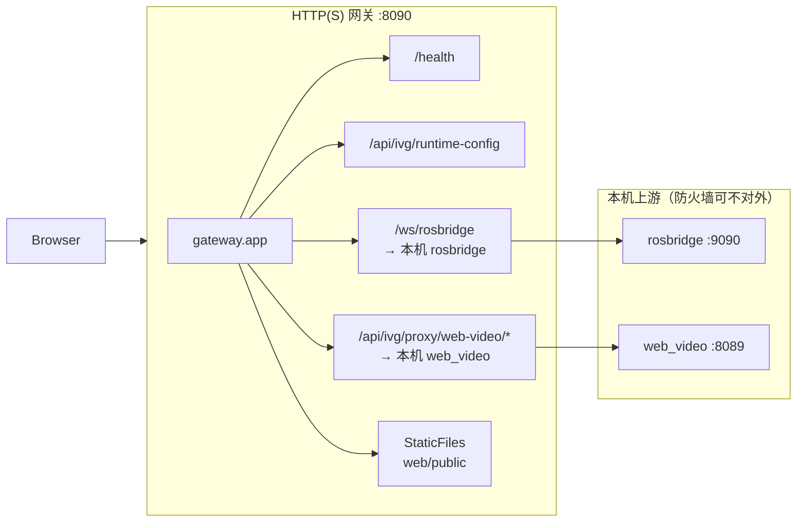

# aubo_ros2_web_dashboard

ROS 2 **ament_python** 包：灵视 IVG 现场 Web（门户、视觉抓取、咖啡拉花、ROS 控制台）。由 **FastAPI + Uvicorn** 在单端口（如 8090）提供：**静态页**、**BFF**、**rosbridge WebSocket 转发**（`/ws/rosbridge`）、**web_video_server HTTP 转发**（`/api/ivg/proxy/web-video/…`）。浏览器 **[roslibjs](https://github.com/RobotWebTools/roslibjs)** 连 **同源** WebSocket，由网关转到本机 **rosbridge_suite**；MJPEG 亦走同源路径，无需浏览器直连 9090/8089。其他业务 **FastAPI**（如视觉位姿）仍为独立进程，可按需并入同网关。

### 参考架构（GitHub / 社区常见「默认最优」组合）

| 路线 | 适用 | 要点 |
|------|------|------|
| **本包：定制 HTML + roslibjs + rosbridge_suite** | 现场 IVG 门户、话题控制台、与 RobotWebTools 示例对齐 | 实时交互走 **WebSocket → rosbridge**；HTTP 仅 **静态页 + 轻量 BFF**（`/health`、`/api/ivg/runtime-config`）。与 [roslibjs ROS 2 示例](https://github.com/RobotWebTools/roslibjs/tree/develop/packages/roslib-examples/src) 同契约。 |
| **FastAPI 作 HTTP 边界** | 统一端口、探活、配置下发、后续合并业务 API | 与许多 **ROS2 + 浏览器** 项目一致：**实时 ROS** 仍走专用 WS（rosbridge），**应用外壳与运维面** 走 FastAPI（本仓库已采用）。 |

前端解析 **`GET /api/ivg/runtime-config`** 中的 `rosbridge_ws_path`、`web_video_proxy_prefix`（及 `unified_proxy`，恒为 `true`）；WebSocket 与 MJPEG **不**直连 9090/8089。表单/URL 中的 `?rosbridge_port=`、`?web_video_port=` 仍可用于 **展示或与旧 UI 对齐**，实际连接始终经同源代理路径。

**架构图（Mermaid，可打印 A4）**：见包内 [`docs/architecture_diagrams.md`](docs/architecture_diagrams.md)（含总览/模块图、**各文件职责（文档第 5～6 节）**、**文件联系（第 7～8 节）**；`colcon` 安装后在 `share/aubo_ros2_web_dashboard/docs/`）。

### 包目录结构（ROS 2 `ament_python` 惯例）

与官方 `ros2 pkg create --build-type ament_python` 一致的核心布局：

| 路径 | 作用 |
|------|------|
| `package.xml` / `setup.py` / `setup.cfg` | 包元数据与 setuptools 安装规则 |
| `resource/aubo_ros2_web_dashboard` | ament 包名标记（空文件即可） |
| `aubo_ros2_web_dashboard/` | **Python 包**（`import aubo_ros2_web_dashboard`，含 `gateway/`、`fastapi_static_gateway`） |
| `launch/` | `ros2 launch` 用的 `.launch.py` |
| `test/` | **pytest** 用例（`test_*.py`），与教程中的 `test/` 目录名一致 |
| `web/public/` | 静态站点源文件，安装到 `share/.../web/public/` |
| `docs/` | 架构图等文档，可选安装到 `share/.../docs/` |
| `pytest.ini` | 限定 `testpaths = test` |

---

## ROS 2 Humble 及以上（唯一目标发行版线）

本包与下列 **Robot Web Tools / ROS 2 网页栈** 的文档、排障与示例均以 **Humble、Jazzy、Rolling** 等 **ROS 2** 为准，**不按 ROS 1（Noetic 等）路径设计**。

### 系统依赖（deb，示例）

将 `humble` 换成当前 `$ROS_DISTRO`：

```bash
sudo apt install ros-humble-rosbridge-suite ros-humble-tf2-web-republisher ros-humble-web-video-server
```

`rosbridge_suite` 会带上 **rosbridge_server、rosapi** 等；具体以 apt 解析为准。

### 官方栈（ROS 2 侧）

| 组件 | 作用 | ROS 2 说明 |
|------|------|------------|
| **rosbridge_suite** | WebSocket + rosbridge v2 JSON | 使用 `ros2 launch rosbridge_server rosbridge_websocket_launch.xml`（本包 launch 已 include）。**勿**把 [ros2-web-bridge](https://github.com/RobotWebTools/ros2-web-bridge) 作为新方案（上游 README 指向 rosbridge_suite）。 |
| **tf2_web_republisher** | 面向网页的 TF 节流 | 使用 **ROS 2** 分支说明中的 [Action 接口](https://github.com/RobotWebTools/tf2_web_republisher/blob/ros2/README.md)。 |
| **web_video_server** | HTTP 图像流 / 快照 | [ros2 README](https://github.com/RobotWebTools/web_video_server/blob/ros2/README.md) 写明支持 **Humble+**；关注 `qos_profile`、`/shutdown`、`client_id` 等。 |

### 浏览器端（与 Humble 协议对齐）

- **roslibjs**：以 monorepo 中 **[ros2 相关示例](https://github.com/RobotWebTools/roslibjs/tree/develop/packages/roslib-examples/src)**（如 `ros2_simple.html`、`ros2_action_*.html`）为契约；连接需处理 **`error` / `connection` / `close`**（见 [roslib README](https://github.com/RobotWebTools/roslibjs/blob/develop/packages/roslib/README.md)）。
- **ros2djs / ros3djs**：经 rosbridge 订阅 **ROS 2 话题类型**；示例见各仓库 [`examples/`](https://github.com/RobotWebTools/ros2djs/tree/develop/examples)、[`examples/`](https://github.com/RobotWebTools/ros3djs/tree/develop/examples)。**Three.js** 版本宜与 **ros3djs** 期望一致，避免与裸 `three.min.js` 混用版本导致渲染异常。
- 本仓库 `web/public/js/vendor/` 由 **`scripts/bundle_roslib2_browser.sh`** 从 npm 同步（默认 **roslib@2.1.0**、**ros2d@0.10.0**、**ros3d@1.1.0**、**three@0.89.0**、**easeljs@1.0.2**，均为当前 npm 上适用于 ROS2+rosbridge 的稳定组合）。**ros3d** 拷贝后会打补丁：官方 `PointCloud2` 使用 `throttle_rate||null`，会把 **`0` 误判成 `null`**，导致 Humble rosbridge 报 `Invalid value: None`。升级后建议与上述官方示例做一次冒烟（同机 Humble + 本 launch）。版本可用脚本内环境变量覆盖。

### 运维与优化（仅 ROS 2 语境）

1. **rosbridge**：若 WS 异常，先查 [rosbridge_suite TROUBLESHOOTING（ros2）](https://github.com/RobotWebTools/rosbridge_suite/blob/ros2/TROUBLESHOOTING.md)（例如 **Tornado** 勿被 `pip` 覆盖系统包）。本包 launch 已暴露 `max_message_size`、在新线程调用 service/action 等参数，大点云场景仍需 **ROS 侧降采样** 配合。
2. **web_video_server**：相机 QoS 与 `sensor_data` 等参数需与 **Humble 上实际发布节点**一致；多页面/组件释放流可参考官方 **`/shutdown`** 与 **`client_id`**。
3. **升级发行版**（如 Humble → Jazzy）：复查 **rosbridge / rosapi / tf2_web** 的 changelog 与消息类型字符串是否与前端一致。

### 开发约定：ROS 2 相关能力优先用官方库，避免重复实现

凡涉及 **标准 ROS 2 消息语义**（订阅/发布/服务/动作/参数、常用传感器与导航可视化），**应优先使用 [RobotWebTools](https://robotwebtools.github.io/) 已提供的客户端与示例**，不在业务代码里长期维护「第二套解析/渲染实现」。

| 需求 | 优先使用的官方/生态组件 | 本仓库现状与方向 |
|------|-------------------------|------------------|
| 与 ROS 2 通信 | **[roslibjs](https://github.com/RobotWebTools/roslibjs)**（`ROSLIB.Ros` / `Topic` / `Service` / `ActionClient` 等） | 已用 vendor `roslib.min.js`；**动作发送**应对照 [`ros2_action_client.html`](https://github.com/RobotWebTools/roslibjs/tree/develop/packages/roslib-examples/src) 扩展控制台，勿自造协议层。 |
| 2D 地图与栅格 | **[ros2djs](https://github.com/RobotWebTools/ros2djs)**（`ROS2D.Viewer`、`ROS2D.OccupancyGridClient` + `continuous` 等） | `topics_lab` 与官方 **`continuous.html`** 对齐：`OccupancyGridClient` 挂到 **`viewer.scene`**。上游 **无 dispose**，重复「停止再启动」可能叠订阅；可 **重连 rosbridge** 或刷新页面试测。 |
| 2D 激光 | ros2djs **无**专用 `LaserScan` 显示类 | 控制台 **2D 图** 不再叠雷达；激光用 **3D 图** 的 **`ROS3D.LaserScan`**（与 **`ROSLIB.ROS2TFClient`** 同栈）。 |
| 3D 点云 / 雷达 / Marker / URDF | **[ros3djs](https://github.com/RobotWebTools/ros3djs)**（[pointcloud2.html](https://github.com/RobotWebTools/ros3djs/blob/develop/examples/pointcloud2.html)、LaserScan、[markers.html](https://github.com/RobotWebTools/ros3djs/blob/develop/examples/markers.html) 等） | `topics_lab`：**Three r89** + **[roslib@2](https://www.npmjs.com/package/roslib)**（`js/vendor/roslib-2.iife.js`，含 **`ROSLIB.ROS2TFClient`**）+ **`ros3d.min.js`** + **`ROS3D.Viewer` / `Axes` / `Grid` / `PointCloud2` / `LaserScan` / `MarkerClient`**；需 **tf2_web_republisher**。 |
| 图像进浏览器 | **[web_video_server](https://github.com/RobotWebTools/web_video_server)**（HTTP `stream` / `snapshot`） | 已用；**`ivg_web_video.js`** 仅拼官方文档式 query（**不**默认注入 `client_id`）；需要时可自行传入 `client_id` 并配合服务端 **`/shutdown`**。 |
| TF 可视化 | **tf2_web_republisher** +（网页侧）官方 **roslib@2** **`ROS2TFClient`**（经 rosbridge `send_action_goal`）+ **ros3djs** | `topics_lab` 使用 **`roslib-2.iife.js`**（由 **`scripts/bundle_roslib2_browser.sh`** 从 npm 同步 **roslib@2** 并打包 IIFE；同脚本同步 **ros2d / ros3d / three / easeljs** 官方 min），无自研 TF 客户端。 |

**允许自研的范围**（非标准 ROS 库职责）：IVG 节点关系图布局、话题侧 JSON 摘要（`topics_lab/render.js`）、门户与业务面板编排、与 FastAPI 的 HTTP 跳转等。

---

## 前后端分层（对齐常见「FastAPI = HTTP 边界 + 静态托管」仓库）

与多数 **ROS2 + 浏览器** 开源项目一致：**实时 ROS** 仍走 **WebSocket（rosbridge）**；**HTTP** 只承担静态资源、探活、配置下发与可演进 BFF。Python 侧按职责拆子包，避免单文件堆叠路由与启动逻辑。



| Python 模块 | 职责（类 GitHub `app/` + `core/` 拆分思路） |
|-------------|---------------------------------------------|
| `gateway/settings.py` | 环境变量名、默认端口、`runtime-config` 载荷与包版本解析。 |
| `gateway/routes/health.py` | `APIRouter`：`GET /health`（读 `app.state.static_root`）。 |
| `gateway/routes/ivg_runtime.py` | `APIRouter`：`GET /api/ivg/runtime-config`。 |
| `gateway/routes/upstream_proxy.py` | `GET/HEAD /api/ivg/proxy/web-video/{path}` → 转发 web_video；`WebSocket /ws/rosbridge` → 转发 rosbridge。 |
| `gateway/app.py` | `create_app`：`app.state`、GZip、安全头、`include_router`（**先**代理与健康/BFF，**再**挂载 `StaticFiles`）。 |
| `gateway/cli.py` | `argparse` + `uvicorn.run`；与「应用工厂」分离，便于测试 import `create_app`。 |
| `fastapi_static_gateway.py` | **薄入口**：`python -m …` 与 `ivg_fastapi_static_gateway` 仍指向此模块，内部转调 `gateway`。 |

| 前端脚本（`web/public/js/`） | 职责 |
|------------------------------|------|
| `ivg_runtime.js` / `ivg_web_video.js` / `ivg_rosbridge_bytes.js` | 端口、MJPEG URL；**rosbridge 字节字段** `toUint8`（与 roslibjs 一致），供 topics_lab 摘要与 `ivg_image_canvas`。 |
| `ivg_image_canvas.js` | 仅 **vision_grasp**：`paintSensorImage`；**须**在 `ivg_rosbridge_bytes.js` 之后加载。topics_lab **不**加载此文件。 |
| `topics_lab/render.js` | **仅**消息类型 → HTML/Canvas 视图与 raw 摘要（无 Ros 状态）；topics_lab 专用。 |
| `ros_console.js` | 连接 rosbridge、侧栏 rosapi、订阅节流、2D/3D 视图、节点图 **编排**。 |
| `vision_grasp_panel.js` 等 | 业务面板。 |

---

## 框架总览（源码映射）

| 层级 | 组件 | 职责 |
|------|------|------|
| **ROS 2 进程** | `web_dashboard.launch.py` | 编排 rosbridge、tf2_web、web_video、FastAPI 子进程；经 `additional_env` 把端口交给网关。 |
| **HTTP 边界** | `gateway/` + `fastapi_static_gateway.py` | 静态 `web/public`、GZip、安全头；BFF 路由在 `gateway/routes/*.py`（`include_router`）；扩展时加路由文件并在 `app.py` 注册。 |
| **浏览器共享** | `js/ivg_runtime.js` | 全页统一：经同源 WS/视频代理连接；**URL 查询 → runtime-config → 默认** 解析端口字段（供 UI 展示等）。 |
| **控制台** | `js/ros_console.js` + `js/topics_lab/render.js` | 编排 + 按类型渲染；依赖 **`js/vendor/roslib-2.iife.js`**（官方 roslib@2）+ `ivg_runtime.js` + **`ivg_rosbridge_bytes.js`**（topics_lab **非压缩 Image 仅 MJPEG**，不加载 `ivg_image_canvas`）。 |
| **视觉面板** | `js/vision_grasp_panel.js` | `ivg_rosbridge_bytes` → `ivg_image_canvas` → 面板脚本；端口同 `ivg_runtime.js`。 |
| **MJPEG URL** | `js/ivg_web_video.js` | 仅拼 web_video_server 查询串，不持有业务状态。 |

```text
launch ─┬─ rosbridge :9090 ◄──────────── WebSocket ─── 浏览器 roslibjs
        ├─ web_video  :8089 ◄────────── HTTP MJPEG ─── 浏览器 
        ├─ tf2_web_republisher
        └─ FastAPI    :8090 ─┬─ GET /api/ivg/runtime-config（端口事实来源）
                             ├─ GET /health
                             └─ StaticFiles → web/public（ivg_runtime.js → 各页面脚本）
```

---

## 目录总览

| 路径 | 作用 |
|------|------|
| `package.xml` | 依赖 **`rosbridge_suite`**、`tf2_web_republisher`、`web_video_server` 等。 |
| `setup.py` / `setup.cfg` | 安装 Python 包、`launch/`、`web/public/` 到 `share/`；`setup.py` 中 `WEB_ROOT` 为相对包根路径，仅在 **setuptools/colcon 于包根执行** 时有效（勿在任意 cwd 的独立脚本中原样复用）。 |
| `resource/aubo_ros2_web_dashboard` | ament 索引。 |
| `aubo_ros2_web_dashboard/gateway/` | FastAPI：`settings`、`routes/`（`APIRouter`）、`app`、`cli`；由 `fastapi_static_gateway` 薄模块导出。 |
| `web/public/js/ivg_runtime.js` | 与 `/api/ivg/runtime-config` 对齐的同源代理 URL 与端口字段；**rosbridge 断线自动重连**（含后台标签页延后到可见再连）（topics_lab、vision_grasp 共用）。 |
| `web/public/js/ivg_rosbridge_bytes.js` | `IVGRosbridgeBytes.toUint8`：roslibjs 常见字节形态；topics_lab `render.js` 与 `ivg_image_canvas` 共用。 |
| `web/public/js/ivg_image_canvas.js` | **仅 vision_grasp**：Image → Canvas；依赖上一脚本。 |
| `web/public/js/topics_lab/render.js` | topics_lab：消息类型 → 视图与 raw 摘要（`IVGTopicsLabRender`）。 |
| `launch/` | `web_dashboard.launch.py`。 |
| `docs/` | **架构图**（Mermaid）：[`architecture_diagrams.md`](docs/architecture_diagrams.md)（文件职责与 import/脚本链见文档第 5～8 节）。 |
| `test/` | 网关 **`pytest`**（`test_gateway.py`，ROS 2 惯例目录名 `test/`）。 |
| `web/public/` | HTTP 文档根（静态前端）。 |

---

## `launch/`

| 文件 | 作用 |
|------|------|
| `web_dashboard.launch.py` | **rosbridge** + **tf2_web_republisher** + **web_video_server** + **FastAPI 网关** 托管 `web/public`。默认 **8090** HTTP、**9090** rosbridge、**8089** MJPEG；launch 参数 **`rosbridge_host` / `web_video_host`**（默认 `127.0.0.1`）注入 **`IVG_ROSBRIDGE_HOST` / `IVG_WEB_VIDEO_HOST`**。探活：`GET /health`；**运行时端口**：`GET /api/ivg/runtime-config`。浏览器经同源 **`/ws/rosbridge`** 与 **`/api/ivg/proxy/web-video/…`** 访问上游。 |

---

## 启动示例

```bash
ros2 launch aubo_ros2_web_dashboard web_dashboard.launch.py
```

launch 用 `get_package_share_directory` 得到已安装的 `share/.../web/public`，并以 **`--directory`** 传给 `python3 -m aubo_ros2_web_dashboard.fastapi_static_gateway`（见 `launch/web_dashboard.launch.py`）。手工起网关时必须自带 **`--directory`**（绝对路径），并自行 export 与 launch 一致的 `IVG_ROSBRIDGE_*` / `IVG_WEB_VIDEO_*`。

---

## `web/public/`（静态前端）

业务脚本为 **ES2015+**；**topics_lab** 使用官方 **roslib@2** 的浏览器打包（**`roslib-2.iife.js`**）。**vision_grasp_panel.html** 仍使用旧版 **`roslib.min.js`**（RobotWebTools 经典 bundle）。**topics_lab.html** 脚本顺序：`ivg_web_video` → `ivg_runtime` → **`ivg_rosbridge_bytes`** → **`topics_lab/render.js`** → **`ros_console.js`**（头内为 **`roslib-2.iife.js`** → easeljs → ros2d → three → ros3d）。

---

## 数据流（经网关同源代理）

```text
浏览器 --HTTP--> FastAPI:8090 --> web/public（HTML/JS/CSS）
浏览器 --WebSocket 同源 /ws/rosbridge--> FastAPI -->（本机 ws）rosbridge_suite:9090 --> ROS 2
浏览器 --HTTP 同源 /api/ivg/proxy/web-video/stream?...--> FastAPI --> web_video_server:8089
```

对外防火墙通常**只需开放 8090**（或前置 Nginx 的 443）；9090/8089 仅本机回环即可。

| 环境变量 | 默认 | 说明 |
|----------|------|------|
| `IVG_ROSBRIDGE_HOST` / `IVG_ROSBRIDGE_PORT` | `127.0.0.1` / `9090` | 网关进程访问 rosbridge 的上游地址。 |
| `IVG_WEB_VIDEO_HOST` / `IVG_WEB_VIDEO_PORT` | `127.0.0.1` / `8089` | 网关进程访问 web_video 的上游地址。 |
| `IVG_PROXY_WS_MAX_BYTES` | `26214400` | 转发 rosbridge 单帧最大字节（与大体积极 JSON 一致）。 |

---

## ROS 2 控制台 · TF（rosbridge + tf2_web_republisher）

- **系统 deb**：除 `ros-<distro>-tf2-web-republisher` 外，须安装 **`ros-<distro>-tf2-web-republisher-interfaces`**（供 rosbridge 解析 Action 类型）。
- **3D 图 TF**：与上游 **[RobotWebTools/roslibjs](https://github.com/RobotWebTools/roslibjs)**（`packages/roslib`）一致，使用 npm **`roslib@2.x`** 提供的 **`ROSLIB.ROS2TFClient`**（内部为 rosbridge **`send_action_goal`** + **`tf2_web_republisher_interfaces/TFSubscription`**）。更新依赖时运行 **`scripts/bundle_roslib2_browser.sh`**：重新生成 **`roslib-2.iife.js`**，并同步 **`ros2d.min.js` / `ros3d.min.js` / `three.min.js` / `easeljs.min.js`**（默认版本见脚本注释）。
- **Marker**：使用 ros3djs 自带的 **`ROS3D.MarkerClient`**（与官方 **markers.html** 一致）。
- **阻塞**：长时间 Action 仍可能占满 rosbridge 处理线程；**`web_dashboard.launch.py` 已默认 `send_action_goals_in_new_thread:=true`**。

修改前端后请 **`colcon build --packages-select aubo_ros2_web_dashboard`** 并 **`source install/setup.bash`** 再启动 launch。

---

## 编译

依赖见 `setup.py`（**FastAPI**、**uvicorn**、**httpx**、**websockets** 等）。若环境未装 pip 依赖，可手动：

```bash
pip install 'fastapi>=0.100' 'uvicorn[standard]>=0.22' 'httpx>=0.25' 'websockets>=12'
```

```bash
colcon build --packages-select aubo_ros2_web_dashboard --symlink-install
source install/setup.bash
```

---

## 测试（网关）

**`test/test_gateway.py`**：`/health`、`runtime-config`、视频代理路径与上游不可达校验。在包目录执行：

```bash
cd src/aubo_ros2_web_dashboard   # 或本仓库内该包路径
python3 -m pytest test/ -q
```

工作空间内也可用：`colcon test --packages-select aubo_ros2_web_dashboard`（需已 `source install/setup.bash` 且安装 `python3-pytest`）。

---

*Apache-2.0*
