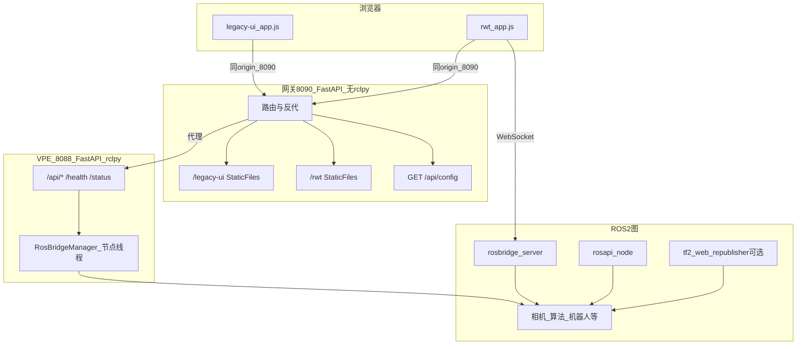

# aubo_ros2_web_dashboard：结构、实现逻辑与使用说明

本文档说明本功能包的**目录结构**、**实现过程与请求逻辑**、**与 visual_pose_estimation 的关系**，以及**从安装到排障的完整用法**。

---

## 1. 设计目标（要解决什么问题）

| 目标 | 实现方式 |
|------|----------|
| 统一浏览器入口（尤其手机/局域网） | 网关 FastAPI 默认绑定 `0.0.0.0:8090`，与 VPE 默认 `127.0.0.1:8088` 错开 |
| 保留 **visual_pose_estimation_python** 全部 Web 能力 | 挂载其 `web_ui` 为 `/legacy-ui`，并将 `/api/*` 等 **反向代理** 到 VPE 进程 |
| 保留 **Robot Web Tools**（rosbridge）能力 | 独立进程 `rosbridge_server` + 浏览器页 **`/rwt/`**；配置由网关 **`GET /api/config`** 提供（不代理） |
| 网关进程内 **不使用 rclpy** | 视觉/机器人业务仍在 VPE 的 FastAPI + `RosBridgeManager` 中执行 |

---

## 2. 目录结构

```
aubo_ros2_web_dashboard/
├── package.xml                 # ROS2 包声明与 exec_depend
├── setup.py / setup.cfg        # ament_python 安装、console_scripts、data_files
├── resource/aubo_ros2_web_dashboard   # ament 包标记
├── launch/
│   └── web_dashboard.launch.py        # rosapi + rosbridge + tf2_web(可选) + 网关 + 可选 VPE Web
├── aubo_ros2_web_dashboard/           # Python 包
│   ├── __init__.py
│   └── web/
│       ├── app.py              # FastAPI 工厂：生命周期、中间件、路由顺序、StaticFiles 挂载
│       ├── enterprise.py       # 请求 ID、耗时、安全头、可选访问日志
│       ├── error_handlers.py   # 统一 JSON 错误体（含 request_id）
│       ├── server.py           # uvicorn 入口 → ros2 run … web_dashboard
│       ├── dependencies.py     # get_runtime_config()（环境变量 → RWT 配置）
│       ├── resources.py        # 本包 RWT 静态资源路径 share/.../web/dist
│       ├── vpe_resources.py    # visual_pose_estimation_python share/.../web_ui
│       └── routers/
│           ├── system.py       # /gateway/health、/gateway/ready、/api/config（仅网关）
│           └── vpe_proxy.py    # /health、/status、/exit、/api/{path} → 上游
├── frontend/dist/              # RWT 前端（HTML/CSS/JS），安装到 share/.../web/dist
│   ├── index.html              # 模式入口：演示 / 开发调试
│   ├── demo.html               # 演示页（data-rwt-mode=demo）
│   ├── dev.html                # 开发调试页（data-rwt-mode=dev）
│   └── assets/{style.css,app.js}
├── test/
│   └── test_web_app.py         # TestClient + lifespan，不依赖真实 VPE/rosbridge
├── docs/
│   └── ARCHITECTURE_AND_USAGE.md
└── README.md
```

---

## 3. 运行时组件关系（逻辑视图）



要点：

- **Legacy UI** 只与 **8090** 对话；`/api/capture_image` 等由网关 **原样转发** 到 **8088**。
- **RWT 页** 用 `fetch('/api/config')` 读端口，用 `ws://{hostname}:9090` 连 **rosbridge**（与 VPE 无 HTTP 耦合）。

---

## 4. FastAPI 应用组装顺序（实现逻辑）

`create_app()`（[`web/app.py`](../aubo_ros2_web_dashboard/web/app.py)）按 **固定顺序** 注册，以保证 **路由优先于 Mount**、**具体路径优先于通配**。

1. **解析路径**
   - `resolve_web_paths()` → `install/share/aubo_ros2_web_dashboard/web/dist`（RWT）。
   - `resolve_vpe_web_paths()` → `install/share/visual_pose_estimation_python/web_ui`（若包未安装则为 `None`）。

2. **lifespan**
   - 创建 **`httpx.AsyncClient`**，超时 **900s**（与长时间位姿/抓取请求匹配），挂到 `app.state.http_client`。
   - 进程退出时 `aclose()`。

3. **中间件**  
   - `CORSMiddleware`，`allow_origins=["*"]`（现场可收紧）。

4. **Router（先注册）**
   - **`system.router`**：`GET /gateway/health`、`GET /api/config`。
   - **`vpe_proxy.router`**：`/health`、`/status`、`/exit`、`/api/{path:path}`。

5. **路由优先级说明**
   - `GET /api/config` 在 **system** 里**先**注册；`vpe_proxy` 的 `/api/{path:path}` 虽能匹配 `path=config`，但 Starlette/FastAPI 按注册顺序匹配，**先到先匹配**，因此 **`/api/config` 永远由网关本地处理**。
   - `vpe_proxy` 对 `path == "config"` 也做了 **404 兜底**，防止误配。

6. **应用级重定向（挂在 app 上）**
   - `GET /`、`GET /index.html`：若存在 legacy → `307` → `/legacy-ui/index.html`；否则若有 RWT dist → `/rwt/`；否则 `503` JSON。
   - `GET /demo.html`：若有 legacy → `/legacy-ui/demo.html`。

7. **Mount（后注册，处理前缀下未命中路由的静态文件）**
   - `/legacy-ui` → VPE `web_ui` 目录，`html=True`（支持目录索引式 SPA）。
   - `/static` → `web_ui/static`（与 VPE 原站一致，供 legacy 页面引用）。
   - `/rwt` → 本包 `dist`，`html=True`。

---

## 5. 反向代理实现细节（[`vpe_proxy.py`](../aubo_ros2_web_dashboard/web/routers/vpe_proxy.py)）

| 项目 | 说明 |
|------|------|
| 上游地址 | 环境变量 **`AUBO_VPE_UPSTREAM`**，默认 `http://127.0.0.1:8088`；launch 写入子进程 `env`。 |
| 转发 URL | `{upstream}{原始路径}`，查询串 **原样附加**（如 `GET /api/get_template_image?...`）。 |
| 方法 | 与客户端一致（GET/POST/…），**OPTIONS** 一并转发，便于 CORS 预检。 |
| Body | `await request.body()` 全文转发（含大 JSON/Base64 图像）。 |
| 请求头 | 过滤 `host`、`connection`、`content-length`、`transfer-encoding`、`keep-alive`、`accept-encoding`，其余复制。 |
| 响应 | 状态码、**content-type**、body 二进制原样返回；响应头过滤 `connection`、`transfer-encoding`、`keep-alive`。 |
| 失败 | **连接拒绝**等 → **502** JSON，提示检查 VPE 是否启动或 `launch_vpe_web`。 |

---

## 6. RWT 运行时配置（[`dependencies.py`](../aubo_ros2_web_dashboard/web/dependencies.py)）

`get_runtime_config()` 从 **环境变量** 读取（由 launch 注入）：

| 环境变量 | 含义 |
|----------|------|
| `AUBO_WEB_ROSBRIDGE_PORT` | rosbridge WebSocket 端口，默认 `9090` |
| `AUBO_WEB_PUBLIC_HOST` | 可选；非空时可在前端与 `location.hostname` 组合策略配合 |
| `AUBO_WEB_USE_SIM_TIME` | `true/1/yes` 时 `/api/config` 中 `use_sim_time: true` |
| `AUBO_WEB_FIXED_FRAME` | 默认 `base_link`，供前端提示 |
| `AUBO_WEB_HTTPX_TRUST_ENV` | 为 `true/1/yes` 时，反向代理用 `httpx.AsyncClient` 会读取 `http_proxy`/`ALL_PROXY` 等；**默认不读**，避免本机上游走代理或 `socks://` 导致启动报错 |

`/api/config` 中的 **`ivg_presets`** 为工程常用话题/坐标系名预设，前端可覆盖输入框。

---

## 7. Launch 文件逻辑（[`web_dashboard.launch.py`](../../launch/web_dashboard.launch.py)）

**声明参数** → **可选 Include VPE Web** → **OpaqueFunction 启动其余进程**。

1. **`launch_vpe_web:=true`** 时：  
   `IncludeLaunchDescription(visual_pose_estimation_web.launch.py)`，`host=127.0.0.1`，`port=8088`，与默认 `vpe_upstream` 一致。

2. **`_setup` 内进程列表（顺序）**：
   - `rosapi`（rosbridge 话题/服务列表等依赖）
   - **[可选]** `tf2_web_republisher`（插在索引 1，即在 rosapi 之后、rosbridge 之前）
   - `rosbridge_websocket`（`port`、`delay_between_messages=0.0`）
   - `ExecuteProcess`: `ros2 run aubo_ros2_web_dashboard web_dashboard --host … --port …`，**env** 含 `AUBO_VPE_UPSTREAM`、`AUBO_WEB_*`

**注意**：Humble 下可执行名为 **`tf2_web_republisher_node`**（launch 已按此填写）；若其他发行版不同，请用 `ros2 pkg executables tf2_web_republisher` 核对。

---

## 8. 与 visual_pose_estimation_python 的 API 对应关系

网关 **不实现** 下列业务，仅 **转发** 到 VPE（与仓库内 `visual_pose_estimation_python` 包中 `web/routers` 一致）：

| 前缀/路径 | 功能简述 |
|-----------|----------|
| `POST /api/capture_image` | 现场采图 |
| `POST /api/capture_template_image` | 模板采图 |
| `POST /api/estimate_pose` | 位姿估计 |
| `POST /api/list_templates` 等 | 模板与工件 |
| `GET /api/get_template_image` | 模板图 |
| `POST /api/get_robot_status` 等 | 机器人 |
| `POST /api/execute_single_grasp` 等 | 抓取与夹爪 |
| `POST /api/debug/*` | 调试可视化与参数 |
| `GET /health`、`GET /status`、`POST /exit` | VPE 健康与退出 |

**不在此列**：`GET /api/config`（网关）、`GET /gateway/health`（网关）。

**未代理**：VPE 的 **`WebSocket /ws`**。当前 legacy `app.js` 未使用；若将来使用，需在网关增加 WS 转发。

---

## 9. 使用文档（操作步骤）

### 9.1 依赖与编译

- ROS2 Humble（或当前环境对应发行版）。
- 系统包（示例）：`ros-humble-rosbridge-suite`、`ros-humble-rosapi`、`ros-humble-tf2-web-republisher`、`python3-httpx`。
- 工作空间 **同时编译**：
  - `visual_pose_estimation_python`（提供 `web_ui` 与可选 VPE launch）
  - `aubo_ros2_web_dashboard`

```bash
cd /home/mu/IVG2.0/aubo_ros2_ws
source /opt/ros/humble/setup.bash
colcon build --packages-select visual_pose_estimation_python aubo_ros2_web_dashboard
source install/setup.bash
```

### 9.2 方式 A：手动双进程（推荐调试）

**终端 1** — 仅 VPE Web（须与 `vpe_upstream` 一致，默认监听本机 8088）：

```bash
source install/setup.bash
ros2 launch visual_pose_estimation_python visual_pose_estimation_web.launch.py host:=127.0.0.1 port:=8088
```

**终端 2** — 网关 + rosbridge（+ 可选 tf2_web）：

```bash
source install/setup.bash
ros2 launch aubo_ros2_web_dashboard web_dashboard.launch.py
```

浏览器访问：**`http://<工控机IP>:8090/`** → 视觉 legacy 主界面；API 经网关转到 8088。  
RWT：**`http://<工控机IP>:8090/rwt/`**。

### 9.3 方式 B：一条 launch 带起 VPE Web

```bash
ros2 launch aubo_ros2_web_dashboard web_dashboard.launch.py launch_vpe_web:=true
```

将启动 `visual_pose_estimation_web`（127.0.0.1:8088）以及网关、rosapi、rosbridge 等。

### 9.4 常用 launch 参数

| 参数 | 默认值 | 说明 |
|------|--------|------|
| `web_host` | `0.0.0.0` | 网关监听地址（手机访问用局域网 IP + 此端口） |
| `web_port` | `8090` | 网关 HTTP |
| `vpe_upstream` | `http://127.0.0.1:8088` | 反代目标；若 VPE 改端口须同步修改 |
| `launch_vpe_web` | `false` | 是否顺带启动 VPE Web |
| `rosbridge_port` | `9090` | 浏览器 roslib 连接端口 |
| `public_host` | 空 | 写入 `AUBO_WEB_PUBLIC_HOST` |
| `use_sim_time` | `false` | 写入配置接口 |
| `fixed_frame` | `base_link` | 写入配置接口 |
| `start_tf2_web_republisher` | `true` | 是否启动 tf2_web_republisher |

### 9.5 与现场其它 Web 端口

| 服务 | 典型端口 |
|------|----------|
| 本网关 | 8090 |
| VPE（直连，一般不对外） | 8088 |
| 手眼 Flask | 8080 |

### 9.6 防火墙（手机访问）

放行 **TCP `web_port`（8090）** 与 **`rosbridge_port`（9090）**。

### 9.7 健康检查

- **Liveness（仅本进程，不探测上游）**：`GET http://<host>:8090/gateway/health`  
  响应含 `request_id`，与响应头 **`X-Request-ID`** 一致，便于与日志、代理错误串联。
- **Readiness（可选）**：`GET http://<host>:8090/gateway/ready`  
  默认 **不** 访问 VPE；设置环境变量 **`AUBO_WEB_PROBE_VPE=1`** 时，会请求上游 `AUBO_VPE_UPSTREAM` 的 `/health`，失败返回 **503**（适用于 K8s readiness 等）。
- **视觉栈（经代理到 VPE）**：`GET http://<host>:8090/health`（VPE 未起则 **502**，JSON 体为统一 `error` 结构）

### 9.8 企业级行为说明

| 能力 | 说明 |
|------|------|
| **请求追踪** | 每个请求分配或透传 **`X-Request-ID`**；反代到 VPE 时会把该 ID 写入上游请求头。 |
| **耗时** | 响应头 **`X-Process-Time`**（秒，四位小数）。 |
| **安全响应头** | `X-Content-Type-Options: nosniff`、`X-Frame-Options: SAMEORIGIN`、`Referrer-Policy`、`Permissions-Policy`（能力默认收紧）。 |
| **统一错误 JSON** | 业务/代理/校验失败时形如：`{"error":{"code","message","request_id",...}}`。 |
| **CORS** | 默认 `AUBO_WEB_CORS_ORIGINS=*`（与 `allow_credentials` 互斥，浏览器侧为匿名跨域）。生产可设为逗号分隔源列表，例如 `https://dash.example.com`，此时允许携带 Cookie。 |
| **可信 Host** | 设 **`AUBO_WEB_TRUSTED_HOSTS`**（逗号分隔，如 `localhost,192.168.1.10,myhost`）时启用 `TrustedHostMiddleware`，防 Host 头注入类问题；不设则不限制。 |
| **访问日志** | 设 **`AUBO_WEB_ACCESS_LOG=1`** 时，每条 HTTP 请求打一行摘要日志（方法、路径、状态码、耗时、`request_id`），logger 名为 `aubo_ros2_web.access`。 |
| **Uvicorn 日志级别** | **`AUBO_WEB_LOG_LEVEL`**：`critical` / `error` / `warning` / `info` / `debug` / `trace`（非法值回退 `info`）。 |

**RWT 前端**：三页共用 **`site-header` 顶栏**（品牌链首页、主导航：首页 / 演示 / 开发调试、**视觉位姿** 指向网关 `/`）与 **`site-footer`**；含 **跳过导航** 链接（无障碍）。**`/rwt/index.html`** 为模式入口；**`demo.html`** / **`dev.html`** 内为 **`page-hero` 页内标题** + 业务区。共用 **`app.js`**，**`data-rwt-mode`** 区分演示与开发。配置加载带超时；**`role="alert"`**；话题输入 **防抖**（仅 dev 可见输入框）；**`aria-busy`**。**平板（含 iPad 10 / Safari）**：`viewport-fit=cover`、安全区、`100dvh`/`-webkit-fill-available`、输入 **16px**、`visualViewport` + `orientationchange`、触控略减点云上限。

### 9.9 测试

```bash
source install/setup.bash
colcon test --packages-select aubo_ros2_web_dashboard
```

使用 `TestClient` 的 **上下文管理器** 以触发 **lifespan**（创建 `http_client`）。

---

## 10. 故障排查

| 现象 | 可能原因 | 处理 |
|------|----------|------|
| 打开 8090 报 502，`/api/...` 失败 | VPE 未启动或地址/端口与 `AUBO_VPE_UPSTREAM` 不一致 | 启动 `visual_pose_estimation_web` 或设 `launch_vpe_web:=true`；检查 `vpe_upstream` |
| `/legacy-ui` 404 | 未安装或未编译 `visual_pose_estimation_python` | `colcon build` 该包并 `source install/setup.bash` |
| `/rwt` 404 | `frontend/dist` 未安装 | 确认仓库内存在 `frontend/dist/index.html` 后重新 `colcon build` |
| rosbridge 连不上 | 防火墙或端口错 | 开放 9090；前端用 `location.hostname` 勿写死 `127.0.0.1`（手机场景） |
| `rosapi` / `rosbridge` 可执行文件找不到 | 未安装 apt 包 | 安装 `ros-humble-rosbridge-suite` 等 |
| TF/URDF 在 RWT 侧为空 | 未起 `robot_state_publisher` 或 `/joint_states` | 先起 MoveIt 或 `view_robot_rviz2` 等；注意 `demo_driver_services` 不启 RSP |

---

## 11. 扩展建议

- **代理 `/ws`**：若 VPE 前端使用 WebSocket，可增加 ASGI WebSocket 透传层指向上游。
- **鉴权与审计**：在网关或前置 Nginx 增加 JWT/API Key、按 `X-Request-ID` 对接日志平台。
- **HTTPS/WSS**：需证书与统一反代，避免混合内容拦截；`AUBO_WEB_TRUSTED_HOSTS` 需包含对外的 Host 名。

---

## 12. 文档修订

- 与代码不一致时，以仓库内 `app.py`、`enterprise.py`、`error_handlers.py`、`vpe_proxy.py`、`web_dashboard.launch.py` 为准。
