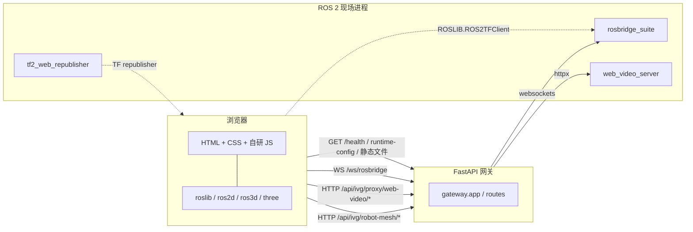
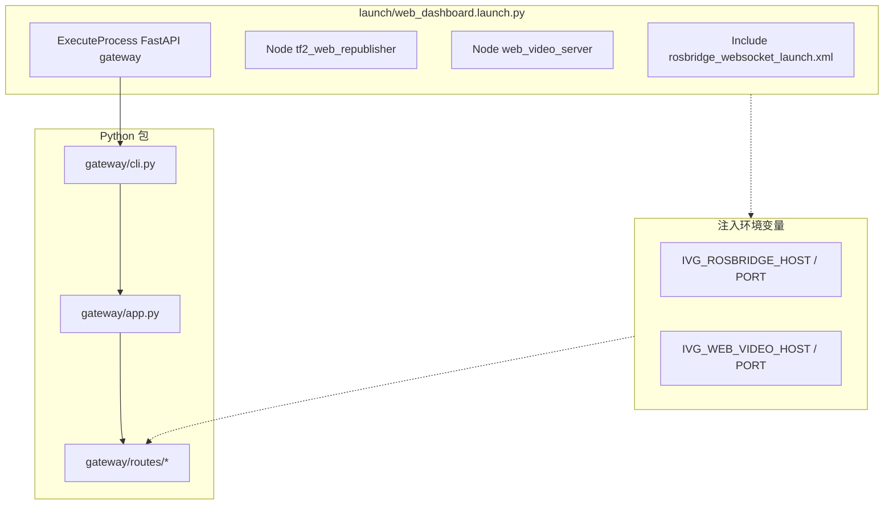
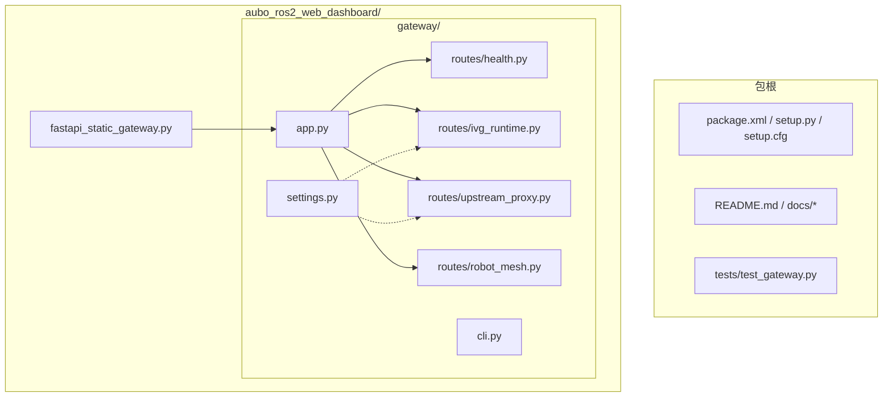
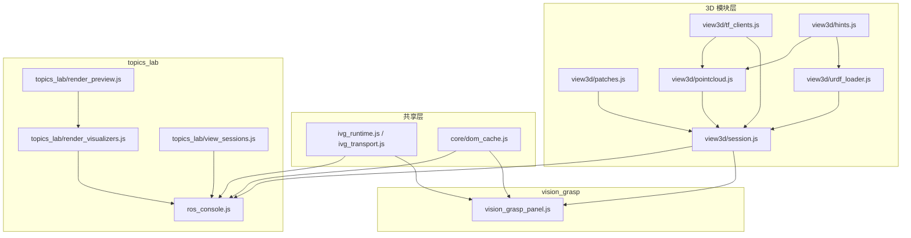
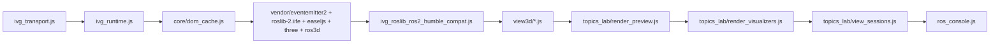
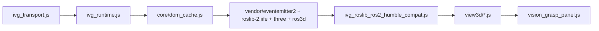
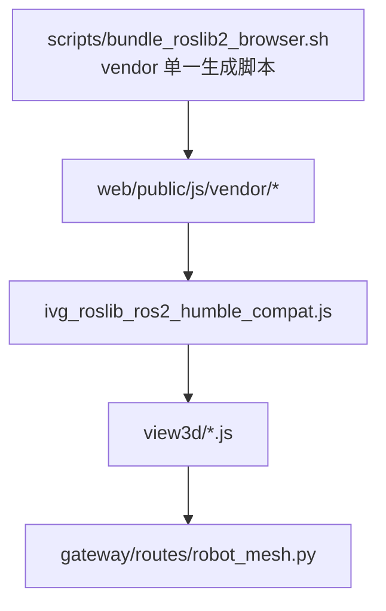
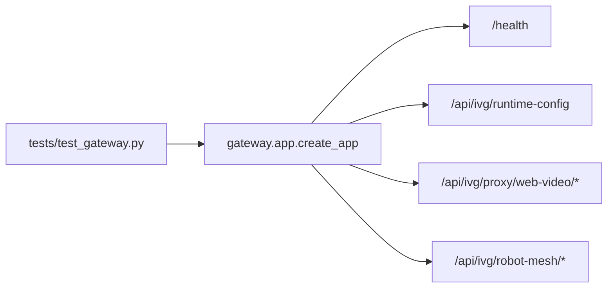

# IVG Web Dashboard 架构图（Mermaid）

本文档记录当前包的整体结构、前后端职责、页面脚本链，以及本次模块化后的 3D / topics_lab 分层。

- 源码路径：`docs/architecture_diagrams.md`
- 安装后路径：`share/aubo_ros2_web_dashboard/docs/architecture_diagrams.md`
- 维护原则：改 `launch/`、`gateway/`、`web/public/js/`、`tests/` 或 vendor 生成方式时，请同步更新本文。

## 1. 运行时总览

## 2. Launch 与网关

## 3. Python 结构

## 4. 前端模块分层

## 5. `topics_lab.html` 脚本链

## 6. `vision_grasp_panel.html` 脚本链

## 7. vendor 与项目层补丁关系

说明：

- `Bundle` 会同步 `eventemitter2 / roslib / ros2d / ros3d / three / easeljs`，并对 `ros2d.min.js`、`ros3d.min.js` 打 ROS 2 / Humble 兼容补丁。
- `Compat` 继续在 vendor 之上补 Topic 参数和 URDF 枚举兼容。
- `Mesh` 负责浏览器侧 `.dae/.stl` 大小写与 `package://` 网格同源访问。

## 8. 测试与验证

当前 `tests/test_gateway.py` 覆盖：

- 健康检查
- runtime-config
- web_video 路径穿越防护
- web_video 上游不可达
- robot_mesh 路径穿越防护
- robot_mesh 大小写文件名兼容
