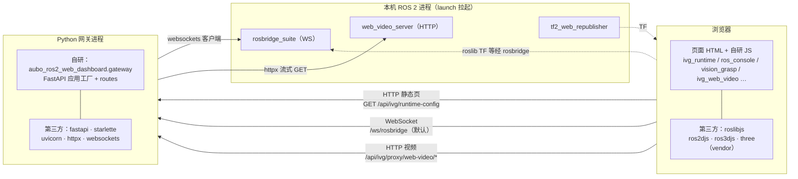
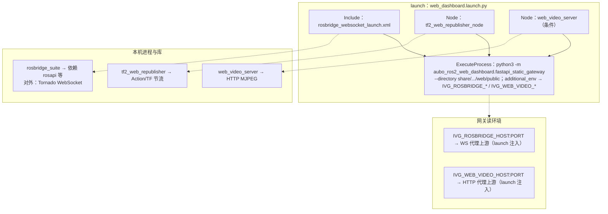
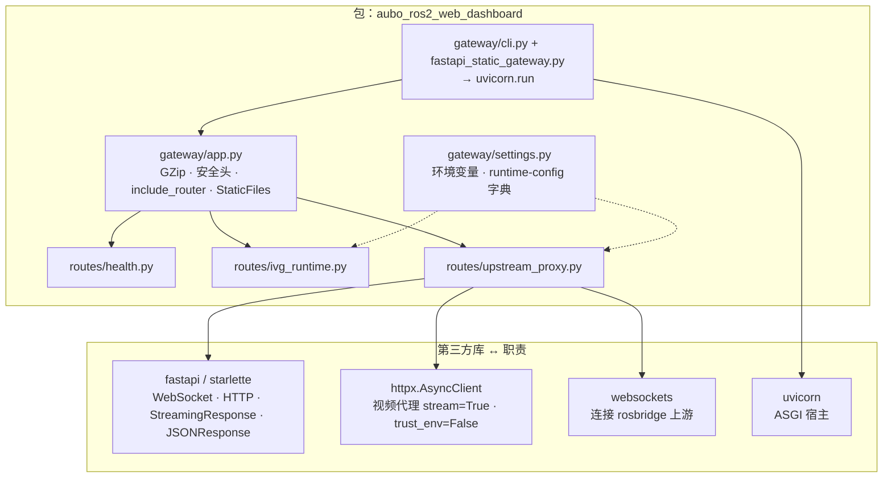
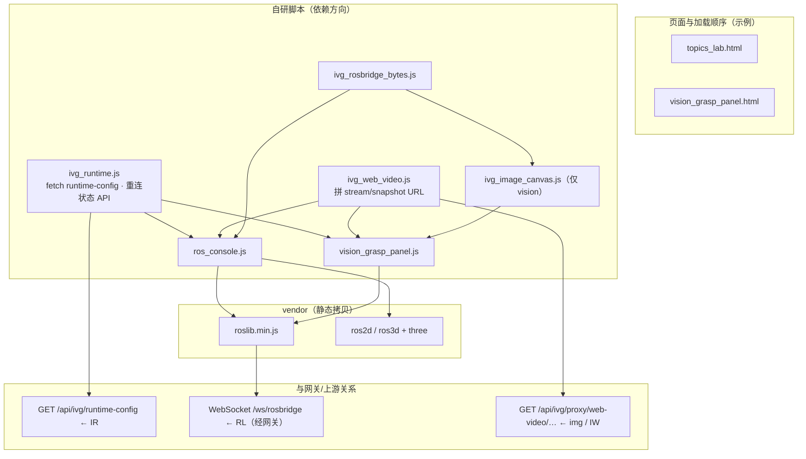
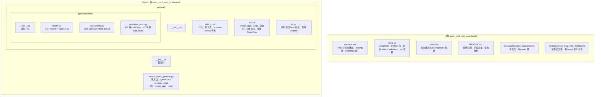
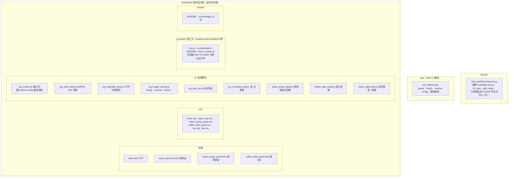
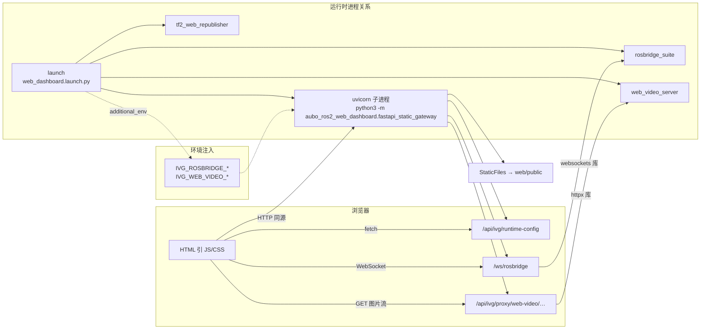
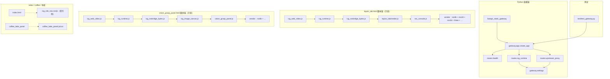

# IVG Web Dashboard 架构图（Mermaid）

本文档存放 **总览 + 分模块** 架构图，便于评审、打印（A4）与随代码迭代更新。

- **源码路径**：`aubo_ros2_web_dashboard/docs/architecture_diagrams.md`
- **安装后**（`colcon build`）：`share/aubo_ros2_web_dashboard/docs/architecture_diagrams.md`
- **维护**：变更 `launch/`、`gateway/`、`web/public/js/`、`test/` 或依赖库职责时，请同步检查下图是否仍准确。（pytest 目录为 ROS 2 惯例 **`test/`**。）

**预览**：在 VS Code / Cursor 装 Mermaid 插件，或用 [Mermaid Live Editor](https://mermaid.live) 粘贴代码块。

**A4 打印建议**：总览单独一页或占上半页；**第 1～4 节** 模块图可一页多格或分两页；**第 5～6 节（文件作用）**、**第 7～8 节（文件联系）** 建议各用 **1～2 页 A4** 打印；导出 PDF 时缩放约 90%～100%。

---

## 1. 总览（库与连接关系）

---

## 2. 模块：Launch + 本机进程（合并）

---

## 3. 模块：网关 Python（包内文件 + 第三方库）

---

## 4. 模块：前端 JS（文件依赖 + 与网关协议）

---

## 5. 文件职责（A4 ①）：包根 + Python 网关

**用途**：改后端、加路由、动环境变量时对照。**注解**：`upstream_proxy` 与 `ivg_runtime` 均依赖 `settings`；`app` 先注册全部路由再挂 `StaticFiles`，避免静态资源抢 API/WS。

---

## 6. 文件职责（A4 ②）：Launch、测试、Web 静态

**用途**：改前端页面、加静态资源时对照。**说明**：测试目录名为 ROS 2 惯例 **`test/`**（非 `tests/`）；`js/vendor/` 下大型 `*.min.js` 合并为一个节点表示。

---

## 7. 文件联系（A4 ③）：运行时与数据流

**用途**：联调、防火墙、端口说明。**注解**：浏览器始终经同源 `/ws/rosbridge` 与 `/api/ivg/proxy/web-video`；上游地址由 `IVG_ROSBRIDGE_*` / `IVG_WEB_VIDEO_*` 决定。

---

## 8. 文件联系（A4 ④）：源码 import 与 HTML 脚本链

**用途**：重构、拆包、查依赖。**注解**：箭头表示 **import** 或 **典型 `<script>` 加载顺序**；各 HTML 实际顺序以文件为准。

### 第 5～8 节打印分页建议

| 建议页 | 章节 | 内容 |
|--------|------|------|
| A4 ① | 第 5 节 | 包根 + Python 网关文件职责 |
| A4 ② | 第 6 节 | launch、test、web/public 文件职责 |
| A4 ③ | 第 7 节 | 运行时进程与浏览器—网关—上游 |
| A4 ④ | 第 8 节 | Python import 与 HTML 脚本依赖链 |

---

## 更新对照表（改代码时扫一眼）

| 变更区域 | 建议同步的图 |
|----------|----------------|
| `launch/web_dashboard.launch.py`、环境变量注入 | 第 2、1、6、7 节 |
| `gateway/*`、`upstream_proxy`、pip 依赖 | 第 3、1、5、7、8 节 |
| `web/public/js/*`、HTML 脚本顺序、vendor | 第 4、1、6、8 节 |
| 端口与环境变量约定 | 第 2 节（E）、第 4 节（NET）、第 7 节 |
| 新增/删除源码文件、移动目录、`test/` 用例 | 第 5、6、8 节 |
