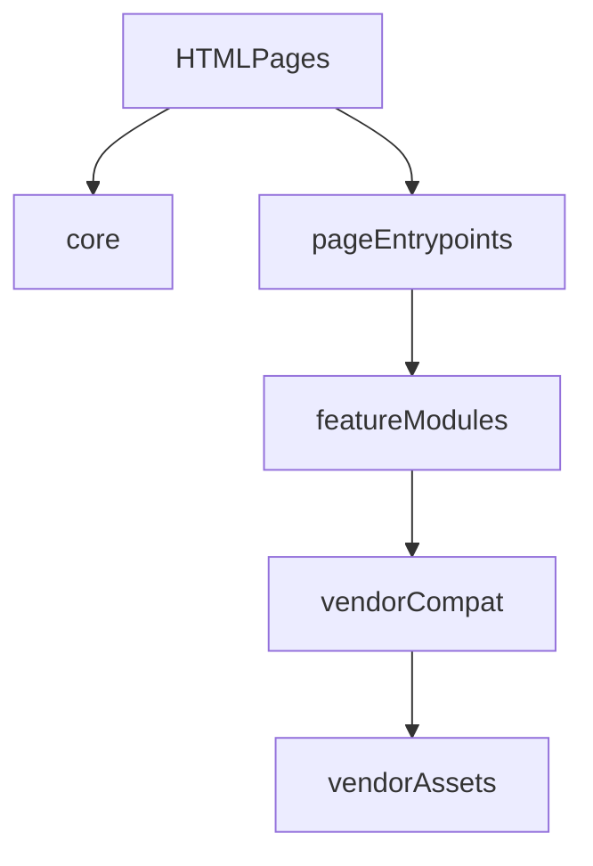

# 前端模块说明

本文说明 `web/public/js/` 现在的分层方式，以及各模块在做什么、为什么要单独存在。

## 分层总览



## 目录职责

### `web/public/js/core/`

共享但又不属于某个具体页面的基础设施。

- `dom_cache.js`
  - 提供 `createDomCache()`。
  - 统一静态页面里 `getElementById` 缓存方式。
  - 目的是减少 topics 高频刷新与 vision 面板长时间运行时的重复 DOM 查询。

### `web/public/js/view3d/`

把原来堆在旧 3D 入口里的能力拆开，统一收敛到 `view3d/` 目录。

- `patches.js`
  - 处理 `ros3d` 内嵌 `THREE` 与页面 `THREE` 不是同一实例的问题。
  - 处理 `MeshLoader` 大小写扩展名兼容。
  - 这是最脆弱的兼容层，因此单独隔离，避免业务代码误碰。

- `tf_clients.js`
  - 封装 `ROSLIB.ROS2TFClient` 与浏览器直接订阅 `/tf` 的回退模式。
  - 负责 TF 数学、固定坐标系切换、订阅回调管理。

- `hints.js`
  - 负责点云/URDF 提示 DOM 的增删。
  - 让 session、pointcloud、urdf loader 不再各自拼提示节点。

- `pointcloud.js`
  - 负责 PointCloud2 的字节解析、均匀抽样、颜色提取、TF 跟随。
  - 保留现场排障用的首帧统计和渲染日志。

- `urdf_loader.js`
  - 负责从 `ROSLIB.Param` 或 `/rosapi/get_param` 读取 URDF。
  - 负责把 XML 变成 `ROSLIB.UrdfModel + ROS3D.Urdf`。

- `session.js`
  - 会话编排层。
  - 统一装配 viewer、坐标轴、网格、点云、雷达、Marker、URDF。
  - 直接对外暴露全局 `IvgRos3dView3dSession`，页面不再额外经过包装脚本。

### `web/public/js/topics_lab/`

topics_lab 页面专属模块。

- `render_preview.js`
  - 管理 `safeJson()`、`typeMatch()`、`rawPreviewForMessage()`。
  - 不关心 DOM 和 ROS，只做消息摘要。

- `render_visualizers.js`
  - 管理不同消息类型的 HTML/Canvas 可视化。
  - 不关心订阅生命周期，只负责渲染。

- `ros_console.js`
  - 当前仍是 topics_lab 的页面编排总控。
  - 负责连接、列表、订阅、服务、参数、图、2D、3D。
  - 现在直接依赖 `render_preview.js`、`render_visualizers.js` 与 `view_sessions.js`，不再经过额外兼容门面。
  - 之所以还保留在入口层，是因为它和页面 DOM 的耦合仍然很强，后续再继续拆控制器会更稳。

### 页面入口文件

- `vision_grasp_panel.js`
  - 当前仍是视觉抓取页面的主编排文件。
  - 已经与新的 3D 模块解耦，后续若继续拆分，应优先切 `config_store / projection / joint_chart / urdf_panel`。

## 页面加载链

### `topics_lab.html`

推荐理解顺序：

1. `ivg_transport.js` / `ivg_runtime.js`
2. `core/dom_cache.js`
3. `vendor/*`
4. `view3d/*.js`
5. `topics_lab/render_preview.js`
6. `topics_lab/render_visualizers.js`
7. `topics_lab/view_sessions.js`
8. `ros_console.js`

### `vision_grasp_panel.html`

推荐理解顺序：

1. `ivg_transport.js` / `ivg_runtime.js`
2. `core/dom_cache.js`
3. `vendor/*`
4. `view3d/*.js`
5. `vision_grasp_panel.js`

## 为什么仍保留部分全局名

当前项目仍是“静态 HTML + 经典脚本 + 全局变量”模式，并没有完整切到 bundler / ESM。

所以本次重构优先做的是：

- 先把职责拆开。
- 先把风险最高的 3D 能力拆成可读模块。
- 对外继续保留 `IvgRos3dView3dSession`、`IVGTopicsLabRenderPreview` 这类静态脚本全局名，但只保留有实际职责的模块，不再额外套一层纯转发门面。

这样做的好处是：

- 现场联调风险更低。
- HTML 可逐步迁移，而不是一次性推倒重来。
- 出问题时仍能快速定位到“补丁层 / TF 层 / 点云层 / 会话层”。

## URDF 调用链顺序图

下面这条链建议和 `vision_grasp_panel.html` 的脚本加载顺序一起看，适合从零开始理解“左栏机械臂 URDF 为什么能显示并且动起来”。

```text
vision_grasp_panel.js
  -> createVisionUrdfPanel({
       ports: ivgPorts,
       SessionCtor: IvgRos3dView3dSession,
       documentRef: document
     })

createVisionUrdfPanel(...)
  -> 返回 { start, stop, layout }

start(getById)
  -> stop()
  -> ensureRos()
     -> new ROSLIB.Ros()
     -> connect(ws://...rosbridge...)
  -> new IvgRos3dView3dSession(ros, getById, {
       view3dHostId: 'vision-urdf-host',
       viewerInnerId: 'vision-urdf-inner'
     })
  -> session.start()

session.start()
  -> 创建 ROS3D.Viewer
  -> 创建 IvgRos3dTfClient(ros, fixedFrame, opts)
  -> 延迟调用 _startUrdfStage($, host, fixedFrame)

_startUrdfStage(...)
  -> new THREE.Object3D() 作为 ros3dUrdfRoot
  -> viewer.addObject(ros3dUrdfRoot)
  -> 读取 urdf-param
  -> 构造 meshBase
  -> 调 ivgAttachUrdfFromRosParam(
       ros, paramName, meshBase, tfClient, rootGroup, $, onErr, host
     )

ivgAttachUrdfFromRosParam(...)
  -> 先尝试 ROSLIB.Param.get()
  -> 不行再尝试 /rosapi/get_param
  -> 得到 URDF XML
  -> new ROSLIB.UrdfModel({ string: xml })
  -> new ROS3D.Urdf({ urdfModel, path, tfClient, tfPrefix: '' })
  -> rootGroup.add(urdfViz)

之后
  -> tfClient 持续收到 /tf /tf_static
  -> ROS3D.Urdf 持续根据 TF 更新 link 姿态
  -> 模型动起来
```

这条链里每一层职责不同：

- `vision_grasp_panel.js`
  - 页面入口层。
  - 负责创建左栏 URDF 面板控制器，但不直接加载 URDF。
- `vision_grasp/urdf_panel.js`
  - 面板生命周期层。
  - 负责 rosbridge 连接、会话创建、停止与 resize。
- `view3d/session.js`
  - 3D 会话编排层。
  - 负责创建 viewer、TF client，并安排 URDF 何时进入加载阶段。
- `view3d/urdf_loader.js`
  - URDF 装配层。
  - 负责从参数系统拿 XML，并构造成 `ROSLIB.UrdfModel + ROS3D.Urdf`。
- `view3d/tf_clients.js`
  - TF 数据层。
  - 负责把 `/tf`、`/tf_static` 或 `tf2_web_republisher` 暴露为统一的 `tfClient`。

理解时建议牢记一句话：

- URDF 负责“长什么样”
- TF 负责“现在在哪里、朝哪个方向”
- `ROS3D.Urdf` 负责把两者结合后画到 Three.js 场景里

## 阅读建议

如果是第一次接触这套代码，建议优先只抓下面 6 个关键节点；这 6 处看懂后，URDF 整条链就基本打通了。

1. `createVisionUrdfPanel(...)`
2. `start(getById)`
3. `new IvgRos3dView3dSession(ros, $, opts)`
4. `session.start()`
5. `_startUrdfStage($, host, fixedFrame)`
6. `ivgAttachUrdfFromRosParam(...)`

推荐阅读顺序：

1. 先看 `vision_grasp_panel.js`
   - 明确左栏 URDF 面板控制器是在哪里创建的。
2. 再看 `vision_grasp/urdf_panel.js`
   - 明确 `start / stop / layout` 三个生命周期函数分别做什么。
3. 再看 `view3d/session.js`
   - 把 viewer、TF client、URDF 阶段如何衔接起来读通。
4. 最后看 `view3d/urdf_loader.js`
   - 理解 URDF XML 是怎么从参数系统读出来，再怎么变成 `ROS3D.Urdf`。
5. 读不懂“为什么会动”时，再回头看 `view3d/tf_clients.js`
   - 重点看 `IvgRos3dTfClient`、`IvgRosTfTreeClient`、`getTransform()`。

如果只是现场排障，也建议按这个顺序排查：

1. 页面有没有创建 `visionUrdfPanel`
2. `ensureRos()` 是否成功连上 rosbridge
3. `session.start()` 是否进入 `_startUrdfStage()`
4. `ivgAttachUrdfFromRosParam()` 是否拿到有效 XML
5. `ROS3D.Urdf` 是否成功创建并加到 `rootGroup`
6. `tfClient` 是否能拿到相对 `fixedFrame` 的 transform
