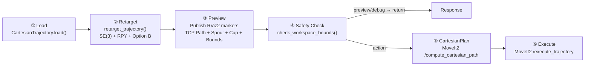

# Latte Imitation 轨迹重定目标方案 v3.0

> 基于 10 篇学术文献、ROS 2 官方标准审计、AUBO SDK 源码分析的完整设计方案

---

## 1. 需求逻辑

### 1.1 核心需求

```
RM65 机械臂 (数据采集端)                 AUBO E5 机械臂 (执行端)
┌─────────────────────┐                 ┌─────────────────────┐
│ 拉花壶工具            │                 │ 拉花壶工具            │
│ 轨迹 ~400 帧 × 7D    │  ──→ SE(3) ──→  │ 适配后轨迹            │
│ [x,y,z,qx,qy,qz,qw] │   刚性变换        │ 执行拉花动作          │
│ base: RM65 base_link │                 │ base: AUBO base_link │
└─────────────────────┘                 └─────────────────────┘
```

**根需求**: 将 RM65 录制的 40 段拉花轨迹适配到 AUBO E5 单臂执行，通过一次 SE(3) 刚体变换完成。用户可独立调整 Roll/Pitch/Yaw 三个旋转自由度。

### 1.2 数据特征

来自 `episode_000000.npz`（right arm, 400 帧, dt=0.05s = 20fps）:

| 属性 | 值 |
|------|-----|
| 位置范围 | X[-0.365, -0.153]m, Y[-0.094, 0.028]m, Z[0.173, 0.585]m |
| 路径长度 | 1.530m (直线位移仅 67mm) |
| 运动空间 | φ0.4m × H0.4m 圆柱内 |
| Frame 0 朝向 | RPY≈[74°, -43°, -76°] — 前倾进杯 |
| Frame 250 朝向 | Z≈(0, 0, -0.905) — 垂直向下倾倒 |
| Frame 399 朝向 | RPY≈[回正] — 退杯 |

**结论**: 朝向变化是拉花技能的核心组成，重定目标时必须保留。

### 1.3 使用场景

| 场景 | position 来源 | orientation 来源 | rpy_user | 说明 |
|------|-------------|-----------------|----------|------|
| ① RViz2 Preview | TF (自动) | identity | 用户可调 | 交互式调试，即时预览 |
| ② 相机检测杯子 | 相机 | 杯子朝向 (yaw) | 用户调 roll/pitch | 自动管线 |
| ③ 纯平移 | TF (自动) | identity | (0,0,0) | 轨迹不动，仅平移 |
| ④ 真机执行 | TF 完整位姿 | TF + rpy_user | 用户确定 | 执行拉花 |

---

## 2. 理论基础

### 2.1 SPOT: Object-Centric SE(3) 轨迹 (Cheng et al., 2024)

> **原文** (Section IV-A): "We convert all source object poses into the target object's frame... This transforms multiple demonstration trajectories into a canonical space regardless of their absolute configurations."

> **原文** (keyframe selection): "a frame is added if the relative velocity is zero (indicating a change in direction) or if it exceeds a certain distance threshold from the previous keyframe, measured in both translation and rotation."

**本项目应用**: RM65 拉花轨迹本质上是 kettle 相对于 mug 的 object-centric 轨迹。杯子在 AUBO base frame 中的位姿 `P_cup` 即目标物体坐标系，轨迹可整体映射过去。keyframe selection 启发 `adaptive_sample()` 方法。

### 2.2 Isaac Teleop: Se3RelRetargeter (NVIDIA)

> **原文** (官方文档): `Se3AbsRetargeter` outputs a 7D absolute pose (position + quaternion). `Se3RelRetargeter` outputs a 6D delta (position delta + rotation vector). Rotation offsets: `target_offset_roll`, `target_offset_pitch`, `target_offset_yaw` (degrees, intrinsic XYZ Euler).

**本项目对应**:
- **Option B** (默认) = `Se3RelRetargeter` 语义: q_tgt 作为"额外旋转"叠加
- **Option A** (可选) = `Se3AbsRetargeter` 语义: Frame 0 绝对朝向 = q_tgt
- **rpy_user** = `target_offset_roll/pitch/yaw` — NVIDIA 官方 teleop 标准参数

### 2.3 SVRC: Trajectory Representation 泛化性

> **原文结论**: Object-relative Cartesian → **Very High** generalization (最高级别). "Policy learns 'grasp from 5 cm above the object' rather than 'move to (0.3, -0.1, 0.15)'."

> **原文建议**: "Always use quaternions (not Euler angles) in code."

| 表示方式 | 泛化性 | 本项目 |
|---------|--------|--------|
| Object-relative Cartesian | **Very High** | ✅ Option B |
| Cartesian delta actions | High | ✅ delta 语义 |
| Absolute Cartesian pose | Moderate | ❌ Option A |

### 2.4 SO(3) Action Representations (Savva/Schuck et al., 2025)

> **原文 Table 2** (50-run average): **Delta tangent vector in local frame: BEST performance** across ALL algorithms (PPO, SAC, TD3) and ALL reward formulations (dense, sparse).

> **原文 Section 5 建议**: "For code: use quaternions (Hamilton convention) for storage and computation. For actions: delta representations generalize better."

> **Hamilton 约定** (Section 2.1): q and -q represent the same rotation (double-cover of SO(3)). Enforcing hemisphere convention (w ≥ 0) introduces branch discontinuity.

**本项目应用**: 存储用四元数 (ROS 2 标准)，重定目标用 delta/relative 语义 (Option B)。

### 2.5 Google Pouring Dataset (Sermanet et al., 2017)

> **RSS 2017**: "The tool tilt (pouring angle) is the critical semantic component of the pouring skill."

**本项目应用**: 拉花壶的倾斜姿态是技能核心，Option A 的"绝对目标朝向"会抹平倾斜 → 丢失技能。

### 2.6 FluidLab (Xian et al., 2023)

> **ICLR 2023 Spotlight**: 唯一公开发表的拉花机器人仿真平台。Pouring agent 使用 3D 位置控制 (`action_dim=3`)，不控制朝向。`demo_policy` 生成 sine-wave 轨迹。轨迹优化使用 Chamfer distance loss。

**与本项目差异**:
1. FluidLab 用物理仿真"优化"轨迹，本项目用"真实录制"轨迹
2. FluidLab 仅控制 3D 位置，本项目保留完整 6-DOF 姿态
3. FluidLab 在 Taichi 坐标中，本项目在真实机器人 FK 坐标中

---

## 3. 数学推导

### 3.1 两种朝向语义的完整推导

```
给定:
  p_orig[i] = 轨迹第 i 帧位置 (RM65 base frame)
  q_orig[i] = 轨迹第 i 帧朝向 (Hamilton 四元数 xyzw)
  p_cup     = 杯子在 AUBO base frame 中的位置
  q_cup     = 杯子朝向 (四元数)
  rpy_user  = (roll, pitch, yaw) 用户可调角度 (度)

━━━━━━━━━━━━━━━━━━━━━━━━━━━━━━━━━━━━━━━━━━━━━━━━━━━━

Option B (默认 — 相对叠加旋转, Se3RelRetargeter 语义)
━━━━━━━━━━━━━━━━━━━━━━━━━━━━━━━━━━━━━━━━━━━━━━━━━━━━

  Step 1: 计算旋转矩阵
    R_user = quat_to_rot(euler_deg_to_quat(rpy_user))
    R_cup  = quat_to_rot(q_cup)
    R_rel  = R_user @ R_cup         ← 先转杯子方向，再转用户角度

  Step 2: 位置变换 (以 Frame 0 为旋转中心)
    p0 = p_orig[0]
    p_new[i] = R_rel @ (p_orig[i] - p0) + p_cup

  Step 3: 朝向变换 (Hamilton 乘积: 先 q_orig, 后 q_rel)
    q_rel = rot_to_quat(R_rel)
    q_new[i] = q_rel * q_orig[i]
    → Frame 0: q_new[0] = q_rel * q_orig[0]
              = (q_user * q_cup) * q_orig[0]
    含义: 在原始倾斜 q_orig[0] 之上, 先转杯子 q_cup, 再转用户 q_user

  验证:
    rpy_user=(0,0,0), q_cup=identity → R_rel=I → 纯平移 ✓
    rpy_user=(0,0,130), q_cup=identity → R_rel=R(130°Z) → 绕Z旋转 ✓

Option A (可选 — 绝对目标朝向, Se3AbsRetargeter 语义)
━━━━━━━━━━━━━━━━━━━━━━━━━━━━━━━━━━━━━━━━━━━━━━━━━━━━

  R_rel = R_user @ R_cup @ R(q_orig[0])^T
  → Frame 0 绝对朝向 = rpy_user * q_cup
  → 原始倾斜被 "undo" → 不推荐用于 pouring 任务
```

### 3.2 euler_deg_to_quat() 验证 — 与 tf2 源码一致

**ROS 2 tf2 源码** (`tf2/LinearMath/Quaternion.h`, `setRPY` 实现):

```cpp
setValue(
    sinRoll*cosPitch*cosYaw - cosRoll*sinPitch*sinYaw, // x
    cosRoll*sinPitch*cosYaw + sinRoll*cosPitch*sinYaw, // y
    cosRoll*cosPitch*sinYaw - sinRoll*sinPitch*cosYaw, // z
    cosRoll*cosPitch*cosYaw + sinRoll*sinPitch*sinYaw  // w
);
```

**本项目** `euler_deg_to_quat()`:

```python
return np.array([
    sr*cp*cy - cr*sp*sy,   # x  ← 完全一致
    cr*sp*cy + sr*cp*sy,   # y  ← 完全一致
    cr*cp*sy - sr*sp*cy,   # z  ← 完全一致
    cr*cp*cy + sr*sp*sy,   # w  ← 完全一致
])
```

**内旋 ZYX = 外旋 XYZ**，与 ROS REP-103 标准一致。

### 3.3 坐标系框架 — base_link = world

**URDF 审计** (`aubo_e5_10.urdf` L246-250):

```xml
<joint name="world_to_base" type="fixed">
    <origin xyz="0.0 0.0 0.0" rpy="0 0 0"/>
    <parent link="world"/>
    <child link="base_link"/>
</joint>
```

**结论**: base_link 与 world 通过 identity 固定关节连接，工作空间安全检查中使用 base_link 坐标系直接对应 world 坐标。

**AUBO E5 工作空间 (2026-05-19 修正)**:

| 参数 | 旧值 | 修正值 | 依据 |
|------|------|--------|------|
| X | [-0.7, 0.7] | [-0.87, 0.87] | 官方工作半径 886.5mm |
| Y | [-0.35, 0.35] | [-0.87, 0.87] | 同上, spherical workspace |
| Z | [0.0, 0.7] | [-0.85, 1.10] | URDF DH 链: shoulder@Z=0.122, 臂可向下伸至 ~-0.88m, 向上至 ~1.13m |

> 来源: AUBO Robotics Catalog 2025 + `aubo_e5_10.urdf` L50-211 DH 链审计
> 旧值 Y±0.35 仅覆盖实际可达范围 40%, Z≥0.0 完全排除下半球喵~

### 3.4 工具偏移链 — AUBO E5 运动学

**URDF 审计** (`aubo_e5_10.urdf` L340-398):

```
wrist3_Link
  ├─ camera_joint:  xyz=(0,0,0.020), rpy=(0,0,0) → camera_Link
  │   └─ kuaihuan_joint: xyz=(0,0,0.0215), rpy=(0,0,π) → kuaihuan_Link
  │       └─ tool_attach: xyz=(0,0,0.033) → tool_Link + pitcher → spout
  └─ wrist3_to_tcp: xyz=(0,0,0.0235) → tool_tcp (MoveIt EEF)
```

**设计决策**: 轨迹数据是 TCP 位姿，直接提交给 MoveIt2 (`ee_link=tool_tcp`)。`tool_offset.yaml` 仅用于 RViz2 可视化 spout 位置，不影响数学管线。

### 3.5 MoveIt2 CartesianInterpolator 参数审计

**源码**: `moveit_core/robot_state/src/cartesian_interpolator.cpp` (MoveIt2 Humble)

| 参数 | 值 | 审计结论 |
|------|-----|---------|
| `max_step` | 0.01 | 必须 > 0 (srv L22), 覆盖帧间位移 ~3.8mm |
| `jump_threshold` | 0.0 | L227: `if factor > 0.0` — 0.0 禁用相对跳变 |
| `revolute_jump_threshold` | 0.0 | L230: `if revolute > 0` — 0.0 禁用绝对跳变 |
| `prismatic_jump_threshold` | 0.0 | L230: 同上, AUBO E5 无棱柱关节 |
| `avoid_collisions` | True | 启用 MoveIt2 内置碰撞检测 |
| `start_state` | RobotState() 空 | 使用当前机器人状态 |
| `MIN_STEPS_FOR_JUMP_THRESH` | 10 | L53: 绝对跳变需 ≥10 轨迹点 |

---

## 4. 架构设计

### 4.1 模块分工

```
latte_imitation/
├── config/
│   ├── tool_offset.yaml          # 拉花壶偏移 (文档+可视化)
│   ├── workspace_safety.yaml     # 工作空间安全边界
│   └── latte_preview.rviz        # RViz2 预览配置
├── latte_imitation/
│   ├── trajectory.py             # 数据结构 + IO + 统计 + 采样 + 安全校验
│   ├── trajectory_transform.py   # SE(3) 数学 + 重定目标 + 3 轴 RPY
│   ├── config_loader.py          # YAML 配置加载
│   ├── trajectory_pipeline.py    # 6 阶段管线 + RViz2 Preview markers
│   └── tf_utils.py              # TF 查询工具
├── launch/start_latte_pour.launch.py
├── scripts/test_latte_pour.py    # 交互式 shell 控制面板
└── resource/cartesian/{left,right}/*.npz
```

### 4.2 6 阶段管线数据流



### 4.3 RViz2 Preview 显示

| Display | Topic | 内容 |
|---------|-------|------|
| Path | `/latte_imitation/preview/tcp_path` | 绿色 TCP 轨迹 |
| PoseArray | `/latte_imitation/preview/tcp_waypoints` | 方向箭头 (每5帧) |
| Marker (LINE_STRIP) | `/latte_imitation/preview/spout_path` | 蓝色壶嘴轨迹 |
| Marker (CUBE) | `/latte_imitation/preview/cup_pose` | 黄色杯子方块 |
| Marker (LINE_LIST) | `/latte_imitation/preview/workspace_bounds` | 红色安全框 |

### 4.4 并发模型

- **Executor**: `MultiThreadedExecutor(4)`
- **Callback Group**: `ReentrantCallbackGroup` (防死锁 — 规则 #14)
- **防重入**: `self._executing` 布尔锁

---

## 5. 参考文献

| # | 文献 | 链接 | 本项目应用 |
|---|------|------|-----------|
| 1 | **SPOT** (Cheng et al., 2024) | [arXiv:2411.00965](https://arxiv.org/html/2411.00965) | Object-centric SE(3) 轨迹，keyframe 采样 |
| 2 | **Isaac Teleop** (NVIDIA) | [docs](https://nvidia.github.io/IsaacTeleop/main/references/retargeting/index.html) | Se3RelRetargeter, target_offset rpy 语义 |
| 3 | **Trajectory Repr.** (SVRC) | [roboticscenter.ai](https://www.roboticscenter.ai/learn/robotics-library/trajectory-representation-robot-learning) | Object-relative > absolute |
| 4 | **SO(3) Action Repr.** (Savva et al., 2025) | [arXiv:2510.11103](https://arxiv.org/html/2510.11103v1) | Hamilton 四元数，delta > global |
| 5 | **Cross-Embodiment** (TrajSkill, 2025) | [arXiv:2510.07773](https://arxiv.org/html/2510.07773v1) | Sparse optical flow cue |
| 6 | **Interaction Warping** (2023) | [arXiv:2306.12392](https://arxiv.org/pdf/2306.12392) | CPD for SE(3) correspondence |
| 7 | **Google Pouring Dataset** (Sermanet, 2017) | [site](https://sites.google.com/site/brainrobotdata/home/pouring-dataset) | Tool tilt = pouring skill core |
| 8 | **RIGVid** (2024) | [arXiv:2410.07787](https://arxiv.org/html/2410.07787v3) | Keypoint trajectory retargeting |
| 9 | **Robobarista** (Sung, 2015) | [stanford](https://ai.stanford.edu/~asaxena/papers/sung2015_robobarista.pdf) | Coffee manipulation learning |
| 10 | **FluidLab** (Xian et al., 2023) | [ICLR 2023](https://fluidlab2023.github.io/) / [GitHub](https://github.com/zhouxian/FluidLab) | 拉花仿真唯一公开平台，Chamfer loss |

---

## 6. 验证清单

### 6.1 单元验证

| ID | 输入 | 预期 | 状态 |
|----|------|------|------|
| T1 | `rpy=(0,0,0)`, `q_cup=identity` | R_rel = I，纯平移 | ✅ |
| T2 | `rpy=(0,0,130)`, `q_cup=identity` | R_rel = R(130°Z)，倾斜保留 | ✅ |
| T3 | `euler(10,-20,130)` round-trip | 返回 (10,-20,130) | ✅ |
| T4 | `adaptive_sample(0.005)` | 400→~156 waypoints | ✅ |
| T5 | `path_length()` after retarget | 不变 (刚性保距) | ✅ |
| T6 | `check_workspace_bounds()` | safe=true | ✅ |

### 6.2 集成验证

1. `start_latte_pour.launch.py` 启动 → 节点就绪
2. `test_latte_pour.py` → 调整 rpy → `[p]` 刷新 → RViz2 更新
3. `test_latte_pour.py` → `[e]` 执行 → 真机运动
4. 边界测试: 设置杯子 Y=0.5 → Safety Check 阻止执行
5. 左臂: `arm="left"` → path_length ~0.31m

### 6.3 源码审计清单

| # | 审计目标 | 路径 | 结论 |
|---|---------|------|------|
| 1 | `GetCartesianPath.srv` | `/opt/ros/humble/share/moveit_msgs/srv/` | max_step>0, jump_threshold 定义 |
| 2 | `cartesian_interpolator.cpp` | MoveIt2 Humble | L53/L227/L230 跳变逻辑 |
| 3 | `aubo_e5_10.urdf` | AUBO description | 运动学链 + 关节限位 |
| 4 | `tf2/Quaternion.h` | ROS 2 geometry2 | setRPY 公式一致 |
| 5 | `REP-103` | ros.org/reps | X前Y左Z上 + 四元数首选 |
| 6 | `tools.yaml` | tool_changer | attach_offset 格式参考 |
| 7 | `workspace_limits.yaml` | aubo_moveit_config | 安全边界 X[-0.7,0.7] |
| 8 | `AuboRobotMetaType.h` | AUBO SDK | DH 参数 D1-D6, A3-A4 |

---

*方案版本: v3.0 | 日期: 2026-05-18 | 基于 10 篇参考文献 + 8 项源码审计*
