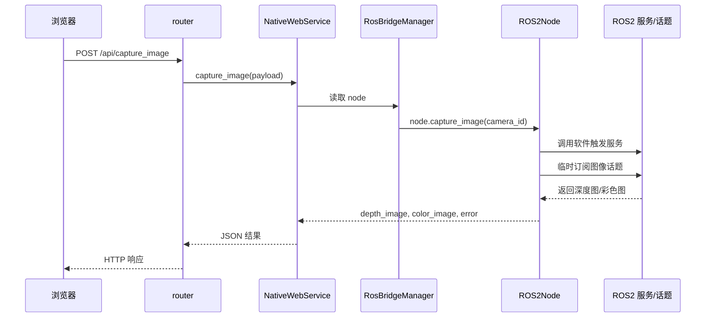
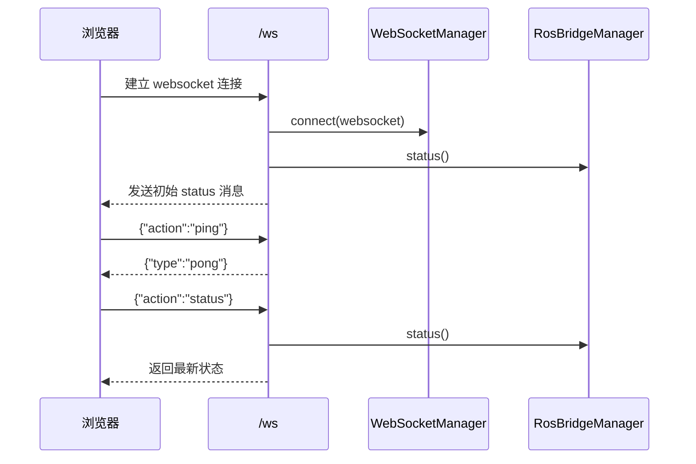
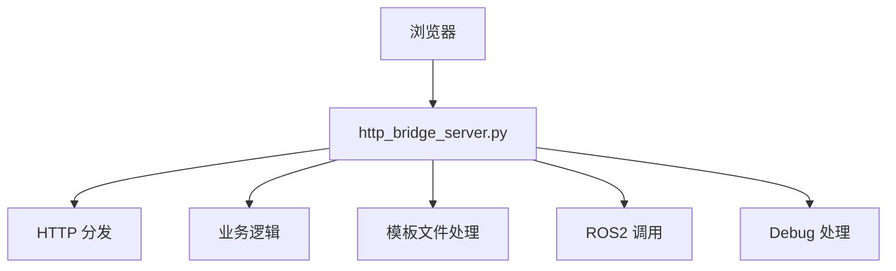
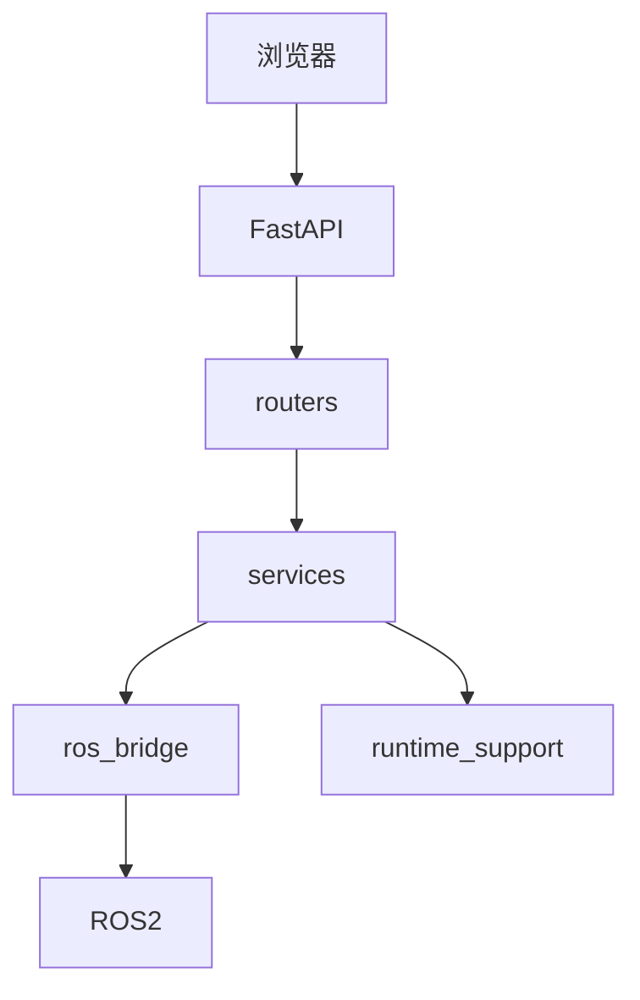
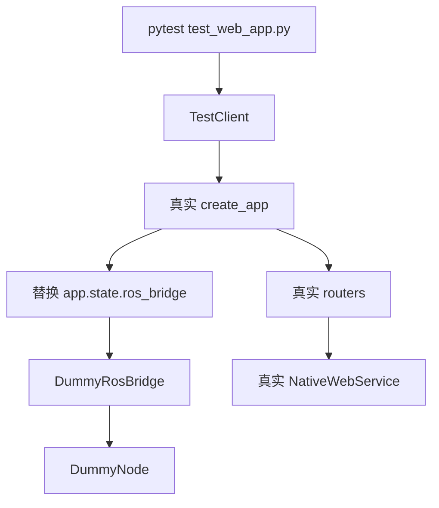
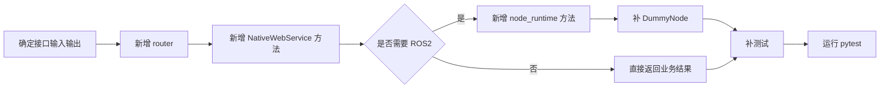
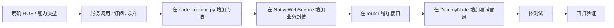

# FastAPI 架构图与调用时序图

这份文档用 Mermaid 图把当前 FastAPI 架构、请求流向、迁移前后对比、测试分层方式画出来。

适合：

- 自己快速回顾整体结构
- 给新成员讲解
- 做交接说明

---

## 1. 当前整体架构图

```mermaid
flowchart TD
    A[浏览器 / 前端] --> B[FastAPI app.py]
    B --> C[routers/*.py]
    C --> D[services/native_api.py]
    D --> E[RosBridgeManager]
    E --> F[ROS2Node node_runtime.py]
    F --> G[ROS2 服务 / 话题]
    D --> H[runtime_support.py]
    D --> I[params_manager.py]
    B --> J[ws/manager.py]
    B --> K[StaticFiles]
    K --> L[/static]
    K --> M[/legacy-ui]
```

这张图表达的是：

- 浏览器不直接碰 ROS2
- FastAPI 是唯一 Web 入口
- 路由只负责分发
- Service 负责业务
- Bridge 负责 ROS2

---

## 2. 一次普通 API 请求的时序图

以 `POST /api/capture_image` 为例：



---

## 3. WebSocket 状态连接时序图



---

## 4. FastAPI 生命周期图

```mermaid
flowchart TD
    A[create_app] --> B[创建 FastAPI app]
    B --> C[挂载 paths / ros_bridge / ws_manager / native_service]
    C --> D[注册路由]
    D --> E[应用启动]
    E --> F[lifespan start]
    F --> G[ros_bridge.start()]
    G --> H[后台 ROS2 spin 线程启动]
    H --> I[对外提供接口服务]
    I --> J[应用关闭]
    J --> K[lifespan finally]
    K --> L[ws 广播 shutdown]
    L --> M[ros_bridge.stop()]
```

---

## 5. 迁移前后架构对比图

### 5.1 迁移前



特点：

- 所有事情都在一个大文件里
- HTTP、业务、ROS2、Debug、文件操作耦合在一起

### 5.2 迁移后



特点：

- 路由、业务、ROS2、工具层拆开
- Web 入口唯一
- 更适合扩展和测试

---

## 6. 测试分层图



这张图的重点是：

- 测试没有直接测单个小函数
- 测试保留了真实 FastAPI 应用结构
- 但把最重的外部依赖换成 Dummy

---

## 7. 新增接口时的开发流向图



---

## 8. 新增 ROS2 能力时的开发流向图



---

## 9. 一句话总结

当前架构最核心的一点可以用一句话概括：

- FastAPI 负责 Web 入口与组织结构，ROS2 bridge 负责机器人通信，测试层负责为迁移和扩展兜底。
