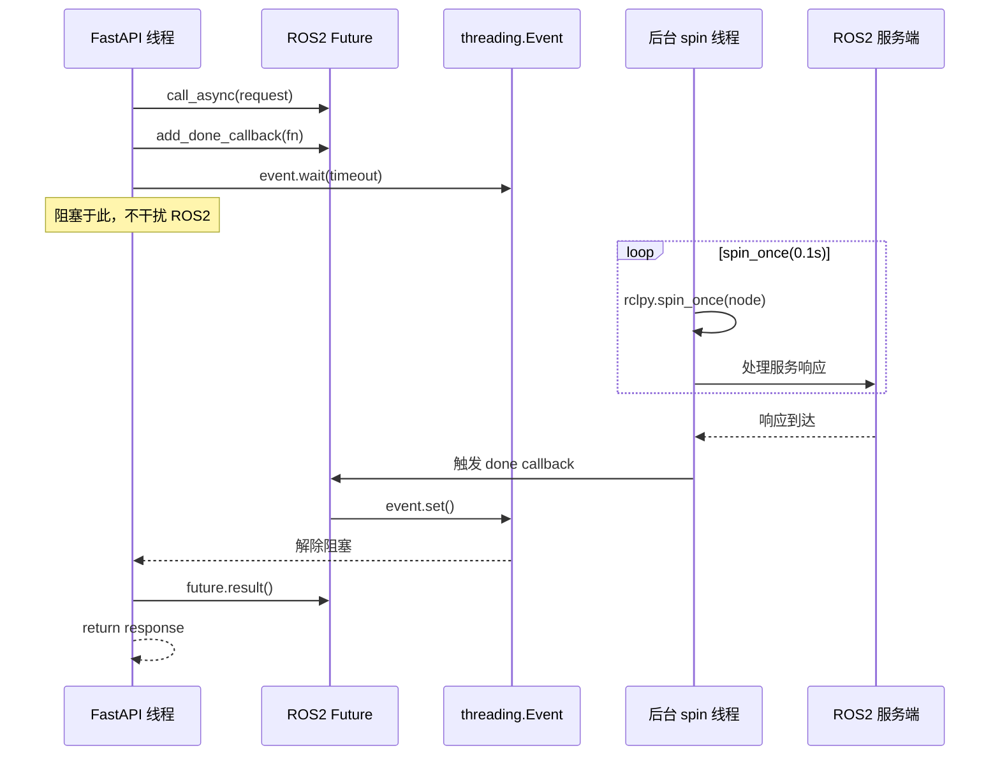
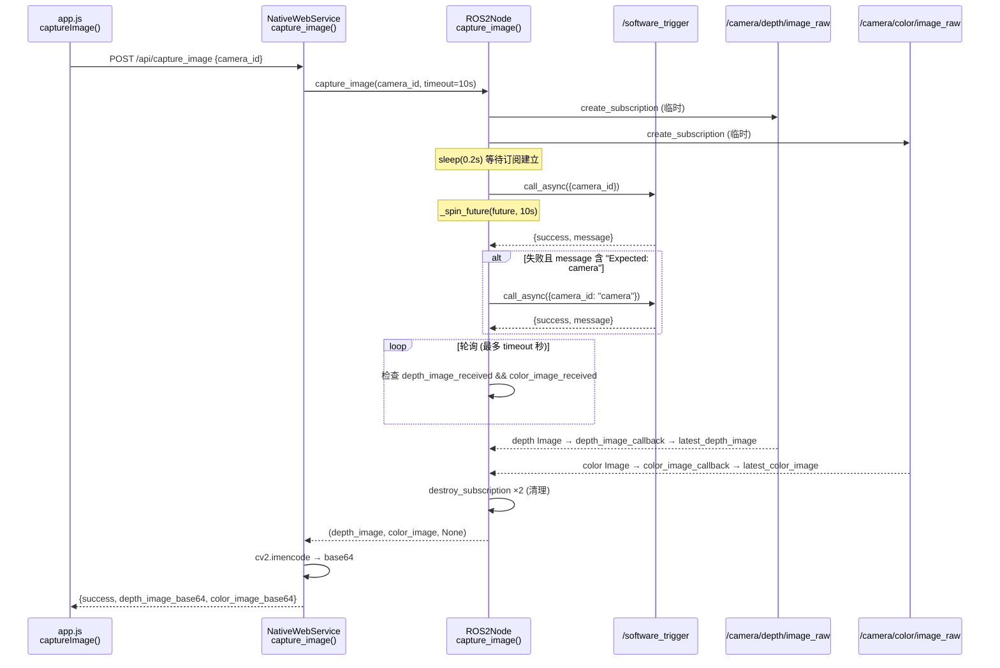
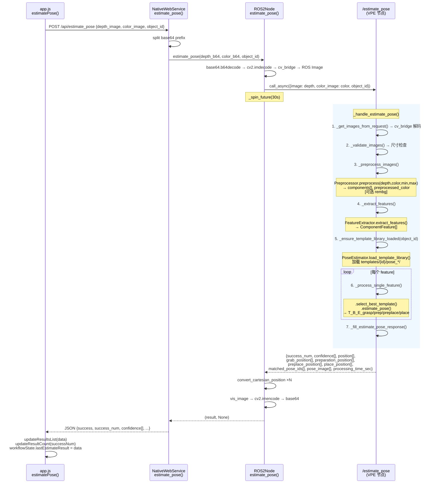
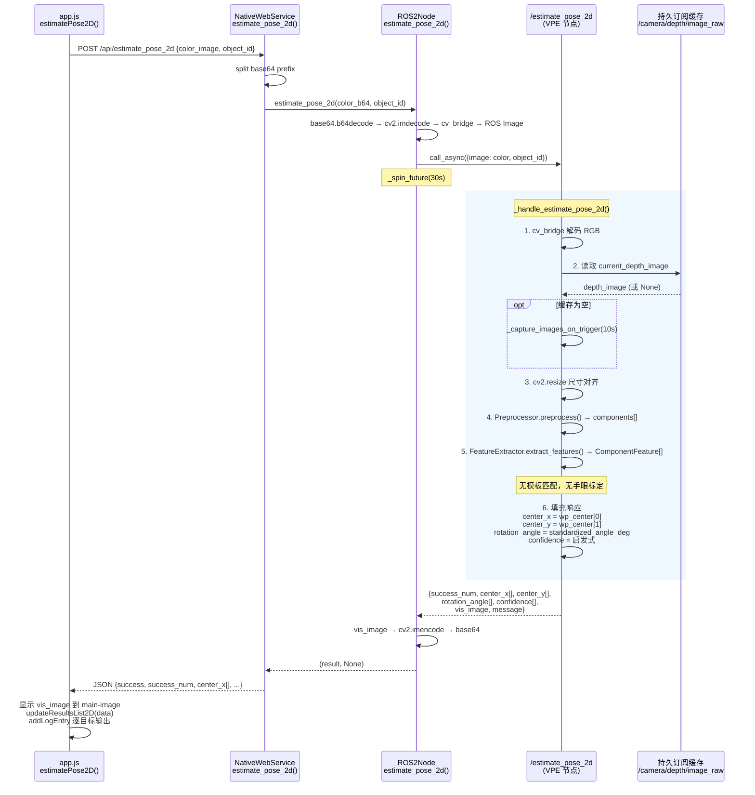
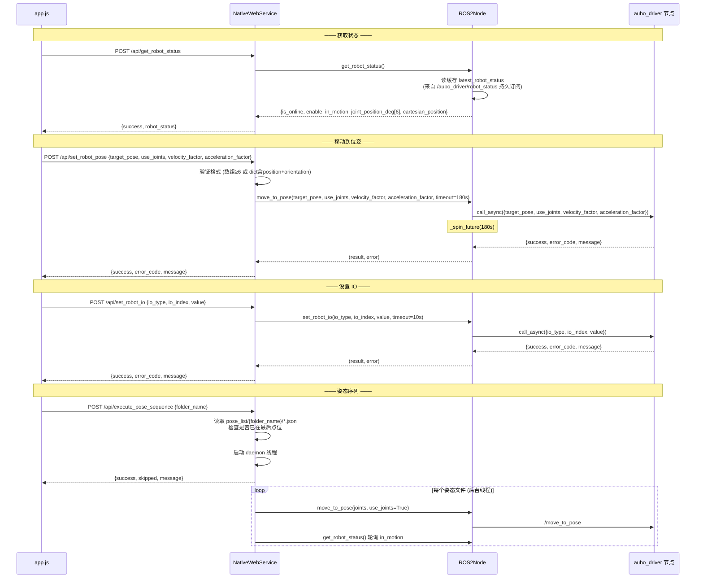
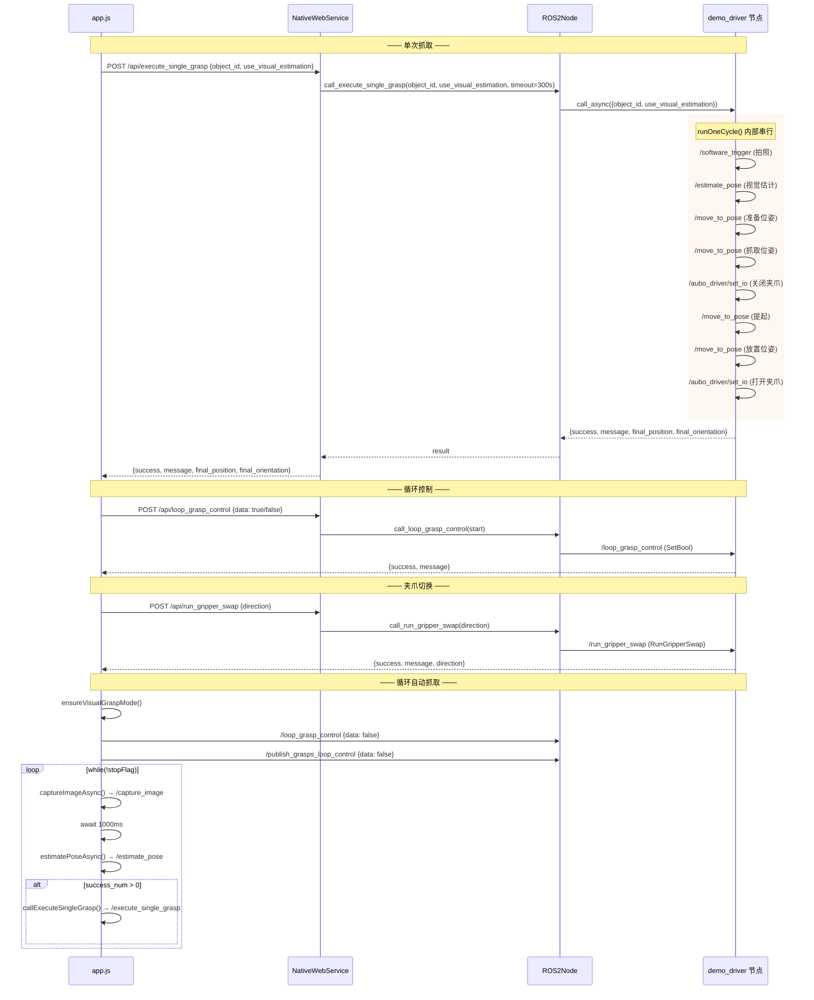
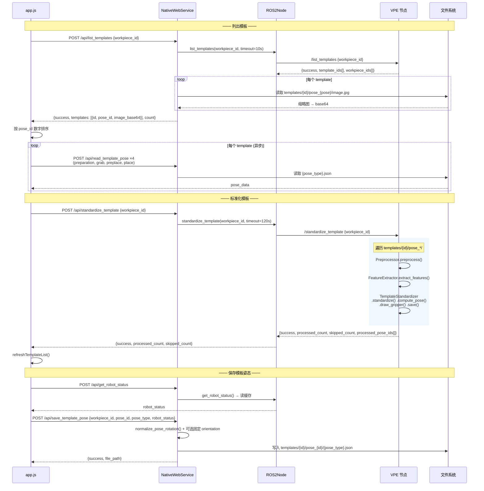
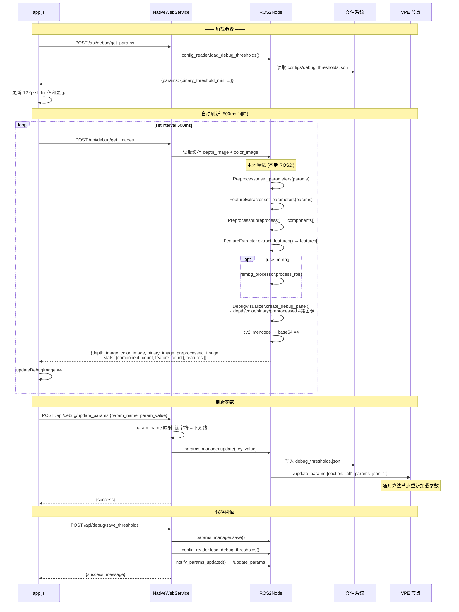
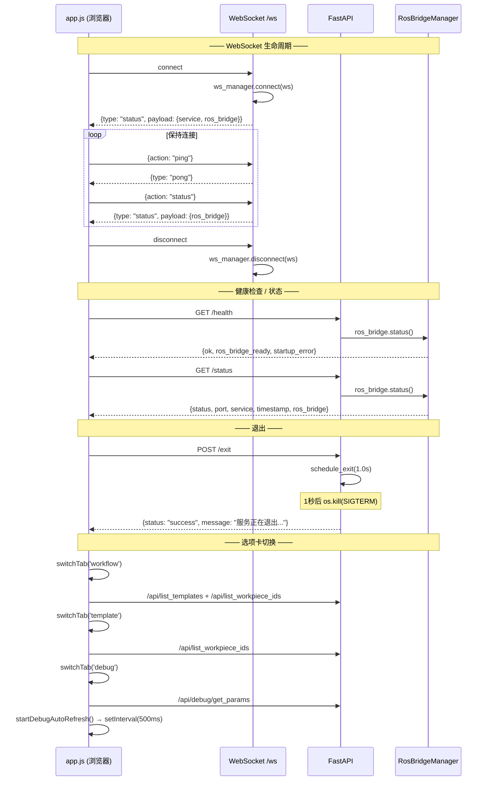

# API 调用流程文档

本文档描述前端 (`web_ui/`) → FastAPI Web Server → ROS2 节点的完整调用链路，包含每个 API 调用的 ROS2 服务/话题、请求参数、响应结构。

---

## 调用关系总图

```mermaid
graph TB
    subgraph Browser["浏览器 (app.js)"]
        F1["captureImage()"]
        F2["estimatePose()"]
        F3["estimatePose2D()"]
        F4["autoGrasp()"]
        F5["loopAutoGrasp()"]
        F6["openGripper() / closeGripper()"]
        F7["executeRobotPose()"]
        F8["getRobotPose()"]
        F9["standardizeTemplate()"]
        F10["refreshTemplateList()"]
        F11["debugCaptureImage()"]
        F12["debugRefreshImages()"]
        F13["toggleLoopAutoGrasp()"]
    end

    subgraph FastAPI["FastAPI Web Server (port 8088)"]
        subgraph Routers["routers/"]
            R1["camera.py<br>/api/capture_image<br>/api/capture_template_image"]
            R2["pose.py<br>/api/estimate_pose<br>/api/estimate_pose_2d"]
            R3["robot.py<br>/api/get_robot_status<br>/api/set_robot_pose<br>/api/set_robot_io<br>/api/execute_pose_sequence"]
            R4["grasp.py<br>/api/execute_single_grasp<br>/api/loop_grasp_control<br>/api/publish_grasps_loop_control<br>/api/run_gripper_swap"]
            R5["templates.py<br>/api/list_templates<br>/api/standardize_template<br>/api/read_template_pose<br>/api/save_template_pose"]
            R6["debug.py<br>/api/debug/capture<br>/api/debug/get_images<br>/api/debug/update_params<br>/api/debug/get_params<br>/api/debug/save_thresholds"]
            R7["system.py<br>GET /health /status<br>POST /exit<br>WS /ws"]
        end
        SVC["NativeWebService<br>(services/native_api.py)"]
    end

    subgraph ROS2Node["ROS2Node (node_runtime.py)<br>algorithm_http_server_node"]
        subgraph Persist["持久订阅 (后台持续)"]
            PS1["/aubo_driver/robot_status<br>→ latest_robot_status"]
            PS2["/image_data<br>→ latest_image_data"]
        end
        subgraph Clients["ROS2 客户端 (按需调用)"]
            CL1["capture_image()"]
            CL2["estimate_pose()"]
            CL3["estimate_pose_2d()"]
            CL4["list_templates()"]
            CL5["standardize_template()"]
            CL6["move_to_pose()"]
            CL7["set_robot_io()"]
            CL8["call_execute_single_grasp()"]
            CL9["call_loop_grasp_control()"]
            CL10["call_publish_grasps_loop_control()"]
            CL11["call_run_gripper_swap()"]
            CL12["notify_params_updated()"]
        end
        Local["本地算法模块<br>Preprocessor<br>FeatureExtractor<br>ConfigReader<br>ParamsManager"]
    end

    subgraph SpinThread["后台 spin 线程 (manager.py)"]
        SPIN["rclpy.spin_once(node, 0.1s)<br>处理回调 + 服务响应"]
    end

    subgraph ROS2Services["ROS2 服务端"]
        subgraph VPE["visual_pose_estimation_python 节点"]
            S1["/estimate_pose<br>(EstimatePose)"]
            S2["/estimate_pose_2d<br>(EstimatePose2D)"]
            S3["/list_templates<br>(ListTemplates)"]
            S4["/standardize_template<br>(StandardizeTemplate)"]
            S5["/update_params<br>(UpdateParams)"]
        end
        subgraph Aubo["aubo_driver 节点"]
            S6["/move_to_pose<br>(MoveToPose)"]
            S7["/aubo_driver/set_io<br>(SetRobotIO)"]
            T1["/aubo_driver/robot_status<br>(RobotStatus) 话题"]
        end
        subgraph Demo["demo_driver 节点"]
            S8["/execute_single_grasp<br>(ExecuteGraspPose)"]
            S9["/loop_grasp_control<br>(SetBool)"]
            S10["/publish_grasps_worker_loop_control<br>(SetBool)"]
            S11["/run_gripper_swap<br>(RunGripperSwap)"]
        end
        subgraph Camera["camera_control 节点"]
            S12["/software_trigger<br>(SoftwareTrigger)"]
            T2["/camera/depth/image_raw<br>(Image) 话题"]
            T3["/camera/color/image_raw<br>(Image) 话题"]
            T4["/image_data<br>(ImageData) 话题"]
        end
    end

    F1 & F2 & F3 & F4 & F5 & F6 & F7 & F8 & F9 & F10 & F11 & F12 & F13 --> Routers
    Routers --> SVC
    SVC --> Clients
    SVC --> Persist
    SVC --> Local

    CL1 --> S12
    CL1 -.临时订阅.-> T2
    CL1 -.临时订阅.-> T3
    CL2 --> S1
    CL3 --> S2
    CL4 --> S3
    CL5 --> S4
    CL6 --> S6
    CL7 --> S7
    CL8 --> S8
    CL9 --> S9
    CL10 --> S10
    CL11 --> S11
    CL12 --> S5

    Clients -.call_async + _spin_future.-> SPIN
    Spin -.event.set().-> Clients

    PS1 -.订阅.-> T1
    PS2 -.订阅.-> T4

    S1 --> VPE_ALGO["Preprocessor → FeatureExtractor<br>→ PoseEstimator<br>→ 3D 位姿"]
    S2 --> VPE_ALGO2["读缓存深度图<br>→ Preprocessor → FeatureExtractor<br>→ 2D 结果"]
    S4 --> VPE_ALGO3["Preprocessor → FeatureExtractor<br>→ TemplateStandardizer"]
```

---

## 调度机制

### threading.Event + 后台 spin 线程



---

## 按功能分组的调用关系图

### 1. 图像采集链



### 2. 姿态估计链 (3D)



### 3. 2D 姿态估计链 (新增)



### 4. 机器人控制链



### 5. 抓取操作链



### 6. 模板管理链



### 7. 调试链



### 8. 系统链



---

## 完整 API 清单

### 相机

| 方法 | 端点 | 超时 | 调用的 ROS2 服务/话题 | 说明 |
|------|------|------|----------------------|------|
| POST | `/api/capture_image` | 20s | `/software_trigger` + 临时订阅 `/camera/depth/image_raw`, `/camera/color/image_raw` | 触发拍照，返回深度图+彩色图 base64 |
| POST | `/api/capture_template_image` | 20s | 同上 | 拍照并保存为模板原始图像 |

### 姿态估计

| 方法 | 端点 | 超时 | 调用的 ROS2 服务/话题 | 说明 |
|------|------|------|----------------------|------|
| POST | `/api/estimate_pose` | 30s | `/estimate_pose` | 3D 姿态估计，含模板匹配和手眼标定 |
| POST | `/api/estimate_pose_2d` | 30s | `/estimate_pose_2d` + 读缓存 `/camera/depth/image_raw` | 2D 姿态估计，仅像素坐标和旋转角度 |

### 机器人控制

| 方法 | 端点 | 超时 | 调用的 ROS2 服务/话题 | 说明 |
|------|------|------|----------------------|------|
| POST | `/api/set_robot_pose` | 180s | `/move_to_pose` | 机械臂运动到指定位姿 |
| POST | `/api/set_robot_io` | 10s | `/aubo_driver/set_io` | 设置数字/模拟 IO 输出 |
| POST | `/api/get_robot_status` | 立即 | 读缓存 `/aubo_driver/robot_status` | 获取当前机器人状态 |
| POST | `/api/execute_pose_sequence` | 300s | `/move_to_pose` ×N + 轮询 `/aubo_driver/robot_status` | 执行位姿序列（后台线程） |

### 抓取操作

| 方法 | 端点 | 超时 | 调用的 ROS2 服务/话题 | 说明 |
|------|------|------|----------------------|------|
| POST | `/api/execute_single_grasp` | 300s | `/execute_single_grasp` (worker 内部串行调用全部) | 单次完整抓取流程 |
| POST | `/api/loop_grasp_control` | 10s | `/loop_grasp_control` (SetBool) | 启停循环抓取 |
| POST | `/api/publish_grasps_loop_control` | 10s | `/publish_grasps_worker_loop_control` (SetBool) | 启停 GraspNet 循环 |
| POST | `/api/run_gripper_swap` | 可配置 | `/run_gripper_swap` | 快换操作 |

### 模板管理

| 方法 | 端点 | 超时 | 调用的 ROS2 服务/话题 | 说明 |
|------|------|------|----------------------|------|
| POST | `/api/list_templates` | 5s | `/list_templates` + 文件读取缩略图 | 列出模板 |
| POST | `/api/list_workpiece_ids` | 5s | 无 (纯文件系统) | 列出工件 ID |
| POST | `/api/standardize_template` | 60s | `/standardize_template` | 模板标准化 |
| POST | `/api/read_template_pose` | 5s | 无 (纯文件读取) | 读取模板位姿 |
| POST | `/api/save_template_pose` | 5s | 无 (纯文件写入) | 保存模板位姿 |
| GET | `/api/get_template_image` | 立即 | 无 (纯静态文件) | 下载模板图像 |

### 调试

| 方法 | 端点 | 超时 | 调用的 ROS2 服务/话题 | 说明 |
|------|------|------|----------------------|------|
| POST | `/api/debug/capture` | 20s | `/software_trigger` + 临时订阅 | 调试拍照 |
| POST | `/api/debug/get_images` | 5s | 无 (本地 Preprocessor/FeatureExtractor/DebugVisualizer) | 获取 4 路调试图像 |
| POST | `/api/debug/update_params` | 5s | `/update_params` (通知) + 文件写入 | 更新参数 |
| POST | `/api/debug/get_params` | 5s | 无 (纯文件读取) | 获取参数 |
| POST | `/api/debug/save_thresholds` | 5s | `/update_params` (通知) + 文件写入 | 保存阈值 |
| POST | `/api/save_debug_features` | 5s | 无 (纯文件写入 CSV) | 保存调试特征 |

### 系统

| 方法 | 端点 | 说明 |
|------|------|------|
| GET | `/health` | 健康检查 |
| GET | `/status` | 系统状态 |
| POST | `/exit` | 关闭服务 (SIGTERM) |
| WS | `/ws` | WebSocket 状态推送 |

---

## API 参数速查

### POST `/api/set_robot_pose`

| 参数 | 类型 | 默认值 | 说明 |
|------|------|--------|------|
| `target_pose` | `float[6]` 或 `float[7]` 或 `{position, orientation}` | 必填 | `[x,y,z, qx,qy,qz(,qw)]` 或 `{position: {x,y,z}, orientation: {x,y,z,w}}` |
| `use_joints` | bool | false | true=关节空间, false=笛卡尔空间 |
| `velocity_factor` | float64 | 0.08 | 速度缩放 (0-1) |
| `acceleration_factor` | float64 | 0.05 | 加速度缩放 (0-1) |
| `timeout_sec` | float64 | 180.0 | 超时秒数 (限制 5-600) |

### POST `/api/set_robot_io`

| 参数 | 类型 | 默认值 | 说明 |
|------|------|--------|------|
| `io_type` | string | 必填 | `"digital_output"` 等 |
| `io_index` | int32 | 必填 | 夹爪: `6` |
| `value` | float64 | 必填 | 打开: `0.0`, 关闭: `1.0` |

### POST `/api/estimate_pose`

| 参数 | 类型 | 默认值 | 说明 |
|------|------|--------|------|
| `depth_image` | string (base64) | 必填 | 深度图 (PNG) |
| `color_image` | string (base64) | 必填 | 彩色图 (JPEG) |
| `object_id` | string | 必填 | 工件ID |

### POST `/api/estimate_pose_2d`

| 参数 | 类型 | 默认值 | 说明 |
|------|------|--------|------|
| `color_image` | string (base64) | 必填 | 彩色RGB图 (JPEG) |
| `object_id` | string | 必填 | 工件ID |

### POST `/api/run_gripper_swap`

| direction | 含义 |
|-----------|------|
| `"gripper0_to_gripper2"` | 完整快换: 视觉夹爪0 → AI夹爪2 |
| `"gripper2_to_gripper0"` | 完整快换: AI夹爪2 → 视觉夹爪0 |
| `"gripper2"` | 简程: 当前位置 → AI夹爪2 |

### 调试参数 (debug_thresholds.json)

| 参数名 | 前端 slider ID | 默认值 | 范围 | 说明 |
|--------|---------------|--------|------|------|
| `binary_threshold_min` | `min-depth-slider` | 0 | 0-65535 | 深度二值化下限 |
| `binary_threshold_max` | `max-depth-slider` | 2149 | 0-65535 | 深度二值化上限 |
| `component_min_area` | `contour-min-area-slider` | 10 | 1-100000 | 连通域最小面积 |
| `component_max_area` | `contour-max-area-slider` | 100000 | 1-1000000 | 连通域最大面积 |
| `component_min_aspect_ratio` | `min-aspect-slider` | 0.3 | 0.1-10.0 | 最小宽高比 (前端值÷10) |
| `component_max_aspect_ratio` | `max-aspect-slider` | 4.0 | 0.1-10.0 | 最大宽高比 (前端值÷10) |
| `component_min_width` | `min-width-slider` | 60 | 1-500 | 最小宽度 (像素) |
| `component_min_height` | `min-height-slider` | 60 | 1-500 | 最小高度 (像素) |
| `component_max_count` | `max-count-slider` | 3 | 1-20 | 最大连通域数量 |
| `enable_smooth_edges` | `enable-smooth-edges-slider` | True | 0/1 | 启用边缘平滑 |
| `smooth_edges_blur_sigma` | `smooth-edges-blur-sigma-slider` | 0 | 0-30 | 平滑高斯σ (前端值÷10, 0=关闭) |
| `use_rembg` | `use-rembg-slider` | False | 0/1 | 启用背景去除 |
| `enable_zero_interp` | (无前端 slider) | True | bool | 启用零值插值 |

---

## 消息结构速查

### EstimatePose.Response (3D)

```
success_num: int32
confidence: float64[]
position: geometry_msgs/Point[]         ← 图像坐标系中心点
grab_position: CartesianPosition[]       ← 抓取位姿
preparation_position: CartesianPosition[] ← 准备位姿
preplace_position: CartesianPosition[]  ← 预放置位姿
place_position: CartesianPosition[]     ← 放置位姿
matched_pose_ids: string[]              ← 匹配的模板 pose_id
pose_image: sensor_msgs/Image[]         ← 可视化图像
processing_time_sec: float32
```

### EstimatePose2D.Response (2D)

```
success_num: int32
center_x: float32[]        ← 目标中心 X 像素坐标
center_y: float32[]        ← 目标中心 Y 像素坐标
rotation_angle: float32[]  ← 旋转角度（度）
confidence: float32[]      ← 置信度（0-1.0）
vis_image: sensor_msgs/Image
message: string
```

### CartesianPosition

```
position: {x, y, z}
orientation: {x, y, z, w}
euler_orientation_rpy_rad: float64[3]
euler_orientation_rpy_deg: float64[3]
joint_position_rad: float64[6]
joint_position_deg: float64[6]
```

### RobotStatus (来自 `/aubo_driver/robot_status`)

```
header: {stamp, frame_id}
is_online: bool
enable: bool
in_motion: bool
joint_position_deg: float64[6]
joint_position_rad: float64[6]
cartesian_position: CartesianPosition
```

---

## 并发安全

| 组件 | 保护机制 | 锁粒度 |
|------|---------|--------|
| 图像缓存 | `threading.Lock` (image_lock) | latest_depth_image, latest_color_image, image_received |
| 机器人状态 | `threading.Lock` (robot_status_lock) | latest_robot_status |
| ROS2 Future 等待 | `threading.Event` (回调驱动) | 每个 Future 独立 Event |
| 前端机器人移动请求 | `_setRobotPoseInFlight` + `_moveToPoseLock` | 同一时刻只允许一个 /api/set_robot_pose |
| 前端夹爪切换 | `_switchFlowInProgress` | 同一时刻只允许一个切换流程 |
| 前端循环抓取 | `_loopAutoGraspRunning` + `_loopAutoGraspStopFlag` | 唯一循环实例 |
| WebSocket 广播 | `asyncio.Lock` | 广播期间保护连接集合 |

### 已知限制

- 长时操作（move_to_pose 180s、execute_single_grasp 300s）期间，FastAPI 线程被 `Event.wait()` 阻塞，但不干扰 ROS2 调度。
- `POST /exit` 在长时操作进行中可能延迟响应，直到当前 Future 完成或超时。
- 建议实际部署时使用 uvicorn `--workers 2` 提高并发处理能力。
- `/api/debug/get_images` 在 HTTP 线程内直接调用 Preprocessor/FeatureExtractor (同步 OpenCV)，避免在 debug 自动刷新期间同时执行 `/api/estimate_pose`。
- 前端 `captureImage()` 默认 camera_id="207000152740"，若相机驱动期望 "camera" 会自动重试，增加约 10s 延迟。


