# 软件项目设计架构

权威：本文件 + 各包 `config/*.yaml` + 源码。与 [io.md](io.md)、[testing.md](testing.md) 构成仅有的三份活文档；**源码与本文互相更新，改一边须同一轮改另一边**。真机轮次：[testing-log.md](testing-log.md)。约束：[AGENTS.md](../AGENTS.md)。

**每条事实三问：** 现行 → 来源 → 原因（无注释则「源码未写理由」）。

Robotics_Tutorial 教程库已归档 `_archive/parked_2026-09/`，不再随库。分割器当前 YOLO-det + MobileSAM（直接构造；换实现改源码）。

**图：**
- **架构（C4，一张图一个缩放级）：** 图 1 系统上下文 · 图 2 容器 · 图 3 技能节点组件
- **边界速览：** 图 0 预留/核/驱动 · 图 A 核内分层
- **交互：** 图 B 控制面与数据面
- **流程（§4）：** 图 C 一批 RunHarvest · 图 D ExecuteTarget 阶段序列 · 决策栈 · 缝位

画法：[C4 模型](https://c4model.com/)（Simon Brown）：上下文把本栈画成**一个盒子**；容器图再打开盒子，盒子是**可运行进程**；组件图再打开其中一个进程。本文件用 `flowchart` 表达这三级（编辑器内置 Mermaid 不解析 `C4Context` 语法）。包、类、批次数不要画进上一层。流程图/时序图在 §4。话题契约在 [io.md](io.md)。

---

## 1. 产品定位

- **愿景：** 果园套袋桃采摘（室外光照、枝叶遮挡、将来底盘移动）。
- **本仓库现行产品：** 固定座 AUBO E5 + Percipio RGB-D。colcon 14 包 = 臂/相机 9 + 采摘 4 + 可选 USB IMU 1。
- **范围：** 果园是愿景。核心栈四包：契约 / 视觉 / 臂 / 调度。底盘与雷达**驱动**本仓不实现；导航适配 `peach_navigation` 已归档（`_archive/parked_2026-09/`），`NavigateToWorksite` / `HarvestTargetReport` / `HarvestOperationStatus` / `VehicleState` 四个 IDL 保留标「预留」（manifest `reserved_interfaces` 区），调度到位一步直通 `NAV_OK`。
- **近期成功标准：** [testing.md](testing.md) 现行定位门是 `PREGRASP_ONLY`：到预抓取停住，不回 `harvest_stow`、不套入、不 SetIO。套入干跑须把 `execute_pregrasp_only` 改 false（默认 `tool.enabled=false`）。切断+撤退均确认才记采摘成功。树干进 PlanningScene 是预留，本仓不实现。
- **非目标：** launch 自动 `RunHarvest`；感知发运动；技能写账本；学习模型补深度；nvblox；改只读驱动栈。

现场基线（归档数字与轮次：[testing-log.md](testing-log.md)）：相机已运行 ~2.4–2.5 FPS（launch 仍请求 5.0）。现行 `PREGRASP_ONLY` 停袋底对照：`field_pregrasp_20260901_1757:target_1`（目视方向与定位中上水平，只需微调）。

**产品结论：** 栈能跑完全流程。失败不在缺包，而在观察节拍、身份新鲜度、可达性门、会话隔离没有按 2.5 FPS 停走式相机做成一等公民。

---

## 2. 原则

对照 Nav2（lifecycle、插件面、BT 恢复）、MoveIt/MTC（stage + 轨迹护栏）、Autoware（组件图 + 话题契约）、ros2_control（参数库；硬件本仓只读借用）。

1. **契约先于实现。** 跨包名字与 QoS 以 [interface_manifest.yaml](../src/peach_interfaces/config/interface_manifest.yaml) 为准。感知不发运动；批次唯一所有者是 `peach_executor`。
2. **替换走缝位，不拆包。** 单实现直接构造。仅袋/果位姿管线与柱/球 refitter 留 dict 映射（yaml `pipeline.*_impl` / `refitter.*_impl`）；技能原 C++ 工厂缝位已收回。不上 pluginlib。
3. **失败可定位、可跳过。** 每个目标必须有 `failure_code`。观察失败不接触；规划失败不执行残缺轨迹。
4. **停走式感知是产品相机模型。** 节拍按实测 ~2.5 FPS + 静止门，不是 5 Hz 连续积分，也不是参考文 0.8 FPS。覆盖预算优于 `max_views=24`。
5. **套入/剪切唯一权威是 `GraspDecision.allowed`。** 感知 ACCEPT 只当初值/可视化。融合成功时入口/轴/剪切参考有效，`PREGRASP_ONLY` 可据此到预抓取。`allowed=false` 禁止套入/SetIO，禁止单帧候选降级接触。套入许可走逐目标动态径向/轴向预算；固定 35° 只诊断完全错轴。
6. **会话有边界。** 一次 `RunHarvest` 对应一份 run 目录；批次结束必须停写 jsonl。
7. **导航已归档，不是底盘驱动。** `peach_navigation` 包体在 `_archive/parked_2026-09/`，不进 colcon 构建；四个导航 IDL 在 manifest 标「预留」并由清单脚本双向核对。调度 `_cmd_navigate` 固定座直通 `NAV_OK`，不发动作。雷达/odom/cmd_vel 驱动与 Nav2 接线须另授权后从归档恢复，不加第五个 peach 包。

---

## 3. 分层与能力包

下面三张按 C4 缩放：先看人和外部设备，再看工控机里跑哪些进程，最后看技能节点内部模块。不是时间顺序。一批怎么跑见 §4。

### 最终架构：五层 + 契约（R1–R7 解耦不变量）

```
契约层  peach_interfaces（IDL + manifest 双向核对）——全栈唯一通信语言
L0 传感驱动层  相机/臂驱动/TF                 【数据出生·只读红线】
   TF 拓扑唯一合法帧集（多出来的即旧实例污染，预检拒启）：
   /tf 动态=base→shoulder→upperArm→foreArm→wrist1/2/3（robot_state_publisher，关节序见 AGENTS）；
   /tf_static=world→base/table、wrist3→{camera_body,camera_link,tool_axis}、
   tool_axis→{tcp,sleeve_mouth,cutting_plane,tool_body}、camera_link→{color,depth}→各自 optical、
   camera_body→quick_changer（extrinsics_publisher 只发 wrist3→camera_link，其余 URDF）。
   历史污染源=多代 robot_state_publisher 残留（旧命名 link1/link2/tip 链）与多代 `extrinsics_publisher`（叠发 wrist3→camera_link），09-01 已入预检（含手眼发布器）。
L1 感知算法层  检测→身份→重建→融合→许可        【事实生产】
   真相流（全量+confirmed 标记）/稳定流（confirmed-only 画布与点云）/模型流（GraspDecision 等）
L2 决策调度层  联合约束选果→FSM→派发→账本      【决策生产】
   有效深度窗 ∩ TCP IK 可达（CheckReachability，唯一反向例外 R2）∩ 框面积次序
L3 运动执行层  授权矩阵→笛卡尔规划→执行→IO     【动作生产】
L4 呈现层      RViz 稳定视图 + HTTP 作业票 + 选择叠加（selected 环/淘汰 X）【只读横切】
L5 过程数据记录层 单根会话目录 runs/<request_id>/（账本+9 jsonl+双流图像
   img_*/raw_img_*+perception_data+sessions+geometry+summary 验收门）【只读横切】
```

不变量：R1 跨层只经契约包；R2 数据流单向（L2→L3 IK 查询唯一例外）；R3 呈现不回写（像素叠加留在归属进程 presentation 模块，双流显式）；R4 筛选维度归位（身份确认=L1 事实属性、执行可行性=L2 联合约束、渲染不发明筛选）；R5 纯核零 ROS；R6 运动收敛授权矩阵、能力绑 Active；R7 记录只增不删、单根会话目录（三写点按 HarvestState.run_id 路由，无批次回退旧布局）。

### 图 1 — 系统上下文（C4 Context）

本栈是**一个**软件系统。周围是人、柜、相机、示教器。内部节点不要出现在这张图上。

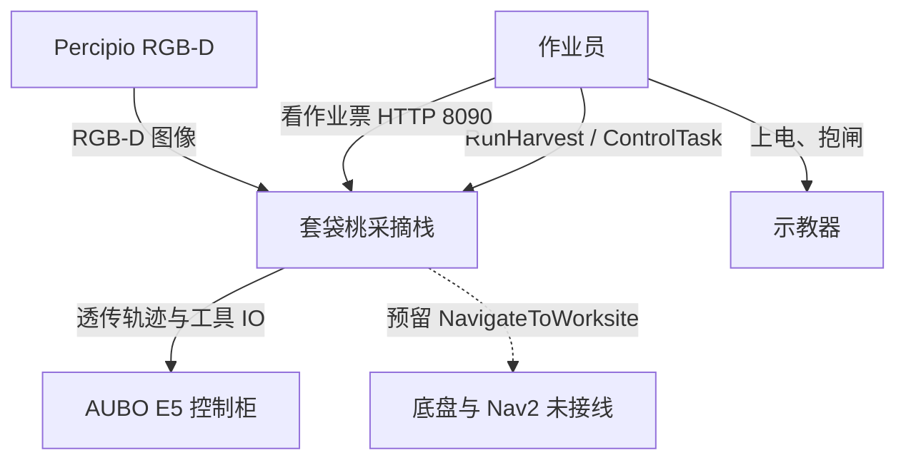

**读图：** 中间实心盒子才是我们写的软件。作业员不经过监控去动臂。柜和相机是外部系统：本栈不实现其驱动协议以外的产品逻辑。底盘盒子画虚关系：导航为预留（导航包已归档），调度直通 `NAV_OK`。`peach_interfaces` 没有进程，上下文层不单独成盒。

### 图 2 — 容器（C4 Container）

打开图 1 中间那个盒子。每个容器是**可独立运行的进程/节点**，不是 colcon 包名。箭头上写它运的东西（动作、话题、HTTP），不要写「然后」。

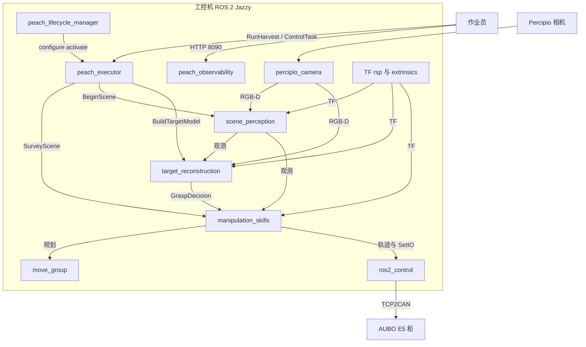

**读图：** 调度是唯一对采摘动作的客户端。感知两容器只出话题，不调 MoveIt。技能只对 `move_group` 和 `ros2_control` 要运动。监控只连作业员浏览器。lifecycle 管理器只管四能力节点，不管监控、不管 bringup。契约包 `peach_interfaces` 被上述容器编译依赖，本身不是容器。

### 图 3 — 组件（C4 Component）· 技能节点

再打开图 2 里的 `manipulation_skills`。盒子是该进程内的主要模块，不是每一个 `.cpp` 文件。

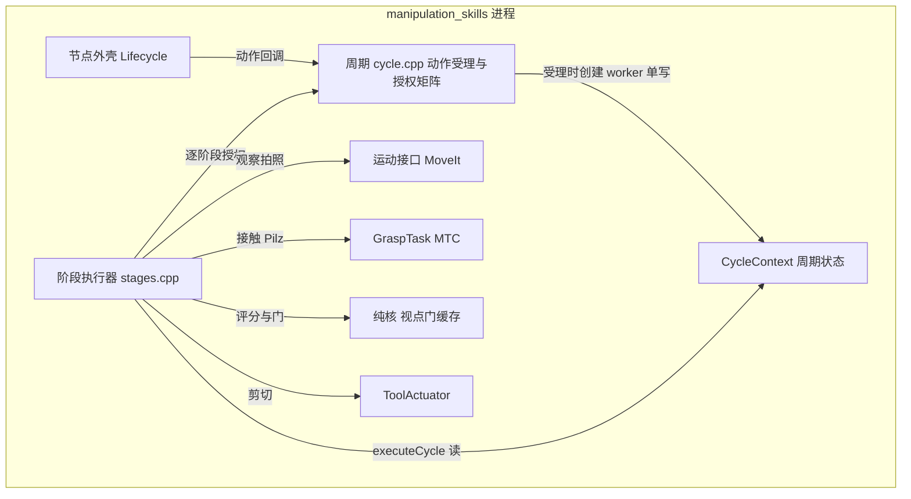

**读图：** 一个进程、八个组件（`ExecutionAuthority` 授权矩阵编在 `cycle.cpp`，`CycleContext` 在 `cycle_context.hpp`）。外壳不规划；`cycle.cpp` 受理动作并按 `authorizeStage` 判定执行权；阶段执行器读上下文跑固定阶段序列；接触用最短笛卡尔原语（LIN/CIRC）；PTP 只用于命名关节赶路（拍照位 / stow）；刀具不在 MTC 里。感知两容器的同缩放运行时图见 **图 3b（看一帧）/ 图 3c（建一颗）**；调度组件图按同样缩放另画，不要把那些模块塞进这一张。

### 图 0 — 预留层与采摘核

本仓 **colcon 包**边界速览，不是 C4。C4 容器是进程；这里盒子是包。

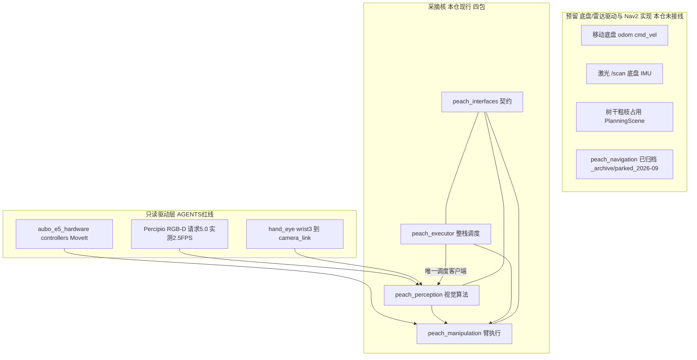

**读图：** 三块从上到下是「将来 / 现在干活 / 不许改的驱动」。导航适配移入预留层：包体已归档，只剩 manifest 里四个标「预留」的 IDL 名；调度 `_cmd_navigate` 直通 `NAV_OK`，不指向任何导航进程。实线：相机和手眼只进视觉；臂只进技能；调度是唯一能同时点视觉与臂的客户端。契约包没有箭头、不跑节点，只规定四包之间怎么说话。

采摘核仍不订 `/scan`、底盘 IMU、odom。可选包 `serial_imu` 单独发 `/imu/data`（及 `data_raw`/`mag`/`temp`），不进 lifecycle、不进 `harvest_system`。架子机 URDF/MoveIt 在 `_archive/parked_2026-08-24/`。

### 图 A — 核内分层

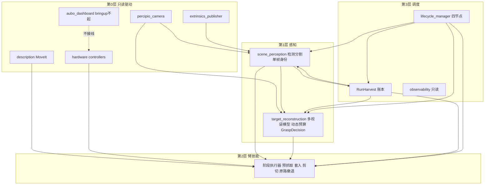

**读图：** 层号越大越「会拍板」。第 0 层只出图和关节，不选下一颗桃。第 1 层「看」出身份，「建」出这一颗的模型和是否允许套入。第 2 层只执行调度发来的动作。第 3 层才开批、写账本、拉生命周期（到位一步直通 `NAV_OK`，导航适配在预留层，见决策 0009）。`aubo_dashboard` 画成虚线：bringup 根本不起它。监控在调度包里，但 lifecycle 不管它。

禁止：能力包互发批次命令；感知调 MoveIt；技能写 `ledger.json`；bringup 起 `aubo_dashboard`。

### 图 B — 控制面与数据面

调度是能力包**批次动作的唯一客户端**；鉴权调试操作面（observability，默认三重关，见决策 0013）是唯一例外，可直发单颗动作且全部留审计。感知与重建只发话题；技能只当 `SurveyScene` / `ExecuteTarget` 服务端。监控视图只订不发。

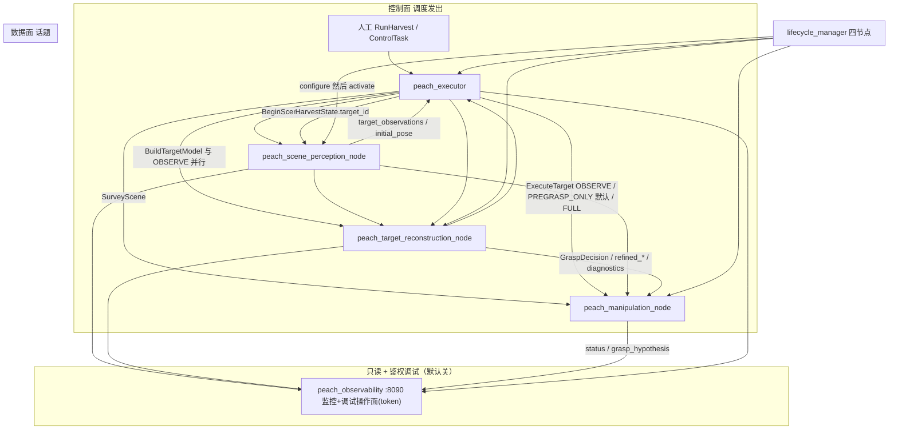

**读图：** 上块是「谁命令谁」（动作/服务），只有调度往外指。中块是「谁把数据广播给谁」（话题）；感知和重建从不互发动作。下块全是订阅，监控页不能开批、不能动臂。lifecycle 箭头与批次无关：只把四节点配到 Active，不上电、不开批，不发 `RunHarvest`。柜侧上电由人工用示教器完成。

lifecycle 名单：场景 → 重建 → 技能 → 调度。observability **不进名单**，节点自行 Active。

### 命名与文件树

ROS 2 Jazzy / ament 惯例。**包名与图名（节点、话题、动作、服务）保持契约**（[io.md](io.md)），不因整理文件而改图。驱动九包文件树不动。

| 层 | 规则 |
|----|------|
| 包名 | `peach_<职责>`，小写+下划线；与 `package.xml` / 目录名一致 |
| Python 模块 | `ament_python`：`src/<pkg>/<pkg>/`，模块名 = 包名 |
| C++ | `ament_cmake`：`include/<pkg>/`、`src/`、可执行文件名 = 节点名 |
| IDL | `peach_interfaces`：`msg/` `srv/` `action/` + `config/interface_manifest.yaml` |
| launch | 包根 `launch/<职责>.launch.py`；整栈入口固定 `harvest_system.launch.py` |
| config | 包根 `config/<职责>.yaml`；**根键 = 节点名** |
| 参数库 | `generate_parameter_library` 的 yaml 根键与节点名一致 |
| 类名 | 与职责一致：`ScenePerceptionNode` / `TargetReconstructionNode` / `ManipulationSkillsNode` / `TaskExecutorNode` / `LifecycleManagerNode` / `ObservabilityNode` |
| 可执行文件 | `ros2 run <pkg> <节点名>`；与 launch `executable=` 一致 |

职责对照（图名保持契约；源码目录/类跟职责）：

| 职责 | 图名 | 目录 / launch / config | 类 |
|------|------|------------------------|-----|
| 看 | `peach_scene_perception_node` | `scene_perception` | `ScenePerceptionNode` |
| 建 | `peach_target_reconstruction_node` | `target_reconstruction` | `TargetReconstructionNode` |
| 动 | `peach_manipulation_node` | `peach_manipulation` | `ManipulationSkillsNode` |
| 批 | `peach_executor` | `peach_executor` | `TaskExecutorNode` |
| 管 | `peach_lifecycle_manager` | `lifecycle_manager` | `LifecycleManagerNode` |
| 监 | `peach_observability` | `observability` | `ObservabilityNode` |

四个能力包现行树（其后 `serial_imu` 为可选传感器，不是能力包；`peach_navigation` 已归档，树在 `_archive/parked_2026-09/`）：

```
peach_interfaces/
  action/  msg/  srv/  config/interface_manifest.yaml  scripts/check_interface_manifest.py

peach_perception/
  peach_perception/common/{geometry,runtime,tool_budget,bag_landmarks,ros/clock_adapter}.py
  peach_perception/scene_perception/{scene_perception_node,stream_metrics,assignment,image_gates,pose_pipelines,inference,identity,contracts,visualization,params}.py
  peach_perception/target_reconstruction/{target_reconstruction_node,frame_store,capture,integrate,refine,publish,markers,params,bag_model,pregrasp_verification}.py
  peach_perception/{scene,target}_*_parameters.py  # 构建生成，gitignore
  peach_perception/grasp_standoffs.py            # 读 grasp_standoffs.yaml，launch 借此注入两节点参数
  config/{scene_perception,target_reconstruction,grasp_standoffs}.yaml  # 运行 yaml；轴向后撤只改 grasp_standoffs
  config/{scene_perception,target_reconstruction}_parameters.yaml  # GPL 参数库源
  launch/{scene_perception,target_reconstruction}.launch.py
  # 离线评估脚本已归档 _archive/offline_2026-09/（含 bag_baseline），不随包安装

peach_manipulation/
  include/peach_manipulation/   # 头 19：manipulation_skills_node / cycle{,_context,_state,_support} /
                                 # grasp_task / motion / tool_actuator / 纯核门与视点 / 几何与护栏
  src/*.cpp                      # cycle.cpp(授权矩阵+action 管线) stages.cpp(阶段函数) grasp_task.cpp(MTC 接触)
                                 # motion.cpp(MGI) manipulation_skills_node.cpp(壳) main.cpp
                                 # 纯核：quality_gate / safety_gate / view_planner / target_cache
  config/{peach_manipulation.yaml,manipulation_parameters.yaml}
  launch/peach_manipulation.launch.py

peach_executor/
  peach_executor/{executor_node,harvest_fsm,batch,lifecycle_manager}.py
  peach_executor/observability/{observability_node,state,recorder,http_server,params,tcp_trajectory,ros_viz}.py
  config/{peach_executor,observability,lifecycle_manager}.yaml          # 运行 yaml（launch 传）
  config/{executor,observability}_parameters.yaml  # GPL 参数库源
  launch/{harvest_system,peach_executor,lifecycle_manager,observability}.launch.py
  web/   # 只读监控静态页

serial_imu/
  serial_imu/{imu_node,protocol}.py
  config/serial_imu.yaml
  launch/serial_imu.launch.py
  rviz/serial_imu.rviz
  udev/99-imu-usb-serial.rules
```

旧名 `peach_pose` / `approach_grasp` 不再作路径。Marker 命名空间：场景 `scene_perception`；重建主 ns `target_reconstruction`，精化 `peach_reconstruction/refined`，网格 `peach_reconstruction/tsdf_mesh`。

### 十四包总表

colcon 14 包 = 采摘 4 + 臂/相机 9 + 可选 USB IMU 1。采摘四包作用不得串；驱动九包给感知 TF / 技能 MoveIt 用，其中标「只读」的不得改。`serial_imu` 不是 peach 包，不替代底盘 IMU。`peach_navigation` 已归档，不在本表（见下节）。

产品链：**契约 → 到位（预留，直通 NAV_OK）→ 场景里有哪些桃 → 这一颗的局部模型 → 臂怎么动。**

### 产品链四包

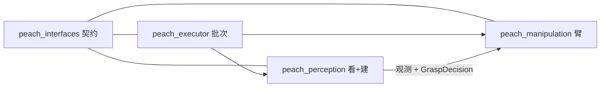

**读图：** 从左到右是产品链，不是启动顺序。调度（右）点视觉/臂；视觉把「有哪些桃」和「这一颗能不能套」交给臂。到位一步已从链上摘除：导航适配归档，调度 `_cmd_navigate` 直通 `NAV_OK`（`NavigateToWorksite` 等 IDL 预留，真底盘再恢复）。契约横线表示四包都只认同一套 IDL。

调度是整合层：唯一动作客户端，串联感知 → 臂。感知抓取已接线。lifecycle 管理器与只读监控仍在调度包，不独立成包。

| 包 | 层 | 作用（一句话） | 改不改 |
|----|----|----------------|--------|
| `peach_interfaces` | 契约 | 跨包唯一 IDL（含 4 个预留导航名） | 改字段只改这里 |
| `peach_perception` | 视觉 | 看场景 + 建当前目标 | 检测/分割/TSDF |
| `peach_manipulation` | 臂 | 拍照、视点、MTC、工具、撤退 | 视点/MTC/GPIO 参数 |
| `peach_executor` | 调度 | 开批、选果、账本、lifecycle、只读监控、整栈 launch | 批次顺序/名单 |
| `aubo_msgs` | 驱动契约 | 柜侧状态 / SetIO / FK·IK | 只读（驱动栈） |
| `aubo_description` | 几何 | URDF：臂、相机体、快换、`hollow_cylinder_v1` 工具轴/套筒口/刀片面/碰撞 | 工具帧与 collision 可改；`ros2_control.xacro` 只读 |
| `aubo_e5_hardware` | 硬件插件 | 真机 `SystemInterface` | **只读** |
| `aubo_e5_controllers` | 控制器 | 透传轨迹 + IO / `RobotStatus` | **只读** |
| `aubo_dashboard` | 柜侧慢操作 | 上电/抱闸/FK·IK/负载 | **只读且 bringup 不起** |
| `aubo_e5_bringup` | 手臂入口 | mock/real + 可选相机/手眼/MoveIt | **`bringup.launch.py` 只读** |
| `aubo_e5_moveit_config` | 规划配置 | 组 `manipulator_e5`、命名位姿、规划器 | 示教位姿写 SRDF |
| `aubo_hand_eye_calibration` | 手眼 | `wrist3_Link→camera_link` 静态 TF | 标定结果 gitignore |
| `percipio_camera` | 相机驱动 | RGB-D 话题 | 厂商代码；未授权不改 `frame_rate` |
| `serial_imu` | 可选 USB IMU | CH340 0xA4 → `/imu/data`（imu_tools 布局） | 不进采摘 launch / lifecycle |

改哪边：消息字段 → `peach_interfaces`；检测/分割/TSDF → `peach_perception`；视点/MTC/工具 IO 参数 → `peach_manipulation`；TCP/工具碰撞 mesh → `aubo_description`（勿改 `ros2_control.xacro`）；拍照命名位姿 → `aubo_e5_moveit_config` SRDF；批次顺序/选果/账本/lifecycle 名单 → `peach_executor`；到位/Nav2 → 归档的 `peach_navigation`（须先书面授权恢复）。套袋内径/插入行程在感知 GPL `config/scene_perception_parameters.yaml` 的 `tool.*`（部署覆盖写 `config/scene_perception.yaml`）。入口相对袋底、预抓取相对入口只改 `peach_perception/config/grasp_standoffs.yaml`（launch 注入各节点已声明参数）。

作业目标只认调度 `~/state.target_id`。能力包不互发批次命令；只有调度当 `BeginScene` / `SurveyScene` / `BuildTargetModel` / `ExecuteTarget` 的客户端（`NavigateToWorksite` 预留，现行无客户端/服务端）。

---

### `peach_interfaces` — 跨包唯一契约

**作用：** 四个能力包之间唯一允许的消息/服务/动作类型。感知两节点之间、技能、调度、监控都只依赖本包，禁止互相 `import` 业务模块传结构体。

**含什么：** 无节点、无 launch、无运行参数。`msg/` `srv/` `action/` + `config/interface_manifest.yaml`（名称/类型/QoS/生产消费方；33 active + 4 reserved，`scripts/check_interface_manifest.py` 双向核对）。

**对外提供：**

| 种类 | 名字 | 谁当服务端 | 语义 |
|------|------|------------|------|
| 动作 | `RunHarvest` | 调度 | 显式开一批 |
| 动作 | `NavigateToWorksite` | （预留，导航包已归档） | 走到作业位；调度直通 `NAV_OK`，无现行服务端 |
| 动作 | `SurveyScene` | 技能 | 去拍照位姿并复核关节；DISCOVERY 首巡在 Begin 之前 |
| 动作 | `BuildTargetModel` | 重建 | 绑定目标、等视角、finalize |
| 动作 | `ExecuteTarget` | 技能 | PREVIEW / OBSERVE_ONLY / FULL / PREGRASP_ONLY |
| 服务 | `BeginScene` | 场景感知 | 重启收齐窗、推进 `scene_epoch`；换场才清身份 |
| 服务 | `ControlTask` | 调度 | 暂停/跳过/取消/ACK 恢复 |
| 服务 | `ManageLifecycleNodes` | lifecycle 管理器 | 整栈 STARTUP…SHUTDOWN；不发 `RunHarvest` |

主要消息：观测 `PeachTargetObservation*`；几何初值 `BagGraspCandidate*` / `BagFitting*`；批次 `HarvestState` / `HarvestSummary` / `TargetOutcome` / `CanonicalEvent`；重建 `GraspDecision` / `ReconstructionStatus` / `TargetModel`。契约预留、节点尚未全部接线：`JobIntent`、`ShapeHypothesis`、`GraspHypothesis`、`HarvestEvent`。导航预留（manifest `reserved_interfaces` 区）：`NavigateToWorksite`、`HarvestTargetReport`、`VehicleState`、`HarvestOperationStatus`。

**禁止：** 跑节点、设算法默认值、写 launch、夹带视觉/运动实现。

**改法：** 改字段只改本包 IDL，先编本包再编下游；同步改 `interface_manifest.yaml` 与 [io.md](io.md)。

---

### `peach_perception` — 视觉算法（一包两节点）

**作用：** 回答两件事：场景里有哪些桃（稳定 `target_id`、锁定集）；当前作业目标这一颗的局部模型与抓取许可。不决定下一颗、不指挥臂。

**含什么：** `peach_scene_perception_node`、`peach_target_reconstruction_node`、无话题的 `common/`（拟合、深度单位、时钟、`HarvestDataStore` 往 `runs/` 追加事件）。参数：运行 `config/{scene_perception,target_reconstruction}.yaml`；声明/默认值/校验源 `config/*_parameters.yaml`（generate_parameter_library_py，根键=节点名）。缝位：袋/果管线 + 柱/球 refitter 两处映射（见 §5）；其余算法直接构造。

#### `peach_scene_perception_node`（看）

- **输入：** 配准 RGB-D（Percipio `/camera/color|depth/image_raw`）；精确或 latest TF（stamp 失败标 `tf_stale`）；调度 `HarvestState`；`BeginScene`。
- **输出：** `/peach/perception/target_observations`、`initial_pose`、`diagnostics`；另有未进清单的 `detections` / `debug_image` / `masks` 等可视化。
- **做什么：** 检测（默认 YOLO）→ 分割（MobileSAM）→ 袋位姿（沿袋长轴半径剖面：窄头=扎口、宽头=袋底，轴与套入箭头均为袋底→袋口；斜袋保持点云长轴，不对成竖轴；袋底→袋口只许上半球：从下往上，左右最多到水平，禁止朝下；3D 窄头或贴框若会把轴翻到下半球则忽略；分割两端比沿轴朝外那条检测框边的贴合，更贴边的一端为口；整图投影减框原点；两端贴合差不够才跟 3D 窄头/逆重力；遮挡 `clear/leaf_occluded/branch_blocked/neighbor_overlap/damaged_or_wet`）→ 世界系身份匹配（EMA）→ 收齐窗口锁定。裸果球只作显示与袋内果实包络先验，`unbagged_display_only` 不进执行候选。`harvest_plan` 只做锁定集，不选下一颗。单帧 `BagGraspCandidate.status` ACCEPT/REOBSERVE/REJECT 只当初值与可视化。
- **禁止：** 重建 TSDF、调 MoveIt、写 `ledger.json`、发明深度。

#### `peach_target_reconstruction_node`（建）

- **输入：** 同一套 RGB-D；感知观测；`HarvestState.target_id`；`BuildTargetModel`。积分**只用精确 stamp TF**，禁止 latest。
- **输出：** `/peach/reconstruction/grasp_decision`（`allowed` 是套入/剪切权威；融合几何供预抓取）、`pregrasp_verification`、`refined_*`、`diagnostics`、`tsdf_cloud`；可选 `session_*` 与 `geometry.jsonl`。
- **做什么：** 采集门（锁 → 精确 TF → 重校验）→ 局部 TSDF（可视化/占用，不授权轴）→ 有界 ICP 拒帧 → 采集串扰门（邻目标锚点 <150 mm 拒帧；**小框豁免**：邻居检测框面积×`capture.neighbor_gap_area_ratio`(2.0) < 绑定框面积时不计入间距，近距双检不互相锁死）→ 多视角袋关键点 Huber 融合（方向=底→颈；口底对打的视角否决不平均）→ 体积截面质心只改侧向定位 → 轴上剪切参考（袋口 / 分割贴检测框极限；果距不足只否决 `allowed`，不把刀挪到果–颈中点）→ 沿关键点轴的 TSDF 包络主方向作一致性否决 → 动态工具预算许可。体积积分成功后才做袋融合；融合或 `geometry.jsonl` 失败**不得**回滚已积分体积、不得把该帧从采集栈弹出（否则 `/peach/reconstruction/tsdf_cloud` 空、技能有效视点仍为 0）。写三维点不得对 ndarray 用 Python `or`。固定 35° 只诊断完全错轴。包络轴向跨度小于直径或切片不足时**不**打 `keypoint_cloud_axis_conflict`（扁袋圆柱 RANSAC 不作否决）。检测轴夹角只诊断，不进接触预算。融合残差写入 RMSE/内点率，不写死 0/1。`require_robot_static`：到位静止后才积分。`BuildTargetModel` 等**独立机位数**与角基线同时达标再 finalize（`capture.min_views` 默认 2 = 当前位+一次 0.15 m 短移）。`captured_views` 是积分帧数；`BuildTargetModel` 反馈 / `TargetModel.view_count` 是机位数。机位覆盖看 `view_directions` / `max_baseline_deg`（同机位连帧不加机位，不把连拍当多视）。
- **禁止：** 自己跑检测、写账本、选下一颗、用 latest TF 积分。

**被谁调：** 只有调度发 `BeginScene` / `BuildTargetModel`。技能只订阅观测与 `GraspDecision`，不调重建 `reset`/`finalize` Trigger。

#### 图 3b — 看一帧：`scene_perception` 一帧数据流

worker 帧链（`scene_perception_node._process_rgbd`，源码顺序即图序；模块名=文件名）：

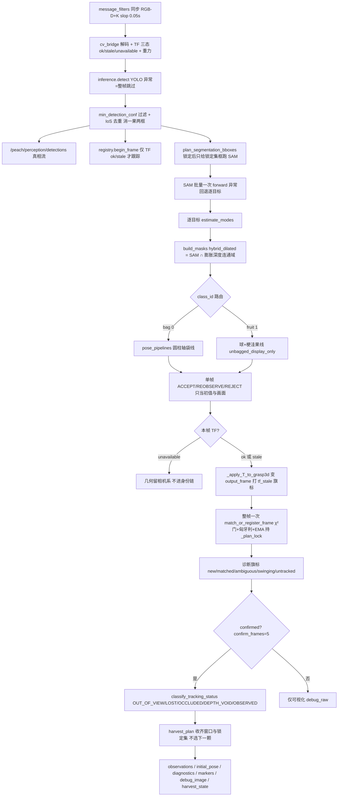

**读图（图 3b）：** 自上而下是一次「看」。检测、去重先定「画面里有几个框」；分割与几何逐目标跑出单帧状态——它只配画面与初值，永不授权运动。只有世界系 TF 可用（ok/stale）的帧才进身份链：整帧一次全局 1-1 分配（不是逐检测贪心），EMA 平滑位置/轴/直径，累计 `confirm_frames` 帧才转正。锁定窗在 `_plan_lock` 内更新。`BeginScene` **重启收齐窗**；换场才清身份。左下分支：`tf_unavailable` 帧的几何退回相机系只进可视化，注册会污染世界系表。

#### 图 3c — 建一颗：`target_reconstruction` 采帧→finalize 流

帧 worker 与 finalize 两段（`target_reconstruction_node`，源码顺序即图序）：

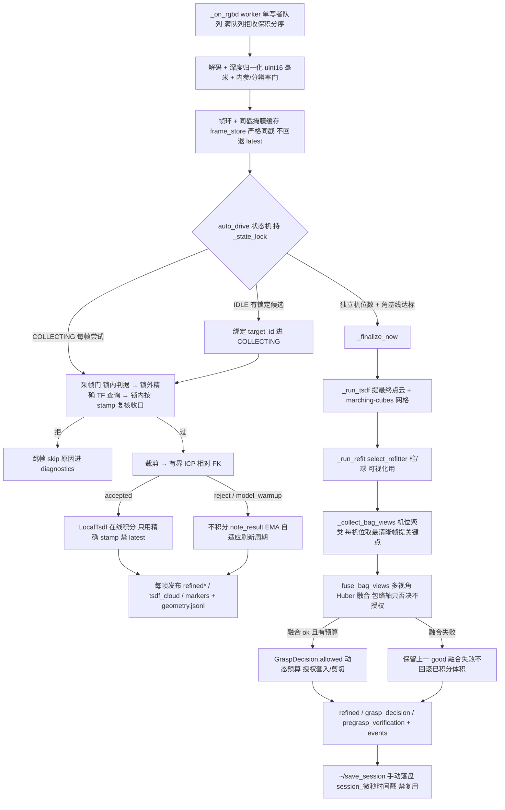

**读图（图 3c）：** 上半是「每一帧」：同步帧进单写者队列，过五道采帧门才动几何；ICP 拒帧不硬套，修正量 EMA 反过来拉长/缩短全量刷新周期。TSDF 只用精确 stamp（决策 0003）。下半是「收一颗」：机位与基线都够才 finalize——先提 TSDF 产物（可视化/占用，不授权），再柱/球 refit（仍只可视化），**接触权威只来自多视角关键点 Huber 融合 + 动态预算**；融合失败保留上一可用模型、绝不回滚已积分体积（否则 `tsdf_cloud` 变空、技能有效视点归零）。`pregrasp_verification` 是重建侧观测话题，技能 `VerifyPregrasp` 用工具 TF 残差自算。会话落盘由 `~/save_session` 显式触发。

---

### `peach_manipulation` — 机械臂执行

**作用：** 把「去拍照」「围着这一颗看」「按许可插入/撤退」做成动作服务端。规划与执行走 MoveIt / MTC；工具 IO 走柜侧 `SetIO`。不拥有批次、不拥有目标集合。

**含什么：** 单节点 `peach_manipulation_node`（Lifecycle；类声明 `manipulation_skills_node.hpp`，持 GPL `Params` 快照，`GraspTaskConfig` / `MoveItMotionConfig` / `ScanBudgetConfig` 从快照直构）。周期状态全部入 `CycleContext`（`cycle_context.hpp`：action 受理时创建、worker 单写者、周期消亡即整体丢弃，`cycle_*` 成员已删）；动作受理/取消与授权矩阵在 `cycle.cpp`（`ExecutionAuthority`：TRANSIT/PREGRASP=Active∧robotReady∧!cancel∧execution_enabled，CONTACT 再加 grasp_enabled∧GraspDecision 复检，TOOL 再加 tool_enabled；复检不过→SKIPPED_QUALITY，其余→FAILED）；阶段执行器 `stages.cpp`（`executeCycle(ctx)` 显式模式 switch，序列与旧主树遍历严格同构）；接触在 `grasp_task.cpp`；纯核 `quality_gate` / `safety_gate` / `view_planner` / `target_cache`（直接构造唯一实现，缝位 0）；扫描预算/阶段墙钟/回调计时在 `cycle_support.hpp`。运行参数 `config/peach_manipulation.yaml`，GPL `config/manipulation_parameters.yaml`。

### 技能包内部

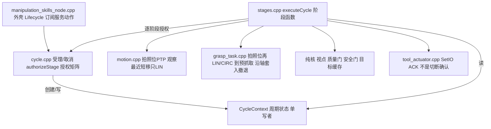

**读图：** 一个 Lifecycle 节点拆成几份源文件，不是多个进程。外壳接 ROS；`cycle.cpp` 受理动作目标并实现授权矩阵（`execution_authority.hpp` 是其单一事实源）；`CycleContext` 承载一次周期的全部可变状态；真正「观察 / 预抓取 / 套入」是 `stages.cpp` 的阶段函数。观察移位走最近短步（只 LIN，失败换候选）；预抓取先 PTP 回拍照位，再只走 LIN / CIRC（`grasp_task.cpp`），套入沿轴直线。已齐 LIN 到预抓取加 tip 姿态 OrientationConstraint（对目标姿态，容差 `mtc_approach_max_align_deg` 20°）。未齐先 LIN 原地对齐再平移；LIN/CIRC 失败不改 PTP。护栏拦绕腕与笛卡尔绕行。刀具 IO 只在阶段执行器里打，ACK 只表示柜侧收下命令。

**对外提供：**

| 入口 | 行为 |
|------|------|
| `SurveyScene` | `goToPhotoPose`（默认 SRDF `global_photo_pose`）；`transit_max_*` 超限拒绝；成功出口 `atNamedTarget` 核当前关节（`execute=false` 仍核） |
| `ExecuteTarget` PREVIEW | 只规划不执行 |
| `ExecuteTarget` OBSERVE_ONLY | 当前位采帧；基线未过最多两次最近短移（只 LIN，失败换候选），沿当前相机直线截到 `max_camera_step_m`（默认 0.15 m，~0.7 m 处一跨过 8°），评分以行程最短为主；朝检测框内分割更满的方向微偏。禁止对侧兜圈、OMPL、贴球面环绕、PTP 兜底。覆盖门 8°。**停准则：** 覆盖达标或 `maximum_moves` 用尽（Open3D TSDF / NBV：做完位姿序列，不用移动+等帧 EMA 预测收口）。到位后等**新机位**（`view_directions` 增加），同机位连帧不算覆盖 |
| `ExecuteTarget` PREGRASP_ONLY | 再确认 → PTP 回拍照位（观察 look-at 直接规划常无 IK）→ 只走笛卡尔约束到预抓取：直线不穿预抓取球则 LIN（未齐先 LIN 原地对齐工具 Z）；直线会穿球则 CIRC 再沿轴 LIN（`alignFrameZ` 保留滚转）。LIN/CIRC 失败不改 PTP（`skipped_unreachable`）。拍照位失败则从当前位规划，仍失败再试拍照位 → 工具 TF 残差按最新精化快照重算 entry/pregrasp 增量修正（最多两次）→ 停在预抓取（`HoldPregrasp`，不回 `harvest_stow`）。残差未过门也停住，便于目视方向/定位。任何路径不 SetIO。不要求 `GraspDecision.allowed`。到位终局 `SUCCEEDED` + `recovery_required`（不是接触失败撤离）；ACK 前调度不 Survey / 不派下一颗 |
| `ExecuteTarget` FULL | `skip_observation`；再确认 → 预抓取验证 → `PlanSleeve` 规划套入与反向撤退 → 沿轴一段 LIN 套入 → `VerifyCutHold` → `ToolActuator`（SetIO ACK=`CUT_COMMAND_ACCEPTED`，不得自称切断）→ `VerifyCut` → 原路 LIN 撤到预抓取 → PTP `harvest_stow`。切断**且**撤退确认才 `harvest.grasped`。`tool.enabled=true` 未确认终局 `FAILED`/`CUT_FEEDBACK_TIMEOUT`（刀具 DI 预留接 `/aubo_io_controller/io_states`）。`tool.enabled=false` 时跳过 SetIO，周期可 SUCCEEDED 但不宣称采摘成功 |
| 预览/使能/ACK 服务 | `preview_*`、`set_execution_armed`、`acknowledge_recovery` |

**订阅：** 感知观测；重建 `grasp_decision` / `refined_*` / `diagnostics`。`pregrasp_verification` 由重建发布作观测，技能 `VerifyPregrasp` 用工具 TF 残差，未订该话题。作业目标以 **goal.target_id** 为准。规划 tip 为 URDF `tcp`。工具标定帧 `wrist3_Link → tool_axis / sleeve_mouth / cutting_plane / tcp`（`aubo_description` `hollow_cylinder_v1`：TCP 在圆柱顶部，`Rx(-90°)` 使 Z=开口、XY=刀口，`calibration_status: mechanical_dimension`）。

**档位：** 默认 `execution.enabled` / `grasp.enabled` / `tool.enabled` 全 false。真运动须与调度 `execution_enabled` 同时开。`tool.enabled=false` 时 `ActuateCutter` 阶段跳过 SetIO。`GraspDecision.allowed=false` 禁止套入/剪切（TOOL/CONTACT 级授权前复检，目标 ID 须对齐）；`PREGRASP_ONLY` 有融合几何即可去预抓取。接触失败后的 recovery 是撤离未确认；`PREGRASP_ONLY` 到位是 `SUCCEEDED` 带 recovery，须 ACK 后调度才 Survey / 派下一颗。

**禁止：** 写 `ledger.json`；当 `BeginScene` / `RunHarvest` / `BuildTargetModel` 客户端；调重建 Trigger；自己选下一颗。

**依赖驱动：** Active 的 `move_group`、透传控制器、`/aubo_io_controller/set_io` 与 `robot_status`。不直接写关节命令。

---

### `peach_navigation` — 已归档（预留）

包体移至 `_archive/parked_2026-09/peach_navigation`，不在 colcon 构建、不进整栈 launch 与 lifecycle 名单。曾提供 `NavigateToWorksite` 缝与 `target_report` / `arm_status` / `vehicle_state` 适配话题（固定座 `reserved_stub` 合成静止 `VehicleState`）。现行只在 `peach_interfaces` 留痕：`NavigateToWorksite` / `HarvestTargetReport` / `HarvestOperationStatus` / `VehicleState` 四个 IDL 与 manifest `reserved_interfaces` 区保留标「预留」（33 active + 4 reserved，清单脚本双向核对）；调度 `_cmd_navigate` 固定座直通 `NAV_OK`，不发动作、不等 `VehicleState`。真底盘须书面授权后从归档恢复并在**包内部**接发行版 Nav2——不加第五个 peach 包，本仓仍不写底盘/雷达驱动或 `cmd_vel`。

---

### `peach_executor` — 整栈调度（三节点同包）

**作用：** 批次的唯一所有者：显式开批、选下一颗、按 FSM 调四个能力入口、写账本、有序拉起/拆除生命周期、只读监控。自己不算视觉、不算笛卡尔接触、不算 Nav2 规划。

#### `peach_executor`（批）

- **入口：** `~/run_harvest`、`~/control`（`ControlTask`，`expected_state_seq` 防乱序）。
- **发布：** `~/state`（`target_id` 是感知/重建的作业绑定）、`~/events`、`~/scene_snapshot`。
- **客户端（仅本节点）：** `BeginScene`、`SurveyScene`、`BuildTargetModel`（与 OBSERVE_ONLY 并行）、`ExecuteTarget`、`CheckReachability`。到位一步无动作：`_cmd_navigate` 固定座直通 `NAV_OK`（`NavigateToWorksite` 预留）。
- **选果：** `batch.py` 的 `next_target` 联合约束：goal 指定优先（显式指定不受窗限），否则在已确认观测中按 **可达窗 ∩ 有效深度窗** 过滤（可达性权威是技能 `CheckReachability`（调度填感知入口；服务端换成与 MovePregrasp 同一停位再 IK：位置沿袋轴后撤 `mtc_approach_along_axis_m`（grasp_standoffs.yaml 注入，现行 0.03 m），姿态=`alignFrameZ`（当前 TCP 滚转 + 工具 Z 对袋轴），不抄感知四元数滚转；`setFromIK` 种子=当前关节状态，与 MTC 同一运动学；服务不可用回退 `selection_reach_min/max_m`（0.15/0.88 标定半径窗，成功 0.830–0.840 / 失败 ≥0.917）；`selection_depth_min/max_m` 默认 0.30/1.60 相机距离；超窗发 `targets_filtered` 事件留归因；次序=感知 priority 主序 + 同级**检测框面积降序**——近距双检先做大框，小框多为叶片遮挡残片/误检；裸果/`unbagged_display_only` 本轮不进执行候选。感知锁定集不代替本选择。
- **账本：** `batch.py` → `runs/<request_id>/ledger.json`；同 id 可续跑未入账目标。`harvest_confirmed` / `completion_level` 写入 extra。
- **FSM：** `harvest_fsm.react` 出 `Command`，节点做 ROS I/O。`execution_enabled=false` 或 `intent=SURVEY_ONLY` 则 Survey 后结算。默认 `execute_pregrasp_only=true`：FULL 槽改发 `PREGRASP_ONLY`（停预抓取，ACK 后再 Survey）。套入前改 false。运行期 `ros2 param set` 改 `execution_enabled` / `execute_pregrasp_only` 在下次开批与 `HarvestState` 发布时从 ParamListener 刷新，不改 yaml 默认。`require_managed_stack`（整栈 launch 为 true）未收到 lifecycle 旗标则拒绝开批。DISPATCH：`BuildTargetModel` 须在 `build_start_timeout_s`（默认 2 s）内反馈 COLLECTING/READY；超时则取消并**等该动作结束**再派下一颗（重建单槽，未结束会拒下一颗 Build）。
- **禁止：** launch 自动 `RunHarvest`；监控代发运动；直接调 MoveIt / Nav2。

#### `peach_lifecycle_manager`（管）

- **名单（`config/lifecycle_manager.yaml`，默认顺序）：** 场景感知 → 重建 → 技能 → 调度。observability **不进名单**。节点 `declare_parameter` 默认与该 yaml 一致。
- **入口：** `~/manage_nodes`。STARTUP 先 configure 再 activate；拆除逆序。发闩锁 `/peach/lifecycle/managed_nodes_activated`。
- **禁止：** 发 `RunHarvest`。PAUSE 是节点 Inactive，不是批次 `ControlTask` 暂停。

#### `peach_observability`（监）

- **作用：** HTTP（默认 `127.0.0.1:8090`）双面：**只读监控**（订阅各包状态、按 `HarvestState.batch_state` 开合 `runs/run_*` / `idle_*` jsonl）+ **鉴权手动调试操作面**（2026-09 融合，决策 0007 推翻条款执行、0013 收敛动作客户端不变量）。整栈 include 时 **不进 lifecycle 名单**，节点 `main()` 在 spin 前自行 `configure/activate`（launch 的 EmitEvent 跨 include 经常匹配不到）。作业票下方三维对照实测 TCP、起止弦与预抓取/入口。
- **类 / 配置：** `ObservabilityNode`、`ObservabilityState`；参数 `config/observability.yaml`。静态页在包内 `web/`，Tab 分「监控 / 手动调试」。首屏是当前果实作业票（发现→拍照→锁定→观察→许可→靠近→工具→撤离→完成）。抓取档关闭时靠近/工具标 **gated**，不得显示成已勾上。
- **`/api/state` 区段：** `perception` / `reconstruction` / `refined` / `manipulation`（含 `status` 与 `hypothesis`）/ `task_executor` / `robot`（柜侧 `status` + latest TF `tcp` 摘要：xyz/路径长/弦长/绕行比）/ `metrics` / `record` / `params` / **`job`**（派生作业票：过程线、档位、`why`、base_link 坐标含预抓取）/ **`debug`**（操作面三重门状态 + 最近操作环形缓冲；**令牌本身绝不下发**）。不再用 `approach` / `orchestration`。
- **`/api/trajectory`：** 末端点列（平坦 `xyz` + 相位）+ 作业票路标 + 与 RViz 同源的 Marker 字典。只读，不进 MCAP。
- **调试操作面（默认三重关）：** `POST /api/debug/<action>`，门控链 = `debug.enabled` 总开关 → `X-Debug-Token` 令牌（空=全拒）→ 运动类另需 `debug.motion_enabled`；每次调用（含被拒，含 `enabled=false` 的 503）审计落 `runs/debug_audit/<日期>.jsonl`（`audit_enabled` 默认开）。端点是既有动作/服务的**纯转发客户端**（RunHarvest/ControlTask/BeginScene/Survey/Execute/Build/CheckReachability/save_session/生命周期 ManageNodes 等 18 个，见 GPL `debug.endpoints.*`）；`PREVIEW` 与只规划 Trigger 不受运动门拦，`OBSERVE_ONLY` / `PREGRASP_ONLY` / `FULL` / Survey / 非 `SURVEY_ONLY` 的 RunHarvest / `go_to_photo_pose` / arm / ControlTask 的 `RESUME` 与 `EXIT_MAINTENANCE` 算运动类。技能 `ExecutionAuthority` 与调度/重建全部既有门**原样生效，Web 绕不过任何门**。前端运动类操作与 `RESET`/`SHUTDOWN` 带二次确认。
- **jsonl：** `events`、`state`、`perception`、`reconstruction`、`manipulation`、`job`、`metrics`、`tcp_trajectory`；另有 `image_index.jsonl`、`debug_audit/`。历史目录里的 `approach.jsonl` 是旧名，新写用 `manipulation.jsonl`。
- **开关：** `config/observability.yaml` 的 `record.enabled`。`trajectory.enabled` 默认开：20 Hz latest TF `base_link←tcp`。MCAP 另由 launch `record_mcap:=true`，默认关。订阅 `/peach/manipulation/grasp_hypothesis`。发 `/peach/observability/tcp_path`（Path）与 `/peach/observability/markers`（MarkerArray）。

**整栈入口：** `launch/harvest_system.launch.py` include bringup → 感知 → 技能 → observability → 调度 → lifecycle_manager（不 include 导航）。能力包 `autostart:=false`。默认 `hardware_mode:=mock`、`camera_enabled:=false`；调度 `execution_enabled=false`（节点参数，非 launch 参数）。

---

### 包内节点

各节点入口→处理→输出流程图：[io.md](io.md) §3–§5。

| 角色 | 节点 | 所在包 | 入口 | 禁止 |
|------|------|--------|------|------|
| 看 | `peach_scene_perception_node` | `peach_perception` | `BeginScene`；发 `/peach/perception/*` | 不重建、不运动、不选下一颗 |
| 建 | `peach_target_reconstruction_node` | `peach_perception` | `BuildTargetModel`；发 `/peach/reconstruction/*` | 不检测、不写账本、latest TF 积分 |
| 动 | `peach_manipulation_node` | `peach_manipulation` | `SurveyScene`、`ExecuteTarget` | 不写账本、不调重建 Trigger |
| 批 | `peach_executor` | `peach_executor` | `RunHarvest`、`ControlTask` | 不做视觉、不直接规划接触/导航 |
| 管 | `peach_lifecycle_manager` | `peach_executor` | `ManageLifecycleNodes` | 不发 `RunHarvest`；observability 不进名单 |
| 监 | `peach_observability` | `peach_executor` | 只读 HTTP / JSONL | 不发运动、不改参 |

---

### 驱动层九包

给采摘核提供手臂、相机、TF、规划组。**只读红线**（AGENTS）：`aubo_e5_hardware`、`aubo_e5_controllers`、`aubo_dashboard`、`aubo_e5.ros2_control.xacro`、`bringup.launch.py`、对应 `controllers.yaml`。未授权不得真机运动或 SetIO。

#### `aubo_msgs`

柜侧接口，不是采摘业务类型。`RobotStatus` / `SetIO` / `GetFK` / `GetIK` / `SetPayload` / 手眼标定动作。技能读 `RobotStatus` 做安全门，工具闭合调 `/aubo_io_controller/set_io`。采摘 IDL 在 `peach_interfaces`。

#### `aubo_description`

工作单元 URDF。`aubo_e5.urdf.xacro` 拼臂本体、桌、腕上相机体、快换、当前空心圆柱工具（`wrist3_Link→tool_axis / sleeve_mouth / cutting_plane / tcp`）。TCP 在圆柱顶部，原点机械尺寸 `(0, 47.90, 151.07) mm`；姿态相对法兰 `Rx(-90°)`，使 **TCP Z=开口、XY=刀口平面**（零位开口朝世界 +Z）。`cutting_plane` / `tcp` / `sleeve_mouth` 同点；筒体沿 TCP −Z 长 `L_insert=200 mm`。`tool_body_link` 带圆柱+刀片 visual/collision；规划 tip 仍名 `tcp`。`robot_state_publisher` 发 TF。权威关节顺序六轴。改末端几何改 `components/tcp.xacro` 与 `config/hollow_cylinder_v1.yaml`；**不要**改只读的 `aubo_e5.ros2_control.xacro`。

#### `aubo_e5_hardware`

ros2_control `AuboE5Hardware`：旧 SDK + TCP2CAN。轨迹经透传 GPIO 进 `write()`，本包不做规划。停轨：透传 abort → 清队列 → `ioLoop` `RobotMoveStop`。

#### `aubo_e5_controllers`

`AuboPassthroughTrajectoryController`（real 整条轨迹透传）；`AuboIOController`（板/工具 IO、`RobotStatus`、`~/set_io`）。mock 用标准 `joint_trajectory_controller`。技能/调度不直接写关节。

#### `aubo_dashboard`

上电、抱闸、FK/IK、负载等慢操作。**bringup 不起本节点；作业禁止调用。** 柜侧用示教器；规划用 MoveIt；停轨不经本包。`auto_power_on=false`。

#### `aubo_e5_bringup`

手臂工作单元唯一 launch：`bringup.launch.py`（只读）。`hardware_mode:=mock|real` 换插件与轨迹控制器。可选 include 相机、`extrinsics_publisher`、MoveIt。采摘整栈 include 本文件，不要另起第二套 bringup。

#### `aubo_e5_moveit_config`

规划组 `manipulator_e5`（`base_link`→`tcp`）、IK、OMPL/Pilz、与透传对齐的控制器映射。SRDF `group_state`：`home`、`camera_pose`、`global_photo_pose`（技能默认拍照目标）。手眼 yaml 不在本包。

launch 参数装载走官方 `moveit_configs_utils.MoveItConfigsBuilder`（与 MoveIt2 官方生成的 move_group launch 同链）；包内 `.setup_assistant` 提供 URDF/SRDF 定位元数据（同 setup assistant 格式，`install(FILES .setup_assistant)`）。`ompl_planning.yaml` 按官方布局收拢管线级字段（`planning_plugins` / `request_adapters` / `response_adapters` / `start_state_max_bounds_error` / `totg.resample_dt`）。`pilz_cartesian_limits.yaml` 随 builder 并入 `robot_description_planning`，数值与 `joint_limits.yaml` 的 `cartesian_limits` 一致（现场保守档：`max_trans_vel 0.25 m/s`、`max_trans_acc 0.5`、`max_rot_vel 0.5 rad/s`）——Pilz 笛卡尔段（LIN/CIRC）受该限速约束，PTP 关节空间不受影响。控制器映射 yaml 为官方 `moveit_simple_controller_manager` 布局（`controllers.yaml` / `controllers_mock.yaml`）。技能 launch 用同一 Builder 只注入模型/管线，不注入控制器映射。

#### `aubo_hand_eye_calibration`

`extrinsics_publisher` 读 `src/aubo_hand_eye_calibration/hand_eye/active.yaml`（gitignore）发 `wrist3_Link→camera_link`。找不到该文件则名义平移 2 cm、单位四元数（点云会相对臂偏约 10 cm 且轴向不对）。重建积分依赖这条链的精确 stamp。日常采摘不自动跑标定流程。

#### `percipio_camera`

图漾驱动（厂商代码）。采摘订彩色/深度/`camera_info`；深度须与彩图配准。感知 `depth_scale_unit=0.25`（raw×0.25=毫米）。launch 请求 `frame_rate:=5.0`，现场约 2.5 FPS；未授权不改帧率。

#### `serial_imu`

USB 串口 IMU（QinHeng CH340 `1a86:7523`）。udev `/dev/imu`。话题对齐 imu_tools：`/imu/data`、`data_raw`、`mag`、`temp`；静态 `parent→imu_link`、动态 `→imu_attitude`。姿态不写进 `imu_link`。不进 `harvest_system`。**现场手册（udev、协议、权限、RViz 各显示项）：** [`src/serial_imu/README.md`](../src/serial_imu/README.md)。

### 从哪读源码

整栈入口永远是 `peach_executor`。

| 先看 | 文件 | 读什么 |
|------|------|--------|
| 批次纯核 | `harvest_fsm.py` | `react(batch_state, event) → Reaction`。禁止在节点里手写 `batch_state` |
| 批次执行 | `executor_node.py`（`TaskExecutorNode`） | `_run_harvest` 按 `Reaction.command` 调 Navigate/Begin/Survey/Build/Execute |
| 账本 / 选果 | `batch.py` | `next_target_id`；`runs/<request_id>/ledger.json` |
| 生命周期 | `lifecycle_manager.py`（`LifecycleManagerNode`） | 感知 → 重建 → 技能 → 调度；观测节点不进名单 |
| 只读监控 | `observability/observability_node.py` | HTTP `:8090`；`ObservabilityState`（`state.py`）与 jsonl（`recorder.py`） |
| IDL | `peach_interfaces/action|srv|msg` | 改接口只改这里 |
| 感知外壳 | `scene_perception_node.py`（`ScenePerceptionNode`） | `_on_rgbd` → `_decode_rgbd` → `_process_rgbd` |
| 感知纯核 | `scene_perception/{stream_metrics,assignment,image_gates,pose_pipelines,inference}.py`、`identity.py` | 流观测 EMA/超时；χ²+匈牙利分配；投影与深度门控；袋/果位姿线；YOLO/SAM 推理；世界系身份与锁定窗 |
| 重建 | `target_reconstruction_node.py`（`TargetReconstructionNode`） | `_accept_frame`；`BuildTargetModel` |
| 帧环/掩膜缓存 | `target_reconstruction/frame_store.py`（`FrameStoreMixin`） | 同步帧环、同戳掩膜缓存、串扰门输入组装（mixin，宿主契约见模块 docstring） |
| 采集门 | `target_reconstruction/capture.py` | 锁 → 精确 TF → 重校验 |
| 重建发布 | `target_reconstruction/publish.py` + `markers.py` | 诊断状态消息、点云节流与 PublisherMixin、session 落盘；Marker 构造（namespace 契约不变） |
| 技能外壳 | `manipulation_skills_node.hpp` + `.cpp`（`ManipulationSkillsNode`） | Lifecycle、订阅/服务/动作；GPL `Params` 快照 |
| 技能动作与授权 | `cycle.cpp` | `ExecuteTarget` / `SurveyScene` 受理与取消；`authorizeStage` 授权矩阵 |
| 周期状态 | `cycle_context.hpp`（`CycleContext`） | 周期全部可变状态；action 受理创建、worker 单写者 |
| 阶段执行器 | `stages.cpp` | `executeCycle(ctx)` 显式模式 switch；阶段函数 |
| 接触 | `grasp_task.cpp` | 预抓取先 PTP 拍照位，再只走 LIN / CIRC；套入沿轴直线；已齐 LIN 挂姿态约束；接触不用 PTP；工具 IO 不在这里 |
| USB IMU | `serial_imu/imu_node.py` + `protocol.py` | `/imu/data`；udev `/dev/imu`；不进采摘 launch |
| 技能纯核 | `quality_gate.cpp` / `view_planner.cpp` / `safety_gate.cpp` / `target_cache.cpp` | 直接构造的唯一实现，零 ROS |
| 运动接口 | `motion.cpp` | 拍照位、观察短移（只 LIN）、MoveIt 规划/执行 |
| 拟合共用 | `peach_perception/common/geometry.py` | 球/柱 RANSAC、深度单位、TF 纯函数、向量/轴线原语 |
| EMA / 点云原语 | `peach_perception/common/{runtime,geometry}.py` | 标量 EMA 递推；RGB 位打包与刚体变换（各处共用） |

参数分层（官方 generate_parameter_library 系 + layered-config，决策 0016）：**GPL 声明 yaml 是默认值/类型/校验/中文描述的单一事实源**（感知/重建 `peach_perception/config/*_parameters.yaml` = GPL py，技能 `config/manipulation_parameters.yaml` = GPL C++，调度 `config/executor_parameters.yaml` 与监控 `config/observability_parameters.yaml` = GPL py；根键=节点名，构建期生成 `*_parameters` 模块/头；感知 GPL 同时写入源码包内（gitignore），避免 `PYTHONPATH` 指向 src 时挡住 install）；**同名运行 yaml 只写部署覆盖**（键值≠默认才写；现状为空骨架+注释示例），launch 用 `ParameterFile(..., allow_substs=True)` 装入。四层生效顺序：GPL 默认 → 运行 yaml 覆盖 → launch overlay（`grasp_standoffs.yaml` 注入跨包轴向后撤 `tool.entry_d_*` / `refit.*_standoff_m` / `moveit.mtc_approach_along_axis_m`；整栈 launch 注 `require_managed_stack`）→ 运行期 `ros2 param set`（技能：空闲态全量重载、运行中拒改、execution→grasp→tool 依赖链校验；调度：下次开批与 `HarvestState` 发布时刷新；感知/重建/监控：无运行期刷新，set 后需重启节点或重新 configure）。rcl 不能把 grasp_standoffs.yaml 当 ParameterFile 直接喂节点；各能力 launch 读入后以参数字典注入已声明名，禁止在源码写死这些米数。

参数命名规约（存量键名冻结，约束未来新键）：单位后缀必带——`_m`（米）/`_s`（秒）/`_deg`/`_rad`/`_rad_s`；帧数计单位 `_frames`；无量纲（缩放/比率/开关/序号）不加后缀；组名=职责域（frames/camera/scan/quality/execution/grasp/tool/record/trajectory/debug…），服务/动作名参数用 `_service`/`_action` 后缀、话题名用 `_topic`；同一量纲跨节点同名同值须在 GPL description 互相标注（如技能 `quality.minimum_baseline_deg` ↔ 重建 `capture.minimum_baseline_deg`）。

---

## 4. 入口、批次、接触

`harvest_system.launch.py` 按顺序 include（能力包 `autostart:=false`）：

1. `aubo_e5_bringup` — 手臂（mock/real）+ 可选相机、手眼 TF、MoveIt
2. `peach_perception` — `scene_perception` 然后 `target_reconstruction`
3. `peach_manipulation`
4. `peach_observability`（只读 HTTP / JSONL）；可选 `record_mcap:=true`
5. 调度 `require_managed_stack:=true`
6. lifecycle_manager：先 configure 再 activate

不 include 导航（已归档）。单独 launch 某能力包时 `autostart` 默认为 true。默认 `execution_enabled=false`（调度节点参数）。**launch 不自动开批。**

### 图 C — 一批 RunHarvest

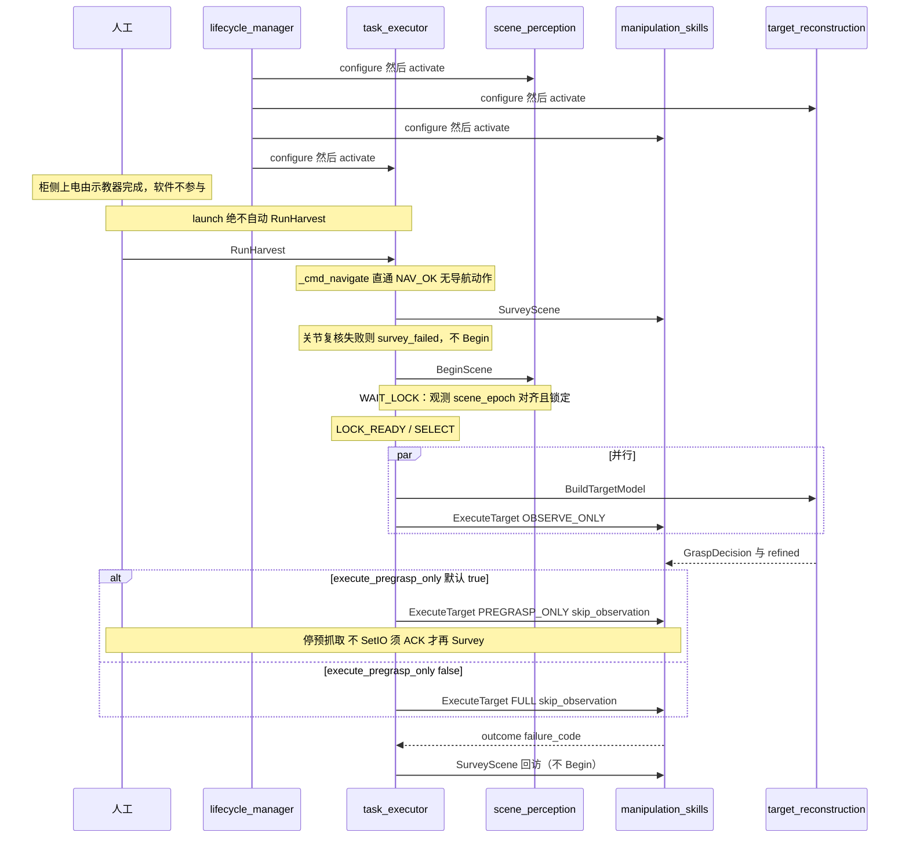

**读图（时序）：** 柜侧上电由人工用示教器完成；lifecycle 只把节点配到 Active。等人发 `RunHarvest`。固定座无导航一步：到位直通 `NAV_OK`（`NavigateToWorksite` 预留）。**先 Survey 到拍照位并复核关节，再 BeginScene 重启收齐窗**，等本世代锁定后才选果。选中一颗后重建与主动观察**同时**跑。观察结束后默认去预抓取停住（不剪、不回 stow），看完方向再 ACK；只有把 `execute_pregrasp_only` 改成 false 才走套入/剪切。回访只再 Survey，禁止再 Begin。

批次纯核是 `harvest_fsm.react(batch_state, event) → Reaction`。节点禁止手写 `batch_state`。`READY_FULL` 对应命令 `EXECUTE_FULL`，节点再按 `execute_pregrasp_only` 选 `PREGRASP_ONLY` 或 `FULL`。

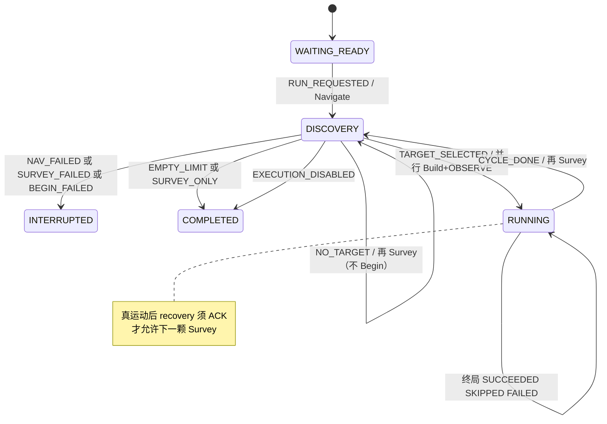

**读图（状态机）：** 圆是批次态，箭头上是「事件 / 接下来调度会发的命令」。发现阶段在 DISCOVERY 上转：到位 → 拍照并复核 → 开收齐窗 → 等锁 → 选果。选中后进 RUNNING；一颗结束必须回到 DISCOVERY 再拍一次（不再 Begin），不能直接派下一颗。右边注解：臂真动过之后要人工 ACK，否则停在恢复门。

PAUSE 在 Survey 会取消当前动作；Build / 接触段只标 `PAUSE_PENDING`。接触或 PREGRASP_ONLY 到位未 ACK 时 `recovery_required`，调度不 Survey、不派下一颗。

### 图 D — ExecuteTarget 阶段序列

`stages.cpp` 的 `executeCycle(ctx)` 显式模式 switch：阶段序列与旧主树遍历严格同构。OBSERVE 周期在 Finalize 后短路，不进预抓取。

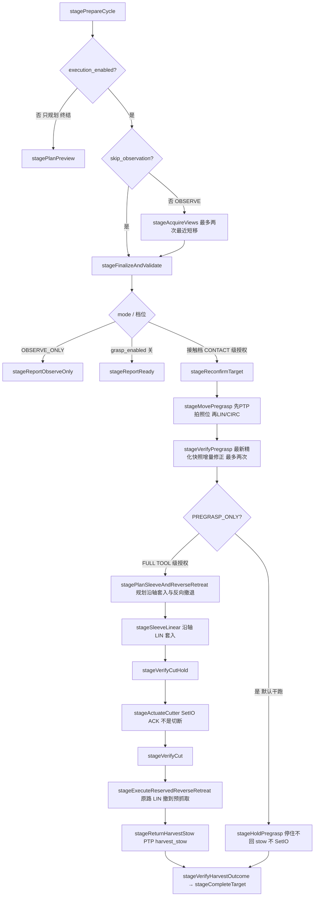

**读图：** 这是**一颗桃一次** `ExecuteTarget` 在技能节点里怎么走，不是整批。菱形是档位：`execution_enabled=false` 只规划；`OBSERVE_ONLY` 看完就停；`grasp_enabled=false` 报到可抓就停；干跑默认 `PREGRASP_ONLY` 停在预抓取。右边 FULL 才套入、打刀、原路撤、回 stow。运动/IO 入口逐阶段过 `ExecutionAuthority`（套入/剪切前复检 `GraspDecision.allowed`，撤离 TRANSIT 级不做决策复检）。观察移位是最近短步（只 LIN）；到预抓取只走 LIN / CIRC，套入沿轴直线，已齐 LIN 带 tip 姿态约束。护栏拦绕腕与笛卡尔绕行。

能力包 Lifecycle：ROS 实体（发布/订阅/服务/动作/TF/心跳）统一在 `on_configure` 创建、`on_cleanup` 释放（官方 LifecycleNode 写法：Unconfigured 期零 ROS 接口，配置失败返回 ERROR 停在 Unconfigured 并报错）；**非 Active** 拒绝运动 / 积分 / `BeginScene`。

### 决策栈

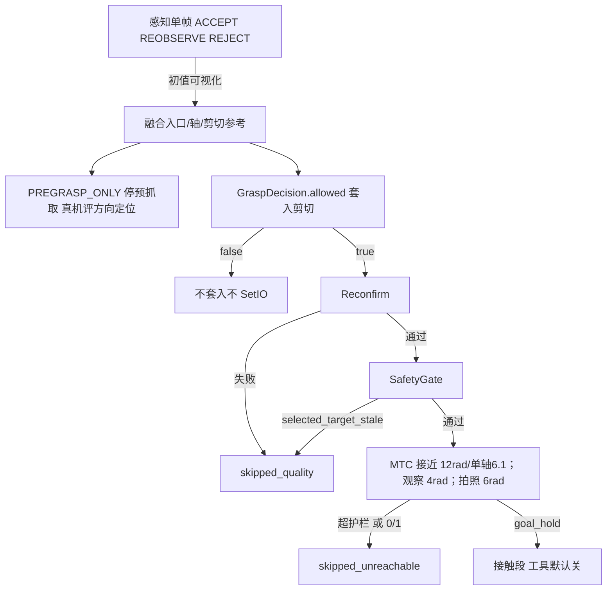

**读图：** 从上往下权限越来越硬。单帧 ACCEPT 只配画面，不能动臂。融合几何足够去预抓取评方向。`allowed=false` 到此为止，禁止套入和 SetIO。再确认和安全门失败记 `skipped_quality`；超行程护栏或规划失败记 `skipped_unreachable`。最右「接触段」默认刀具仍关。

接近：接触段沿袋轴（袋底→袋颈）尽量短。观察停在 look-at，从该姿态直接规划预抓取现场常无 IK，故 **先 PTP 回拍照位**（已知可达命名关节），再只走笛卡尔约束原语到预抓取：直线不穿预抓取球则 **LIN**（已齐则挂相对目标 20° OrientationConstraint；未齐则先 LIN 原地对齐工具 Z，再 LIN 平移并挂约束——不得挂在未齐起点上，Jazzy `ValidateSolution` 验起点）。直线会穿球、后撤 ≥ 5 mm、等半径扫角 < 90° 且弧长仍短则 **CIRC**（入口为圆心）再沿轴 LIN；后撤 0 不走 CIRC（球退化）。弦长/弧长超过 `mtc_approach_cartesian_max_distance_m`（0.80 m）或无法 CIRC、或 LIN/CIRC 规划失败，则 **skipped_unreachable**，不改 PTP（`alignFrameZ` 保留滚转）。入口在拟合圆柱袋底（`tool.entry_d_tool`+`entry_d_s`=0）；预抓取相对入口沿 −axis 后撤 `mtc_approach_along_axis_m`（现行 0.03 m；SELECT IK 用同一停位：后撤 + `alignFrameZ`，不抄感知滚转）。拍照位失败则从当前位规划。套入/撤退沿轴笛卡尔直线。OMPL 采样绕障，接触不用。**方向是否对、定位偏多少，以停在预抓取时的真机目视/测量为准**；动态预算、12° 包络否决、RMSE 不代替实测，也不拦 `PREGRASP_ONLY`。套入只在 `allowed=true` 后沿轴 LIN 到剪切参考；反向同轨迹回预抓取，再 PTP `harvest_stow`。不插 via。侧向 ≤ 0.05 m、夹角 ≤ 20° 视为已对轴（规划分档，不是精度验收）。接触绕行护栏 **累计 12 rad / 单轴 6.1 rad**（6.1=URDF ±3.05 满行程；不按时长：时长随速度变；`mtc_approach_max_duration_s` 默认 0=关闭），以及笛卡尔 **绕行比 2.2 / 弦偏离 0.25 m / 回退 0.08 m**（09-03 1740 无约束 PTP 绕行比 3.2、偏离 0.51 m、回退 0.24 m 过关节门）。观察：1 s 规划、禁止 replanning，绕行看 4 rad / 单轴 1.5 rad（09-01 现场 0.15 m 观察 LIN 实测 2.63–3.70 rad，2.5 拒合法短移）；下一视点沿当前相机直线截到 `max_camera_step_m`（默认 0.15 m），评分以行程最短为主，只 LIN，失败换下一候选，不改 PTP。覆盖达标或 `maximum_moves` 用尽才停，不按移动+等帧 EMA 预测收口。`goToPhotoPose` 用行程门 `transit_max_*` 6 rad / 2.5 rad；PTP 失败才 OMPL（命名关节赶路），仍须过行程门。接触速度 0.10。

### 透传（real）

```
FollowJointTrajectory → AuboPassthroughTrajectoryController
  → GPIO trajectory_passthrough → AuboE5Hardware::write()
  → 4 ms 线程重采样 5 ms 点 → 接口板排空 succeed
```

**读图：** 技能不写关节。MoveIt 把整条轨迹交给透传控制器，再经 GPIO 进硬件 `write()`，板上排空才算成功。取消走透传 abort + 柜侧停轨，不经过 `aubo_dashboard`。

关节顺序：`shoulder_joint, upperArm_joint, foreArm_joint, wrist1_joint, wrist2_joint, wrist3_joint`。取消：透传写 `abort`，硬件清队列，`ioLoop` 发 `RobotMoveStop`（失败再 `robotMoveFastStop`）。不依赖 `aubo_dashboard`。

---

## 5. 缝位

机制：单实现直接构造（YOLO / MobileSAM / 匹配器 / 锁定策略 / 帧栈 / 点云构建 / ICP / TSDF / 掩膜门）。仅袋/果位姿管线与柱/球 refitter 走 dict 映射：`PIPELINES_BY_IMPL` / `REFITTERS_BY_IMPL`，yaml `*.impl` 选名；未知名启动失败并列出可用名。不上 pluginlib。技能原 C++ 工厂缝位已删除（ViewPlanner / QualityGate / SafetyGate / MotionInterface 直接构造）。

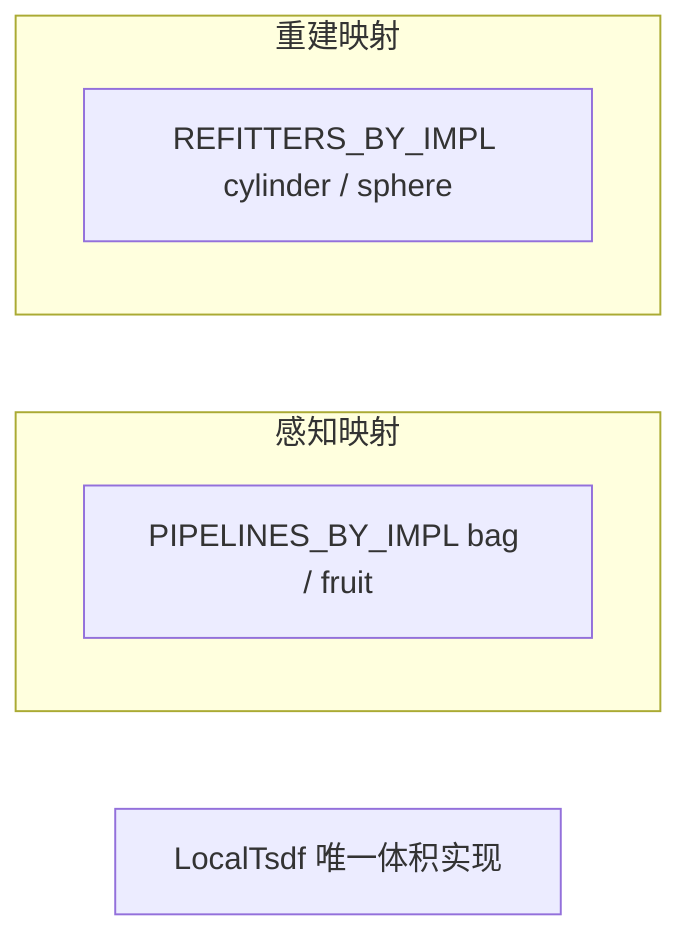

**读图：** 两个框是「可换算法的插头」，不是进程。换袋/果线改感知 yaml 的 `pipeline.*_impl`；换柱/球精化改重建 yaml 的 `refitter.*_impl`。换检测器/分割器/体积=改源码。技能不再有缝。体积滤波直调 `LocalTsdf` 静态方法，因为体积已是唯一实现。图上没画的（身份表本体、MTC 阶段、阶段函数、选下一颗）不是缝，不要为它们加 `*.impl`。

| 缝 | yaml | 默认 | 映射 | 装配 |
|----|------|------|------|------|
| POSE_PIPELINES | `pipeline.bag_impl` / `fruit_impl` | `robust_bag` / `robust_fruit` | `pose_pipelines.py` 末 | `scene_perception_node.py` |
| REFITTERS | `refitter.cylinder_impl` / `sphere_impl` | `cylinder_refit` / `sphere_refit` | `refine.py` 末 | `target_reconstruction_node.py` |

yaml：仅上述 4 键仍为 `*.impl`（技能 yaml 无 `*.impl`）。检测/分割/匹配/锁定/帧栈/点云/ICP/体积/掩膜门已收回，换实现改对应 `.py`。

**不变量（摘要）：** 检测/分割不发明深度。管线深度 uint16 毫米；点数不足 REJECT。匹配器不持身份表。锁定策略禁止自己取时钟。帧栈满栈拒收、换 ID 须 reset。点云构建 0/65535 无效。ICP 越界拒帧。TSDF 只用精确 stamp，禁止 latest。体积积分与袋融合分账：融合/`geometry.jsonl` 失败保留体积与采帧。柱/球 refit 只可视化；`GraspDecision.allowed` 只信袋融合动态预算且只授权套入/剪切；TSDF 包络轴只否决不授权，扁袋跳过 12° 冲突门，固定 35° 只诊断完全错轴。方向/定位精度以预抓取位真机实测为准。无同戳掩膜不得积分。`PREGRASP_ONLY` 只要求融合几何，FULL 才读 `grasp_allowed`。`ExecutionAuthority` 不得旁路 `execution_enabled` / `grasp_allowed`（所有运动/IO 入口收敛此判定）；撤离（`ReverseRetreat` / 回 stow）TRANSIT 级不做决策复检；安全门任何实现不得旁路 `robotReady`；`execution_enabled=false` 只规划；停轨走透传 + `RobotMoveStop`。调试操作面（0013）只是又一客户端：能力包批次动作唯一客户端仍是调度，observability 直发单颗动作须过 `debug.enabled`/`debug.token`/`debug.motion_enabled` 三重门并审计，**不得**为它新增 IDL 或旁路任何既有安全门。

**不是缝位：** RGB-D 同步、TF 策略、采帧门顺序、发布器、`TargetRegistry` / `GlobalHarvestPlan` / `InferenceEngine` 本体、`GraspTask` / MTC stage、阶段函数（`stages.cpp`）、`batch.next_target_id`、lifecycle 名单、底盘/雷达驱动。要开新缝先改本文件规约。

预留层以后：树干占用接到技能 PlanningScene，不是新 peach 包；底盘 odom 核继续只用 `base_link` + `/joint_states`；真底盘时导航适配从归档恢复并在其内部接 Nav2，不加空 `/scan` 话题、不加第五个 peach 包。

---

## 6. ROS 2 机制

| 机制 | 现行 | 态度 |
|------|------|------|
| LifecycleNode | 感知/重建/技能/调度/observability | KEEP |
| lifecycle_manager | 普通 Node；名单默认在 `config/lifecycle_manager.yaml`；无 bond | 记录缺口 |
| BT.CPP | 已移除（`behavior_tree.xml` 与 `bt_nodes.cpp` 删除，`stages.cpp` 显式阶段执行器替代） | 已删；不回退 |
| MTC | stage 硬编码；预抓取先 PTP 拍照位，再只走 LIN / CIRC，已齐 LIN 带姿态约束 | KEEP；绕行看行程（接触 12 rad / 单轴 6.1=URDF 满行程，观察 4 / 1.5，拍照 6 / 2.5）与笛卡尔绕行比 2.2 / 弦偏离 0.25 m / 回退 0.08 m，不按时长 |
| generate_parameter_library | 技能（C++）+ 调度/感知×2/监控（Python） | KEEP |
| message_filters | slop 0.05 s | KEEP |
| pluginlib / composable | 未用 | 不做 |
| diagnostic_updater | 未用 | 后续确认 |
| rosbag2 | MCAP 默认关，7 话题无 RGB/深度/tf | 本轮不开白名单 |

---

## 7. 已拍板决策

格式：决定 / 理由 / 代价 / 被否 / 推翻。

| 编号 | 决定 |
|------|------|
| 0001 | 采摘能力包五个：契约、视觉、臂、导航适配、调度。感知两节点共包；监控不独立成包。推翻：书面改 AGENTS。（导航适配部分已被 0009 推翻归档） |
| 0002 | 单实现直接构造；袋/果管线与柱/球 refitter 留 dict 映射。不上 pluginlib。Python `Registry` 与 11 个算法 ABC 已收回。推翻：第二运动后端必须独立包加载。 |
| 0003 | 重建精确 stamp、禁止 latest；感知 stamp 失败可 stale。推翻：live 证明两光学系不重合，或 `tf_stale` 污染身份表。 |
| 0004 | 抓取几何只信 `GraspDecision.allowed`。推翻：取消重建节点。 |
| 0005 | 设计用归档 ~2.5 FPS；launch 5.0 是请求；不改 Percipio。`assumed_frame_interval_s` 不预填 EMA。推翻：授权后的新 live hz。 |
| 0006 | `test/` 只留 ROS 2 默认 lint。对错以实机与过程数据为准。批次 summary 由 observability 录制器收尾时离线复算（`recorder.py` 汇总器），不是 colcon 业务测；感知离线复算脚本已归档 `_archive/offline_2026-09/`。 |
| 0007 | observability 只读 HTTP + jsonl；不进 lifecycle 名单。推翻：另做鉴权操作面且不混端口。→ 推翻条款已执行（2026-09，见 0013）：调试操作面融合进 8090，安全改由三重门+审计承担。 |
| 0008 | 底盘/雷达驱动本仓不实现。`peach_navigation` 只提供 `NavigateToWorksite`。推翻：书面授权真底盘并接发行版 Nav2。 |
| 0009 | 核心栈四包：契约、视觉、臂、调度。`peach_navigation` 移至 `_archive/parked_2026-09/`，不进构建与 launch；四个导航 IDL 在 manifest `reserved_interfaces` 标预留；调度 `_cmd_navigate` 直通 `NAV_OK`。推翻：书面授权真底盘，从归档恢复（仍不加第五个 peach 包）。 |
| 0010 | 技能去 BT.CPP：删 `behavior_tree.xml` 与 `bt_nodes.cpp`，`stages.cpp` `executeCycle(ctx)` 显式模式 switch（序列与旧主树严格同构）；周期状态全部入 `CycleContext`（action 受理时创建、worker 单写者），`cycle_*` 成员删除。推翻：需要树级恢复语义时重新评估，但不回到隐式 tick。 |
| 0011 | `ExecutionAuthority` 统一执行权（`cycle.cpp` `authorizeStage`）：TRANSIT/PREGRASP=Active∧robotReady∧!cancel∧execution_enabled；CONTACT 再加 grasp_enabled∧GraspDecision 复检（目标 ID 对齐+allowed）；TOOL 再加 tool_enabled。所有运动/IO 入口收敛此判定；复检不过→SKIPPED_QUALITY，其余→FAILED。推翻：新增执行后端须走同一矩阵。 |
| 0012 | 死代码删除、文档标预留：MTC 预规划链（PreplanSlot 等）、`DepositToStation`（`DepositResult` 字段保留恒 `deposited=false`）、别名注册、`impl_factory`/`motion_factory` 缝位、`planOrMoveTool`；yaml 删 `*.impl` 4 键与 `deposit_pose_named_target` 等。刀具切断确认预留接 `/aubo_io_controller/io_states` 工具 DI；`tool.enabled=true` 未确认终局 `FAILED`/`CUT_FEEDBACK_TIMEOUT`。 |
| 0013 | 调试操作面融合监控 Web（8090 单端口），推翻 0007「只读、不混端口」的端口隔离部分：安全改由 `debug.enabled`（默认 false）+ `X-Debug-Token`（默认空=全拒）+ 运动类另需 `debug.motion_enabled`（默认 false→423）+ 全量审计 `runs/debug_audit/` 承担。「调度是唯一动作客户端」收敛为「能力包批次动作唯一客户端=调度；observability 调试桥（默认关）可直发单颗动作，全审计」。不新增 IDL，不旁路 ExecutionAuthority；真机运动仍须三重使能人工打开。推翻：把操作面独立成第二端口/新包（用户拍板融合）。 |
| 0015 | 冗余归档清理（2026-09）：`Robotics_Tutorial/`、`plans/`、`reports/`、感知 `offline/` 离线脚本、`tool_profiles/` 零加载 yaml 归档 `_archive/`；删除全仓零调用服务（感知 `query_harvest_state`，重建 `start_reconstruction`/`capture_frame`/`remove_last_frame`，技能 `start_cycle`/`query_state`）、零引用内部方法与 8 个声明未读参数链（via 间距、budget_cost_margin、refined RMSE/内点阈值等）；`approachAndInsert` 收敛为纯规划（执行路径零调用）。四包 README 削薄为导航页。图名/话题/动作/活文档契约不变。推翻：需要恢复任一归档件时从 `_archive/` 取回并同步本表。 |
| 0016 | 参数分层收敛（2026-09）：运行 yaml 覆盖化——五个 `config/<节点>.yaml` 不再复写 GPL 默认（审计 274 键 0 真覆盖），只写部署覆盖与注释示例；运行 yaml 独有增量口径（recovery_scale 真机实测史、max_collect_s EMA 自适应、protected_zones 与 min_camera_height_m 关系等）并入 GPL description（`ros2 param describe` 可见）。C++ 装载链收敛：节点持 GPL Params 快照直构各 Config，删纯转发成员。键名/分组冻结（真机命令/文档/镜像零破坏），命名规约成文（见「参数分层」节）约束新键。observability 参数镜像 watchlist 删幽灵键。推翻：现场需要成套部署档（如真机保守档 yaml）时在运行 yaml 写覆盖键，或新增第二份覆盖文件经 `params_file` launch 参数切换。 |

---

## 8. 缺口与规约

| 目标 | 事实 | 含义 |
|------|------|------|
| 换检测器 | 袋/果与柱/球两处映射；YOLO/SAM/TSDF 直接构造 | 换映射走 `*.impl`；换检测器改 `inference.py` |
| 节点挂了 | manager 无心跳；observability 不在名单，由节点自行 Active | 文档记录 |
| 失败可归因 | ledger 有 `failure_code`；消息无 algo/config 版本；清单脚本未进 lint | 清单进 lint 不违反「只 lint」 |
| 会话 | 批次结束后 events.jsonl 再写约 65 分钟 | 记录器绑定 RunHarvest |
| 新鲜度 | 08-24 `selected_target_stale` ×4 | 门限不预填 EMA；非 OBSERVED 仍按末次 live `received_s` |
| 观察效率 | 6 视角 33.5 s；max_views=24 与现场 4–6 脱节 | 覆盖预算 + 停稳窗口 |
| 接触 | 08-25 许可后 9 s 与 12.6 s PTP 被 12 s/4–8 rad 拒；08-31 1351 直线 62 s / 8.2 rad 被 20 s 时长拒；08-31 1554 最短合法 PTP 10.79 / 单轴 4.23 被当时 10/3.2 拒、未到位；09-03 1740 无约束 PTP 过 12/6.1 但 TCP 绕行比 3.2、先抬 35 cm | 接触到预抓取只走 LIN/CIRC，失败不改 PTP。关节门 **12 / 单轴 6.1** 仍拦绕腕。笛卡尔 **绕行比 2.2 / 弦偏离 0.25 m / 回退 0.08 m**。时长门默认 0 |
| 果园 | 无 /scan/odom；`peach_navigation` 已归档（IDL 预留，NAV 直通） | 有底盘后从归档恢复并接 Nav2 |
| 建一颗双路径 | `BuildTargetModel` 的 `_on_reset` 锁外调用与 worker `_auto_drive` 自动绑定存在竞态窗口（auto 开的会话可能被 Build 丢弃重建）；Build body 五步兜底与 `_auto_start` 曾逐行同构（0015 已收敛） | 锁序如需再收紧须真机回归 |
| 发布节奏 | 重建 status/refit/shape 六消息内容不变仍每帧全量重组重发（1Hz 心跳+每帧）；`_collect_bag_views` 每次采帧中 refit 都重估全部机位 landmarks，geometry.jsonl 视角行跨 refit 重复追加（唯一复算脚本已归档，写入保留） | 需要时改按变更重发/缓存 |
| 套袋工具与数据 | URDF 工具帧已接线；TCP 为机械尺寸（`mechanical_dimension`）；标注集不进仓 | 通环、刀反馈、24/48h 损伤在现场；关键点网络可替换半径剖面 |

怎么跑与验收门：[testing.md](testing.md)。量化复算与归档数字：[testing-log.md](testing-log.md)。

规约：

1. 单实现直接构造。袋/果与柱/球走 dict 映射，未知名列出全部可用名后失败。编排层不得为单实现写 `if impl_name`。
2. 纯核模块零 ROS import。
3. 参数只走 yaml + 现有 params / `generate_parameter_library`。
4. 未注册名必须列出全部可用名后失败。
5. 仅袋/果、柱/球保留 yaml 选择键 `*.impl`。
6. 不把监控或底盘驱动再拆成新的 peach 业务包。真底盘时导航从归档恢复 `peach_navigation`，不加新包。
7. 不虚构深度；重建积分禁止 latest TF。
8. `SafetyGate::robotReady` 任何实现不得旁路硬件安全门。
9. 不删 `_archive/runs/` 与现场 `runs/`。
10. 不改 Percipio `frame_rate`、不改驱动栈，除非另授权。

研发顺序（确认后）：R1 契约与会话 → R2 观察效率 → R3 可达性预检 → R4 新鲜度 → R5 导航接发行版 Nav2（须真底盘授权）。
