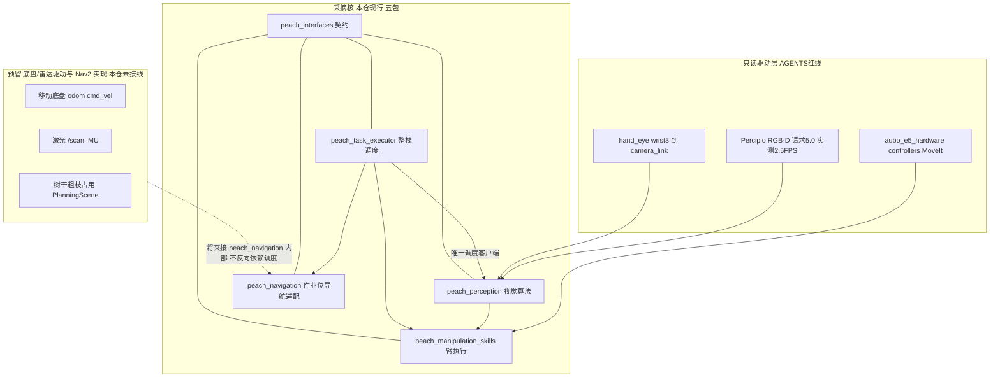
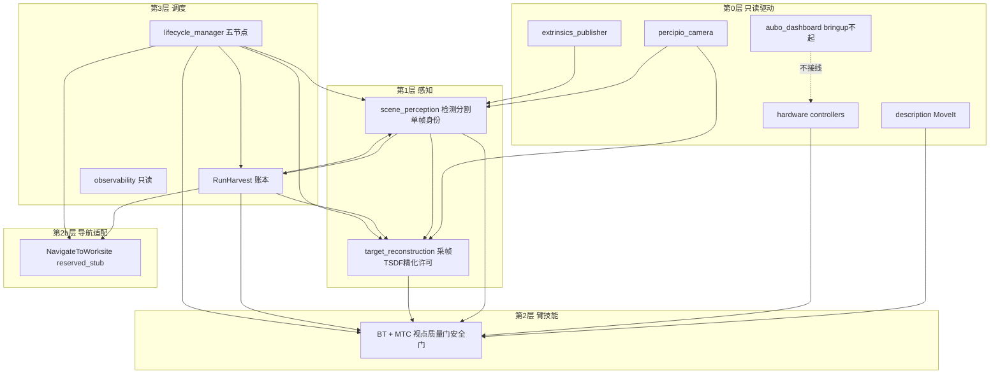
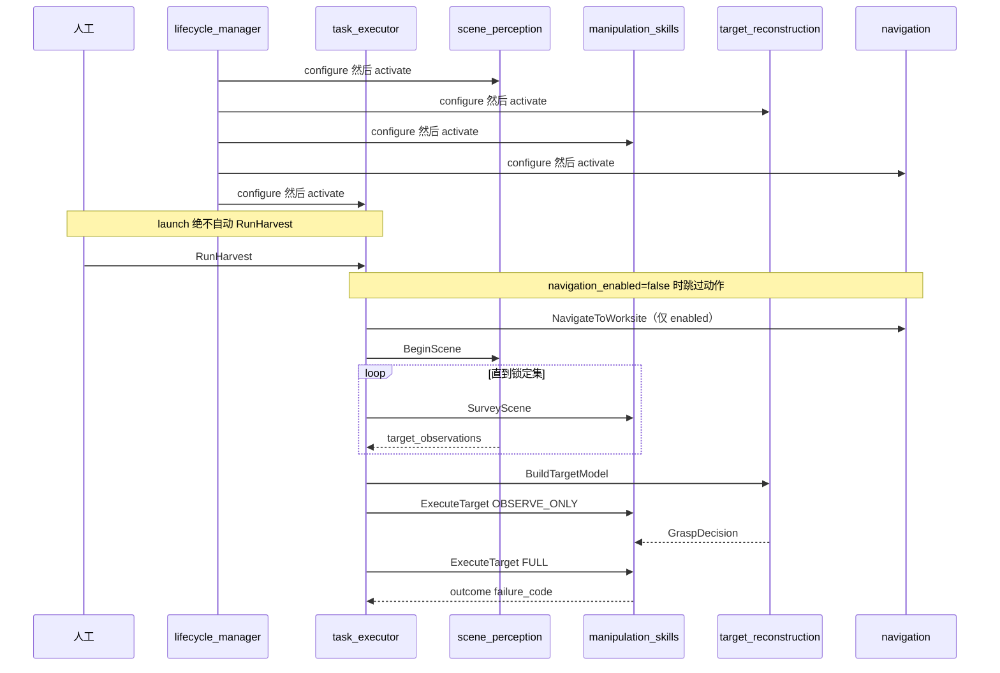
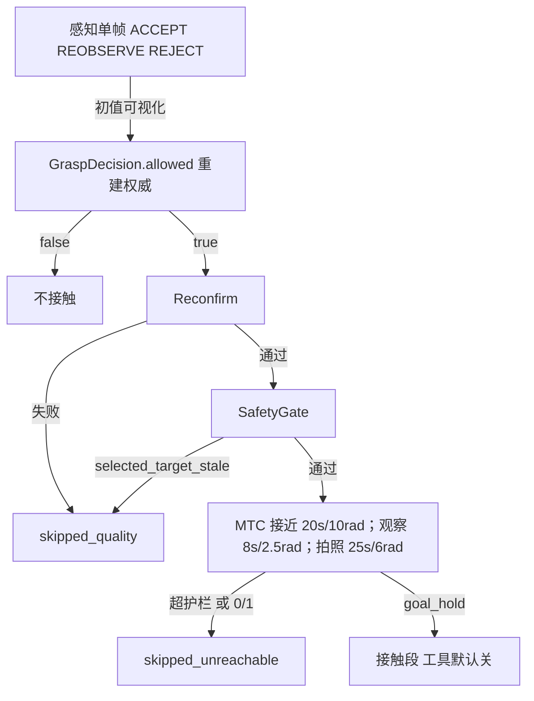
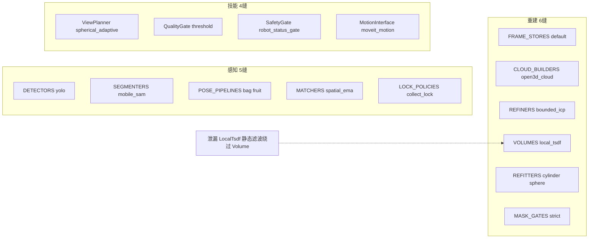

# 软件项目设计架构

权威：本文件 + 各包 `config/*.yaml` + 源码。与 [io.md](io.md)、[testing.md](testing.md) 构成仅有的三份活文档；**源码与本文互相更新，改一边须同一轮改另一边**。约束：[AGENTS.md](../AGENTS.md)。

**每条事实三问：** 现行 → 来源 → 原因（无注释则「源码未写理由」）。

Robotics_Tutorial 是 Markdown 知识库，只作原则参考，不是可迁移代码。分割器当前 YOLO-det + MobileSAM（可插拔）。

---

## 1. 产品定位

- **愿景：** 果园套袋桃采摘（室外光照、枝叶遮挡、将来底盘移动）。
- **本仓库现行产品：** 固定座 AUBO E5 + Percipio RGB-D。colcon 14 包 = 臂/相机 9 + 采摘 5。
- **范围：** 果园是愿景。能力包：契约 / 视觉 / 臂 / 调度 / 导航适配。底盘与雷达**驱动**本仓不实现；`peach_navigation` 只提供 `NavigateToWorksite` 缝，内部 Nav2 预留。
- **近期成功标准：** [testing.md](testing.md) 单目标接触验收（`tool.enabled=false`）。树干进 PlanningScene 是预留，本仓不实现。
- **非目标：** launch 自动 `RunHarvest`；感知发运动；技能写账本；学习模型补深度；nvblox；改只读驱动栈。

现场基线（归档，细节在 testing）：相机已运行 ~2.4–2.5 FPS（launch 仍请求 5.0）；08-24 十目标全 skipped（一半 `selected_target_stale`，一半 MTC 接近）；有效视角常 4–6；`robot_not_static` 可占跳过 63%。记下的全流程成功：`field_full_20260821_1645_coverage_fix:target_2`，15 视角、51.6 s。

**产品结论：** 栈能跑完全流程。失败不在缺包，而在观察节拍、身份新鲜度、可达性门、会话隔离没有按 2.5 FPS 停走式相机做成一等公民。

---

## 2. 原则

对照 Nav2（lifecycle、插件面、BT 恢复）、MoveIt/MTC（stage + 轨迹护栏）、Autoware（组件图 + 话题契约）、ros2_control（参数库；硬件本仓只读借用）。

1. **契约先于实现。** 跨包名字与 QoS 以 [interface_manifest.yaml](../src/peach_interfaces/config/interface_manifest.yaml) 为准。感知不发运动；批次唯一所有者是 `peach_task_executor`。
2. **替换走缝位，不拆包。** 15 缝 / 17 实现：Python `Registry[T]` + C++ 工厂 if 链。不上 pluginlib。
3. **失败可定位、可跳过。** 每个目标必须有 `failure_code`。观察失败不接触；规划失败不执行残缺轨迹。
4. **停走式感知是产品相机模型。** 节拍按实测 ~2.5 FPS + 静止门，不是 5 Hz 连续积分，也不是参考文 0.8 FPS。覆盖预算优于 `max_views=24`。
5. **抓取几何唯一权威是 `GraspDecision.allowed`。** 感知 ACCEPT 只当初值/可视化。`allowed=false` 时入口/轴是占位。
6. **会话有边界。** 一次 `RunHarvest` 对应一份 run 目录；批次结束必须停写 jsonl。
7. **导航是适配包，不是底盘驱动。** `peach_navigation` 服务 `NavigateToWorksite`；默认 `reserved_stub`。雷达/odom/cmd_vel 驱动须另授权。调度默认 `navigation_enabled=false`，开批跳过导航动作。

---

## 3. 分层与能力包

### 图 0 — 预留层与采摘核



`src/` 下无 `/scan` `/imu` odom 接线。架子机 URDF/MoveIt 在 `_archive/parked_2026-08-24/`。

### 图 A — 核内分层



禁止：能力包互发批次命令；感知调 MoveIt；技能写 `ledger.json`；导航包写账本；bringup 起 `aubo_dashboard`。

### 命名与文件树

ROS 2 Jazzy / ament 惯例。**包名与图名（节点、话题、动作、服务）保持契约**（[io.md](io.md)），不因整理文件而改图。驱动九包文件树不动。

| 层 | 规则 |
|----|------|
| 包名 | `peach_<职责>`，小写+下划线；与 `package.xml` / 目录名一致 |
| Python 模块 | `ament_python`：`src/<pkg>/<pkg>/`，模块名 = 包名 |
| C++ | `ament_cmake`：`include/<pkg>/`、`src/`、可执行文件名 = 节点名 |
| IDL | `peach_interfaces`：`msg/` `srv/` `action/` + `config/interface_manifest.yaml` |
| launch | 包根 `launch/<职责>.launch.py`；整栈入口固定 `harvest_system.launch.py` |
| config | 包根 `config/<职责>.yaml`；**根键 = 节点名** |
| 参数库 | `generate_parameter_library` 的 yaml 根键与节点名一致 |
| 类名 | 与职责一致：`ScenePerceptionNode` / `TargetReconstructionNode` / `ManipulationSkillsNode` / `NavigationNode` / `TaskExecutorNode` / `LifecycleManagerNode` / `ObservabilityNode` |
| 可执行文件 | `ros2 run <pkg> <节点名>`；与 launch `executable=` 一致 |

职责对照（图名保持契约；源码目录/类跟职责）：

| 职责 | 图名 | 目录 / launch / config | 类 |
|------|------|------------------------|-----|
| 看 | `peach_scene_perception_node` | `scene_perception` | `ScenePerceptionNode` |
| 建 | `peach_target_reconstruction_node` | `target_reconstruction` | `TargetReconstructionNode` |
| 动 | `peach_manipulation_skills_node` | `peach_manipulation_skills` | `ManipulationSkillsNode` |
| 导 | `peach_navigation_node` | `navigation` | `NavigationNode` |
| 批 | `peach_task_executor` | `peach_task_executor` | `TaskExecutorNode` |
| 管 | `peach_lifecycle_manager` | `lifecycle_manager` | `LifecycleManagerNode` |
| 监 | `peach_observability` | `observability` | `ObservabilityNode` |

五个能力包现行树：

```
peach_interfaces/
  action/  msg/  srv/  config/interface_manifest.yaml  scripts/

peach_perception/
  peach_perception/{common,scene_perception,target_reconstruction}/
  config/{scene_perception,target_reconstruction}.yaml
  launch/{scene_perception,target_reconstruction}.launch.py

peach_manipulation_skills/
  include/peach_manipulation_skills/
  src/manipulation_skills_node.cpp
  config/{peach_manipulation_skills.yaml,behavior_tree.xml}
  launch/peach_manipulation_skills.launch.py

peach_navigation/
  peach_navigation/navigation_node.py
  config/navigation.yaml
  launch/navigation.launch.py

peach_task_executor/
  peach_task_executor/{task_executor_node,lifecycle_manager,observability/observability_node}.py
  config/{peach_task_executor,observability}.yaml
  launch/{harvest_system,peach_task_executor,lifecycle_manager,observability}.launch.py
  web/   # 只读监控静态页
```

旧名 `peach_pose` / `approach_grasp` 不再作路径。Marker 命名空间：场景 `scene_perception`；重建主 ns `target_reconstruction`，精化 `peach_reconstruction/refined`，网格 `peach_reconstruction/tsdf_mesh`。

### 十四包总表

colcon 14 包 = 采摘 5 + 臂/相机 9。采摘五包作用不得串；驱动九包给感知 TF / 技能 MoveIt 用，其中标「只读」的不得改。

产品链：**契约 → 到位（预留）→ 场景里有哪些桃 → 这一颗的局部模型 → 臂怎么动。**

调度是整合层：唯一动作客户端，串联导航 → 感知 → 臂。感知抓取已接线；导航默认跳过动作。lifecycle 管理器与只读监控仍在调度包，不独立成包。

| 包 | 层 | 作用（一句话） | 改不改 |
|----|----|----------------|--------|
| `peach_interfaces` | 契约 | 跨包唯一 IDL | 改字段只改这里 |
| `peach_perception` | 视觉 | 看场景 + 建当前目标 | 检测/分割/TSDF |
| `peach_manipulation_skills` | 臂 | 拍照、视点、MTC、工具、撤退 | 视点/MTC/GPIO 参数 |
| `peach_navigation` | 导航适配 | `NavigateToWorksite` 缝 | 到位逻辑 / 将来 Nav2 |
| `peach_task_executor` | 调度 | 开批、选果、账本、lifecycle、只读监控、整栈 launch | 批次顺序/名单 |
| `aubo_msgs` | 驱动契约 | 柜侧状态 / SetIO / FK·IK | 只读（驱动栈） |
| `aubo_description` | 几何 | URDF：臂、相机体、快换、TCP | TCP/碰撞可改；`ros2_control.xacro` 只读 |
| `aubo_e5_hardware` | 硬件插件 | 真机 `SystemInterface` | **只读** |
| `aubo_e5_controllers` | 控制器 | 透传轨迹 + IO / `RobotStatus` | **只读** |
| `aubo_dashboard` | 柜侧慢操作 | 上电/抱闸/FK·IK/负载 | **只读且 bringup 不起** |
| `aubo_e5_bringup` | 手臂入口 | mock/real + 可选相机/手眼/MoveIt | **`bringup.launch.py` 只读** |
| `aubo_e5_moveit_config` | 规划配置 | 组 `manipulator_e5`、命名位姿、规划器 | 示教位姿写 SRDF |
| `aubo_hand_eye_calibration` | 手眼 | `wrist3_Link→camera_link` 静态 TF | 标定结果 gitignore |
| `percipio_camera` | 相机驱动 | RGB-D 话题 | 厂商代码；未授权不改 `frame_rate` |

改哪边：消息字段 → `peach_interfaces`；检测/分割/TSDF → `peach_perception`；视点/MTC/工具 IO 参数 → `peach_manipulation_skills`；TCP/工具碰撞 mesh → `aubo_description`（勿改 `ros2_control.xacro`）；拍照命名位姿 → `aubo_e5_moveit_config` SRDF；到位/Nav2 → `peach_navigation`；批次顺序/选果/账本/lifecycle 名单 → `peach_task_executor`。套袋几何门（内径、插入行程）在感知 `config/scene_perception.yaml` 的 `tool.*`。

作业目标只认调度 `~/state.target_id`。能力包不互发批次命令；只有调度当 `NavigateToWorksite` / `BeginScene` / `SurveyScene` / `BuildTargetModel` / `ExecuteTarget` 的客户端。

---

### `peach_interfaces` — 跨包唯一契约

**作用：** 五个能力包之间唯一允许的消息/服务/动作类型。感知两节点之间、技能、导航、调度、监控都只依赖本包，禁止互相 `import` 业务模块传结构体。

**含什么：** 无节点、无 launch、无运行参数。`msg/` `srv/` `action/` + `config/interface_manifest.yaml`（名称/类型/QoS/生产消费方）+ `scripts/check_interface_manifest.py`。

**对外提供：**

| 种类 | 名字 | 谁当服务端 | 语义 |
|------|------|------------|------|
| 动作 | `RunHarvest` | 调度 | 显式开一批 |
| 动作 | `NavigateToWorksite` | 导航 | 走到作业位；默认调度不发 |
| 动作 | `SurveyScene` | 技能 | 去拍照位姿 |
| 动作 | `BuildTargetModel` | 重建 | 绑定目标、等视角、finalize |
| 动作 | `ExecuteTarget` | 技能 | PREVIEW / OBSERVE_ONLY / FULL |
| 服务 | `BeginScene` | 场景感知 | 清身份、推进 `scene_epoch` |
| 服务 | `ControlTask` | 调度 | 暂停/跳过/取消/ACK 恢复 |
| 服务 | `ManageLifecycleNodes` | lifecycle 管理器 | 整栈 STARTUP…SHUTDOWN；不发 `RunHarvest` |

主要消息：观测 `PeachTargetObservation*`；几何初值 `BagGraspCandidate*` / `BagFitting*`；批次 `HarvestState` / `HarvestSummary` / `TargetOutcome` / `CanonicalEvent`；重建 `GraspDecision` / `ReconstructionStatus` / `TargetModel`。契约预留、节点尚未全部接线：`JobIntent`、`ShapeHypothesis`、`GraspHypothesis`、`HarvestEvent`。

**禁止：** 跑节点、设算法默认值、写 launch、夹带视觉/运动实现。

**改法：** 改字段只改本包 IDL，先编本包再编下游；同步改 `interface_manifest.yaml` 与 [io.md](io.md)。

---

### `peach_perception` — 视觉算法（一包两节点）

**作用：** 回答两件事：场景里有哪些桃（稳定 `target_id`、锁定集）；当前作业目标这一颗的局部模型与抓取许可。不决定下一颗、不指挥臂。

**含什么：** `peach_scene_perception_node`、`peach_target_reconstruction_node`、无话题的 `common/`（拟合、深度单位、时钟、`HarvestDataStore` 往 `runs/` 追加事件）。参数 `config/scene_perception.yaml`、`config/target_reconstruction.yaml`。缝位：感知 5 + 重建 6（见 §5）。

#### `peach_scene_perception_node`（看）

- **输入：** 配准 RGB-D（Percipio `/camera/color|depth/image_raw`）；精确或 latest TF（stamp 失败标 `tf_stale`）；调度 `HarvestState`；`BeginScene`。
- **输出：** `/peach/perception/target_observations`、`initial_pose`、`diagnostics`；另有未进清单的 `detections` / `debug_image` / `masks` 等可视化。
- **做什么：** 检测（默认 YOLO）→ 分割（MobileSAM）→ 袋/果位姿管线 → 世界系身份匹配（EMA）→ 收齐窗口锁定。`harvest_plan` 只做锁定集，不选下一颗。单帧 `BagGraspCandidate.status` ACCEPT/REOBSERVE/REJECT 只当初值与可视化。
- **禁止：** 重建 TSDF、调 MoveIt、写 `ledger.json`、发明深度。

#### `peach_target_reconstruction_node`（建）

- **输入：** 同一套 RGB-D；感知观测；`HarvestState.target_id`；`BuildTargetModel`。积分**只用精确 stamp TF**，禁止 latest。
- **输出：** `/peach/reconstruction/grasp_decision`（几何唯一权威 `GraspDecision.allowed`）、`refined_*`、`diagnostics`、`tsdf_cloud`；可选 `session_*` 落盘。
- **做什么：** 采集门（锁 → 精确 TF → 重校验）→ 局部 TSDF → ICP → 柱/球 refit → 轴夹角门（>35° 则 `allowed=false`）。`require_robot_static`：到位静止后才积分。`BuildTargetModel` 等帧数**与**角基线同时达标再 finalize。`captured_views` 是积分帧数；机位覆盖看 `view_directions` / `max_baseline_deg`（同机位连帧不加机位）。
- **禁止：** 自己跑检测、写账本、选下一颗、用 latest TF 积分。

**被谁调：** 只有调度发 `BeginScene` / `BuildTargetModel`。技能只订阅观测与 `GraspDecision`，不调重建 `reset`/`finalize` Trigger。

---

### `peach_manipulation_skills` — 机械臂执行

**作用：** 把「去拍照」「围着这一颗看」「按许可插入/撤退」做成动作服务端。规划与执行走 MoveIt / MTC；工具 IO 走柜侧 `SetIO`。不拥有批次、不拥有目标集合。

**含什么：** 单节点 `peach_manipulation_skills_node`（Lifecycle）。BT 主树 `config/behavior_tree.xml`；接触在 `grasp_task.cpp`；参数 `config/peach_manipulation_skills.yaml`。缝位 4：ViewPlanner / QualityGate / SafetyGate / MotionInterface。

**对外提供：**

| 入口 | 行为 |
|------|------|
| `SurveyScene` | `goToPhotoPose`（默认 SRDF `global_photo_pose`）；`transit_max_*` 超限拒绝 |
| `ExecuteTarget` PREVIEW | 只规划不执行 |
| `ExecuteTarget` OBSERVE_ONLY | 当前位采帧；基线未过最多两次短 PTP（对侧补角），保持当前半径，禁止贴球面环绕。覆盖门 8°。到位后等**新机位**（`view_directions` 增加），不同机位连帧不算覆盖；避免末步帧提前收口 |
| `ExecuteTarget` FULL | `skip_observation`；再确认 → 安全门 → MTC 接近/插入 → `ActuateTool` → 同轴撤退 → 卸果（未标定 `deposit_pose_named_target` 则跳过） |
| 预览/使能/ACK 服务 | `preview_*`、`set_execution_armed`、`acknowledge_recovery` |

**订阅：** 感知观测；重建 `grasp_decision` / `refined_*` / `diagnostics`。作业目标以 **goal.target_id** 为准。规划 tip 为 URDF `tcp`。

**档位：** 默认 `execution.enabled` / `grasp.enabled` / `tool.enabled` 全 false。真运动须与调度 `execution_enabled` 同时开。`tool.enabled=false` 时 BT `ActuateTool` 跳过 SetIO。接触失败置 recovery，须 ACK 后调度才派下一颗。

**禁止：** 写 `ledger.json`；当 `BeginScene` / `RunHarvest` / `BuildTargetModel` 客户端；调重建 Trigger；自己选下一颗。

**依赖驱动：** Active 的 `move_group`、透传控制器、`/aubo_io_controller/set_io` 与 `robot_status`。不直接写关节命令。

---

### `peach_navigation` — 作业位导航适配

**作用：** 给调度一个「先走到作业位再开场景」的缝。固定座现行当作已到位；真底盘后在**本包内部**接发行版 Nav2，不加第六个 peach 包，也不在本仓写底盘/雷达驱动。

**含什么：** 单节点 `peach_navigation_node`（Lifecycle）。参数 `config/navigation.yaml`：`impl: reserved_stub`、`worksite_frame: base_link`。

**`NavigateToWorksite`：** 仅 Active 接目标。`reserved_stub` 立即 `arrived=true`、`failure_code=reserved_stub`。其它 `impl` 名 abort `impl_not_wired`。stub 不订 `/scan`、不发 `cmd_vel`。

**被谁调：** 只有调度。调度默认 `navigation_enabled=false`，开批不发送本动作、直接当 NAV_OK。

**禁止：** 写账本、选果、视觉、臂规划、实现底盘驱动。

---

### `peach_task_executor` — 整栈调度（三节点同包）

**作用：** 批次的唯一所有者：显式开批、选下一颗、按 FSM 调五个能力入口、写账本、有序拉起/拆除生命周期、只读监控。自己不算视觉、不算笛卡尔接触、不算 Nav2 规划。

#### `peach_task_executor`（批）

- **入口：** `~/run_harvest`、`~/control`（`ControlTask`，`expected_state_seq` 防乱序）。
- **发布：** `~/state`（`target_id` 是感知/重建的作业绑定）、`~/events`、`~/scene_snapshot`。
- **客户端（仅本节点）：** `NavigateToWorksite`（可关）、`BeginScene`、`SurveyScene`、`BuildTargetModel`（与 OBSERVE_ONLY 并行）、`ExecuteTarget`。
- **选果：** `select.py`：goal 指定优先，否则已确认观测；感知锁定集不代替本选择。
- **账本：** `ledger.py` → `runs/<request_id>/ledger.json`；同 id 可续跑未入账目标。
- **FSM：** `harvest_fsm.react` 出 `Command`，节点做 ROS I/O。`execution_enabled=false` 或 `intent=SURVEY_ONLY` 则 Survey 后结算。`require_managed_stack`（整栈 launch 为 true）未收到 lifecycle 旗标则拒绝开批。
- **禁止：** launch 自动 `RunHarvest`；监控代发运动；直接调 MoveIt / Nav2。

#### `peach_lifecycle_manager`（管）

- **名单（写死，顺序）：** 场景感知 → 重建 → 技能 → 导航 → 调度。observability **不进名单**。
- **入口：** `~/manage_nodes`。STARTUP 先 configure 再 activate；拆除逆序。发闩锁 `/peach/lifecycle/managed_nodes_activated`。
- **禁止：** 发 `RunHarvest`。PAUSE 是节点 Inactive，不是批次 `ControlTask` 暂停。

#### `peach_observability`（监）

- **作用：** 只读 HTTP（默认 `127.0.0.1:8090`）+ 按 `HarvestState.batch_state` 开合 `runs/run_*` / `idle_*` jsonl。订阅各包状态话题，不调动作、不改参。整栈 include 时 **不进 lifecycle 名单**，节点 `main()` 在 spin 前自行 `configure/activate`（launch 的 EmitEvent 跨 include 经常匹配不到）。
- **类 / 配置：** `ObservabilityNode`、`ObservabilityState`；参数 `config/observability.yaml`。静态页在包内 `web/`。首屏是当前果实作业票（发现→拍照→锁定→观察→许可→靠近→工具→撤离→完成）。抓取档关闭时靠近/工具标 **gated**，不得显示成已勾上。
- **`/api/state` 区段：** `perception` / `reconstruction` / `refined` / `manipulation`（含 `status` 与 `hypothesis`）/ `task_executor` / `robot` / `metrics` / `record` / `params` / **`job`**（派生作业票：过程线、档位、`why`、base_link 坐标）。不再用 `approach` / `orchestration`。
- **jsonl：** `events`、`state`、`perception`、`reconstruction`、`manipulation`、`job`、`metrics`；另有 `image_index.jsonl`。历史目录里的 `approach.jsonl` 是旧名，新写用 `manipulation.jsonl`。
- **开关：** `config/observability.yaml` 的 `record.enabled`。MCAP 另由 launch `record_mcap:=true`，默认关。订阅 `/peach/manipulation/grasp_hypothesis`。

**整栈入口：** `launch/harvest_system.launch.py` include bringup → 感知 → 技能 → 导航 → observability → 调度 → lifecycle_manager。能力包 `autostart:=false`。默认 `hardware_mode:=mock`、`camera_enabled:=false`、`navigation_enabled:=false`、`execution_enabled=false`。

---

### 包内节点

| 角色 | 节点 | 所在包 | 入口 | 禁止 |
|------|------|--------|------|------|
| 看 | `peach_scene_perception_node` | `peach_perception` | `BeginScene`；发 `/peach/perception/*` | 不重建、不运动、不选下一颗 |
| 建 | `peach_target_reconstruction_node` | `peach_perception` | `BuildTargetModel`；发 `/peach/reconstruction/*` | 不检测、不写账本、latest TF 积分 |
| 动 | `peach_manipulation_skills_node` | `peach_manipulation_skills` | `SurveyScene`、`ExecuteTarget` | 不写账本、不调重建 Trigger |
| 导 | `peach_navigation_node` | `peach_navigation` | `NavigateToWorksite` | 不写账本、不发臂运动；stub 不发 cmd_vel |
| 批 | `peach_task_executor` | `peach_task_executor` | `RunHarvest`、`ControlTask` | 不做视觉、不直接规划接触/导航 |
| 管 | `peach_lifecycle_manager` | `peach_task_executor` | `ManageLifecycleNodes` | 不发 `RunHarvest`；observability 不进名单 |
| 监 | `peach_observability` | `peach_task_executor` | 只读 HTTP / JSONL | 不发运动、不改参 |

---

### 驱动层九包

给采摘核提供手臂、相机、TF、规划组。**只读红线**（AGENTS）：`aubo_e5_hardware`、`aubo_e5_controllers`、`aubo_dashboard`、`aubo_e5.ros2_control.xacro`、`bringup.launch.py`、对应 `controllers.yaml`。未授权不得真机运动或 SetIO。

#### `aubo_msgs`

柜侧接口，不是采摘业务类型。`RobotStatus` / `SetIO` / `GetFK` / `GetIK` / `SetPayload` / 手眼标定动作。技能读 `RobotStatus` 做安全门，工具闭合调 `/aubo_io_controller/set_io`。采摘 IDL 在 `peach_interfaces`。

#### `aubo_description`

工作单元 URDF。`aubo_e5.urdf.xacro` 拼臂本体、桌、腕上相机体、快换、TCP（`wrist3_Link→tcp`，示教器测量）。`robot_state_publisher` 发 TF。权威关节顺序六轴。改末端几何改 `components/tcp.xacro` 与碰撞 mesh；**不要**改只读的 `aubo_e5.ros2_control.xacro`。无 `tcp` 碰撞体：规划 tip 是空 link。

#### `aubo_e5_hardware`

ros2_control `AuboE5Hardware`：旧 SDK + TCP2CAN。轨迹经透传 GPIO 进 `write()`，本包不做规划。停轨：透传 abort → 清队列 → `ioLoop` `RobotMoveStop`。

#### `aubo_e5_controllers`

`AuboPassthroughTrajectoryController`（real 整条轨迹透传）；`AuboIOController`（板/工具 IO、`RobotStatus`、`~/set_io`）。mock 用标准 `joint_trajectory_controller`。技能/调度不直接写关节。

#### `aubo_dashboard`

上电、抱闸、FK/IK、负载等慢操作。**bringup 不起本节点；作业禁止调用。** 柜侧用示教器；规划用 MoveIt；停轨不经本包。`auto_power_on=false`。

#### `aubo_e5_bringup`

手臂工作单元唯一 launch：`bringup.launch.py`（只读）。`hardware_mode:=mock|real` 换插件与轨迹控制器。可选 include 相机、`extrinsics_publisher`、MoveIt。采摘整栈 include 本文件，不要另起第二套 bringup。

#### `aubo_e5_moveit_config`

规划组 `manipulator_e5`（`base_link`→`tcp`）、IK、OMPL/Pilz、与透传对齐的控制器映射。SRDF `group_state`：`home`、`camera_pose`、`global_photo_pose`（技能默认拍照目标）。手眼 yaml 不在本包。

#### `aubo_hand_eye_calibration`

`extrinsics_publisher` 读 `src/aubo_hand_eye_calibration/hand_eye/active.yaml`（gitignore）发 `wrist3_Link→camera_link`。找不到该文件则名义平移 2 cm、单位四元数（点云会相对臂偏约 10 cm 且轴向不对）。重建积分依赖这条链的精确 stamp。日常采摘不自动跑标定流程。

#### `percipio_camera`

图漾驱动（厂商代码）。采摘订彩色/深度/`camera_info`；深度须与彩图配准。感知 `depth_scale_unit=0.25`（raw×0.25=毫米）。launch 请求 `frame_rate:=5.0`，现场约 2.5 FPS；未授权不改帧率。

### 从哪读源码

整栈入口永远是 `peach_task_executor`。

| 先看 | 文件 | 读什么 |
|------|------|--------|
| 批次纯核 | `harvest_fsm.py` | `react(batch_state, event) → Reaction`。禁止在节点里手写 `batch_state` |
| 批次执行 | `task_executor_node.py`（`TaskExecutorNode`） | `_run_harvest` 按 `Reaction.command` 调 Navigate/Begin/Survey/Build/Execute |
| 账本 | `ledger.py`、`summary.py` | `runs/<request_id>/ledger.json` |
| 生命周期 | `lifecycle_manager.py`（`LifecycleManagerNode`） | 感知 → 重建 → 技能 → 导航 → 调度；观测节点不进名单 |
| 只读监控 | `observability/observability_node.py` | HTTP `:8090`；`ObservabilityState`；jsonl |
| IDL | `peach_interfaces/action|srv|msg` | 改接口只改这里 |
| 导航适配 | `peach_navigation/navigation_node.py`（`NavigationNode`） | `NavigateToWorksite`；`impl=reserved_stub` |
| 感知外壳 | `scene_perception_node.py`（`ScenePerceptionNode`） | `_on_rgbd` → `_decode_rgbd` → `_process_rgbd` |
| 感知纯核 | `scene_perception/pipeline.py` 等 | 检测分割、拟合、身份、锁定窗 |
| 重建 | `target_reconstruction_node.py`（`TargetReconstructionNode`） | `_accept_frame`；`BuildTargetModel` |
| 采集门 | `capture_gate.py` | 锁 → 精确 TF → 重校验 |
| 技能外壳 | `manipulation_skills_node.cpp`（`ManipulationSkillsNode`） | Lifecycle、订阅/服务/动作 |
| 技能动作 | `cycle_action.cpp` | `ExecuteTarget` / `SurveyScene` |
| 技能树 | `behavior_tree.xml` + `bt_nodes.cpp` | 阶段组合 vs 节点实现 |
| 接触 | `grasp_task.cpp` | 沿检测轴短程 LIN 进入/插入；未对轴时 PTP 到轴上预抓取点；工具 IO 不在这里 |
| 拟合共用 | `peach_perception/common/fitting.py` | 球/柱 RANSAC |

参数：感知/重建 `peach_perception/config/`，技能 `config/peach_manipulation_skills.yaml` + `src/manipulation_skills_parameters.yaml`，导航 `peach_navigation/config/navigation.yaml`，调度 `config/peach_task_executor.yaml` + `peach_task_executor/task_executor_parameters.yaml`，监控 `config/observability.yaml`。

---

## 4. 入口、批次、接触

`harvest_system.launch.py` 按顺序 include（能力包 `autostart:=false`）：

1. `aubo_e5_bringup` — 手臂（mock/real）+ 可选相机、手眼 TF、MoveIt
2. `peach_perception` — `scene_perception` 然后 `target_reconstruction`
3. `peach_manipulation_skills`
4. `peach_navigation`（`reserved_stub`；默认不向其发动作）
5. `peach_observability`（只读 HTTP / JSONL）；可选 `record_mcap:=true`
6. 调度 `require_managed_stack:=true`，`navigation_enabled:=false`
7. lifecycle_manager：先 configure 再 activate

单独 launch 某能力包时 `autostart` 默认为 true。默认 `execution_enabled=false`。**launch 不自动开批。**



批次（`harvest_fsm.react` 出命令，节点做 ROS I/O）：

```
WAITING_READY
  -- RUN_REQUESTED → DISCOVERY + Navigate（navigation_enabled=false 则立即 NAV_OK）
  -- NAV_OK → BeginScene
  -- NAV_FAILED → ABORT
  -- BEGIN_OK → SurveyScene
  -- SURVEY_DONE → SELECT
  -- 无目标：再 Survey；连续 empty_survey_limit（默认 2）→ SETTLE
  -- intent=SURVEY_ONLY 或 execution_enabled=false → Survey 后结算
  -- TARGET_SELECTED → 并行 Build + OBSERVE_ONLY → READY_FULL → FULL(skip_observation)
  -- FULL_* → 账本 → 再 SELECT
```

PAUSE 在 Survey 会取消当前动作；Build/FULL 接触段只标 `PAUSE_PENDING`。接触恢复未 ACK 时停在 `RECOVERY_REQUIRED`。

能力包 Lifecycle：**非 Active** 拒绝运动 / 积分 / `BeginScene`。

### 决策栈



接近：接触段沿检测轴（`GraspDecision` 轴 = 袋底→袋颈）尽量短。末端已对轴且轴向 ≤ `mtc_approach_along_axis_m`（0.10 m）时只走沿轴 LIN 到入口再插入；否则单段 Pilz PTP 到轴上预抓取点（入口沿 −axis 后撤 0.10 m），再沿轴 LIN 进入。禁止斜向 `MoveTo` 入口和多段笛卡尔爬行、接触段 OMPL。沿轴 LIN 上限 `mtc_approach_cartesian_max_distance_m`（0.15 m）。侧向 > 0.05 m 或工具 Z 与轴夹角 > 20° 视为未对轴。接触护栏 **20 s / 累计 10 rad / 单轴 3.2 rad** 只拦绕行（40 s 爬行、单轴 4.5 rad 绕腕）。观察 PTP：1 s 规划、禁止 replanning，超 8 s / 2.5 rad / 单轴 1.5 rad 拒发。`goToPhotoPose` 用 `transit_max_*` 25 s / 6 rad / 2.5 rad；PTP 失败才 OMPL，仍须过门。接触速度 0.10。

### 透传（real）

```
FollowJointTrajectory → AuboPassthroughTrajectoryController
  → GPIO trajectory_passthrough → AuboE5Hardware::write()
  → 4 ms 线程重采样 5 ms 点 → 接口板排空 succeed
```

关节顺序：`shoulder_joint, upperArm_joint, foreArm_joint, wrist1_joint, wrist2_joint, wrist3_joint`。取消：透传写 `abort`，硬件清队列，`ioLoop` 发 `RobotMoveStop`（失败再 `robotMoveFastStop`）。不依赖 `aubo_dashboard`。

---

## 5. 缝位

机制：Python `Registry.create(name, **kwargs)`；C++ `createX(name, config)` if 链。不上 pluginlib。接线：实现 ABC → 注册一行 → yaml `*.impl`。未注册名启动失败并列出可用名。



| 缝 | yaml | 默认 | 注册 | 装配 |
|----|------|------|------|------|
| DETECTORS | `detector.impl` | `yolo` | `scene_perception/impls.py` | `scene_perception_node.py` |
| SEGMENTERS | `segmenter.impl` | `mobile_sam` | impls.py | scene_perception_node.py |
| POSE_PIPELINES | `pipeline.bag_impl` / `fruit_impl` | `robust_bag` / `robust_fruit` | impls.py | scene_perception_node.py |
| MATCHERS | `matcher.impl` | `spatial_ema` | impls.py | scene_perception_node.py |
| LOCK_POLICIES | `lock.impl` | `collect_lock` | impls.py | scene_perception_node.py |
| FRAME_STORES | `frame_store.impl` | `default` | frame_collector.py 末 | target_reconstruction_node.py |
| CLOUD_BUILDERS | `cloud_builder.impl` | `open3d_cloud` | cloud_builder.py 末 | target_reconstruction_node.py |
| REFINERS | `refiner.impl` | `bounded_icp` | icp_refiner.py 末 | target_reconstruction_node.py |
| VOLUMES | `volume.impl` | `local_tsdf` | tsdf_volume.py 末 | `_create_volume` |
| REFITTERS | `refitter.cylinder_impl` / `sphere_impl` | `cylinder_refit` / `sphere_refit` | geometry_refiner.py 末 | target_reconstruction_node.py |
| MASK_GATES | `mask_gate.impl` | `strict_mask_gate` | mask_gate.py 末 | target_reconstruction_node.py |
| ViewPlanner | `view_planner.impl` | `spherical_adaptive` | `impl_factory.hpp` | `loadParameters` |
| QualityGate | `quality_gate.impl` | `threshold` | impl_factory.hpp | `loadParameters` |
| SafetyGate | `safety_gate.impl` | `robot_status_gate` | impl_factory.hpp | `loadParameters` |
| MotionInterface | `motion.impl` | `moveit_motion` | 私有 `motion_factory.hpp` | `rebuildMotionInterface` |

yaml：`scene_perception.yaml`、`target_reconstruction.yaml`、`peach_manipulation_skills.yaml` 顶部 `*.impl`。

**不变量（摘要）：** 检测/分割不发明深度。管线深度 uint16 毫米；点数不足 REJECT。匹配器不持身份表。锁定策略禁止自己取时钟。FRAME_STORES 满栈拒收、换 ID 须 reset。CLOUD_BUILDERS 0/65535 无效。REFINERS 越界拒帧。VOLUMES 只用精确 stamp，禁止 latest；节点仍直调 `LocalTsdf.crop_to_box` 等静态方法（换实现会漏）。REFITTERS 轴夹角 >35° → `allowed=false`。MASK_GATES 无同戳掩膜不得积分。ViewPlanner `const` 纯函数。QualityGate 读 `grasp_allowed`，不发明入口。SafetyGate 任何实现不得旁路 `robotReady`。MotionInterface `execution.enabled=false` 只规划；停轨走透传 + `RobotMoveStop`。

**不是缝位：** RGB-D 同步、TF 策略、采帧门顺序、发布器、`TargetRegistry` / `GlobalHarvestPlan` / `InferenceEngine` 本体、`GraspTask` / MTC stage、16 个 BT 节点、`select.py`、lifecycle 名单、`NavigateToWorksite` 动作本体、底盘/雷达驱动。要开新缝先改本文件规约。

预留层以后：树干占用接到技能 PlanningScene，不是新 peach 包；底盘 odom 核继续只用 `base_link` + `/joint_states`；Nav2 接到 `peach_navigation` 内部，不加空 `/scan` 话题。

---

## 6. ROS 2 机制

| 机制 | 现行 | 态度 |
|------|------|------|
| LifecycleNode | 感知/重建/技能/导航/调度/observability | KEEP |
| lifecycle_manager | 普通 Node；名单写死五节点；无 bond | 记录缺口 |
| BT.CPP | 16 节点编进可执行文件 | KEEP；树文件可改阶段 |
| MTC | stage 硬编码；接近单段到入口 | KEEP；接触 20 s，观察 8 s，拍照 25 s |
| generate_parameter_library | 技能 + 调度 | KEEP |
| message_filters | slop 0.05 s | KEEP |
| pluginlib / composable | 未用 | 不做 |
| diagnostic_updater | 未用 | 后续确认 |
| rosbag2 | MCAP 默认关，7 话题无 RGB/深度/tf | 本轮不开白名单 |

---

## 7. 已拍板决策

格式：决定 / 理由 / 代价 / 被否 / 推翻。

| 编号 | 决定 |
|------|------|
| 0001 | 采摘能力包五个：契约、视觉、臂、导航适配、调度。感知两节点共包；监控不独立成包。推翻：书面改 AGENTS。 |
| 0002 | Python Registry + C++ 工厂 if 链，不上 pluginlib。推翻：第二运动后端必须独立包加载。 |
| 0003 | 重建精确 stamp、禁止 latest；感知 stamp 失败可 stale。推翻：live 证明两光学系不重合，或 `tf_stale` 污染身份表。 |
| 0004 | 抓取几何只信 `GraspDecision.allowed`。推翻：取消重建节点。 |
| 0005 | 设计用归档 ~2.5 FPS；launch 5.0 是请求；不改 Percipio。`assumed_frame_interval_s` 不预填 EMA。推翻：授权后的新 live hz。 |
| 0006 | `test/` 只留 ROS 2 默认 lint。对错以实机与过程数据为准。`replay_metrics.py` 只读复算，不是 colcon 业务测。 |
| 0007 | observability 只读 HTTP + jsonl；不进 lifecycle 名单。推翻：另做鉴权操作面且不混端口。 |
| 0008 | 底盘/雷达驱动本仓不实现。`peach_navigation` 只提供 `NavigateToWorksite`；默认 stub + 调度 `navigation_enabled=false`。推翻：书面授权真底盘并接发行版 Nav2。 |

---

## 8. 缺口与规约

| 目标 | 事实 | 含义 |
|------|------|------|
| 换检测器 | 15 缝已在；Volume 仍泄漏 `LocalTsdf` 静态滤波 | 换实现走 `*.impl`；泄漏确认后收进 ABC |
| 节点挂了 | manager 无心跳；observability 不在名单，由节点自行 Active | 文档记录 |
| 失败可归因 | ledger 有 `failure_code`；消息无 algo/config 版本；清单脚本未进 lint | 清单进 lint 不违反「只 lint」 |
| 会话 | 批次结束后 events.jsonl 再写约 65 分钟 | 记录器绑定 RunHarvest |
| 新鲜度 | 08-24 `selected_target_stale` ×4 | 门限不预填 EMA；非 OBSERVED 仍按末次 live `received_s` |
| 观察效率 | 6 视角 33.5 s；max_views=24 与现场 4–6 脱节 | 覆盖预算 + 停稳窗口 |
| 接触 | 08-25 许可后 9 s 与 12.6 s PTP 被 12 s/4–8 rad 拒、臂不动 | 护栏改为 20 s / 10 rad / 单轴 3.2；仍拒 40 s 爬行与 4.5 rad 绕腕 |
| 果园 | 无 /scan/odom；`peach_navigation` 为 stub | 有底盘后再把 stub 换成 Nav2 |

量化门与复算：[testing.md](testing.md)。

规约：

1. 新增算法走注册表/工厂，编排层不得 `import` 具体类做 `if impl_name`。
2. 纯核模块零 ROS import。
3. 参数只走 yaml + 现有 params / `generate_parameter_library`。
4. 未注册名必须列出全部可用名后失败。
5. yaml 选择键用 `*.impl`。
6. 不把监控或底盘驱动再拆成新的 peach 业务包。导航只此 `peach_navigation` 一包。
7. 不虚构深度；重建积分禁止 latest TF。
8. `SafetyGate::robotReady` 任何实现不得旁路硬件安全门。
9. 不删 `_archive/runs/` 与现场 `runs/`。
10. 不改 Percipio `frame_rate`、不改驱动栈，除非另授权。

研发顺序（确认后）：R1 契约与会话 → R2 观察效率 → R3 可达性预检 → R4 新鲜度 → R5 导航接发行版 Nav2（须真底盘授权）。
