# 软件项目设计架构

> 2026-09-30 套袋专项 v10：纠正 v9 厚盒底和撑满侧壁，改为薄封边、内果局部鼓起和下部余纸，独立三袋模型含原尺寸内果/果梗/扎丝；新增正侧面检查。仅套袋资产更新，既有整园/field/五光照仍属 v9 历史结果，不是 v10 验收。命令与证据见 [peach_sim README](../src/peach_sim/README.md)。

> 2026-09-24 果园外观重建：当前 Blender 入口为 `src/peach_sim/reconstruction/`，不复用旧模型/贴图/随机布局。RGB-D 约束局部可见袋面；整树、遮挡部分与树行是标注清楚的推断。旧 Gazebo SDF/GT 仍属旧管线，尚未接入此次新场景；无 ROS IDL、运动或驱动变更。数据口径、离线命令与验收边界见 [peach_sim README](../src/peach_sim/README.md)。根目录 `blender_orchard/` 观感预览链已于 2026-09-28 并入 `src/peach_sim/reconstruction/`（袋面折痕、程序贴图、PeachDataSet 先验统计迁入；数据口径以 priors 分位为准），果园外观建模收敛为单管线；光照/叶遮挡/枝干扰为受控变量，多视角感知验证矩阵与基线回归门见 README。

现行系统（SNAPSHOT）：本文件 + 各包 `config/*.yaml` + 源码。与 [io.md](io.md)、[testing.md](testing.md) 构成仅有的三份活文档；**源码与本文互相更新，改一边须同一轮改另一边**。**如何演化**以 [AGENTS.md](../AGENTS.md) 为准：非完美适配当前真机/产品则跟 ROS 2 / 优秀 GitHub 主流，同轮改本文口吻（不要把当时否决写成永久禁令）。真机轮次：[testing-log.md](testing-log.md)。工程整理过程：[REFACTORING.md](REFACTORING.md)（与 testing-log 同类，不驱动现行设计）。

**每条事实三问：** 现行 → 来源 → 原因（无注释则「源码未写理由」）。

Robotics_Tutorial 教程库已归档 `_archive/parked_2026-09/`，不再随库。分割器当前 YOLO-det + MobileSAM（直接构造；换实现改源码）。

**图：**
- **架构（C4，一张图一个缩放级）：** 图 1 系统上下文 · 图 2 容器 · 图 3 技能节点组件
- **边界速览：** 图 0 预留/核/驱动 · 图 A 核内分层
- **交互：** 图 B 控制面与数据面
- **流程（§4）：** 图 C 一批 RunHarvest · 图 D ExecuteTarget 阶段序列 · 决策栈 · 缝位

画法：[C4 模型](https://c4model.com/)（Simon Brown）：上下文把本栈画成**一个盒子**；容器图再打开盒子，盒子是**可运行进程**；组件图再打开其中一个进程。本文件用 `flowchart` 表达这三级（编辑器内置 Mermaid 不解析 `C4Context` 语法）。包、类、批次数不要画进上一层。流程图/时序图在 §4。话题契约在 [io.md](io.md)。

---

## 1. 产品定位

- **愿景：** 果园套袋桃采摘（室外光照、枝叶遮挡、将来底盘移动）。
- **本仓库现行产品：** 固定座 AUBO E5 + RGB-D（launch 默认 `camera_frontend:=stereo`，percipio 显式备用）。采摘应用九包 = 契约 / 视觉 / 臂 / 调度 / 公共库（`peach_common`）/ bringup / observability / vegetation / system_tests。产品运行链 = 臂/相机 9（相机前端可选 `peach_stereo`，`camera_frontend` 切换）+ 能力四包 + bringup/observability + 可选 USB IMU；`peach_common` 是共享设施库（W1 起，对齐 `nav2_common`），不跑节点、不进 launch；`peach_vegetation` 独立 launch，默认不进运行链。工作区另含 `imu_follow`（仅 `tool_profile:=adaptive_shear_v1` 时 `harvest_system` Include `imu_follow_servo`，非 IMU 末端不起）与旁路 IVG 三包（IVG 仍隔离，不进整栈）。
- **范围：** 果园是愿景。核心能力仍是契约 / 视觉 / 臂 / 调度；整栈入口在 `peach_bringup`，只读观测可拆 `peach_observability`。底盘与雷达**驱动**本仓不实现；导航适配 `peach_navigation` 已归档（`_archive/parked_2026-09/`），`NavigateToWorksite` / `HarvestTargetReport` / `HarvestOperationStatus` / `VehicleState` 四个 IDL 保留标「预留」（manifest `reserved_interfaces` 区），调度到位一步直通 `NAV_OK`。
- **近期成功标准：** [testing.md](testing.md) 现行定位门是 `PREGRASP_ONLY`：到预抓取停住，不回 `harvest_stow`、不套入、不 SetIO。套入干跑须把 `execute_pregrasp_only` 改 false（默认 `tool.enabled=false`）。切断+撤退均确认才记采摘成功。树干 CollisionObject 仍预留；`peach_vegetation` 只发 2D 掩膜，不写 PlanningScene。
- **非目标：** launch 自动 `RunHarvest`；感知发运动；技能写 `ledger.json`；学习模型补深度；nvblox；改只读驱动栈；把 ROS / 8090 当成功能安全急停。
- **peach2（隔离重写，2026-09-30）：** `src/peach2/` 不进 `harvest_system` / 现行 lifecycle，不订 `peach_interfaces`。入口 `peach2_bringup/peach2_system.launch.py`。M1 骨架退出门已过（mock PREGRASP + launch_testing 全绿）；产品套袋+剪断与 M0 台架标定未过。进度在 [peach_v2 方案 §14](peach_v2_重构终版方案.md)；怎么跑系统测见 [testing.md](testing.md) §1 peach2。生产入口仍是本文 + `peach_bringup`。

现场基线（归档数字与轮次：[testing-log.md](testing-log.md)）：相机已运行 ~2.4–2.5 FPS（launch 现行请求 2.5；09-16 实测 5.0 不可达且无加速作用）。现行 `PREGRASP_ONLY` 停袋底对照：`field_pregrasp_20260901_1757:target_1`（目视方向与定位中上水平，只需微调）。

**产品结论：** 栈能跑完全流程。失败不在缺包，而在观察节拍、身份新鲜度、可达性门、会话隔离没有按 2.5 FPS 停走式相机做成一等公民。

---

## 2. 原则

对照 Nav2（lifecycle、插件面、BT 恢复）、MoveIt/MTC（stage + 轨迹护栏）、Autoware（组件图 + 话题契约）、ros2_control（参数库；硬件本仓只读借用）。

1. **契约先于实现。** 跨包名字与 QoS 以 [interface_manifest.yaml](../src/peach_interfaces/config/interface_manifest.yaml) 为准。感知不发运动；批次唯一所有者是 `peach_harvester`（supervisor）。
2. **替换走缝位，不拆包。** 现行多数算法直接构造；仅袋/果位姿管线与柱/球 refitter 留 dict 映射（yaml `pipeline.*_impl` / `refitter.*_impl`）——这是 SNAPSHOT / **UNWIND**，不是永久禁 pluginlib。**新可替换算法默认 pluginlib**（Nav2 / ros2_control / MoveIt）；默认可仍直接构造一个实现。技能原 C++ 工厂缝位已收回，不要为 `stages.cpp` 再加平行 Manager。
3. **失败可定位、可跳过。** 每个目标必须有 `failure_code`。观察失败不接触；规划失败不执行残缺轨迹。
4. **停走式感知是产品相机模型。** 节拍按实测前端节拍（percipio 深度 2.43 FPS/整链 ~2.5；stereo 整链 ~7.5）+ 静止门，不是 5 Hz 连续积分，也不是参考文 0.8 FPS。覆盖预算优于 `max_views=24`。2026-09-17 起相机前端可选（`camera_frontend:=percipio|stereo`）：`peach_stereo` 主机单图案立体 ~13.7 FPS（hh4 档，09-20 端到端矩阵；09-21 部署档加配准后滑窗时域中值 `temporal_k=3` 与点云 `confidence` 字段，见决策 0025 追记；话题与 percipio 同构——stereo 点云多一个 `confidence` 字段，A/B：感知锁定 2.8 s vs 48 s、双深度链同目标互证差 5 mm；激光满功率点亮注意热管理），**0036 起默认 stereo（用户裁定；percipio 显式传参备用）**。规格档案见 `src/peach_stereo/README.md`。
5. **套入/剪切唯一权威是 `GraspDecision.allowed`。** 感知 ACCEPT 只当初值/可视化。融合成功时入口/轴/剪切参考有效，`PREGRASP_ONLY` 可据此到预抓取。`allowed=false` 禁止套入/SetIO，禁止单帧候选降级接触。套入许可走逐目标动态径向/轴向预算；固定 35° 只诊断完全错轴。
6. **会话有边界。** 一次 `RunHarvest` 对应一份账本目录 `runs/<request_id>/`；过程录制为会话 bag（决策 0019），随节点启停开合，批次边界由消息自带 `request_id` 还原。
7. **导航已归档，不是底盘驱动。** `peach_navigation` 包体在 `_archive/parked_2026-09/`，不进 colcon 构建；四个导航 IDL 在 manifest 标「预留」并由清单脚本双向核对。调度 `_cmd_navigate` 固定座直通 `NAV_OK`，不发动作。雷达/odom/cmd_vel 驱动与 Nav2 接线须另授权后从归档恢复，不加第五个 peach 包。
7a. **标定唯一事实源（2026-09-17 整理）。** 手眼外参=`src/aubo_hand_eye_calibration/hand_eye/active.yaml`（入库随仓；改值或覆盖后重启 extrinsics_publisher 生效；candidates/ 会话产物不入库；`_archive/runs/hand_eye/` 是历史归档不读取）。彩色内参=`src/percipio_camera/config/color_camera_info.yaml`（percipio 与 peach_stereo 两前端共用；重标定走 vendored `camera_calibration`（`src/camera_calibration`，image_pipeline jazzy 原样入库）＋`apply_intrinsics` 原子落盘，2026-09-17 集成，流程见 testing.md 标定节）。同日新增 auto 档：由当前图像定位固定棋盘格自动生成 FOV 保持视点（相机无关，几何量运行时取自 camera_info）并联合求解内外参，产物（外参 transforms＋`intrinsics` 节）同存本包 hand_eye/，内参进 percipio 事实源仍走人工 `apply_intrinsics`；默认档仍是 poses 示教位姿。IR/深度内外参=设备内标定直读（无文件）。`AUBO_HAND_EYE_DIR` 环境变量仅限特殊部署覆盖。
8. **ROS 不是功能安全通道。** 急停 / 保护停止 / 使能在柜与示教器（ISO 10218、IEC 60204-1、ISO 13850）。`ExecutionAuthority`、使能默认关、`RobotMoveStop` 是应用护栏，不得称为 e-stop，也不得替代硬件急停。工作流见 [AGENTS.md](../AGENTS.md) 第 2 章。保护停止解除后禁止 resume 原轨迹。

---

## 3. 分层与能力包

下面三张按 C4 缩放：先看人和外部设备，再看工控机里跑哪些进程，最后看技能节点内部模块。不是时间顺序。一批怎么跑见 §4。

### 最终架构：五层 + 契约（R1–R7 解耦不变量）

```
契约层  peach_interfaces（IDL + manifest 双向核对）——全栈唯一通信语言
L0 传感驱动层  相机/臂驱动/TF                 【数据出生·只读红线】
   TF 拓扑唯一合法帧集（多出来的即旧实例污染，预检拒启）：
   /tf 动态=base→shoulder→upperArm→foreArm→wrist1/2/3（robot_state_publisher，关节序见 AGENTS）；
   /tf_static=world→base/table、wrist3→{camera_body,camera_link,tool_axis}、
   tool_axis→{tcp,sleeve_mouth,cutting_plane,tool_body}、camera_link→{color,depth}→各自 optical、
   camera_body→quick_changer（extrinsics_publisher 只发 wrist3→camera_link，其余 URDF）。
   仿真（peach_sim）同帧契约：/tf_static 另有 world→platform_base_link（履带车，挂在 world 下
   arm_mount_height、反向转台偏航）与 world→base_link 并列；关节状态来自 gz（/peach_sim/joint_states
   经 ros_gz_bridge 出 /joint_states），RSP 树与真机同名同构，不另发静态 TF。
   历史污染源=多代 robot_state_publisher 残留（旧命名 link1/link2/tip 链）与多代 `extrinsics_publisher`（叠发 wrist3→camera_link），09-01 已入预检（含手眼发布器）。
L1 感知算法层  检测→身份→重建→融合→许可        【事实生产】
   真相流（全量+confirmed 标记）/稳定流（confirmed-only 画布与点云）/模型流（GraspDecision 等）
L2 决策调度层  联合约束选果→FSM→派发→账本      【决策生产】
   有效深度窗 ∩ TCP 可达（CheckReachability：预抓取 IK；FULL 再套入终点 IK + 沿轴笛卡尔，唯一反向例外 R2）∩ 框面积次序
L3 运动执行层  授权矩阵→笛卡尔规划→执行→IO     【动作生产】
L4 呈现层      RViz 稳定视图 + HTTP 作业票 + 选择叠加（selected 环/淘汰 X）【只读横切】
L5 过程数据记录层 会话 bag runs/session_*/bag（MCAP 限速进袋：事件/状态/感知/重建/
   许可/技能/TF/关节量/图像点云/job/metrics，见决策 0031）+ 账本 runs/<request_id>/ledger.json
   + 停栈自动 bag_report.md/json + 预算回收审计【只读横切】
```

不变量：R1 跨层只经契约包；R2 数据流单向（L2→L3 IK 查询唯一例外）；R3 呈现不回写（像素叠加留在归属进程 presentation 模块，双流显式）；R4 筛选维度归位（身份确认=L1 事实属性、执行可行性=L2 联合约束、渲染不发明筛选）；R5 纯核零 ROS；R6 运动收敛授权矩阵、能力绑 Active；R7 记录只增不删（bag 二进制按预算自动回收是唯一例外，保留解析总结并写审计）、单根会话目录（账本/感知 session 按 HarvestState.run_id 路由，会话 bag 独立成根）。

### 图 1 — 系统上下文（C4 Context）

本栈是**一个**软件系统。周围是人、柜、相机、示教器。内部节点不要出现在这张图上。

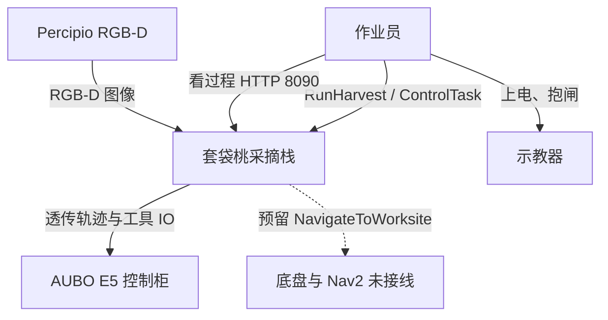
```mermaid
flowchart TB
  op["作业员"]
  harvest["套袋桃采摘栈"]
  e5["AUBO E5 控制柜"]
  cam["Percipio RGB-D"]
  teach["示教器"]
  nav2["底盘与 Nav2 未接线"]
  op -->|"RunHarvest / ControlTask"| harvest
  op -->|"看过程 HTTP 8090"| harvest
  op -->|"上电、抱闸"| teach
  cam -->|"RGB-D 图像"| harvest
  harvest -->|"透传轨迹与工具 IO"| e5
  harvest -.->|"预留 NavigateToWorksite"| nav2
```

**读图：** 中间实心盒子才是我们写的软件。作业员用 8090 看过程与轨迹；动臂仍须示教器上电，调试 POST 另须 yaml `debug.motion_enabled`。柜和相机是外部系统：本栈不实现其驱动协议以外的产品逻辑。底盘盒子画虚关系：导航为预留（导航包已归档），调度直通 `NAV_OK`。`peach_interfaces` 没有进程，上下文层不单独成盒。

### 图 2 — 容器（C4 Container）

打开图 1 中间那个盒子。每个容器是**可独立运行的进程/节点**，不是 colcon 包名。箭头上写它运的东西（动作、话题、HTTP），不要写「然后」。

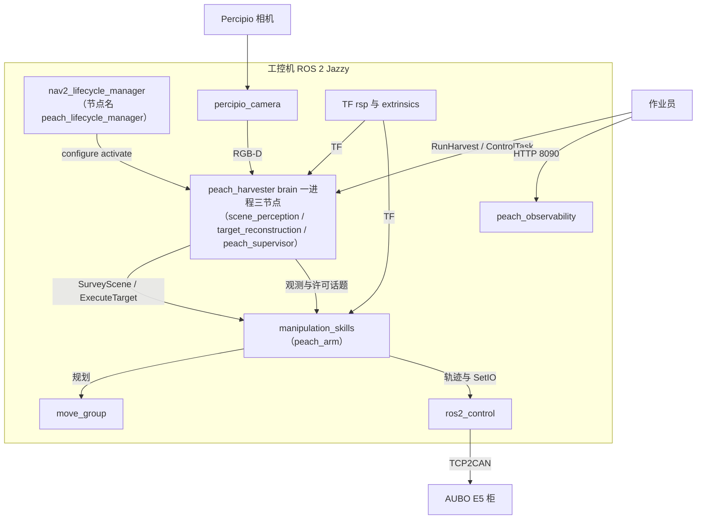
```mermaid
flowchart TB
  op["作业员"]
  e5["AUBO E5 柜"]
  camhw["Percipio 相机"]
  subgraph ipc["工控机 ROS 2 Jazzy"]
    brain["peach_harvester brain 一进程三节点（scene_perception / target_reconstruction / peach_supervisor）"]
    lcm["nav2_lifecycle_manager（节点名 peach_lifecycle_manager）"]
    obs["peach_observability"]
    sk["manipulation_skills（peach_arm）"]
    mg["move_group"]
    r2c["ros2_control"]
    pcam["percipio_camera"]
    tf["TF rsp 与 extrinsics"]
  end
  op -->|"RunHarvest / ControlTask"| brain
  op -->|"HTTP 8090"| obs
  lcm -->|"configure activate"| brain
  brain -->|"SurveyScene / ExecuteTarget"| sk
  brain -->|"观测与许可话题"| sk
  pcam -->|"RGB-D"| brain
  tf -->|"TF"| brain
  tf -->|"TF"| sk
  sk -->|"规划"| mg
  sk -->|"轨迹与 SetIO"| r2c
  camhw --> pcam
  r2c -->|"TCP2CAN"| e5
```

**读图：** 调度是唯一对采摘动作的客户端。3b 起（`peach_harvester.brain`）调度、感知、重建在同一进程：BeginScene / BuildTargetModel / 感知→重建观测为进程内传递，图名与话题契约不变，lifecycle 仍按节点名逐个管理。`BeginScene` 等批次动作的客户端语义不变（调度受理后进程内转发）。感知只出话题，不调 MoveIt。技能只对 `move_group` 和 `ros2_control` 要运动。监控只连作业员浏览器。lifecycle 管理器（整栈为 `nav2_lifecycle_manager`，节点名 `peach_lifecycle_manager`）只管四能力节点，不管监控、不管 bringup。契约包 `peach_interfaces` 被上述容器编译依赖，本身不是容器。

### 图 3 — 组件（C4 Component）· 技能节点

再打开图 2 里的 `manipulation_skills`。盒子是该进程内的主要模块，不是每一个 `.cpp` 文件。

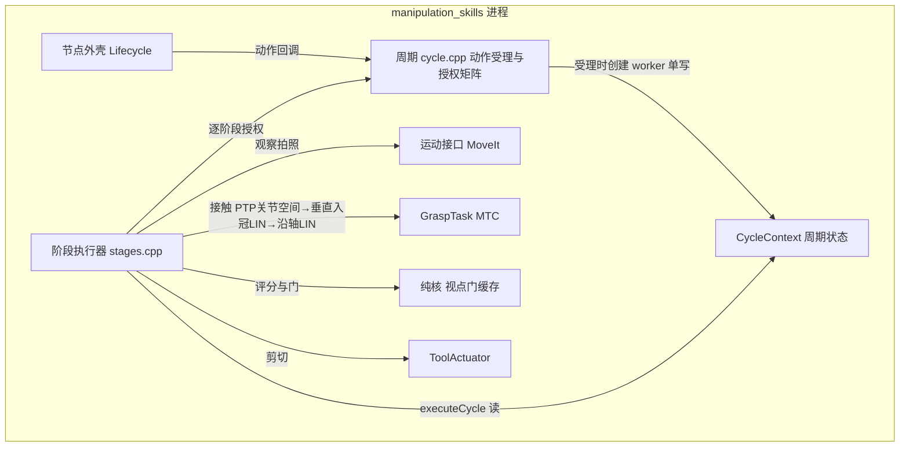
```mermaid
flowchart TB
  subgraph sk["manipulation_skills 进程"]
    shell["节点外壳 Lifecycle"]
    cycle["周期 cycle.cpp 动作受理与授权矩阵"]
    ctx["CycleContext 周期状态"]
    stages["阶段执行器 stages.cpp"]
    mot["运动接口 MoveIt"]
    mtc["GraspTask MTC"]
    core["纯核 视点门缓存"]
    tool["ToolActuator"]
  end
  shell -->|"动作回调"| cycle
  cycle -->|"受理时创建 worker 单写"| ctx
  stages -->|"executeCycle 读"| ctx
  stages -->|"逐阶段授权"| cycle
  stages -->|"观察拍照"| mot
  stages -->|"接触 PTP关节空间→垂直入冠LIN→沿轴LIN"| mtc
  stages -->|"评分与门"| core
  stages -->|"剪切"| tool
```

**读图：** 一个进程、八个组件（`ExecutionAuthority` 授权矩阵编在 `cycle.cpp`，`CycleContext` 在 `cycle_context.hpp`）。外壳不规划；`cycle.cpp` 受理动作并按 `authorizeStage` 判定执行权；阶段执行器读上下文跑固定阶段序列；接近主路径 = PTP 关节空间到中段点正下方（树冠外，滚转梯子 {0,±30°,±60°}+随机重启 IK）+ 世界垂直 LIN 入冠（伸进果树里）+ 沿轴 LIN 对轴进入预抓取；无候选扫描/多级兜底（2026-09-23 定型 v4）；PTP 亦用于命名关节赶路（拍照位 / stow）；刀具不在 MTC 里。感知两容器的同缩放运行时图见 **图 3b（看一帧）/ 图 3c（建一颗）**；调度组件图按同样缩放另画，不要把那些模块塞进这一张。

### 图 0 — 预留层与采摘核

本仓 **colcon 包**边界速览，不是 C4。C4 容器是进程；这里盒子是包。

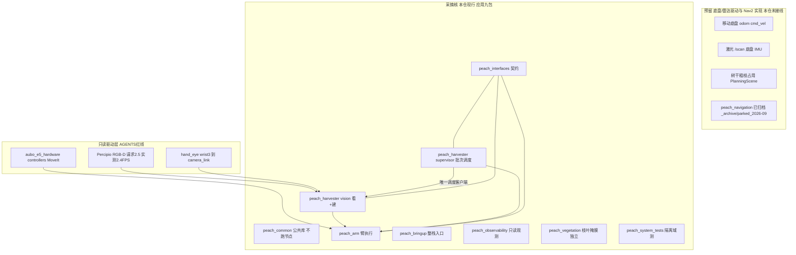
```mermaid
flowchart TB
  subgraph reserved ["预留 底盘/雷达驱动与 Nav2 实现 本仓未接线"]
    chassis["移动底盘 odom cmd_vel"]
    lidar["激光 /scan 底盘 IMU"]
    occ["树干粗枝占用 PlanningScene"]
    navpark["peach_navigation 已归档 _archive/parked_2026-09"]
  end
  subgraph core ["采摘核 本仓现行 应用九包"]
    iface["peach_interfaces 契约"]
    common["peach_common 公共库 不跑节点"]
    perc["peach_harvester vision 看+建"]
    skills["peach_arm 臂执行"]
    exe["peach_harvester supervisor 批次调度"]
    bringup["peach_bringup 整栈入口"]
    obs["peach_observability 只读观测"]
    veg["peach_vegetation 枝叶掩膜 独立"]
    systest["peach_system_tests 隔离域测"]
  end
  subgraph hw ["只读驱动层 AGENTS红线"]
    cam["Percipio RGB-D 请求2.5 实测2.4FPS"]
    arm["aubo_e5_hardware controllers MoveIt"]
    eye["hand_eye wrist3 到 camera_link"]
  end
  cam --> perc
  eye --> perc
  arm --> skills
  perc --> skills
  exe -->|"唯一调度客户端"| perc
  exe --> skills
  iface --- perc
  iface --- skills
  iface --- exe
```

**读图：** 三块从上到下是「将来 / 现在干活 / 不许改的驱动」。导航适配移入预留层：包体已归档，只剩 manifest 里四个标「预留」的 IDL 名；调度 `_cmd_navigate` 直通 `NAV_OK`，不指向任何导航进程。实线：相机和手眼只进视觉；臂只进技能；调度是唯一能同时点视觉与臂的客户端。契约包没有箭头、不跑节点，只规定能力包之间怎么说话；`peach_common` 同为库（参数/规则/QoS/路径单源），被各 peach Python 包 import，不画数据流箭头。整栈入口 `peach_bringup` Include 只读 `aubo_e5_bringup`；`peach_observability` 可拆；`peach_vegetation` 独立 launch、不进运行图；`peach_system_tests` 不进运行 launch。

采摘核仍不订 `/scan`、底盘 IMU、odom。可选包 `serial_imu` 发 `/imu/data`（及 `data_raw`/`mag`/`temp`）与 `/force/points`（咬合末端 5 点力，2026-09-29 实测 A5 力帧与 A4 IMU 帧共用 `/dev/imu` 同口，节点 `feed_mux` 分流，打印默认关），随 `harvest_system` 起（`imu_enabled` 默认 true，挂 `tcp` 并对齐），不进 lifecycle、不进只读 bringup。架子机 URDF/MoveIt 在 `_archive/parked_2026-08-24/`。

### 图 A — 核内分层

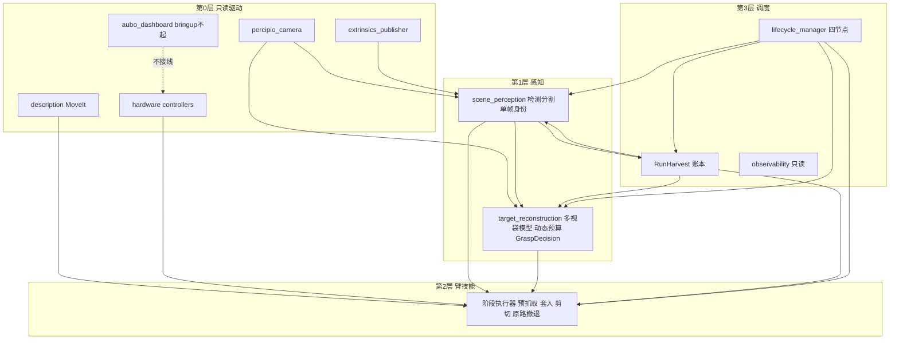
```mermaid
flowchart TB
  subgraph L0 ["第0层 只读驱动"]
    cam["percipio_camera"]
    hw["hardware controllers"]
    desc["description MoveIt"]
    eye["extrinsics_publisher"]
    dash["aubo_dashboard bringup不起"]
  end
  subgraph L1 ["第1层 感知"]
    scene["scene_perception 检测分割单帧身份"]
    recon["target_reconstruction 多视袋模型 动态预算 GraspDecision"]
  end
  subgraph L2 ["第2层 臂技能"]
    skill["阶段执行器 预抓取 套入 剪切 原路撤退"]
  end
  subgraph L3 ["第3层 调度"]
    exe["RunHarvest 账本"]
    lcm["lifecycle_manager 四节点"]
    obs["observability 只读"]
  end
  cam --> scene
  cam --> recon
  desc --> skill
  eye --> scene
  hw --> skill
  scene --> recon
  scene --> skill
  recon --> skill
  scene --> exe
  exe --> skill
  exe --> recon
  exe --> scene
  lcm --> scene
  lcm --> recon
  lcm --> skill
  lcm --> exe
  dash -.->|"不接线"| hw
```

**读图：** 层号越大越「会拍板」。第 0 层只出图和关节，不选下一颗桃。第 1 层「看」出身份，「建」出这一颗的模型和是否允许套入。第 2 层只执行调度发来的动作。第 3 层才开批、写账本、拉生命周期（到位一步直通 `NAV_OK`，导航适配在预留层，见决策 0009）。`aubo_dashboard` 画成虚线：bringup 根本不起它。监控在调度包里，但 lifecycle 不管它。

禁止：能力包互发批次命令；感知调 MoveIt；技能写 `ledger.json`；bringup 起 `aubo_dashboard`。

### 图 B — 控制面与数据面

调度是能力包**批次动作的唯一客户端**；8090 调试桥（见决策 0018）是唯一例外，可直发单颗动作且留审计。感知与重建只发话题；技能只当 `SurveyScene` / `ExecuteTarget` 服务端。监控视图只订不发。

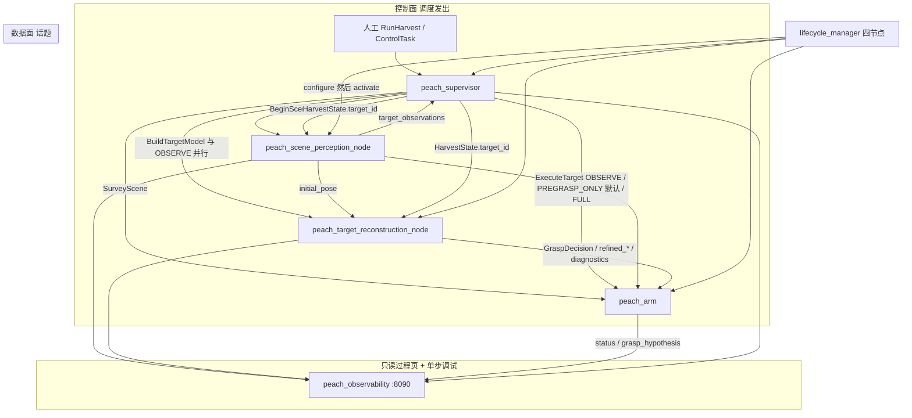
```mermaid
flowchart TB
  subgraph ctrl ["控制面 调度发出"]
    Op["人工 RunHarvest / ControlTask"]
    Ex["peach_supervisor"]
    Op --> Ex
    Ex -->|SurveyScene| Sk["peach_arm"]
    Ex -->|BeginScene| Sc["peach_scene_perception_node"]
    Ex -->|"BuildTargetModel 与 OBSERVE 并行"| Rc["peach_target_reconstruction_node"]
    Ex -->|"ExecuteTarget OBSERVE / PREGRASP_ONLY 默认 / FULL"| Sk
  end
  subgraph data ["数据面 话题"]
    Sc -->|"target_observations"| Ex
    Sc -->|"initial_pose"| Rc
    Sc --> Sk
    Rc -->|"GraspDecision / refined_* / diagnostics"| Sk
    Ex -->|"HarvestState.target_id"| Sc
    Ex -->|"HarvestState.target_id"| Rc
  end
  subgraph watch ["只读过程页 + 单步调试"]
    Obs["peach_observability :8090"]
    Sc --> Obs
    Rc --> Obs
    Sk -->|"status / grasp_hypothesis"| Obs
    Ex --> Obs
  end
  Lcm["lifecycle_manager 四节点"] -->|configure 然后 activate| Sc
  Lcm --> Rc
  Lcm --> Sk
  Lcm --> Ex
```

**读图：** 上块是「谁命令谁」（动作/服务），只有调度往外指。中块是「谁把数据广播给谁」（话题）；感知和重建从不互发动作。下块以订阅为主；8090 过程页只读，调试 Tab 可转发既有单步动作（动臂须 `debug.motion_enabled`）。lifecycle 箭头与批次无关：只把四节点配到 Active，不上电、不开批，不发 `RunHarvest`。柜侧上电由人工用示教器完成。

lifecycle 名单：场景 → 重建 → 技能 → 调度。observability **不进名单**，节点自行 Active。

### 命名与文件树

ROS 2 Jazzy / ament 惯例。**包名与图名（节点、话题、动作、服务）保持契约**（[io.md](io.md)），不因整理文件而改图。驱动九包文件树不动。

| 层 | 规则 |
|----|------|
| 包名 | `peach_<职责>`，小写+下划线；与 `package.xml` / 目录名一致 |
| Python 模块 | `ament_python`：`src/<pkg>/<pkg>/`，模块名 = 包名 |
| C++ | `ament_cmake`：`include/<pkg>/`、`src/`、可执行文件名 = 节点名 |
| IDL | `peach_interfaces`：`msg/` `srv/` `action/` + `config/interface_manifest.yaml` |
| launch | 包根 `launch/<职责>.launch.py`；整栈入口固定 `harvest_system.launch.py` |
| config | 包根 `config/<职责>.yaml`；**根键 = 节点名** |
| 参数模块 | Python peach 节点：`config/<节点>.yaml` 直读 + `attach(node)` 一行（`yaml_params.py`）；`peach_arm` 仍 GPL（`arm_parameters.yaml` → `arm_parameters.hpp`）。键名=点号路径 |
| 类名 | 与职责一致：`ScenePerceptionNode` / `TargetReconstructionNode` / `ManipulationSkillsNode` / `TaskExecutorNode` / `LifecycleManagerNode` / `ObservabilityNode` |
| 可执行文件 | `ros2 run <pkg> <节点名>`；与 launch `executable=` 一致 |

职责对照（图名保持契约；源码目录/类跟职责）：

| 职责 | 图名 | 目录 / launch / config | 类 |
|------|------|------------------------|-----|
| 看 | `peach_scene_perception_node` | `scene_perception` | `ScenePerceptionNode` |
| 建 | `peach_target_reconstruction_node` | `target_reconstruction` | `TargetReconstructionNode` |
| 动 | `peach_arm` | `peach_arm` | `ManipulationSkillsNode` |
| 批 | `peach_harvester`（supervisor） | `peach_harvester`（supervisor） | `TaskExecutorNode` |
| 管 | `peach_lifecycle_manager` | `lifecycle_manager` | `LifecycleManagerNode` |
| 监 | `peach_observability` | `peach_observability` | `ObservabilityNode` |
| 枝叶 | `peach_vegetation` | `peach_vegetation` | `VegetationNode` |

四个能力包现行树（其后 `peach_stereo` 为可选相机前端、`serial_imu` 为可选传感器、`imu_follow` 为可选 IMU 跟随工具，皆不是能力包；旁路视觉抓取三包见本节末；`peach_navigation` 已归档，树在 `_archive/parked_2026-09/`）：

```
peach_interfaces/
  action/  msg/  srv/  README.md  config/interface_manifest.yaml  scripts/check_interface_manifest.py

peach_harvester/                    # 大脑包：vision（看+建）与 supervisor（批）一包；3b 起一进程三节点
  peach_harvester/brain.py          # 大脑进程入口（3b）：scene_perception + target_reconstruction + supervisor
                                    # 三节点进同一 MultiThreadedExecutor；图名/话题/lifecycle 管理零变化
  peach_harvester/yaml_params.py    # W1 起 shim：实现单源 peach_common（bringup/vegetation 同；vision/supervisor 两处 param_rules.py 同为 shim）
  peach_harvester/vision/common/{runtime,geometry,tool_budget,bag_landmarks}.py + common/ros/clock_adapter.py
  peach_harvester/vision/domain/{budget,cross_field,evidence,model_contract,observation,tracking}.py
  peach_harvester/vision/scene_perception/{scene_perception_node,pipeline,plan_updater,stream_metrics,identity,image_gates,pose_pipelines,inference,contracts,visualization,msg_builders,debug_draw,params}.py  # pipeline.py：from_params+process；plan_updater.py：帧级计划/身份/光照推进纯核（W3 下沉，零 ROS msg）；msg_builders/debug_draw：消息组装与像素绘制自 visualization 拆出；params.py：gravity/tool 派生 + attach(node) 一行
  peach_harvester/vision/target_reconstruction/{target_reconstruction_node,reconstruction_core,session,capture,integrate,refine,refit_orchestrator,session_recorder,publish,params}.py  # session.py：from_params+process；reconstruction_core.py：共享状态与方法宿主（W4 三 Mixin 本体迁入，节点经 MRO 组合）；refit_orchestrator.py：refit→关键点融合→merge 编排纯核；session_recorder.py：session/geometry 落盘纯核（含自 publish 迁入的 save_session）；params.py：attach + strip 派生
  peach_harvester/vision/{grasp_standoffs,tool_profiles,param_rules}.py   # grasp_standoffs 读同名 yaml 注入两节点；tool_profiles 装载工具档案
  peach_harvester/supervisor/{executor_node,harvest_fsm,batch,observe,lifecycle_manager,param_rules,params}.py  # observe=fast 档观察纯核（W6-A）；ledger/watchdog 死码已删（W6-B）
  peach_harvester/supervisor/domain/{reducer,lifecycle}.py
  peach_harvester/cycle_core/{batch_policy,view_planner,view_policy}.py   # 批次策略 / 视点规划纯核
  config/{scene_perception,target_reconstruction,peach_supervisor,observability,lifecycle_manager}.yaml  # 全量清单（部署事实源）
  config/{grasp_standoffs.yaml,{vision,supervisor}_contract.param.yaml}   # 轴向后撤两行 / GPL 跨字段合同（键名冻结）
  launch/{brain,harvest_system,peach_executor,scene_perception,target_reconstruction,lifecycle_manager,observability}.launch.py
  # brain=一进程三节点整段入口；harvest_system=薄转发→peach_bringup；peach_executor=supervisor 独立入口
  # 离线评估脚本已归档 _archive/offline_2026-09/（含 bag_baseline），不随包安装
  # 2026-09-14：Phase D 过拆回并；聚合模块即正文（不留 shim）。common/ 不聚合 re-export。

peach_arm/
  include/peach_arm/   # 公有头：节点/周期/接触/工具 + 合同（model/plan/acm/pregrasp）
                                 # + 纯核门与视点 / 几何与护栏；参数快照=GPL 生成的 arm_parameters.hpp
                                 # 纯核头（W5 抽出，header-only）：frame_timeouts / pregrasp_residual / angles（staging_selector 已随 v4 轨迹定型删除，2026-09-23）
                                 # params_bridge.hpp：GPL 快照→MotionConfig/GraspTaskConfig 单点转换（删 ~28 镜像成员）
  src/*.cpp                      # cycle.cpp(授权矩阵+action 管线) stages.cpp(阶段函数) grasp_task.cpp(MTC 接触)
                                 # motion.cpp(MGI+CheckReachability) move_to.cpp(MoveTo 动作+使能心跳) manipulation_skills_node.cpp(壳,含诊断双轨) main.cpp
                                 # 纯核：quality_gate / safety_gate / view_planner / target_cache；acm_policy.hpp 两函数合一
  src/arm_parameters.yaml        # GPL 单源（清洁重写轮 2c）：默认/校验/描述，生成 include/peach_arm/arm_parameters.hpp
  config/peach_arm.yaml   # 全量部署清单；默认/校验权威在 GPL src/arm_parameters.yaml
  launch/peach_arm.launch.py

peach_bringup/
  peach_bringup/{preflight,lifecycle_flag_bridge,autostart_client,params,yaml_params}.py  # yaml_params 为 peach_common shim（W1）
  launch/harvest_system.launch.py

peach_observability/
  peach_observability/{observability_node,state,recorder,catch_all_recorder,pipeline,job,http_server,params,tcp_trajectory,debug_actions,bag_reader,bag_report,retention,path_metrics}.py
  launch/{observability,record_bag}.launch.py
  web/   # 8090 静态页
  test/{test_bag_report,test_pipeline,test_path_metrics}.py

peach_vegetation/
  peach_vegetation/{vegetation_node,split,frangi,params,param_rules}.py
  config/vegetation.yaml
  launch/vegetation.launch.py
  test/{test_leaf_mask,test_frangi,test_params}.py

peach_system_tests/
  test/{test_mock_launch,test_preflight,test_replay_approach,test_perf_baseline}.py + replay_{oracle.py,baselines.json} + perf_baseline.json
  # perf_baseline.json：性能对拍锚点（W0，仓内实测数字带 _provenance，schema 由 test_perf_baseline 守卫）

peach_common/                     # 共享设施库（W1，对齐 nav2_common）：不跑节点、不进 launch；harvester/bringup/vegetation 旧路径为转发 shim
  peach_common/{yaml_params,param_rules,qos,paths}.py   # yaml 直读 attach / 规则并集 / QoS 工厂 / safe_component+runs_root 单源
  test/{test_yaml_params,test_param_rules,test_paths,test_qos}.py

peach_stereo/          # 可选相机前端（camera_frontend:=stereo）：主机单图案立体 RGB-D，话题与 percipio 同构
  src/  config/  launch/  README.md   # 规格档案（参数档/confidence 布局）见 src/peach_stereo/README.md
  test/                               # 与 percipio 双前端对比档案：analysis/report/scripts/data（索引 test/README.md）

serial_imu/
  serial_imu/{imu_node,protocol,frame}.py
  serial_imu/{force_node,force_protocol}.py   # 咬合末端 5 点力（0xA5/100Hz，与 IMU 同口 feed_mux 分流；独立节点不进整栈）
  config/{serial_imu,serial_force}.yaml
  launch/{serial_imu,serial_force}.launch.py
  rviz/serial_imu.rviz
  udev/99-imu-usb-serial.rules

imu_follow/
  imu_follow/{follow_node,follow_core,params}.py   # 跟随节点 / 纯核姿态数学 / 手写参数模块
  config/{imu_follow,moveit_servo}.yaml            # 节点参数 / moveit_servo 部署值（参数名自带 moveit_servo. 前缀）
  launch/{imu_follow,imu_follow_servo}.launch.py   # 单节点（fjt 备选）/ servo 集成（mock 主入口）

# 旁路视觉抓取（不进 harvest_system / lifecycle；IDL 不走 peach_interfaces）
ivg_interfaces/          # 估姿 srv/msg；仅旁路栈（EstimatePose 带 Header）
ivg_pose_estimation/     # 估姿节点 + FastAPI :8089（分段流水线 pipeline/；旋转数学用 scipy）
  ivg_pose_estimation/pipeline/   # 分段门面：segmenters/{depth_band,rembg_u2net,mobile_sam} + matchers/{geometric,dinov2_template}
  config/pose_estimation.yaml     # 算法配置单源（后端选型/深度单位/手眼单位）
  models/                # u2net.onnx 与 mobile_sam.pt 均不入库（fetch 脚本拉取）
  templates/             # 工件模板（DINOv2 嵌入索引 .dinov2_index.npz 随建随存）
ivg_graspnet/
  ivg_graspnet/{grasp_core,postprocess,inference_session,graspnet_node,motion_controller,publish_grasps_client}.py
  ivg_graspnet/backends/         # GraspBackend 注册表：graspnet_torch（默认）+ contact_graspnet
  ivg_graspnet/graspnet_lib/      # vendored GraspNet-baseline 推理子集（纯 torch，AMENT_IGNORE）
  ivg_graspnet/contact_graspnet_lib/  # vendored contact_graspnet_pytorch（AMENT_IGNORE；NVIDIA 非商用系许可）
  config/graspnet.yaml
  launch/{graspnet_detect,graspnet_grasp}.launch.py
  models/checkpoint-rs.tar + checkpoint-rs.yaml   # 权重 + 耦合超参 manifest
```

旧名 `peach_pose` / `approach_grasp` 不再作路径。Marker 命名空间：场景 `scene_perception`；重建主 ns `target_reconstruction`，精化 `peach_reconstruction/refined`，网格 `peach_reconstruction/tsdf_mesh`。

### 二十八包总表（采摘产品 + IVG 演示栈）

colcon 工作区 = 采摘应用 8（含公共库 `peach_common`：参数/规则/QoS/路径单源，不跑节点、不进运行链）+ 相机前端 1（`peach_stereo`）+ 臂/相机 9 + 内参标定工具 1（`camera_calibration`，vendored）+ 可选 USB IMU 1 + 可选 IMU 跟随 1 + **旁路视觉抓取 3**。旁路三包不进 `harvest_system` / lifecycle、不订 peach 话题。能力四包作用不得串；驱动九包给感知 TF / 技能 MoveIt 用，其中标「只读」的不得改。`serial_imu` 随 `harvest_system` 起、不进 lifecycle。`imu_follow` 仅 `adaptive_shear_v1` 随整栈 Include（`motion.enabled` 默认 false；shear/bite 两档不起）。`peach_navigation` 已归档，不在本表。

### 产品链（应用九包）

colcon 工作区采摘应用 = `peach_interfaces` / `peach_harvester`（vision） / `peach_arm` / `peach_harvester`（supervisor） / `peach_common` / `peach_bringup` / `peach_observability` / `peach_vegetation` / `peach_system_tests`（另有仿真场景包 `peach_sim`：只出 Gazebo Harmonic 果园场景与采摘工位模型 + 目标清单 GT，不是能力包、不进 `harvest_system` / lifecycle / 运行 launch）。能力四包作用不得串；跨包仍只走 IDL（`peach_common` 只装共享设施，不载业务契约）。`peach_vegetation` 独立 launch，不进 `harvest_system`。驱动九包给感知 TF / 技能 MoveIt 用，其中标「只读」的不得改。`serial_imu` 不是 peach 包，随 `harvest_system` 起、不进 lifecycle。`imu_follow` 仅 `adaptive_shear_v1` 随整栈。`peach_system_tests` 只进 `colcon test`，不进运行 launch。

产品链：**契约 → 到位（预留，直通 NAV_OK）→ 场景里有哪些桃 → 这一颗的局部模型 → 臂怎么动。** 整栈入口 `ros2 launch peach_bringup harvest_system.launch.py`（`peach_harvester`（supervisor） 同名 launch 薄转发）。

| 包 | 层 | 作用（一句话） | 改不改 |
|----|----|----------------|--------|
| `peach_interfaces` | 契约 | 跨包唯一 IDL（含 4 个预留导航名） | 改字段只改这里 |
| `peach_common` | 公共库 | `yaml_params` / `param_rules` / `qos` / `paths` 单源（对齐 `nav2_common`；不跑节点） | 只加共享设施；旧路径 shim 保留 |
| `peach_harvester`（vision） | 视觉 | 看场景 + 建当前目标（节点薄壳；`plan_updater` / `refit_orchestrator` / `session_recorder` / `ReconstructionCore` 承计算本体）+ `peach_scene_obstacles` 场景障碍快照节点（独立进程，Survey 触发→点云滤除链→PlanningScene 障碍对象；0035） | 检测/分割/TSDF/障碍快照 |
| `peach_arm` | 臂 | 拍照、视点、MTC、工具、撤退（纯核 `frame_timeouts` / `pregrasp_residual` / `angles` + `params_bridge` 参数单点） | 视点/MTC/GPIO 参数 |
| `peach_harvester`（supervisor） | 调度 | 开批、选果、账本、lifecycle（`observe.py` fast 档观察纯核） | 批次顺序/名单 |
| `peach_bringup` | 部署 | 整栈组合、预检、Include 只读 bringup | launch 参数 |
| `peach_observability` | 观测 | 8090/JSONL + 独立 rosbag2 | 录制话题 |
| `peach_vegetation` | 环境（影子） | GPU 枝/叶 2D 掩膜 | 分割阈值；不写场景 |
| `peach_system_tests` | 测试 | isolated launch_testing / mock 矩阵 + 回放塔 + perf 基线 | 不进真机 |
| `peach_sim` | 仿真场景 | Gazebo Harmonic 果园世界 + 采摘工位模型 + 目标清单 GT（口径见包 README） | 布局/几何参数；不进运行 launch |

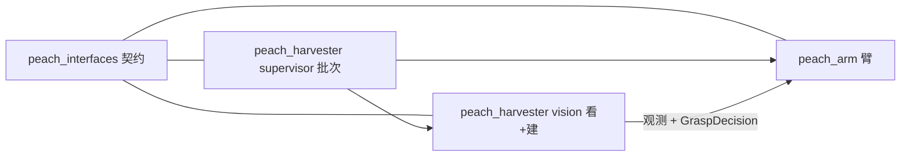
```mermaid
flowchart LR
  iface["peach_interfaces 契约"]
  perc["peach_harvester vision 看+建"]
  skills["peach_arm 臂"]
  exe["peach_harvester supervisor 批次"]
  iface --- perc
  iface --- skills
  iface --- exe
  exe --> perc
  exe --> skills
  perc -->|"观测 + GraspDecision"| skills
```

**读图：** 从左到右是产品链，不是启动顺序。调度点视觉/臂；视觉把「有哪些桃」和「这一颗能不能套」交给臂。契约横线表示能力包都只认同一套 IDL；`peach_common` 是公共库（参数/规则/QoS/路径/名单外 lifecycle 自转换单源，对齐 `nav2_common`），不跑节点故不画盒子。整栈入口在 `peach_bringup`；lifecycle 管理器仍在调度包；8090 实现与静态页在 `peach_observability`（参数 yaml 自持于本包 config，W11 起不再跨包 import 调度；runs 根解析单源 `peach_common.paths.runs_root`）。

### 驱动九包（只读面见 AGENTS）

| 包 | 层 | 作用（一句话） | 改不改 |
|----|----|----------------|--------|
| `aubo_msgs` | 驱动契约 | 柜侧状态 / SetIO / FK·IK | 只读（驱动栈） |
| `aubo_description` | 几何 | URDF：臂、相机体、快换、三把剪切手档案（`shear_v1` / `bite_shear_v1` / `adaptive_shear_v1`+IMU，2026-09-28 替换两把套袋圆柱）各持 TCP 原点与真实 CAD 网格，帧名共用 | 工具帧与 collision 可改；`ros2_control.xacro` 只读 |
| `aubo_e5_hardware` | 硬件插件 | 真机 `SystemInterface` | **只读** |
| `aubo_e5_controllers` | 控制器 | 透传轨迹 + IO / `RobotStatus` | **只读** |
| `aubo_dashboard` | 柜侧慢操作 | 上电/抱闸/FK·IK/负载 | **只读且 bringup 不起** |
| `aubo_e5_bringup` | 手臂入口 | mock/real + 可选相机/手眼/MoveIt | `bringup.launch.py` 仅 `tool_profile` arg 最小穿透（2026-09-15 授权，决策 0020）；驱动逻辑只读 |
| `aubo_e5_moveit_config` | 规划配置 | 组 `manipulator_e5`、命名位姿、规划器 | 示教位姿写 SRDF |
| `aubo_hand_eye_calibration` | 手眼/内外参标定 | `wrist3_Link→camera_link` 静态 TF；`apply_intrinsics` 内参落盘；auto 档自动视点+联合求解（默认 poses 档不变） | active.yaml 入库随仓；joint 产物含 intrinsics 节 |
| `camera_calibration` | 内参标定工具 | vendored image_pipeline jazzy @`6c3df30` 的交互式棋盘格标定器 | 原样入库零修改；会话工具不进常驻栈 |
| `percipio_camera` | 相机驱动 | RGB-D 话题 | 厂商代码；未授权不改 `frame_rate` |
| `serial_imu` | 可选 USB IMU | CH340/CH343 适配器，0xA4 → `/imu/data`（imu_tools 布局） | 随 `harvest_system`（`imu_enabled`）；不进 lifecycle / bringup |
| `imu_follow` | 可选 IMU 跟随 | `/imu/data` 增量 → MoveIt Servo twist（主）/ FJT 流式（备） | 仅自适应档案随 `harvest_system`；默认只算不发；真机须授权 |
| `ivg_interfaces` | IVG IDL | 模板估姿服务消息 + 演示栈（拉花/快换/抓取/监控，2026-09-30 自 aubo_boot 移植） | 不进 peach 清单 |
| `ivg_pose_estimation` | 旁路估姿 | 模板匹配 6D + Web 8088 | 独立 launch |
| `ivg_graspnet` | 旁路抓取 | GraspNet 点云→位姿→MoveIt 接近 | 无 AnyGrasp 许可证 |
| `ivg_demo_services` | 演示栈服务 | demo_motion 运动薄层 + move_service（手动运动/状态/IO 读/使能/速度）+ grasp_trigger（单次/循环抓取）+ system_monitor 心跳 | 自 aubo_boot demo_driver 按需补缺；不进 harvest_system/lifecycle |
| `latte_backend` | 演示拉花 | 5 步拉花工作流 + 心形轨迹纯核（MSLA 参数化）+ 奶缸嘴标定 + DO2/DO4 IO 桥 | 运动薄层复用 ivg_demo_services |
| `tool_changer` | 演示快换 | 数据驱动取/放轨迹（tools.yaml）+ PlanningScene 附着/脱离 + 前端 URDF 换装 | attach_frame 默认 quick_changer_link |
| `aubo_ros2_web_dashboard` | 演示 Web 控制台 | FastAPI 纯代理网关 **8095** + 8 MPA 面板（rosbridge 9090 / foxglove 8765 / web_video 8089） | 8090 仍归 peach_observability；不进 harvest_system/lifecycle |

改哪边：消息字段 → `peach_interfaces`；检测/分割/TSDF → `peach_harvester`（vision）；视点/MTC/工具 IO 参数 → `peach_arm`；TCP/工具碰撞 mesh → `aubo_description`（勿改 `ros2_control.xacro`）；**末端工具切换 → launch `tool_profile` 参数**（URDF TCP、感知 `tool.D_inner`、重建 `tool.budget.d_inner` 许可内径与各包 `tool.profile_id` 标签统一由 `aubo_description/config/<profile>.yaml` 档案注入，装载器 `peach_harvester.vision.tool_profiles`；默认 `adaptive_shear_v1`，其余末端显式 `tool_profile:=shear_v1` / `bite_shear_v1`；切换须整栈重启）；拍照命名位姿 → `aubo_e5_moveit_config` SRDF；批次顺序/选果/账本/lifecycle 名单 → `peach_harvester`（supervisor）；到位/Nav2 → 归档的 `peach_navigation`（须先书面授权恢复）。套袋内径/插入行程基础值在感知 `config/scene_perception.yaml` 与 `config/target_reconstruction.yaml` 的 `tool.*`（整栈被工具档案注入覆盖）。入口相对袋底、预抓取相对入口只改 `peach_harvester/config/grasp_standoffs.yaml`（launch 注入各节点已声明参数）。

作业目标只认调度 `~/state.target_id`。能力包不互发批次命令；只有调度当 `BeginScene` / `SurveyScene` / `BuildTargetModel` / `ExecuteTarget` / `CheckReachability` 的客户端（`NavigateToWorksite` 预留，现行无客户端/服务端）。

---

### `peach_interfaces` — 跨包唯一契约

**作用：** 各能力包之间唯一允许的消息/服务/动作类型。感知两节点之间、技能、调度、监控都只依赖本包，禁止互相 `import` 业务模块传结构体。

**含什么：** 无节点、无 launch、无运行参数。`msg/` `srv/` `action/`（文件头写话题/谁发谁订，字段行内注释）+ `config/interface_manifest.yaml`（名称/类型/QoS/生产消费方；56 active + 5 reserved——预留第五个为 `peach_sim/joint_states` gz 桥登记，非导航；`scripts/check_interface_manifest.py` 双向核对）。管子与字段含义：[README.md](../src/peach_interfaces/README.md)。

**对外提供：**

| 种类 | 名字 | 谁当服务端 | 语义 |
|------|------|------------|------|
| 动作 | `RunHarvest` | 调度 | 显式开一批 |
| 动作 | `NavigateToWorksite` | （预留，导航包已归档） | 走到作业位；调度直通 `NAV_OK`，无现行服务端 |
| 动作 | `SurveyScene` | 技能 | 去拍照位姿并复核关节；DISCOVERY 首巡在 Begin 之前 |
| 动作 | `BuildTargetModel` | 重建 | 绑定目标、等视角、finalize |
| 动作 | `ExecuteTarget` | 技能 | PREVIEW / OBSERVE_ONLY / FULL / PREGRASP_ONLY |
| 服务 | `CheckReachability` | 技能 | 选果：预抓取 IK；FULL 再检套入终点 IK 与沿轴笛卡尔；不动臂 |
| 服务 | `BeginScene` | 场景感知 | 重启收齐窗、推进 `scene_epoch`；换场才清身份 |
| 服务 | `ControlTask` | 调度 | 暂停/跳过/取消/ACK 恢复 |
| 服务 | `ManageLifecycleNodes` | lifecycle 管理器 | 整栈 STARTUP…SHUTDOWN；不发 `RunHarvest` |

主要消息：观测 `PeachTargetObservation*`；几何初值 `BagGraspCandidate*` / `BagFitting*`；批次 `HarvestState` / `HarvestSummary` / `TargetOutcome` / `CanonicalEvent`；重建 `GraspDecision` / `ReconstructionStatus` / `TargetModel`。契约预留、节点尚未全部接线：`ShapeHypothesis`、`GraspHypothesis`。导航预留（manifest `reserved_interfaces` 区）：`NavigateToWorksite`、`HarvestTargetReport`、`VehicleState`、`HarvestOperationStatus`。

**禁止：** 跑节点、设算法默认值、写 launch、夹带视觉/运动实现。

**改法：** 改字段只改本包 IDL，先编本包再编下游；同步改 `interface_manifest.yaml`、[README.md](../src/peach_interfaces/README.md) 与 [io.md](io.md)。

---

### `peach_harvester`（vision） — 视觉算法（一包两节点）

**作用：** 回答两件事：场景里有哪些桃（稳定 `target_id`、锁定集）；当前作业目标这一颗的局部模型与抓取许可。不决定下一颗、不指挥臂。

**含什么：** `peach_scene_perception_node`、`peach_target_reconstruction_node`、无话题的 `common/`（拟合、深度单位、时钟、`HarvestDataStore` 往 `runs/<request_id>/perception_data/` 追加事件，不写调度 `ledger.json`）。两节点现为薄壳（W3/W4 瘦身）：帧级计划推进在 `plan_updater.py`、refit 编排在 `refit_orchestrator.py`、session 落盘在 `session_recorder.py`、共享状态与方法宿主在 `reconstruction_core.py`（节点经 MRO 组合），计算本体零 ROS 可单测。参数：部署事实源 `config/{scene_perception,target_reconstruction}.yaml`；节点一行 `attach(node)`（`peach_common.yaml_params`，旧包内路径为 shim）。`scene_perception/params.py` 只做 gravity/tool 派生；`target_reconstruction/params.py` 只做 strip。空 YOLO/SAM 路径在参数层拒绝启动。缝位：袋/果管线 + 柱/球 refitter 两处映射（见 §5）；其余算法直接构造。

#### `peach_scene_perception_node`（看）

- **输入：** 配准 RGB-D（Percipio `/camera/color|depth/image_raw`）；精确或 latest TF（stamp 失败标 `tf_stale`）；调度 `HarvestState`；`BeginScene`。
- **输出：** `/peach/perception/target_observations`、`initial_pose`、`diagnostics`；另有未进清单的 `detections` / `debug_image` / `masks` 等可视化。
- **做什么：** 节点 decode RGB-D/TF 后调 `PerceptionPipeline.process(frame)`（检测 → 分割 → 袋位姿 → 世界系身份 → 收齐锁定）。裸果线现行关闭（`from_params(..., enable_fruit=False)`：不构造果线，`class_id=1` 在 SAM 前丢弃；改 `True` 即恢复）。恢复后裸果球只作显示与袋内果实包络先验，`unbagged_display_only` 不进执行候选。`harvest_plan` 只做锁定集，不选下一颗。单帧 `BagGraspCandidate.status` ACCEPT/REOBSERVE/REJECT 只当初值与可视化。**图像边缘门：** 贴边帧不计确认累积；锁定后贴边打 `bbox_edge`，选果侧同步过滤。
- **禁止：** 重建 TSDF、调 MoveIt、写 `ledger.json`、发明深度。

#### `peach_target_reconstruction_node`（建）

- **输入：** 同一套 RGB-D；感知观测；`HarvestState.target_id`；`BuildTargetModel`。积分**只用精确 stamp TF**，禁止 latest。
- **输出：** `/peach/reconstruction/grasp_decision`（`allowed` 是套入/剪切权威；融合几何供预抓取；`valid_until` 窗口 2026-09-20 参数化 `decision.validity_s` 默认 120s——G1：原 5s 与接近链时长错配，冻结/不续签语义不变；`model_revision` 含单调 finalize 计数——G3：同目标重 Build 不再沿用旧令牌）、`pregrasp_verification`、`refined_*`、`diagnostics`、`tsdf_cloud`；可选 `session_*` 与 `geometry.jsonl`。
- **做什么：** 节点 decode 后 `ReconstructionSession.process` 做深度归一化与内参门；采集门（锁 → 精确 TF → 重校验）→ 局部 TSDF（可视化/占用，不授权轴）→ 有界 ICP 拒帧 → 采集串扰门（邻目标锚点 <150 mm 拒帧；**小框豁免**：邻居检测框面积×`capture.neighbor_gap_area_ratio`(2.0) < 绑定框面积时不计入间距，近距双检不互相锁死）→ 多视角袋关键点 Huber 融合（方向=底→颈；口底对打的视角否决不平均）→ 体积截面质心只改侧向定位 → 轴上剪切参考（袋口 / 分割贴检测框极限；果距不足只否决 `allowed`，不把刀挪到果–颈中点）→ 沿关键点轴的 TSDF 包络主方向作一致性否决 → 动态工具预算许可。体积积分成功后才做袋融合；融合或 `geometry.jsonl` 失败**不得**回滚已积分体积、不得把该帧从采集栈弹出（否则 `/peach/reconstruction/tsdf_cloud` 空、技能有效视点仍为 0）。写三维点不得对 ndarray 用 Python `or`。固定 35° 只诊断完全错轴。包络轴向跨度小于直径或切片不足时**不**打 `keypoint_cloud_axis_conflict`（扁袋圆柱 RANSAC 不作否决）。检测轴夹角只诊断，不进接触预算。融合残差写入 RMSE/内点率，不写死 0/1。`require_robot_static`：到位静止后才积分。`BuildTargetModel` 等**独立机位数**与角基线同时达标再 finalize（`capture.min_views` 默认 2 = 当前位+一次 0.15 m 短移）。`captured_views` 是积分帧数；`BuildTargetModel` 反馈 / `TargetModel.view_count` 是机位数。机位覆盖看 `view_directions` / `max_baseline_deg`（同机位连帧不加机位，不把连拍当多视）。
- **禁止：** 自己跑检测、写 `ledger.json`、选下一颗、用 latest TF 积分。

**被谁调：** 只有调度发 `BeginScene` / `BuildTargetModel`。技能只订阅观测与 `GraspDecision`，不调重建 `reset`/`finalize` Trigger。

#### 图 3b — 看一帧：`scene_perception` 一帧数据流

worker 帧链（`scene_perception_node`：decode → `pipeline.process` → publish）：

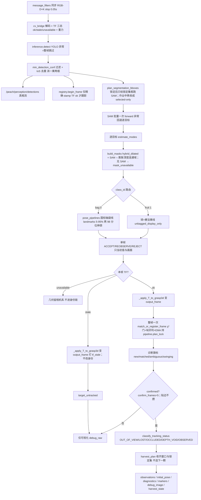
```mermaid
flowchart TD
  sync["message_filters 同步 RGB-D+K slop 0.05s"] --> dec["cv_bridge 解码 + TF 三态 ok/stale/unavailable + 重力"]
  dec --> yolo["inference.detect YOLO 异常=整帧跳过"]
  yolo --> filt["min_detection_conf 过滤 + IoS 去重 消一果两框"]
  filt --> detpub["/peach/perception/detections 真相流"]
  filt --> beginf["registry.begin_frame 仅精确 stamp TF ok 才跟踪"]
  filt --> samplan["plan_segmentation_bboxes 锁定后只给锁定集框跑 SAM；作业中再收成 selected-only"]
  samplan --> sam["SAM 批量一次 forward 异常回退逐目标"]
  sam --> perm["逐目标 estimate_modes"]
  perm --> mask["build_masks hybrid_dilated = SAM ∩ 膨胀深度连通域；无 SAM → mask_unavailable"]
  mask --> route{"class_id 路由"}
  route -->|bag 0| bagl["pose_pipelines 圆柱轴袋线 landmarks 5-95% 再 98 分位伸颈"]
  route -->|fruit 1| fruitl["球+梗洼果线 unbagged_display_only"]
  bagl --> gate1["单帧 ACCEPT/REOBSERVE/REJECT 只当初值与画面"]
  fruitl --> gate1
  gate1 --> tfq{"本帧 TF?"}
  tfq -->|unavailable| camonly["几何留相机系 不进身份链"]
  tfq -->|stale| worldstale["_apply_T_to_grasp3d 变 output_frame 打 tf_stale；不改身份"]
  tfq -->|ok| world["_apply_T_to_grasp3d 变 output_frame"]
  world --> assign["整帧一次 match_or_register_frame χ²门+匈牙利+EMA 持 pipeline.plan_lock"]
  assign --> flags["诊断旗标 new/matched/ambiguous/swinging"]
  worldstale --> flagsu["target_untracked"]
  flags --> confirmed{"confirmed? confirm_frames=5；贴边不攒"}
  flagsu --> visonly["仅可视化 debug_raw"]
  confirmed -->|是| cls["classify_tracking_status OUT_OF_VIEW/LOST/OCCLUDED/DEPTH_VOID/OBSERVED"]
  cls --> lock["harvest_plan 收齐窗口与锁定集 不选下一颗"]
  lock --> pub["observations / initial_pose / diagnostics / markers / debug_image / harvest_state"]
  confirmed -->|否| visonly
```

**读图（图 3b）：** 自上而下是一次「看」。检测、去重先定「画面里有几个框」；分割与几何逐目标跑出单帧状态——它只配画面与初值，永不授权运动。**只有精确 stamp TF（ok）才进身份链**：整帧一次全局 1-1 分配（不是逐检测贪心），EMA 平滑位置/轴/直径，累计 `confirm_frames` 帧才转正（贴边帧不攒）。stale 仍把几何变到 `output_frame` 并打 `tf_stale`，但不 `begin_frame` / 不注册。锁定窗在 `pipeline.plan_lock` 内更新。`BeginScene` **重启收齐窗**；换场才清身份。左下分支：`tf_unavailable` 帧的几何退回相机系只进可视化，注册会污染世界系表。

#### 图 3c — 建一颗：`target_reconstruction` 采帧→finalize 流

帧 worker 与 finalize 两段（`target_reconstruction_node`，源码顺序即图序）：

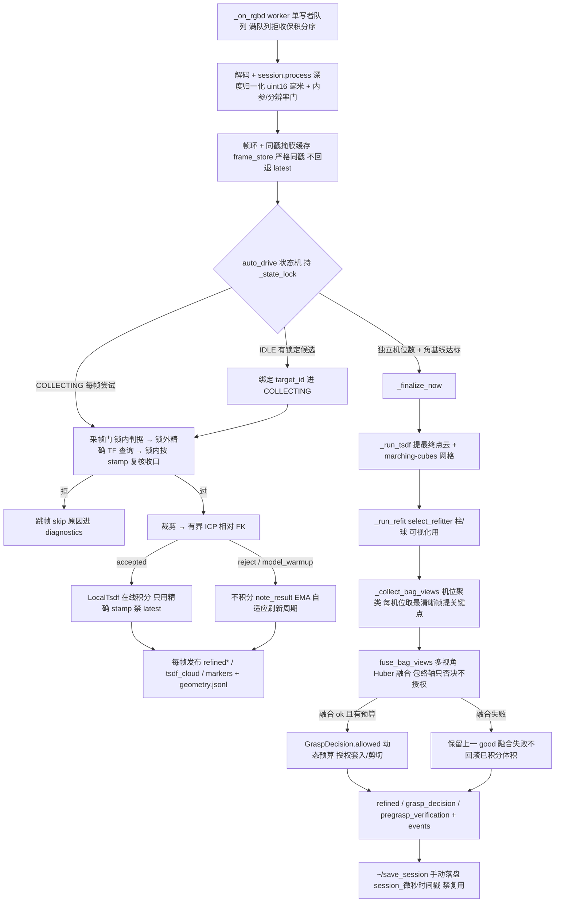
```mermaid
flowchart TD
  q["_on_rgbd worker 单写者队列 满队列拒收保积分序"] --> dec["解码 + session.process 深度归一化 uint16 毫米 + 内参/分辨率门"]
  dec --> ring["帧环 + 同戳掩膜缓存 frame_store 严格同戳 不回退 latest"]
  ring --> auto{"auto_drive 状态机 持 _state_lock"}
  auto -->|"IDLE 有锁定候选"| bind["绑定 target_id 进 COLLECTING"]
  auto -->|"COLLECTING 每帧尝试"| gate["采帧门 锁内判据 → 锁外精确 TF 查询 → 锁内按 stamp 复核收口"]
  gate -->|拒| skip["跳帧 skip 原因进 diagnostics"]
  gate -->|过| icp["裁剪 → 有界 ICP 相对 FK"]
  icp -->|"reject / model_warmup"| inc["不积分 note_result EMA 自适应刷新周期"]
  icp -->|accepted| tsdf["LocalTsdf 在线积分 只用精确 stamp 禁 latest"]
  tsdf --> live["每帧发布 refined* / tsdf_cloud / markers + geometry.jsonl"]
  inc --> live
  bind --> gate
  auto -->|"独立机位数 + 角基线达标"| fin["_finalize_now"]
  fin --> ts["_run_tsdf 提最终点云 + marching-cubes 网格"]
  ts --> rf["_run_refit select_refitter 柱/球 可视化用"]
  rf --> views["_collect_bag_views 机位聚类 每机位取最清晰帧提关键点"]
  views --> fuse["fuse_bag_views 多视角 Huber 融合 包络轴只否决不授权"]
  fuse -->|"融合 ok 且有预算"| gd["GraspDecision.allowed 动态预算 授权套入/剪切"]
  fuse -->|"融合失败"| keep["保留上一 good 融合失败不回滚已积分体积"]
  gd --> out["refined / grasp_decision / pregrasp_verification + events"]
  keep --> out
  out --> sess["~/save_session 手动落盘 session_微秒时间戳 禁复用"]
```

**读图（图 3c）：** 上半是「每一帧」：同步帧进单写者队列，过五道采帧门才动几何；ICP 拒帧不硬套，修正量 EMA 反过来拉长/缩短全量刷新周期。TSDF 只用精确 stamp（决策 0003）。下半是「收一颗」：机位与基线都够才 finalize——先提 TSDF 产物（可视化/占用，不授权），再柱/球 refit（仍只可视化），**接触权威只来自多视角关键点 Huber 融合 + 动态预算**；融合失败保留上一可用模型、绝不回滚已积分体积（否则 `tsdf_cloud` 变空、技能有效视点归零）。`pregrasp_verification` 是重建侧观测话题，技能 `VerifyPregrasp` 用工具 TF 残差自算。会话落盘由 `~/save_session` 显式触发。

---

### `peach_arm` — 机械臂执行

**作用：** 把「去拍照」「围着这一颗看」「按许可插入/撤退」做成动作服务端。规划与执行走 MoveIt / MTC；工具 IO 走柜侧 `SetIO`。不拥有批次、不拥有目标集合。

**含什么：** 单节点 `peach_arm`（Lifecycle；类声明 `manipulation_skills_node.hpp`，参数经 GPL 生成的 `arm_parameters.hpp` `ParamListener` 快照，`params_bridge.hpp` 的 `toMotionConfig` / `toGraspTaskConfig` 单点转换成 `GraspTaskConfig` / `MoveItMotionConfig` / `ScanBudgetConfig`——W5 起节点不再镜像 ~28 个参数成员）。周期状态全部入 `CycleContext`（`cycle_context.hpp`：action 受理时创建、worker 单写者、周期消亡即整体丢弃，`cycle_*` 成员已删）；动作受理/取消与授权矩阵在 `cycle.cpp`（`ExecutionAuthority`：TRANSIT/PREGRASP=Active∧robotReady∧!cancel∧execution_enabled，CONTACT 再加 grasp_enabled∧许可复检（批次4 档位门：令牌路径另查径向余量 >0，快照路径另查 sleeve 能力 VALID，unrefined 路径由袋径×D_inner 门兜），TOOL 再加 tool_enabled∧（令牌轴向余量 >0 或快照 cut 能力 VALID）∧预备位残差过门；终局分级（M3c，`stage_denial.hpp` `StageDenial`）：令牌/许可**过期**（valid_until/model_stamp 超窗，重建换新令牌即可重派）与 GraspDecision 复检不过→SKIPPED_QUALITY，其余拒因（权限/安全/取消/使能/许可明确不允许）→FAILED）；阶段执行器 `stages.cpp`（`executeCycle(ctx)` 显式模式 switch，序列与旧主树遍历严格同构）；接触在 `grasp_task.cpp`（帧超时/预抓取残差/角度几何/v4 三路点构造为 header-only 纯核：`frame_timeouts.hpp` / `pregrasp_residual.hpp` / `angles.hpp` / `grasp_geometry.hpp::stagingWaypoints`，ACM 豁免合一在 `acm_policy.hpp`；staging_selector 已删）；纯核 `quality_gate` / `safety_gate` / `view_planner` / `target_cache`（直接构造唯一实现，缝位 0）；扫描预算/阶段墙钟/回调计时在 `cycle_support.hpp`。健康双轨：`~/status` JSON（作业票）+ `diagnostic_updater` → `/diagnostics`（五任务 1Hz，见 io.md）。on_deactivate 收口四 worker 线程（worker/action/survey/move_to）2 s 有界（`pthread_timedjoin_np` 超时 detach + WARN，批次7——TEM 风暴等挂死不再卡 lifecycle 拆栈）。运行参数（部署事实源）`config/peach_arm.yaml`；声明/兜底默认/校验单源 GPL `src/arm_parameters.yaml`（清洁重写轮 2c 回迁，生成 `include/peach_arm/arm_parameters.hpp`）。

**线程与旗标纪律（2026-09-20 审查修复轮）：** ① 周期 worker / survey / move_to 三执行线程同 W13-B 纪律（M2）：`packaged_task` future 有界回收——旧线程 2s 内未退场则 WARN 后 detach 放行新动作（放弃回收≠放弃取消，线程仍受取消标志约束；本回调在默认互斥组，裸 join 卡死会吊死 ACK/取消/订阅）。② 取消旗标收口（M1）：三动作终局各自 `clearCancelFlagIfIdle`——周期 worker 已落终态（`running_=false`）才清全局取消旗标，一次单果取消/skip 后 sticky 旗标不再把后续 MoveTo/观察拒之门外（在途取消经 `requestCancelAll` 已即时停运动，清旗不复活任何被停的运动）。③ 计划绑定（G2，`plan_contract.hpp` `executePlanGate`）：绑定只由 PREVIEW 模式 goal 写入——OBSERVE_ONLY/执行类模式一律不写（观察是采数据不是计划预览）；FULL/PREGRASP_ONLY 周期终局清复位（防陈旧 preview 跨目标误拒），受理即拒（plan mismatch）不清。④ 受理期拒单（M3a）：plan mismatch 发生在 ctx 创建前，经 `pending_accept_failure_code_` 把 PLAN_MISMATCH(20) 带进 Result（纯核常量与 IDL static_assert 双向锁定）；`onStart` 的 recovery / 锚点失效拒绝落 RECOVERY_REQUIRED / OBSERVE_FAILED 码（M3b；MoveIt 未初始化/未 arm 三支无对应词表码，保持 0 由 reason 传达）。

**关停期取消防御（2026-09-30 整包首跑实锤，决策 0038）：** SIGINT 收栈时 signal_handler 已调 `rcl_shutdown`，`on_deactivate` 收口路径里 `requestCancelAll` 的 `move_group_->stop()` / `grasp_task_->cancel()` 内部经 rclcpp 异步口创建 guard condition，context 已 invalid 时抛 `RCLError` 直达 `std::terminate`（exit -6，三档 tool_profile_smoke 全挂）。现两调用包 try/catch：清理期失败仅 DEBUG 留痕（`cancel_requested_` 先置，实际停运动不受影响），**收口/清理路径的失败不得终止进程**。同族存量未修（挂账）：2s 有界 join 超时 detach 后，detached 线程在 rcl_shutdown 后世界继续跑/入口线程成员赋值竞态——e1 在「SIGINT 时有在途 ExecuteTarget」下仍 `terminate called without an active exception`（testing-log 09-30；AGENTS 审计 F3 同源），修复需重构线程入口赋值守卫。

**执行有界等待（2026-09-23 TEM stop 事件风暴防线）：** move_group TEM 异常（`transit_max` 触发的 stop 事件风暴，8.2 万行日志不停）会让同步 `execute` 永久阻塞且不理取消，一次即永久卡死动作通道（M1 tilt_1639_1 300 s hang 根因，见 testing-log 09-23）。新 GPL 参数 `moveit.execute_timeout_s`（默认 90 s，校验 >1；部署值 `config/peach_arm.yaml`）：`motion.cpp` 全部 execute 调用点（`planOrMoveTip` / `goToPhotoPose` / `reverseLastApproachToPhoto`）收口 `boundedExecute`——`std::async` 派发执行、等待环先到先收，取消探针命中（节点注入 `cancel_requested_`）或超时即 `move_group_->stop()`，10 s 宽限仍不返回则放弃等待（执行线程滞留一次，换通道可用）；新公有 `stopExecution()` = MGI::stop（打 move_group 节点级停止服务，与哪个接口实例发起执行无关）。MTC 侧 `Task::execute` 同样同步阻塞且不暴露 stop：`GraspTaskConfig` 增 `execution_stop`（节点注入 `motion_->stopExecution()`）与同参超时，`grasp_task.cpp` 以 async 执行先到先收，超时判失败（reason `MTC execution timeout (stop issued)`）。附带归因修复：`TargetCache::updateRefinedPose` / `updateRefinedFitting` 增 `reject_reason` 出参（`unrefined_hold` / `target_mismatch`），臂侧 `RCLCPP_WARN_THROTTLE` 10 s——unrefined_hold 是 skip_reconstruction 批的常态（latched 发布 0.5 s 心跳），原无节流 WARN 单轮刷 8 万行淹没真信号。**2026-09-24 起 TEM 直接关闭（决策 0029）**：`aubo_e5_moveit_config` 双 `controllers*.yaml` 声明 `trajectory_execution.execution_duration_monitoring: false`（UR Driver 主流做法：TEM 与透传/scaled 控制器打架）；`boundedExecute` 仍是超时防线，TEM 风暴根因另行跟（A-P3-1）。

### 技能包内部

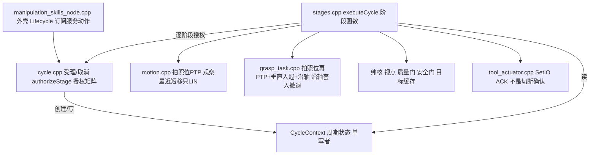
```mermaid
flowchart TB
  node["manipulation_skills_node.cpp 外壳 Lifecycle 订阅服务动作"]
  cycle["cycle.cpp 受理/取消 authorizeStage 授权矩阵"]
  ctx["CycleContext 周期状态 单写者"]
  stages["stages.cpp executeCycle 阶段函数"]
  motion["motion.cpp 拍照位PTP 观察最近短移只LIN"]
  mtc["grasp_task.cpp 拍照位再PTP+垂直入冠+沿轴 沿轴套入撤退"]
  core["纯核 视点 质量门 安全门 目标缓存"]
  tool["tool_actuator.cpp SetIO ACK 不是切断确认"]
  node --> cycle
  cycle -->|"创建/写"| ctx
  stages -->|"读"| ctx
  stages -->|"逐阶段授权"| cycle
  stages --> motion
  stages --> core
  stages --> mtc
  stages --> tool
```

**读图：** 一个 Lifecycle 节点拆成几份源文件，不是多个进程。外壳接 ROS；`cycle.cpp` 受理动作目标并实现授权矩阵（`cycle_support.hpp` 的 `MotionStage` 是其单一事实源）；`CycleContext` 承载一次周期的全部可变状态；真正「观察 / 预抓取 / 套入」是 `stages.cpp` 的阶段函数。观察移位走最近短步（只 LIN，失败换候选）；预抓取先回拍照位（有记录的「拍照位→预抓取」则原路返程，否则 PTP，时限 `photo_ptp_planning_time_s` 0.5 s，失败再 OMPL `photo_planning_time_s` 3.0 s），再走接近主路径：**PTP 关节空间到中段点正下方（树冠外，滚转梯子 {0,±30°,±60°}+随机重启 IK）+ 世界垂直 LIN 入冠（伸进果树里）+ 沿轴 LIN 对轴进入预抓取**（`approach_canopy_entry_m` 0.05 / `approach_final_axial_m` 0.05；不满足即失败收口带码，2026-09-23 定型 v4；冠内两段 LIN 优先 Pilz sequence blend(0.02) 速度连续，sequence 失败降级单任务 LIN（形状同、不平滑，v4d））；已在袋底侧且直连不穿囊的短修正（预抓取残差修正等）走直连 LIN 几何分档（已齐挂 tip 姿态 OrientationConstraint，容差 `mtc_approach_max_align_deg` 20°；未齐先 LIN 原地对齐再平移）。护栏拦绕腕、口侧穿囊（staging 首段 PTP 弧查圆柱穿越；其后 LIN 段另查反爬，锚定各段自身起点）。刀具 IO 只在阶段执行器里打，ACK 只表示柜侧收下命令。

**对外提供：**

| 入口 | 行为 |
|------|------|
| `SurveyScene` | `goToPhotoPose`（默认 SRDF `global_photo_pose`）：有「拍照位→预抓取」记录且当前关节在其终点则原路返程（不过 `transit_max_*`）；否则 PTP（`photo_ptp_planning_time_s` 0.5 s），失败回退 OMPL（`photo_planning_time_s` 3.0 s），超 `transit_max_*` 拒绝。成功出口 `atNamedTarget`（`execute=false` 仍核） |
| `ExecuteTarget` PREVIEW | 只规划不执行（MTC 凑 `mtc_max_solutions` 5 解） |
| `ExecuteTarget` OBSERVE_ONLY | 当前位采帧；基线未过最多两次最近短移（只 LIN，失败换候选），沿当前相机直线截到 `max_camera_step_m`（默认 0.15 m，~0.7 m 处一跨过 8°），评分以行程最短为主；朝检测框内分割更满的方向微偏。禁止对侧兜圈、OMPL、贴球面环绕、PTP 兜底。覆盖门 8°。**停准则：** 覆盖达标或 `maximum_moves` 用尽（Open3D TSDF / NBV：做完位姿序列，不用移动+等帧 EMA 预测收口）。到位后等**新机位**（`view_directions` 增加），同机位连帧不算覆盖 |
| `ExecuteTarget` PREGRASP_ONLY | 再确认 → 回拍照位（有记录的接近则原路返程，否则 PTP 0.5 s / 失败 OMPL 3.0 s；观察 look-at 直接规划常无 IK）→ 接近主路径：**PTP 关节空间到中段点正下方（树冠外，滚转梯子 {0,±30°,±60°}+随机重启 IK）+ 世界垂直 LIN 入冠（伸进果树里）+ 沿轴 LIN 对轴进入预抓取**（`staging.*` 参数族已删，2026-09-23 定型 v4；冠内双 LIN sequence blend(0.02)，v4d）（已齐 LIN 挂相对目标 20° 姿态约束）。执行路径 MTC `plan(1)`，不凑满 5 解。起点已在袋底侧、直连不穿囊时走直连 LIN 几何分档（非兜底链；未齐先 LIN 原地对齐工具 Z；滚转梯子换档）。不走 CIRC/STOMP/OMPL。失败 `skipped_unreachable`。拍照位失败则从当前位规划，仍失败再试拍照位 → 工具 TF 残差按最新精化快照重算 entry/pregrasp 增量修正（最多两次）→ 停在预抓取（`HoldPregrasp`，不回 `harvest_stow`）。残差未过门也停住，便于目视方向/定位。任何路径不 SetIO。不要求 `GraspDecision.allowed`。到位终局 `SUCCEEDED` + `recovery_required`（不是接触失败撤离）；ACK 前调度不 Survey / 不派下一颗 |
| `ExecuteTarget` FULL | `skip_observation`；再确认 → 预抓取验证 → `PlanSleeve`。**非 IMU 剪切手**（`shear_v1`/`bite_shear_v1`）：MTC 规划套入与反向撤退 → 沿轴一段 LIN 套入 → `ToolActuator` → `VerifyCut` → 原路 LIN 撤到预抓取 → **先倒放回拍照位再短 PTP `harvest_stow`**（stow 与 `global_photo_pose` 已分叉，直达会跳过原路返程撞 `transit_max`）。**自适应** `adaptive_shear_v1`：跳过 MTC 套入/撤退；VerifyPregrasp 后 imu_follow `enable`→`insert_start`→剪切→`insert_retract`→`disable`（回到预抓取才关窗；套入/撤退实测行程判据，批次5：FK 沿轴投影为主、`/imu_follow/insert_progress` 回退，时间仅截止，停滞窗 3 s 增益 <1 mm 收口 UNKNOWN），再同样经拍照位到 `harvest_stow`。禁止与 MTC 同时写控制器。切断**且**撤退确认才 `harvest.grasped`。`tool.enabled=true` 未确认终局 `FAILED`/`CUT_FEEDBACK_TIMEOUT`。`tool.enabled=false` 时跳过 SetIO，周期可 SUCCEEDED 但不宣称采摘成功 |
| `CheckReachability` | 选果预检：预抓取 IK；`require_sleeve`（FULL）再套入终点 IK **和**沿轴 `CartesianInterpolator`（步长/完成比与接触 LIN 同参，阈值 `mtc_cartesian_min_fraction` 0.95）。失败码 `no_ik` / `sleeve_no_ik` / `sleeve_no_cartesian`。不装配 MTC、不动臂。超臂展在 SELECT 跳过，不再派进接触再 Cartesian 0/1 |
| 预览/使能/ACK 服务 | `preview_*`、`set_execution_armed`、`acknowledge_recovery` |
| 诊断双轨 | `/diagnostics`（W5-10，diagnostic_updater 1Hz：观测流/TF 新鲜度、目标缓存 data_age、回调耗时 TopN（复用 CallbackTimingRegistry）、接触电流特征、使能心跳；`~/status` JSON 不动） |

**plan 契约与失败码（2026-09-20 E2E 审查修复轮）：** preview 绑定**只对 PREVIEW 模式 goal 生效**（受理分流）——OBSERVE_ONLY 是采数据不是计划预览、且模型建好前带不了三修订，旧实现把它记成 preview 是 conservative 档 FULL 必拒的根因；FULL/PREGRASP_ONLY 周期终局清绑定，受理即拒（plan mismatch → `failure_code=PLAN_MISMATCH(20)`，经 pending 受理失败码带入 Result）不清绑定以保留全字段约束。取消旗标 `cancel_requested_` 改为各动作终局 `!running_` 守卫下自动清（一次单果取消不再拖死后续 MoveTo/补视）；Survey/MoveTo/预览 worker 三处 join 统一为 2s 有界（packaged_task 模式，与 ExecuteTarget 同纪律）。授权拒绝分级抽纯核 `stage_denial`：**许可过期（valid_until 超时 / model_stamp 超窗）→ SKIPPED_QUALITY（可重派）**，许可明确不允许 → FAILED。

**订阅：** 感知观测；重建 `grasp_decision` / `refined_*` / `diagnostics`。`pregrasp_verification` 由重建发布作观测，技能 `VerifyPregrasp` 用工具 TF 残差，未订该话题。作业目标以 **goal.target_id** 为准。规划 tip 为 URDF `tcp`。工具标定帧 `wrist3_Link → tool_axis / sleeve_mouth / cutting_plane / tcp`（`aubo_description` 按 `tool_profile` 选档案，现行默认 `adaptive_shear_v1`：`calibration_status` shear/adaptive=`design_reference`、bite=`cad_reference_point`（总装测量核定，1aa50d0），TCP 姿态 Z=开口、XY=刀口；帧名三把共用冻结）。

**档位：** 默认 `execution.enabled` / `grasp.enabled` / `tool.enabled` 全 false。真运动须与调度 `execution_enabled` 同时开。`tool.enabled=false` 时 `ActuateCutter` 阶段跳过 SetIO。`GraspDecision.allowed=false` 禁止套入/剪切（TOOL/CONTACT 级授权前复检，目标 ID 须对齐）；`PREGRASP_ONLY` 有融合几何即可去预抓取。`quality.allow_unrefined_geometry`（默认 false；`skip_reconstruction:=true` 时打开）把锁定集场景观测提升为精化入口并钉住重建门与 `grasp_allowed`，同时拷贝 `bag_diameter_upper_m`（观测侧进 `CachedTarget`；无效 -1 时果实胶囊仍回退 0.12 m），忽略随后 IDLE 诊断和未融合 GraspDecision。实验室档（mock 臂 + 真相机、物理臂示教器停拍照位）：锁定/Reconfirm 只用对齐瞬间的 3D，mock 离位后接触走钉住几何；真机 KEEP `skip_reconstruction=false`。不放松 `min_views` / `max_target_drift_m`。接触失败后的 recovery 是撤离未确认；`PREGRASP_ONLY` 到位是 `SUCCEEDED` 带 recovery，须 ACK 后调度才 Survey / 派下一颗。

**禁止：** 写 `ledger.json`；当 `BeginScene` / `RunHarvest` / `BuildTargetModel` 客户端；调重建 Trigger；自己选下一颗。

**依赖驱动：** Active 的 `move_group`、透传控制器、`/aubo_io_controller/set_io` 与 `robot_status`。不直接写关节命令。`aubo_io_controller` 仅 real bringup 拉起；mock 无 `robot_status` 发布者。`execution.require_robot_status` 默认 true（真机 KEEP）；`harvest_system` mock 经 `peach_arm.launch` 置 false，否则 Survey `goToPhotoPose` 入口 `robot_status_missing` 立即 `survey_failed`。mock 运动走标准 JTC，不是透传。

---

### `peach_navigation` — 已归档（预留）

包体移至 `_archive/parked_2026-09/peach_navigation`，不在 colcon 构建、不进整栈 launch 与 lifecycle 名单。曾提供 `NavigateToWorksite` 缝与 `target_report` / `arm_status` / `vehicle_state` 适配话题（固定座 `reserved_stub` 合成静止 `VehicleState`）。现行只在 `peach_interfaces` 留痕：`NavigateToWorksite` / `HarvestTargetReport` / `HarvestOperationStatus` / `VehicleState` 四个 IDL 与 manifest `reserved_interfaces` 区保留标「预留」（56 active + 5 reserved——预留第五个为 `peach_sim/joint_states` gz 桥登记，非导航；清单脚本双向核对）；调度 `_cmd_navigate` 固定座直通 `NAV_OK`，不发动作、不等 `VehicleState`。真底盘须书面授权后从归档恢复并在**包内部**接发行版 Nav2——不加第五个 peach 包，本仓仍不写底盘/雷达驱动或 `cmd_vel`。

---

### `peach_harvester`（supervisor） — 整栈调度（调度 + lifecycle 同包）

**作用：** 批次的唯一所有者：显式开批、选下一颗、按 FSM 调四个能力入口、写账本、有序拉起/拆除生命周期。8090 实现与静态页在 `peach_observability`；参数 yaml 在 `config/observability.yaml`，节点 `ObservabilityParams.attach`。自己不算视觉、不算笛卡尔接触、不算 Nav2 规划。**进程形态（3b，`peach_harvester.brain`）：** vision 两节点与 supervisor 进同一 `MultiThreadedExecutor` 一进程三节点；进程内 `BeginScene` / `BuildTargetModel` / 观测不落 DDS，图名、话题、lifecycle 按节点名管理均不变；独立进程入口（`peach_executor.launch.py`）保留。

#### `peach_harvester`（supervisor）（批）

- **入口：** `~/run_harvest`、`~/control`（`ControlTask`，`expected_state_seq` 防乱序）。
- **发布：** `~/state`（`target_id` 是感知/重建的作业绑定）、`~/events`、`~/scene_snapshot`。
- **客户端（仅本节点）：** `BeginScene`、`SurveyScene`、`BuildTargetModel`（与 OBSERVE_ONLY 并行）、`ExecuteTarget`、`CheckReachability`。到位一步无动作：`_cmd_navigate` 固定座直通 `NAV_OK`（`NavigateToWorksite` 预留）。
- **选果：** `batch.py` 的 `next_target` 联合约束：goal 指定优先（显式指定不受窗限，但同样须过资格谓词：未确认/裸果/贴边/`tool_clearance_failed` 不可被点名，W6-B/S6），否则在已确认观测中按 **可达窗 ∩ 有效深度窗** 过滤（可达性权威是技能 `CheckReachability`（调度填感知入口 + `suggested_travel_m`；`require_sleeve` = 非 `execute_pregrasp_only`。服务端预抓取停位 IK：后撤 `mtc_approach_along_axis_m`（grasp_standoffs.yaml，现行 0.03 m）+ `alignFrameZ`（当前 TCP 滚转 + 工具 Z 对袋轴），不抄感知滚转；FULL 时再检套入终点 IK（入口沿袋轴 + clamp(travel, 0.02, 0.20) m，同姿态滚转扫描）**以及**从预抓取 IK 解沿轴笛卡尔（步长/完成比与接触 LIN 同参）。失败码 `no_ik` / `sleeve_no_ik` / `sleeve_no_cartesian`。不装配 MTC、不动臂。`setFromIK` 种子=当前关节，与 MTC 同一运动学。服务不可用回退 `selection_reach_min/max_m`（0.15/0.88；HOLD 用入口半径，FULL 另卡套入终点半径；成功 0.830–0.840 / 失败 ≥0.917）；`selection_depth_min/max_m` 默认 0.30/1.60 相机距离；超窗发 `targets_filtered` 事件留归因；次序=感知 priority 主序 + 同级**检测框面积降序**——近距双检先做大框，小框多为叶片遮挡残片/误检；裸果/`unbagged_display_only` 本轮不进执行候选。感知锁定集不代替本选择。
- **账本：** `batch.py` → `runs/<request_id>/ledger.json`（白名单落账：`failure_code` / `failure_code_n` / `completion_level` / 阶段耗时与 build 摘要；cut/retreat/harvest_confirmed 顶层镜像 W7 已删，证据单源 harvest/verification 块）；同 id 可续跑未入账目标（断点恢复 details 随账本回读，discovered 不可恢复维持 0 并在 `ledger_restored` 事件注明，W6-B/S7）。
- **FSM：** `harvest_fsm.react` 出 `Command`，节点做 ROS I/O。`execution_enabled=false` 或 `intent=SURVEY_ONLY` 则 Survey 后结算。默认 `execute_pregrasp_only=true`：FULL 槽改发 `PREGRASP_ONLY`（停预抓取，ACK 后再 Survey）。套入前改 false。臂侧 `pregraspOnlyFromGoal`：`mode=FULL` 不被默认 `profile=0` 盖成停预抓取；`PROFILE_FULL` 强制套入。运行期 `ros2 param set` 改 `execution_enabled` / `execute_pregrasp_only` 原地写入调度参数树（下次开批与 `HarvestState` 发布读到新值），不改 yaml 默认。`require_managed_stack`（整栈 launch 为 true）未收到 lifecycle 旗标则拒绝开批。DISPATCH：`BuildTargetModel` 须在 `build_start_timeout_s`（默认 2 s）内反馈 COLLECTING/READY；超时则取消并**等该动作结束**再派下一颗（重建单槽，未结束会拒下一颗 Build）。批次6 `reconstruct_in_trajectory`（默认关）：true 时 Build 进 COLLECTING 后不再阻塞 `_wait_build_after_observe` 等待段，立即派 FULL（goal 自带 `skip_observation=true`）——重建与接近并行；臂侧 FinalizeAndValidate 有界等精化兜底，周期收口取消并等 Build 结束（单槽约束保持）。`skip_reconstruction`（默认 false；`harvest_system skip_reconstruction:=true` 同时打开技能 `quality.allow_unrefined_geometry`）时 DISPATCH **不发** Build/补视，用锁定集场景观测当接触入口（身份 revision=`unrefined:*`；FULL 不装重建 GraspDecision 令牌）。brain 把该 launch 参数写成 `peach_supervisor` 键 ParameterFile overlay（unnamed `Node` 上嵌套 dict 打不进进程内节点）。验证路径：mock 臂 + 真相机不跟随、无法凑第二机位时走接触；真机 KEEP false。不放松 `min_views` / `max_target_drift_m`。
- **禁止：** launch 自动 `RunHarvest`；监控代发运动；直接调 MoveIt / Nav2。

#### `peach_lifecycle_manager`（管）

- **名单（部署值 `config/lifecycle_manager.yaml`）：** 场景感知 → 重建 → 技能 → 调度。observability **不进名单**。节点 `peach_lifecycle_manager.attach` 按 yaml 声明叶子。
- **入口：** `~/manage_nodes`。STARTUP 先 configure 再 activate；拆除逆序。发闩锁 `/peach/lifecycle/managed_nodes_activated`。**整栈由 `nav2_lifecycle_manager` 承载**（节点名同为 `peach_lifecycle_manager`，`bond_timeout` 为 launch 参数默认 0，名单硬编码在整栈 launch；四托管节点已接 `/bond` 心跳——`peach_arm`（bondcpp）生效、Python 三节点待 apt `ros-jazzy-bondpy` 后生效；闩锁由 `peach_lifecycle_flag_bridge` 发出）；本节点保留独立 launch（`peach_harvester/launch/lifecycle_manager.launch.py`）。
- **禁止：** 发 `RunHarvest`。PAUSE 是节点 Inactive，不是批次 `ControlTask` 暂停。

#### `peach_observability`（监）

- **作用：** HTTP（默认 `127.0.0.1:8090`）过程页：只读监控（订阅各包状态与原始话题）+ 会话 bag 过程记录（决策 0019：随节点启停开合 `runs/session_*/bag`，栈停自动出 `bag_report.md/json` 并按 `record.max_total_bag_gb` 预算回收旧 bag）+ 柜侧硬件表（TCP xyz/rpy、六轴角/速度/电流/温度）+ 末端主平面轨迹（按点列跨度最大的两轴投影，不固定 X–Y 俯视）+ 单步调试 POST（决策 0018，无令牌）。整栈 include 时 **不进 lifecycle 名单**，节点 `main()` 在 spin 前自行 `configure/activate`。作业票下方对照实测 TCP、起止弦与预抓取/入口。
- **类 / 配置：** `ObservabilityNode`、`ObservabilityState`；参数 `config/observability.yaml`。静态页在包内 `web/`，Tab 分「过程 / 调试」。首屏是当前果实作业票（发现→拍照→锁定→观察→许可→靠近→工具→撤离→完成）。抓取档关闭时靠近/工具标 **gated**，不得显示成已勾上。健康走 `/diagnostics` 双轨（W15：5s 周期两任务——`session_recorder` 报队列水位/丢帧/目录，`ingest_liveness` 报镜像键最热年龄 ≤10s OK / ≤60s WARN / 更久 STALE；对齐 peach_arm W5 与 vegetation 的做法）。
- **`/api/state` 区段：** `perception` / `reconstruction` / `refined` / `manipulation`（含 `status` 与 `hypothesis`）/ `task_executor` / `robot`（柜侧 `status` + latest TF `tcp` 摘要：xyz/quat/路径长/弦长/绕行比/Δz + `joints` 六轴角/速度/电流/温度/跟随误差）/ `metrics` / `record` / `params` / **`job`**（派生作业票：过程线、档位、`why`、base_link 坐标含预抓取）/ **`debug`**（`enabled` / `motion_enabled` + 最近操作环形缓冲）。不再用 `approach` / `orchestration`。
- **`/api/trajectory`：** 末端点列（平坦 `xyz` + 相位）+ 作业票路标 + 与 RViz 同源的 Marker 字典。只读，不进 MCAP。
- **调试 POST：** `POST /api/debug/<action>`。`debug.enabled` 默认 true（false→503）；无令牌。运动类另需 `debug.motion_enabled`（默认 false→423）。审计落 `runs/debug_audit/<日期>.jsonl`。后端仍转发全部既有端点（`debug.endpoints.*` 键冻结）；**页面只暴露本管线**：BeginScene / SurveyScene / Build / finalize / ExecuteTarget / 去拍照位 / RunHarvest / CANCEL_NOW。`PREVIEW` 与 BeginScene 不受运动门拦。技能 `ExecutionAuthority` 与调度/重建门**原样生效**。
- **过程记录（bag）：** 固定订阅集（events/state/scene_snapshot/感知重建许可/技能/`/tf`+`/tf_static`/关节量/robot_status/job/metrics/图像点云；2026-09-20 起 `record.bag_topics` 键已删；其中 `scene_snapshot` 落盘订阅 transient_local——M13：单发闩锁话题，VOLATILE 会在记录节点晚于发布启动时永久丢快照），`std`/`all` 档另加通配发现订阅域内其余话题（`record.level` 门控）。2026-09-24 起进袋统一限速（决策 0031，只限进袋不影响实时流）：控制流族（`/joint_states`、`/tf`、`/diagnostics`、`/dynamic_joint_states` 及含 `introspection`/`joint_status`/`io_states`/`statistics`/`controller_state` 子串的话题）20 Hz；PlanningScene 族（`/moveit_servo/publish_planning_scene`、`/monitored_planning_scene`）1 Hz；感知派生族（含 `debug_image`/`masks`/`target_observations` 子串）2 Hz；各族首帧必录，`/tf_static` 豁免。写队列有界（`record.queue_depth` 默认 512，盘速掉队丢最旧保最新并计数进 `record.info.drops`）；体积回收在 configure 期后台线程执行（rglob 大库不阻塞生命周期）。原始消息进 MCAP，不做镜像去重；作业票与性能采样经 `/peach/observability/job`、`/peach/observability/metrics`（String JSON）发布后入 bag（作业票按快照代数缓存，Web 轮询与 RViz/HTTP 轨迹共享一次构建）。停栈关 bag 后自动生成 `bag_report.md/json`（`peach_observability/bag_report.py` 纯核 + `bag_reader.py` 读取，kill -9 留下的 bag 自动 reindex 兜底；G4 2026-09-20：写盘原子 tmp+rename、进程 SIGTERM 窗放宽 60s 对齐 join_report(55s)——超窗最坏无新报告可 CLI 复跑，不再出半份）；手动复跑 `ros2 run peach_observability peach_bag_report <bag>`。报告离线重算：诊断合并体照镜像逻辑重放、TCP 轨迹由 TF 树合成（3mm 门槛）、验收门三行沿用旧 summary 口径。体积超预算停栈后自动删最旧 `session_*/bag` 与旧 `mcap_*`（总结/账本/文本永不删），审计在 `runs/retention_audit.jsonl`。`runs/run_*` 9 路 jsonl 是 2026-09-15 前旧格式，历史数据不迁移。`debug_audit/` 照旧。
- **开关：** `config/observability.yaml` 的 `record.enabled`（默认 true）。`trajectory.enabled` 默认开：20 Hz latest TF `base_link←tcp`（Web/RViz 用；bag 侧由 `/tf` 离线重算）。另订 `/joint_states` 与 `/aubo_io_controller/joint_status` 进 `robot.joints`（镜像只在 Web；原始话题随 bag 录制，电流为 SDK 原单位）。订阅 `/peach/manipulation/grasp_hypothesis`。发 `/peach/observability/tcp_path`（Path）与 `/peach/observability/markers`（MarkerArray）。

#### `peach_vegetation`（枝叶，影子）

- **作用：** GPU 枝/叶二维分割。发布 `/peach/vegetation/leaf_mask`、`branch_mask`、`overlay`、`status`。**不写 PlanningScene、不删 octomap、不发运动。** 独立 `ros2 launch peach_vegetation vegetation.launch.py`，不进 lifecycle 名单、不随 `harvest_system` 起（与 YOLO/MobileSAM 分进程同卡，避免对打）。
- **算法：** 直接构造 `FrangiExgSplitter`（torch Hessian Frangi + Excess Green/HSV）。无卡 `device:=auto` 回退 CPU。后续 DeepLab 木类可换同一 `split()` 面，不要先扩 yaml `*.impl` 注册表。
- **参数：** 部署值 `config/vegetation.yaml`；`peach_vegetation.attach(node)` 按 yaml 声明叶子。话题名不进参数：输入相对名 `image` + launch remap。
- **健康：** `diagnostic_updater` → `/diagnostics`（延迟、丢帧、设备）。

**整栈入口：** `peach_bringup/launch/harvest_system.launch.py` 先预检拒旧实例（匹配名单按**可执行名/argv**：含 brain 进程 exec 名 `peach_harvester`——G5 2026-09-20：brain 一进程三节点 launch 不传 name= 重映射，节点名不进 argv，只按节点名查会漏残留旧脑致双 supervisor 静默共存；另含 `peach_lifecycle_flag_bridge` / `peach_autostart_client` / `stereo_camera_node` / `peach_scene_obstacles` / `imu_follow_node` / `servo_node` / 可执行名 `lifecycle_manager` / `rviz2`），再按序 include `peach_stereo`（仅 `camera_enabled:=true` ∧ `camera_frontend:=stereo`）→ `peach_scene_obstacles`（仅 `camera_enabled:=true`，独立进程、不进 lifecycle，须在 aubo include 之前）→ 只读 `aubo_e5_bringup`（stereo 前端时压掉 percipio 相机）→ `serial_imu`（`imu_enabled` 默认 true）→ **`imu_follow_servo`（仅 `tool_profile:=adaptive_shear_v1`，`motion.enabled=false`）** → `peach_harvester` `brain.launch.py`（感知+重建+调度一进程三节点，`require_managed_stack:=true`）→ 技能 → observability → `nav2_lifecycle_manager`（节点名 `peach_lifecycle_manager`，先 configure 再 activate）→ `peach_lifecycle_flag_bridge`（is_active → 闩锁 `managed_nodes_activated`）→ `peach_autostart_client`（`autostart:=true` 才起；不 include 导航；IMU 不进 lifecycle；**不含** vegetation）。`peach_harvester` 同名 launch 薄转发到 bringup。默认 `hardware_mode:=mock`、`camera_enabled:=false`、`camera_frontend:=stereo`（0036 用户裁定；percipio 显式传参）、`imu_enabled:=true`、`use_sim_time:=false`（bag 回放才 `true`）、`tool_profile:=adaptive_shear_v1`（透传 bringup 与各能力 launch，URDF/许可内径/标签统一随档案）；调度 `execution_enabled=false`（节点参数，非 launch 参数）。

---

### 包内节点

各节点入口→处理→输出流程图：[io.md](io.md) §3–§5。

| 角色 | 节点 | 所在包 | 入口 | 禁止 |
|------|------|--------|------|------|
| 看 | `peach_scene_perception_node` | `peach_harvester`（vision） | `BeginScene`；发 `/peach/perception/*` | 不重建、不运动、不选下一颗 |
| 建 | `peach_target_reconstruction_node` | `peach_harvester`（vision） | `BuildTargetModel`；发 `/peach/reconstruction/*` | 不检测、不写 `ledger.json`、latest TF 积分 |
| 动 | `peach_arm` | `peach_arm` | `SurveyScene`、`ExecuteTarget` | 不写 `ledger.json`、不调重建 Trigger |
| 批 | `peach_harvester`（supervisor） | `peach_harvester`（supervisor） | `RunHarvest`、`ControlTask` | 不做视觉、不直接规划接触/导航 |
| 管 | `peach_lifecycle_manager` | `peach_harvester`（supervisor） | `ManageLifecycleNodes` | 不发 `RunHarvest`；observability 不进名单 |
| 监 | `peach_observability` | `peach_observability` | HTTP / JSONL；调试 POST 转发既有入口 | 不旁路 ExecutionAuthority；动臂须 `motion_enabled` |
| 枝叶 | `peach_vegetation` | `peach_vegetation` | 彩色图 → 叶/枝掩膜 | 不写 PlanningScene、不进 harvest_system |

---

### 驱动层九包

给采摘核提供手臂、相机、TF、规划组。**只读红线**（AGENTS）：`aubo_e5_hardware`、`aubo_e5_controllers`、`aubo_dashboard`、`aubo_e5.ros2_control.xacro`、`bringup.launch.py`、对应 `controllers.yaml`。未授权不得真机运动或 SetIO。

#### `aubo_msgs`

柜侧接口，不是采摘业务类型。`RobotStatus` / `SetIO` / `GetFK` / `GetIK` / `SetPayload` / 手眼标定动作。技能读 `RobotStatus` 做安全门，工具闭合调 `/aubo_io_controller/set_io`。采摘 IDL 在 `peach_interfaces`。

#### `aubo_description`

工作单元 URDF。`aubo_e5.urdf.xacro` 拼臂本体、桌、腕上相机体、快换、末端工具（`wrist3_Link→tool_axis / sleeve_mouth / cutting_plane / tcp`，帧名三把工具共用冻结——SRDF/ACM/技能三点 TF 验证按名消费）。**三把剪切手档案**（xacro `tool_profile` arg，默认 `adaptive_shear_v1`；三个独立 `<xacro:if>`，未知名三支都不展开→缺 `tcp` 帧启动即失败）：
- `shear_v1`（剪切手，桃子采摘手-相机位置试验版本）：连杆切刀在法兰 +Y 侧，开口 +Y（Rx(−90°)），TCP `(0, 47.90, 151.07) mm`——传承旧 hollow_cylinder_v1 设计基准（git 历史核定，2026-09-28 用户裁定），wrapper `components/tcp_shear_v1.xacro`，档案 `config/shear_v1.yaml`（D_inner 0.080）。
- `bite_shear_v1`（咬合式剪切手）：双刀口对夹+喉道导轨，开口 +Y（Rx(−90°)，果侧进枝），TCP `(0, 30.24, 165.5) mm`（总装系测量核定：ΔY 30.24/ΔZ 165.5/距离 168.24 自洽），`sleeve_mouth`=identity（进枝口即 TCP，1aa50d0 勘正；旧 +Z 0.223 喉道口径已弃），档案 `config/bite_shear_v1.yaml`（D_inner 0.030、L_insert 0.030、body 包络 0.260×0.090）。
- `adaptive_shear_v1`（自适应剪切手+增量 IMU，默认）：Ø136 圆盘+拉钩组+MPU6050，开口 +Y（与旧圆柱同向），TCP `(0, 47, 168.66) mm`——与旧 adaptive_cylinder_v1 设计基准完全一致（总装系测量核定：中心距 175.09 自洽；曾做 +8mm 装配差修正，2026-09-28 复审裁定撤销，总装快照即设计位），标定链几何零漂移，档案 `config/adaptive_shear_v1.yaml`（D_inner 0.120、L_insert 0.090）。

姿态语义三把同款：**TCP Z=开口、XY=刀口平面**；`cutting_plane` / `tcp` 与 `tool_axis` 同点（刀口深登记 `geometry_m.L_blade`）；`tool_body_link` 挂 `wrist3_Link`（identity），visual/collision 用真实 CAD 网格 `meshes/{visual,collision}/tools/<profile>.stl`（法兰系建模：CAD 总装全局原点=wrist3_Link 原点，已 link6 Ø75 法兰 + STW 快换盘 + 相机族三方数值叠对与渲染叠图双重验证）；规划 tip 仍名 `tcp`。`robot_state_publisher` 发 TF。权威关节顺序六轴。**档案 yaml 是整栈单一事实源**：`peach_harvester.vision.tool_profiles` launch 期装载注入感知 `tool.D_inner`/`tool.L_insert`/`tool.L_blade`（径向走廊门+行程/刀口轴向，2026-09-29 扩）、重建 `tool.budget.d_inner`（GraspDecision 许可数学）、各包 `tool.profile_id` 标签与 `peach_arm` `tool.d_inner_m`/`tool.body_length_m`/`tool.body_radius_m`（①层胶囊审查包络，2026-09-28 扩注入面）；`bringup`（RSP）与 `moveit.launch.py`/技能/`imu_follow_servo`（MoveItConfigsBuilder mappings）双展开必须同 arg，防 move_group 模型与 TF 分叉。改末端几何改 wrapper xacro 与档案 yaml 两处；**不要**改只读的 `aubo_e5.ros2_control.xacro`。共享底座 `components/tcp.xacro`（`aubo_e5_tcp` macro 持帧链与网格体）。STEP→网格可复现管线入库 `aubo_description/scripts/`（FreeCAD snap 无头提取 + Blender 4.5 无头减面/渲染验收，决策 0033）。

#### `aubo_e5_hardware`

ros2_control `AuboE5Hardware`：旧 SDK + TCP2CAN。轨迹经透传 GPIO 进 `write()`，本包不做规划。停轨：透传 abort → 清队列 → `ioLoop` `RobotMoveStop`。

#### `aubo_e5_controllers`

`AuboPassthroughTrajectoryController`（real 整条轨迹透传）；`AuboIOController`（板/工具 IO、`RobotStatus`、`~/set_io`）。mock 用标准 `joint_trajectory_controller`。技能/调度不直接写关节。

#### `aubo_dashboard`

上电、抱闸、FK/IK、负载等慢操作。**bringup 不起本节点；作业禁止调用。** 柜侧用示教器；规划用 MoveIt；停轨不经本包。`auto_power_on=false`。

#### `aubo_e5_bringup`

手臂工作单元唯一 launch：`bringup.launch.py`（只读）。`hardware_mode:=mock|real` 换插件与轨迹控制器。可选 include 相机、`extrinsics_publisher`、MoveIt。采摘整栈 include 本文件，不要另起第二套 bringup。

#### `aubo_e5_moveit_config`

规划组 `manipulator_e5`（`base_link`→`tcp`）、IK、OMPL/Pilz、与透传对齐的控制器映射。move_group 默认管线 **pilz**（v4d：Pilz sequence item 不读 pipeline_id，默认 OMPL 会把冠内混合 sequence 整条拒）。SRDF `group_state`：`home`、`camera_pose`、`global_photo_pose`（技能默认拍照目标）。手眼 yaml 不在本包。

launch 参数装载走官方 `moveit_configs_utils.MoveItConfigsBuilder`（与 MoveIt2 官方生成的 move_group launch 同链）；包内 `.setup_assistant` 提供 URDF/SRDF 定位元数据（同 setup assistant 格式，`install(FILES .setup_assistant)`）。`ompl_planning.yaml` 按官方布局收拢管线级字段（`planning_plugins` / `request_adapters` / `response_adapters` / `start_state_max_bounds_error` / `totg.resample_dt`）。`pilz_cartesian_limits.yaml` 随 builder 并入 `robot_description_planning`，数值与 `joint_limits.yaml` 的 `cartesian_limits` 一致（现场保守档：`max_trans_vel 0.25 m/s`、`max_trans_acc 0.5`、`max_rot_vel 0.5 rad/s`）——Pilz 笛卡尔段（LIN/CIRC）受该限速约束，PTP 关节空间不受影响。控制器映射 yaml 为官方 `moveit_simple_controller_manager` 布局（`controllers.yaml` / `controllers_mock.yaml`）。技能 launch 用同一 Builder 只注入模型/管线，不注入控制器映射。

#### `aubo_hand_eye_calibration`

`extrinsics_publisher` 读 `src/aubo_hand_eye_calibration/hand_eye/active.yaml`（入库随仓）发 `wrist3_Link→camera_link`。找不到该文件则名义平移 2 cm、单位四元数（点云会相对臂偏约 10 cm 且轴向不对）；外参来源经 `diagnostic_updater` 上 `/diagnostics`（`extrinsics_source` 任务，2026-09-29 起：active=OK、无文件回退名义=WARN、active 损坏/帧名不匹配=ERROR），标定 Web 台诊断卡可见。重建积分依赖这条链的精确 stamp。日常采摘不自动跑标定流程；内参/外参重标定工具（vendored `camera_calibration`、`apply_intrinsics`）均为会话工具，不进常驻栈，流程见 testing.md 标定节。标定 Web 台（`web_gateway`，仅回环 :8088）自 2026-09-29 起 `/api/plan`、`/api/run` 接受 `pose_source`/`solve_target` 档位（auto 视点档与 joint 联合档不再只能 CLI）。

#### `percipio_camera`

图漾驱动（厂商代码）。采摘订彩色/深度/`camera_info`；深度须与彩图配准。感知 `depth_scale_unit=0.25`（raw×0.25=毫米）。launch 请求 `frame_rate:=2.5`（09-16 实测 5.0 不可达且无加速作用），现场约 2.4–2.5 FPS；未授权不改帧率。

#### `serial_imu`

USB 串口 IMU（QinHeng USB 转串适配器：CH340 `1a86:7523`（旧，ttyUSB）或 CH343 `1a86:55d3`（现行，ttyACM，带序列号））。udev `/dev/imu`（两种芯片各一条规则，规则文件在包 `udev/`；装系统后插拔都要出 `/dev/imu`）。话题名沿用 imu_tools：`/imu/data`、`data_raw`、`mag`、`temp`（Reliable+Volatile）。两路由 `frame.py` 分清：`data_raw` 是模组体轴协议原样；`data` 是静态坐标系修正（`frame_rpy_deg` 默认 Rx(180°)，静止比力 +Z）再乘可选 `align_to_parent`。姿态不写进 `imu_link`（只发静态 `parent→imu_link`）。无磁融合，上电 yaw 任意；叠到臂 TCP 时 `align_to_parent` 把当前 IMU↔parent 差当误差清掉（`imu/align_to_parent`，启动默认可自动采），不要把该残差写进 `frame_rpy_deg`。协方差按 `sensor_msgs/Imu`：未提供的字段 `covariance[0]=-1`，未知方差全 0。模组陀螺字段不出数（恒 0，2026-09-09 实测），默认 `gyro_available: false`，姿态唯一来源是融合四元数。`diagnostic_updater` 发 `/diagnostics`（串口开闭 + `imu/data` 帧率）。随 `harvest_system` 起（mock/real 相同，`imu_enabled` 默认 true：`use_rviz:=false`、`tf_parent_frame:=tcp`、`align_to_parent:=true`），不进 lifecycle、不进只读 `bringup.launch.py`。整栈画面在 `aubo_e5_moveit_config/rviz/moveit.rviz` 的 **Imu** 显示（订 `/imu/data`），不是 IMU 自己的 RViz。不做自适应工具偏移；臂侧 `frames.tool` 默认 `tcp`（`tcp_actual` 缝预留、未实现）。**现场手册：** [`src/serial_imu/README.md`](../src/serial_imu/README.md)。

#### `imu_follow`

可选 IMU 姿态跟随工具包（Python；不进 lifecycle、不改只读 bringup、不订 peach 话题）。`harvest_system` **仅** `tool_profile:=adaptive_shear_v1` 时 Include `imu_follow_servo.launch.py`（含 `moveit_servo`）；其余末端不起本节点（进程隔离）。`~/enable` 采两组参考（TF `base_link→tcp` 当前位姿 + 当前 `/imu/data` 四元数），此后每节拍（`rate.update_hz` 默认 20 Hz）把 IMU 体轴姿态增量经死区/符号映射/锥限幅/平滑叠加到参考 TCP 姿态（位置钉死参考点，只跟姿态；插入/回退时位置沿锁定开口移动）。后端双轨（`motion.backend`）：**servo 默认**——节点对当前 TF 闭环，姿态/位置误差 P 控制成 `TwistStamped`（tcp 系 speed_units）发 moveit_servo（Jazzy apt `ros-jazzy-moveit-servo`）的 `/moveit_servo/delta_twist_cmds`（BEST_EFFORT；enable 自动 `switch_command_type(TWIST)` + 确保未暂停），Servo 100 Hz 增量 IK 流式输出 JTC 话题；**未 enable 时 pause servo**，避免与 peach Survey/MovePregrasp 的 MTC 同时写控制器。**fjt 备选**（真机透传）——`/compute_ik` 解关节、单步钳制后流式 FollowJointTrajectory。`motion.enabled` 默认 false：只发布 `~/target_pose`、`~/command_twist`，不发运动；**peach 不自动开门**；真机须另行人工授权。自动 disable：IMU / 关节状态断流、连续 IK 失败（fjt）；servo 补零速刹车并 pause、fjt 取消在途 goal。**插入/回退**（决策 0026）：`~/insert_start` 锁当前工具开口（tip +Z，base 系）按 `insert.speed_m_s`（0.01）推进、钳 `insert.max_travel_m`（0.09）；`~/insert_stop` 停推进；`~/insert_retract` 沿锁定方向把行程收回参考点。peach `ExecuteTarget` FULL 在自适应档案上于 VerifyPregrasp 之后 `enable` → `insert_start` → 剪切 → `insert_retract` → `disable`，再 MTC 回 `harvest_stow`；非 IMU 末端仍走 MTC LIN，永不调、不建这些服务客户端。PREGRASP_ONLY 不开窗。mock 冷启动关节全零参考 IK 无解（-31），先导 `global_photo_pose`。姿态/行程数学纯核 `follow_core.py`；参数走手写 `params.py` + `config/imu_follow.yaml`。**手册：** [`src/imu_follow/README.md`](../src/imu_follow/README.md)。

### 旁路视觉抓取（三包，非采摘）

从旧仓移植后按本区裁过：**不进** `harvest_system.launch.py`、**不进** lifecycle 名单、**不订** `peach_interfaces`、不改驱动栈。共用 L0 相机 / TF / MoveIt。2026-09-29 前沿化重构轮后为**分段流水线 + 可换后端**架构：

- **估姿**（`ivg_pose_estimation`）：`pipeline/` 分段门面（Segmenter→Matcher→pose 求解，段段可换）。分割档 `depth_band`（默认）/`rembg_u2net`/`mobile_sam`（MobileSAM 点提示，39M 轻量）；匹配档 `geometric`（默认，距离/IoU 两模式）/`dinov2_template`（DINOv2 嵌入检索，FoundPose/CNOS 范式，索引落盘）。配置单源 `config/pose_estimation.yaml`（含 `camera.depth_scale`、`calibration.translation_unit`）；`EstimatePose` 带 Header（stamp=图像采集时刻，TF 同 stamp 查询）。Web 默认 `:8089`（与手眼标定网关错开），写端点（`/exit`/模板保存/标准化/调试参数写盘）需 `vpe_auth` SameSite=Strict cookie 或 `X-Auth-Token`（token 见启动日志，`VPE_WEB_TOKEN` 可固定）；CORS 通配已移除。运动/IO HTTP 仍 501。
- **抓取**（`ivg_graspnet`）：`backends/` 注册表双后端——`graspnet_torch`（默认，vendored GraspNet-baseline 纯 torch，**不用 AnyGrasp** 许可证）+ `contact_graspnet`（vendored contact_graspnet_pytorch，NVIDIA 非商用系许可，内部研究用；`approach_flip_z180=false` 待真机方向核验）。耦合超参随权重走（`checkpoint-rs.yaml` manifest）；碰撞/NMS/topK 在 `postprocess.py`（模型无关，重构前后行为等价由 golden 测试守卫）；`InferenceSession` 统一 device/fp16。MoveIt 超时发 `cancel_goal_async`；`publish_grasps_client` 有 opt-in 使能门 `require_enable`（默认 false 保持旧流程）与 `apply_grasp_z_flip`（对齐后端 `approach_flip_z180`）。真机运动只走 harvest 调试操作面或 GraspNet 的 MoveIt 客户端（须另授权）。
- 旋转/四元数数学统一 `scipy.spatial.transform.Rotation`（2026-09-17 删 `ivg_utils`）。评估基线 `campaign/20260929_ivg_refactor/report.md`（dinov2 检索 14/14；分割学习档棚拍口径未达标 → 默认档不切换，待现场快照轮）。
- **抓取验证仿真**（2026-09-29 新增 `ivg_sim`，独立包不改 ivg_* 源码）：Gazebo Harmonic 桌面场景（10 YCB + tilt 可调 rgbd；布局单源 `config/table_layout.yaml` → `generate_table_world` 产世界 + GT manifest，零重力冻结摆位）；gz 点云经参数桥 + `cloud_relay`（帧重写 `camera_depth_optical_frame`，轴系=传感器体系 spike 实测）喂检测节点（venv 链 `python3 -m` 直跑）；`score_grasps` 对 GT 评覆盖率（门=默认后端实测基线 40%；tilt 35° 命中垂直度 0.85+）。YCB meshes 不入库（`models/fetch_ycb.sh` 恢复）；不进 harvest_system/lifecycle；机械臂仿真执行闭环留后续轮。

| 包 | 节点 / 入口 | 作用 | 不做什么 |
|----|-------------|------|----------|
| `ivg_interfaces` | 无 | 旁路 IDL（`EstimatePose*`（带 Header）、`ListTemplates`、`StandardizeTemplate`、`UpdateParams`） | 不进 peach 清单；不含机械臂/IO/软触发服务 |
| `ivg_pose_estimation` | `ivg_pose_estimation`、Web `:8089` | 模板匹配 6D 估姿（分段流水线）；T_B_C 按 stamp 查 TF | 不发运动/IO、不写账本 |
| `ivg_graspnet` | `graspnet_demo_points_node`、`publish_grasps_client` | 点云→抓取位姿→MoveIt 接近（双后端可换） | 不拉相机/手眼；不走 ExecutionAuthority；真机须另授权 |

接口见 [io.md](io.md) §8。包 README：[`src/ivg_pose_estimation/README.md`](../src/ivg_pose_estimation/README.md)、[`src/ivg_graspnet/README.md`](../src/ivg_graspnet/README.md)。

### 从哪读源码

整栈 launch 入口是 `peach_bringup`（`peach_harvester`（supervisor） 同名 launch 薄转发）。读源码从调度纯核开始。

| 先看 | 文件 | 读什么 |
|------|------|--------|
| 批次纯核 | `harvest_fsm.py` | `react(batch_state, event) → Reaction`。禁止在节点里手写 `batch_state` |
| 批次执行 | `executor_node.py`（`TaskExecutorNode`） | 翻译 ROS→Event 后 `react`；发动作。补采类别 `cycle_core.batch_policy.rework_kind` |
| 账本 / 选果 | `batch.py` | `next_target`；`apply_control`；`runs/<request_id>/ledger.json` |
| fast 档观察 | `supervisor/observe.py` | 视点信号/锚点/相机位解析 + 补视循环（零 ROS；W6-A 自 executor 下沉） |
| 生命周期 | `lifecycle_manager.py`（`LifecycleManagerNode`） | 感知 → 重建 → 技能 → 调度；观测节点不进名单 |
| 只读监控 | `peach_observability/observability_node.py` | HTTP `:8090` 接线；纯核 `pipeline.py`（阶段时间线 / 账本直播 / 地标合并） |
| IDL | `peach_interfaces/action|srv|msg` | 改接口只改这里 |
| 感知外壳 | `scene_perception_node.py`（`ScenePerceptionNode`） | `_on_rgbd` → decode → `pipeline.process` → publish |
| 感知纯核 | `scene_perception/{pipeline,plan_updater,stream_metrics,identity,image_gates,pose_pipelines,inference}.py` | `from_params`+`process`；帧级计划/身份/光照推进（W3 下沉，节点持 plan_lock 调用）；流观测 EMA/超时；χ²+匈牙利分配、世界系身份与锁定窗；投影与深度门控；袋/果位姿线；YOLO/SAM 推理 |
| 重建外壳 | `target_reconstruction_node.py`（`TargetReconstructionNode`） | decode → `session.process` → 帧环 / `auto_drive`；`BuildTargetModel` |
| 重建摄入 | `target_reconstruction/session.py` | `from_params`+`process`：深度归一化、内参门、yaml 选 refitter |
| 帧环/掩膜缓存 | `target_reconstruction/capture.py`（`FrameStoreMixin`） | 同步帧环、同戳掩膜缓存、串扰门输入组装（mixin，宿主契约见模块 docstring） |
| 采集门 | `target_reconstruction/capture.py` | 锁 → 精确 TF → 重校验；帧栈与自动机位同文件 |
| 重建积分 | `target_reconstruction/integrate.py` | TSDF / ICP / 重叠与视点覆盖 |
| 重建精化 | `target_reconstruction/refine.py` | 袋模型、柱/球 refit、预抓取残差观测；`REFITTERS_BY_IMPL` 只在此 |
| refit 编排 | `target_reconstruction/refit_orchestrator.py` | `_run_refit` 的计算与日志本体（W4 下沉：TSDF refit → 袋关键点融合 → merge；调用方持 `_state_lock`，缓存成对写入权留节点） |
| 重建宿主 | `target_reconstruction/reconstruction_core.py` | `ReconstructionCore` 持帧环/自动机/发布三面状态与方法（W4 自三 Mixin 迁入，节点经 MRO 组合） |
| 重建落盘 | `target_reconstruction/session_recorder.py` | session/geometry 根解析与 `geometry.jsonl` 追加、`save_session` 及 PLY/yaml writer（W4 自 publish 迁入；锁外写盘） |
| 重建发布 | `target_reconstruction/publish.py` | 诊断状态消息、点云节流、Marker 构造（namespace 契约不变；文件 IO 已迁 session_recorder） |
| 技能外壳 | `manipulation_skills_node.hpp` + `.cpp`（`ManipulationSkillsNode`） | Lifecycle、订阅抽字段 → `cache_`；动作走 `executeCycle`；GPL `Params` 快照 |
| 技能动作与授权 | `cycle.cpp` | `ExecuteTarget` / `SurveyScene` 受理与取消；`authorizeStage` 授权矩阵 |
| 周期状态 | `cycle_context.hpp`（`CycleContext` / `CycleState`） | 周期全部可变状态与状态枚举；action 受理创建、worker 单写者 |
| 阶段执行器 | `stages.cpp` | `executeCycle(ctx)` 显式模式 switch；阶段函数 |
| 接触 | `grasp_task.cpp` | 预抓取先 PTP 拍照位，再 PTP 关节空间+垂直入冠 LIN+沿轴 LIN（v4，滚转梯子 IK；历史折线/斜直线/staging 候选链已删）；套入沿轴直线；已齐 LIN 挂姿态约束；接触不用 CIRC/STOMP/OMPL；工具 IO 不在这里；MTC execute 有界（`execution_stop` 注入 stopExecution，超时判失败） |
| USB IMU | `serial_imu/{imu_node,protocol,frame}.py` | `/imu/data` 修正、`/imu/data_raw` 原始；`/diagnostics`；udev `/dev/imu`；随 harvest_system，不进 lifecycle |
| IMU 跟随 | `imu_follow/{follow_node,follow_core}.py` | 订 `/imu/data`；enable 采参考；姿态误差 P 控制成 twist → MoveIt Servo（fjt 备选）；默认只算不发；peach 仅自适应 FULL 接触窗调用 |
| 技能纯核 | `quality_gate.cpp` / `view_planner.cpp` / `safety_gate.cpp` / `target_cache.cpp` | 直接构造的唯一实现，零 ROS |
| 技能纯核头 | `frame_timeouts.hpp` / `pregrasp_residual.hpp` / `angles.hpp`（W5 抽出） + `acm_policy.hpp`（ACM 豁免合一） + `grasp_geometry.hpp::stagingWaypoints`（v4 三路点） | header-only：帧超时、预抓取残差门、角几何、v4 接近路点构造；均有 gtest |
| 运动接口 | `motion.cpp` / `move_to.cpp` | 拍照位、观察短移（只 LIN）、MoveIt 规划/执行、`CheckReachability`；`MoveTo` 动作服务端 + 使能心跳/检查点公共段；execute 全走 `boundedExecute`（取消/超时 stop + 10 s 宽限），`stopExecution` 供 MTC 兜底共用 |
| 拟合共用 | `peach_harvester/vision/common/geometry.py` | 球/柱 RANSAC、深度单位、TF 纯函数、向量/轴线原语、RGB 位打包（单一事实源） |
| EMA / 时钟 / 落盘根 | `peach_harvester/vision/common/runtime.py` | 标量 EMA、ManualClock / BoundedWorker、`default_runs_root`（单源 `peach_common.paths`，W6-B） |

参数分层（nav2 式全量清单 + 一行 attach）：**`config/<节点>.yaml` 是 nav2 式 `ros__parameters` 全量清单（`参数: 值 # 中文说明`），launch 以 `ParameterFile(..., allow_substs=True)` 装入，是部署值与中文描述的事实源**。Python peach 节点（感知 / 重建 / 调度 / 观测 / lifecycle / vegetation / bringup 两小组件）用 `yaml_params.attach(node, yaml)`：按 yaml 叶子 `declare_parameter`，返回嵌套 namespace，`ros2 param set` 原地刷新；主节点一行 `Xxx.attach(self)`。**实现单源 `peach_common`**（W1：`yaml_params` / `param_rules` 三包并集 / `qos` 工厂 / `paths`；`peach_harvester` / `peach_bringup` / `peach_vegetation` 的旧路径为转发 shim，键名与行为零变化）。数值/白名单校验在各节点 params 模块的 `_RULES` 规则表（`validate=`：启动期非法拒启、运行期非法 set 即拒）；跨字段窗走 `preview=`（scene 深度窗 / supervisor 选果窗 / vegetation HSV 窗：非法整批拒绝、保持当前一致快照）；空 YOLO/SAM 路径在参数层拒绝启动；规则键⊆部署清单键由各包测试对账。感知逐帧读取键热生效，构造期捕获键（模型/管线/记忆）改后须重启。`peach_arm` 仍走 C++ generate_parameter_library（`src/arm_parameters.yaml` → `arm_parameters.hpp`，空闲态重载、运行中拒改、execution→grasp→tool 依赖链）。生效顺序：yaml 声明默认 → launch overlay（`grasp_standoffs.yaml` 注入 `tool.entry_d_*` / `refit.*_standoff_m` / `moveit.mtc_approach_along_axis_m`；整栈 launch 注 `require_managed_stack`）→ 运行期 `ros2 param set`。改默认值只改对应 `config/<节点>.yaml`。键名冻结（0016 口径，真机命令/文档零破坏）。`ros2 param describe` 中文以 yaml 行内注释为准。rcl 不能把 grasp_standoffs.yaml 当 ParameterFile 直接喂节点；各能力 launch 读入后以参数字典注入已声明名，禁止在源码写死这些米数。

参数命名规约（存量键名冻结，约束未来新键）：单位后缀必带——`_m`（米）/`_s`（秒）/`_deg`/`_rad`/`_rad_s`；帧数计单位 `_frames`；无量纲（缩放/比率/开关/序号）不加后缀；组名=职责域（frames/camera/scan/quality/execution/grasp/tool/record/trajectory/debug…），服务/动作名参数用 `_service`/`_action` 后缀、话题名用 `_topic`；同一量纲跨节点同名同值须在两侧 yaml 注释互相标注（如技能 `quality.minimum_baseline_deg` ↔ 重建 `capture.minimum_baseline_deg`）。

---

## 4. 入口、批次、接触

`harvest_system.launch.py` 按顺序（先预检拒绝旧实例；能力包 `autostart:=false`）：

1. `peach_stereo`（仅 `camera_enabled:=true` 且 `camera_frontend:=stereo`；include 须在 aubo bringup 之前——jazzy launch 参数全局沉降，详见 launch 内注释）
2. `peach_scene_obstacles`（仅 `camera_enabled:=true`；独立进程、不进 lifecycle；须在 aubo include 之前，同 stereo 的 `camera_enabled` 参数泄漏坑）
3. `aubo_e5_bringup` — 手臂（mock/real）+ 可选相机、手眼 TF、MoveIt（stereo 前端时压掉 percipio）
4. `serial_imu`（`imu_enabled` 默认 true）
5. `imu_follow_servo.launch.py`（仅 `tool_profile:=adaptive_shear_v1`；`motion.enabled=false`；非 IMU 末端跳过）
6. `peach_harvester` `brain.launch.py` — 大脑一进程三节点（感知 + 重建 + 调度），`require_managed_stack:=true`
7. `peach_arm`
8. `peach_observability`（HTTP / 会话 bag）；独立 `record_bag.launch.py` 是额外 ros2 bag 进程，默认关（`record_bag:=true` 才起）
9. `nav2_lifecycle_manager`（节点名 `peach_lifecycle_manager`，`bond_timeout` launch 参数默认 0，名单=场景→重建→技能→调度；先 configure 再 activate；四托管节点已接 `/bond` 心跳，arm 侧生效）
10. `peach_lifecycle_flag_bridge` — is_active 桥接为闩锁 `/peach/lifecycle/managed_nodes_activated`
11. `peach_autostart_client`（仅 `autostart:=true`；默认关）

不 include 导航（已归档）。单独 launch 某能力包时 `autostart` 默认为 true。默认 `execution_enabled=false`（调度节点参数）。**launch 不自动开批。**

### 图 C — 一批 RunHarvest

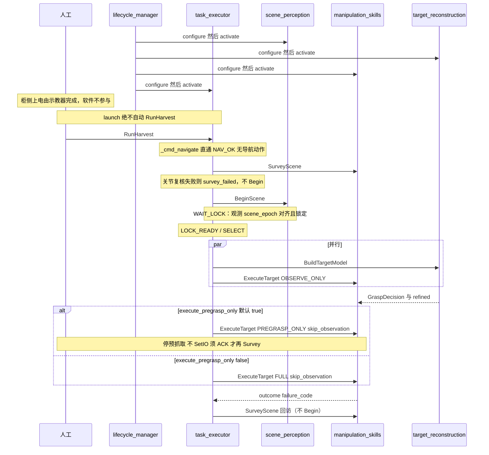
```mermaid
sequenceDiagram
  participant Op as 人工
  participant Lcm as lifecycle_manager
  participant Ex as task_executor
  participant Sc as scene_perception
  participant Sk as manipulation_skills
  participant Rc as target_reconstruction
  Lcm->>Sc: configure 然后 activate
  Lcm->>Rc: configure 然后 activate
  Lcm->>Sk: configure 然后 activate
  Lcm->>Ex: configure 然后 activate
  Note over Op: 柜侧上电由示教器完成，软件不参与
  Note over Op,Ex: launch 绝不自动 RunHarvest
  Op->>Ex: RunHarvest
  Note over Ex: _cmd_navigate 直通 NAV_OK 无导航动作
  Ex->>Sk: SurveyScene
  Note over Ex: 关节复核失败则 survey_failed，不 Begin
  Ex->>Sc: BeginScene
  Note over Ex,Sc: WAIT_LOCK：观测 scene_epoch 对齐且锁定
  Note over Ex: LOCK_READY / SELECT
  par 并行
    Ex->>Rc: BuildTargetModel
    Ex->>Sk: ExecuteTarget OBSERVE_ONLY
  end
  Rc-->>Sk: GraspDecision 与 refined
  alt execute_pregrasp_only 默认 true
    Ex->>Sk: ExecuteTarget PREGRASP_ONLY skip_observation
    Note over Op,Sk: 停预抓取 不 SetIO 须 ACK 才再 Survey
  else execute_pregrasp_only false
    Ex->>Sk: ExecuteTarget FULL skip_observation
  end
  Sk-->>Ex: outcome failure_code
  Ex->>Sk: SurveyScene 回访（不 Begin）
```

**读图（时序）：** 柜侧上电由人工用示教器完成；lifecycle 只把节点配到 Active。等人发 `RunHarvest`。固定座无导航一步：到位直通 `NAV_OK`（`NavigateToWorksite` 预留）。**先 Survey 到拍照位并复核关节，再 BeginScene 重启收齐窗**，等本世代锁定后才选果。选中一颗后重建与主动观察**同时**跑。观察结束后默认去预抓取停住（不剪、不回 stow），看完方向再 ACK；只有把 `execute_pregrasp_only` 改成 false 才走套入/剪切。回访只再 Survey，禁止再 Begin。

批次纯核是 `harvest_fsm.react(batch_state, event) → Reaction`。节点禁止手写 `batch_state`。数值与 `HarvestState` / `ControlTask` / `ManageLifecycleNodes` IDL 由 `test_idl_constants.py` 对账；`NAVIGATING=9` 预留，纯核不定义该常量。`READY_FULL` 对应命令 `EXECUTE_FULL`，节点再按 `execute_pregrasp_only` 选 `PREGRASP_ONLY` 或 `FULL`。

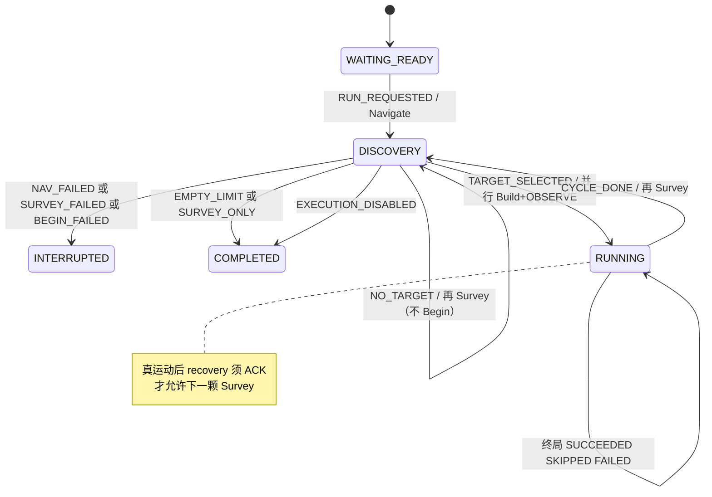
```mermaid
stateDiagram-v2
  [*] --> WAITING_READY
  WAITING_READY --> DISCOVERY: RUN_REQUESTED / Navigate
  DISCOVERY --> INTERRUPTED: NAV_FAILED 或 SURVEY_FAILED 或 BEGIN_FAILED
  DISCOVERY --> DISCOVERY: NAV_OK / Survey
  DISCOVERY --> DISCOVERY: SURVEY_AT_POSE / BeginScene
  DISCOVERY --> DISCOVERY: BEGIN_OK / WAIT_LOCK
  DISCOVERY --> DISCOVERY: LOCK_READY / SELECT
  DISCOVERY --> DISCOVERY: SURVEY_DONE / SELECT
  DISCOVERY --> DISCOVERY: NO_TARGET / 再 Survey（不 Begin）
  DISCOVERY --> COMPLETED: EMPTY_LIMIT 或 SURVEY_ONLY
  DISCOVERY --> COMPLETED: EXECUTION_DISABLED
  DISCOVERY --> RUNNING: TARGET_SELECTED / 并行 Build+OBSERVE
  RUNNING --> RUNNING: READY_FULL / PREGRASP_ONLY 或 FULL
  RUNNING --> RUNNING: 终局 SUCCEEDED SKIPPED FAILED
  RUNNING --> DISCOVERY: CYCLE_DONE / 再 Survey
  note right of RUNNING
    真运动后 recovery 须 ACK
    才允许下一颗 Survey
  end note
```

**读图（状态机）：** 圆是批次态，箭头上是「事件 / 接下来调度会发的命令」。发现阶段在 DISCOVERY 上转：到位 → 拍照并复核 → 开收齐窗 → 等锁 → 选果。选中后进 RUNNING；一颗结束必须回到 DISCOVERY 再拍一次（不再 Begin），不能直接派下一颗。右边注解：臂真动过之后要人工 ACK，否则停在恢复门。

PAUSE 不覆盖作业 `batch_state`：`operation_mode=MODE_PAUSED` 禁止新派发，动作终局在恢复后对原 phase 只 settle 一次。Survey 暂停仍可取消当前动作。接触或 PREGRASP_ONLY 到位未 ACK 时 `recovery_required`，调度不 Survey、不派下一颗。

### 图 D — ExecuteTarget 阶段序列

`stages.cpp` 的 `executeCycle(ctx)` 显式模式 switch：阶段序列与旧主树遍历严格同构。OBSERVE 周期在 Finalize 后短路，不进预抓取。

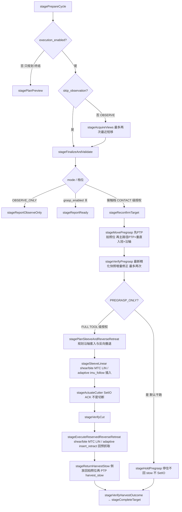
```mermaid
flowchart TD
  Prep[stagePrepareCycle]
  Prep --> planOnly{execution_enabled?}
  planOnly -->|否 只规划 终结| Preview[stagePlanPreview]
  planOnly -->|是| skipObs{skip_observation?}
  skipObs -->|否 OBSERVE| Views[stageAcquireViews 最多两次最近短移]
  skipObs -->|是| Quality[stageFinalizeAndValidate]
  Views --> Quality
  Quality --> mode{mode / 档位}
  mode -->|OBSERVE_ONLY| RepObs[stageReportObserveOnly]
  mode -->|grasp_enabled 关| RepReady[stageReportReady]
  mode -->|接触档 CONTACT 级授权| Rec[stageReconfirmTarget]
  Rec --> Move[stageMovePregrasp 先PTP拍照位 再主路径PTP+垂直入冠+沿轴]
  Move --> Ver[stageVerifyPregrasp 最新精化快照增量修正 最多两次]
  Ver --> pg{PREGRASP_ONLY?}
  pg -->|是 默认干跑| Hold[stageHoldPregrasp 停住不回 stow 不 SetIO]
  pg -->|FULL TOOL 级授权| Sleeve[stagePlanSleeveAndReverseRetreat 规划沿轴套入与反向撤退]
  Sleeve --> Lin[stageSleeveLinear shear/bite MTC LIN / adaptive imu_follow 插入]
  Lin --> Cut[stageActuateCutter SetIO ACK 不是切断]
  Cut --> VCut[stageVerifyCut]
  VCut --> Ret[stageExecuteReservedReverseRetreat shear/bite MTC LIN / adaptive insert_retract 回预抓取]
  Ret --> Stow[stageReturnHarvestStow 倒放回拍照位再 PTP harvest_stow]
  Stow --> Done[stageVerifyHarvestOutcome → stageCompleteTarget]
  Hold --> Done
```

**读图：** 这是**一颗桃一次** `ExecuteTarget` 在技能节点里怎么走，不是整批。菱形是档位：`execution_enabled=false` 只规划；`OBSERVE_ONLY` 看完就停；`grasp_enabled=false` 报到可抓就停；干跑默认 `PREGRASP_ONLY` 停在预抓取。右边 FULL 才套入、打刀、原路撤、回 stow。运动/IO 入口逐阶段过 `ExecutionAuthority`（套入/剪切前复检 `GraspDecision.allowed`，撤离 TRANSIT 级不做决策复检）。观察移位是最近短步（只 LIN）；到预抓取走接近主路径（PTP 到中段点正下方＋垂直入冠 LIN＋沿轴 LIN，v4 定型，无候选兜底）。套入：非 IMU 剪切手（`shear_v1`/`bite_shear_v1`）沿轴 MTC LIN；`adaptive_shear_v1` 在预抓取到位后开 imu_follow 窗（enable→insert→剪切→retract→disable），**禁止与 MTC 同时写控制器**，disable 后先倒放回拍照位再 PTP `harvest_stow`。护栏拦绕腕、口侧穿囊、上方绕行。

能力包 Lifecycle：ROS 实体（发布/订阅/服务/动作/TF/心跳）统一在 `on_configure` 创建、`on_cleanup` 释放（官方 LifecycleNode 写法：Unconfigured 期零 ROS 接口，配置失败返回 ERROR 停在 Unconfigured 并报错）；**非 Active** 拒绝运动 / 积分 / `BeginScene`。

### 决策栈

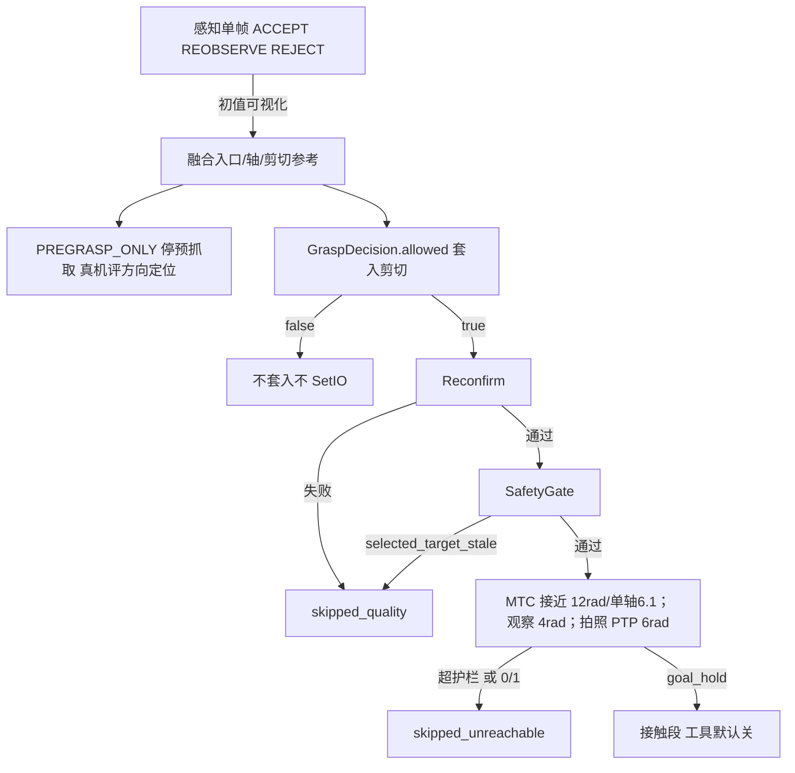
```mermaid
flowchart TB
  p3["感知单帧 ACCEPT REOBSERVE REJECT"]
  geom["融合入口/轴/剪切参考"]
  gd["GraspDecision.allowed 套入剪切"]
  rc["Reconfirm"]
  sg["SafetyGate"]
  mtc["MTC 接近 12rad/单轴6.1；观察 4rad；拍照 PTP 6rad"]
  p3 -->|"初值可视化"| geom
  geom --> pre["PREGRASP_ONLY 停预抓取 真机评方向定位"]
  geom --> gd
  gd -->|false| skip0["不套入不 SetIO"]
  gd -->|true| rc
  rc -->|失败| skipQ["skipped_quality"]
  rc -->|通过| sg
  sg -->|selected_target_stale| skipQ
  sg -->|通过| mtc
  mtc -->|超护栏 或 0/1| skipU["skipped_unreachable"]
  mtc -->|goal_hold| contact["接触段 工具默认关"]
```

**读图：** 从上往下权限越来越硬。单帧 ACCEPT 只配画面，不能动臂。融合几何足够去预抓取评方向。`allowed=false` 到此为止，禁止套入和 SetIO。再确认和安全门失败记 `skipped_quality`；超行程护栏或规划失败记 `skipped_unreachable`。最右「接触段」默认刀具仍关。

接近约束四层（2026-09-14，与姿态双门 / 绕行三门 / 关节行程门正交）：

| 层 | 保护 | 检查 | 生效期 |
|---|---|---|---|
| ① 果实胶囊 | 果实 | 工具有限圆柱（TCP→后方 0.2 m、r=0.06，半径只径向不含端球）vs 感知果实胶囊（bottom→neck，r=`max(直径/2, 0.025)+fruit_inflation_m` 0.01）。轴向投影不重叠则不判侧撞（筒口对果是接近语义）。感知直径无效回退 `mtc_approach_keepout_radius_m` 0.12 并 WARN | 仅接近段；套入/撤退豁免 |
| ② 从下方 | 果实 | 反爬：TCP s ≤ max(本段起点 s, 0)+2 cm（锚果底） |
| ③ 场景障碍（快照对象，2026-09-29 起现行） | 仅相机（避障目的=保护相机；臂/末端轻微碰撞用户已接受） | **不用 octomap updater**（`sensors_3d.yaml` 保持 `sensors: []`，两轮翻车教训见该文件注释）。`peach_harvester` 的 `peach_scene_obstacles` 节点（独立进程、不进 lifecycle 名单）：Survey 完成触发（supervisor 发 `/peach/scene/obstacles_refresh`）后取最近一帧点云 `/camera/depth_registered/points`（订阅 RELIABLE——两前端发布端均 RELIABLE，BE 订户大帧假性丢包），经「**体素化 0.06 m 先行**→滤自身（体素中心距 collision mesh+FK 余量=`self_filter_margin_m`+体素半对角 √3/2·voxel——半对角保证方块含角点不切机器人表面；点级滤除再体素化会留切进工具 ~2mm 的方块致 FCL 起点接触、CheckStartStateCollision 全拒，09-29 真相机轮实锤）→滤已精化目标袋邻域膨胀胶囊（R=袋径/2+0.10+半对角、轴向两端+0.10+半对角；套袋必经区；未精化目标不滤）→上限 3000 box」转 BOX 对象 `peach_scene_obstacles`，经 `/apply_planning_scene` 原子写入（首写 ADD、此后同请求 REMOVE+ADD）；新目标精化后同帧重写（源帧不变=快照稳定）；作业期图冻结，新批次 Survey 自动重建。ACM：`tool.links` 部署值=全机器人连杆−`camera_body_link`（豁免×`{<octomap>, peach_scene_obstacles}`），唯一受查对=**相机×障碍**；peach_arm **激活即后台应用（3 次幂等重试+成功 INFO 日志**，Survey/观察/接近全程生效；09-29 勘定：激活早期服务竞态会静默落空，观察视点裸 plan() 起点即撞）；开关 `moveit.obstacle_guard_enabled`（默认 true，运行时 `ros2 param set`、运动中拒改、空闲经 rebuildGraspTask 生效）=false 时相机一并豁免（障碍拦路到不了位时恢复可达性；对象保留场景，重开即恢复保护）。写域分域：本节点只写 world、peach_arm 只写 ACM diff | 全程规划期；mock 无点云=无快照；`camera_enabled:=false` 时节点不起 |
| ④ 近果降速+接触 | 果/硬件 | 套入 / 撤退 `approach_near_velocity_scaling` 0.05（接近主路径 PTP/LIN 段走 `velocity_scaling` 0.10）；`ContactMonitor` 腕轴电流斜率/尖峰（`grasp.contact_detect.*`，默认关，阈值 0=不判） | 执行期 |

接近：工具沿 −axis 自袋底套入（开口=TCP；三把剪切手同 LIN 路径，包络按档案 body_length/body_radius）。①+② 由 `inspectToolVsFruit` 逐段审查（半径随感知直径；开关键仍是冻结的 `mtc_approach_keepout_axial_m`）。套入/撤退故意进囊，不审。观察停在 look-at，从该姿态直接规划预抓取现场常无 IK，故 **先回拍照位**（有记录的「拍照位→预抓取」则倒放该轨迹；否则 PTP 命名关节）。**接近主路径（唯一主档，2026-09-23 定型 v4/v4d）= Pilz PTP 关节空间落到中段点正下方**（世界垂直线上、树冠外；滚转梯子 {0,±30°,±60°} 先在 roll-0 几何上试 IK，命中滚转后 `stagingWaypoints` 以同族滚转重建三路点姿态，沿轴跳 20° 对轴门可过）**+ 世界垂直 LIN 上行入冠到中段点**（`approach_canopy_entry_m` 0.05，伸进果树里）**+ 沿轴 LIN 对轴进入预抓取**（`approach_final_axial_m` 0.05；沿轴跳已齐挂相对目标 20° OrientationConstraint）。冠内两段 LIN 优先走 Pilz sequence blend(0.02) 速度连续（v4d；sequence 失败降级单任务 MTC LIN，形状同、不平滑）。PTP 弧过果实胶囊审查（staging_guard）；**无候选扫描/降速档/自碰预过滤**（bc14b57 已删 v1 候选 selector，自碰交给规划器与本节护栏），任一段失败即收口带码。起点已在袋底侧、直连不穿囊的短修正（预抓取残差修正等）走 **直连 LIN 几何分档**（不是兜底链；滚转梯子逐档试，roll≠0 或未对齐先 LIN 原地对齐工具 Z 再平移——不得挂在未齐起点上，Jazzy `ValidateSolution` 验起点）。执行路径 MTC `plan(1)`（只下发第一条；PREVIEW 仍凑 `mtc_max_solutions` 5）。100 颗 `ExecuteTarget` 不得并发——单臂单周期。解析覆盖不执臂核对走 `peach_system_tests` 回放塔（oracle=v4 三路点纯几何）与 `scripts/analyze_approach_envelope.py`（现行 v4 闭式复刻；`analytic_constraints.py`/`sim_approach_probe.py` 已标历史 v1 口径）；PTP 累计行程与弧绕行仍须规划或 mock。果实审查**逐段**进行：主路径 PTP 段（关节弧）只查工具筒体接触——拍照位本就在袋口上方，锚定起点的反爬门会把关节弧 2–4 cm 自然拱高误判成绕行；其后各段（垂直入冠/沿轴/直连 LIN）另查反爬（s 不得超过本段起点 max(s,0)+2 cm，锚定各段自身起点）。G/under 单弦档已删：photo→G 单弦笛卡尔 fraction 均值 0.77、≥0.95 仅 24%（2026-09-10 `sim_approach_probe` 100 随机位姿），同 seed 全链路基线 9/100 成功（72 挂 G 弦、19 挂对齐），staging 落点 100/100 至少一滚转 IK 可达。不走 CIRC/STOMP/OMPL。笛卡尔绕行比 2.6 / 偏离 0.32 m / 回退 0.12 m（2026-09-18 标定：合法簇 max 1.90/0.258/0.075、游荡簇 min 4.37/0.42/0.17；旧 1.8/0.25/0.08 压合法簇边致 1/30）；TCP 姿态行程绝对 110°（相对起止余量 20°；0=不查）。09-11 mock typical 包络（seed 20260911，当时 1.8/0.25/0.08 门）：从拍照位成功接近绕行比 ≤1.70、姿态 ≤71°，无 1740 式抬升；30 例 26 到位，其余为护栏拒发。接近 LIN 段弦长超过 `mtc_approach_cartesian_max_distance_m`（0.80 m）不适用或规划失败则 **skipped_unreachable**（主路径 PTP 段是关节空间转移，不受此限），不进 OMPL。入口在拟合圆柱袋底（`tool.entry_d_tool`+`entry_d_s`=0）；预抓取相对入口沿 −axis 后撤 `mtc_approach_along_axis_m`（grasp_standoffs.yaml 单源注入，现行 0.03 m；staging IK 探针位姿用同一停位族：入口后撤 0.03 m 后再沿轴退 `approach_final_axial_m`、垂直降 `approach_canopy_entry_m` 到中段点正下方，姿态 `alignFrameZ` 不抄感知滚转）。拍照位失败则从当前位规划。套入/撤退沿轴笛卡尔直线；返程倒放同一接近轨迹（含 PTP+LIN 各段）。MTC 解显示默认关闭（`enableIntrospection(false)`）；Pilz/OMPL 不挂 `DisplayMotionPath`（每次 `plan()` 成功都会发 `/display_planned_path`，含随后被护栏拒掉的解）。轨迹可视化走 observability TCP Path（实际 TF）与 RobotState；`planned_views` 只画已走到的视点。**方向是否对、定位偏多少，以停在预抓取时的真机目视/测量为准**；动态预算、12° 包络否决、RMSE 不代替实测，也不拦 `PREGRASP_ONLY`。套入只在 `allowed=true` 后沿轴 LIN 到剪切参考；反向同轨迹回预抓取，再 PTP `harvest_stow`。侧向 ≤ 0.05 m、夹角 ≤ 20° 视为已对轴（规划分档，不是精度验收）。接触绕行护栏 **累计 12 rad / 单轴 6.1 rad**（6.1=URDF ±3.05 满行程；笛卡尔绕行比 2.6 / 偏离 0.32 m / 回退 0.12 m；TCP 姿态行程绝对 110°（相对起止余量 20°）；不按时长：时长随速度变；`mtc_approach_max_duration_s` 默认 0=关闭）。观察：1 s 规划、禁止 replanning，绕行看 4 rad / 单轴 1.5 rad（09-01 现场 0.15 m 观察 LIN 实测 2.63–3.70 rad，2.5 拒合法短移）；下一视点沿当前相机直线截到 `max_camera_step_m`（默认 0.15 m），评分以行程最短为主，只 LIN，失败换下一候选，不改 PTP。覆盖达标或 `maximum_moves` 用尽才停，不按移动+等帧 EMA 预测收口。`goToPhotoPose`：当前在上一趟接近终点且命名目标对上轨迹起点（拍照位，不是 `harvest_stow`）时原路返程，不过 `transit_max_*`；否则先 Pilz PTP（时限 `photo_ptp_planning_time_s` 0.5 s），失败才 OMPL（`photo_planning_time_s` 3.0 s），行程门 6 rad / 2.5 rad。接触自由空间与接近 LIN 速度 0.10；套入/撤退 0.05。

### ID 与身份确定（含模块联动）

四层身份正交，各有独立铸造点与失效边界：**几何身份** `target_id`（感知世界系身份表）→ **批次事务身份** `request_id → run_id → cycle_id` → **计划绑定身份** `plan_id + 模型七元组` → **许可绑定身份** `clearance`（复用 `target_id`，不铸新 ID）。许可层无独立身份——绑目标语义即其身份。

各 ID 怎么确定（铸造点 / 唯一性 / 失效边界；纯核实现均在 `identity.py` / `plan_contract.hpp` / `model_contract.hpp`）：

| ID | 铸造点 | 唯一性与失效边界 |
|----|--------|------------------|
| `target_id` | `TargetRegistry._commit_match` 注册新目标发 `target_{N}`。归属判定 = χ²≤9（约 3σ/3 自由度）+ 匈牙利 1-1 + 类别一致 + 歧义比 1.2（次优落在最优 1.2× 内不分配，含已占用列防交叉漏检） | `_next_index` 进程内单调、`clear()`（BeginScene 换场）**不复位**——防清场后新 ID 与已下发下游的旧 ID 撞号。`confirm_frames` 转正（贴边帧不攒确认）；tentative TTL 按帧 + `max_age_s` 墙钟双淘汰 |
| 匿名档 | `ambiguous_{seq}` / `overflow_{seq}` 全局单调计数；`untracked_{i}` 每帧按序临时 | 歧义不入表；untracked 跨帧同名但恒无锚点 → 技能缓存 `valid=false` → 门拒（fail-safe） |
| `snapshot_id` | `GlobalHarvestPlan._lock_now` 收齐窗关闭一次性锁定时 +1 | `reset()` 不清零（锁定世代进程内单调）；跨进程重启重置可接受——target_id 同步重铸 |
| `scene_epoch` | 感知 `BeginScene` 每次 +1（节点持计数） | 调度 `_lock_set_ready` 要求观测世代 == 自身值且 >0 才可选果；goal 携带进七元组与 plan 契约比对。缺口 ID-4：技能侧 SurveyScene result 恒填 0（cycle.cpp 自述），臂不独立跟踪、只回显 goal 值 |
| `request_id` | 人在 `RunHarvest.goal` 给定 | 空则时间戳兜底 `auto_<时间戳>`（executor_node；批次7 修 ID-1——账本不复用，跨批 ledger 恢复不再撞通道（联动链 A）） |
| `run_id` / `cycle_id` | `run_id = request_id or 'auto_<时间戳>'`（批次7）；`cycle_id = f'{run_id}:{target_id}'` | 感知侧 `harvest_run_id = harvest_<µs时间戳>_s<snapshot_id>`（runtime.py）每轮锁定重生成，是技能 `TargetCache::locked_run_id_` 的生命周期边界（轮次链 E） |
| `plan_id` | 调度发 `f'{request_id}:{target_id}:{generation}'`（unrefined 档加 `:unrefined` 后缀）。`generation` = reducer 每接受事件 +1（旧世代事件在 reducer 丢弃）、每批复位为 0 | 技能侧仅 PREVIEW 档 goal 写绑定；FULL 比对 plan_id+scene_epoch+七元组+起始关节 0.05 rad 容差；FULL/PREGRASP_ONLY 终局清绑定。缺口 ID-2：绑定存在而 FULL 缺 plan_id 时放行、绑定写入先于预览成败（联动链 C） |
| 模型七元组 | `run_id / scene_epoch / target_id / model_revision / tool_profile_id / calibration_revision / config_revision`；revision 由 `BuildTargetModel` 回传，unrefined 档 `unrefined:{epoch}:{target_id}` | 受理门 `identityComplete` 只查非空（presence-check）；与决策/快照的一致性由 plan 契约或令牌绑定补，goal 自带 revision 在批流不做交叉验证 |
| `clearance` | 不铸新 ID | 复用 `target_id` 绑定 + `valid_until` 冻结不续签 + `model_stamp` 双窗（cycle.cpp `authorizeStage`）；装配侧 decision 目标不符整体不装（无缺口） |

**模块联动矩阵**（谁生产、谁消费、联动要点）：

| 模块 | 生产 | 消费 | 联动要点 |
|------|------|------|----------|
| 感知 scene_perception | `target_id` / `snapshot_id` / `scene_epoch` / `harvest_run_id` | `HarvestState.target_id` | 执行器目标反哺覆盖感知 selected；换目标即 `mark_completed(old)`（完成/跳过合并，反哺链 D） |
| 重建 target_reconstruction | `model_revision` / GraspDecision 七元组 | `target_id`（Build 绑定、收帧对齐） | `refined_*` 按 ID 对齐；技能 `waitForRefined` 谓词钉 ID，`refined_.valid ∧ id==target` 才算就绪 |
| 调度 supervisor | `run_id` / `cycle_id` / `plan_id` / `generation` / `transaction_id` | 全部 | `_lock_set_ready` 世代对齐；ledger claimed/outcomes 按 `request_id` 断点恢复（批次链 A）；`_action_generation` 随 reducer 世代回写 |
| 臂 peach_arm | `outcome_record.target_id` | `target_id` / 七元组 / `plan_id` / `clearance` | 三张 ID 缓存索引（selected/locked/refined）+ 换 ID 清缓存调和；锁定集受理门（lockedTargetGateSample，未命中回退 selected 缓存） |
| 账本 / observability | CanonicalEvent（`request_id` / `target_id`） | `HarvestState.run_id` | session bag 按 run_id 路由（R7 单根会话目录）；rework_list 同 request_id 落盘 |
| 8090 调试 | — | FireStep PREVIEW | plan 绑定的唯一手动触发链（绑定链 C） |
| 回放 / 仿真 | — | — | `replay_oracle.py` 是纯几何 oracle，不消费系统 ID；campaign 脚本（sim_field_targets / m1_m5_report）用本地 case id，与系统 ID 无耦合；`peach_sim` 场景清单（manifest）只出几何 GT（袋底/袋颈/轴/果心），同样不消费系统 ID |

**五条关键联动链**：

- **A 批次链**：`RunHarvest.request_id → run_id → runs/<request_id>/ledger.json → 断点恢复 claimed/outcomes → 选果跳过`。ID-1 已修（批次7）：空 request_id 时间戳兜底 `auto_<时间戳>`，账本不复用——空名批次跨栈重启不再被旧批 claimed 误跳过同名新目标（原缺口：空名默认 `'harvest'` × 感知重启重铸 target_id）。
- **B 世代链**：`BeginScene++ scene_epoch → 调度对齐校验（相等且>0）→ goal 携带 → 臂七元组/plan 契约比对`。批级链路是通的；断点在臂自身（SurveyScene result 恒 0、不独立跟踪，ID-4）——跨世代防护实际依赖调度正确携带。
- **C 绑定链**：`PREVIEW（仅手动 FireStep；批流不发）→ 臂 last_preview_plan_ → FULL 全字段比对 → 终局清绑定`。supervisor 批流不发 PREVIEW → plan 契约在批流 inert（设计事实）；绑定链三软点：FULL 缺 plan_id 放行、绑定先于预览成败写入、预览失败后同 plan_id 的 FULL 仍过比对（ID-2）。
- **D 反哺链**：`HarvestState.target_id → 感知 _on_executor_state 覆盖 selected + mark_completed(old)`。完成/跳过/失败一律 completed → 本轮不再重选，补采走 rework_list；`harvest_status()` 对跳过目标报 'HARVESTED' 属措辞级失真（ID-5，轻微）。
- **E 轮次链**：`感知每轮 lock → harvest_run_id（µs 时间戳+snapshot_id）→ 臂 locked_run_id_ 边界清锁定缓存 → 受理门按新锁定集/selected 回退重建`。跨轮/跨批陈旧锚点有界；感知多轮 lock 不会在臂侧累积陈旧缓存。

**合理性结论**：合理处——单调不复用（clear 不复位计数器）、锁定排序确定性 tie-break（target_id 字符串垫底）、`valid_until` 冻结不续签、令牌绑目标、世代号防事件回放（链 B 批级已通）、四层身份正交且各层有 fail-closed 门兜底（untracked 无锚点门拒 / 令牌目标不符拒 / 七元组缺位拒受理）。联动缺口集中四处，均不破安全主链（使能门/令牌门不受影响），修复另轮裁定（**ID-1 已随批次7 时间戳兜底修复**，见链 A）：**ID-2** plan 契约三软点 × 仅手动链路（链 C）；**ID-3** ModelSnapshot 消费侧（approach_execution_gate）只查新鲜度不绑 `ctx.target_id`，`onDecision` 替换条件只比 revision/target 不比 run_id/标定/配置修订——身份正确性现依赖令牌/决策绑定层；**ID-4** 臂 SurveyScene result 恒 0、臂不独立跟踪世代（链 B 断点）。**ID-5** 措辞级（链 D）。回放塔不消费系统 ID 是设计事实，非缺口。

### 透传（real）

```
FollowJointTrajectory → AuboPassthroughTrajectoryController
  → GPIO trajectory_passthrough → AuboE5Hardware::write()
  → 4 ms 线程重采样 5 ms 点 → 接口板排空 succeed
```

**读图：** 技能不写关节。MoveIt 把整条轨迹交给透传控制器，再经 GPIO 进硬件 `write()`，板上排空才算成功。取消走透传 abort + 柜侧停轨，不经过 `aubo_dashboard`。

关节顺序：`shoulder_joint, upperArm_joint, foreArm_joint, wrist1_joint, wrist2_joint, wrist3_joint`。取消：透传写 `abort`，硬件清队列，`ioLoop` 发 `RobotMoveStop`（失败再 `robotMoveFastStop`）。不依赖 `aubo_dashboard`。

---

## 5. 缝位

机制：现行单实现直接构造（YOLO / MobileSAM / 匹配器 / 锁定策略 / 帧栈 / 点云构建 / ICP / TSDF / 掩膜门）。仅袋/果位姿管线与柱/球 refitter 走 dict 映射：`PIPELINES_BY_IMPL` / `REFITTERS_BY_IMPL`，yaml `*.impl` 选名；未知名启动失败并列出可用名。该 dict 缝是 SNAPSHOT / **UNWIND**——**新可替换算法默认 pluginlib**，不要再扩平行注册表。技能原 C++ 工厂缝位已删除（ViewPlanner / QualityGate / SafetyGate / MotionInterface 直接构造）。

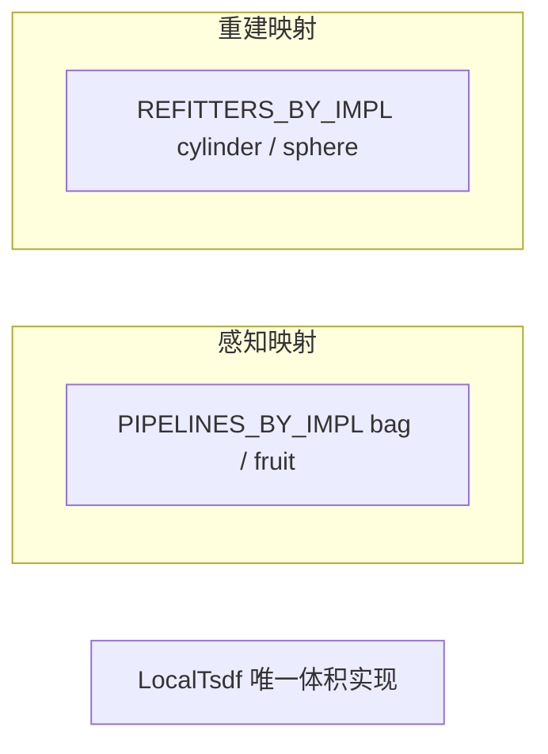
```mermaid
flowchart LR
  subgraph sceneMap ["感知映射"]
    p["PIPELINES_BY_IMPL bag / fruit"]
  end
  subgraph reconMap ["重建映射"]
    rt["REFITTERS_BY_IMPL cylinder / sphere"]
  end
  vol["LocalTsdf 唯一体积实现"]
```

**读图：** 两个框是「可换算法的插头」，不是进程。换袋/果线改感知 yaml 的 `pipeline.*_impl`；换柱/球精化改重建 yaml 的 `refitter.*_impl`。换检测器/分割器/体积=改源码。技能不再有缝。体积滤波直调 `LocalTsdf` 静态方法，因为体积已是唯一实现。图上没画的（身份表本体、MTC 阶段、阶段函数、选下一颗）不是缝，不要为它们加 `*.impl`。

| 缝 | yaml | 默认 | 映射 | 装配 |
|----|------|------|------|------|
| POSE_PIPELINES | `pipeline.bag_impl` / `fruit_impl` | `robust_bag` / `robust_fruit`（果线另受 `from_params(..., enable_fruit=False)`，改 `True` 才装配） | `pose_pipelines.py` 末 | `pipeline.py` `from_params` |
| REFITTERS | `refitter.cylinder_impl` / `sphere_impl` | `cylinder_refit` / `sphere_refit` | `refine.py` 末 | `session.py` `from_params` |

yaml：仅上述 4 键仍为 `*.impl`（技能 yaml 无 `*.impl`）。检测/分割/匹配/锁定/帧栈/点云/ICP/体积/掩膜门已收回，换实现改对应 `.py`。

**不变量（摘要）：** 检测/分割不发明深度。管线深度 uint16 毫米；点数不足 REJECT。匹配器不持身份表。锁定策略禁止自己取时钟。帧栈满栈拒收、换 ID 须 reset。点云构建 0/65535 无效。ICP 越界拒帧。TSDF 只用精确 stamp，禁止 latest。体积积分与袋融合分账：融合/`geometry.jsonl` 失败保留体积与采帧。柱/球 refit 只可视化；`GraspDecision.allowed` 只信袋融合动态预算且只授权套入/剪切；TSDF 包络轴只否决不授权，扁袋跳过 12° 冲突门，固定 35° 只诊断完全错轴。方向/定位精度以预抓取位真机实测为准。无同戳掩膜不得积分。`PREGRASP_ONLY` 只要求融合几何，FULL 才读 `grasp_allowed`。`ExecutionAuthority` 不得旁路 `execution_enabled` / `grasp_allowed`（所有运动/IO 入口收敛此判定）；撤离（`ReverseRetreat` / 回 stow）TRANSIT 级不做决策复检；安全门任何实现不得旁路 `robotReady`；`execution_enabled=false` 只规划；停轨走透传 + `RobotMoveStop`。8090 调试桥（0018）只是又一客户端：能力包批次动作唯一客户端仍是调度；observability 直发单颗动作须过 `debug.enabled` 与运动类 `debug.motion_enabled`，**不得**为它新增 IDL 或旁路任何既有安全门（`debug.token` 键 2026-09-20 已删，HTTP 层不校验任何令牌）。

**不是缝位：** RGB-D 同步、TF 策略、采帧门顺序、发布器、`TargetRegistry` / `GlobalHarvestPlan` / `InferenceEngine` 本体、`GraspTask` / MTC stage、阶段函数（`stages.cpp`）、`batch.next_target`、lifecycle 名单、底盘/雷达驱动。要开新缝先改本文件规约。

预留层以后：树干占用接到技能 PlanningScene，不是新 peach 包；底盘 odom 核继续只用 `base_link` + `/joint_states`；真底盘时导航适配从归档恢复并在其内部接 Nav2，不加空 `/scan` 话题、不加第五个 peach 包。

---

## 6. ROS 2 机制

| 机制 | 现行 | 态度 |
|------|------|------|
| LifecycleNode | 感知/重建/技能/调度/observability | KEEP |
| lifecycle_manager | 整栈：`nav2_lifecycle_manager`（节点名 `peach_lifecycle_manager`，bond_timeout=0，名单硬编码在整栈 launch）；包内自研 `peach_lifecycle_manager`（`peach_harvester supervisor params.py` 名单/超时，部署值 config/lifecycle_manager.yaml）保留独立 launch | SNAPSHOT / **UNWIND**（bond_timeout=0 即无 bond，Nav2 默认有）；新生命周期节点加 bond 或显式 watchdog |
| BT.CPP | 已移除（`behavior_tree.xml` 与 `bt_nodes.cpp` 删除，`stages.cpp` 显式阶段执行器替代） | KEEP 接触用 MTC stage；不要把“去 BT”扩成禁 pluginlib |
| MTC | stage 硬编码；预抓取先 PTP 拍照位，再接近主路径 PTP＋垂直入冠 LIN＋沿轴 LIN（v4 定型；冠内双 LIN sequence blend）；已齐 LIN 带姿态约束 | KEEP；绕腕看行程（接触 12 rad / 单轴 6.1=URDF 满行程，观察 4 / 1.5，拍照 6 / 2.5）；口侧/上方看①②层果实胶囊（工具有限圆柱 vs 感知胶囊；反爬 s 不得增大） |
| generate_parameter_library | `peach_arm` C++ 仍 GPL（`src/arm_parameters.yaml` → `arm_parameters.hpp`）；Python peach 节点 yaml 直读 + `attach`（决策 0024）。驱动控制器仍有 `*_parameters.yaml`（ros2_control 主流） | Python 侧不追求 GPL 生成物；C++ 技能节点 KEEP 类型化 Params。新 C++ 包仍可用 GPL |
| message_filters | slop 0.05 s | KEEP |
| pluginlib / composable | 感知 dict `*.impl`；peach 节点非 composable；仅 Percipio 用 composition | **UNWIND**；新可替换算法 pluginlib；composable 已核实平台阻断（2026-09-20）：Python 无组件容器（Jazzy 官方 composition 仅 C++ rclcpp::Node）；peach_arm 为 LifecycleNode 而 `rclcpp_components` ComponentManager 零生命周期处理（源码 grep 证实）、且臂侧非高带宽节点无零拷贝收益——进程隔离+bond 是可达上限，感知节点 composable 待官方支持 |
| diagnostic_updater | `peach_arm` 已用（W5：五任务 1Hz → `/diagnostics`，`~/status` JSON 双轨保留）；`serial_imu`、`peach_vegetation` 已用；感知/重建/调度/观测主路径仍未用 | 感知/调度/观测仍 **UNWIND**；新健康信号一律走 `/diagnostics` |
| rosbag2 | 会话 bag（决策 0019）：节点内 `rosbag2_py` 写 MCAP，2026-09-24 起限速族进袋（决策 0031）；`ros2 bag reindex` 兜底非正常退出 | 推翻旧「默认关/7 话题不开白名单」口径 |

---

## 7. 已拍板决策

格式：决定 / 理由 / 代价 / 被否 / 推翻。

| 编号 | 决定 |
|------|------|
| 0001 | 采摘能力包五个：契约、视觉、臂、导航适配、调度。感知两节点共包；监控不独立成包。推翻：书面改 AGENTS。（导航适配部分已被 0009 推翻归档） |
| 0002 | 现行：单实现直接构造；袋/果管线与柱/球 refitter 留 dict 映射。Python `Registry` 与 11 个算法 ABC 已收回。态度：**UNWIND**「不上 pluginlib」——不是套袋工艺的完美适配；**新可替换算法默认 pluginlib**（默认可仍直接构造一个实现）。推翻：第二运动后端必须独立包加载。 |
| 0003 | 重建精确 stamp、禁止 latest；感知 stamp 失败可 stale。推翻：live 证明两光学系不重合，或 `tf_stale` 污染身份表。 |
| 0004 | 抓取几何只信 `GraspDecision.allowed`。推翻：取消重建节点。 |
| 0005 | 设计用归档 ~2.5 FPS；launch 5.0 是请求；不改 Percipio。`assumed_frame_interval_s` 不预填 EMA。推翻：授权后的新 live hz。 |
| 0006 | 现行 `test/` = ROS 2 默认 lint **加** 零 ROS 纯核 pytest（不 import rclpy、不造 DDS 现场）。态度：**UNWIND**「禁止 gtest / launch_testing」已收口：`peach_arm` 有 gtest，`peach_system_tests` isolated launch_testing 起 mock `harvest_system`（`hardware_mode:=mock`，不发 `RunHarvest`）。采摘方向 / 接触对错仍以实机与过程数据为准（KEEP）。`colcon test` 绿 ≠ 套袋验收。 |
| 0007 | observability 只读 HTTP + jsonl；不进 lifecycle 名单。推翻：另做鉴权操作面且不混端口。→ 0013 融合进 8090；0018 去掉令牌与完整操作面。 |
| 0008 | 底盘/雷达驱动本仓不实现。`peach_navigation` 只提供 `NavigateToWorksite`。推翻：书面授权真底盘并接发行版 Nav2。 |
| 0009 | 核心能力四包：契约、视觉、臂、调度。`peach_navigation` 移至 `_archive/parked_2026-09/`。应用层另加 bringup / observability / system_tests（0021）。推翻：书面授权真底盘，从归档恢复。 |
| 0010 | 技能去 BT.CPP：删 `behavior_tree.xml` 与 `bt_nodes.cpp`，`stages.cpp` `executeCycle(ctx)` 显式模式 switch（序列与旧主树严格同构）；周期状态全部入 `CycleContext`（action 受理时创建、worker 单写者），`cycle_*` 成员删除。推翻：需要树级恢复语义时重新评估，但不回到隐式 tick。 |
| 0011 | `ExecutionAuthority` 统一执行权（`cycle.cpp` `authorizeStage`）：TRANSIT/PREGRASP=Active∧robotReady∧!cancel∧execution_enabled；CONTACT 再加 grasp_enabled∧GraspDecision 复检（目标 ID 对齐+allowed）；TOOL 再加 tool_enabled。所有运动/IO 入口收敛此判定；复检不过→SKIPPED_QUALITY，其余→FAILED。（分级 2026-09-20 M3c 细化：令牌/许可「过期」与复检不过同归 SKIPPED_QUALITY——过期≠不允许，重建换新令牌即可重派；其余拒因仍 FAILED，见 `stage_denial.hpp` `StageDenial`。）推翻：新增执行后端须走同一矩阵。 |
| 0012 | 死代码删除、文档标预留：MTC 预规划链（PreplanSlot 等）、`DepositToStation`（`DepositResult` 字段保留恒 `deposited=false`）、别名注册、`impl_factory`/`motion_factory` 缝位、`planOrMoveTool`；yaml 删 `*.impl` 4 键与 `deposit_pose_named_target` 等。刀具切断确认预留接 `/aubo_io_controller/io_states` 工具 DI；`tool.enabled=true` 未确认终局 `FAILED`/`CUT_FEEDBACK_TIMEOUT`。 |
| 0013 | 调试操作面融合监控 Web（8090 单端口），推翻 0007「只读、不混端口」的端口隔离部分。令牌三重门已被 0018 取代。 |
| 0015 | 冗余归档清理（2026-09）：`Robotics_Tutorial/`、`plans/`、`reports/`、感知 `offline/` 离线脚本、`tool_profiles/` 零加载 yaml 归档 `_archive/`；删除全仓零调用服务（感知 `query_harvest_state`，重建 `start_reconstruction`/`capture_frame`/`remove_last_frame`，技能 `start_cycle`/`query_state`）、零引用内部方法与 8 个声明未读参数链（via 间距、budget_cost_margin、refined RMSE/内点阈值等）；`approachAndInsert` 收敛为纯规划（执行路径零调用）。四包 README 削薄为导航页。图名/话题/动作/活文档契约不变。推翻：需要恢复任一归档件时从 `_archive/` 取回并同步本表。 |
| 0016 | 参数分层收敛（2026-09）：运行 yaml 覆盖化——能力节点 `config/<节点>.yaml` 不再复写 GPL 默认（审计 274 键 0 真覆盖），只写部署覆盖与注释示例；`peach_lifecycle_manager` 随后迁入 GPL（`lifecycle_manager_parameters.yaml`，名单/超时原样，不加 bond）。运行 yaml 独有增量口径（recovery_scale 真机实测史、max_collect_s EMA 自适应、protected_zones 与 min_camera_height_m 关系等）并入 GPL description（`ros2 param describe` 可见）。C++ 装载链收敛：节点持 GPL Params 快照直构各 Config，删纯转发成员。键名/分组冻结（真机命令/文档/镜像零破坏），命名规约成文（见「参数分层」节）约束新键。observability 参数镜像 watchlist 删幽灵键。GPL 机制已被 0017 替代。态度：「不加 bond」为 SNAPSHOT / **UNWIND**（Nav2 有 bond）；新生命周期节点加 bond 或显式 watchdog。推翻：现场需要成套部署档（如真机保守档 yaml）时在运行 yaml 写覆盖键，或新增第二份覆盖文件经 `params_file` launch 参数切换。 |
| 0017 | 参数体系转 nav2 式（2026-09，深版）：移除 generate_parameter_library（含 0016 引入的 GPL 单一事实源机制，键名/分组冻结不变），六份 `*_parameters.yaml` 声明删除；`config/<节点>.yaml` 变为全量清单（部署事实源），新增手写参数模块 peach_perception/peach_supervisor 的 `params.py` 与 peach_arm 的 `params.hpp`（DEFAULTS 兜底默认 + 手写校验器 + 兼容原 GPL 接口的 ParamListener：get_params/is_old、启动期校验抛异常、on-set 拒非法值、快照变更戳）。运行期刷新语义、grasp_standoffs 注入层、execution→grasp→tool 依赖链校验全部保真。键名/分组冻结（KEEP：真机命令零破坏）。态度：手写 ParamListener **UNWIND**——不是完美适配；**新包默认 GPL**，禁止再扩第三套参数框架；旧包不强制本轮回迁。不要把「已移除；不回退」当永久禁令。接受两项现行让步：改默认值须模块与 yaml 各改一处，`ros2 param describe` 不再携带中文描述（以 yaml 注释为准）。真机回归状态：mock 启动通过，真机验证待做。 |
| 0017 | 保行为修复轮（2026-09-08）：① FULL 套入预检 `previewFullContact` 在「已对轴 SKIP」分支把 sleeve+retreat 误当接近段过护栏（回退门必拒）——修正为无接近段即不审，FULL 规划路径恢复可达（真机 FULL 仍未验收，全部使能门照旧）；② recorder 终局集收敛为 `{COMPLETED, INTERRUPTED}`（RECOVERY_REQUIRED 是批内可恢复态，保持批次目录开、不提前写 summary）；③ recorder 批次目录名过 `_safe_run_component`（与账本同规则防穿越）；④ `batch_paused` 审计事件条件改 PAUSED（原判 PAUSE_PENDING 恒假，事件从未发出）；ControlTask `reason` 按契约写入审计事件；⑤ 帧环写入纳入 `_state_lock`（消迭代竞态）、重建 `_refined/_bag_model` 成对更新、观测/初值缓存加 frame_id 门、掩膜有效深度补 65535 饱和剔除；⑥ `SafetyGate` 自适应上限改 `std::atomic<double>`；⑦ 死契约清理（`round_started/round_completed` 消费方、`_blockers`、感知 5 个零调用函数、`kStageNames` 等）与三处同构去重（common 几何原语单源化、选果资格谓词、接触入口三元组）。图名/参数键/yaml 默认零变化。推翻：无。 |
| 0018 | 8090 收敛为本项目过程页（2026-09）：记录目录 + 过程线/作业票/事件 + TCP 俯视（绕行比/Δz）+ 单步调试（BeginScene/Survey/Build/Execute/RunHarvest/拍照位）。去掉令牌鉴权与生命周期/使能等完整操作面。`debug.token` 键保留不校验；`debug.enabled` 默认 true（回环）；运动类仍须 `debug.motion_enabled`（默认 false→423）。不新增 IDL，不旁路 ExecutionAuthority。推翻 0013 的令牌与「完整驾驶舱」。 |
| 0019 | **过程记录介质替换（会话 bag，2026-09-15）：** observability recorder 从「batch_state 开合 9 路 jsonl + jpg/ply + 终局 summary」改为**会话级 MCAP bag**——生命周期绑定节点启停（`on_configure` 开 `runs/session_*/bag`，shutdown/destroy 收尾），批次边界由消息 `request_id` 还原；停栈自动生成 `bag_report.md/json`（`bag_report.py` 纯核 + `bag_reader.py` 读取/reindex 兜底，报告口径沿用旧 summary 验收门），`peach_bag_report` CLI 可复跑；`record.max_total_bag_gb` 预算自动回收最旧 `session_*/bag` 与旧 `mcap_*`（总结/账本/文本永不删，审计 `runs/retention_audit.jsonl`）。新增发布 `/peach/observability/job`、`/peach/observability/metrics`（String JSON，不新增 IDL）；launch `record_mcap` 参数删除。若节点内序列化路径在真机环境不可用，fallback 为 launch 层 `ros2 bag record` 进程（目录退 `runs/mcap_<时间>`，报告侧兼容）。推翻 0006 的「recorder 收尾离线复算 summary」与 0017 的 recorder 目录状态机；mock 冒烟已验证闭环（录制→SIGINT→自动报告→回收），真机待验。 |
| 0019 | **接近约束四层（2026-09-14；与上条同号，以标题区分）：** ①果实胶囊（工具有限圆柱 vs 感知直径/2+10 mm，不含端球）+②反爬锚果底替换半无限袋囊 keepout；③`sensors_3d.yaml` 点云 octomap 护臂/相机（分辨率 0.04 m，地图系=规划系 `world`），工具链 × `<octomap>` 豁免须 GetPlanningScene 合并 ACM（禁止子方阵整表替换）；④近果速度档 0.05 + `ContactMonitor` 电流特征（默认关）。键名冻结：`mtc_approach_keepout_*` 改为开关/回退。零 IDL。推翻：无。 |
| 0020 | 双末端工具档案化 + IMU 插入跟随（2026-09-15）：新增 `adaptive_cylinder_v1`（自适应圆柱挂增量 IMU，D_inner 0.116、TCP `(0, 47, 168.66) mm`，余同固定圆柱），与 `hollow_cylinder_v1` 帧名共用冻结（SRDF/ACM/三点 TF 零改动）。`aubo_description/config/<profile>.yaml` 档案成单一事实源，`peach_harvester.vision.tool_profiles` launch 期注入感知 `tool.D_inner`、重建 `tool.budget.d_inner`（许可数学随档案）与各包 `tool.profile_id` 标签；xacro `tool_profile` arg 贯穿 bringup（RSP）与 MoveItConfigsBuilder（move_group/技能/servo）双展开。授权 `bringup.launch.py` 最小穿透（仅透传 arg 进 xacro 命令，驱动逻辑只读）。默认 `tool_profile=adaptive_cylinder_v1`（忘传参失败方向更安全：模型比实际长→停浅不撞深）；固定圆柱行为零变化有 xacro 展开等价门保证。imu_follow 新增插入模式（`~/insert_start`/`~/insert_stop`）。衔接当时为 PREGRASP_ONLY 停靠后人工编排。推翻：接触窗编排见 0026。 |
| 0021 | 框架渐进迁移（2026-09-16）：R0 修 RULES/身份事务/暂停不覆盖 phase/PREGRASP 不虚报 VERIFIED；R1 domain 纯核 + 键名冻结 + 跨字段；R2 模型身份元组/有效期/心跳不续签；R3 reducer+generation+账本幂等；R4 lifecycle watchdog（bondpy 未装 → HeartbeatWatchdog 等价）+ execute 窗 robot_status 单调时钟；R5 封存回放/stale TF/走廊空数据非 clear；R6 plan_id + ACM 不豁免整张 octomap + REACHED/VERIFIED；R7 工具 UNKNOWN 不自动撤退；R8 `peach_bringup`/`peach_observability`；R9 无第二 C++ 实现、不上 pluginlib；R10 `peach_system_tests`。驱动只读；使能默认关；launch 不自动 RunHarvest。 |
| 0022 | 安全收口 + 假绿拆除（2026-09-18 全面审查轮）：① 使能广播加心跳——supervisor Active 且 override 非空时 1Hz 重发 `/peach/batch/enables`，臂侧 `execution.enables_heartbeat_timeout_s`（默认 5.0，<=0 锁存兼容）超时回落本地参数权威；广播在权时本地参数 set 不覆盖使能（双写竞争修复）。② 接触许可令牌绑目标——`Clearance.msg` 加 `target_id`/`valid_until`（GraspDecision 原值冻结不续签），装配端不绑定当前目标不装令牌（走快照复检回退），臂侧令牌路径查绑定+valid_until+TOOL 级 tool_enabled，堵「旧决策授权新目标」与「1Hz 心跳刷新 stamp 致新鲜度永不触发」（②的窗口 2026-09-20 参数化 `decision.validity_s` 默认 120s——G1：原 5s 与接近链时长错配，真机单 LIN 7.5s、FULL 链 30-60s；`model_revision` 含单调 finalize 计数——G3：同目标重 Build 且机位数相同不再沿用旧令牌；supervisor 装配处加过期 WARN，不拒发不重排）。③ 8090 `SURVEY_ONLY` 收紧为运动类（会 Survey 移到拍照位，原判非运动是 423 门旁路）。④ 真机 P1-A：贴边帧不计确认 + `bbox_edge` 旗标锁可选/选果双侧过滤；P1-B：fast 档 `decide_fast` 接 `reconstruction_min_views`（好单视不再直接收口，消除「fast 不移动×min_views=2×基线 8°」三层矛盾）。⑤ 测试假绿拆除：24 个 `vision_test_*`/`supervisor_test_*` 改名 `test_*` 并入 pytest 收集（97→全部用例真实执行），peach_harvester lint 债全清（D400/D205/D209/D403/import 序/缺 docstring）；F10 回退后的 octomap 豁免 gtest 断言同步（`allowToolVersusWholeOctomap`=true 为现行语义）。⑥ fast 补视 latest TF 回退加 1.0s 陈旧门；`_view_signals` 接 `tf_stale/tf_unavailable` 诊断旗标。驱动只读、使能默认关、无真机运动。 |
| 0023 | GPU 枝/叶分割独立包 `peach_vegetation`（2026-09-18）：首版直接构造 Frangi（torch Hessian，`device:=auto`）+ Excess Green/HSV 叶，发布 `sensor_msgs/Image` 掩膜与 overlay。不写 PlanningScene / 不删 octomap 叶 / 不进 `harvest_system` / lifecycle。参数沿用 0017 ParamListener（非第三套；C++ 化再 GPL）。健康走 `diagnostic_updater` `/diagnostics`。后续木类语义分割换同一 `split()` 面，禁止先扩 yaml `*.impl` 表。零新 IDL。推翻：无。 |
| 0024 | Python 参数改为 yaml 直读（2026-09-18）：删 scene 的 GPL Python 生成物（`scene_perception.params.yaml` / `params_gen.py` / 再生成脚本）与手写 ParamListener DEFAULTS 双源。`yaml_params.attach(node, yaml)` 按部署清单声明叶子，`ros2 param set` 原地刷新；主节点一行 `attach(self)`。空 YOLO/SAM 路径在参数层拒绝。感知/重建/调度/观测/lifecycle/vegetation 同一写法。`peach_arm` C++ 仍 GPL（类型化 Params）。键名冻结。推翻 0017 的 Python ParamListener 与随后 scene GPL Python 回迁。同日补全：各 params 模块挂 `_RULES` 规则表（`validate=`：越界/白名单启动期拒启、运行期非法 set 即拒，逐条转写自 0017 RULES）与跨字段 `preview=`（scene 深度窗、supervisor 选果窗、vegetation HSV 窗：非法整批拒绝）；`peach_bringup` 两小组件节点入 `config/bringup.yaml` + attach；接口清单核对器 consumer 扫描补 `peach_bringup/config`；规则键⊆部署清单键入各包测试。 |
| 0025 | 端到端审查修复轮（2026-09-20/21，报告 `reports/2026-09-20-e2e-code-review/`；G1/G3/G4 追记见 0022②与本表上方 observability/reconstruction 节）：**G2** 预览绑定只由 PREVIEW 模式 goal 写入（旧「observe 转记绑定」会让保守档 FULL 必拒且绑定无复位点），FULL/PREGRASP_ONLY 周期终局清复位、受理即拒不清（`plan_contract.hpp` `executePlanGate`：无绑定或 goal 无 plan_id 放行——fast 档不发 PREVIEW 是有意的）。**M1** 取消旗标收口：三动作（ExecuteTarget/Survey/MoveTo）终局各自 `clearCancelFlagIfIdle`，sticky 取消不再拒后续 MoveTo/观察。**M2** 周期 worker/survey/move_to 线程 packaged_task future 2s 有界回收、超时 WARN+detach（W13-B 同款扩展，默认互斥组裸 join 死锁拆除）。**M3a/M3b/M3c** 受理期 plan mismatch 以 PLAN_MISMATCH(20) 进 Result（纯核常量 static_assert 与 IDL 钉死）、`onStart` 拒绝落 RECOVERY_REQUIRED/OBSERVE_FAILED 码、`StageDenial` 拒因分级（EXPIRED→SKIPPED_QUALITY 可重派，DENIED→FAILED）。**G5** 预检名单补 brain exec 名 `peach_harvester`（brain 一进程三节点不传 name= 重映射，按节点名查会漏旧脑致双 supervisor 静默共存）与 `peach_lifecycle_flag_bridge`/`peach_autostart_client`/`stereo_camera_node`。**M11** GraspDecision dict 侧 allowed 与消息侧同源派生（`model_contract.allowed_from_decision` 单源；events.jsonl/diagnostics_debug 不再与类型化消息各执一词）。**M13** 观测落盘 `scene_snapshot` 订阅改 transient_local（单发闩锁，记录节点晚于发布启动不再永久丢快照）。驱动侧（非 aubo 只读面）：`percipio_camera/launch/parameters.xml` 调参残留 `DepthSgbmImageNumber=2` 清空——09-21 根因终章：该 XML 被 launch 无条件下发，18 图案 SGBM 被砍成 2 幅致设备深度大面积无效（testing-log 09-21）；纪律同步：percipio_camera=官方驱动+仅本机 IP/分辨率调整，调参实验值不留此文件。`peach_stereo` 参数档 hh4/`uniqueness_ratio`6/`median_ksize`3 落地（档案见该包 README 与 reports，工作区属用户不在此展开）。**追记（09-21 temporal_k 落地轮，详见 testing-log 09-21 续）**：`temporal_k` 滑窗时域中值（1/3/5 非法拒启；配准后彩色网格上 k 帧逐像素有效中值，每帧照常发布不除率——区别于 avg_k 批式；部署 yaml=3，live A/B：entry std z 0.41→0.21mm、袋半径 std 0.27→0.14mm（均 −48%）、覆盖 +0.4pp、13.7gps 无回归）；`depth_registered/points` 增 `confidence` FLOAT32 字段（point_step 16→24：rgb@16、confidence@20——初版 confidence@16 与 byString 的 rgb 槽重叠，线上实测颜色被置信度覆写后修正；temporal_k>1 时=窗内采样占比×取值一致性、与发布深度逐像素对齐，否则恒 1.0）——「话题与 percipio 同构」自此带此一例外，io.md 同轮标注。同轮修存量 bug：stereo yaml 顶层键 `peach_stereo_camera_node:` 与 namespaced 节点全名 `/camera/peach_stereo_camera_node` 从不匹配（所有 yaml 部署值此前从未生效、默认值碰巧一致），改 `/**:` 通配。零新 IDL（`DepositResult` 仅注释修订：预留零生产零消费，到期无人接线随下轮接口清理删除）。推翻：无。 |
| 0026 | 自适应接触窗接 peach（2026-09-22）：`ExecuteTarget` FULL 在 `adaptive_cylinder_v1` 上于预抓取验证后开启 imu_follow（enable→insert_start→剪切→insert_retract→disable），回到预抓取才关窗，再 MTC 回 `harvest_stow`。空心末端仍走 MTC LIN，永不调 imu_follow，**也不建** `/imu_follow` Trigger 客户端（FastDDS 图上无这些服务名）。`harvest_system` 仅自适应 Include `imu_follow_servo`（`motion.enabled` 默认 false，peach 不自动开门）。未 enable 时 pause servo，禁止与 MTC 同时写 JTC。新增 `~/insert_retract`。推翻 0020「零 peach↔imu_follow 耦合 / PREGRASP_ONLY 后人工衔接」。 |
| 0027 | 动作通道有界执行（2026-09-23）：M1 tilt_1639_1 300 s hang（96cdd79 sim 侧 goal 超时取消先行，hang 本身当时记 A 级候选）根因定位：move_group TEM 异常——`transit_max` 触发的 stop 事件风暴（8.2 万行不停）使同步 `execute` 永久阻塞且不理取消，动作通道一次即永久卡死。防线：新 GPL 参数 `moveit.execute_timeout_s`（默认 90 s，校验 >1；部署值 `config/peach_arm.yaml`）；`motion.cpp` 全部 execute 收口 `boundedExecute`（async 派发 + 等待环先到先收，取消探针命中或超时即 `stop()`，10 s 宽限后放弃等待——线程滞留一次换通道可用）；新公有 `stopExecution()`（MGI::stop 节点级停止服务，与发起执行的接口实例无关）；MTC `Task::execute` async 先到先收，`GraspTaskConfig.execution_stop` 由节点注入 `stopExecution()` 兜底，超时 reason=`MTC execution timeout (stop issued)`。附带：`TargetCache` refined 调和拒绝带 `reject_reason` 出参（`unrefined_hold`/`target_mismatch`），臂侧 WARN_THROTTLE 10 s（skip_reconstruction 批 latched 0.5 s 心跳常态，原无节流 WARN 单轮 8 万行）。零 IDL/话题/QoS 变化。推翻：无。 |
| 0028 | **室外套袋桃果园场景包 `peach_sim`（2026-09-23，Gazebo Harmonic 场景层）**：① 新包 `peach_sim`（仿真场景，非能力包、不进 `harvest_system`/lifecycle）：`config/orchard.yaml` 全量场景参数（schema+校验 `peach_sim.params`：未知键/越界/袋体超工具余量/行距穿模一律拒绝生成）→ `peach_sim.scene` 纯核确定性产出 `worlds/peach_orchard.sdf`（5 行 × 7 株桃树 + 254 颗套袋果 + 立柱拉线 + 土壤行带/草带 + 太阳/天空/薄雾）与 `peach_orchard.manifest.yaml` 目标清单 GT（袋底=entry/袋颈/轴底→颈/果心/袋具尺寸/`reachable`）；随机流按 `seed\|实体 id` 派生与生成顺序无关，测试对账「入库产物 == 生成器输出」。② 袋具锚真机口径（`runs/field_pregrasp_*` 实测 + `aubo_description/config/adaptive_cylinder_v1.yaml`）：袋体 0.082–0.096 m（+2×5 mm 余量 ≤ 内径 0.116）、袋底→袋颈 0.09–0.12 m（实测 0.05–0.12，≤ 插入 0.2）、袋底离臂座 0.52–0.71 m；测试镜像对账工具档案，改档案不同步即红。③ 采摘工位 = 开源履带底盘改型（gazebosim/gz-sim 官方示例 `tracked_vehicle_simple.sdf` 的 `simple_tracked`，Apache-2.0：双履带箱体 + 两端圆柱、ODE mu 0.7 / mu2 150 / fdir1）+ AUBO E5 + 腕载相机 + 快换 + 套袋刀；整机 xacro 帧契约与真机同构（`world`→`base_link` 恒等、TCP 帧名冻结、零改只读面）。六关节由 `gz-sim-joint-position-controller-system` 钉真机拍照位 `photo_joints`，关节状态 `gz.msgs.Model`→`sensor_msgs/JointState` 桥出 `/joint_states`，RSP TF 与 gz 内几何同位姿；工位 spawn 位姿由同一份 yaml 推出（`scene.work_pose`），launch/清单/世界三处不会漂。④ `scene_preview` 正交投影预览（俯视 x–y + 侧视 x–z 作业切片）：gz GUI/ogre2 在无 OpenGL 环境直接 abort（实测 GLX BadValue），无 GL 也要能看场景、自检摆位。代价：工位被 URDF `world_joint` 锚在作业位（履带不可驾驶，可驾驶化须 `map→odom→base_link` + TrackedVehicle/TrackController 并解锚）；袋体碰撞为圆柱包络、无可分离袋果、无相机/深度出图；`gz_ros2_control` 未接（须授权动 `aubo_e5.ros2_control.xacro`）。被否：场景塞进 `aubo_description`/`peach_bringup`（跨职责混装）；袋具常数在多处复制（改为 schema 镜像 + 测试对账）；拿 gz GUI 截图当验收（无 GL 不可复现）。推翻：无。 |
| 0029 | **E2E 阶段一地基（2026-09-24，测试基建轮）**：① **TEM 关闭**——`aubo_e5_moveit_config` 双 `controllers{,_mock}.yaml` 声明 `trajectory_execution.execution_duration_monitoring: false`（参数名核自 Jazzy `trajectory_execution_manager.hpp:336`；UR Driver 主流：monitoring 与透传控制器打架）。A-P3-1 stop 风暴的缓解层（根因另行跟）；超时防线仍是 `moveit.execute_timeout_s` boundedExecute（0027）。② **r0_gate 清单补齐**——全量 diff 后 +13 文件（vision 4/reconstruction 1/harvester `test_yaml_params`/common `test_lifecycle`/observability 2/system_tests 3/bringup 1 + 新增 peach_sim 组 `test_params`/`test_scene`，PYTHONPATH 补 `src/peach_sim`）；**有据排除 3 个非零 ROS 文件**：`test_vision_estimator`（pipeline→msg_builders→geometry_msgs）、`test_tcp_trajectory`（geometry_msgs）、`test_hotpaths`（rclpy/rosbag2）——testing-log:564 对 `test_reconstruction_decision_validity` 的漂移暗示系误报（其 docstring 自述属 colcon 层，依赖已 build 的生成消息）。③ **launch_testing 隔离域**——Jazzy `launch_testing_ament_cmake` 无 `add_ros_isolated_launch_test`（Kilted+ 宏），`peach_system_tests` 以 `add_launch_test(... ENV "ROS_DOMAIN_ID=89" "ROS_LOCALHOST_ONLY=1")` 等效实现（域 89 避开战役 61 与并发会话 33/46/77）。④ **bondpy 勘定（09-24 审计修正版）**——dpkg `ros-jazzy-bondpy 4.2.0` 在装，但包 `__init__` 为 0 字节：裸 `import bondpy` 成功、守卫用的 `from bondpy import Bond`（lifecycle.py:39）**仍 ImportError**——**置 bond_timeout:=8.0 会因 Python 三节点无心跳拆栈，禁止照做**；真修=守卫改 `from bondpy.bondpy import Bond`（该路径实测可用），修后才可置 8.0。批次7「缺包」与阶段一「裸 import 成功即只差置 8.0」两个口径均为不完整勘定。⑤ **S0 注入契约尖峰定论（E1 注入器依据）**——感知观测发布纯帧驱动（`scene_perception_node.py` `_on_rgbd→_process_rgbd→_publish_frame`，无 timer，相机关即静默→单发布者成立）；锁判定只查 epoch 相等∧>0∧locked（`executor_node.py:1659-1667`，不查 run_id/selected；`_on_obs` 无过滤缓存）；C22 注入手段=`moveit_enabled:=false` 变体（MGI 有界构造 5s，规划调用缺席快速失败→survey_failed）；C26–C28 断言口径：派发前 `_wait_target_in_locked_set(2.5s)` 不在集→`observe_failed` 码 SKIPPED_QUALITY；臂侧 observed=OBSERVED∧¬REJECT∧¬anchor_from_memory + safety_gate 观测超龄判定（记忆锚点不刷新新鲜度）。依据：`reports/2026-09-24-e2e-test-plan/report.md`（v2.2 阶段一）。推翻：批次7 bondpy 勘定。 |
| 0029 | **场景真实感校准（2026-09-24，锚真实数据集）**：用 `/home/mu/peach_detection/datasets`（`peach_yolo_2class` 框 + `peach_obb_bag` 四点框，1.2 万+ 目标、2.3 万纸袋像素）统计反推，不再拍脑袋：袋体长/短边中位 **1.68** → 袋纸长≈1.4–1.6×袋宽（果径 0.058–0.072、袋宽 0.075–0.090，仍受工具内径 0.106 约束）；吊挂偏角实测中位 13.2°/p90 46.4° → 采样 `θ=cap·u^1.9`（中位≈12.5°、cap=46°）；纸袋 RGB 中位 (83,54,47) 红棕、套袋桃 (102,92,50) 淡黄 → 贴图调色板同色相提亮为反照率。袋构造按专利 CN201025802Y：袋底**立体折边**压痕、袋口收拢 + **封口铁丝**两圈缠绕与翘起线尾、**内衬遮光纸层**袋口露深色内圈、透孔/针孔/排水孔入纸张贴图；树形按桃园树体结构规范（干高 0.6 m、2–3 主枝开角 45–60°、枝组夹角 ≥75°、树高 ≤2.5 m）。新增 `peach_sim/textures.py` 程序化 PBR 贴图（albedo+切线法线，seed 派生 0.6 s 全套、逐字节确定）。**实测坑入册**：① ogre2 把 `<diffuse>` 当底色乘子，缺省 0 时 PBR 贴图整面渲黑（最小复现 A/B/E 黑、D 加白底即出贴图色）→ PBR 材质必须配白底 `ambient/diffuse`；② XWD 抓 GLX 窗口通道错位（同法抓定标窗绿/蓝块判对、gz 窗口判错）→ 截图与判色一律走相机传感器（`gz.msgs.Image` 原生 RGB），渲染色与数据集实测色同为实景光照口径可直接对拍。代价：SDF 材质无 UV 平铺，大面（土/草）用整幅生成图；调色板 0–255（贴图）与 0–1（SDF 色）由 `_flat()` 单点转换。被否：直接裁数据集图片当贴图（混背景光照且许可不明）；只调纯色不贴图（细节不足）。推翻：无。 |
| 0030 | **Blender 真网格建模线（2026-09-24，外观主体换网格）**：低模基元只留碰撞，树/袋外观改 `Blender 4.5.14 LTS`（`_tools/` 独立包，`COLCON_IGNORE` + gitignore 隔离，不进 `aubo_py3.12`/numpy 环境）无头脚本 `blender/build_assets.py` 程序化建模并导出 `meshes/*.glb`（另出 `.dae` 备选）：套袋桃 = 皱褶扁筒袋体 + 袋底立体折边 + 果胀（缝合线压痕）+ 收拢袋颈密褶 + 封口铁丝螺旋两圈与翘尾 + 内衬遮光纸层（纸/内衬/铁丝/果皮四材质，glTF PBR）；桃树两变体 = 收分主干 + 根颈 + 开心形主枝/枝组（`to_track_quat` 真实朝向）+ 噪声位移叶幕团块（icosphere subdiv 3 + 双频噪声）。SDF 侧用 `model://peach_sim/meshes/...`，**每颗袋按实参非均匀缩放**（宽/厚/长随 config 区间），操作几何与目标清单 GT 不变。**验收证据**：Blender `dimensions` 体检（袋体 86×55×126 mm、果径 65 mm、铁丝含翘尾 110 mm、树冠 1.5×1.4×1.2 m）；gz 加载 GLB/DAE 碰撞网格零报错 + 坏路径反证报错；渲染色闭环——纸袋渲染 (81,50,40) ↔ 数据集实测 (83,54,47)（误差 ≤7/255），袋长宽比 1.58→1.65 对齐实测 1.68。**踩坑入册**：① 枝条朝向勿用桩函数（初版全竖直）；② colcon 会扫 `_tools/` 里 Blender 自带 numpy 的 setup.py 炸包识别 → `COLCON_IGNORE`；③ `glob('worlds/*')` 会把 `textures/` 目录当文件拷 → 只收一级普通文件；④ 探针/离线工具须自设 `GZ_SIM_RESOURCE_PATH`（launch 已配 `install/peach_sim/share`）。被否：直接把基元低模当最终外观；把 Blender 装进项目 venv（撞 numpy ABI）。推翻：无。 |
| 0031 | **会话 bag 录制限速（2026-09-24，O1 录制节食）**：S3 真相机轮 26G 袋复盘定构成——撑大袋的是高频控制流族（joint_states 41.3 万条、CM introspection 20 万条）而非相机；S4 轮 12 min 8.96G 实测补齐漏网（statistics/values 两族 20 万条、`dynamic_joint_states` 与 JTC `controller_state` 各 10 万条、moveit_servo 周期重发 PlanningScene 1.7 万条），且感知派生诊断族占 79%（debug_image 3.0G + raw 1.9G + target_observations 1.2G + masks 0.9G）。`recorder.py` 按话题三档限速进袋（各族首帧必录）：**控制流族 20 Hz**（`/joint_states`、`/tf`、`/diagnostics`、`/dynamic_joint_states` 及含 `introspection`/`joint_status`/`io_states`/`statistics`/`controller_state` 子串的话题）；**PlanningScene 族 1 Hz**（`/moveit_servo/publish_planning_scene`、`/monitored_planning_scene`——有界世界状态非节拍流，20 Hz 几乎不减量故单列）；**感知派生族 2 Hz**（含 `debug_image`/`masks`/`target_observations` 子串——密集视觉证据另有 45 s 截图与 RViz 录像兜底）。`/tf_static` 豁免（启动期一批互不相同的静态变换，限速会丢 child frame）。**只限进袋：实时流、Web 镜像、验收门不受影响**；周期节拍与 TCP 轨迹离线重算在 20 Hz 下足够分辨。`record.level` 通配发现订阅照旧，限速在其上叠加（`all` 档不再等于大流全量）。被否：砍订阅集（丢话题破坏复盘完备集）；全量照录靠 retention 回收（>几 GB 袋 bag_report 反序列化即内存闪退，O6）。推翻：0019 的「全流」措辞（介质、随栈启停与预算回收语义不变）。 |
| 0032 | **peach_arm TOOL 门授权快照 + UAF 修复（2026-09-24，审计 F1/F2）**：① F1——`commandToolOpen`/`commandToolClose` 的授权 probe 由裸构造 `CycleContext` 改取 `tool_authority_ctx_` 周期快照：裸 probe 的 `pregrasp_verified` 恒 false，TOOL 门恒拒，剪切链死在 ACK 前（e2e 负路径掩盖）。快照生命周期：`stagePrepareCycle` 清零（防上一目标令牌/verified 越周期残留）、`stageActuateCutter` 在 `requireStageAuthority` 通过后写入、`stageReleasePayload` 同周期目标继承；目标不符事务仍拒。授权矩阵各级条件（TRANSIT/PREGRASP/CONTACT/TOOL）本身不变，本修只改凭据来源对齐既有矩阵。② F2——`executeBlendedCorridor` 的 `runBoundedExecute` 闭包由按引用捕获栈上 `result_future` 改按值捕获 `shared_future`：弃等时线程移交 `retiring_` 后闭包仍会被调用，按引用即悬垂（use-after-free）。无图名/参数/IDL 变化。推翻：无。 |
| 0033 | **三把剪切手替换两把套袋圆柱（2026-09-28，STEP→URDF 接入轮）**：用户三份 SolidWorks 总装 STEP（audo-i5…{剪切手,咬合式剪切手,自适应剪切手}.STEP，各含整机臂+STW-X20DY 快换盘+PS800 相机族+末端子装配）→ 新工具档案 `shear_v1` / `bite_shear_v1` / `adaptive_shear_v1`（默认，接 imu_follow），删 `hollow_cylinder_v1` / `adaptive_cylinder_v1`。① **转换管线入库** `aubo_description/scripts/`：`step_inspect.py`/`step_extract_tool.py`（FreeCAD 1.1 snap 无头；UseLinkGroup=0 经典树）+ `decimate_export.py`/`step_render_check.py`（Blender 4.5 无头，EEVEE_NEXT+camera_add 管线同 blender_orchard——WORKBENCH/自建相机对象在无头环境渲空帧，已踩坑入册）。工具网格=末端子树（快换付盘剔除——URDF 现网 quick_changer.stl 已表示该体；网格更新后必须 colcon build 进 install/，RViz 经 AMENT_PREFIX_PATH 解析 package:// 只认 install 树），**法兰系=CAD 全局系**：i5-末端 r=37.5/31.5/15.75 圆柱轴心实测 (0,0)、与 URDF link6 collision（Ø75、z∈[−0.0395,0]）/quick_changer 落位/camera.stl 尺寸三方数值叠对 + 渲染叠图（俯视轴心 <1cm、侧视 Z 向 <5mm）双重验证恒等映射，i5 总装 CAD 与 E5 URDF 法兰接口一致。网格双档 visual 5.5 万 tri / collision 4.5k tri，米单位直接落 `meshes/{visual,collision}/tools/<profile>.stl`。② **URDF**：`tcp.xacro` 共享宏参数化（tcp_xyz/tcp_rpy/sleeve_mouth_z/mesh_stem），帧名冻结不变、SRDF 零改；`tool_body_link` 改挂 parent（网格法兰系建模 identity 落位）。bite 开口 −Y（Rx(+90°)）带 0.223 喉道 sleeve_mouth；shear 开口 +Y；adaptive 开口 −Y。③ **注入面小扩**：`tool_profiles.py` `_REQUIRED_FIELDS` + `body_length`/`body_radius`（①层胶囊审查包络随档案，消除 base 值不随 profile 切换的结构缺口），新出口 `tool_profile_body_params` 进 peach_arm.launch。④ **bringup 去 choices**：`tool_profile` arg 变纯透传（未知名仍由 xacro 缺 tcp 帧失败兜底），以后加工具不再动驱动红线包（0020 只透传授权的完整体）。⑤ 全链换名：9 处 launch choices、`usesImuFollowContact`==`adaptive_shear_v1`、imu_follow include 条件、`insert.max_travel_m` 0.09（对齐新 L_insert，修掉了手抄 0.20 不随档案的旧债）、peach_sim 镜像+manifest 重生成、测试口径同步。**标定状态**：三把 TCP 均有设计基准——adaptive/shear_v1 传承旧圆柱基准（design_reference，git 历史核定）、bite=总装测量点（cad_reference_point）；张口/包络为 CAD 推导，真机标定与剪切手抓取预算语义重设计（tool_budget 常数）留后续轮。推翻：0020 的「双末端=两把圆柱」产品形态（档案机制/帧名冻结照旧）。 |
| 0034 | **三末端测试结构收编·bite 主测轮（2026-09-29）**：三把剪切手测试完整化并自动化，当前主测档=`bite_shear_v1`（默认档仍 adaptive_shear_v1 不动，bite 显式传——主测只改文档与测试，不改全链默认值）。① **per-profile 冒烟自动化**：`peach_system_tests/test/test_tool_profile_smoke.py` 按 `PEACH_LT_TOOL_PROFILE` 三注册（域 91/92/93=shear/bite/adaptive），断言 TF `wrist3_Link→tcp` 平移==档案 `frames.tool_axis.xyz` ±2 mm（期望值运行期读 install 档案，单一事实源）、`/peach_arm tool.profile_id` 对齐、`/imu_follow/*` 服务仅 adaptive 在图——收编 09-28 手工 `_tools/smoke_shear.sh`，P0 门「工具帧展开门」的 TF/标签腿从此常驻回归。② **注入面再扩**：`tool_profiles.py` 增 `l_insert`/`l_blade` 提取校验，`scene_tool_params` 注入 `tool.L_insert`/`tool.L_blade`（此前 scene 基础值 0.09/0.02 是 adaptive 手抄不随档案——bite 实际 0.030/0.037，感知行程上限 s_max 偏宽 3 倍；L_blade 基础值同步对齐 adaptive 档案 0.079）。③ **sim 审查体口径对齐**：`sim_field_targets.py` 审查胶囊改读档案 `body_length`/`body_radius`（旧 `l_insert`/`d_outer` 口径把 bite 0.260 长包络低估成 0.030、松 8.6 倍，与臂侧①层注入不同源）。④ **文档**：testing.md 战役节「两种末端」→「三种末端（bite 主测）」——bite 完整网格/stereo 步骤+专属预期（D_inner 0.030 对袋颈 d_bag95>0.026 即 deny 高占比、0.260 长包络①层更严、BST-YF 推杆通道待真机核），shear/adaptive 步骤完整保留；io/architecture 同轮勘正圆柱时代残留（bite sleeve_mouth +Z 0.223→identity、preliminary_cad→design_reference/cad_reference_point、圆柱 0.104/0.116 基础值口径）。⑤ **campaign 脚手架**：`campaign/20260928_bite_shear/`（launch_stack/run_grid 参数化脚本+台账；旧 `20260922_dual_tool` 脚本硬编码已删圆柱档案名，作历史台账仅注记不改造）。bite 行为面=纯档案数值差（不在 `usesImuFollowContact` 名单→MTC LIN 套入/撤退与 shear 同路径），本轮零新逻辑分支。已知红沿用：E1 注入器 known-good 夹具按旧圆柱 TCP 标定（testing-log 09-28），重标前 C03 预期红。推翻：无。 |
| 0035 | **树枝避障终稿：Survey 快照→场景障碍对象，仅相机受查，带运行时开关（2026-09-29）**：用户五项裁定合成（不用 octomap updater / 障碍=场景碰撞对象 / SLAM 式建图作业分离 / 避障只为保护相机 / 保留开关防不可达）。① **建图链**：`peach_harvester` 新增 `peach_scene_obstacles` 节点（独立进程、不进 lifecycle、`camera_enabled` 才起）——supervisor Survey 成功后发 `/peach/scene/obstacles_refresh`（Empty，transient_local），节点取最近一帧点云（帧龄>2s WARN）经「滤自身（URDF collision mesh+FK→Open3D RaycastingScene 无符号距离，margin `self_filter_margin_m` 0.05——替代 ShapeMask，09-17 幽灵死锁的快照侧解法）→滤已精化目标袋膨胀胶囊（R=袋径/2+0.10、轴向±0.10；refined_pose 累积；未精化不滤）→Open3D 体素化 0.06 m+工作空间半径 1.5 m 裁剪+3000 box 上限」→BOX 对象 `peach_scene_obstacles` 经 `/apply_planning_scene` 原子写入（首写 ADD、此后同请求 REMOVE+ADD，不依赖未确认的重复 ADD 语义）；新目标精化后同帧重写（滤除集合扩大、源帧不变）；作业期冻结，新批次重建。② **受查面**：`tool.links` 部署值扩为全机器人连杆−`camera_body_link`（键语义本就是③层豁免清单，零代码改动）；新增 GPL 参数 `moveit.obstacle_guard_enabled`（默认 true）/`obstacle_guard_links`（[camera_body_link]）/`obstacle_object_ids`（[peach_scene_obstacles]）；`applyOctomapExemptionImpl` 豁免条目组装提取为纯核 `acm_policy::obstacleExemptionEntries`（gtest 两态）；开关运行时 `ros2 param set`（运动中拒改、空闲经 rebuildGraspTask 生效、下个规划前重写 ACM）；false=相机一并豁免（对象保留场景，重开即恢复保护）。③ **写域分域**：快照节点只写 PlanningScene world、peach_arm 只写 ACM diff，双写者互不覆盖。④ **测试**：纯核 pytest 19 例（venv 全跑；open3d 缺席环境逐测跳过——`test_reconstruction_icp_cache` 同款门）+ launch_testing 域 94（合成点云+假 refined_pose+假 apply 端断言：障碍成 box/目标邻域空洞/贴机器人滤除/超半径裁剪/REMOVE+ADD 原子替换）+ peach_arm gtest 260 测 0 失败 + mock 冒烟（节点缺席、Active、参数装载、清场）。调研记录：官方 canonical=octomap updater（本仓 09-17/09-18 两轮翻车）；「点云→boxes」社区无现成包（样板=官方 Planning Scene ROS API + Levi Armstrong perception pipeline）；MSU 苹果收获四代系统均不做显式避障（软吸盘硬件容错路线，不适用刚性套袋）；pymoveit2/nvblox 评估后不引入（前者只需裸服务调用、后者绑 Isaac 生态）。sensors_3d.yaml 保持 `sensors: []` 并留两轮翻车教训；padding_offset 旧值 0.01 教训（官方 0.1）一并入册。遗留真机验证：点云进图形态、1039 目标复测、开关切换实测、规划耗时。推翻：0019 ③层「octomap updater」实现（保护目标与「点云→障碍」语义保留，实现换快照对象）。 |
| 0036 | **真相机轮勘定：快照滤除体素先行+ACM 激活重试，相机前端默认 stereo，测试驱动收编 peach_system_tests（2026-09-29）**：0035 首轮真相机（stereo）跑挂的两根因修复。① **起点碰撞**：点级自身滤除（margin 0.05）后再体素化 0.06 m，幸存点中心距工具 5.0–5.2 cm 时方块角切进工具网格 ~2mm，FCL 起点接触、`CheckStartStateCollision` 全拒（观察视点两次 plan() abort、两目标全灭的实锤）——`build_snapshot` 改**体素中心先行**，自身/胶囊滤除阈值=配置余量+体素半对角（√3/2·voxel），几何上保证方块含角点不切任何连杆（含受查的 camera_body_link）。② **ACM 豁免静默落空**：peach_arm 激活时的一次性豁免线程在服务竞态下无条目、无 WARN（GetPlanningScene 亲证 `peach_scene_obstacles` NOT-IN-ACM）——改 **3 次幂等重试**（每次先读现行 ACM 再整表合并）+ **成功 INFO 日志**（勘定前静默成功/失败都无痕）。实测 26 条=13 连杆×2 对象落位。③ **相机前端默认 stereo**（用户裁定；percipio 显式传参仍可用）——stereo 发布端同为 RELIABLE 默认 QoS，scene_obstacles RELIABLE 订阅两前端通用；域 94 测试 harness 发布端同步改 RELIABLE。④ **测试驱动收编**：`drive_harvest.py`/`probe_topics.py`/`check_planning_scene.py` 入 `peach_system_tests/scripts/`（`ros2 run` 可用），测试相关不再散落 /tmp。**验证**：Survey 拍照轨迹+观察视点轨迹带 575–754 真实障碍 box 规划执行全过（CheckStartStateCollision 4 次 0 拒）；RViz 确认方块只覆盖植物/背景、机器人周围留隙。**遗留（感知轮议题，非轨迹系统）**：stereo 13.8Hz 下观察第二视角集不上——ICP 拒帧（修正 27.3mm>界，fitness 0.97/rmse 1.7mm 疑 FK/图像时序或手眼残差）+ 新视点目标漂移 99→431mm + 重建 worker 队列（capacity 3 reject-new）持续满；`skip_reconstruction` 在真感知下不可用（未精化候选 diameter=0 非 ACCEPT，arm 侧判无有效场景几何——该路径只适配 mock 注入器完整候选）。 |
| 0037 | **观测性四层补齐 + 启动自检（2026-09-29，用户裁定覆盖全部 peach 包）**：排障体系定四层——L1 节点日志(/rosout) / L2 事件与状态(CanonicalEvent·HarvestState·ledger) / L3 /diagnostics / L4 会话工件(runs/session_*)——逐层补断层。① **失败三通道对齐**：supervisor `BeginScene` 失败/`_fail_dispatch` 派发失败码/单果超时/WAIT_LOCK 超时补 WARN（带 request/target 上下文）；FSM 补 `begin_scene_failed`/`navigate_failed` 事件码（原 event_code 空，批次中断在事件时间线无归因）；`_emit` severity 全码表映射。peach_arm：`planOrMoveTip` 最终规划失败带 MoveItErrorCode 落 WARN（MoveTo「见节点日志」不再落空）、`runBoundedExecute` 启用闲置 logger（超时移交/弃等留痕）、七处取消入口带来源日志、阶段失败 setState 由 INFO 提 WARN、`onStart` 三拒绝补日志+码、GraspTask 经 `setTargetContext` 带 target 前缀、`promoteUnrefinedGeometry` 拒因出参（袋径超内径等三码）。② **纯核日志桥**：`peach_common.ros_log_bridge`（stdlib logging→rclpy）+ `event_meter`（计数+周期摘要原语）——runtime/session_recorder/inference/identity/pose_pipelines/integrate 的异常与关键决策（注册/逐出/拟合拒绝/ICP 回退与拒帧）自此进 /rosout 与会话 bag；YOLO/SAM 设备迁移 `except:pass` 修为 WARN；reducer 迟到事件丢弃计数。③ **诊断全覆盖+/diagnostics 消费闭环**：感知/重建/调度/lifecycle_manager(watchdog 沿触发)/scene_obstacles(快照结局) 五 Python 节点补 diagnostic_updater；peach_arm 增 robot_status 断流/工具链/move_group 在场/最近拒因锁存四任务；peach_stereo 增 stereo_health（帧率/四类丢弃/激光配置——激光/曝光/标定写入失败由静默改拒启）+ launch respawn=true（掉线自动重连）；peach_vegetation 诊断补末帧新鲜度（订阅楔死不再假绿）+ launch/main 自激活互杀修复（launch 不再发转换事件；**observability.launch 同款竞态一并修复**——独立起栈必现「Transition is not registered」打死进程，冒烟实锤）；observability 订阅 `/diagnostics` 聚合进 `/api/state` 与 8090 面板（此前全栈零消费方；**E2E 勘定：订阅 QoS 须传感档 BEST_EFFORT——ros2_control/Nav2/peach_arm 等发布端实测 BE，RELIABLE 镜像零帧；解码按 bytes/int 双形态容错**；直播镜像多生产方在本机受 venv/系统 python 类型支持混布限制只见部分硬件——bag 内全量在场，开放问题挂账 testing-log）。④ **启动自检（软门+autostart 硬等，用户裁定）**：`peach_observability/selfcheck`（checks 纯核+runner）——托管生命周期/list_controllers/MUST 关节名集合（**E2E 勘定：集合语义，JSB 发布按字母序——与 CI 同口径**）/TF 对工具档案 ±2mm（期望值 launch 从 aubo_description 档案文件读出注入）/相机帧率探针/move_group/四动作服务端/robot_status(真机)/IMU/磁盘/权重文件/参数一致性，全只读非阻塞；出口四路：`/peach/observability/selfcheck_passed`（Bool TL，manifest 登记）、`runs/session_*/selfcheck.json`+history、`/api/state selfcheck` 分区+面板、`/diagnostics selfcheck` 任务；8090 `POST /api/debug/selfcheck` 手动触发（非运动类）。autostart_client 硬等自检绿（`require_selfcheck` 默认 true），手动 RunHarvest 不受限；HarvestState.blockers 从恒空到机读（词表 stack_not_ready/recovery_required/mode_paused/mode_maintenance/ledger_write_failed）。⑤ **启动事实落盘**：harvest_system 展开期采集配置+git HEAD（纯文件读无子进程）+域 ID 注入 observability → `runs/session_*/startup.json`（离线排障回答"当时跑的什么配置"）；preflight 增磁盘余量拒启+域 ID 打印。⑥ **反馈补齐**：SurveyScene feedback 通道启用（IDL 有通道从未发布）+supervisor 挂回调；ExecuteTarget feedback 补 run_id/cycle_id；BuildTargetModel.Result 增 `failure_code`（词表 21 TRANSIT_FAILED/22 START_NOT_READY/23 CANCELED 同轮新增，MoveTo 不再挪用 SLEEVE_PLAN_FAILED）透传进 ledger details；状态限频/PublishThrottle/反馈异常补抑制与失败计数。**E2E 附勘（同日六轮全绿 64 项 + P6 补验 7/7，见 testing-log）**：感知节点 `self._clock` 遮蔽 rclpy 私有时钟槽（运行期 declare_parameter 打包 parameter_event 取到 float 适配器即崩——nav2_lm 拒启元凶）改名 `_algo_clock` 修复；`_cmd_full` 超时收尾原为裸 `_apply` 绕开 `_fail_dispatch`（P0 三通道对齐漏统一处，P6 以 `per_target_timeout_s=0.001` 注入实锤并修复——「派发失败」WARN 自此在真实日志实证，无 outcome 版防与时限函数 record_skip 双记账）。测试：纯核 pytest 新增 5 文件（ros_log_bridge/event_meter/selfcheck checks/startup_facts/reducer 计数+blockers）；launch_testing 增自检通过+工件断言。已知预存红（并发会话在途件，非本轮）：manifest 核对器报 `/peach_arm/get_parameters`、`/peach_supervisor/set_parameters` 两字面量未登记（0034 的 test_tool_profile_smoke/perception_sim 引入）。推翻：无（8090 仍是纯调试客户端，自检只读不发运动）。 |

| 0038 | **peach_arm 关停期取消竞态防御（2026-09-30，整包首跑第 6 真 bug·形态①）**：`peach_system_tests` 整包首跑实锤——SIGINT 后 signal_handler 已调 `rcl_shutdown`，`on_deactivate` 收口路径 `requestCancelAll` 里 `move_group_->stop()` / `grasp_task_->cancel()`（内部经 rclcpp 异步口创建 guard condition）在 context 已 invalid 时抛 `RCLError: context is not valid` → `std::terminate`（exit -6，三档 tool_profile_smoke 全挂）。修复：两调用包 try/catch，清理期失败 DEBUG 记录即吞——收口/清理路径失败只留痕，不得终止进程（`cancel_requested_` 旗标先置，停运动语义不变）。验证：修复后三档 tool_profile_smoke 2/2×3 全绿 + `test_mock_launch` 首跑 5/5 保持绿（testing-log 09-30）。**形态②存量挂账（未修，AGENTS 审计 F3 同源）**：2s 有界 join 超时 detach 后 detached 线程在 rcl_shutdown 后继续跑/入口线程成员赋值竞态——e1 在「SIGINT 时有在途 ExecuteTarget」下仍 `terminate called without an active exception`（e1 其余 3/4 绿，C03 过；exit_codes 一项挂此存量），修复需重构线程入口赋值守卫，留足验证窗口另行轮做。零 IDL/话题/QoS/参数变化。推翻：无。 |

---

## 8. 缺口与规约

| 目标 | 事实 | 含义 |
|------|------|------|
| 换检测器 | 袋/果与柱/球两处映射；YOLO/SAM/TSDF 直接构造 | R9：无第二 C++ 实现则不上 pluginlib；A/B 未赢不替换 |
| 节点挂了 | lifecycle `HeartbeatWatchdog`（GetState 心跳，bondpy 未装）。STARTUP/RESUME/RESET 成功重新武装；PAUSE/SHUTDOWN 撤防。observability 不在名单 | 超时 ERROR，不称 e-stop |
| 失败可归因 | ledger 有 `failure_code`；消息无 algo/config 版本；清单脚本已进 `peach_interfaces` colcon test | 消费者弱校验：调度不含监控目录 |
| 会话 | 账本 `runs/<request_id>/ledger.json`；过程 bag `runs/session_*/bag/` 随 observability 启停（决策 0019 会话 bag） | 批次根与会话根分离；旧「批结束后 jsonl 再写约 65 分钟」已消失 |
| 新鲜度 | 08-24 `selected_target_stale` ×4 | 门限不预填 EMA；非 OBSERVED 仍按末次 live `received_s` |
| 观察效率 | 6 视角 33.5 s；max_views=24 与现场 4–6 脱节 | 覆盖预算 + 停稳窗口 |
| 接触 | 08-25 许可后 9 s 与 12.6 s PTP 被 12 s/4–8 rad 拒；08-31 1351 直线 62 s / 8.2 rad 被 20 s 时长拒；08-31 1554 最短合法 PTP 10.79 / 单轴 4.23 被当时 10/3.2 拒、未到位；09-03 1740 无约束 PTP 过 12/6.1 但 TCP 绕行比 3.2、先抬 35 cm；09-10 LIN/G 单弦档 100 随机位姿仅 9/100（photo→G 弦 fraction 0.77）；09-11 未开笛卡尔/姿态门时 30 随机出现绕行比 2.33（先抬 ~27 cm）与 TCP 拧 108°–180° | 主路径 = 果平面折线 LIN（失败才 PTP staging；G/under 已删，2026-09-10；2026-09-23 起主路径改 v4：PTP＋垂直入冠＋沿轴）。09-10 同 seed 重写后 66/100 全量、现场真实包络（\|entry\|≤1.02 ∧ axis_z≥0.70）39/41。09-11 mock typical（seed 20260911）：笛卡尔 1.8/0.25/0.08 与 TCP 姿态 90° 打开后，从拍照位成功接近绕行比 ≤1.70、姿态 ≤71°，无 1740 式抬升；30 例 26 到位、4 例护栏拒发（绕腕 12.7–12.9 rad ×2、回退 0.14 m、keepout 穿囊），未放宽 12 rad / 8 cm / 12 cm。关节门 **12 / 单轴 6.1** 仍拦绕腕。口侧/上方绕行逐段拒发（转移首段只查圆柱）。时长门默认 0。方向定位仍以真机目视 |
| 果园 | 无 /scan/odom；`peach_navigation` 已归档（IDL 预留，NAV 直通） | 有底盘后从归档恢复并接 Nav2 |
| 建一颗双路径 | `BuildTargetModel` 的 `_on_reset` 锁外调用与 worker `_auto_drive` 自动绑定存在竞态窗口（auto 开的会话可能被 Build 丢弃重建）；Build body 五步兜底与 `_auto_start` 曾逐行同构（0015 已收敛） | 锁序如需再收紧须真机回归 |
| FULL 套入深度（SKIP 场景） | 已对轴停在预抓取时（classify=SKIP），`sleeveLinear` 插入深度取名义 `approach_along_axis_m + insertion`，与实际间隙（轴向 ∈[−0.02, standoff+0.02]）最多差一个 classify 容差窗；预览几何同理（2026-09-08 审查记录，护栏误拦已修、深度语义未动） | 真机 FULL 验收时以到位目视评定，必要时按实际间隙改行程 |
| lifecycle 并发管理 | `manage_nodes` 的 RLock 横跨整段 change_state RPC 序列：两个并发 manage 请求可各占一个 executor 线程互等，最长 `startup_timeout_s`（60 s）有界死等（future 完成也需 executor 线程） | 现场单人串行操作未触发；改锁序属行为变更，须真机回归 |
| 预检可执行名 | `harvest_system` 预检匹配 **argv0** 或带 `/lib/` 的已安装节点路径；`colcon --packages-select peach_harvester` 这种裸参数名不匹配 | 编辑器路径与 CI/colcon 命令不再误拒；launch 进程因含 `harvest_system.launch` 仍跳过 |
| 周期内可达性预检 | `check_reachability` 与周期 worker 共用 MoveGroupInterface（刻意不占周期互斥）；调试面在周期运行中并发调用时有 MGI 内部状态竞态风险。现行编排 SELECT 只在 DISCOVERY、Execute 只在 RUNNING，不重叠 | 调试面并发使用时避免周期内点 CheckReachability |
| 发布节奏 | 大消息 `local_cloud` / `tsdf_cloud` / `markers` 已走 `PublishThrottle`（on-change + 最小间隔；心跳/状态/诊断三件套不节流）。ICP target 走 `IcpTargetCache` 增量复用。`_collect_bag_views` 每次 refit 仍按机位簇重估 landmarks，geometry.jsonl 视角行可跨 refit 追加（唯一复算脚本已归档，写入保留） | 重发缺口已关；landmarks 重复写入未改 |
| 套袋工具与数据 | URDF 工具帧已接线；TCP 为机械尺寸（`mechanical_dimension`）；标注集不进仓 | 通环、刀反馈、24/48h 损伤在现场；关键点网络可替换半径剖面 |
| 关节名顺序 | URDF / `controllers.yaml` / 透传 goal 按 MUST 六关节序；`/joint_states` 由 `joint_state_broadcaster` 发布，name 数组常见字母序（`foreArm` 在 `shoulder` 前），消费者必须按名字对齐，禁止按下标当 MUST 序 | 透传点按下标拧腕；launch_testing 只断言六名存在 |
| CI | `.github/workflows/jazzy.yaml`：`peach-core` 跑 `scripts/r0_gate.sh`（零 ROS + numpy 1.26.4）；`industrial_ci` 用 `ros-industrial/industrial_ci`、`ROS_DISTRO: jazzy` 编测驱动+peach（`COLCON_IGNORE` 旁路 IVG 三包、`imu_follow`、`percipio_camera`、`camera_calibration`，不进真机）。scipy 仍 venv-first KEEP；ICI 用 apt `python3-scipy` / `python3-pytest` / `python3-yaml`，不再 pip 钉 numpy（`ros:jazzy` 已 1.26.4；Docker 里 pip 曾无日志挂死）。本机 `ros:jazzy-ros-base` 已证明 `peach_interfaces`+`aubo_msgs`+numpy 1.26.4；单编 `peach_harvester` 不够：观测实现仍 `import aubo_msgs`；技能包 MoveIt 不在 ros-base。全量以 GitHub industrial_ci 为准 | PR 门仍不是田间验收 |
| 物理仿真 | 场景层已补 `peach_sim`（Gazebo Harmonic）：参数化果园世界 `worlds/peach_orchard.sdf`（树行/套袋果/立柱拉线/室外光照）+ 采摘工位（开源履带底盘改型 + AUBO E5 + 套袋刀，臂钉真机拍照位）+ 目标清单 GT（`peach_orchard.manifest.yaml`，袋底/袋颈/轴/果心/可达）。系统测仍以 `peach_system_tests` mock `harvest_system` + 手工 `scripts/sim_field_targets.py` 为主 | 场景建模 **KEEP**（真机仍是套袋方向权威）；`gz_ros2_control`、履带可驾驶（`map→odom→base_link` + TrackedVehicle/TrackController）、相机/深度桥仍 **UNWIND** 待补。工位被 URDF `world_joint` 锚在作业位（可驾驶化须一并解锚，见 `peach_sim` README） |
| 切断确认 | SetIO ACK 只到 `CUT_COMMAND_ACCEPTED`；刀具 DI 预留 `/aubo_io_controller/io_states`，未接线。`tool.enabled=true` 未确认终局 `FAILED`/`CUT_FEEDBACK_TIMEOUT`。切断行程/电流常数未真机标定 | KEEP 田间；不得把 ACK 当切断 |
| ID 身份联动 | 详见「ID 与身份确定（含模块联动）」缺口 ID-1~ID-5：request_id 空默认 `'harvest'` × ledger 断点恢复 × 重启后 target_id 重铸可致新批误跳过（链 A）；plan 契约三软点（FULL 缺 plan_id 放行 / 绑定先于预览成败 / 批流不发 PREVIEW 故契约 inert，链 C）；`approach_execution_gate` 读 `ModelSnapshot` 只查新鲜度不绑 `ctx.target_id`、`onDecision` 替换不比 run_id/标定/配置修订（链 ID-3）；臂 SurveyScene result 恒 0、臂不独立跟踪世代（链 B 断点）；`harvest_status` 对跳过目标报 'HARVESTED'（措辞级） | 均不破使能门/令牌门主链（fail-closed 兜底在）；修复另轮裁定 |

怎么跑与验收门：[testing.md](testing.md)。量化复算与归档数字：[testing-log.md](testing-log.md)。

规约：

1. 单实现直接构造。袋/果与柱/球走 dict 映射，未知名列出全部可用名后失败。编排层不得为单实现写 `if impl_name`。
2. 纯核模块零 ROS import。
3. 参数只走 nav2 式 `config/<节点>.yaml`（部署事实源）+ `attach(node)` 声明叶子（Python）或 GPL（`peach_arm`）。
4. 未注册名必须列出全部可用名后失败。
5. 仅袋/果、柱/球保留 yaml 选择键 `*.impl`。
6. 不把监控再拆成新的 peach **业务能力**包。`peach_observability` 是应用层可拆包（0009/0021）：实现与 launch 在本包；参数 yaml 也在本包 `config/observability.yaml`（W11 起从 `peach_harvester/config` 迁入，`ObservabilityParams.attach` 不再跨包 import）。真底盘时导航从归档恢复 `peach_navigation`，不加新业务包。
7. 不虚构深度；重建积分禁止 latest TF。
8. `SafetyGate::robotReady` 任何实现不得旁路硬件安全门。
9. 不删 `_archive/runs/` 与现场 `runs/`。
10. 不改 Percipio `frame_rate`、不改驱动栈，除非另授权。

研发顺序（确认后）：R1 契约与会话 → R2 观察效率 → R3 可达性预检 → R4 新鲜度 → R5 导航接发行版 Nav2（须真底盘授权）。
