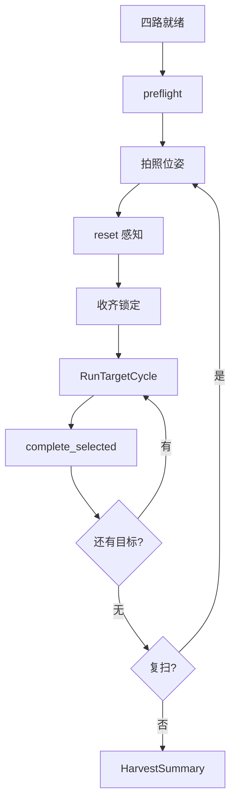

# 流程逻辑（按现行源码）

对象是套袋桃。权威参数在各包 `config/*.yaml`，不在本文重复抄默认值。

## 系统入口

`peach_harvest_orchestrator/harvest_system.launch.py` 按顺序拉起：

1. `aubo_e5_bringup` — 手臂（mock/sim/real）+ 可选相机、手眼 TF、MoveIt
2. `peach_pose_ros2` — RGB-D 感知
3. `peach_reconstruction_ros2` — 单目标局部 TSDF
4. `peach_approach_grasp` — 单目标技能（视点 / BT / MTC）
5. `peach_perception_web` — 只读监控与过程落盘
6. `peach_harvest_orchestrator` — 批次唯一所有者

编排器默认 `auto_start_enabled=true`，`execution_enabled / grasp_enabled / tool_enabled` 均为 false：就绪后可以跑感知与记账，**不派发真机运动、不打工具 IO**。

## 透传运动（sim / real）

```
FollowJointTrajectory
  → AuboPassthroughTrajectoryController
  → GPIO trajectory_passthrough
  → AuboE5Hardware::write()
  → 4 ms 发送线程重采样为 5 ms 点，RIB 流控
  → 接口板消费 → 排空后 succeed
```

关节顺序固定：`shoulder_joint, upperArm_joint, foreArm_joint, wrist1_joint, wrist2_joint, wrist3_joint`。

停止：正常完成靠队列排空；取消/抢占清队并 `RobotMoveStop`。急停只停发，安全回路在本体。禁止调用 `/aubo_dashboard/startup`。

## 批次

状态在 `peach_harvest_orchestrator` 的 `BatchState`，投影到 `HarvestState.msg`。

```
四路就绪（感知 / 重建 / 运动 Lifecycle Active / Web）
  → preflight（TF base_link→camera_link + robot_status）
  → go_to_photo_pose（SRDF `global_photo_pose`；execution 关闭则跳过移动）
  → reset_global_targets（fresh_scene 时先 clear_target_memory）
  → 感知收齐锁定 selected
  → 派发 RunTargetCycle
  → 终局记账 + complete_selected_target
  → 残局可 OBSERVE_ONLY 抬质量后再 FULL
  → 本轮空则复扫（回拍照位再锁），直到空集或 max_rounds
  → HarvestSummary，可选再回拍照位
```

人工口：`ControlHarvest`（PAUSE / RESUME / 维护 / CANCEL_NOW / SKIP_TARGET / ACKNOWLEDGE_RECOVERY），带 `expected_revision`。

## 单目标周期

`peach_approach_grasp/config/harvest_tree.xml` 主树 `PeachHarvest`：

```
PrepareCycle
  → 仅规划：PlanObservationPreview
  → 否则：ObserveScan → QualityValidate
       → OBSERVE_ONLY：观察终局
       → grasp 关：停在 READY_FOR_GRASP
       → 否则：Reconfirm → MTC 靠近插入 → 工具 → 同轴撤退
```

节点是 LifecycleNode：非 Active 拒绝运动入口。接触段默认速度 0.05，自由空间转移 0.10。MTC：自由空间 OMPL，袋内只许笛卡尔直线。

## 感知与重建

- 感知：Percipio RGB-D → YOLO 检测 → MobileSAM 分割 → 深度几何 → 空间匹配维持 `target_id` → 收齐锁定并选出 `selected`。
- 重建：按图像时间戳查精确 TF，有界 ICP 小修正，合格帧进 TSDF；拒绝帧不得进体积。

跨节点推进仍用现有服务/动作（尚未换成新 IDL）：感知 `reset/complete/clear/reopen`；能力端 `RunTargetCycle`、`go_to_photo_pose`；编排 `RunHarvest`、`ControlHarvest`。

## 过程数据

Web 节点 `record.root_dir: web_runs`（相对进程 CWD）。批次目录 `run_<时间戳>/`。历史运行在 `_archive/runs/`，分析看这些目录和现场，不靠 `colcon test`。


