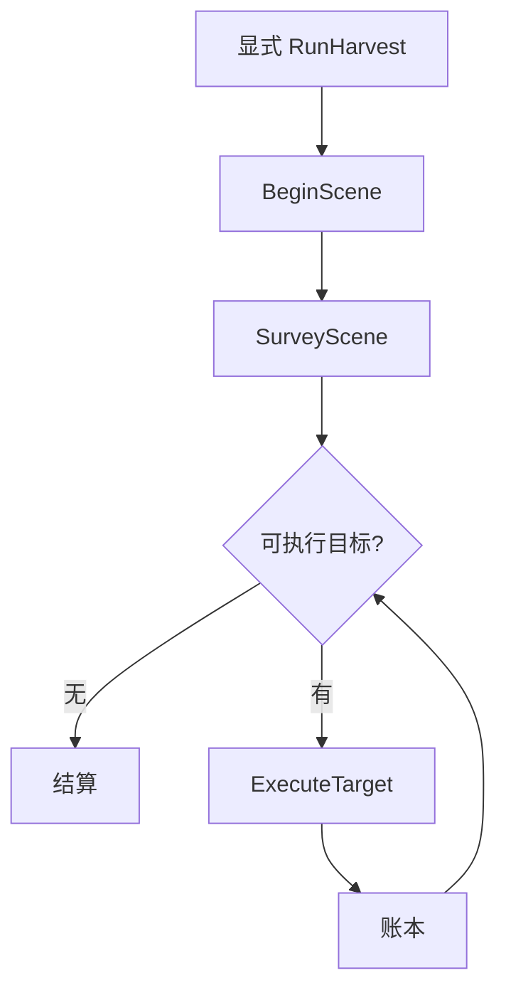

# 流程逻辑（按现行源码）

对象是套袋桃。权威参数在各包 `config/*.yaml`。

## 系统入口

`peach_task_executor/harvest_system.launch.py` 按顺序拉起：

1. `aubo_e5_bringup` — 手臂（mock/sim/real）+ 可选相机、手眼 TF、MoveIt
2. `peach_scene_perception` — RGB-D、YOLO+MobileSAM、协方差、身份、`BeginScene`
3. `peach_target_reconstruction` — 有界 ICP + TSDF，`BuildTargetModel`
4. `peach_manipulation_skills` — `SurveyScene`（拍照位姿）+ `ExecuteTarget`（观察扫描 / 再确认 / MTC / 工具）
5. `peach_observability` — 只读 Web / JSONL
6. `peach_task_executor` — 批次唯一所有者：`RunHarvest` / `ControlTask`；**launch 不自动开始**

默认 `execution_enabled=false`（执行器与技能端 yaml）。就绪后须显式 `RunHarvest`。

跨包 IDL 只在 `peach_interfaces`。公共纯核 `peach_common_py`（帧率 EMA 在感知包）。

## 透传运动（sim / real）

```
FollowJointTrajectory
  → AuboPassthroughTrajectoryController
  → GPIO trajectory_passthrough
  → AuboE5Hardware::write()
  → 4 ms 发送线程重采样为 5 ms 点，RIB 流控
  → 接口板消费 → 排空后 succeed
```

关节顺序固定：`shoulder_joint, upperArm_joint, foreArm_joint, wrist1_joint, wrist2_joint, wrist3_joint`。

停止：正常完成靠队列排空；取消/抢占清队并 `RobotMoveStop`。禁止 `/aubo_dashboard/startup`。

## 批次（显式 RunHarvest）

```
PREPARING
  → BeginScene（scene_epoch，清身份表）
  → SurveyScene（拍照位姿 + 收齐快照）
  → 选择可执行目标（goal.target_ids 或已确认观测）
  → ExecuteTarget FULL（观察扫描在行为树内；合格帧才进 TSDF）
  → TargetOutcome 账本
  → 下一目标或结算

批次不先调 `BuildTargetModel`（空会话 finalize 会失败）。该动作仍在重建节点上，供单独绑定/等视角。
```

人工口：`ControlTask`（PAUSE / RESUME / 维护 / CANCEL_NOW / SKIP_TARGET），带 `expected_state_seq`。

身份匹配：马氏门控 + 全局一对一；歧义标 `AMBIGUOUS`，不强制合并。

## 单目标周期

`peach_manipulation_skills/config/harvest_tree.xml` 主树 `PeachHarvest`：观察扫描 → 质量门 → 再确认 → MTC → 工具 → 同轴撤退。节点 Lifecycle：**非 Active 拒绝运动**。

## 过程数据

Web `record.root_dir: web_runs`。历史在 `_archive/runs/`。


