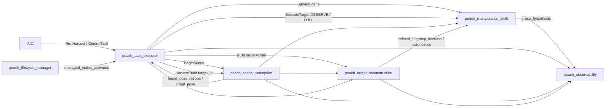
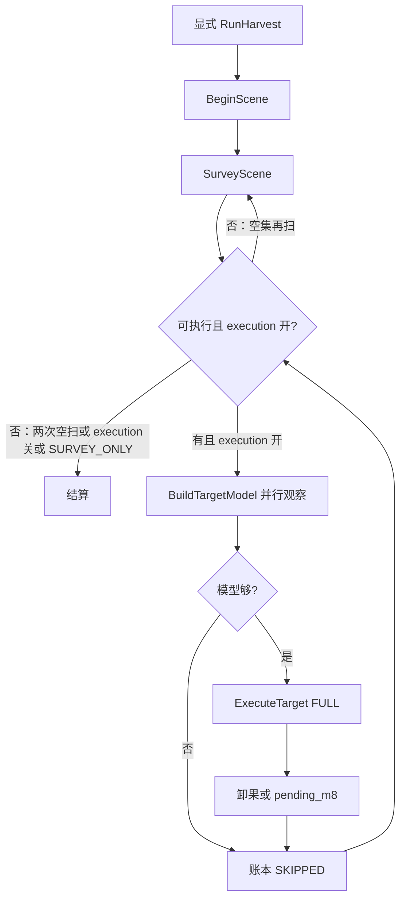

# 流程逻辑（按现行源码）

对象是套袋桃。权威参数在各包 `config/*.yaml`。跨包名字与 QoS 以 [`peach_interfaces/config/interface_manifest.yaml`](../src/peach_interfaces/config/interface_manifest.yaml) 为准，检查脚本 `python3 src/peach_interfaces/scripts/check_interface_manifest.py`。

设计文档若仍写 Robotics_Tutorial 为可迁移代码：那是 Markdown 知识库，只作**原则参考**。分割器当前是 YOLO-det + MobileSAM（可插拔）。

**怎么读本文：** 先看「调用关系」知道谁发动作；再按下表进源码；细节在各包 README。操作命令见 [usage.md](usage.md)。

## 从哪读

整栈入口永远是 `peach_task_executor`。能力包**不互相发批次命令**；它们只订阅观测 / 状态，由执行器串动作。

| 先看 | 文件 | 读什么 |
|------|------|--------|
| 批次编排 | `peach_task_executor/harvest_fsm.py` | `react(batch_state, event) → Reaction`：下一态、`command`、事件码。**禁止**在节点里手写 `batch_state` |
| 批次执行 | `peach_task_executor/executor_node.py` | `_run_harvest` 按 `Reaction.command` 调 BeginScene / Survey / Build / Execute；`_make_state` 填 `HarvestState` |
| 账本 | `peach_task_executor/ledger.py`、`summary.py` | `harvest_runs/<request_id>/ledger.json`；`HarvestSummary` |
| 生命周期 | `peach_task_executor/lifecycle_manager.py` | 感知 → 重建 → 技能 → 执行器，先 configure 再 activate |
| IDL | `peach_interfaces/action/*.action`、`srv/`、`msg/` | 字段含义；改接口只改这里 |
| 感知外壳 | `peach_scene_perception/peach_pose_node.py` | `_on_rgbd` → `_decode_rgbd` → `_process_rgbd`；`BeginScene` |
| 感知纯核 | `peach_pose/pipeline.py`、`inference.py`、`assignment.py`、`target_registry.py`、`harvest_plan.py`、`anchor_memory.py` | 检测分割、拟合、身份、锁定窗、记忆锚 |
| 重建 | `peach_target_reconstruction/reconstruction_node.py` | `_on_rgbd` / `_accept_frame`（`_crop_for_icp` → `_register_cloud` → `_integrate_tsdf`）；`BuildTargetModel` |
| 采集门 | `capture_gate.py` | 锁 → 精确 TF → 重校验 |
| 技能外壳 | `approach_grasp_node.cpp` + `approach_grasp_node_impl.hpp` | Lifecycle、`createSubscriptions/Services/Actions` |
| 技能动作 | `cycle_action.cpp` | `ExecuteTarget` / `SurveyScene` 服务器 |
| 技能树 | `config/harvest_tree.xml` + `bt_nodes.cpp` | 阶段组合 vs 节点实现 |
| 接触运动 | `grasp_task.hpp` / `grasp_task.cpp` | MTC：入口 OMPL + 直线插入；keepout BOX；工具 IO **不在**这里 |
| 拟合共用 | `peach_common_py/fitting.py` | 球/柱 RANSAC；感知 `peach_pose/fitting.py` 只再导出 |

参数：感知 `config/peach_pose.yaml`，重建 `config/reconstruction.yaml`，技能 `config/approach_grasp.yaml` + `src/approach_grasp_node_parameters.yaml`，执行器 `config/executor.yaml` + `executor_parameters.yaml`。

## 调用关系

执行器是**唯一**动作客户端（批次侧）。技能**不再**调重建 `reset`/`finalize` Trigger。



| 调用 | 服务端 | 发起方 | 何时 |
|------|--------|--------|------|
| `BeginScene` | 感知 `~/begin_scene` | 执行器 `_cmd_begin` | `Command.BEGIN_SCENE` |
| `SurveyScene` | 技能 `~/survey_scene` | `_survey_body` | `Command.SURVEY` |
| `BuildTargetModel` | 重建 `~/build_target_model` | `_cmd_dispatch` | 与 OBSERVE_ONLY **并行** |
| `ExecuteTarget` OBSERVE_ONLY | 技能 `~/execute_target` | `_cmd_dispatch` | 主动视点给重建凑 `min_views` |
| `ExecuteTarget` FULL | 技能 | `_cmd_full` | 观察+模型都过门之后 |
| `ControlTask` | 执行器 `~/control` | 人工 / Web 只读不发运动 | PAUSE / SKIP / CANCEL… |

当前作业目标以执行器 `~/state.target_id` 为准（重建绑定、感知 SAM 焦点、观测 `selected`）。`harvest_plan` 只做收齐窗口与锁定集。

## 系统入口

`peach_task_executor/launch/harvest_system.launch.py` 按顺序 **include**（能力包 `autostart:=false`）：

1. `aubo_e5_bringup` — 手臂（mock/sim/real）+ 可选相机、手眼 TF、MoveIt
2. `peach_scene_perception` — RGB-D、YOLO+MobileSAM、身份、`BeginScene`
3. `peach_target_reconstruction` — 有界 ICP + TSDF，`BuildTargetModel`
4. `peach_manipulation_skills` — `SurveyScene` + `ExecuteTarget`
5. `peach_observability` — 只读 Web / JSONL；可选 `record_mcap:=true`
6. `peach_task_executor` — `RunHarvest` / `ControlTask`；`require_managed_stack:=true`
7. `peach_lifecycle_manager` — 按 2→3→4→6 configure 再 activate，发 `/peach/lifecycle/managed_nodes_activated`

单独 `ros2 launch` 某能力包时 `autostart` 默认为 true，仍自行转换。

默认 `execution_enabled=false`（执行器与技能端 yaml）。就绪后须显式 `RunHarvest`。**launch 不自动开批。**

跨包 IDL 只在 `peach_interfaces`。公共纯核 `peach_common_py`（帧率 EMA 在感知包 `peach_pose/timing_metrics.py`）。

## 批次（显式 RunHarvest）

`harvest_fsm.react` 出命令，`executor_node` 做 ROS I/O。PAUSE 时 `_wait_pause` 卡住循环；CANCEL 级联 `_cancel_inflight`。

```
WAITING_READY
  -- RUN_REQUESTED → DISCOVERY + BeginScene
  -- BEGIN_OK → SurveyScene
  -- SURVEY_DONE → SELECT（goal.target_ids 或已确认观测）
  -- 无目标：再 Survey；连续 empty_survey_limit（默认 2）→ SETTLE
  -- intent=SURVEY_ONLY → 只扫后 SETTLE
  -- execution_enabled=false → Survey 后结算（不选目标）
  -- TARGET_SELECTED → RUNNING + DISPATCH
       并行 BuildTargetModel 与 ExecuteTarget OBSERVE_ONLY
       观察失败 → 取消 Build，账本 SKIPPED
       模型不够 → SKIPPED_QUALITY
       READY_FULL → ExecuteTarget FULL（skip_observation）
  -- FULL_* → 写账本 → CYCLE_DONE → 再 SELECT
```

PAUSE 在 Survey（去拍照）时会取消当前动作，恢复后重试；Build/FULL 接触段只标 `PAUSE_PENDING`，动作结束后再停。接触恢复未 ACK 时批次停在 `RECOVERY_REQUIRED`，不选下一颗。

身份匹配：马氏门控 + 全局一对一；歧义标 `AMBIGUOUS`，不强制合并。袋/果几何仍由感知估；`ShapeHypothesis` 由重建发，`GraspHypothesis` 由技能发。

TF **不要**统一成一种查询：

| 包 | 策略 |
|----|------|
| 重建积分 | 图像时刻 **精确 TF**；失败跳帧，禁止 latest |
| 感知几何 | 优先 stamp，失败才 latest 并打 `tf_stale` |
| 技能 / MoveIt | `tf2::TimePointZero`（当前状态） |

## 单目标周期（技能）

主树 `config/harvest_tree.xml` 的 `PeachHarvest`：

```
PrepareCycle
  → 可跳过 ObserveScan（AcquireReconstructionViews）
  → QualityValidate（等重建精化 / 质量门）
  → OBSERVE_ONLY 则 Report 结束
  → 再确认 ReconfirmTarget → MTCApproachAndInsert
  → ActuateTool（GPIO，失败就地紧急撤离）
  → MTCRetreat → DepositToStation（named 空则跳过，标 pending_m8_unload_pose）
  → CompleteTarget
```

分工：MTC（`GraspTask`）管接触段运动学与 keepout 碰撞盒；BT 管阶段与工具 IO。默认 `execution/grasp/tool=false`：只规划、不接触、不 SetIO。

`ExecuteTarget` 结果填 `HarvestResult` / `DepositResult` / `Verification` / `outcome_record`。卸果站关节须现场标定（M8）；标定前系统最高到 G9。

能力包 Lifecycle：**非 Active** 拒绝运动 / 积分 / `BeginScene`。

## 透传运动（sim / real）

```
FollowJointTrajectory
  → AuboPassthroughTrajectoryController
  → GPIO trajectory_passthrough
  → AuboE5Hardware::write()
  → 4 ms 发送线程重采样为 5 ms 点，RIB 流控
  → 接口板消费 → 排空后 succeed
```

关节顺序固定：`shoulder_joint, upperArm_joint, foreArm_joint, wrist1_joint, wrist2_joint, wrist3_joint`。

停止：正常完成靠队列排空；取消/抢占由透传控制器写 `abort`，硬件清队列并由 `ioLoop` 发 `RobotMoveStop`（失败再 `robotMoveFastStop`）。**不依赖 `aubo_dashboard`。** bringup 不起该节点；柜侧用示教器，规划/FK/IK 用 MoveIt。

## 过程数据

Web `record.root_dir: web_runs`。执行器账本 `harvest_runs/`。历史在 `_archive/runs/`。MCAP 默认关：`record_mcap:=true`。记录器按 `HarvestState.batch_state` 开关 `web_runs/run_*` 目录；事件码须与 `canonical_code_for_outcome` 一致（`target_dispatched` / `target_succeeded` / …）。


