# 输入输出

权威：源码、各包 `config/*.yaml`、[`peach_interfaces/config/interface_manifest.yaml`](../src/peach_interfaces/config/interface_manifest.yaml)。字段级目录：[peach_interfaces/README.md](../src/peach_interfaces/README.md)。清单漂移：`python3 src/peach_interfaces/scripts/check_interface_manifest.py`。与 [architecture.md](architecture.md)、[testing.md](testing.md) 构成仅有的三份活文档；**源码与本文互相更新，改接口/话题/TF 或改本文须同一轮改另一边**。真机轮次：[testing-log.md](testing-log.md)。工程整理过程：[REFACTORING.md](REFACTORING.md)（不驱动现行设计）。

对象是套袋桃。跨包只走 `peach_interfaces`。能力包不互发批次命令；作业目标只认调度 `~/state.target_id`。包职责见 [architecture.md](architecture.md) §3。

下表生产/消费名与清单一致。**名字之外须能看出功能含义**（这一口数据/命令干什么、谁据此做什么）。改接口先改 IDL 再改清单再改本文。运行参数声明在各包 `config/*_parameters.yaml`；下表只列改变作业行为的键，完整默认值与校验以 yaml 为准。

| 节 | 包 | 节点 |
|----|----|------|
| §2 | `peach_interfaces` | 无（IDL + 清单） |
| §3 | `peach_perception` | `peach_scene_perception_node`、`peach_target_reconstruction_node` |
| §4 | `peach_manipulation` | `peach_manipulation_node` |
| §5 | `peach_executor` | `peach_executor`、`peach_lifecycle_manager`、`peach_observability` |
| §6 | 驱动九包 | 臂 / 相机 / TF（只读红线见 AGENTS） |
| §7 | `serial_imu` | 可选，不进整栈 |
| §8 | 旁路视觉抓取 | `visual_pose_estimation_python`、`graspnet_ros2`（IDL=`ivg_interfaces`） |

各节点流程图在对应小节（入口 → 处理 → 输出）。跨包谁叫谁见 §1。批次时序与技能阶段序列见 [architecture.md](architecture.md) 图 C / 图 D。

---

## 1. 跨包边界

| 包 | 对外提供 | 对外消费 | 不提供 |
|----|----------|----------|--------|
| `peach_interfaces` | IDL + `interface_manifest.yaml` | — | 运行时节点 |
| `peach_perception` | `BeginScene`；`/peach/perception/*`；`BuildTargetModel`；`/peach/reconstruction/*` | RGB-D、`HarvestState`、精确 stamp TF | 运动动作、账本、选下一颗 |
| `peach_manipulation` | `SurveyScene`、`ExecuteTarget`、`CheckReachability`、`grasp_hypothesis`、预览/使能/ACK 服务 | 观测、`GraspDecision`、`refined_*` | `RunHarvest`、重建 Trigger 客户端、账本 |
| `peach_executor` | `RunHarvest`、`ControlTask`、`HarvestState`/`events`、lifecycle、只读监控 | 观测（选果，仅 `target_observations`）、动作结果 | RGB-D 处理、MoveIt 规划接触、Nav2 规划 |

导航预留（`peach_navigation` 已归档 `_archive/parked_2026-09/`）：曾提供 `NavigateToWorksite` 与 `/peach/navigation/target_report` / `arm_status` / `vehicle_state`；现仅在 manifest `reserved_interfaces` 区留名，无生产方。调度是批次侧**唯一**动作客户端。技能不调重建 `reset`/`finalize` Trigger。到位一步无导航动作：`_cmd_navigate` 固定座直通 `NAV_OK`。`harvest_plan` 只做收齐窗口与锁定集，不选下一颗。

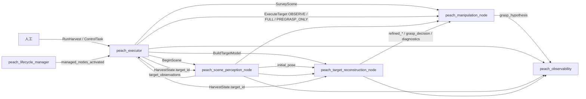

**读图：** 左到右是一次开批谁叫谁。粗箭头是动作/服务（只有调度发出）。细回流是观测和许可话题：调度只订 `target_observations` 选果；`initial_pose` 只进重建。监控在最右，只收不发。`NavigateToWorksite` 预留（图上无导航节点）；`ExecuteTarget` 干跑走 `PREGRASP_ONLY`，不是图上三种同时发。

| 调用 | 服务端 | 发起方 | 何时 |
|------|--------|--------|------|
| `NavigateToWorksite` | （预留，导航包已归档） | `_cmd_navigate` | `Command.NAVIGATE`；固定座直通 `NAV_OK`，不发送动作 |
| `CheckReachability` | `peach_manipulation_node` | `_query_reachability`（SELECT 段） | 批量 TCP IK 预检（请求=感知入口；服务端换成停位几何：后撤 + `alignFrameZ`；种子=当前关节；只答能否，不规划不动臂）；不可用回退标定半径窗 |
| `SurveyScene` | 技能 `~/survey_scene` | `_survey_body` | `Command.SURVEY`；首巡 `NAV_OK` 后，回访 `CYCLE_DONE` / `NO_TARGET` |
| `BeginScene` | 感知 `~/begin_scene` | 调度 `_cmd_begin` | 仅首巡 `SURVEY_AT_POSE` 后一次 |
| 等锁 | （消费观测） | `_wait_lock` | `Command.WAIT_LOCK`；谓词：`scene_epoch` 对齐且 `target_set_locked` |
| `BuildTargetModel` | 重建 `~/build_target_model` | `_cmd_dispatch` | 与 OBSERVE_ONLY **并行** |
| `ExecuteTarget` OBSERVE_ONLY | 技能 `~/execute_target` | `_cmd_dispatch` | 主动视点给重建凑 `min_views` 机位 |
| `ExecuteTarget` FULL | 技能 `~/execute_target` | `_cmd_full` | 观察+模型都过门之后；仅 `execute_pregrasp_only=false` |
| `ExecuteTarget` PREGRASP_ONLY | 技能 `~/execute_target` | `_cmd_full` | 默认 `execute_pregrasp_only=true` 时替代 FULL；停预抓取等 ACK |
| `ControlTask` | 调度 `~/control` | 人工（监控只读不发） | PAUSE / SKIP / CANCEL… |
| `ManageLifecycleNodes` | 管理器 `~/manage_nodes` | 人工 | STARTUP/PAUSE/RESUME/RESET/SHUTDOWN；不发 RunHarvest |

---

## 2. `peach_interfaces`

无节点、无 launch、无运行参数。跨包唯一 IDL；清单 33 active + 4 reserved，脚本双向核对。每根管子与每个字段的含义写在 [peach_interfaces/README.md](../src/peach_interfaces/README.md)。改字段只改本包，先编本包再编下游；同轮改 README、manifest 与本文。

| 动作 | 服务端所在包 | 含义 |
|------|--------------|------|
| `RunHarvest` | `peach_executor` | **开一批采摘。** launch 绝不自动发。goal：`request_id`（账本目录名，须唯一）、`scene_key`、`profile_id`（现行未消费）、`intent`（PICK_ALL / PICK_SELECTED / SURVEY_ONLY）、可选 `target_ids`。结果：至少成功一颗才 `success` |
| `NavigateToWorksite` | （预留，导航包已归档） | **走到作业位。** 固定座调度直通 `NAV_OK`，不发动作、无服务端 |
| `SurveyScene` | `peach_manipulation` | **去全局拍照位并复核关节已静止。** 给感知准备发现 FOV。PAUSE 会取消，恢复后重试。失败整批 `survey_failed`，不 Begin |
| `BuildTargetModel` | `peach_perception` | **绑一颗、收合格机位后 finalize。** 与 OBSERVE_ONLY 并行。积分只用精确 stamp TF。反馈 `view_count` 是机位数 |
| `ExecuteTarget` | `peach_manipulation` | **对当前 `target_id` 跑一周期。** `PREVIEW` 只规划；`OBSERVE_ONLY` 只补视角；`PREGRASP_ONLY` 停预抓取不 SetIO（默认干跑）；`FULL` 套入/刀/撤退。终局 `SUCCEEDED` / `SKIPPED_*` / `FAILED` / `CANCELED`。`harvest.grasped` 仅切断且撤退确认 |

| 服务 | 服务端所在包 | 含义 |
|------|--------------|------|
| `BeginScene` | `peach_perception` | **重启收齐窗。** 推进 `scene_epoch`。同 `scene_key` 保留身份；换场才清表。非 Active 拒绝。调度仅 DISCOVERY 首巡 Survey 到位后调用一次 |
| `CheckReachability` | `peach_manipulation` | **选果：入口换成与 Hold 同一停位后，当前关节种子下有没有 IK。** 位置后撤 `mtc_approach_along_axis_m`，姿态 `alignFrameZ` 不抄感知滚转。不规划、不动臂。无解记 `ik_no_solution`。服务不可用时调度回退半径窗 |
| `ControlTask` | `peach_executor` | **人工控批（监控不发）。** PAUSE / RESUME / CANCEL_NOW / SKIP_TARGET / ACKNOWLEDGE_RECOVERY。`expected_state_seq` 须对上，防过期点击 |
| `ManageLifecycleNodes` | `peach_executor` | **整栈 configure/activate/拆除。** PAUSE=节点 Inactive，不是批次暂停。不发 `RunHarvest` |

| 消息 | 含义 |
|------|------|
| `PeachTargetObservation*` | **场景里有哪些桃。** 稳定 `target_id`、跟踪态、掩膜、单帧几何；数组带 `scene_epoch`。调度据此选果（须世代对齐且已锁定）；重建据此对齐掩膜 |
| `BagGraspCandidate` / `BagFitting` | **单帧袋/果几何与拟合诊断。** `status` ACCEPT/REOBSERVE/REJECT 只当初值与画面，不发运动 |
| `HarvestState` | **批次唯一快照。** `target_id` 是感知/重建作业绑定；`batch_state` / `target_phase` 只由 FSM 推导 |
| `HarvestSummary` / `TargetOutcome` | 一批结算与单颗入账结果 |
| `CanonicalEvent` | **可检索事件流。** 派发/成功/跳过/失败/暂停/ACK；终局 `message` 带 `failure_code` |
| `SceneSnapshot` | WAIT_LOCK 结束或回访 dwell 后的锁定集快照；`scene_epoch` 须为 Begin 之后 |
| `ReconstructionStatus` | **重建心跳。** 绑定目标、机位数、基线、TF 失败次数。技能看覆盖 |
| `GraspDecision` | **融合几何 + 套入许可。** 入口/轴/预抓取/剪切参考给预抓取；`allowed` 只拦套入/剪切 |
| `PregraspVerification` | 重建侧预抓取残差观测；技能 VerifyPregrasp **未订**本话题，用工具 TF |
| `TargetModel` / `TargetQuality` | Build 结果模型与质量档 |
| `FailureCode` | 失败码枚举 |
| `ShapeHypothesis` | 契约预留形状假说；重建发，尚未当批次门 |
| `GraspHypothesis` | 技能本周期抓取假说；监控订阅，尚未当批次门 |
| `JobIntent` / `HarvestEvent` | 契约预留；`intent` 常量以 `JobIntent` 为准 |

事件码：`target_dispatched` / `target_succeeded` / `target_skipped` / `target_failed` / `target_canceled` / `target_operator_skipped` / `photo_pose_reached` / `round_locked` / `survey_failed`；人工操作审计码：`batch_paused` / `batch_resumed`（含 from/to 态）、`recovery_required`（真运动后停驻）、`recovery_acknowledged`（人工 ACK 完成）——审计码 details 带 ControlTask `reason`（请求填了才写）；选果过滤码：`targets_filtered`（details 列出超窗目标与原因 `out_of_reach_window` / `out_of_depth_window` / `ik_no_solution`）。终局目标事件的 `message` JSON 并入 outcome 细节（`failure_code` 等），summary「原因」列取之。`MatchStatus`：`OK` / `NEW` / `AMBIGUOUS` / `REJECTED`；歧义不强制合并。

导航预留（manifest `reserved_interfaces`，无生产方；调度 NAV 直通）：

| 名字 | 种类 | 含义 |
|------|------|------|
| `/peach_navigation_node/navigate_to_worksite` | action `NavigateToWorksite` | 底盘走到作业位；现行不发送 |
| `/peach/navigation/target_report` | `HarvestTargetReport` | 向导航报当前目标；无节点 |
| `/peach/navigation/vehicle_state` | `VehicleState` | 底盘位姿/速度；无节点 |
| `/peach/navigation/arm_status` | `HarvestOperationStatus` | 臂作业状态给导航；无节点 |

---

## 3. `peach_perception`

一包两节点。不发运动、不选下一颗、不写账本。感知几何优先 stamp TF，失败 latest 并 `tf_stale`；重建积分必须图像时刻精确 TF，禁止 latest。

驱动 RGB-D（§6）：

| 名字 | 含义 |
|------|------|
| `/camera/color/image_raw` | Percipio 彩色 |
| `/camera/depth/image_raw` | 配准深度（uint16 或 32FC1） |
| `/camera/color/camera_info` | 彩色内参 K |

感知/重建 ApproximateTime slop **0.05 s**。驱动 QoS 字符串 `default`（RELIABLE）；订户手写 RELIABLE、depth=10。跨包轴向后撤只改 `src/peach_perception/config/grasp_standoffs.yaml` 两行（`entry_standoff_m` / `pregrasp_standoff_m`），launch 注入各节点已声明参数。

- 深度 uint16：**raw × `depth_scale_unit=0.25` = 毫米**（Percipio）。数据集真毫米设 1.0。32FC1 按米 ×1000，该参数不生效。
- 有效深度：非 0、非 65535；管线窗约 0.3–2.5 m。禁止网络补深度；`depth_fallback` 是实测深度带连通域。
- Percipio launch **请求** `frame_rate:=5.0`。归档现场彩色流约 **2.43 fps**，感知帧间隔中位 **0.4 s ≈ 2.5 FPS**。设计节拍用实测，不把 5.0 当已测 Hz。未授权不改 Percipio `frame_rate`。
- 重建 `capture.max_views: 24` 是帧栈上限不是节拍。停稳门打开后有效视角常 4–6。

话题三类语义（最终架构 R3/R4）：**稳定流**（confirmed-only，进 RViz）`markers`、`single_cloud`、`debug_image`；**真相流**（全量含未确认，进记录层与 L2 选果，不进 RViz）`detections`、`masks`、`observations`、`initial_pose`、`debug_image_raw`（与稳定流成对落盘供筛选前后对比）；**模型流**（几何+许可）`grasp_decision`、`refined_*`、`tsdf_cloud`。豁免话题含义见 §3.1。

### 3.1 `peach_scene_perception_node`（看）

消费：RGB-D；`HarvestState`；精确或 latest TF。Lifecycle 非 Active：同步回调直接 return，不积分、不 `BeginScene`。

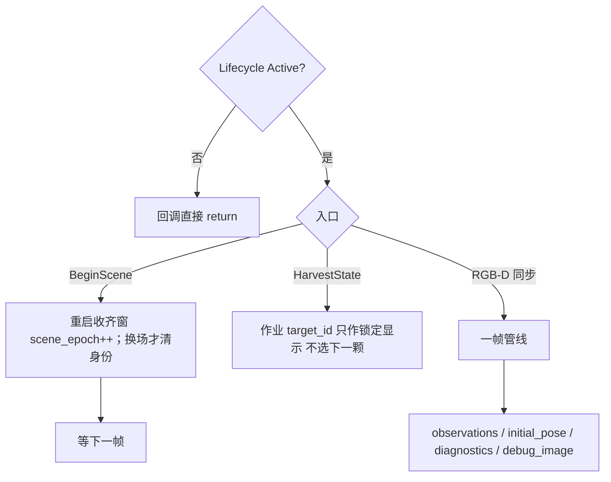

**读图：** 节点三入口。`BeginScene` 重启收齐窗；换场才清身份。`HarvestState` 只告诉「当前作业是哪颗」，不在这里选果。真正产出在 RGB-D 回调（下图）。

| 名字 | 种类 | 含义 | 生产 | 消费 |
|------|------|------|------|------|
| `/peach_scene_perception_node/begin_scene` | service | 重启收齐窗、推进 `scene_epoch`；换场才清身份 | peach_scene_perception | peach_executor |
| `/peach/perception/target_observations` | topic | 全量观测（锁定前 `observations[]` 空）：稳定 ID、跟踪态、掩膜、`scene_epoch`。调度选果须世代对齐且已锁定；重建对齐、技能新鲜度 | peach_scene_perception | peach_executor, peach_target_reconstruction, peach_manipulation, peach_observability |
| `/peach/perception/initial_pose` | topic | 单帧袋入口/轴初值。重建当起点；不授权运动 | peach_scene_perception | peach_target_reconstruction |
| `/peach/perception/diagnostics` | topic | 单帧拟合诊断（直径/RMSE/内点） | peach_scene_perception | peach_target_reconstruction |
| `/peach/perception/harvest_state` | topic | 感知侧计划 JSON（锁定集镜像，给监控） | peach_scene_perception | peach_observability |
| `/peach/perception/debug_image` | topic | 检/分割叠加（confirmed-only，进 RViz） | peach_scene_perception | peach_observability |

清单未列、源码仍发（可视化豁免）：

| 名字 | 含义 |
|------|------|
| `/peach/perception/detections` | 本帧检测框（真相流，不进 RViz） |
| `/peach/perception/debug_image_raw` | 筛选前叠加，与 `debug_image` 成对落盘 |
| `/peach/perception/masks` | SAM 像素掩膜 |
| `/peach/perception/single_cloud` | 检测框深度反投影，对 TF/深度，不是重建 |
| `/peach/perception/markers` | 锁定目标 3D：绿 ACCEPT、黄 REOBSERVE、红 REJECT |

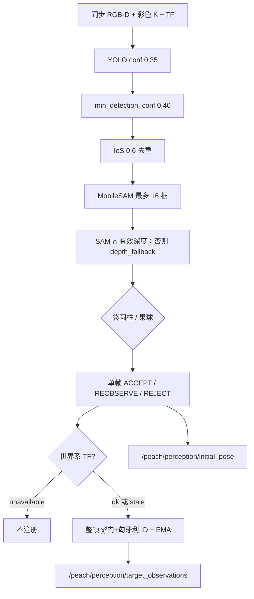

**读图：** 一帧相机数据从左到右变成「有哪些桃」。检测框 → 分割掩膜 → 袋/果几何 → 单帧门（只给画面，不授权运动）→ 有 TF 才登记世界系身份。右边两条话题：观测给调度选果和技能；初值位姿给重建当起点。

- YOLO 异常：整帧跳过，不炸 worker。无框不补假框。
- SAM 只出像素掩膜。截断超 16 框的目标常变 OCCLUDED。
- 身份：整帧一次全局 1-1 分配（`assignment.assign_detections`：同类 + 马氏 χ² 门 9≈3σ + 歧义比 1.2；`match_radius` 0.06 m 定 σ 与兜底距离）+ EMA 平滑；`tf_unavailable` 不注册。确认 `confirm_frames=5`。摆动连续 3 帧残差 >0.03 m → `target_swinging`（不可选）。
- 跟踪 token：OUT_OF_VIEW / LOST / OCCLUDED / DEPTH_VOID / OBSERVED。
- 锁定：`CollectLockPolicy`；`tf_stale` / `tf_unavailable` / `target_swinging` 不可选。锁定后新 ID 不入集。

作业参数（默认值/校验/描述权威在 `config/scene_perception_parameters.yaml`；运行 yaml 只写部署覆盖，现状为空）：

| 参数 | 含义 |
|------|------|
| `yolo_conf` / `min_detection_conf` | 检测两级置信度。过低闪框，过高逆光漏检 |
| `confirm_frames` | 累计命中才转正进锁定/候选；短暂闪现不占 ID |
| `target_memory.match_radius_m` | 同类且距离内复用同一 `target_id` |
| `harvest.min_collect_frames` / `lock_settle_frames` / `max_collect_s` | 收齐窗口：最少帧、无新 ID 稳定帧、超时兜底 |
| `pipeline.min_depth_m` / `max_depth_m` | 位姿管线有效深度窗 |
| `pipeline.bag_impl` / `fruit_impl` | 袋/果线映射名（`PIPELINES_BY_IMPL`）；其余算法直接构造 |
| `depth_scale_unit` | uint16：raw × 本值 = 毫米（Percipio 0.25） |
| `sync_slop_s` | RGB-D 近似同步允差（0.05 s） |
| `tool.entry_d_tool` / `entry_d_s` | 入口相对袋底。由 `grasp_standoffs.yaml` 注入，勿只改这里 |

### 3.2 `peach_target_reconstruction_node`（建）

消费：同一套 RGB-D；感知观测；`HarvestState.target_id`；`BuildTargetModel`。

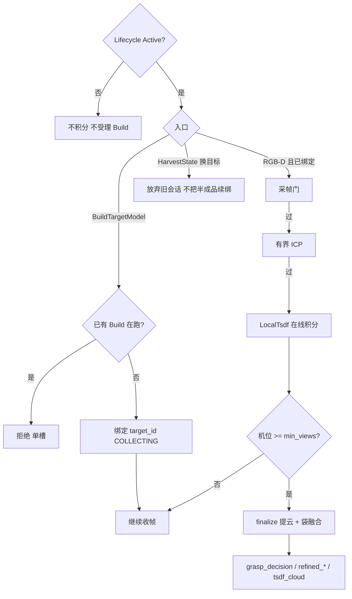

**读图：** `BuildTargetModel` 一次只绑一颗。RGB-D 过门才积分；机位够了才 finalize 出发许可话题。换目标丢旧会话。finalize 后的几何/许可分岔见下图。

| 名字 | 种类 | 含义 | 生产 | 消费 |
|------|------|------|------|------|
| `/peach_target_reconstruction_node/build_target_model` | action | 绑 `target_id`，收满机位后 finalize 出模型 | peach_target_reconstruction | peach_executor |
| `/peach/reconstruction/diagnostics` | topic | 结构化心跳：绑定态、机位数、基线、TF 失败 | peach_target_reconstruction | peach_manipulation, peach_observability |
| `/peach/reconstruction/diagnostics_debug` | topic | 调试 JSON 明细（TSDF/ICP/逐机位），不进决策 | peach_target_reconstruction | peach_observability |
| `/peach/reconstruction/status` | topic | 短状态 String（MCAP 白名单用这个，不是 diagnostics） | peach_target_reconstruction | peach_observability |
| `/peach/reconstruction/grasp_decision` | topic | 融合入口/轴/预抓取/剪切 + `allowed`（只拦套入） | peach_target_reconstruction | peach_manipulation, peach_observability |
| `/peach/reconstruction/pregrasp_verification` | topic | 重建侧残差观测；技能 VerifyPregrasp 用工具 TF，未订本话题 | peach_target_reconstruction | （观测） |
| `/peach/reconstruction/refined_pose` | topic | 融合后袋位姿（精化候选） | peach_target_reconstruction | peach_manipulation, peach_observability |
| `/peach/reconstruction/refined_axis` | topic | 融合袋轴，给监控三维 | peach_target_reconstruction | peach_observability |
| `/peach/reconstruction/refined_diagnostics` | topic | 精化拟合诊断 | peach_target_reconstruction | peach_manipulation, peach_observability |
| `/peach/reconstruction/tsdf_cloud` | topic | 绑定目标 TSDF 表面（批次结束会复位变空） | peach_target_reconstruction | peach_observability |
| `/peach/reconstruction/markers` | topic | 相机轨迹与精化示意 | peach_target_reconstruction | （可视化） |
| `/peach/reconstruction/shape_hypothesis` | topic | 形状假说（契约预留，未当批次门） | peach_target_reconstruction | （无消费方） |

采帧门（`target_reconstruction/capture_gate.py`，自动失败=skip）：满栈 → 无帧 → 掩膜 → 同 stamp → 帧龄>2 s → 静止（`/joint_states` 最大 `|vel|`>0.03 rad/s）→ 空 frame_id → **精确 TF**。

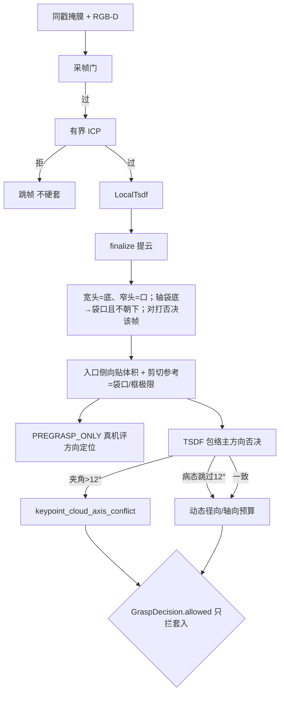

**读图：** 重建把多机位收成「这一颗怎么套」。过采帧门才积分；ICP 拒了就丢这一帧，不硬套进模型。下面分岔：左边融合几何给预抓取评方向；右边包络轴只否决、不授权。最下菱形 `allowed` **只决定能不能套入/剪切**，关了仍可去预抓取。

**两层三态不要混：**

| 层 | 字段 | 谁消费 |
|----|------|--------|
| 感知单帧 | `BagGraspCandidate.status` ACCEPT/REOBSERVE/REJECT | 初值、可视化。不发运动 |
| 融合几何 | `GraspDecision` 入口/轴/预抓取/剪切参考（融合成功即填；后撤由 `grasp_standoffs.yaml` 注入，现行入口 0=拟合袋底、预抓取相对入口 0.03 m） | `PREGRASP_ONLY` 到预抓取停住；RViz/监控目视。方向定位对错以真机预抓取实测为准。停袋底对照轮次见 [testing-log.md](testing-log.md) 1757 |
| 接触许可 | `GraspDecision.allowed` | 只授权套入/剪切；禁止降级接触 |

融合成功时 entry/axis/pregrasp/cut_pose 有效，即使 `allowed=false`。无几何时入口/轴填零，只信 `reason` / `failure_code`。常见 reason：`reconstruction_not_ready`、`refined_geometry_unavailable`、`bag_model_unavailable`、`dynamic_budget_negative`、`keypoint_cloud_axis_conflict`（包络轴与关键点轴 >12° 且包络有长径比）、`cut_plane_fruit_clearance` / `cut_band_unavailable`。`envelope_axis_ill_conditioned` / `envelope_too_few_slices` 只诊断，不单独关 `allowed`。>35° 只打 `diagnostic_axis_mismatch`，不单独把 `allowed` 打成 false。通过接触：`dynamic_budget_accept` / `refined_geometry_accept`。软件预算与夹角不代替预抓取位的真机精度评定。

`allowed=true` 之后仍可能 `skipped_quality`（再确认/预抓取残差）或 `skipped_unreachable`（MTC 护栏）。心跳里大量 `not_ready` 不等于精化从未 ACCEPT；看逐目标 max，不要看收工 IDLE。

作业参数（默认值/校验/描述权威在 `config/target_reconstruction_parameters.yaml`；运行 yaml 只写部署覆盖，现状为空）：

| 参数 | 含义 |
|------|------|
| `capture.min_views` | finalize 所需独立机位数（默认 2 = 当前位+一次短移） |
| `capture.max_views` | 帧栈上限，不是节拍 |
| `capture.require_robot_static` | `/joint_states` 最大 \|vel\| 超门则跳帧 |
| `capture.min_neighbor_gap_m` / `neighbor_gap_area_ratio` | 邻锚过近拒帧；小框面积比豁免，近距双检不互锁 |
| `tf_timeout_sec` | 按深度 stamp 精确查 TF；失败跳帧，禁止 latest |
| `refit.entry_standoff_m` / `refit.pregrasp_standoff_m` | 入口相对袋底、预抓取相对入口。只改 `grasp_standoffs.yaml` |
| `refitter.cylinder_impl` / `sphere_impl` | 柱/球精化映射名（`REFITTERS_BY_IMPL`）；其余算法直接构造 |

---

## 4. `peach_manipulation`

单节点。不写账本、不调重建 Trigger、不当 `BeginScene` / `RunHarvest` 客户端。规划 tip 为 URDF `tcp`。作业目标以 **goal.target_id** 为准。

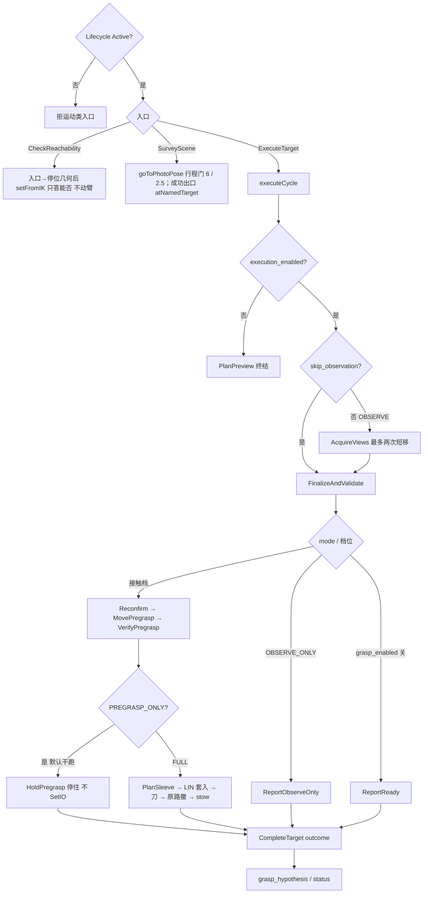

**读图：** 三个对外入口。可达性预检不动臂。拍照是 Survey。一颗桃的接触/观察全在 `executeCycle`（与 [architecture.md](architecture.md) 图 D 同构）：关执行只规划；`OBSERVE_ONLY` 看完就停；干跑默认 `PREGRASP_ONLY` 停预抓取；FULL 才套入打刀。套入/剪切前复检 `GraspDecision.allowed`。

| 名字 | 种类 | 含义 | 生产 | 消费 |
|------|------|------|------|------|
| `/peach_manipulation_node/survey_scene` | action | 去 SRDF 拍照位并复核当前关节；不重启收齐窗 | peach_manipulation | peach_executor |
| `/peach_manipulation_node/execute_target` | action | 对一颗桃：观察 / 预抓取 / 套入剪切，按 `mode` 短路 | peach_manipulation | peach_executor |
| `/peach_manipulation_node/check_reachability` | service | 批量 TCP IK：当前关节下这些位姿有没有解；不动臂 | peach_manipulation | peach_executor |
| `/peach_manipulation_node/acknowledge_recovery` | service | 技能确认停驻已看过；调度 ACK 会调它，成功才消耗 `state_seq` | peach_manipulation | peach_executor |
| `/peach/manipulation/grasp_hypothesis` | topic | 本周期抓取假说（监控三维；未当批次门） | peach_manipulation | peach_observability |
| `/peach_manipulation_node/status` | topic | 技能短状态 JSON，作业票「靠近/工具」用 | peach_manipulation | peach_observability |

另有 Trigger（未全部进清单）：

| 名字 | 含义 |
|------|------|
| `cancel_cycle` | 手动停一周期（调度走动作 cancel，不走此口；调试面在用） |
| `go_to_photo_pose` | 只回拍照位，不采锁定集 |
| `preview_approach_insert` / `preview_full_contact` | 只规划接触预览 |
| `set_execution_armed` | 本周期武装；`execution.enabled` 后每个周期还须调一次 |

订阅：感知观测；重建 `grasp_decision` / `refined_*` / `diagnostics`。柜侧：`RobotStatus` 做安全门；工具闭合调 `/aubo_io_controller/set_io`。TF：`tf2::TimePointZero`（规划下一视点，不是积分旧深度）。

`stages.cpp` 的 `executeCycle(ctx)` 显式模式 switch，周期状态全在 `CycleContext`（action 受理时创建、worker 单写者）：PrepareCycle →（`execution_enabled` 关则 PlanPreview 终结）→（未 `skip_observation` 则 AcquireViews）→ FinalizeAndValidate →（OBSERVE_ONLY → Report / `grasp_enabled` 关 → ReportReady / Reconfirm → MovePregrasp → VerifyPregrasp →（PREGRASP_ONLY 则 `HoldPregrasp` 停住 | PlanSleeve → SleeveLinear → VerifyCutHold → ActuateCutter → VerifyCut → ReverseRetreat → ReturnStow → VerifyHarvestOutcome））→ CompleteTarget。运动/IO 入口逐阶段过 `ExecutionAuthority`（套入/剪切前复检 `GraspDecision.allowed`；撤离 TRANSIT 级不做决策复检）。

- OBSERVE_ONLY：当前位先采帧；基线未过最多两次最近短移（只 LIN，失败换候选），沿当前相机直线截到 `max_camera_step_m`（默认 0.15 m），评分以行程最短为主；朝当前目标检测框内分割更满的方向微偏。禁止 OMPL、对侧兜圈、贴 0.40 m 球面环绕、PTP 兜底。覆盖门 `minimum_baseline_deg: 8`。停准则：覆盖达标或 `maximum_moves` 用尽；`time_budget_s` 只进日志，不按移动+等帧 EMA 预测收口。到位后等新机位（`view_directions` 增加），同机位连帧不加覆盖。成功：重建已绑定、独立机位已满 `min_views`、TSDF/精化已发布。观察成功但 Build `view_count`（机位数）`< min_views` → `observe_build_view_race`。`captured_views` 仍是积分帧数。
- PREGRASP_ONLY：有融合几何即去预抓取（入口在拟合袋底，预抓取相对入口后撤 0.03 m）；先 PTP 回拍照位，再只走 LIN / CIRC（直线不穿预抓取球则 LIN；未齐先 LIN 原地对齐工具 Z；直线会穿球且后撤 ≥ 5 mm 则 CIRC 再沿轴 LIN；后撤 0 不走 CIRC）。已齐 LIN 加相对目标 20° 姿态路径约束。LIN/CIRC 失败不改 PTP。拍照位失败则从当前位规划。不要求 `allowed`。工具 TF 残差超门则按**最新精化快照**重算 entry/pregrasp 做增量修正（最多两次）；残差未过门也停在预抓取（不回 `harvest_stow`），便于真机评方向/定位。任何路径不 SetIO。到位终局 `SUCCEEDED` 且 `recovery_required`，ACK 前调度不 Survey。现行不是两帧精确 TF RGB-D 重估。
- FULL：`skip_observation`。结果填 `HarvestResult` / `Verification` / `PregraspVerification` / `outcome_record`；`DepositResult` 字段保留标**预留**（卸果站已删，恒 `deposited=false`）。`harvest.grasped` 仅 `cut_confirmed && retreat_confirmed`。SetIO ACK 只产生 `CUT_COMMAND_ACCEPTED`；切断确认保守：刀具 DI 预留接 `/aubo_io_controller/io_states`，反馈未接线前 `tool.enabled=true` 终局 `FAILED`/`CUT_FEEDBACK_TIMEOUT`。
- 新鲜度门：`SafetyGate` 比较 `clock - freshnessStamp`。OBSERVED 且 `updated_s` 更新时用 `updated_s`，否则末次有效观测 `received_s`。门限 `effectiveTargetMaxAgeS()`：未测得 EMA 用 yaml 3.0 s，测得后只放宽。`assumed_frame_interval_s: 0.4` 只估等待窗口，不预填 EMA。
- 接触护栏（yaml）：绕行看累计 12 rad、单轴 6.1 rad（URDF ±3.05 满行程）；段间接缝计入 `|Δq|`。笛卡尔 **绕行比 2.2 / 弦偏离 0.25 m / 回退 0.08 m**（FK 规划 TCP）。不按时长（`mtc_approach_max_duration_s` 默认 0）。预抓取先 PTP 回拍照位，再只走 LIN / CIRC 到预抓取，再一段沿轴 LIN 套入；反向同轨迹回预抓取。已齐 LIN 加 tip 姿态 OrientationConstraint（对目标姿态，容差 `mtc_approach_max_align_deg` 20°）。未齐先 LIN 原地对齐；LIN/CIRC 失败不改 PTP。弦长/弧长上限 0.80 m。观察短移：只 LIN；行程 `observe_max_*` 4.0 rad / 1.5 rad（09-01 现场把 2.5 会拒的合法短移固化进 yaml）。`goToPhotoPose`：行程 `transit_max_*` 6 rad / 2.5 rad。成功出口核当前关节（`photo_pose_joint_tolerance_rad` / `photo_pose_max_joint_vel_rad_s`，`execute=false` 仍核）。超行程或不在拍照位不报成功。

默认 `execution/grasp/tool=false`：只规划、不接触、不 SetIO。

作业参数（默认值/校验/描述权威在 `config/manipulation_parameters.yaml`；运行 yaml 只写部署覆盖，现状为空）：

| 参数 | 含义 |
|------|------|
| `execution.enabled` | 开了才真动；每个周期还须 `set_execution_armed`。须与调度 `execution_enabled` 同时开 |
| `grasp.enabled` | 关则停在 READY、不到预抓取。开要求 execution 已开 |
| `tool.enabled` | 关则跳过 SetIO，不得宣称采摘成功 |
| `mtc_approach_along_axis_m` | 预抓取相对入口后撤。由 `grasp_standoffs.yaml` 注入，现行 0.03 m |
| `mtc_approach_max_total_joint_travel_rad` / `max_single_joint_travel_rad` | 接近绕行护栏 12 / 6.1；超则不执行 |
| `mtc_approach_max_detour_ratio` / `max_chord_deviation_m` / `max_recede_m` | 接近笛卡尔绕行 2.2 / 0.25 m / 0.08 m；超则不执行 |
| `mtc_approach_cartesian_max_distance_m` | 接触笛卡尔弦长/弧长上限 0.80 m；超过不改 PTP |
| `observe_max_total_joint_travel_rad` / `max_single_joint_travel_rad` | 观察短移护栏 4.0 / 1.5 |
| `transit_max_total_joint_travel_rad` / `max_single_joint_travel_rad` | 回拍照位护栏 6 / 2.5 |
| `max_camera_step_m` | 下一视点沿当前相机直线截步（默认 0.15 m） |
| `maximum_moves` | 观察移动次数封顶；覆盖达标即停 |
| `quality.minimum_baseline_deg` | 覆盖门 8° |
| `photo_pose_named_target` | Survey / 回拍照位的 SRDF 名（`global_photo_pose`） |
| `photo_pose_joint_tolerance_rad` / `photo_pose_max_joint_vel_rad_s` | `goToPhotoPose` 成功出口每轴 \|Δq\| / \|qdot\| 上限（默认 0.05） |

---

## 5. `peach_executor`

三节点同包。调度是批次唯一所有者；lifecycle 不发 `RunHarvest`；监控只读。

### 5.1 `peach_executor`（批）

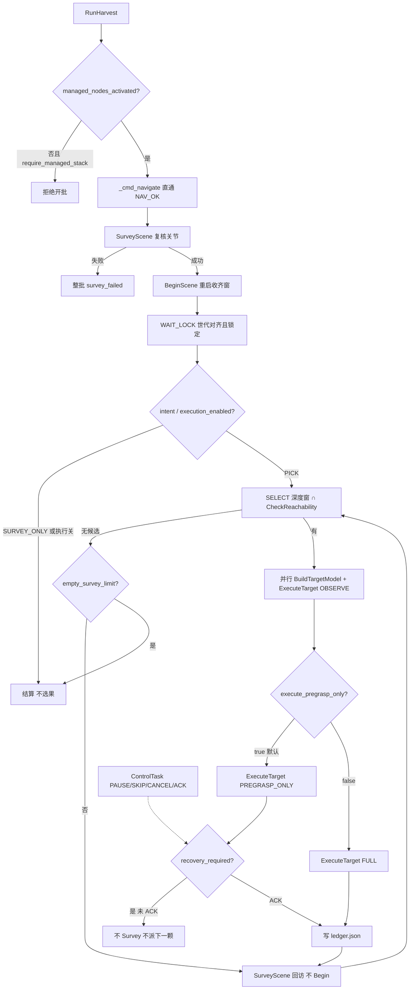

**读图：** 调度是唯一动作客户端。开批先看 lifecycle 旗标（软件就绪，不是柜侧上电）；到位无导航动作。**先到拍照位再开收齐窗**；锁定后才选果。默认停预抓取，须 ACK 才再 Survey（回访不 Begin）。状态机细节见 [architecture.md](architecture.md) 图 C。虚线是人工 `ControlTask`，监控不发。

| 名字 | 种类 | 含义 | 生产 | 消费 |
|------|------|------|------|------|
| `/peach_executor/run_harvest` | action | 显式开一批；不自动发 | peach_executor | 人工 |
| `/peach_executor/control` | service | 暂停/跳过/取消/ACK；须带对的 `state_seq` | peach_executor | 人工 |
| `/peach_executor/state` | topic | 批次快照：`target_id`、档位、`recovery_required`、permissions | peach_executor | peach_scene_perception, peach_target_reconstruction, peach_observability |
| `/peach_executor/events` | topic | 可检索事件（拍照到位/锁定/派发/终局/过滤/ACK） | peach_executor | peach_observability |
| `/peach_executor/scene_snapshot` | topic | WAIT_LOCK 或回访 dwell 后的锁定集快照 | peach_executor | （无订阅方；账本/MCAP） |

客户端（仅本节点）：`BeginScene`、`SurveyScene`、`BuildTargetModel`（与 OBSERVE_ONLY 并行）、`ExecuteTarget`、`CheckReachability`。账本：`runs/<request_id>/ledger.json`。

作业参数（默认值/校验/描述权威在 `config/executor_parameters.yaml`；运行 yaml 只写部署覆盖，现状为空）：

| 参数 | 含义 |
|------|------|
| `execution_enabled` | false：WAIT_LOCK 后结算，不选果、不派 ExecuteTarget。运行期 `ros2 param set`，不改仓库默认 |
| `execute_pregrasp_only` | true（默认）：接触槽发 PREGRASP_ONLY；false 才 FULL 套入 |
| `require_managed_stack` | 整栈 launch 为 true：未收到 lifecycle 旗标拒绝开批 |
| `survey_wait_s` | WAIT_LOCK 上限（默认 15 s） |
| `survey_dwell_s` | 已锁回访到位后驻留（默认 2 s） |
| `empty_survey_limit` | 连续空扫次数上限，到则结算 |
| `build_start_timeout_s` | Build 须在此时限内进 COLLECTING/READY，否则取消并等结束再派下一颗 |
| `selection_depth_min_m` / `selection_depth_max_m` | 选果相机距离窗（默认 0.30–1.60 m） |
| `selection_reach_min_m` / `selection_reach_max_m` | 仅 IK 服务不可用时的半径回退窗 |
| `check_reachability_service` | TCP IK 预检服务名 |

### 5.2 `peach_lifecycle_manager`（管）

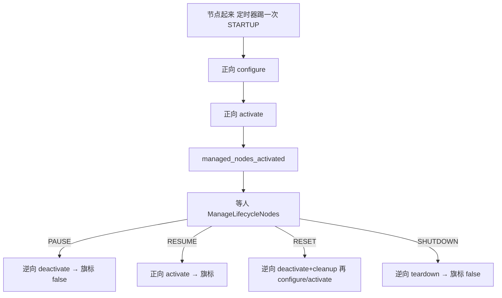

**读图：** 名单感知 → 重建 → 技能 → 调度；observability 不进名单。PAUSE 是节点 Inactive，不是批次暂停。不管柜侧上电，不发 `RunHarvest`。

| 名字 | 种类 | 含义 | 生产 | 消费 |
|------|------|------|------|------|
| `/peach_lifecycle_manager/manage_nodes` | service | STARTUP/PAUSE/RESUME/RESET/SHUTDOWN 整栈；不发 RunHarvest | peach_lifecycle_manager | 人工 |
| `/peach/lifecycle/managed_nodes_activated` | topic | 名单节点是否都 Active；调度开批闸门 | peach_lifecycle_manager | peach_executor |

名单默认：场景感知 → 重建 → 技能 → 调度。observability **不进名单**。

| 参数 | 含义 |
|------|------|
| `node_names` | 有序 configure/activate 名单 |
| `startup_timeout_s` | 单次状态转换等待上限 |

### 5.3 `peach_observability`（监）

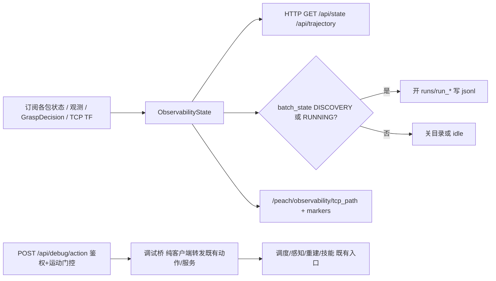

**读图：** 监控视图只收不发。状态汇进作业票和三维；批次态开合落盘目录。节点 `main()` 自行 configure/activate。调试操作面（默认三重关：`debug.enabled`/`token`/运动类另需 `debug.motion_enabled`）是**纯转发客户端**——目标全部是各包既有动作/服务，技能 ExecutionAuthority 等门照常生效；每次操作（含被拒）审计落 `runs/debug_audit/<日期>.jsonl`。

| 名字 | 种类 | 含义 | 生产 | 消费 |
|------|------|------|------|------|
| `/peach/observability/tcp_path` | topic | latest TF 末端轨迹，给 RViz Path | peach_observability | （RViz） |
| `/peach/observability/markers` | topic | TCP 路径/弦/预抓取/入口，与网页三维同源 | peach_observability | （RViz） |

监控+调试 HTTP（默认 `127.0.0.1:8090`）+ 按 `HarvestState.batch_state` 开合 `runs/run_*` jsonl。监控视图只订不发；调试 POST 受三重门（`debug.enabled` / `debug.token` / 运动类另需 `debug.motion_enabled`），全部默认关。

| 参数 | 含义 |
|------|------|
| `host` / `port` | HTTP 监听；默认回环 8090。局域网须显式 `0.0.0.0` |
| `record.enabled` | 分类落盘总开关 |
| `trajectory.enabled` | latest TF 采 TCP 轨迹（不进 MCAP） |
| `debug.enabled` / `debug.token` / `debug.motion_enabled` | 调试操作面三重门，全部默认关 |
| `debug.audit_enabled` | 审计落盘 `runs/debug_audit/`；默认开（含被拒，含 `enabled=false` 的 503） |
| `debug.endpoints.*` | 调试桥目标（18 个既有动作/服务名，GPL 默认=现行契约名） |

HTTP `/api/state` 区段：`perception` / `reconstruction` / `refined` / `manipulation` / `task_executor` / `robot`（含 `tcp` 摘要）/ `metrics` / `record` / `params` / **`job`**（当前果实作业票：过程线状态、档位、`why`、感知入口/重建中心/预抓取/抓取进入点，`base_link` 米）/ **`debug`**（三重门状态 + 最近操作环形缓冲；令牌绝不下发）。`GET /api/trajectory` 给三维页：TCP 点列、起止弦、路标、Marker 字典。监控页首屏按作业票展示，其下是末端三维（轨道相机，对照弦与入口）；抓取档关闭时靠近/工具为 gated，不是已完成。`POST /api/debug/<action>`：`enabled=false→503`、令牌不符→`401`、运动类未放行→`423`、未知端点→`404`、未知 mode/intent/command→`400`。运动类 = RunHarvest 非 `SURVEY_ONLY`、Survey、Execute 非 `PREVIEW`（`OBSERVE_ONLY` 算运动）、`go_to_photo_pose`、arm、ControlTask 的 `RESUME`/`EXIT_MAINTENANCE`。端点清单见 `config/observability_parameters.yaml` 的 `debug.endpoints.*`。

| 产物 | 路径 |
|------|------|
| 账本 | `runs/<request_id>/ledger.json` |
| 监控 jsonl | `runs/run_*`：`events`、`state`、`perception`、`reconstruction`、`manipulation`、`job`、`metrics`、`tcp_trajectory`；另有 `image_index.jsonl` |
| 重建 session | 同根；含 `geometry.jsonl`（袋底/颈/轴/剪切点/D95/预算/单帧 flags；复算脚本已归档 `_archive/offline_2026-09/`，写入保留）。三维点按 `list[float]` 写，缺失用 `is None` 回退，不得对 ndarray 用 Python `or`（真值歧义会把已积分体积回滚，RViz TSDF Cloud 变空） |
| MCAP | `runs/mcap_<时间>`，默认关 |

根：工作区 `runs/`（`peach_perception.common.harvest_data.default_runs_root`）。历史 `_archive/runs/`，不要删。记录器按 `HarvestState.batch_state` 开关 `run_*` 目录：结算只认终局 `COMPLETED` / `INTERRUPTED`（与 `harvest_fsm` 终局集一致）；`RECOVERY_REQUIRED` 等 批内等待态保持批次目录开、数据持续入 `run_*`，不提前写 summary。批次目录名先过滤 `request_id`（与账本同规则拒绝路径分隔符与父目录段，防穿越）。事件码须与 `canonical_code_for_outcome` 一致。批次结束后仍写 jsonl 是已知缺口（见 architecture 缺口表）。归档里若有 `approach.jsonl`，那是旧技能状态文件名。

MCAP（`record_mcap:=true`）白名单是 7 个话题，**无** RGB/深度/`/tf`：`events`、`state`、`scene_snapshot`、`target_observations`、`/peach/reconstruction/status`（String，不是 diagnostics）、`shape_hypothesis`、`grasp_hypothesis`。末端轨迹不进 MCAP，进 `runs/<request_id>/tcp_trajectory.jsonl`（R7 单根会话目录）。

---

## 6. 驱动层

给采摘核提供手臂、相机、TF。红线包只读。技能不直接写关节命令。

```
base_link → 臂链 → wrist3_Link
  → camera_link（extrinsics_publisher 标定权威）
     → camera_color_frame → camera_color_optical_frame（感知 yaml）
     → camera_depth_frame → camera_depth_optical_frame（深度 header、技能 yaml）
  → tool_axis → cutting_plane / tcp / sleeve_mouth / tool_body_link
     （hollow_cylinder_v1；TCP 在圆柱顶部 (0, 47.90, 151.07) mm；Rx(-90°)：Z=开口，XY=刀口；筒沿 −Z 200 mm）
```

无 `active.yaml` 时名义 TF：`wrist3_Link→camera_link` 平移 2 cm、单位四元数。现场标定约 `[0.045, 0.108, 0.002]`。驱动两光学系相对 `camera_link` 平移为 0（源码如此；未 live echo 不改名）。

不要统一成一种 TF 查询：

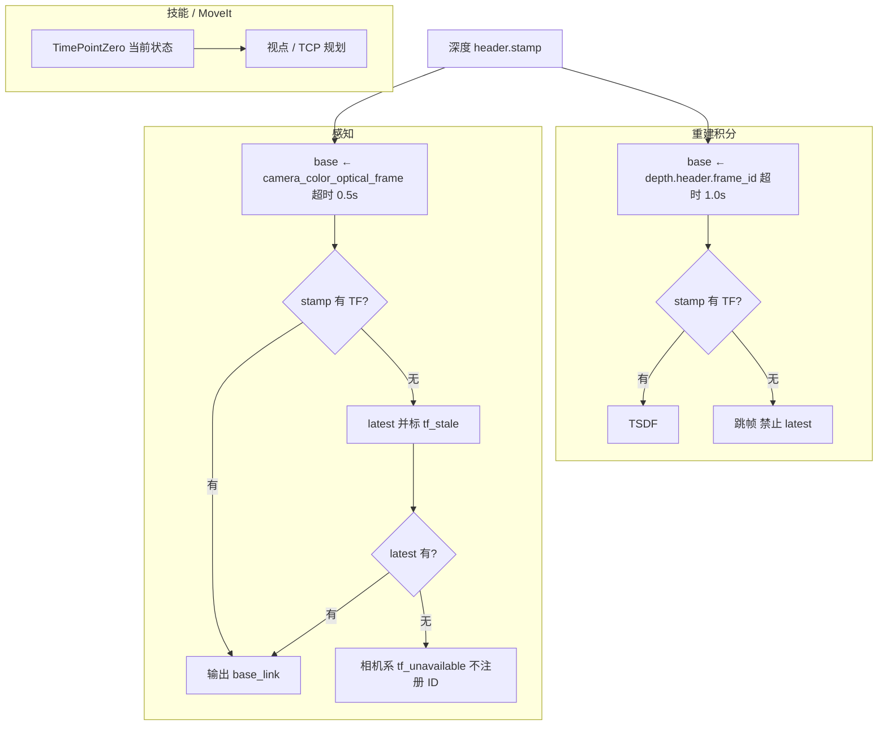

**读图：** 同一时刻的深度，三处用法不同。感知：优先图像时刻 TF，没有就用最新并打 `tf_stale`，再没有就不给这颗桃世界系 ID。重建积分：必须图像时刻精确 TF，失败直接丢帧，禁止用最新。技能规划：问「现在臂在哪」，用当前 TF，不拿旧深度去积分。

| 包 | 策略 |
|----|------|
| 重建积分 | 图像时刻精确 TF；失败跳帧，禁止 latest |
| 感知几何 | 优先 stamp，失败 latest 并 `tf_stale`；再失败不注册世界系 ID |
| 技能 | `tf2::TimePointZero`（规划下一视点，不是积分旧深度） |

归档接触轮 `tf_failures=0`。瓶颈不在 TF。

柜侧接口在 `aubo_msgs`，不是采摘业务类型：

| 名字 | 含义 |
|------|------|
| `/aubo_io_controller/robot_status` | 技能安全门：抱闸、`motion_possible`、急停 |
| `/aubo_io_controller/set_io` | 工具闭合；仅 `tool.enabled` 且 FULL 切断阶段 |
| `/joint_states` | 重建静止门、技能规划当前关节 |

采摘 IDL 在 `peach_interfaces`。

---

## 7. `serial_imu`（可选）

不在 peach 清单、采摘核不订、不进整栈 launch。

| 名字 | 含义 |
|------|------|
| `/imu/data` | 融合姿态 IMU（SensorDataQoS，`frame_id=imu_link`） |
| `/imu/data_raw` | 原始 IMU |
| `/imu/mag` | 磁力计 |
| `/imu/temp` | 温度 |

静态 TF `world`（或 `base_link`）→`imu_link`；动态 `→imu_attitude`。不并进臂链，除非 `tf_parent_frame:=base_link`。手册：[src/serial_imu/README.md](../src/serial_imu/README.md)。

---

## 8. 旁路视觉抓取（不进采摘）

不在 peach 清单、采摘核不订、不进 `harvest_system` / lifecycle。IDL 只在 `ivg_interfaces`（估姿 1 msg + 5 srv）。与采摘共用 Percipio 图像/点云与 `extrinsics_publisher` TF；检测 launch **不**再起相机或手眼节点。

### `visual_pose_estimation_python`

节点名 `visual_pose_estimation_python`。Web 另进程，默认 `http://127.0.0.1:8088/`。软触发发 `std_msgs/String` 到 `/camera/soft_trigger`（与 `percipio_camera` 一致）；无订阅者时不阻断，依赖自由出流缓存帧。`T_B_C` 优先查 `base_link` ← `camera_color_optical_frame`。Web 上 `/api/get_robot_status`、`/api/set_robot_pose`、`/api/set_robot_io`、`/api/execute_pose_sequence` 与抓取/快换路由一律 **501**（运动走 harvest 8090 调试操作面或 `graspnet_ros2`）。

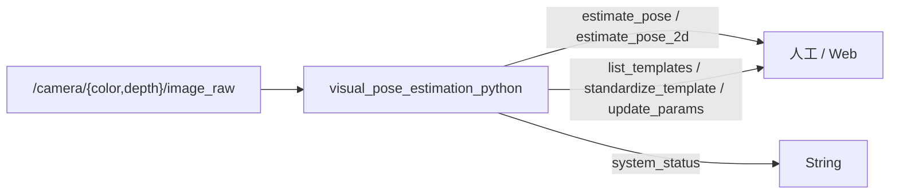

| 名字 | 含义 |
|------|------|
| `~/estimate_pose` | 深度(+可选彩色) → 6D 与抓取/放置笛卡尔位 |
| `~/estimate_pose_2d` | RGB → 像素中心与转角 |
| `~/list_templates` | 列出模板库 |
| `~/standardize_template` | 标准化某工件模板 |
| `~/update_params` | 更新算法参数段 |
| `~/system_status` | 运行日志 String |
| `/camera/color/image_raw`、`/camera/depth/image_raw` | 与采摘同一相机话题（参数可改） |
| `/camera/soft_trigger` | Percipio 软触发（`std_msgs/String`） |

模板根：launch `template_root` → 环境变量 `VPE_TEMPLATE_ROOT` → `web_ui/configs/app_config.json` → `visual_pose_estimation/templates`。

### `graspnet_ros2`

检测节点 `graspnet_demo_points_node`；执行客户端 `publish_grasps_client`（须外部 `move_group`，规划组 `manipulator_e5`、末端 `tcp`）。推理纯核 `GraspNetInference.get_grasp` 无 rclpy。采集默认待命。

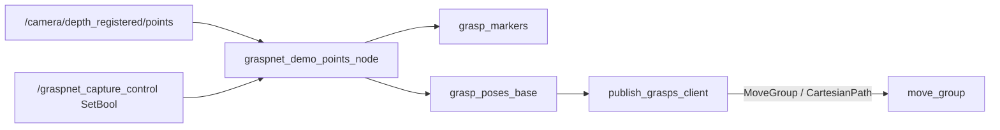

| 名字 | 含义 |
|------|------|
| `/camera/depth_registered/points` | 输入点云（与 RViz Camera Points 同名） |
| `/graspnet_capture_control` | `std_srvs/SetBool`：True 开始一组采集 |
| `grasp_markers` | 相机系 MarkerArray（兜底 frame `camera_depth_optical_frame`） |
| `grasp_poses_base` | `base_link` 系 PoseArray |
| `grasp_pose_i` | 动态 TF（候选抓取） |

`publish_grasps_client` 凑满 `min_groups_before_pick` 组后会走 MoveIt 接近。未授权不得真机运动。手册：[src/graspnet_ros2/README.md](../src/graspnet_ros2/README.md)。
