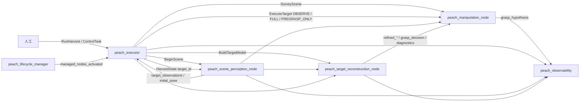
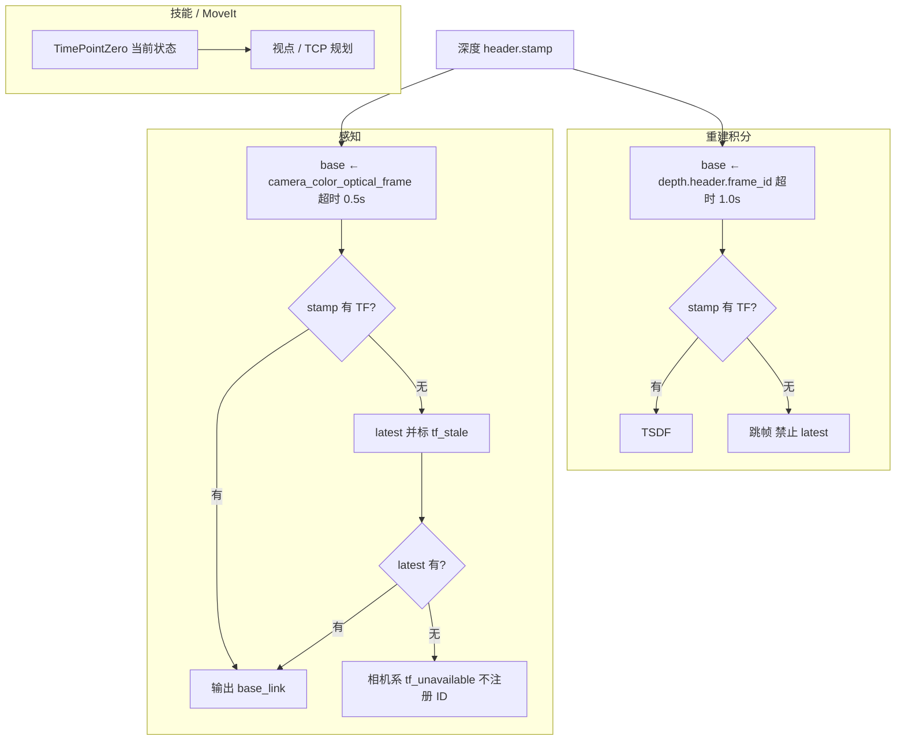
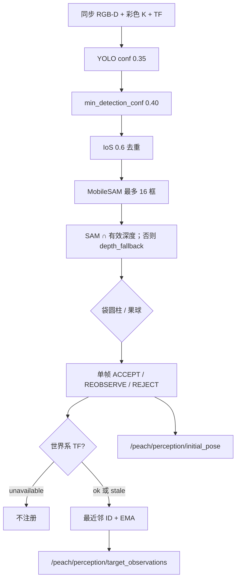
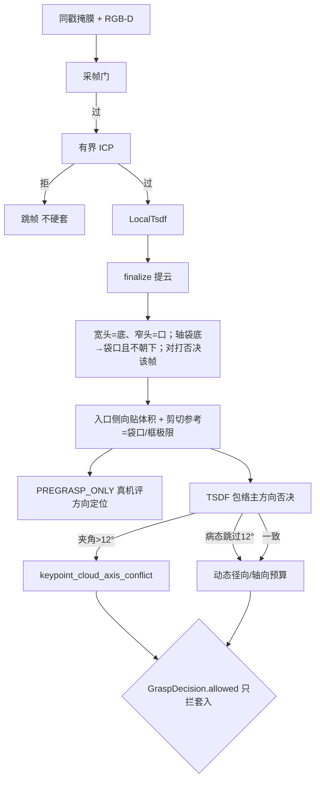

# 输入输出

权威：源码、各包 `config/*.yaml`、[`peach_interfaces/config/interface_manifest.yaml`](../src/peach_interfaces/config/interface_manifest.yaml)。清单漂移：`python3 src/peach_interfaces/scripts/check_interface_manifest.py`。与 [architecture.md](architecture.md)、[testing.md](testing.md) 构成仅有的三份活文档；**源码与本文互相更新，改接口/话题/TF 或改本文须同一轮改另一边**。

对象是套袋桃。跨包只走 `peach_interfaces`。能力包不互发批次命令；作业目标只认调度 `~/state.target_id`。

---

## 1. 谁产、谁消

四个能力包的 I/O 边界（包职责详见 [architecture.md](architecture.md) §3）：

| 包 | 对外提供 | 对外消费 | 不提供 |
|----|----------|----------|--------|
| `peach_interfaces` | IDL + `interface_manifest.yaml` | — | 运行时节点 |
| `peach_perception` | `BeginScene`；`/peach/perception/*`；`BuildTargetModel`；`/peach/reconstruction/*` | RGB-D、`HarvestState`、精确 stamp TF | 运动动作、账本、选下一颗 |
| `peach_manipulation` | `SurveyScene`、`ExecuteTarget`、`grasp_hypothesis`、预览/使能/ACK 服务 | 观测、`GraspDecision`、`refined_*` | `RunHarvest`、重建 Trigger 客户端、账本 |
| `peach_executor` | `RunHarvest`、`ControlTask`、`HarvestState`/`events`、lifecycle、只读监控 | 观测（选果）、动作结果 | RGB-D 处理、MoveIt 规划接触、Nav2 规划 |

导航预留（`peach_navigation` 已归档 `_archive/parked_2026-09/`）：曾提供 `NavigateToWorksite` 与 `/peach/navigation/target_report` / `arm_status` / `vehicle_state`；现仅在 manifest `reserved_interfaces` 区留名（`NavigateToWorksite`、`HarvestTargetReport`、`VehicleState`、`HarvestOperationStatus`），无生产方/消费方。

调度是批次侧**唯一**动作客户端。技能不调重建 `reset`/`finalize` Trigger。到位一步无导航动作：`_cmd_navigate` 固定座直通 `NAV_OK`。



**读图：** 左到右是一次开批谁叫谁。粗箭头是动作/服务（只有调度发出）。细回流是观测和许可话题。监控在最右，只收不发。`NavigateToWorksite` 预留（调度直通 `NAV_OK`，图上无导航节点）；`ExecuteTarget` 干跑走 `PREGRASP_ONLY`，不是图上三种同时发。

| 调用 | 服务端 | 发起方 | 何时 |
|------|--------|--------|------|
| `NavigateToWorksite` | （预留，导航包已归档） | `_cmd_navigate` | `Command.NAVIGATE`；固定座直通 `NAV_OK`，不发送动作 |
| `CheckReachability` | `peach_manipulation_node` | `_query_reachability`（SELECT 段） | 批量 TCP IK 预检（种子=当前关节状态；只答能否，不规划不动臂）；不可用回退标定半径窗 |
| `BeginScene` | 感知 `~/begin_scene` | 调度 `_cmd_begin` | `Command.BEGIN_SCENE` |
| `SurveyScene` | 技能 `~/survey_scene` | `_survey_body` | `Command.SURVEY` |
| `BuildTargetModel` | 重建 `~/build_target_model` | `_cmd_dispatch` | 与 OBSERVE_ONLY **并行** |
| `ExecuteTarget` OBSERVE_ONLY | 技能 `~/execute_target` | `_cmd_dispatch` | 主动视点给重建凑 `min_views` 机位 |
| `ExecuteTarget` FULL | 技能 `~/execute_target` | `_cmd_full` | 观察+模型都过门之后；仅 `execute_pregrasp_only=false` |
| `ExecuteTarget` PREGRASP_ONLY | 技能 `~/execute_target` | `_cmd_full` | 默认 `execute_pregrasp_only=true` 时替代 FULL；停预抓取等 ACK |
| `ControlTask` | 调度 `~/control` | 人工（监控只读不发） | PAUSE / SKIP / CANCEL… |
| `ManageLifecycleNodes` | 管理器 `~/manage_nodes` | 人工 | STARTUP/PAUSE/RESUME/RESET/SHUTDOWN；不发 RunHarvest |

`harvest_plan` 只做收齐窗口与锁定集，不选下一颗。

---

## 2. 清单（名称 / 类型 / QoS）

下表与 `interface_manifest.yaml` 一致。改接口先改 IDL 再改清单。

| 名字 | 种类 | 类型 | QoS（有则列出） | 生产 | 消费 |
|------|------|------|-----------------|------|------|
| `/peach_executor/state` | topic | `HarvestState` | reliable, transient_local, 1 | task_executor | task_executor, scene_perception, target_reconstruction |
| `/peach_executor/events` | topic | `CanonicalEvent` | reliable, transient_local, 50 | task_executor | task_executor |
| `/peach_executor/scene_snapshot` | topic | `SceneSnapshot` | reliable, transient_local, 1 | task_executor | task_executor |
| `/peach_executor/run_harvest` | action | `RunHarvest` | | task_executor | 人工 |
| `/peach_executor/control` | service | `ControlTask` | | task_executor | 人工 |
| `/peach/perception/target_observations` | topic | `PeachTargetObservationArray` | reliable, volatile, 10 | scene_perception | task_executor, target_reconstruction, manipulation_skills |
| `/peach/perception/initial_pose` | topic | `BagGraspCandidateArray` | reliable, transient_local, 1 | scene_perception | target_reconstruction, task_executor |
| `/peach/perception/diagnostics` | topic | `BagFittingArray` | | scene_perception | target_reconstruction, task_executor |
| `/peach/reconstruction/diagnostics` | topic | `ReconstructionStatus` | reliable, transient_local, 1 | target_reconstruction | manipulation_skills, task_executor |
| `/peach/reconstruction/grasp_decision` | topic | `GraspDecision` | reliable, transient_local, 1 | target_reconstruction | manipulation_skills, task_executor |
| `/peach/reconstruction/pregrasp_verification` | topic | `PregraspVerification` | reliable, transient_local, 1 | target_reconstruction | （观测；技能 VerifyPregrasp 用工具 TF，未订本话题） |
| `/peach/reconstruction/refined_pose` | topic | `BagGraspCandidateArray` | reliable, transient_local, 1 | target_reconstruction | manipulation_skills, task_executor |
| `/peach/reconstruction/refined_diagnostics` | topic | `BagFittingArray` | reliable, transient_local, 1 | target_reconstruction | manipulation_skills |
| `/peach/reconstruction/tsdf_cloud` | topic | `sensor_msgs/PointCloud2` | reliable, transient_local, 1 | target_reconstruction | task_executor |
| `/peach/reconstruction/markers` | topic | `MarkerArray` | reliable, transient_local, 1 | target_reconstruction | （可视化） |
| `/peach/observability/tcp_path` | topic | `nav_msgs/Path` | reliable, transient_local, 1 | peach_observability | （RViz Path；latest TF 末端） |
| `/peach/observability/markers` | topic | `MarkerArray` | reliable, transient_local, 1 | peach_observability | （RViz；TCP 路径/弦/预抓取/入口，与网页同源） |
| `/peach/reconstruction/shape_hypothesis` | topic | `ShapeHypothesis` | reliable, transient_local, 1 | target_reconstruction | task_executor |
| `/peach/manipulation/grasp_hypothesis` | topic | `GraspHypothesis` | reliable, transient_local, 1 | manipulation_skills | peach_observability |
| `/peach_scene_perception_node/begin_scene` | service | `BeginScene` | | scene_perception | task_executor |
| `/peach_manipulation_node/survey_scene` | action | `SurveyScene` | | manipulation_skills | task_executor |
| `/peach_manipulation_node/execute_target` | action | `ExecuteTarget` | | manipulation_skills | task_executor |
| `/peach_manipulation_node/check_reachability` | service | `CheckReachability` | | manipulation_skills | task_executor |
| `/peach_target_reconstruction_node/build_target_model` | action | `BuildTargetModel` | | target_reconstruction | task_executor |
| `/peach_manipulation_node/acknowledge_recovery` | service | `std_srvs/Trigger` | | manipulation_skills | task_executor |
| `/peach/lifecycle/managed_nodes_activated` | topic | `std_msgs/Bool` | reliable, transient_local, 1 | lifecycle_manager | task_executor |
| `/peach_lifecycle_manager/manage_nodes` | service | `ManageLifecycleNodes` | | lifecycle_manager | 人工 |

预留区（manifest `reserved_interfaces`，4 名，无生产方——导航包已归档，调度 NAV 直通）：`/peach_navigation_node/navigate_to_worksite`（action `NavigateToWorksite`）、`/peach/navigation/target_report`（`HarvestTargetReport`）、`/peach/navigation/vehicle_state`（`VehicleState`）、`/peach/navigation/arm_status`（`HarvestOperationStatus`）。清单脚本对 active/reserved 双向核对。

感知话题三类语义（最终架构 R3/R4）：**稳定流**（confirmed-only，进 RViz）`markers`、`single_cloud`、`debug_image`；**真相流**（全量含未确认，进记录层与 L2 选果，不进 RViz）`detections`、`masks`、`observations`、`initial_pose`、`debug_image_raw`（与稳定流成对落盘供筛选前后对比）；**模型流**（几何+许可）`grasp_decision`、`refined_*`、`tsdf_cloud`。
清单未列、源码仍发：感知 `/peach/perception/detections`、`debug_image`、`debug_image_raw`、`masks`、`single_cloud`、`markers`；重建 `String` `/peach/reconstruction/status` 与 `diagnostics_debug`。MCAP（`record_mcap:=true`）白名单是 7 个话题，**无** RGB/深度/`/tf`：`events`、`state`、`scene_snapshot`、`target_observations`、`/peach/reconstruction/status`（String，不是 diagnostics）、`shape_hypothesis`、`grasp_hypothesis`。末端轨迹不进 MCAP，进 `runs/<request_id>/tcp_trajectory.jsonl`（R7 单根会话目录）。

驱动 RGB-D：`/camera/color/image_raw`、`/camera/depth/image_raw`、`/camera/color/camera_info`。感知/重建 ApproximateTime slop **0.05 s**。驱动 QoS 字符串 `default`（RELIABLE）；订户手写 RELIABLE、depth=10。

可选 USB IMU（`serial_imu`，不在 peach 清单、采摘核不订）：`/imu/data`、`/imu/data_raw`、`/imu/mag`、`/imu/temp`。SensorDataQoS，`frame_id=imu_link`。静态 TF `world`（或 `base_link`）→`imu_link`；动态 `→imu_attitude`。手册：[src/serial_imu/README.md](../src/serial_imu/README.md)。

---

## 3. 动作、服务、消息

| 动作 | 服务端 | 作用 |
|------|--------|------|
| `RunHarvest` | task_executor | 显式开一批。goal：`request_id`、`scene_key`、`profile_id`、`intent`、`selection_mode`、可选 `target_ids` |
| `NavigateToWorksite` | （预留，导航包已归档） | 走到作业位。调度直通 `NAV_OK`，无现行服务端 |
| `SurveyScene` | manipulation_skills | 去拍照位姿 |
| `BuildTargetModel` | target_reconstruction | 绑定目标、等合格视角后 finalize |
| `ExecuteTarget` | manipulation_skills | `PREVIEW=0` / `OBSERVE_ONLY=1` / `FULL=2` / `PREGRASP_ONLY=3`。终局 `SUCCEEDED` / `SKIPPED_*` / `FAILED` / `CANCELED`。`PREGRASP_ONLY` 到位为 `SUCCEEDED` 且 `recovery_required`（`harvest.grasped` 仍 false）。`harvest.grasped` 仅切断且撤退确认。`completion_level`：NONE→HARVEST_CONFIRMED。失败码 `FailureCode.*` |

| 服务 | 服务端 | 作用 |
|------|--------|------|
| `BeginScene` | scene_perception | 清身份、推进 `scene_epoch` |
| `CheckReachability` | manipulation_skills | 选果级 TCP IK 预检（种子=当前关节状态；只答能否，不规划不动臂） |
| `ControlTask` | task_executor | PAUSE / RESUME / CANCEL / SKIP / ACK…；`expected_state_seq` 防乱序 |
| `ManageLifecycleNodes` | lifecycle_manager | 整栈生命周期。PAUSE 是 Inactive，不是批次暂停 |

技能另有 Trigger：`start_cycle`、`cancel_cycle`、`query_state`、`go_to_photo_pose`、`preview_approach_insert` / `preview_full_contact`、`set_execution_armed`、`acknowledge_recovery`。

主要消息：`PeachTargetObservation*`（身份与锁定集）、`BagGraspCandidate` / `BagFitting`、`HarvestState` / `HarvestSummary` / `TargetOutcome` / `CanonicalEvent`、`ReconstructionStatus`、`GraspDecision`、`PregraspVerification`、`TargetModel`、`TargetQuality`、`FailureCode`。事件码：`target_dispatched` / `target_succeeded` / `target_skipped` / `target_failed` / `target_canceled` / `target_operator_skipped` / `round_locked`；人工操作审计码：`batch_paused` / `batch_resumed`（含 from/to 态）、`recovery_required`（真运动后停驻）、`recovery_acknowledged`（人工 ACK 完成）；选果过滤码：`targets_filtered`（details 列出超窗目标与原因 `out_of_reach_window` / `out_of_depth_window` / `ik_no_solution`）。终局目标事件的 `message` JSON 并入 outcome 细节（`failure_code` 等），summary「原因」列取之。`MatchStatus`：`OK` / `NEW` / `AMBIGUOUS` / `REJECTED`；歧义不强制合并。

契约预留、节点尚未全部当批次门用：`JobIntent`、`ShapeHypothesis`、`GraspHypothesis`、`HarvestEvent`。`ShapeHypothesis` 由重建发，`GraspHypothesis` 由技能发。导航预留（归档，无节点）：`HarvestTargetReport` / `VehicleState` / `HarvestOperationStatus` / `NavigateToWorksite`。

---

## 4. 深度、同步、帧率

- 深度 uint16：**raw × `depth_scale_unit=0.25` = 毫米**（Percipio）。数据集真毫米设 1.0。32FC1 按米 ×1000，该参数不生效。
- 有效深度：非 0、非 65535；管线窗约 0.3–2.5 m。禁止网络补深度；`depth_fallback` 是实测深度带连通域。
- Percipio launch **请求** `frame_rate:=5.0`。归档现场彩色流约 **2.43 fps**，感知帧间隔中位 **0.4 s ≈ 2.5 FPS**。设计节拍用实测，不把 5.0 当已测 Hz，不把参考文 0.8 当现场。未授权不改 Percipio `frame_rate`。
- 重建 `capture.max_views: 24` 是帧栈上限不是节拍。停稳门打开后有效视角常 4–6。

---

## 5. TF

不要统一成一种查询。

```
base_link → 臂链 → wrist3_Link
  → camera_link（extrinsics_publisher 标定权威）
     → camera_color_frame → camera_color_optical_frame（感知 yaml）
     → camera_depth_frame → camera_depth_optical_frame（深度 header、技能 yaml）
  → tool_axis → cutting_plane / tcp / sleeve_mouth / tool_body_link
     （hollow_cylinder_v1；TCP 在圆柱顶部 (0, 47.90, 151.07) mm；Rx(-90°)：Z=开口，XY=刀口；筒沿 −Z 200 mm）
```

无 `active.yaml` 时名义 TF：`wrist3_Link→camera_link` 平移 2 cm、单位四元数。现场标定约 `[0.045, 0.108, 0.002]`。驱动两光学系相对 `camera_link` 平移为 0（源码如此；未 live echo 不改名）。

可选 USB IMU：静态 `world`（或 `base_link`）→`imu_link`，动态 `→imu_attitude`。不并进臂链，除非 `tf_parent_frame:=base_link`。



**读图：** 同一时刻的深度，三处用法不同。感知：优先图像时刻 TF，没有就用最新并打 `tf_stale`，再没有就不给这颗桃世界系 ID。重建积分：必须图像时刻精确 TF，失败直接丢帧，禁止用最新。技能规划：问「现在臂在哪」，用当前 TF，不拿旧深度去积分。

| 包 | 策略 |
|----|------|
| 重建积分 | 图像时刻精确 TF；失败跳帧，禁止 latest |
| 感知几何 | 优先 stamp，失败 latest 并 `tf_stale`；再失败不注册世界系 ID |
| 技能 | `tf2::TimePointZero`（规划下一视点，不是积分旧深度） |

归档接触轮 `tf_failures=0`。瓶颈不在 TF。

---

## 6. 感知一帧



**读图：** 一帧相机数据从左到右变成「有哪些桃」。检测框 → 分割掩膜 → 袋/果几何 → 单帧门（只给画面，不授权运动）→ 有 TF 才登记世界系身份。右边两条话题：观测给调度选果和技能；初值位姿给重建当起点。

- YOLO 异常：整帧跳过，不炸 worker。无框不补假框。
- SAM 只出像素掩膜。截断超 16 框的目标常变 OCCLUDED。
- 身份：同类 + ≤0.06 m；`tf_unavailable` 不注册。确认 `confirm_frames=5`。摆动连续 3 帧残差 >0.03 m → `target_swinging`（不可选）。
- 跟踪 token：OUT_OF_VIEW / LOST / OCCLUDED / DEPTH_VOID / OBSERVED。
- 锁定：`CollectLockPolicy`；`tf_stale` / `tf_unavailable` / `target_swinging` 不可选。锁定后新 ID 不入集。

Lifecycle 非 Active：同步回调直接 return，不积分、不 `BeginScene`。

---

## 7. 重建到抓取许可

采帧门（`target_reconstruction/capture.py`，自动失败=skip）：满栈 → 无帧 → 掩膜 → 同 stamp → 帧龄>2 s → 静止（`/joint_states` 最大 `|vel|`>0.03 rad/s）→ 空 frame_id → **精确 TF**。



**读图：** 重建把多机位收成「这一颗怎么套」。过采帧门才积分；ICP 拒了就丢这一帧，不硬套进模型。下面分岔：左边融合几何给预抓取评方向；右边包络轴只否决、不授权。最下菱形 `allowed` **只决定能不能套入/剪切**，关了仍可去预抓取。

**两层三态不要混：**

| 层 | 字段 | 谁消费 |
|----|------|--------|
| 感知单帧 | `BagGraspCandidate.status` ACCEPT/REOBSERVE/REJECT | 初值、可视化。不发运动 |
| 融合几何 | `GraspDecision` 入口/轴/预抓取/剪切参考（融合成功即填；后撤由 `grasp_standoffs.yaml` 注入，现行 0 则入口=预抓取=拟合袋底） | `PREGRASP_ONLY` 到预抓取停住；RViz/监控目视。方向定位对错以真机预抓取实测为准。09-01 1757 停袋底：`target_1` 中上水平、只需微调 |
| 接触许可 | `GraspDecision.allowed` | 只授权套入/剪切；禁止降级接触 |

融合成功时 entry/axis/pregrasp/cut_pose 有效，即使 `allowed=false`。无几何时入口/轴填零，只信 `reason` / `failure_code`。常见 reason：`reconstruction_not_ready`、`refined_geometry_unavailable`、`bag_model_unavailable`、`dynamic_budget_negative`、`keypoint_cloud_axis_conflict`（包络轴与关键点轴 >12° 且包络有长径比）、`cut_plane_fruit_clearance` / `cut_band_unavailable`。`envelope_axis_ill_conditioned` / `envelope_too_few_slices` 只诊断，不单独关 `allowed`。>35° 只打 `diagnostic_axis_mismatch`，不单独把 `allowed` 打成 false。通过接触：`dynamic_budget_accept` / `refined_geometry_accept`。软件预算与夹角不代替预抓取位的真机精度评定。

`allowed=true` 之后仍可能 `skipped_quality`（再确认/预抓取残差）或 `skipped_unreachable`（MTC 护栏）。心跳里大量 `not_ready` 不等于精化从未 ACCEPT；看逐目标 max，不要看收工 IDLE。

---

## 8. 技能周期输入输出

`stages.cpp` 的 `executeCycle(ctx)` 显式模式 switch，周期状态全在 `CycleContext`（action 受理时创建、worker 单写者）：PrepareCycle →（`execution_enabled` 关则 PlanPreview 终结）→（未 `skip_observation` 则 AcquireViews）→ FinalizeAndValidate →（OBSERVE_ONLY → Report / `grasp_enabled` 关 → ReportReady / Reconfirm → MovePregrasp → VerifyPregrasp →（PREGRASP_ONLY 则 `HoldPregrasp` 停住 | PlanSleeve → SleeveLinear → VerifyCutHold → ActuateCutter → VerifyCut → ReverseRetreat → ReturnStow → VerifyHarvestOutcome））→ CompleteTarget。运动/IO 入口逐阶段过 `ExecutionAuthority`（套入/剪切前复检 `GraspDecision.allowed`；撤离 TRANSIT 级不做决策复检）。

- OBSERVE_ONLY：当前位先采帧；基线未过最多两次最近短移（先 LIN，失败才 PTP），沿当前相机直线截到 `max_camera_step_m`（默认 0.15 m），评分以行程最短为主；朝当前目标检测框内分割更满的方向微偏。禁止 OMPL、对侧兜圈、贴 0.40 m 球面环绕。覆盖门 `minimum_baseline_deg: 8`。停准则：覆盖达标或 `maximum_moves` 用尽；`time_budget_s` 只进日志，不按移动+等帧 EMA 预测收口。到位后等新机位（`view_directions` 增加），同机位连帧不加覆盖。成功：重建已绑定、独立机位已满 `min_views`、TSDF/精化已发布。观察成功但 Build `view_count`（机位数）`< min_views` → `observe_build_view_race`。`captured_views` 仍是积分帧数。
- PREGRASP_ONLY：有融合几何即去预抓取（现行停在拟合袋底：入口=预抓取）；先 PTP 回拍照位，再按最短路径选 LIN / CIRC / PTP（短程已齐且直线不穿预抓取球则 LIN；直线会穿球且后撤 ≥ 5 mm 则 CIRC 再沿轴 LIN；后撤 0 不走 CIRC；短程未齐则 PTP 转 Z 再 LIN；远距或无 IK 则 PTP）。拍照位失败则从当前位规划。不要求 `allowed`。工具 TF 残差超门则按**最新精化快照**重算 entry/pregrasp 做增量修正（最多两次）；残差未过门也停在预抓取（不回 `harvest_stow`），便于真机评方向/定位。任何路径不 SetIO。到位终局 `SUCCEEDED` 且 `recovery_required`，ACK 前调度不 Survey。现行不是两帧精确 TF RGB-D 重估。
- FULL：`skip_observation`。结果填 `HarvestResult` / `Verification` / `PregraspVerification` / `outcome_record`；`DepositResult` 字段保留标**预留**（卸果站已删，恒 `deposited=false`）。`harvest.grasped` 仅 `cut_confirmed && retreat_confirmed`。SetIO ACK 只产生 `CUT_COMMAND_ACCEPTED`；切断确认保守：刀具 DI 预留接 `/aubo_io_controller/io_states`，反馈未接线前 `tool.enabled=true` 终局 `FAILED`/`CUT_FEEDBACK_TIMEOUT`。
- 新鲜度门：`SafetyGate` 比较 `clock - freshnessStamp`。OBSERVED 且 `updated_s` 更新时用 `updated_s`，否则末次有效观测 `received_s`。门限 `effectiveTargetMaxAgeS()`：未测得 EMA 用 yaml 3.0 s，测得后只放宽。`assumed_frame_interval_s: 0.4` 只估等待窗口，不预填 EMA。
- 接触护栏（yaml）：绕行看累计 12 rad、单轴 6.1 rad（URDF ±3.05 满行程）；段间接缝计入 `|Δq|`。不按时长（`mtc_approach_max_duration_s` 默认 0）。预抓取先 PTP 回拍照位，再按最短路径选 LIN / CIRC / PTP，再一段沿轴 LIN 套入；反向同轨迹回预抓取。PTP 回退段与 `makeMoveToEntry` 加 tip 姿态 OrientationConstraint（对目标姿态，容差 `mtc_approach_max_align_deg` 20°；Pilz PTP 忽略约束无副作用，约束对采样规划器生效）。沿轴 LIN / CIRC 弧长参考 0.15 m。观察短移：行程 `observe_max_*` 2.5 rad / 1.5 rad。`goToPhotoPose`：行程 `transit_max_*` 6 rad / 2.5 rad。超行程不执行。

默认 `execution/grasp/tool=false`：只规划、不接触、不 SetIO。

---

## 9. 过程数据落盘

根：工作区 `runs/`（`peach_perception.common.runtime.default_runs_root`）。历史 `_archive/runs/`，不要删。监控参数：运行 `peach_executor/config/observability.yaml`；声明/校验源 `config/observability_parameters.yaml`（generate_parameter_library_py）。HTTP `/api/state` 区段：`perception` / `reconstruction` / `refined` / `manipulation` / `task_executor` / `robot`（含 `tcp` 摘要）/ `metrics` / `record` / `params` / **`job`**（当前果实作业票：过程线状态、档位、`why`、感知入口/重建中心/预抓取/抓取进入点，`base_link` 米）。`GET /api/trajectory` 给三维页：TCP 点列、起止弦、路标、Marker 字典。监控页首屏按作业票展示，其下是末端三维（轨道相机，对照弦与入口）；抓取档关闭时靠近/工具为 gated，不是已完成。

| 产物 | 路径 |
|------|------|
| 账本 | `runs/<request_id>/ledger.json` |
| 监控 jsonl | `runs/run_*`：`events`、`state`、`perception`、`reconstruction`、`manipulation`、`job`、`metrics`、`tcp_trajectory`；另有 `image_index.jsonl` |
| 重建 session | 同根；含 `geometry.jsonl`（袋底/颈/轴/剪切点/D95/预算/单帧 flags，`peach_bag_baseline` 复算）。三维点按 `list[float]` 写，缺失用 `is None` 回退，不得对 ndarray 用 Python `or`（真值歧义会把已积分体积回滚，RViz TSDF Cloud 变空） |
| MCAP | `runs/mcap_<时间>`，默认关 |

记录器按 `HarvestState.batch_state` 开关 `run_*` 目录。事件码须与 `canonical_code_for_outcome` 一致。批次结束后仍写 jsonl 是已知缺口（见 architecture 缺口表）。归档里若有 `approach.jsonl`，那是旧技能状态文件名。
