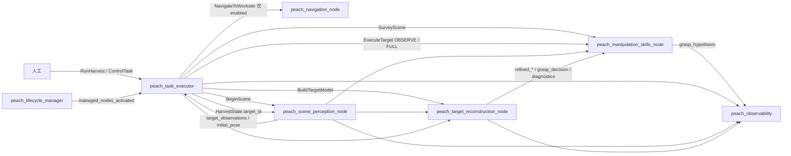
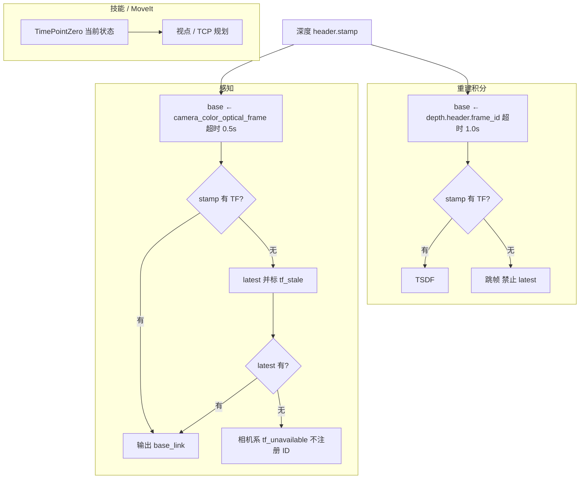
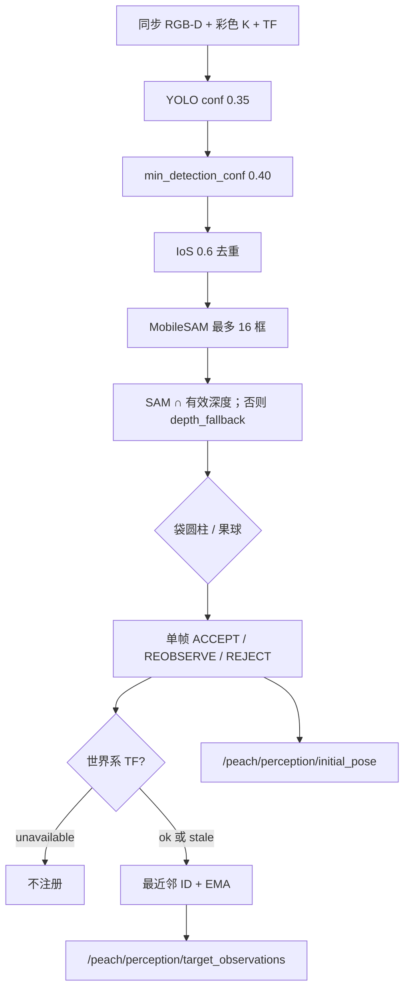
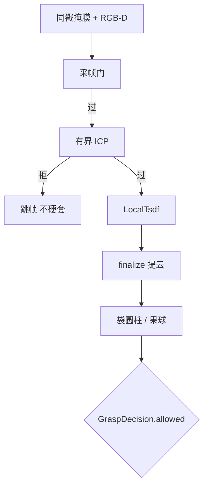

# 输入输出

权威：源码、各包 `config/*.yaml`、[`peach_interfaces/config/interface_manifest.yaml`](../src/peach_interfaces/config/interface_manifest.yaml)。清单漂移：`python3 src/peach_interfaces/scripts/check_interface_manifest.py`。与 [architecture.md](architecture.md)、[testing.md](testing.md) 构成仅有的三份活文档；**源码与本文互相更新，改接口/话题/TF 或改本文须同一轮改另一边**。

对象是套袋桃。跨包只走 `peach_interfaces`。能力包不互发批次命令；作业目标只认调度 `~/state.target_id`。

---

## 1. 谁产、谁消

五个能力包的 I/O 边界（包职责详见 [architecture.md](architecture.md) §3）：

| 包 | 对外提供 | 对外消费 | 不提供 |
|----|----------|----------|--------|
| `peach_interfaces` | IDL + `interface_manifest.yaml` | — | 运行时节点 |
| `peach_perception` | `BeginScene`；`/peach/perception/*`；`BuildTargetModel`；`/peach/reconstruction/*` | RGB-D、`HarvestState`、精确 stamp TF | 运动动作、账本、选下一颗 |
| `peach_manipulation_skills` | `SurveyScene`、`ExecuteTarget`、`grasp_hypothesis`、预览/使能/ACK 服务 | 观测、`GraspDecision`、`refined_*` | `RunHarvest`、重建 Trigger 客户端、账本 |
| `peach_navigation` | `NavigateToWorksite` | 将来：地图/`cmd_vel`（现行 stub 不订） | 账本、视觉、臂规划、底盘驱动 |
| `peach_task_executor` | `RunHarvest`、`ControlTask`、`HarvestState`/`events`、lifecycle、只读监控 | 观测（选果）、动作结果 | RGB-D 处理、MoveIt 规划接触、Nav2 规划 |

调度是批次侧**唯一**动作客户端。技能不调重建 `reset`/`finalize` Trigger。默认 `navigation_enabled=false`，开批不发送 `NavigateToWorksite`。



| 调用 | 服务端 | 发起方 | 何时 |
|------|--------|--------|------|
| `NavigateToWorksite` | 导航 `~/navigate_to_worksite` | `_cmd_navigate` | `Command.NAVIGATE`；`navigation_enabled=false` 时不发送 |
| `BeginScene` | 感知 `~/begin_scene` | 调度 `_cmd_begin` | `Command.BEGIN_SCENE` |
| `SurveyScene` | 技能 `~/survey_scene` | `_survey_body` | `Command.SURVEY` |
| `BuildTargetModel` | 重建 `~/build_target_model` | `_cmd_dispatch` | 与 OBSERVE_ONLY **并行** |
| `ExecuteTarget` OBSERVE_ONLY | 技能 `~/execute_target` | `_cmd_dispatch` | 主动视点给重建凑 `min_views` |
| `ExecuteTarget` FULL | 技能 | `_cmd_full` | 观察+模型都过门之后 |
| `ControlTask` | 调度 `~/control` | 人工（监控只读不发） | PAUSE / SKIP / CANCEL… |
| `ManageLifecycleNodes` | 管理器 `~/manage_nodes` | 人工 | STARTUP/PAUSE/RESUME/RESET/SHUTDOWN；不发 RunHarvest |

`harvest_plan` 只做收齐窗口与锁定集，不选下一颗。

---

## 2. 清单（名称 / 类型 / QoS）

下表与 `interface_manifest.yaml` 一致。改接口先改 IDL 再改清单。

| 名字 | 种类 | 类型 | QoS（有则列出） | 生产 | 消费 |
|------|------|------|-----------------|------|------|
| `/peach_task_executor/state` | topic | `HarvestState` | reliable, transient_local, 1 | task_executor | task_executor, scene_perception, target_reconstruction |
| `/peach_task_executor/events` | topic | `CanonicalEvent` | reliable, transient_local, 50 | task_executor | task_executor |
| `/peach_task_executor/scene_snapshot` | topic | `SceneSnapshot` | reliable, transient_local, 1 | task_executor | task_executor |
| `/peach_task_executor/run_harvest` | action | `RunHarvest` | | task_executor | 人工 |
| `/peach_task_executor/control` | service | `ControlTask` | | task_executor | 人工 |
| `/peach/perception/target_observations` | topic | `PeachTargetObservationArray` | reliable, volatile, 10 | scene_perception | task_executor, target_reconstruction, manipulation_skills |
| `/peach/perception/initial_pose` | topic | `BagGraspCandidateArray` | reliable, transient_local, 1 | scene_perception | target_reconstruction, task_executor |
| `/peach/perception/diagnostics` | topic | `BagFittingArray` | | scene_perception | target_reconstruction, task_executor |
| `/peach/reconstruction/diagnostics` | topic | `ReconstructionStatus` | reliable, transient_local, 1 | target_reconstruction | manipulation_skills, task_executor |
| `/peach/reconstruction/grasp_decision` | topic | `GraspDecision` | reliable, transient_local, 1 | target_reconstruction | manipulation_skills, task_executor |
| `/peach/reconstruction/refined_pose` | topic | `BagGraspCandidateArray` | reliable, transient_local, 1 | target_reconstruction | manipulation_skills, task_executor |
| `/peach/reconstruction/refined_diagnostics` | topic | `BagFittingArray` | reliable, transient_local, 1 | target_reconstruction | manipulation_skills |
| `/peach/reconstruction/tsdf_cloud` | topic | `sensor_msgs/PointCloud2` | reliable, transient_local, 1 | target_reconstruction | task_executor |
| `/peach/reconstruction/markers` | topic | `MarkerArray` | reliable, transient_local, 1 | target_reconstruction | （可视化） |
| `/peach/reconstruction/shape_hypothesis` | topic | `ShapeHypothesis` | reliable, transient_local, 1 | target_reconstruction | task_executor |
| `/peach/manipulation/grasp_hypothesis` | topic | `GraspHypothesis` | reliable, transient_local, 1 | manipulation_skills | peach_observability |
| `/peach_scene_perception_node/begin_scene` | service | `BeginScene` | | scene_perception | task_executor |
| `/peach_manipulation_skills_node/survey_scene` | action | `SurveyScene` | | manipulation_skills | task_executor |
| `/peach_navigation_node/navigate_to_worksite` | action | `NavigateToWorksite` | | navigation | task_executor |
| `/peach_manipulation_skills_node/execute_target` | action | `ExecuteTarget` | | manipulation_skills | task_executor |
| `/peach_target_reconstruction_node/build_target_model` | action | `BuildTargetModel` | | target_reconstruction | task_executor |
| `/peach_manipulation_skills_node/acknowledge_recovery` | service | `std_srvs/Trigger` | | manipulation_skills | task_executor |
| `/peach/lifecycle/managed_nodes_activated` | topic | `std_msgs/Bool` | reliable, transient_local, 1 | lifecycle_manager | task_executor |
| `/peach_lifecycle_manager/manage_nodes` | service | `ManageLifecycleNodes` | | lifecycle_manager | 人工 |

清单未列、源码仍发：感知 `/peach/perception/detections`、`debug_image`、`masks`、`single_cloud`、`markers`；重建 `String` `/peach/reconstruction/status` 与 `diagnostics_debug`。MCAP（`record_mcap:=true`）白名单是 7 个话题，**无** RGB/深度/`/tf`：`events`、`state`、`scene_snapshot`、`target_observations`、`/peach/reconstruction/status`（String，不是 diagnostics）、`shape_hypothesis`、`grasp_hypothesis`。

驱动 RGB-D：`/camera/color/image_raw`、`/camera/depth/image_raw`、`/camera/color/camera_info`。感知/重建 ApproximateTime slop **0.05 s**。驱动 QoS 字符串 `default`（RELIABLE）；订户手写 RELIABLE、depth=10。

---

## 3. 动作、服务、消息

| 动作 | 服务端 | 作用 |
|------|--------|------|
| `RunHarvest` | task_executor | 显式开一批。goal：`request_id`、`scene_key`、`profile_id`、`intent`、`selection_mode`、可选 `target_ids` |
| `NavigateToWorksite` | navigation | 走到作业位。默认调度不发；stub 回报已到位 |
| `SurveyScene` | manipulation_skills | 去拍照位姿 |
| `BuildTargetModel` | target_reconstruction | 绑定目标、等合格视角后 finalize |
| `ExecuteTarget` | manipulation_skills | `PREVIEW=0` / `OBSERVE_ONLY=1` / `FULL=2`。终局 `SUCCEEDED` / `SKIPPED_*` / `FAILED` / `CANCELED` |

| 服务 | 服务端 | 作用 |
|------|--------|------|
| `BeginScene` | scene_perception | 清身份、推进 `scene_epoch` |
| `ControlTask` | task_executor | PAUSE / RESUME / CANCEL / SKIP / ACK…；`expected_state_seq` 防乱序 |
| `ManageLifecycleNodes` | lifecycle_manager | 整栈生命周期。PAUSE 是 Inactive，不是批次暂停 |

技能另有 Trigger：`start_cycle`、`cancel_cycle`、`query_state`、`go_to_photo_pose`、预览、`set_execution_armed`、`acknowledge_recovery`。

主要消息：`PeachTargetObservation*`（身份与锁定集）、`BagGraspCandidate` / `BagFitting`、`HarvestState` / `HarvestSummary` / `TargetOutcome` / `CanonicalEvent`、`ReconstructionStatus`、`GraspDecision`、`TargetModel`、`TargetQuality`。事件码：`target_dispatched` / `target_succeeded` / `target_skipped` / `target_failed` / `target_canceled` / `target_operator_skipped` / `round_locked`。`MatchStatus`：`OK` / `NEW` / `AMBIGUOUS` / `REJECTED`；歧义不强制合并。

契约预留、节点尚未全部当批次门用：`JobIntent`、`ShapeHypothesis`、`GraspHypothesis`、`HarvestEvent`。`ShapeHypothesis` 由重建发，`GraspHypothesis` 由技能发。

---

## 4. 深度、同步、帧率

- 深度 uint16：**raw × `depth_scale_unit=0.25` = 毫米**（Percipio）。数据集真毫米设 1.0。32FC1 按米 ×1000，该参数不生效。
- 有效深度：非 0、非 65535；管线窗约 0.3–2.5 m。禁止网络补深度；`depth_fallback` 是实测深度带连通域。
- Percipio launch **请求** `frame_rate:=5.0`。归档现场彩色流约 **2.43 fps**，感知帧间隔中位 **0.4 s ≈ 2.5 FPS**。设计节拍用实测，不把 5.0 当已测 Hz，不把参考文 0.8 当现场。未授权不改 Percipio `frame_rate`。
- 重建 `capture.max_views: 24` 是帧栈上限不是节拍。停稳门打开后有效视角常 4–6。

---

## 5. TF

不要统一成一种查询。

```
base_link → 臂链 → wrist3_Link
  → camera_link（extrinsics_publisher 标定权威）
     → camera_color_frame → camera_color_optical_frame（感知 yaml）
     → camera_depth_frame → camera_depth_optical_frame（深度 header、技能 yaml）
```

无 `active.yaml` 时名义 TF：`wrist3_Link→camera_link` 平移 2 cm、单位四元数。现场标定约 `[0.045, 0.108, 0.002]`。驱动两光学系相对 `camera_link` 平移为 0（源码如此；未 live echo 不改名）。



| 包 | 策略 |
|----|------|
| 重建积分 | 图像时刻精确 TF；失败跳帧，禁止 latest |
| 感知几何 | 优先 stamp，失败 latest 并 `tf_stale`；再失败不注册世界系 ID |
| 技能 | `tf2::TimePointZero`（规划下一视点，不是积分旧深度） |

归档接触轮 `tf_failures=0`。瓶颈不在 TF。

---

## 6. 感知一帧



- YOLO 异常：整帧跳过，不炸 worker。无框不补假框。
- SAM 只出像素掩膜。截断超 16 框的目标常变 OCCLUDED。
- 身份：同类 + ≤0.06 m；`tf_unavailable` 不注册。确认 `confirm_frames=5`。摆动连续 3 帧残差 >0.03 m → `target_swinging`（不可选）。
- 跟踪 token：OUT_OF_VIEW / LOST / OCCLUDED / DEPTH_VOID / OBSERVED。
- 锁定：`CollectLockPolicy`；`tf_stale` / `tf_unavailable` / `target_swinging` 不可选。锁定后新 ID 不入集。

Lifecycle 非 Active：同步回调直接 return，不积分、不 `BeginScene`。

---

## 7. 重建到抓取许可

采帧门（`capture_gate.py`，自动失败=skip）：满栈 → 无帧 → 掩膜 → 同 stamp → 帧龄>2 s → 静止（`/joint_states` 最大 `|vel|`>0.03 rad/s）→ 空 frame_id → **精确 TF**。



**两层三态不要混：**

| 层 | 字段 | 谁消费 |
|----|------|--------|
| 感知单帧 | `BagGraspCandidate.status` ACCEPT/REOBSERVE/REJECT | 初值、可视化。不发运动 |
| 重建许可 | `GraspDecision.allowed` | 技能/调度消费入口与轴的**唯一权威** |

`allowed=false` 时 entry/axis 是占位，只信 `reason`。常见 reason：`reconstruction_not_ready`、`refined_geometry_unavailable`、`perception_reconstruction_axis_mismatch`（检测轴 vs 精化轴 >35°）、`refined_quality_requires_reobserve`。通过：`refined_geometry_accept`。

`allowed=true` 之后仍可能 `skipped_quality`（再确认）或 `skipped_unreachable`（MTC 护栏）。心跳里大量 `not_ready` 不等于精化从未 ACCEPT；看逐目标 max，不要看收工 IDLE。

---

## 8. 技能周期输入输出

主树 `PeachHarvest`：PrepareCycle → 可跳过 ObserveScan → QualityValidate →（OBSERVE_ONLY 则结束）→ ReconfirmTarget → MTCApproachAndInsert → ActuateTool → MTCRetreat → DepositToStation → CompleteTarget。

- OBSERVE_ONLY：当前位先采帧；基线未过最多两次短 PTP（对侧补角），朝当前目标检测框更完整 / 锁定集邻果更多的方向；半径保持当前相机距（画面过小才近一步）。禁止 OMPL/贴 0.40 m 球面环绕。覆盖门 `minimum_baseline_deg: 8`。到位后等新机位（`view_directions` 增加），同机位连帧不加覆盖。成功：重建已绑定、已采满 `min_views`、TSDF/精化已发布。观察成功但 Build `view_count < min_views` → `observe_build_view_race`。
- FULL：`skip_observation`。结果填 `HarvestResult` / `DepositResult` / `Verification` / `outcome_record`。
- 新鲜度门：`SafetyGate` 比较 `clock - freshnessStamp`。OBSERVED 且 `updated_s` 更新时用 `updated_s`，否则末次有效观测 `received_s`。门限 `effectiveTargetMaxAgeS()`：未测得 EMA 用 yaml 3.0 s，测得后只放宽。`assumed_frame_interval_s: 0.4` 只估等待窗口，不预填 EMA。
- 接触护栏（yaml）：接近 `mtc_approach_max_duration_s: 20`、累计 10 rad、单轴 3.2 rad；段间接缝计入 `|Δq|`。接触沿检测轴短程 LIN（预抓取后撤 `mtc_approach_along_axis_m: 0.10`）；未对轴（侧向 > 0.05 m 或姿态 > 20°）才 PTP 到预抓取点。沿轴 LIN 上限 0.15 m。观察 PTP：`observe_max_*` 8 s / 2.5 rad / 1.5 rad。`goToPhotoPose`：`transit_max_*` 25 s / 6 rad / 2.5 rad。超限不执行。

默认 `execution/grasp/tool=false`：只规划、不接触、不 SetIO。

---

## 9. 过程数据落盘

根：工作区 `runs/`（`peach_perception.common.harvest_data.default_runs_root`）。历史 `_archive/runs/`，不要删。监控参数：`peach_task_executor/config/observability.yaml`。HTTP `/api/state` 区段：`perception` / `reconstruction` / `refined` / `manipulation` / `task_executor` / `robot` / `metrics` / `record` / `params` / **`job`**（当前果实作业票：过程线状态、档位、`why`、感知入口/重建中心/抓取进入点，`base_link` 米）。监控页首屏按作业票展示；抓取档关闭时靠近/工具为 gated，不是已完成。

| 产物 | 路径 |
|------|------|
| 账本 | `runs/<request_id>/ledger.json` |
| 监控 jsonl | `runs/run_*`：`events`、`state`、`perception`、`reconstruction`、`manipulation`、`job`、`metrics`；另有 `image_index.jsonl` |
| 重建 session | 同根 |
| MCAP | `runs/mcap_<时间>`，默认关 |

记录器按 `HarvestState.batch_state` 开关 `run_*` 目录。事件码须与 `canonical_code_for_outcome` 一致。批次结束后仍写 jsonl 是已知缺口（见 architecture 缺口表）。归档里若有 `approach.jsonl`，那是旧技能状态文件名。
