# 桃子自动抓取：全流程图解与细节说明

> 本文是桃子采摘"自动抓取"链路的单一图解汇总入口：**批次编排 → 感知建档 →
> 连续重建精化 → 主动视点接近 → MTC 直线抓取/撤离**。
> 内容以源码为准（2026-08 核对）：`peach_harvest_orchestrator`、
> `peach_pose_ros2`、`peach_reconstruction_ros2`、
> `peach_approach_grasp`；操作手册见
> [docs/peach_harvest_operations.md](peach_harvest_operations.md)，感知/重建逻辑见
> [docs/peach_perception_reconstruction_logic.md](peach_perception_reconstruction_logic.md)。
>
> **当前范围**：以**套袋桃**为唯一验收主线（袋体 → 圆柱/袋轴几何 → 沿袋轴直线插入 +
> 同轴撤离）；裸桃球拟合仅保留为研究分支，不得用于工具接触。
> **交付默认**：三级使能 `execution/grasp/tool` 全关——默认只规划、
> 绝不发送运动；真机运动需现场人工 arm 并完成安全确认。

## 目录

1. [系统总览与职责边界](#1-系统总览与职责边界)
2. [批次闭环：peach_harvest_orchestrator](#2-批次闭环peach_harvest_orchestrator)
3. [感知层：peach_pose_ros2](#3-感知层peach_pose_ros2)
4. [重建层：peach_reconstruction_ros2](#4-重建层peach_reconstruction_ros2)
5. [抓取层：peach_approach_grasp](#5-抓取层peach_approach_grasp)
6. [单目标周期完整时序](#6-单目标周期完整时序)
7. [关键参数速查](#7-关键参数速查)
8. [启动、验收与常见坑点](#8-启动验收与常见坑点)
9. [遗留风险与安全边界](#9-遗留风险与安全边界)

各节图示为 mermaid 源码（支持 mermaid 的阅读器直接渲染），静态 PNG 导出见
[附录](#附录静态图导出)。

---

## 1. 系统总览与职责边界

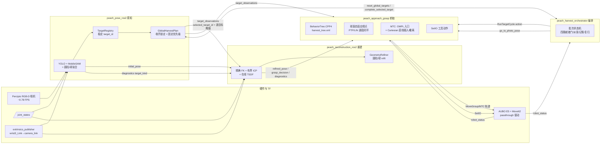

| 包 | 回答的问题 | 关键能力 | 是否发运动 |
|---|---|---|---|
| `peach_pose_ros2` | 摘哪个、在哪、怎么靠近 | 发现/稳定 ID/收齐锁定/初始位姿（单帧初值） | 否 |
| `peach_reconstruction_ros2` | 最终抓取几何是什么、能不能抓 | 多帧 TSDF 精化 + refit + 抓取许可（精化值） | 否 |
| `peach_approach_grasp` | 怎么安全地够到并摘下 | 视点循环 + MTC 接触 + 工具 IO | **是（唯一运动执行者）** |
| `peach_harvest_orchestrator` | 整批怎么排期、怎么收尾 | 批次状态机 + 派发 + 记账 + 复扫 | 否（只调服务/action） |
| `peach_perception_web` | 现场怎么看 | 只读监控台 127.0.0.1:8090 | 否 |

**三层视觉/运动语义**：二维检测负责"发现与身份"，三维重建负责"靠近后的几何精化"，
运动层（MoveIt Pilz PTP/LIN + MTC）只消费两者输出——重建不增加目标数量、不覆盖
`initial_pose`，抓取端必须用 refined 而非 initial。

---

## 2. 批次闭环：peach_harvest_orchestrator

编排器是批次**唯一所有者**：不做规划、不做感知，只把四路就绪门、批次状态机、
三级操作策略和类型化命令串成闭环。单目标运动能力委托
`RunTargetCycle` action；目标身份归感知；Web 只代理类型化命令。

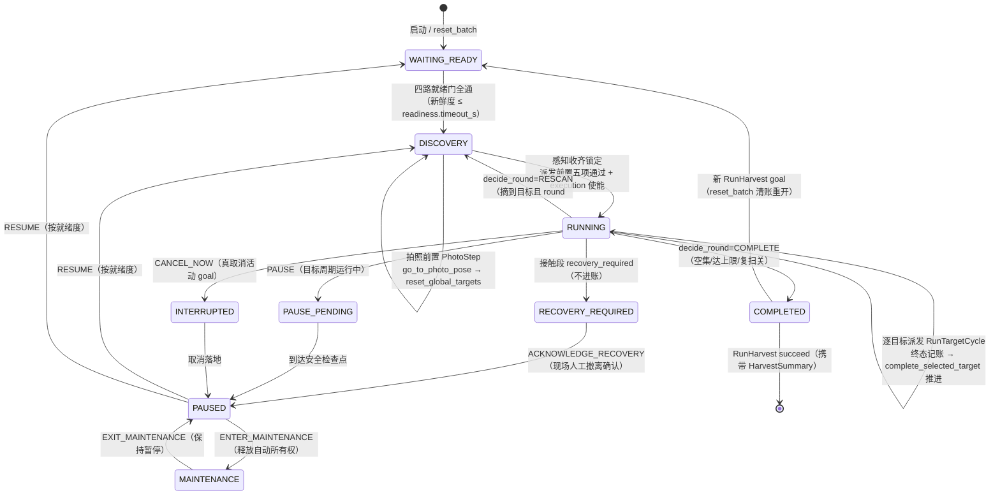

### 2.1 四路就绪门（`readiness.timeout_s=2.0` 内新鲜为通）

| 路 | 判定 | 备注 |
|---|---|---|
| perception | 观测流新鲜即可，**不要求已锁定** | 收齐窗口期不会卡回 WAITING_READY |
| reconstruction | 重建诊断流新鲜 | 重建节点有 1Hz 活性心跳（status/diagnostics/grasp_decision），无心跳时此路因 2s 新鲜度永不满足 |
| motion | RunTargetCycle action server 在线 + RobotStatus 正常 | `require_robot_status=true` 时要求：未急停、未故障、已上电、可运动 |
| web | 静态开关 `readiness.web` | |

全就绪且 `auto_start_enabled=true`（默认）时自动进入 DISCOVERY；无
RunHarvest goal 也按同一流程走批次（RunHarvest 只是带结账返回的长时入口）。

### 2.2 拍照前置（PhotoStep）

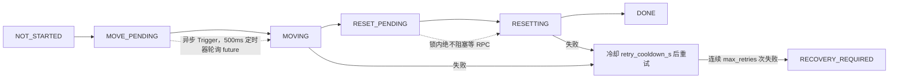

- 两步均为异步 Trigger：`go_to_photo_pose`（移动到 SRDF 命名状态
  `global_photo_pose`）→ `reset_global_targets`（重置感知收齐窗口）。
- 单次调用超时 `photo_pose.service_timeout_s=90.0`（真机移动到拍照位姿耗时数十秒，不得按普通服务超时设置）。
- `execution_enabled=false` 时自动跳过移动；**首轮**且无需移动时直接完成（不打扰感知）；
  **复扫轮即使不移动也必须 reset 感知**开启新一轮收齐。
- 批次完成后 `photo_pose.return_on_complete=true` best-effort 再回一次拍照位姿（仅记事件，不影响结论）。

### 2.3 派发与终态路由

派发前置（`allow_dispatch` 纯函数，五项齐备）：拍照前置完成、
感知 selected 非空、非重复派发、无活动目标、能力端 action server 就绪；
`begin_target` 另要求 execution 使能。goal 被能力端拒绝时冷却
`dispatch.retry_delay_s=2.0`（须 ≥ 感知帧周期，0.78FPS 下约 1.3s）
重试，`dispatch.max_retries=4` 耗尽才按不可达记账跳过。

| outcome（能力端 Result） | 产生点 | 编排器行为 |
|---|---|---|
| `SUCCEEDED` | 周期圆满（含只规划档 PLAN_READY 与未使能抓取档 READY_FOR_GRASP） | 记 succeeded，自动推进 |
| `SKIPPED_QUALITY` | finalize 后最终质量门失败 | 记 skipped_quality，自动推进 |
| `SKIPPED_UNREACHABLE` | 视角均不可达 / 扫描上限未收敛 / MTC 规划阶段失败（未启动执行） | 记 skipped_unreachable，自动推进 |
| `FAILED` | 执行失败（含 MTC 执行启动后的失败） | 记 failed，自动推进 |
| `CANCELED` | 操作员 SKIP_TARGET（goal 取消落地后记账） | 记 canceled（操作员跳过），自动推进 |

`recovery_required=true` **不进账**：批次进 RECOVERY_REQUIRED 等人工，
恢复确认前保留派发锁防止无限重派同一故障目标。

**推进权归属**：action 驱动的周期由编排器在终态后统一调
`complete_selected_target` 推进感知计划（锁外 RPC）；手动 Trigger 周期
没有编排器，由能力端自推进兜底——两条路径不会双写。

### 2.4 复扫轮次（decide_round 纯函数）

本轮锁定集合全部处理完后判定去向：

- 未锁定或本轮已处理数 < 锁定数 → `WAIT`（selected 暂空可能只是质量待恢复）；
- 本轮锁定空集 → `COMPLETE`（"本轮未锁定到目标，批次完成"）；
- 本轮摘到目标、`harvest.rescan_until_empty=true` 且
  `round < harvest.max_rounds=3` → `RESCAN`（回拍照位姿、重置感知、收齐锁定新一轮）；
- 达到 max_rounds 或复扫关闭 → `COMPLETE`。

`round` 从 1 起计，max_rounds 为总轮次上限（含首轮）。复扫是**物理递减集**：
已摘目标不在树上，新一轮收齐自然不再包含；因遮挡/质量未入集的目标在新一轮有机会被锁定。

### 2.5 RunHarvest 与 HarvestSummary

`/peach_harvest_orchestrator/run_harvest`（RunHarvest Action）：

- **单 goal 守卫**：recovery 未确认、blockers 非空、目标周期运行中、非 AUTO 模式或已有活动 goal 时拒绝。
- **终结三路径**（均携带 HarvestSummary）：批次 COMPLETED → succeed；recovery → abort；
  客户端取消 → 级联取消活动单目标 goal（最多等 5s 落安全检查点）→ canceled。
- 反馈每 200ms 携带最新 HarvestState。

HarvestSummary：`run_id / discovered / attempted / succeeded /
skipped_quality / skipped_unreachable / failed / canceled / elapsed /
outcomes[]`；状态话题的 progress = attempted / discovered（超界钳到 1）。

### 2.6 控制命令与三级操作策略

`/peach_harvest_orchestrator/control`（幂等 request_id + expected_revision 乐观锁）：

| 命令 | 行为 |
|---|---|
| `PAUSE` | 目标周期运行中先 PAUSE_PENDING，到安全检查点落 PAUSED；recovery 期间拒绝 |
| `RESUME` | 恢复 AUTO，按就绪度回 DISCOVERY/WAITING_READY；recovery 期间拒绝 |
| `ENTER/EXIT_MAINTENANCE` | 释放/收回自动所有权；退出维护保持暂停 |
| `CANCEL_NOW` | 清活动目标、进 INTERRUPTED 转 PAUSED；节点层**真取消**活动 goal（非仅置标志） |
| `SKIP_TARGET` | 仅活动目标时接受：登记跳过意图并取消当前 goal；落地后记 CANCELED 并推进 |
| `ACKNOWLEDGE_RECOVERY` | 现场人工确认已安全撤离后解除 recovery 锁定，保持 PAUSED |

三级策略（`set_operation_policy`）：依赖固定
`execution → grasp → tool`；**两阶段提交**——先下发到能力端参数服务、
复查 revision，再提交状态机；目标周期运行中拒绝修改。

---

## 3. 感知层：peach_pose_ros2

### 3.1 单帧管线

每个 ApproximateTime 同步帧（slop 0.05s）触发一次 `_on_rgbd`：

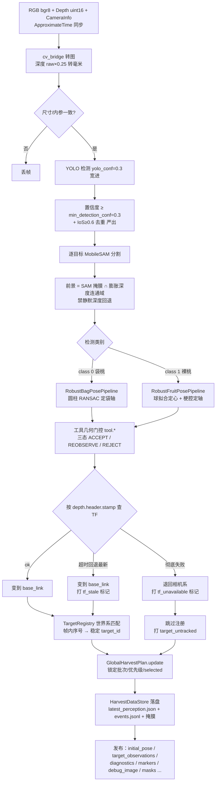

**要点**：三维结果的 `header.stamp` 一律用 **depth.header.stamp**（同步器只保证
三路落在 slop 内，连续运动中错用 RGB 时间戳会把目标变到错误位姿）；SAM 缺失时显式
REOBSERVE + `mask_unavailable`；三态逐帧独立计算，身份记忆只影响 ID 与位置平滑。

### 3.2 袋桃几何与误差预算门控（套袋验收主线）

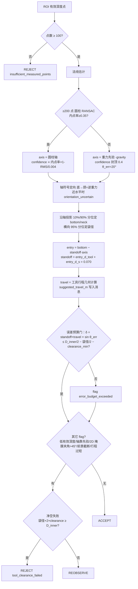

关键工具参数（`config/peach_pose.yaml`，换工具必改）：
`tool.D_inner=0.104`（内径）、`tool.L_insert=0.200`、
`tool.L_blade=0.025`、`tool.entry_d_tool=0.030`、
`tool.entry_d_s=0.040`（合计预停 0.070m）、`tool.clearance_min=0.005`、
`tool.margin_neck=0.015`。这些值直接决定安全门控（误差预算 vs 径向净空）。

### 3.3 目标身份记忆（TargetRegistry）

锚点取检测框前景点云**中位质心**（最抗掩膜抖动），依次回退 袋底 → position → 入口点；
全部缺失（几何失败帧）保留帧内序号不参与匹配。

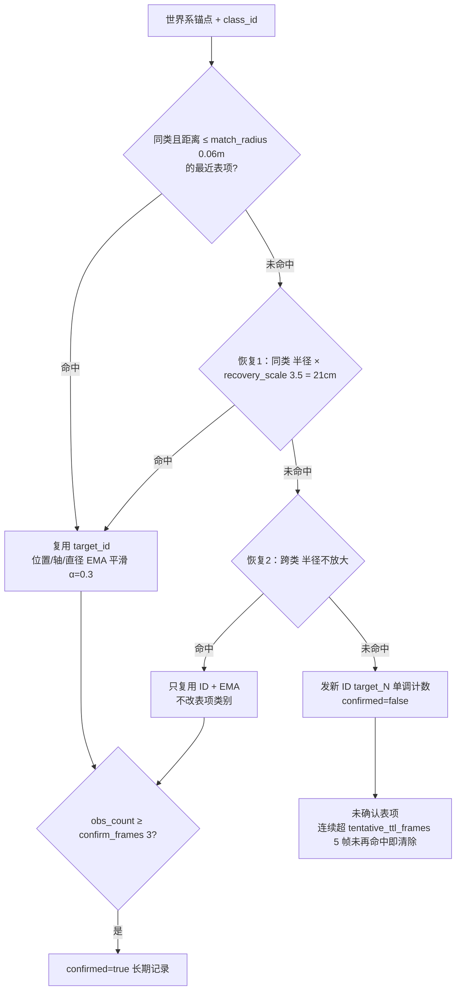

**保护语义**：同帧去重；已确认表项匹配优先于更近的未确认表项；恢复只在正常匹配
未命中时启用（常态相邻目标走 6cm，不会被 21cm 兜底误并）；`tf_unavailable`
帧跳过注册；表容量超 `max_targets=50` 按最久未见淘汰。
`recovery_scale=3.5` 是 2026-08-13 真机实测后的取值：拍照位姿（0.66m）与
环绕视点（0.28m）对同一颗桃的世界系锚点相差 **15.7cm**，2.0（12cm）会每帧发新 ID。
`tentative_ttl_frames` 按帧计（帧率自适应）：低帧率/卡顿时墙钟 TTL 会在确认
攒满前误清进度，帧计数不受帧率影响。

### 3.4 收齐式窗口锁定与固定优先级（GlobalHarvestPlan）

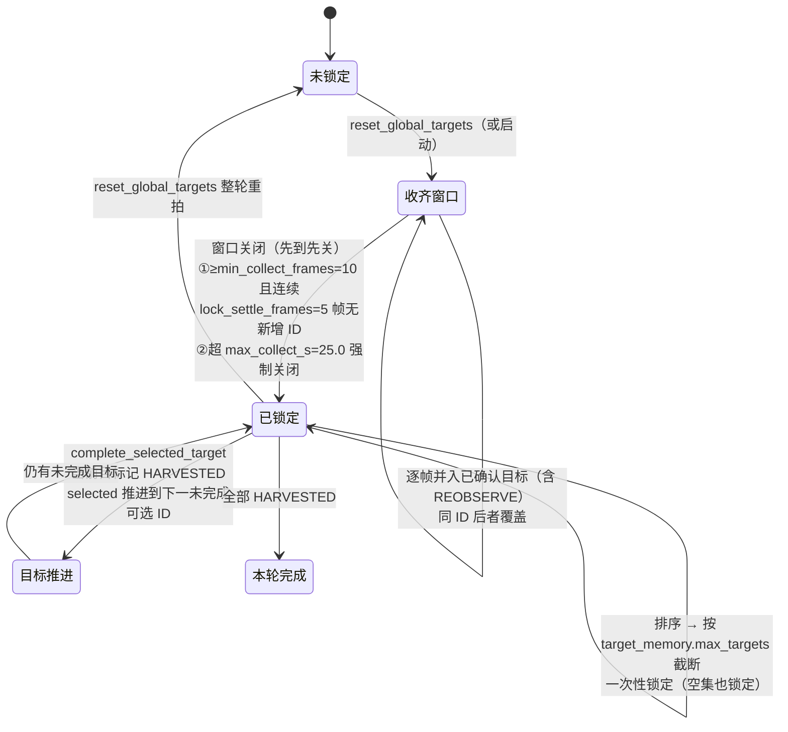

优先级排序键（升序最优先）：**status**（ACCEPT→REOBSERVE→REJECT）→
**camera_distance_m**（先近后远）→ **base_height_m**（先低后高，
`priority_prefer_lower_first=true` 时启用；Xiong/SWEEPER 采收顺序实证）
→ **−confidence** → **target_id**（字典序 tie-break，保证跨帧稳定）。

关键不变量：靠近期间目标暂时遮挡/丢失**不改变** selected_target_id；四态
`PLANNED / WAITING_QUALITY / SELECTED / HARVESTED`；可选择判定 = 有稳定 ID +
confirmed + 非 REJECT + 无 tf_stale/tf_unavailable/target_untracked 阻断标记。

---

## 4. 重建层：peach_reconstruction_ros2

### 4.1 状态机（FrameCollector，纯逻辑；节点只做接线）

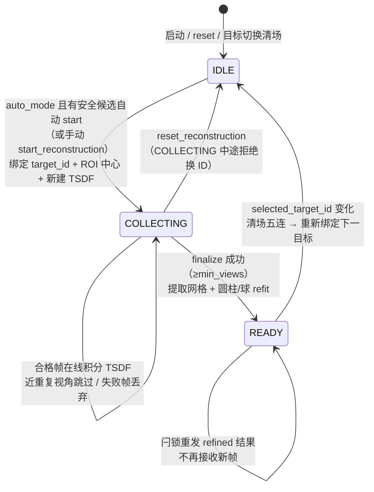

候选安全判定：消息/候选 frame_id 必须是 base_frame；不得带 tf_stale/tf_unavailable/
target_untracked；状态优先 ACCEPT，无则退非 REJECT，全 REJECT 不绑；`bag_bottom/bag_neck`
必须有限（算 ROI 中心）；preferred ID 是**严格硬过滤**——首选目标被阻断/REJECT/缺失时
返回无候选，不会改绑其他目标。

### 4.2 单帧接受链（任一环节失败该帧绝不混入模型）

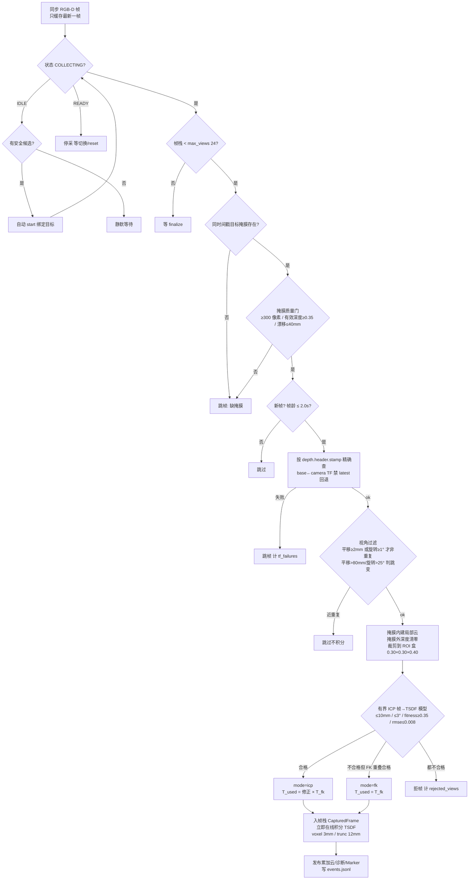

TSDF 积分异常时弹出该帧、新建空体积并**重放**此前已确认帧（ScalableTSDF 不支持
单帧移除）。自动模式跳过近重复视角；超过期望步长只告警仍可采；手动
`capture_frame` 视角检查更严格（跳变拒帧）。

### 4.3 finalize 与 refit、抓取许可

1. `collector.finalize()`：≥ `capture.min_views=4` 才转 READY；
2. 重叠指标：相邻帧最近邻统计（mean/p95 mm）；
3. TSDF 只做**提取**（ROI 裁剪 + 降采样 + 统计滤波 + marching-cubes），禁止再批量积分；
4. refit 按绑定 target_kind 选线：bag→圆柱 RANSAC / fruit→球拟合，bottom→neck 消歧，
   ACCEPT 门控（内点率≥0.35、RMSE≤0.005）；查不到 target_kind 缺省袋桃并打
   `target_kind_defaulted`；
5. 发布 refined 三件套（`refined_pose / refined_axis / refined_diagnostics`，闩锁）
   与 `grasp_decision`。

**`grasp_decision.allowed=true` 的充要条件**：状态 READY + refit 成功 +
status=ACCEPT。它只表示**视觉门**通过，不代表 MoveIt 可达性、碰撞、安全区和末端
执行器条件已通过；本包不据此发任何 MoveIt goal。

---

## 5. 抓取层：peach_approach_grasp

### 5.1 行为树周期（`config/harvest_tree.xml`，无需重编译 C++ 可调拓扑）

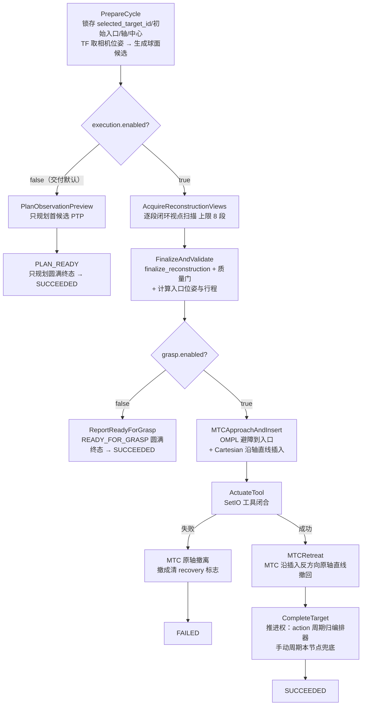

### 5.2 球面自适应视点（ViewPlanner，纯核零 ROS）

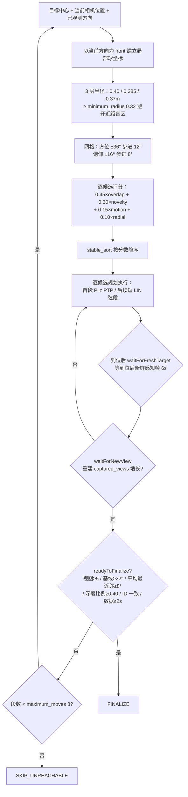

评分语义：`overlap` = 高斯围绕 **preferred_baseline_deg=15°**（新基线
既不太小也不太大）；`novelty` = 最近已观测方向的角距离/方位上限；
`motion` = 1 − 当前方向夹角/（方位+俯仰上限），运动量小者优；
`radial` = 层数贴近 desired_layer（随已观测方向数/views_to_minimum_radius=5
渐进内收）。姿态按 ROS 光学系 **+Z 朝目标**（lookAtOptical），经
`tcp ← camera_depth_optical_frame` TF 换算为 MoveIt tip 位姿。

**逐段闭环**：每到一位等待重建确实接收精确时刻 RGB-D（`scan.frame_wait_s=6.0`，
0.78FPS 下约 4-5 帧），再根据覆盖质量决定下一段——**禁止开环扫完整条曲线**。
`scan.observation_radius_m=0.40` 是实测下界：0.20–0.28m 深度偏差把世界系
锚点拉偏 15–20cm，跨视角匹配临界失配、目标身份在环绕视点后丢失。

### 5.3 MTC 接触段（GraspTask）

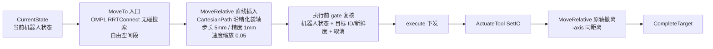

- **入口位姿**：`entry_tool_pose` = 精化 entry 平移 +
  `toolOrientation(精化轴, 初始位姿 X 列)`；再经
  `tip←tool` 逆变换得 `entry_tip_pose`（规划组 tip=tcp）。
- **行程**：优先取 `suggested_travel_m`（感知/重建端按工具几何给出的跨包契约）；
  字段无效时按 `‖neck−entry‖−neck_margin(0.015)` 回退；最终钳制
  **[0.02, 0.20]m**（`grasp.minimum/maximum_travel_m`）。
- **红线**：OMPL 只用于枝叶环境自由空间入口搜索，接触段必须保持精化轴直线，
  **禁止回退任意 OMPL 路径**；接触/撤离不回退为任意路径。
- 工具 IO 留在行为树层（MTC 只负责运动学序列），工具失败时明确进入撤离分支。
- 预览任务（`preview_approach_insert / preview_full_contact`）接口层硬编码
  `execute=false`：只规划发布到 RViz Motion Planning Tasks 面板，永不执行
  （完整预览关闭时间参数化——TOTG 不支持 180° 折返）。

### 5.4 周期状态枚举与终局映射

内部一律以 `enum class CycleState` 流转（终局判定只认枚举，状态 JSON 字符串
只是发布层投影）：`IDLE, PLAN_OBSERVATION, MOVE_TO_VIEW, WAIT_FRAME,
FINALIZE, MTC_APPROACH_INSERT, ACTUATE_TOOL, MTC_RETREAT, PREVIEW_CONTACT_PLANNING,
PREVIEW_READY, PREVIEW_FAILED, PLAN_READY, READY_FOR_GRASP, SUCCEEDED, CANCELED,
FAILED, RECOVERY_REQUIRED`。

| 终态 | 终局 |
|---|---|
| `SUCCEEDED / PREVIEW_READY / PLAN_READY / READY_FOR_GRASP` | SUCCEEDED（只规划与未使能抓取两档均为圆满终态） |
| `CANCELED` | CANCELED |
| `FAILED / PREVIEW_FAILED` | FAILED |
| `RECOVERY_REQUIRED` | RECOVERY_REQUIRED（接触段不确定，需人工） |

action Result 的 `outcome` 按失败点细分（BT 失败时记录
`pending_outcome_`）：视角均不可达/扫描上限未收敛/MTC 规划阶段失败 →
SKIPPED_UNREACHABLE；finalize 后最终质量门失败 → SKIPPED_QUALITY；执行已启动后的失败
→ FAILED。

### 5.5 安全门与恢复协议

- **一次性人工 arm**：`~/set_execution_armed`（SetBool）；周期成功/失败/取消后
  **自动解除**。
- **每段运动前**：`safetyReady`（robot_status 新鲜 ≤1s、无急停/错误/断电、
  驱动可运动）+ `cycleTargetReady`（目标 ID 不变、观测有效、≤3s 新鲜）；
  **规划后、执行前再复核一次**（规划耗时数秒，期间现场可能拍急停）。
- **RECOVERY_REQUIRED**：接触轨迹下发后取消/撤离失败 → 状态锁定、阻止新周期，
  **绝不擅自继续运动**；现场先经示教器/MoveIt 人工确认已沿安全方向撤离，再调
  `~/acknowledge_recovery`（只清状态、不发运动）。
- 明确不做：不上电、不松刹车、不恢复安全停止、不调 `/aubo_dashboard/startup`。
- 环境风动枝叶属动态障碍：当前仅依赖规划场景 + 逐帧目标可见性。

### 5.6 服务与话题清单

| 接口 | 类型 | 用途 |
|---|---|---|
| `~/run_target_cycle` | RunTargetCycle action | 单目标周期（mode：PREVIEW=0 / OBSERVE_ONLY=1 / FULL=2；OBSERVE_ONLY 只走观察+精化验证段后落 PLAN_READY 报 SUCCEEDED；goal 目标须等于当前缓存 selected） |
| `~/start_cycle` / `~/cancel_cycle` | Trigger | 手动启动（需单独 arm）/取消周期 |
| `~/set_execution_armed` | SetBool | 一次性人工 arm |
| `~/acknowledge_recovery` | Trigger | 确认人工撤离（不发运动） |
| `~/preview_approach_insert` / `~/preview_full_contact` | Trigger | MTC 接触轨迹只规划预览 |
| `~/go_to_photo_pose` | Trigger | 移动到 SRDF 命名状态 `global_photo_pose`（Pilz PTP → OMPL 兜底） |
| `~/query_state` | Trigger | 状态 JSON 查询 |
| `~/set_operation_policy` | 参数服务 | 三级使能下发（校验 execution→grasp→tool 依赖） |

发布：`~/status`（JSON：state/message/running/使能标志/recovery/target_id/
quality 摘要，transient_local）、`~/planned_views`（候选视点 MarkerArray）。
订阅：`/peach/perception/target_observations`、
`/peach/reconstruction/{diagnostics, grasp_decision, refined_pose, refined_diagnostics}`、
`/aubo_io_controller/robot_status`。

---

## 6. 单目标周期完整时序

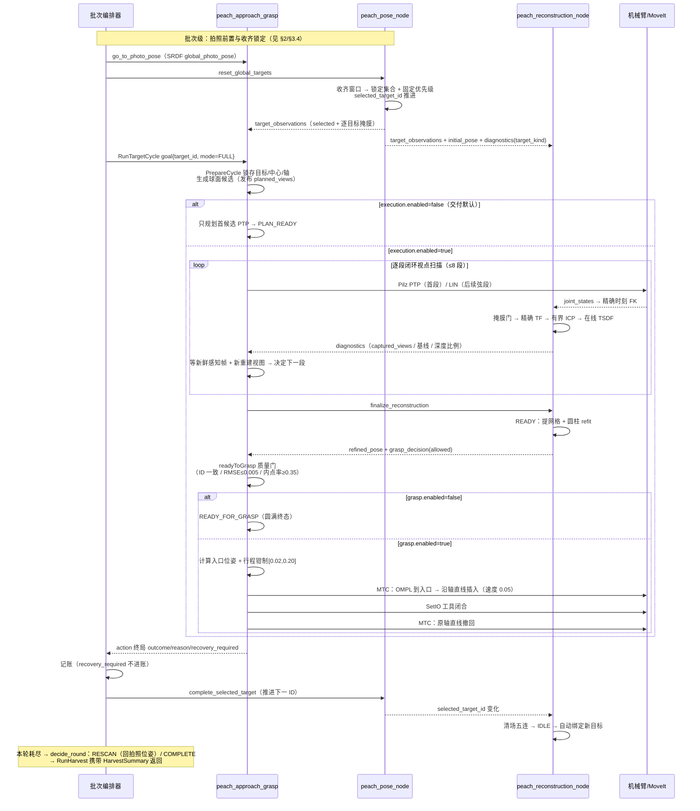

---

## 7. 关键参数速查

（权威源为各包 `config/*.yaml`；下表为 2026-08 交付默认值）

| 参数 | 默认 | 作用域/说明 |
|---|---:|---|
| `scan.observation_radius_m / minimum_radius_m` | 0.40 / 0.32 | 环绕观察半径（避开近距深度盲区） |
| `scan.azimuth_step/limit_deg` | 12 / 36 | 候选方位网格 |
| `scan.elevation_step/limit_deg` | 8 / 16 | 候选俯仰网格 |
| `scan.preferred_baseline_deg` | 15 | 期望新基线（overlap 评分中心） |
| `scan.views_to_minimum_radius / maximum_moves / frame_wait_s` | 5 / 8 / 6.0 | 径向进度、扫描段上限、到位等待 |
| `quality.minimum_views / minimum_baseline_deg / minimum_mean_nearest_baseline_deg / minimum_mean_depth_ratio` | 5 / 22° / 8° / 0.40 | finalize 质量门 |
| `quality.maximum_refined_rmse_m / minimum_refined_inlier_ratio / maximum_data_age_s` | 0.005 / 0.35 / 2.0 | 抓取质量门 |
| `moveit.velocity/acceleration_scaling` | 0.05 | 接触段速度（0.01 蠕行曾致高重力矩姿态肩部过流） |
| `moveit.transit_velocity/acceleration_scaling` | 0.05 | 自由空间转移速度 |
| `moveit.mtc_free_space_planner / mtc_cartesian_step_m / mtc_cartesian_precision_m` | RRTConnect / 0.005 / 0.001 | MTC 配置 |
| `grasp.neck_margin_m / minimum/maximum_travel_m` | 0.015 / 0.02–0.20 | 插入行程 |
| `tool.io_fun/io_pin/close_state` | 3 / 0 / 1.0 | SetIO 工具动作 |
| `execution.robot_status_max_age_s / target_observation_max_age_s` | 1.0 / 3.0 | 安全门新鲜度 |
| 感知 `harvest.min_collect_frames / lock_settle_frames / max_collect_s` | 10 / 5 / 25.0 | 收齐窗口（0.78FPS 下 10 帧需 12.8s；8s 会提前锁空集） |
| 感知 `target_memory.match_radius_m / recovery_scale / confirm_frames / tentative_ttl_frames` | 0.06 / 3.5 / 3 / 5 | 身份记忆（恢复半径 21cm 兜底跨视角 15.7cm 偏差；TTL 按帧计） |
| 感知 `tool.D_inner / L_insert / entry_d_tool+entry_d_s / clearance_min / margin_neck` | 0.104 / 0.200 / 0.070 / 0.005 / 0.015 | 工具几何门控 |
| 重建 `capture.min_views / recommended_views / max_views` | 4 / 5 / 24 | finalize 门槛 / 帧栈上限 |
| 重建 `capture.min_mask_pixels / min_mask_depth_ratio / max_target_drift_m` | 300 / 0.35 / 0.04 | 掩膜质量门 |
| 重建 `view_filter.min/max_translation / min/max_rotation_deg` | 0.002/0.080 m / 1°/25° | 视角过滤（重复/跳变） |
| 重建 `icp.max_translation / max_rotation_deg / min_fitness / max_rmse` | 0.010 / 3° / 0.35 / 0.008 | 有界 ICP |
| 重建 `icp.target_refresh_min/max_period / drift_ratio` | 1 / 5 帧 / 0.5 | E4 ICP target 增量复用 |
| 重建 `publish.on_change_only / min_interval_s` | true / 0.2 s | E4 点云/Marker 发布节流 |
| 重建 `tsdf.voxel_length / sdf_trunc / depth_trunc` | 0.003 / 0.012 / 1.5 | 在线 TSDF |
| 重建 `refit.cylinder_inlier_min / rmse_max_m / entry_standoff_m` | 0.35 / 0.005 / 0.070 | refit ACCEPT 门 |
| 编排 `auto_start_enabled / execution_enabled / grasp_enabled / tool_enabled` | true / false / false / false | 自动开始 + 三级策略 |
| 编排 `photo_pose.max_retries / retry_cooldown_s / service_timeout_s / return_on_complete` | 3 / 5.0 / 90.0 / true | 拍照前置 |
| 编排 `harvest.rescan_until_empty / max_rounds` | true / 3 | 复扫递减集 |
| 编排 `dispatch.retry_delay_s / max_retries` | 2.0 / 4 | goal 拒绝冷却重试 |

---

## 8. 启动、验收与常见坑点

```bash
source /opt/ros/jazzy/setup.bash && source install/setup.bash
# 整栈入口（bringup → 相机 → 感知 → 重建 → 抓取 → Web → 编排器）
ros2 launch peach_harvest_orchestrator harvest_system.launch.py
# 各层单起（真机相机单独启动时 bringup 必须 camera_enabled:=false）
ros2 launch peach_pose_ros2 peach_pose.launch.py
ros2 launch peach_reconstruction_ros2 reconstruction.launch.py   # params_file:=<路径> 可覆盖
ros2 launch peach_approach_grasp approach_grasp.launch.py
```

- **构建抓取包后必须重启 move_group/bringup**：MoveIt 启动文件新增官方
  `move_group/ExecuteTaskSolutionCapability`，旧进程不会热加载该 capability。
- RViz2：Fixed Frame 设 `base_link`；添加
  `/peach_approach_grasp_node/planned_views`（候选视点）、
  `/peach/reconstruction/{local_cloud, tsdf_cloud, markers}`、
  `/peach/perception/markers`；**Motion Planning Tasks** 面板查看 MTC 分阶段轨迹。
- 真机分阶段验证顺序：复制参数文件改 `execution.enabled=true`（保持
  `grasp.enabled=false`、速度/加速度 0.05）→ 每次周期现场确认安全后
  `set_execution_armed` → `start_cycle`；周期结束自动解除 arm。
  只有完成无工具的观察运动验收并接入真实末端工具及碰撞模型后，才允许同时启用
  grasp + tool。
- 高频坑点：`max_collect_s` 过短锁空集；`tentative_ttl_frames` 过短
  确认进度清零；换外参后必须**重启 extrinsics_publisher**（tf2 静态 TF 不接受同发布者覆盖）；
  重建 1Hz 心跳丢失会卡死编排器重建就绪门；启动任何 launch 前必查残留进程。

## 9. 遗留风险与安全边界

- 整机集成与真机验证仍未完成；默认只规划是当前安全交付态。
- 风动枝叶为动态障碍：正式室外部署还需近场避障传感器、末端力/触觉确认、工具闭合
  反馈，**不能把本版本直接视为无人值守量产安全系统**。
- 上电/松刹车/安全恢复只能由现场用户通过示教器或控制柜完成；业务栈不包含、也禁止
  调用 `/aubo_dashboard/startup`；急停/防护停由本体安全回路主导。
- 真机驱动栈（aubo_e5_hardware/controllers/dashboard/描述/launch）冻结只读，业务栈
  不得改变或绕过真机驱动接口。

---

## 附录：静态图导出

mermaid 图与正文同文件维护；静态 PNG 用 mermaid-cli 导出（本机
`mmdc` 已装，浏览器用系统 Chrome）：

```bash
cd docs
# 逐图导出示例（把每个 mermaid 代码块抽成 .mmd 文件后执行）
mmdc -i /tmp/peach_grasp_1_overview.mmd -o images/peach_grasp_1_overview.png \
     -b white -p <(echo '{"executablePath":"/opt/google/chrome/chrome"}')
```

| 图 | 内容 | 静态图片 |
|---|---|---|
| 图 1 | 系统总览（§1） | images/peach_grasp_1_overview.png |
| 图 2 | 批次闭环状态机（§2） | images/peach_grasp_2_batch_state.png |
| 图 3 | 拍照前置 PhotoStep（§2.2） | images/peach_grasp_3_photo_step.png |
| 图 4 | 感知单帧管线（§3.1） | images/peach_grasp_4_perception_pipeline.png |
| 图 5 | 袋桃几何与误差预算（§3.2） | images/peach_grasp_5_bag_geometry.png |
| 图 6 | 目标身份注册表（§3.3） | images/peach_grasp_6_target_registry.png |
| 图 7 | 收齐窗口锁定（§3.4） | images/peach_grasp_7_harvest_plan.png |
| 图 8 | 重建状态机（§4.1） | images/peach_grasp_8_recon_state.png |
| 图 9 | 重建单帧接受链（§4.2） | images/peach_grasp_9_frame_accept.png |
| 图 10 | 行为树周期（§5.1） | images/peach_grasp_10_behavior_tree.png |
| 图 11 | 球面自适应视点（§5.2） | images/peach_grasp_11_view_planner.png |
| 图 12 | MTC 接触段（§5.3） | images/peach_grasp_12_mtc_contact.png |
| 图 13 | 单目标周期完整时序（§6） | images/peach_grasp_13_cycle_sequence.png |
