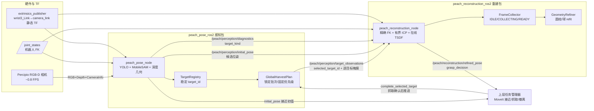
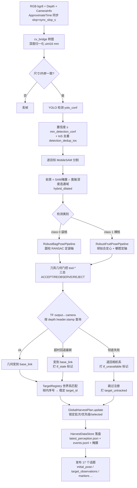
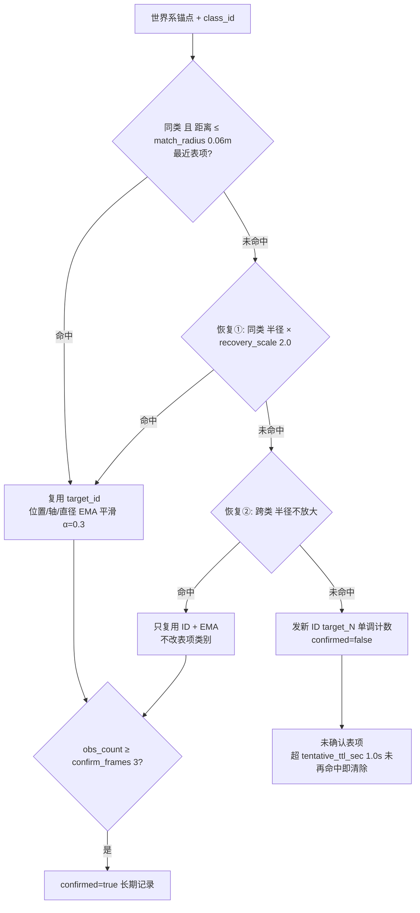
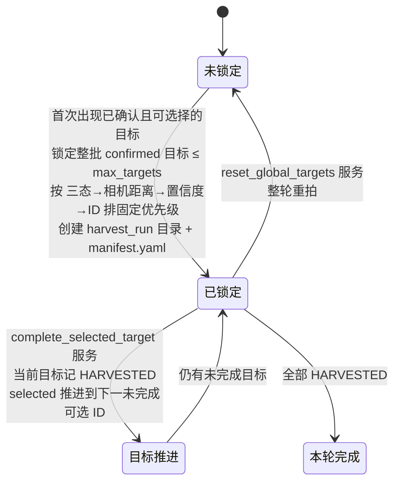
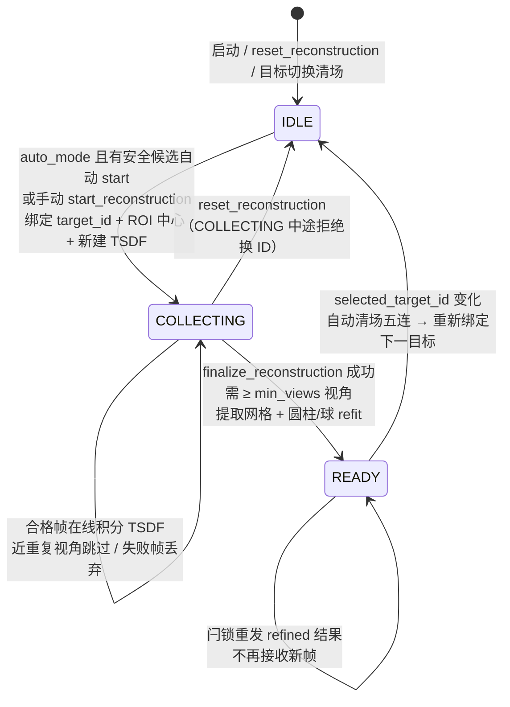
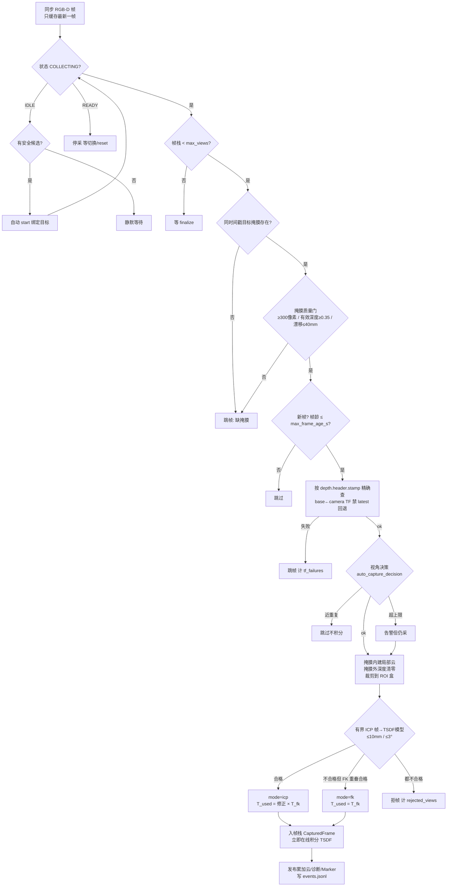
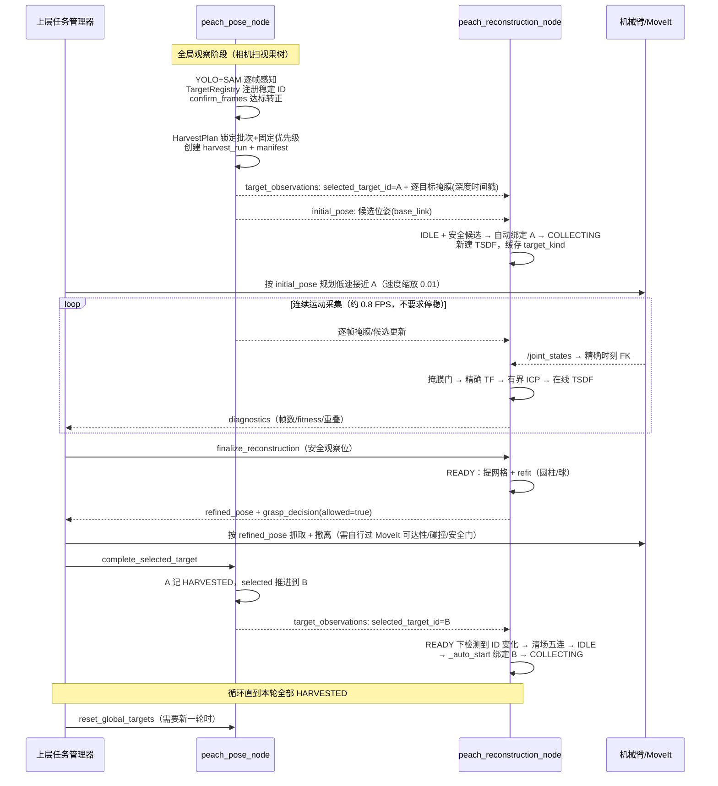
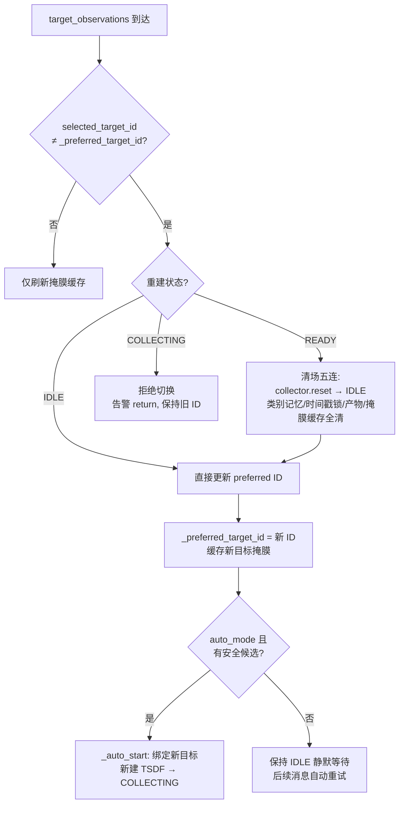

# 桃子感知（peach_pose_ros2）与连续局部重建（peach_reconstruction_ros2）全逻辑图解

> **当前范围（2026-08）**：项目当前重点是套袋桃。本文涉及的在线调参、质量门、
> 圆柱/袋轴精化与真机验收均以套袋场景为准；裸桃球拟合与方向先验仅作为研究和
> 接口兼容能力保留，不属于现阶段工具接触与抓取验收范围。

> 面向开发/联调人员的两包逻辑总览。内容以源码为准（2026-08-11 核对）：
> 感知节点 `src/peach_pose_ros2/peach_pose_ros2/peach_pose_node.py`，
> 重建节点 `src/peach_reconstruction_ros2/peach_reconstruction_ros2/reconstruction_node.py`。
> 职责边界与真机流程另见 `docs/peach_pose_reconstruction_integration.md`，
> 本文为逻辑与图示的单一汇总入口。
> 各节图示为 mermaid 源码（支持 mermaid 的阅读器直接渲染）；
> 静态 PNG 已导出到 `docs/images/`（改图后用 mermaid-cli 重新导出即可）：

| 图 | 内容 | 静态图片 |
|---|---|---|
| 图 1 | 系统总览（§1） | [peach_logic_1_overview.png](images/peach_logic_1_overview.png) |
| 图 2 | 感知单帧管线（§2） | [peach_logic_2_perception_pipeline.png](images/peach_logic_2_perception_pipeline.png) |
| 图 3 | 目标身份注册表（§3） | [peach_logic_3_target_registry.png](images/peach_logic_3_target_registry.png) |
| 图 4 | 全局采摘计划（§4） | [peach_logic_4_harvest_plan.png](images/peach_logic_4_harvest_plan.png) |
| 图 5 | 重建状态机（§5） | [peach_logic_5_recon_state_machine.png](images/peach_logic_5_recon_state_machine.png) |
| 图 6 | 重建单帧接受链（§6） | [peach_logic_6_frame_accept_chain.png](images/peach_logic_6_frame_accept_chain.png) |
| 图 7 | 联动时序图（§8） | [peach_logic_7_integration_sequence.png](images/peach_logic_7_integration_sequence.png) |
| 图 8 | 目标切换判定（§9） | [peach_logic_8_target_switch.png](images/peach_logic_8_target_switch.png) |

## 1. 系统总览

两包构成"发现 → 精化"两级视觉链路。**都只发布视觉结果，都不发运动指令**；
运动决策属于上层任务管理器（ MoveIt / 抓取执行器 ）。



分工一句话：

| | peach_pose_ros2 | peach_reconstruction_ros2 |
|---|---|---|
| 回答的问题 | 摘哪个、在哪、怎么靠近 | 最终抓取几何是什么、能不能抓 |
| 输入 | RGB-D 流 | RGB-D 流 + 感知候选/掩膜 + joint_states |
| 输出语义 | initial pose（单帧初值，参考） | refined pose（多帧精化，最终） |
| 位姿来源 | 单帧检测+分割+深度拟合 | 精确 FK 绝对定位 + 有界 ICP + TSDF refit |
| 目标身份 | 注册并维护稳定 target_id | 只消费 selected_target_id，不发明 ID |

## 2. 感知包：单帧管线

每个 ApproximateTime 同步的 RGB-D 帧触发一次 `_on_rgbd`（peach_pose_node.py:390）：



要点：

- 三维结果的 `header.stamp` 一律用 **depth.header.stamp**（同步器只保证三路落在 slop 内，连续运动中错用 RGB 时间戳会把目标变到错误位姿）。
- SAM 缺失时显式 `REOBSERVE` + `mask_unavailable`，**禁止静默深度回退**。
- 三态逐帧独立计算，身份记忆只影响 ID 与位置平滑。

## 3. 感知包：目标身份记忆（TargetRegistry）

`target_registry.py` 解决"同一桃子消失再出现 ID 全变"的问题。锚点取检测框前景点云的**中位质心**（最抗掩膜抖动），依次回退 袋底 → position → 入口点；全部缺失（几何失败帧）保留帧内序号不参与匹配。



保护语义：

- 同帧去重：一帧内已命中的表项不再参与后续匹配（`begin_frame` 重置）。
- 已确认表项匹配优先于更近的未确认表项（瞬时误检抢不走稳定身份）。
- 匹配优先级：正常 > 恢复① > 恢复②；恢复只在未命中时启用，常态相邻目标不误并。
- `tf_unavailable` 帧跳过注册（防相机系坐标污染世界系表）；`tf_stale` 帧仍正常匹配。
- 表容量超 `max_targets` 按最久未见淘汰；已确认目标不主动删除。

## 4. 感知包：全局采摘计划（GlobalHarvestPlan）

`harvest_plan.py`：**首轮稳定观测锁定整批目标，之后按固定优先级逐个推进**。



关键不变量：

- 靠近期间目标暂时遮挡/丢失 **不改变** selected_target_id（`update()` 只在未锁定时锁定、在 selected 为空时补选）。
- 目标四态：`PLANNED`（在册可选）/ `WAITING_QUALITY`（暂不可选）/ `SELECTED`（当前）/ `HARVESTED`（完成）。
- 可选择判定（`_selectable`）：有稳定 ID + confirmed + 非 REJECT + 无 `tf_stale/tf_unavailable/target_untracked` 阻断标记。
- 锁定瞬间创建 `harvest_runs/harvest_<时间戳>_s<snapshot_id>/`，感知与重建的事件都追加到同一 `events.jsonl`。

## 5. 重建包：状态机

`FrameCollector`（frame_collector.py）是纯逻辑状态机，节点只做接线：



## 6. 重建包：单帧接受链

自动模式（`capture.auto_mode=true` 默认）下，每个同步 RGB-D 帧驱动一次 `_auto_drive`；手动模式走 `capture_frame` 服务，门禁相同但更严格（重复视角/跳变可拒帧）。完整接受顺序：



失败语义：任何一步失败该帧**绝不**混入模型；TSDF 积分异常时弹出该帧、新建空体积并重放此前已确认帧（ScalableTSDF 不支持单帧移除，`remove_last_frame` 同样走重放）。

## 7. 重建包：finalize 与 refit

`finalize_reconstruction`（或 `auto_finalize_at_max=true` 满栈自动触发）：

1. `collector.finalize()`：≥ min_views 才转 READY；
2. 重叠指标：相邻帧最近邻统计（mean/p95 mm），量化刚性对齐质量；
3. `_run_tsdf()`：在线体积只做**提取**（ROI 裁剪 + 降采样 + 统计滤波 + marching-cubes 网格），禁止再批量积分；
4. `_run_refit()`：按绑定 target_id 查感知 diagnostics 得 `target_kind`（bag→圆柱线 / fruit→球线，查不到缺省袋桃并打 `target_kind_defaulted`），对 TSDF 云做 RANSAC 二次拟合 + bottom→neck 消歧 + ACCEPT/REOBSERVE 门控；
5. 发布 refined 三件套（`refined_pose` / `refined_axis` / `refined_diagnostics`，闩锁；失败发空消息覆盖防陈旧）与 `grasp_decision`。

`grasp_decision.allowed=true` 的充要条件：**状态 READY + refit 成功 + status=ACCEPT**；否则给出原因（`reconstruction_not_ready` / `refined_geometry_unavailable` / `refined_quality_requires_reobserve`）。本包不据此发任何 MoveIt goal。

## 8. 联动：一轮采摘的完整时序



## 9. 联动：目标切换的条件判定

重建端是否换目标，全部判定在 `_on_target_observations`（reconstruction_node.py:365）：



候选安全判定（`select_reconstruction_candidate`，candidate_contract.py:14）：

- 消息 `header.frame_id` 必须是 `base_frame`，候选自身 frame_id 同；
- 候选不得带 `tf_stale` / `tf_unavailable` / `target_untracked`；
- 状态优先 `ACCEPT`，无则退到非 `REJECT`，全 REJECT 不绑；
- `bag_bottom`/`bag_neck` 必须有限（算 ROI 中心）；
- preferred ID 是严格硬过滤：首选被阻断、REJECT 或缺失时返回无候选，不会改绑其他目标；运行时仍用 `query_reconstruction_state` 监测 `diagnostics.target_id == selected_target_id`。

中途换目标的正确做法：COLLECTING 下先 `finalize_reconstruction`（+ `save_session`）到 READY，或 `reset_reconstruction` 到 IDLE，再由感知推进新 ID。

## 10. 接口契约汇总

### 三条跨包契约

| 契约 | 内容 | 违例后果 |
|---|---|---|
| 稳定 ID | 感知注册维护 target_id；重建只消费不发明 | ID 不一致时融合会串目标 |
| 深度时间戳 | 掩膜/三维结果/TF 查询统一用 `depth.header.stamp`；重建只收同时间戳掩膜，禁 latest TF 回退 | 错时位姿在 TSDF 形成不可回滚双层 |
| 目标类别记忆 | 重建绑定时缓存 target_kind（bag→圆柱 / fruit→球） | 目标暂离场不换拟合模型 |

### 话题映射（感知 → 重建）

| 话题 | 重建用途 |
|---|---|
| `/peach/perception/target_observations` | selected_target_id、跟踪状态、逐目标同时间戳掩膜、harvest_run_id 关联 |
| `/peach/perception/initial_pose` | 候选选择、ROI 中心、接近初值 |
| `/peach/perception/diagnostics` | target_id→target_kind（refit 选拟合线） |
| `/joint_states` | 精确图像时刻 FK（经 TF 链） |

### 服务清单

| 节点 | 服务 | 作用 |
|---|---|---|
| peach_pose_node | `~/query_harvest_state` | run ID、锁定数量、优先级、selected |
| peach_pose_node | `~/complete_selected_target` | 抓取确认后推进下一目标 |
| peach_pose_node | `~/reset_global_targets` | 放弃计划，重新全局观察 |
| peach_reconstruction_node | `~/start_reconstruction` | 手动从 IDLE 开始（auto_mode=false 用） |
| peach_reconstruction_node | `~/capture_frame` | 手动采帧（更严格视角检查） |
| peach_reconstruction_node | `~/remove_last_frame` | 弹最后一帧并重放 TSDF |
| peach_reconstruction_node | `~/reset_reconstruction` | 清场回 IDLE |
| peach_reconstruction_node | `~/finalize_reconstruction` | → READY，提网格 + refit |
| peach_reconstruction_node | `~/save_session` | 落盘完整 session（finalize 不会自动保存） |
| peach_reconstruction_node | `~/query_reconstruction_state` | 状态、绑定 ID、帧数、数据路径 |

### 数据落盘

```text
harvest_runs/harvest_<时间戳>_s<N>/   # 一轮采摘（感知创建，两包共享）
├── manifest.yaml                    # 锁定清单/优先级/模型与标定版本
├── events.jsonl                     # 感知+重建完整事件链（target_harvested/frame_accepted/...）
├── latest_perception.json
├── latest_reconstruction.json
└── masks/<stamp_ns>_<id>.png        # 选中目标逐帧掩膜

peach_sessions/session_<时间戳>/      # 单目标重建原始数据（save_session）
├── frame_XX_{rgb.png, depth.npy, camera_info.yaml, T_base_camera.yaml}
├── metadata.yaml                    # 参数快照 + 帧级 FK/ICP 摘要
└── result/{tsdf_cloud.ply, tsdf_mesh.ply}
```

## 11. 关键参数速查

| 参数 | 默认 | 作用域 |
|---|---|---|
| `target_memory.match_radius_m` | 0.06 | 身份匹配半径 |
| `target_memory.confirm_frames` / `tentative_ttl_sec` | 3 / 1.0 | 目标转正/误检清除 |
| `capture.auto_mode` / `auto_finalize_at_max` | true / false | 自动采集 / 满栈自动 finalize |
| `capture.min_views` / `max_views` | 4 / 24（以 yaml 为准） | finalize 门槛 / 帧栈上限 |
| `capture.min_mask_pixels` / `min_mask_depth_ratio` / `max_target_drift_m` | 300 / 0.35 / 0.04 | 掩膜质量门 |
| `icp.max_translation` / `max_rotation_deg` | 0.01 / 3 | ICP 有界修正上限 |
| `icp.min_fitness` / `max_rmse` | 0.35 / 0.008 | ICP 质量门 |
| `tsdf.voxel_length` / `sdf_trunc` | 0.003 / 0.012 | TSDF 分辨率 |

权威值以 `src/peach_pose_ros2/config/peach_pose.yaml` 与
`src/peach_reconstruction_ros2/config/reconstruction.yaml` 为准。

## 12. 常见异常与正确处理

| 现象 | 原因 | 处理 |
|---|---|---|
| 重建停在 IDLE | 无安全候选（首选 REOBSERVE/标记阻断/全 REJECT） | 恢复首选目标质量；核对 selected_target_id |
| 拒绝切换 selected_target_id | COLLECTING 中途换 ID | 先 finalize/save 或 reset 再切换 |
| ICP 修正过大/拒帧多 | 掩膜串目标、同步偏差、外参错、重叠不足 | 逐项排查，**不得放宽 ICP 边界强收** |
| refined REOBSERVE | refit 质量不达标 | 补视角后重新 finalize |
| TF 失败跳帧多 | 机器人 TF 延迟 / extrinsics 未更新 | 查 tf_latency_ms；换外参后**重启 extrinsics_publisher**（tf2 静态 TF 不接受同发布者覆盖） |
| 两包 target_id 不一致 | 旧进程、跨版本节点或陈旧缓存 | 停止融合，reset 并重启相关节点 |
