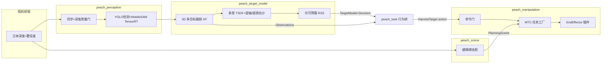

# Peach v2：室外套袋桃三末端剪切采摘 · 完全重构终版方案

日期：2026-09-30。性质：重构设计与落地计划（`.cursor/plans/`，不是 `docs/` 活文档）。
依据：六路并行审查（视觉 / 臂与轨迹 / 调度与契约 / 三末端与安全 / 论文调研 / GitHub 选型）+ 主审逐条复核源码。
范围：按用户要求**忽略现行项目结构约束**，完全重构；但以下四条是物理与法规事实，不随重构改变：

1. 急停走柜体/示教器硬件回路，ROS 只做应用护栏。
2. 未经人授权不动真机、不 SetIO。
3. 带刀单元按工业应用隔离作业区（ISO 10218-2:2025），不宣称协作。
4. Jazzy 的 `cv_bridge` 按 numpy 1.x 编译，锁 numpy 1.26.4（否则 ABI 崩）。

---

## 目录

1. [核心需求拆解与成功口径](#1-核心需求拆解与成功口径)
2. [现行系统审查结论（已复核）](#2-现行系统审查结论已复核)
3. [重构总体架构](#3-重构总体架构)
4. [感知：检测、关键点、深度、袋轴与袋颈](#4-感知检测关键点深度袋轴与袋颈)
5. [目标建模与许可预算（重写）](#5-目标建模与许可预算重写)
6. [运动：IK、规划、轨迹、避障](#6-运动ik规划轨迹避障)
7. [三种末端：插件接口与动作序列](#7-三种末端插件接口与动作序列)
8. [任务编排：行为树 + MTC](#8-任务编排行为树--mtc)
9. [室外环境干扰对策](#9-室外环境干扰对策)
10. [安全架构](#10-安全架构)
11. [接口（IDL）精简版](#11-接口idl精简版)
12. [参数单源与初值表](#12-参数单源与初值表)
13. [测试金字塔与验收门](#13-测试金字塔与验收门)
14. [分期落地计划](#14-分期落地计划)
15. [实施时的模型分工](#15-实施时的模型分工)
16. [开放问题（必须实测才能定）](#16-开放问题必须实测才能定)
17. [参考资料](#17-参考资料)

---

## 1. 核心需求拆解与成功口径

**一句话需求：** 固定座（将来上底盘）AUBO E5 + 腕载 RGB-D，在室外桃园里对套袋桃完成「找到 → 对准袋轴 → 套入 → 剪断袋颈/果柄 → 撤出 → 放果」，三种末端可换：

| 末端 | 原理（按档案与 CAD 推断） | D_inner | L_insert | L_blade（TCP→刃面） |
|------|---------------------------|---------|----------|----------------------|
| `shear_v1` 连杆剪 | 刀组在法兰 +Y 与相机同侧，连杆对切，张口小 | 0.080 | 0.030 | 0.030 |
| `bite_shear_v1` 咬合剪 | 双刃对夹，220 mm 长喉道导轨把枝引入刀区；**非轴对称** | 0.104 | 0.030 | 0.037 |
| `adaptive_shear_v1` 自适应剪 | Ø136 圆盘 + 拉钩弹簧被动贴果，MPU6050 驱动姿态跟随 | 0.120 | 0.090 | 0.079 |

**分项成功口径（按 Bac 2014 分项法，区分「可达果」与「全部果」）：**

| 分项 | 首期目标（固定座，可达果） | 依据 |
|------|---------------------------|------|
| 检测召回（套袋桃） | ≥ 95% | 套袋检测文献 mAP 90%+ |
| 定位（袋轴 + 袋颈，95%） | 横向 ≤ 8 mm，轴角 ≤ 4°；袋颈轴向 v2.0 融合 ≤ 10 mm、近距重测后 ≤ 5 mm（v2.1 关键点目标 ≤ 3 mm） | 末端容差反推（§5）；v2.0 无关键点模型 |
| 套入成功 | ≥ 85% | — |
| 剪断成功（一次） | ≥ 80%，重试后 ≥ 90% | — |
| 整体采摘成功 | 60–75% | SWEEPER 61%、Harvey 76.5%、HAVS 87.5% 同档 |
| 每果周期 | ≤ 25 s（首期），≤ 15 s（二期） | SWEEPER 24 s、HAVS 13.2 s |
| 损伤（果/枝/袋撕裂） | ≤ 5% | Bac 2014 平均 5% |

**决定成败的前置实测（先于写代码）：** 果园抽样 ≥ 200 袋，量袋径分布（d50/d95）、袋颈高度与直径、扎口到结果枝距离、袋轴与重力夹角分布、风速与摆幅。桃是短果柄，袋通常扎在结果枝上——「剪柄」实际是剪袋颈/扎口/短枝。**这组数据决定三把末端各自的适用率，也决定 §5 预算常数。**

---

## 2. 现行系统审查结论（已复核）

主审对标「已复核」的条目逐行看过源码；其余为子审查结论，标注「待实证」的需要现场日志或真机确认。

### 2.1 P0：导致核心需求根本不可达

| # | 问题 | 证据 | 状态 |
|---|------|------|------|
| P0-1 | **剪切许可恒为负。** 轴向余量 = 捕获半宽 0.008 − 安全余量 0 − (袋颈下限 ≥0.003 + 刃面 0.002 + 机器人 0.002 + 目标运动 0.003) ≤ **−0.002 m**，`cut_ok` 永远 false，TOOL 门永不放行；结构性诊断又没把袋颈下限算进去，原因字段误导为"这颗袋不好" | `tool_budget.py:20-35, 59-66, 85-102`；`refine.py:1081-1089`；`target_reconstruction.yaml:89-94` | 已复核 |
| P0-2 | **唯一能真正下刀的链路是几何校验最少的那条。** `skip_reconstruction` 的未精化链不做轴向校验，TOOL 门只查 `pregrasp_verified` + `tool_enabled` | `cycle.cpp:153-183`；`target_cache.cpp:507` | 子审查 |
| P0-3 | **剪切确认可能读回自己的输出。** 下刀写 `io_fun=3, pin=0`；反馈读 `tool_io_states` 的 pin 0；驱动按地址合并工具 IO 状态、不区分方向 | `motion.cpp:82-104, 329-332`；`aubo_e5_hardware.cpp:1606-1611, 1711-1716` | 已复核前两处，驱动侧**待真机实证** |
| P0-4 | **默认末端（adaptive）的套入不会动臂。** launch 硬写 `motion_enabled: 'false'`；真机 Servo 写 JTC 话题，而 real 只起透传控制器；臂不动却判 STALLED 并置 recovery | `harvest_system.launch.py:292-298`；`moveit_servo.yaml:14`；`bringup.launch.py:90,104` | 已复核 launch |
| P0-5 | **接触令牌新鲜窗与作业链时长错配。** 令牌窗 = `effectiveTargetMaxAgeS()`（3–10 s），`model_stamp` 是派发前心跳；FULL 链实测 30–60 s → CONTACT 阶段大概率 EXPIRED；反而无令牌的快照回退路径不查新鲜度 | `cycle.cpp:355-369, 97-151, 153-186`；`target_reconstruction.yaml:70` | 已复核；EXPIRED 比例**待日志实证** |
| P0-6 | **避障只保护相机。** 臂身和刀对场景障碍全豁免；staging 点离果仅约 8–10 cm；返程倒放在两条接近路径下都失效，出冠由新规划 PTP/OMPL 完成且无果胶囊审查 | `peach_arm.yaml:123`；`acm_policy.hpp:29-32`；`grasp_task.cpp:914-1007, 1423-1471`；`motion.cpp:831-926` | 子审查 |
| P0-7 | **刃面位置被当成 TCP。** URDF `cutting_plane` 与 TCP 零偏移，档案 L_blade 0.030/0.037/0.079 在臂侧回退行程计算里被忽略；adaptive 档刀口会落到颈下约 9 cm（果体内） | `tcp.xacro:26-31`；`motion.cpp:216-232` | 子审查 |
| P0-8 | **重建采帧门结构性死锁。** 邻目标距离门与视角无关（两袋 <15 cm 永不开门，180 s 超时）；漂移门 0.04 m 小于同行注释认定的风摆 5–6 cm | `capture.py:761-797`；`target_reconstruction.yaml:32-35` | 子审查 |

### 2.2 P1：可靠性、正确性、安全纵深

- **感知：** 地标覆盖轴向后角误差仍停在 20° → 单帧几乎总是 REOBSERVE（`pose_pipelines.py:328, 383, 462-469`）；χ² 门因不传协方差退化成 6 cm 欧氏球（`pipeline.py:414-425`，`identity.py:131-134`）；身份锚点取袋底袋颈中点、会被 2D 长度延伸推动 → ID 跳变；TF 精确查询失败退回 latest 仍按 base 系输出。
- **重建：** 观测回调里做 ICP/TSDF，与 `/joint_states` 共用默认互斥组 → 静止门拿过期速度（`target_reconstruction_node.py:391-400, 752-789`）；预算项一半没从 yaml 注入，用的是代码默认值；95% 统计口径混乱（MAD 未 ×1.4826×1.96，误差项又线性相加）。
- **深度前端：** stereo TIME_SYNC 失败只打警告（时间戳变设备时钟，重建 TF 全失败）；时域中值无运动补偿；confidence 无人消费；IR 曝光固定、无 HDR，室外未验证。
- **场景障碍：** 点云/TF/关节角三者时间不对齐；目标胶囊跨批次只增不清；单个飞点即生成 6 cm 方块；超限按索引截断而非按距离。
- **臂：** 倒放轨迹加速度取反（时间反转时加速度不应变号，`trajectory_guard.hpp:75-112`）；ACM 只加不删且整表读改写有竞态；ContactMonitor 定时器与 reset 竞态、无动力学补偿、撤退段不受守护；MoveTo 与作业周期可并发并共享 MGI；关闭使能不停在途运动；允许 5% 短插仍下刀；起点容差 0.15 rad；CheckReachability 与 staging IK 都不查场景碰撞；imu_follow 行程上限 0.09 m < 臂侧 0.2 m；取消不直接停 imu_follow。
- **刀具：** 周期开始不确认刀已张开；剪后闭刀回收纳位、开刀要重新过感知令牌（令牌过期 → 果卡刀里）；`set_io` 服务无授权，web 调试页可直接写 DO。
- **调度：** FSM + reducer + EventHold 三轨并存；RunHarvest 命令循环在 action execute 回调内同步阻塞 180 s 级；`require_managed_stack` 三处默认值不一致；bond 默认关（本机已装 `ros-jazzy-bondpy`，launch 注释「缺 bondpy」已过期）。

### 2.3 现行值得保留的思想（重构后仍用）

- 停走式感知节拍（与主动 RGB-D 室外物理特性匹配）。
- 纯核零 ROS（FSM、几何、预算可单测）。
- 逐目标动态许可（「按这颗袋的误差给不给剪」的思想正确，只是算错了）。
- 场景障碍用 Survey 快照而不是 live octomap（腕载相机 + 停走下更稳）。
- 默认干跑停预抓取、故障后禁止 resume 原轨迹、ACK 才恢复。
- 精确 stamp TF 积分。

### 2.4 过度设计（重构时删）

- 身份七元组 + Clearance 复制 GraspDecision + 臂侧令牌/快照双路授权。
- FSM/reducer/EventHold 三轨。
- 感知单帧 ACCEPT/REOBSERVE/REJECT 裁决（与多视融合裁决重复）。
- `*.impl` dict 注册表、兼容 shim、legacy lifecycle 节点。
- fast/conservative 两套观察实现分在调度与臂两侧。

---

## 3. 重构总体架构

### 3.1 设计原则

1. **一个事实只有一个源。** 工具几何只在工具档案；误差常数只在标定文件；许可只在一处计算、一处复检。
2. **闭环优先于精度。** 最后 10 cm 用近距重测 + 视觉对中，不靠一次看准走到底（SWEEPER、HAVS 实证）。
3. **机械容差吸收剩余误差。** 喇叭口、导轨、被动柔顺，比感知多挤 2 mm 更便宜。
4. **全臂受查，只按阶段局部豁免。** 豁免由 MTC stage 局部修改、自动回滚，不写全局 ACM。
5. **剪切确认必须独立于剪切命令。** 独立传感器 + 第二判据。
6. **每层可替换：** 末端、检测器、规划器走 pluginlib；默认实现直接构造。

### 3.2 包切分（对齐 UR / Nav2 / MoveIt 主流）

```
src/
  peach_description/        # URDF/xacro：臂+快换+三末端（含真实 cutting_plane 偏移、惯量）
  peach_bringup/            # 唯一整栈入口；预检；lifecycle_manager+bond
  peach_moveit_config/      # SRDF、pick_ik、OMPL/Pilz/STOMP、控制器映射
  peach_interfaces/         # 精简 IDL（§11）
  peach_perception/         # C++ 组件容器：前端同步/深度质量/点云；Python 推理进程（TensorRT）
  peach_target_model/       # 目标跟踪 + 多视融合 + 袋轴/袋颈估计 + 许可预算（纯核+节点）
  peach_scene/              # 场景硬障碍快照 → PlanningScene（全臂受查）
  peach_end_effector/       # pluginlib：EndEffector 基类 + 三个插件 + 刀具 IO 驱动封装
  peach_manipulation/       # C++：MTC 任务工厂、命令门、执行守护、接触监测
  peach_task/               # BT.CPP v4 行为树 + BehaviorTree.ROS2 节点插件 + 账本
  peach_observability/      # /diagnostics 聚合、会话 bag、8090 只读面板
  peach_calibration/        # 手眼、TCP、刃面、IO 反证测试工具
  peach_system_tests/       # launch_testing + Gazebo Harmonic 系统测
```

依赖单向：`interfaces ← 所有能力包`；能力包之间不互相 import 业务代码；驱动包（`aubo_e5_hardware` 等）保持厂商边界。

### 3.3 进程与数据流



**进程划分：**

| 进程 | 内容 | 语言 | 理由 |
|------|------|------|------|
| camera | 立体前端 | C++ | 高带宽 |
| perception_container | 同步、深度质量、点云裁剪（composable，intra-process） | C++ | 零拷贝 |
| perception_infer | v2.0：现有 YOLO 检测 + MobileSAM；v2.1：YOLO11-seg + 关键点（TensorRT FP16） | Python | 模型生态；进程隔离防 CUDA 崩溃拖死全栈 |
| target_model | 跟踪 + 融合 + 预算 | Python（Open3D）/ C++ 热点 | 算法迭代快 |
| scene | 硬障碍快照 | Python | 低频 |
| manipulation | move_group 客户端 + MTC + 命令门 + 末端插件 | C++ | 实时性、MoveIt API |
| task | BT 执行器 + 账本 | C++ | BT.CPP 原生 |
| observability | 诊断聚合、bag、8090 | Python | 只读 |

生命周期：perception_container / target_model / scene / manipulation / task 全部 LifecycleNode，由 `nav2_lifecycle_manager` 托管，**bond 默认开**（`bond_timeout: 4.0`）。

---

## 4. 感知：检测、关键点、深度、袋轴与袋颈

### 4.1 深度前端

| 项 | 现行 | 重构 |
|----|------|------|
| 时间同步 | TIME_SYNC 失败只警告 | 失败即拒启；诊断发布主机↔设备时钟偏差 |
| 置信度 | 只写进点云，无人消费 | 独立 `depth/confidence`（mono8，与深度逐像素对齐）；下游按置信度加权 |
| 时域滤波 | 无运动补偿中值 | 只在关节静止（按图像 stamp 插值 `/joint_states` 判定）时启用 k=3 中值；运动中直接输出单帧 |
| 曝光 | IR 固定 990 | IR 自动曝光 + 彩色 ROI 测光（以袋 ROI 为准）；强光档双曝光交替 |
| SGBM | P2=3200，uniqueness 6 | P2 回到 32·bs²·ch 量级，uniqueness 10–15，加左右一致性检查；边缘飞点用深度梯度 + 置信度剔除 |
| 兜底深度 | 无 | 强光档可选 FoundationStereo（实时版，TensorRT）对左右 IR 生成备用视差；只在置信度覆盖 < 50% 时启用，需自测 |
| 发布 QoS | 全 RELIABLE depth 10，常发 7 MB 点云 | 图像 SensorDataQoS；点云按需（service 触发取帧），不常发 |
| 物理遮光 | 无 | 末端遮光罩 + 背光面作业（成本最低、收益最大） |

### 4.2 2D：基线用现有模型（v2.0），关键点模型作后续升级（v2.1）

**现有资产（2026-09-30 核实）：** `src/peach_harvester/model/best.pt` 是 **YOLO 检测模型**（task=detect，两类 `peach_bag` / `peach_nobag`，只出框，不出掩膜/关键点）；`mobile_sam.pt` 是 MobileSAM（框提示分割）。袋颈/袋底现在由 `vision/common/bag_landmarks.py` 用几何推出：点云主轴 + 沿轴 12 段半径剖面（90 分位），收缩比 0.85 判断哪端是颈。**v2.0 不依赖任何新模型**，只重写这条链的质量与不确定度。

**v2.0 基线链（每帧）：**

1. **检测：** 现有 `best.pt`，只保留 `peach_bag` 进执行候选（`peach_nobag` 仅显示）。conf 0.35 / NMS 0.5 沿用现行。导出 TensorRT FP16（Ultralytics `export(format='engine')`），RTX 3090 上预期 < 10 ms。
2. **分割：** MobileSAM 以检测框为提示。改进点：
   - 每帧图像编码只算一次，多框共享 embedding（现行每帧重算编码器是热点）；
   - 框外扩 10% 作提示，另加框中心正点 + 框外四角负点，减少袋口/枝条被切掉；
   - 掩膜后处理：∩ 有效深度 ∩ 置信度 ≥ 阈值 → 取与框中心深度连通的最大分量 → 形态学开闭。
3. **2D 质量分（代替关键点可见性）：** 掩膜面积占框比、掩膜是否触边（截边）、上端（颈侧）掩膜宽度剖面是否完整、有效深度覆盖率、与邻框 IoU。
4. **2D 颈/底粗定位（新增，给 3D 做先验与交叉验证）：** 对掩膜做 PCA 取长轴 → 沿长轴 20 段量掩膜宽度 → 宽度剖面平滑后：**宽端的外缘中点 = 2D 袋底**，**窄端宽度最小处（收缩段）= 2D 袋颈**，窄端最末端 = 2D 扎口；方向用重力（图像中 base −Z 的投影）消歧。输出像素坐标 + 由剖面陡峭度给出的置信度。

**v2.1 升级（有数据后再做）：** 用 v2.0 在果园跑出的「掩膜 + 几何颈/底/扎口」作为伪标签，人工抽检修正后训练 YOLO11-seg + 三关键点（K1 扎口 / K2 袋颈 / K3 袋底）；替换第 1、2、4 步，接口不变（输出同样是掩膜 + 三个带置信度的像素点）。这样关键点模型的训练数据来自生产链自动积累，不需要单独大规模标注。

### 4.3 3D：单帧观测 → 多目标跟踪

- **单帧 3D：** 掩膜 ∩ 有效深度 ∩ 高置信度 → 点集。袋底/袋颈 3D 取法：
  - **3D 剖面法（主）：** 沿用 `bag_landmarks` 思路，但轴由「点云主轴 + 重力先验」给出，剖面半径改用切片 95 分位，颈 = 窄端连续收缩段起点，底 = 宽端 5 分位位置的轴上点（不是左右缘极值中点，后者对飞点敏感）；
  - **2D 反投影（辅）：** §4.2 第 4 步的 2D 颈/底在局部深度中值（3×3、置信度加权）上反投影；
  - 两者偏差 > 15 mm → 该帧颈/底标低质量，不进融合。
- **协方差：** 深度噪声模型 σ_z ∝ z²/(f·b) + 剖面分箱宽度（颈的轴向不确定度至少半个分箱）传播到 3D；每个观测带协方差。
- **TF：** 只按图像 stamp 精确查询，失败即丢该帧（不退 latest）。
- **跟踪：** 每目标一个 KF，状态 = 袋底位置 + 速度（风摆），观测 = 3D 袋底（袋底比袋颈稳定：颈常被叶/枝遮挡）；关联用**真正的马氏距离**（带协方差）+ 匈牙利 + 类别约束；新生需 N=3 帧确认，丢失 TTL 按时间（不按帧）。
- **摆动估计：** 停走静止窗 1–2 s 内对袋底轨迹做正弦拟合/功率谱，得到摆幅 A 与周期 T，写入观测，供许可预算与择时触发使用。

### 4.4 袋轴与袋颈估计（多视融合后）

1. **融合：** 近距补拍 2–3 个视点（§4.5），对该目标掩膜内点做置信度加权点云融合（点少时比 TSDF 稳），可选 TSDF（体素 3 mm）供可视化。
2. **袋轴：** 融合点云上 RANSAC 圆柱 + PCA，加重力先验（袋轴与 −Z 夹角上限 45°，来自实测分布）；与多视「袋底→袋颈」连线做一致性检查（夹角 > 10° 标记低质量）。
3. **袋颈/剪点：** 融合点云上重做半径剖面，颈 = 窄端收缩段；多视各帧颈点在轴上投影取 Huber 均值，轴向散布给 σ_ax。**没有关键点模型时，袋颈轴向精度是整条链的短板**（剖面分箱约 1 cm、颈端常被遮挡），预计 σ_ax95 在 5–10 mm；由 §5.2 的「近距重测 + 末端到位判据」弥补，而不是强行在远距离压精度。
4. **袋径：** 沿轴切片取截面半径的 95 分位（袋是上窄下宽的柔性体，不用单一圆柱半径）。
5. **不确定度：** 位置用多视 MAD×1.4826 换算 σ，再 ×1.96 得 95%；轴角用 RANSAC 残差 bootstrap；统一输出 `σ_lateral95, σ_axial95, θ95`。
6. **数据飞轮：** 每个成功/失败目标都落盘「RGB + 掩膜 + 3D 颈/底 + 末端到位实测位置」，作为 v2.1 关键点模型的伪标签与评测集。

### 4.5 视点规划

- 粗：拍照位全景，锁定目标集。
- 精：对当前目标生成 3 个候选视点（沿当前视线靠近到 0.35–0.45 m；绕袋轴 ±30°；优先能看到袋颈侧的视角，即略低于袋颈、仰视袋口），用「信息增益（掩膜完整度 + 颈侧剖面完整度 + 深度覆盖）− α·移动代价」排序；每个候选先做**全臂碰撞检查 + IK**，不可达直接剔除（不试错）。
- 停止准则：`σ_lateral95 < 6 mm ∧ θ95 < 4°`（接近许可）且 `σ_axial95 < 10 mm`（v2.0 放宽，剪切精度交给近距重测与末端判据），或视点数 = 3。

---

## 5. 目标建模与许可预算（重写）

### 5.1 公式（RSS 合成，单一事实源）

所有独立误差项按平方和开根合成（独立假设下正确的 95% 合成），常数只来自 `calibration/<tool_id>.yaml`（台架标定产物），不在代码里写默认值。

**径向（套入）：**

\[
m_r = \tfrac12 D_\text{inner} - \tfrac12 d_{95} - c_\text{wall} - \sqrt{\sigma_{lat}^2 + (L\sin\theta_{95})^2 + e_\text{tcp}^2 + e_\text{handeye}^2 + e_\text{runout}^2 + A_{\perp}^2}
\]

**轴向（剪切）：**

\[
m_a = w_\text{capture} - \sqrt{\sigma_{ax}^2 + e_\text{blade}^2 + e_\text{robot}^2 + A_{\parallel}^2}
\]

其中 \(A_\perp, A_\parallel\) 来自 §4.3 实测摆幅（不再用常数 3 mm）；\(w_\text{capture}\) 是**台架实测的刃口捕获半宽**（不是名义值 8 mm）。

**用现行常数对比（示意，adaptive 档）：** 线性相加 `3+2+2+3 = 10 mm > 8 mm` → 恒负；RSS `√(3²+2²+2²+3²) ≈ 5.1 mm < 8 mm` → 余量约 +2.9 mm。RSS 不是放宽安全，而是正确的独立误差合成；真正的安全来自 \(w_\text{capture}\) 用实测值。

### 5.2 轴向误差的工艺解法（比算法更有效）

- **末端近距重测：** 到预抓取位后，腕相机在 0.15–0.25 m 处再拍一次，只重测袋颈（v2.0 用掩膜宽度剖面 + 3D 剖面；v2.1 用关键点）。近距下同样的像素/分箱误差对应的毫米误差小得多，预期 σ_ax 从多视融合的 5–10 mm 降到 3–5 mm（v2.1 关键点可到 ~2 mm）。若近距重测与融合结果偏差 > 10 mm，放弃剪切、只保留接近，入补采清单。
- **捕获带加宽：** bite 的长喉道导轨可把有效捕获半宽做到 ±15 mm 以上（需台架确认）；adaptive 圆盘贴果后用接触/IMU 判断到位，把轴向误差从视觉转移到力觉。
- **套入深度闭环：** 套入不是走固定 travel，而是「走到刃面对准袋颈」，由末端插件的到位判据（接触、力、行程）结束。

### 5.3 许可消息（只算一次，只复检一次）

`GraspDecision` 由 target_model 计算并带 `model_revision`（单调）+ `valid_until`（按 FULL 链实测时长设，默认 120 s）。manipulation 在 CONTACT/TOOL 阶段**向 target_model 服务同步查询**当前 revision 的许可（一次 RPC，拿最新值），不用 goal 里复制的令牌，也不用心跳时间戳当新鲜度。

---

## 6. 运动：IK、规划、轨迹、避障

### 6.1 IK

- **基线：** `pick_ik`（Jazzy apt 可装，支持代价函数：关节中位、腕翻惩罚）或 `trac_ik`；中期用 IKFast 生成 AUBO E5 解析解（6R 类 UR 构型）以得到全部 8 组解。
- **选解代价：** 腕关节离限位距离、可操作度（条件数 > 阈值拒）、相对当前关节的加权距离、刀口滚转约束（§7）。
- **可达性检查 = 执行同一口径：** 选果阶段的 `CheckReachability` 调同一 MTC 生成器做 plan-only（含场景碰撞），不再单独只做无碰撞的 IK。

### 6.2 规划分段（一颗果一个 MTC 任务）

```
CurrentState
 → Connect[OMPL RRTConnect∥STOMP 竞赛, 全臂受查]      # 冠外自由空间 → staging
 → MoveTo[staging: 袋轴下方, 距袋底 0.15–0.25 m, 冠外] # 滚转梯子作为 generator
 → [视觉近距重测（task 层插入观测，§4.5）]
 → MoveRelative[Pilz LIN 沿袋轴 → 预抓取, 近果降速]
 → ModifyPlanningScene[仅允许 末端前端 × 当前目标袋]  # stage 局部 ACM
 → EndEffector.insert()                               # 插件决定：LIN / Servo / 导纳
 → EndEffector.cut() + confirm()
 → MoveRelative[Pilz LIN 沿轴撤出, fraction 必须 = 1]
 → ModifyPlanningScene[恢复]
 → Connect[OMPL, 全臂受查] → 放果位
```

- **staging 距离：** 从 8–10 cm 加到 15–25 cm（冠外），并要求 staging→预抓取的直线段在 PlanningScene 里无碰。
- **Cartesian 完成度：** 套入/撤出 `min_fraction = 1.0`，短插不下刀。
- **时间参数化：** 统一 TOTG/Ruckig，Cartesian 段额外受笛卡尔限速（套入 ≤ 0.03 m/s，冠内 ≤ 0.1 m/s）。
- **起点容差：** `allowed_start_tolerance` 回到 0.01–0.02 rad。
- **出冠：** 记录**实际执行过的全部段**（含走廊），出冠用时间反转（速度取反、加速度不变）+ 执行前重新碰撞检查；失败再规划新路径且仍全臂受查。

### 6.3 避障：分层场景（全臂受查）

| 层 | 内容 | 来源 | 碰撞策略 |
|----|------|------|----------|
| L1 固定 | 立柱、地面、底座、支架 | URDF / 静态配置 | 全臂 |
| L2 硬障碍 | 主干、粗枝（估计直径 ≥ 12 mm）、邻果袋 | Survey 快照点云 → 聚类 → 胶囊/盒拟合 | 全臂 + 末端 |
| L3 软障碍 | 叶片、细枝 | 分割为 leaf/twig 的点 | **不进碰撞**；进 costmap 惩罚（STOMP 代价）+ 接触监测兜底 |
| L4 目标 | 当前目标袋 | target_model 胶囊 | 接近段受查；仅在套入 stage 对末端前端局部豁免 |

**快照实现要点：**
- 触发时按需取一帧深度 + 按图像 stamp 查 TF 与 `/joint_states`（三者同时刻）。
- 体素化 3 cm，每体素至少 N=5 点（剔飞点）；自身滤除用 collision mesh + 余量 + 体素半对角。
- 硬/软分类：用 2D 分割的 branch/leaf 掩膜投影到体素（`peach_vegetation` 的枝叶掩膜正好用上）；无分割时退回按局部 PCA 线性度 + 厚度估计。
- 胶囊按批次清空；超上限按距 TCP 远近截断（近的保留）。
- 每个目标精化后同帧重写（去掉该目标 L4 邻域内的 L2 体素）。

**GPU 选项（二期）：** 本机 RTX 3090 + CUDA 12.8。`isaac_ros_nvblox/cumotion` 本机 apt 不可用、且对 CUDA 版本有锁定，不作首期依赖；可选 pip 版 cuRobo（研究库，CUDA 12）只用于「批量评估候选接近方向（无碰 IK 每秒数千次）」，不当生产执行规划器。

### 6.4 接触监测（全程，含撤出）

- **首选硬件：** 腕部六维力传感器（或末端 5 点力 `/force/points` 已有，接起来用）。
- **无 F/T 时：** 关节电流 + 动力学模型（重力补偿 + 摩擦标定）残差，阈值按阶段设；监测在控制循环侧（ros2_control chainable 或独立 100 Hz 节点），不在 50 ms wall timer 上。
- **动作：** 超阈值 → 立即停止当前段 → 沿轴退 2 cm → 上报 `CONTACT_ABORT`。

---

## 7. 三种末端：插件接口与动作序列

### 7.1 `EndEffector` pluginlib 接口（C++）

```cpp
namespace peach_end_effector {
class EndEffector {
public:
  virtual ~EndEffector() = default;
  virtual void initialize(rclcpp_lifecycle::LifecycleNode::SharedPtr node,
                          const ToolProfile & profile) = 0;
  /// 刃面在 TCP 系中的位姿（真实 L_blade 偏移），用于把「刃面对准袋颈」换算成 TCP 目标。
  virtual Eigen::Isometry3d blade_in_tcp() const = 0;
  /// 刀口绕袋轴的允许滚转区间（轴对称返回全圈）。
  virtual RollConstraint roll_constraint(const TargetModel & t) const = 0;
  /// 该目标能否由本末端作业（袋径、颈长、遮挡、预算）。
  virtual Feasibility feasible(const TargetModel & t, const Budget & b) const = 0;
  /// 周期前置：张开刀并用独立反馈确认。
  virtual Result prepare() = 0;
  /// 生成套入 stage（LIN / Servo 窗 / 导纳），返回 MTC stage 或执行器。
  virtual InsertPlan insert(const TargetModel & t) = 0;
  virtual Result cut() = 0;
  /// 独立于命令的剪断确认（传感器 + 第二判据）。
  virtual CutVerdict confirm_cut(std::chrono::milliseconds timeout) = 0;
  /// 失败处理：开刀、退回预抓取。
  virtual Result abort_safe() = 0;
  /// 放果：不依赖感知许可，只依赖 Active∧robotReady∧¬cancel∧tool_enabled。
  virtual Result release() = 0;
};
}
```

插件：`ShearV1`、`BiteShearV1`、`AdaptiveShearV1`；`plugins.xml` 导出；`tool_profile` 参数选类名。

### 7.2 刀具 IO 与反馈（三把共用硬件规范）

- **输出与反馈分离：** 命令 DO（如工具 DO0）与反馈 DI（刀闭合限位开关，另一引脚）必须是不同物理通道；上线前做**断开执行器反证测试**（DO 置高、执行器断电，反馈必须保持低）。
- **状态机：** `UNKNOWN → OPEN_CONFIRMED → CLOSING → CLOSED_CONFIRMED → OPENING → OPEN_CONFIRMED`；任何超时 → `FAULT`（刀具锁定，须人工 ACK）。
- **剪断第二判据（至少一种）：** 执行器电流曲线（剪断时电流先升后骤降）、力传感器突变、剪后 1 cm 轻拉测试（拉力/电流无明显上升 = 已断）。
- **IO 授权：** 所有 SetIO 只经 manipulation 命令门；`aubo_io_controller` 的 set_io 服务用 SROS2 权限限制只允许 manipulation 进程调用；8090/web 调试页不得写 IO。

### 7.3 各末端动作序列

**公共前段：** staging → 近距重测 → LIN 到预抓取 → `prepare()`（开刀确认）→ 残差验证（TCP 与期望预抓取的偏差 ≤ 3 mm / 2°）。

| 步骤 | shear_v1 | bite_shear_v1 | adaptive_shear_v1 |
|------|----------|---------------|--------------------|
| 适用 | 仅细颈袋：\(d_{95} <\) ≈ 41 mm（径向余量约 4 mm）；首期作备选 | 袋颈暴露、\(d_{95}\) < ≈ 65 mm | 主力：\(d_{95}\) < ≈ 81 mm |
| 滚转约束 | 刀组必须背离相机同侧枝条（按 L2 障碍方向选滚转） | 钳口闭合方向 ⟂ 果柄/枝方向（v2.0 用袋颈上方枝条掩膜/点云的主方向，缺失时用袋轴；v2.1 用扎口关键点处枝方向） | 圆盘轴对称，滚转自由（避障优先） |
| 套入 | Pilz LIN 沿轴，0.02 m/s，刃面对准袋颈（行程 = 颈距 − L_blade） | Pilz LIN 沿轴，0.02 m/s；喉道导轨引枝入刀区 | 力/导纳控制沿轴推进：接触力 1–3 N 贴果后保持；IMU 姿态跟随仅在 ±10° 内修正，且经命令门、输出到真机实际在用的控制接口 |
| 到位判据 | 行程完成 + 无接触异常 | 行程完成 + 喉道底部接触（力/电流） | 贴果力稳定 0.3 s |
| 稳定 | 停 0.2–0.3 s | 停 0.2–0.3 s | 停 0.3 s（等袋摆衰减） |
| 剪切 | DO 闭合 → DI 闭合 → 电流判据 | 推杆闭合 → 行程到底 DI → 电流判据 | 电机闭合 → DI + 电流曲线 |
| 失败 | 开刀 → 沿轴撤 → 最多重试 1 次（重测袋颈后） | 同左 | 同左；贴果力异常直接中止 |
| 撤出 | LIN 沿轴 0.03 m/s，**刀保持闭合夹住果柄段**（若工艺需要夹持）或开刀后撤（按末端是否带接果） | 同左 | 同左 |
| 放果 | 放果位 `release()`，不依赖感知许可 | 同左 | 同左 |

**关于 adaptive 的 IMU 跟随：** 现行 imu_follow 独立进程、不经命令门、真机输出无通路。重构后把「IMU 姿态修正」改成 manipulation 内部的一个受限控制器输入：Servo（或 admittance_controller）只在套入窗内启用，命令超时 0.1 s，输出控制器必须是真机在用的那一个（真机若只有透传 FJT，则走「短段 FJT 流式」后端并设 50 ms 周期看门狗）。

---

## 8. 任务编排：行为树 + MTC

### 8.1 为什么换 BT.CPP v4

- 本机已装 `ros-jazzy-behaviortree-cpp`；BehaviorTree.ROS2（Apache-2.0）提供非阻塞 `RosActionNode`/`RosServiceNode`，天然解决「命令循环在 action 回调里同步阻塞 180 s」。
- 采摘有大量「失败→换视点→再试→跳过」的恢复逻辑，BT 的 Fallback/RetryUntilSuccessful/ReactiveSequence 比 FSM 表 + reducer + EventHold 三轨更直接，可在 Groot2 可视化。
- 批次层用 BT，接触序列仍用 MTC（不要把 LIN 写成几十个 BT 叶子）。

### 8.2 主树（XML 骨架）

```xml
<root BTCPP_format="4">
  <BehaviorTree ID="HarvestBatch">
    <ReactiveSequence>
      <CheckSafety/>                        <!-- robotReady ∧ enables ∧ ¬estop状态 ∧ 风速<阈值 -->
      <Sequence>
        <Survey pose="photo"/>              <!-- MoveTo + 场景快照 + 目标锁定 -->
        <KeepRunningUntilFailure>
          <Sequence>
            <SelectTarget target="{tid}"/>  <!-- 可达性=MTC plan-only 同口径 -->
            <Fallback>
              <SubTree ID="HarvestOne" tid="{tid}"/>
              <RecordSkip tid="{tid}"/>
            </Fallback>
          </Sequence>
        </KeepRunningUntilFailure>
      </Sequence>
    </ReactiveSequence>
  </BehaviorTree>

  <BehaviorTree ID="HarvestOne">
    <Sequence>
      <RetryUntilSuccessful num_attempts="2">
        <Sequence>
          <ObserveTarget tid="{tid}" max_views="3"/>    <!-- 近距补拍直到 σ 达标 -->
          <CheckDecision tid="{tid}" level="approach"/>
        </Sequence>
      </RetryUntilSuccessful>
      <HarvestTarget tid="{tid}" mode="{mode}"/>        <!-- action → manipulation（MTC 整链） -->
      <VerifyHarvest tid="{tid}"/>                      <!-- 回拍照位看袋是否消失 -->
    </Sequence>
  </BehaviorTree>
</root>
```

`mode ∈ {PREGRASP_ONLY, FULL}`，默认 PREGRASP_ONLY；恢复需要人 ACK 时 BT 进入 `WaitForAck` 节点，不自动继续。

### 8.3 账本

每批一个 `runs/<request_id>/`：`ledger.json`（逐目标分项结果、失败码、耗时、末端、预算余量）、`rework.json`（补采清单）、会话 bag（MCAP）。

---

## 9. 室外环境干扰对策

| 干扰 | 影响 | 对策（按优先级） |
|------|------|------------------|
| 直射强光 | 结构光/主动立体深度失效，彩色过曝 | 末端遮光罩；背光面优先的作业路径；近距（0.3–0.5 m）补拍；IR 自动曝光 + 彩色 ROI 测光；强光档 FoundationStereo 兜底；深度覆盖 < 50% 时该视点作废 |
| 逆光/阴影 | 检测漏框、掩膜残缺、颈端剖面缺失 | v2.0：检测 conf 逆光档下调（不低于 0.30）、SAM 正负点提示、掩膜质量分门、多视融合；v2.1：训练数据覆盖 + 关键点置信度门 |
| 风致摆动 | 定位偏差、套入撞袋 | 停走窗估计摆幅；摆幅 > 阈值（如 15 mm）等待或跳过；择时触发（低速相位进套入）；喇叭口机械容差；套入全程接触监测 |
| 风速大 | 整体不可作业 | 风速计（或 IMU/视觉摆幅代理）；> 5 m/s 暂停批次（BT `CheckSafety`） |
| 叶片遮挡 | 袋颈不可见 | NBV 视点；L3 软障碍不进碰撞允许轻推；遮挡率 > 阈值跳过入补采 |
| 细枝 | 挂枝、撕袋 | L2 硬障碍阈值（≥ 12 mm）；细枝靠接触监测兜底；撤出沿原轴 |
| 雨后湿袋 | 反光、形变、袋贴果 | 袋径用切片 95 分位；湿袋类别训练；形变余量标定 |
| 温度 | 激光器热漂移、电机过热 | 相机温度诊断；工作时长/占空比限制；刀具电机过流保护 |
| 粉尘/雨 | 镜头污染、IP 等级 | 镜头遮罩与定期清洁检测（深度覆盖率骤降告警）；雨天不作业 |
| 地面不平（上底盘后） | 基座倾斜 | 底盘 IMU 倾角门；base_link 与 world 倾角进入规划 |
| 光照变化快（云） | 前后帧不一致 | 同一视点内曝光锁定；帧间亮度突变丢帧 |

---

## 10. 安全架构

### 10.1 三层

| 层 | 内容 | 实现 |
|----|------|------|
| 功能安全 | 急停（Cat 0/1）、保护停止、安全限速、作业区隔离 | 柜体 + 示教器 + 物理围栏/光幕（带刀单元**必须**隔离）；ISO 10218-2:2025 应用风险评估；上底盘后叠加 ISO 18497-1…4:2024、ISO 3691-4 |
| 应用护栏 | 命令门、使能、超时、接触中止、刀具状态机 | manipulation 单一命令门（下述） |
| 网络安全 | 谁能调 set_io / 运动 action | SROS2 权限：只有 manipulation 能调 set_io；只有 task 能调 HarvestTarget |

### 10.2 单一命令门（所有运动与 IO 必经）

条件：`Active ∧ robot_status(drives_powered ∧ motion_possible ∧ ¬estop ∧ ¬protective_stop, 年龄 < 0.3 s) ∧ enables 依赖链(execution → grasp → tool) ∧ ¬cancel ∧ 阶段许可`。

- **关门即停：** 任何条件变假 → 取消在途轨迹 + 硬件 `RobotMoveStop`（失败 `robotMoveFastStop`）+ 末端 `abort_safe()`；不是等下一阶段边界。
- **使能心跳：** 广播源心跳丢失 → 视为关门（不是回落本地参数）。
- **流式输入（Servo/IMU/导纳）：** 命令超时 0.1 s 即零速并暂停；进程死 → bond 触发 lifecycle 降级。
- **故障恢复：** 急停/保护停止后，取消并丢弃所有在途 goal；人确认现场 → 示教器复位 → 刀具状态机回 `UNKNOWN` 必须重新 `prepare()` 确认张开 → 人 ACK → 才允许新周期。

### 10.3 刀具专项

- 默认 `tool.enabled=false`；PREGRASP_ONLY 不需要刀。
- 输出/反馈物理分离 + 反证测试（§7.2）。
- 刀闭合电平型执行器（推杆/电机）设最长通电时间，超时断电 + FAULT。
- 急停复位后工具 DO 的保持行为**须真机核实**并写进启动自检。

---

## 11. 接口（IDL）精简版

| 名字 | 类型 | 说明 |
|------|------|------|
| `/peach/perception/observations` | `peach_interfaces/TargetObservationArray` | 每目标：id、类别、袋底/袋颈/扎口 3 个点（PointStamped+协方差+来源 `geometry`/`keypoint`，v2.0 几何、v2.1 关键点，字段不变）、掩膜 ROI、摆幅、质量分 |
| `/peach/target_model/models` | `TargetModelArray`（latched） | 袋轴、袋底、袋颈、袋径 d95、σ95、revision |
| `/peach/target_model/get_decision` | srv `GetDecision(target_id, tool_id) → GraspDecision` | 许可唯一出口（同步查询，拿最新 revision） |
| `/peach/target_model/observe` | action `ObserveTarget(target_id, max_views)` | 视点规划 + 补拍 + 融合，反馈 σ 收敛 |
| `/peach/scene/snapshot` | srv `BuildSceneSnapshot() → n_objects` | 按需取帧，写 PlanningScene |
| `/peach/manipulation/harvest_target` | action `HarvestTarget(target_id, mode, tool_id)` | 反馈：阶段、剩余时间；结果：`HarvestResult`（分项成功、FailureCode） |
| `/peach/manipulation/move_to` | action `MoveTo(named_or_pose)` | 赶路，全臂受查 |
| `/peach/manipulation/check_reachability` | srv | 调 MTC plan-only，与执行同口径 |
| `/peach/manipulation/acknowledge_recovery` | srv | 人工 ACK |
| `/peach/task/run_batch` | action `RunBatch(request_id, intent, policy)` | 批次入口 |
| `/peach/task/state` | `BatchState`（latched） | 批次态、当前目标、阻塞原因 |
| `/peach/enables` | `Enables`（latched + 1 Hz 心跳） | execution/grasp/tool |
| `/diagnostics` | `diagnostic_msgs/DiagnosticArray` | 全节点 |

**身份：** 只保留 `request_id`、`target_id`、`model_revision`。`cycle_id`、`plan_id`、七元组、Clearance 全删。

**FailureCode：** 按分项归类（感知 1x、建模 2x、规划 3x、执行 4x、末端 5x、安全 6x），每个码有唯一处理策略（重试/跳过/恢复）。

---

## 12. 参数单源与初值表

**规则：** 几何只在 `peach_description/config/tools/<tool>.yaml`；误差常数只在 `peach_calibration/results/<tool>_<date>.yaml`；运行参数只在各包 `config/<node>.param.yaml`（C++ 用 generate_parameter_library，Python 用 yaml + schema 校验）；launch 只传 `tool_profile` 和部署开关。同一量出现在两处 = CI 失败（加一个参数一致性检查脚本）。

**关键初值（待标定项已标注）：**

| 参数 | 初值 | 来源/说明 |
|------|------|-----------|
| 工作距离（全景/近距/末端重测） | 0.6–0.8 / 0.35–0.45 / 0.15–0.25 m | 相机额定量程 + 近距补拍文献 |
| 跟踪确认帧 / TTL | 3 帧 / 3 s | — |
| 融合体素 | 3 mm | 现行值 |
| 视点停止 σ | 横向 6 / 轴向 5 mm / 4° | §1 定位口径 |
| 静止门（关节速度，按图像 stamp 插值） | < 0.02 rad/s | — |
| staging 离袋底 | 0.15–0.25 m | 冠外 |
| 冠内笛卡尔限速 / 套入 / 撤出 | 0.10 / 0.02–0.03 / 0.03 m/s | 近果降速 |
| Cartesian min_fraction | 1.0 | 不许短插 |
| allowed_start_tolerance | 0.02 rad | — |
| 接触阈值（力） | 待标定，初值 8 N 中止 | adaptive 贴果 1–3 N |
| 摆幅上限（允许套入） | 15 mm | 待实测 |
| 风速暂停 | 5 m/s | 待实测 |
| 刃口捕获半宽 w_capture | **待台架**（每把） | 名义值不得用于放行 |
| e_blade / e_robot / e_tcp / e_handeye | **待台架** | 标定工具产物 |
| 剪切反馈超时 | 1.5 s（按执行器实测 ×1.5） | 单源在工具档案 |
| 令牌/模型有效期 | 120 s | FULL 链 30–60 s ×2 |
| robot_status 最大年龄 | 0.3 s | — |
| 流式命令超时 | 0.1 s | Servo/导纳 |
| bond_timeout | 4.0 s | Nav2 默认量级 |

---

## 13. 测试金字塔与验收门

| 层 | 工具 | 测什么 | 门 |
|----|------|--------|-----|
| Lint | ament_lint_auto | 风格 | CI 必过 |
| 纯核单测 | pytest / gtest | 预算公式（含 RSS、结构性诊断）、跟踪关联、袋轴估计（合成点云）、BT 节点逻辑、刀具状态机、倒放轨迹（加速度符号） | CI 必过，覆盖率 ≥ 80%（纯核） |
| 参数一致性 | 脚本 | 同一量多处定义、档案字段全部被消费或显式标注 | CI 必过 |
| 集成 | launch_testing（isolated domain）+ mock_components | lifecycle Active、bond、QoS 兼容、PREGRASP 链、取消路径、关门即停 | CI 必过 |
| 系统（仿真） | Gazebo Harmonic + gz_ros2_control + 程序化桃园（已有 `peach_sim` Blender 资产可导出网格） | 端到端 FULL（刀用仿真 IO）、风摆注入、遮挡注入、强光深度噪声注入 | 每日；成功率回归门 |
| 台架（M0） | 实机 + 挂袋假果架 | 标定 w_capture、e_*；IO 反证测试；剪断判据；三末端各 50 次套入/剪切 | 进果园前必过 |
| 果园 | 实机 + bag + 账本 | §1 分项口径 | 阶段目标 |

**进果园前的硬门：** IO 反证测试通过；三末端台架剪断成功率 ≥ 90%；急停/保护停止恢复流程演练通过；PREGRASP_ONLY 果园 30 次定位误差达标。

---

## 14. 分期落地计划

| 阶段 | 周期 | 交付 | 退出门 |
|------|------|------|--------|
| **M0 实测与台架** | 2 周 | 果园袋几何统计 ≥ 200 袋；台架挂袋架；三末端 w_capture 与误差标定；IO 反证测试；刀具独立反馈接线 | 数据报告 + 标定文件 |
| **M1 骨架** | 2 周 | 新包树、精简 IDL、lifecycle+bond、命令门、刀具状态机、EndEffector 插件（3 个空实现 + mock IO）、BT 主树跑 mock | launch_testing 全绿；mock PREGRASP 链 |
| **M2 感知（v2.0，现有模型）** | 2 周 | 现有 `best.pt` + MobileSAM 导出 TensorRT、SAM 编码复用与正负点提示；2D 宽度剖面颈/底 + 3D 剖面重写（带协方差）；深度前端改造（置信度、静止中值、曝光）；3D 跟踪 KF；数据飞轮落盘 | 果园离线数据：`peach_bag` 检测召回 ≥ 90%；袋底 3D ≤ 8 mm；袋颈轴向（融合）≤ 10 mm |
| **M3 建模与预算** | 2 周 | 多视融合、袋轴/袋颈估计、RSS 预算、GetDecision 服务、近距重测 | 台架：σ 达标率 ≥ 90% |
| **M4 运动与避障** | 3 周 | pick_ik/IKFast；MTC 整链任务工厂；分层场景快照（全臂）；接触监测（F/T 或电流模型）；倒放修正 | 仿真 FULL 成功率 ≥ 80%；台架 PREGRASP 误差 ≤ 3 mm |
| **M5 三末端接入** | 3 周 | 三个插件实装（adaptive 的导纳/Servo 真机通路）；剪断第二判据 | 台架每把 50 次：套入 ≥ 90%，剪断 ≥ 90% |
| **M6 果园试运行** | 4 周 | 分项统计、失败模式归因、参数迭代 | §1 首期目标 |
| **M6.5 感知升级 v2.1（关键点）** | 3 周（与 M6 并行起步） | 用 M2–M6 飞轮积累的伪标签（≥ 3000 张）+ 人工抽检，训练 YOLO11-seg + 三关键点并替换 perception_infer；接口不变 | 同一离线评测集上：袋颈轴向误差比 v2.0 降 ≥ 40%，检测召回不降；果园 A/B 剪断成功率不降 |
| **M7 提速与上底盘准备** | 持续 | 物流优化、视点复用、双果并行规划、底盘接口（REP-105） | 每果 ≤ 15 s |

**迁移策略：** 新旧栈不并存运行；M1 起在新分支重建，旧栈只作为对照（离线回放同一 bag，比较定位与许可结果）。现行可复用资产：URDF/meshes、手眼标定、立体前端 C++ 主体、TSDF/ICP 实现、`peach_sim` 场景、`harvest_fsm` 的测试用例（改写成 BT 测试）、账本格式。

---

## 15. 实施时的模型分工

在 Cursor 里按任务性质选模型，平衡额度与质量：

| 任务 | 推荐模型 | 理由 |
|------|----------|------|
| 架构决策、跨包接口设计、安全审查、疑难并发 bug | Claude Opus（主会话） | 需要全局一致性与安全判断 |
| C++ 大块实现（MTC 任务工厂、命令门、EndEffector 插件、ros2_control 相关） | Claude Sonnet / GPT Sol | 代码质量高，成本适中 |
| Python 算法实现（跟踪 KF、袋轴估计、预算、融合） | Claude Sonnet | 数值细节与测试 |
| 批量样板（IDL、package.xml、CMake、launch、yaml、BT XML 节点注册） | Composer fast | 快、便宜、模式固定 |
| 大范围代码检索、漂移扫描、参数一致性核对 | Composer fast / Gemini Flash（explore 子代理） | 读多写少 |
| 论文与开源调研、数据集搜索 | Gemini Flash / Grok（带网络检索） | 长上下文、检索快 |
| 单测生成与补齐 | Composer fast → Sonnet 复核 | 先量后质 |
| 真机前最终安全复核 | Opus + security-review 子代理 | 带刀与动臂 |

---

## 16. 开放问题（必须实测才能定）

1. **袋颈几何：** 扎口在果柄上还是结果枝上？可剪空间多长？决定三末端的适用比例和剪切目标点定义。
2. **刃口捕获半宽：** 三把末端各自对柄径、倾角、袋材的真实捕获带（台架 ±20 mm 扫描）。
3. **工具 DI 方向：** 驱动 `tool_io_states` 是否包含输出位（P0-3），决定反馈改线方案。
4. **真机控制接口：** 透传控制器能否接 Servo/导纳流式输出，还是必须走短段 FJT。
5. **腕部力觉：** 是否加装六维 F/T（强烈建议，adaptive 贴果与全程接触监测都依赖它）。
6. **深度前端室外表现：** stereo 与 Percipio 在正午/逆光/阴天下的覆盖率与误差（按 §4.1 方法实测后定默认前端）。
7. **摆幅分布：** 典型风况下袋底摆幅与周期，决定择时触发和跳过阈值。
8. **v2.0 袋颈精度是否够剪：** 用现有检测 + MobileSAM + 几何剖面，袋颈轴向误差在近距重测后能否稳定 ≤ 5 mm；若不能，bite/shear 两把的剪切要等 v2.1 关键点模型，首期只由 adaptive（贴果到位判据）承担剪切。
9. **接果方式：** 剪后果是靠刀夹持、靠圆盘托住，还是自由落入接果袋——影响撤出与放果序列。

---

## 17. 参考资料

**论文与标准（节选，完整清单见调研子报告）**

- Bac et al., *Harvesting Robots for High-value Crops: State-of-the-art Review*, JFR 2014, doi:10.1002/rob.21525
- Arad et al., *Development of a sweet pepper harvesting robot* (SWEEPER), JFR 2020, doi:10.1002/rob.21937
- Lehnert et al., *Autonomous Sweet Pepper Harvesting for Protected Cropping Systems*, RA-L 2017, arXiv:1706.02023
- Xiong et al., *An autonomous strawberry-harvesting robot*, JFR 2020, doi:10.1002/rob.21889
- *Evaluation of Depth Cameras for Use in Fruit Localization and Sizing*, Agronomy 2021, mdpi 11/9/1780
- Ravi et al., *SAM 2*, arXiv:2408.00714；*SDM-D*，arXiv:2411.16196
- Wen et al., *FoundationStereo*, CVPR 2025, arXiv:2501.09898
- Zaenker et al., *Viewpoint Planning for Fruit Size and Position Estimation*, IROS 2021, arXiv:2011.00275
- Sundaralingam et al., *cuRobo*, arXiv:2310.17274；Millane et al., *nvblox*, arXiv:2311.00626
- *YOLOv8-LBP*（剪点/果柄/果底三关键点），Front. Plant Sci. 2025, doi:10.3389/fpls.2025.1656381
- *Accurate Cutting-point Estimation for Robotic Lychee Harvesting*, arXiv:2404.00364
- *HAVS* 混合视觉伺服苹果采摘，Agriculture 2026, mdpi 16/5/620
- *Force Aware Branch Manipulation*, arXiv:2503.07497
- ISO 10218-1/-2:2025；ISO 18497-1…4:2024；ISO 13850；IEC 60204-1；ISO 3691-4

**开源（选型用）**

- BehaviorTree.CPP v4（MIT，Jazzy apt）、BehaviorTree.ROS2（Apache-2.0）
- MoveIt 2 Jazzy：MTC、Pilz、OMPL、STOMP、Servo；pick_ik / trac_ik（Jazzy apt）
- ros2_controllers `admittance_controller`（Jazzy，已装）
- OSU apple-harvest（Humble，使能门与力启发式对照）
- ros-industrial `industrial_reconstruction`（Open3D TSDF，Apache-2.0）
- easy_handeye2（LGPL-3.0，手眼标定）
- `mgonzs13/yolo_ros`（GPL-3.0，只作参考，不入产品仓）

**本仓审查子报告（原文）：** 视觉链、臂与轨迹、调度与契约、三末端与安全、论文调研、开源选型六份，见本次会话记录。
