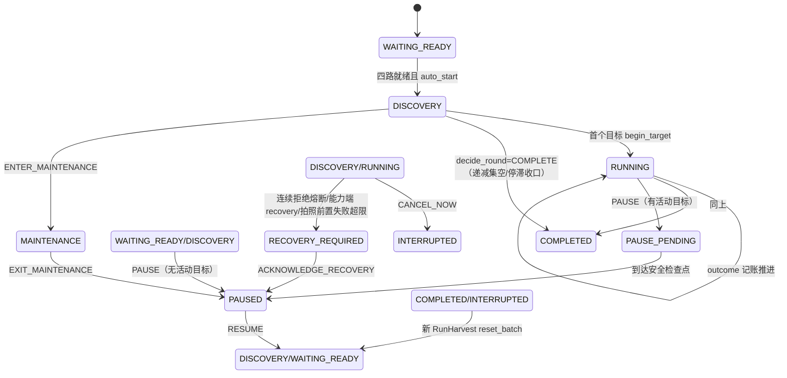
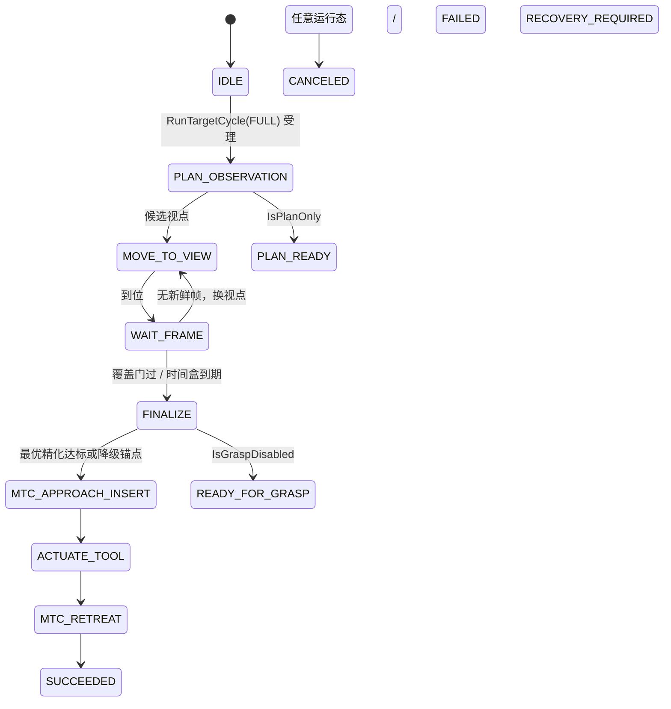

# 桃子采摘系统整体设计（2026-08-14）

> 本文档是采摘链路的整体设计与重构依据。基于对五个包的逐行 as-built
> 深读（2026-08-14），参考成熟开源/商业项目设计整理。状态：设计已定稿，
> 实现按第 11 节分阶段推进。驱动栈（L0）冻结只读，不在本文改动范围。

## 1. 设计目标与原则

- **非极端必抓**：除非检测/分割/拟合质量太差、目标超工作空间、持续闪烁
  不稳定，否则一律按重建过程的最优记录执行抓取（降级链兜底）。
- **一次看懂**：分层架构，每层单一职责；调度只在编排层，技能只执行稳定
  target_id；状态机权威唯一，字符串只作投影。
- **解耦与扩展**：跨包只经 ROS 接口（话题/服务/action）交互，不共享实现；
  纯核逻辑零 ROS（已有约定，单测强制）；新能力以注册表/参数接入。
- **效率优先**：观察段有时间盒与提前收官；感知/重建每帧成本有预算；
  监控与记录不拖累实时链。
- **可观测**：过程数据全量落盘（一次运行一文件夹），Web 只读展示流程线、
  阶段耗时、调度策略、性能指标。

## 2. 参考的成熟项目与借鉴点

| 项目 | 借鉴点 | 落地位置 |
|---|---|---|
| BehaviorTree.CPP + Nav2（BT 任务编排与恢复模式） | 周期技能用 BT 组合；恢复/重试语义集中在 BT 层 | peach_approach_grasp（已有，本次统一安全门决策点） |
| MoveIt Task Constructor（ROSCon 2018，stage 组合/Fallback/introspection） | 抓取动作分解为可组合 stage，规划与执行间有执行门 | grasp_task.cpp（已有） |
| MoveIt Pro / PAL Advanced Grasping（BT+MTC 商业范式） | BT 负责任务策略、MTC 负责运动原语，分层清晰 | 本次安全门分层依据 |
| SORT/DeepSORT（多目标跟踪：确认帧数/TTL/遮挡重获） | tentative→confirmed、TTL 清除、半径恢复 | target_registry.py（已有，语义对齐） |
| 关键帧 SLAM / BA（增量证据累积，MAP 选优） | 逐视角精化日志 = 证据序列，final 取最优记录 | 第 6 节 Refinement Journal（新设计） |
| 果实采摘系统综述（Perception→Localization→Planning→Manipulation→Detachment→Handling 六段）与 ROS2 苹果/草莓采摘管线（vision→harvest controller 任务定序→执行） | 分层管线与"感知锁批 + 编排定序 + 技能执行"结构 | 第 3 节分层架构（一致） |
| ros2_control / UR passthrough | 驱动层一次性下发、goal_hold | L0（冻结，不动） |

## 3. 分层架构

```
L5 观测层  peach_perception_web      只读监控 + 分类落盘（无写入口）
L4 编排层  peach_harvest_orchestrator 批次唯一所有者：生命周期状态机、就绪门、
                                       三级策略两阶段提交、优先级派发、outcome 记账、复扫
L3 技能层  peach_approach_grasp       单目标周期技能：BT + 视点规划 + 质量门 + MTC
L2 重建层  peach_reconstruction_ros2  局部 TSDF + 有界 ICP + 逐视角精化日志 + 最优记录
L1 感知层  peach_pose_ros2            YOLO+SAM 位姿、目标身份记忆、收齐锁定与优先级
L0 驱动层  aubo_*（冻结）              ros2_control passthrough + IO + dashboard
```

单向依赖：上层只依赖下层接口；L4 不假设 L3 内部实现（只经 action/参数服务/
Trigger）；L2 可从 journal 选优，L3 只消费"最优精化"单一契约。

## 4. 状态机总览

### 4.1 L4 批次状态机（peach_harvest_orchestrator，权威枚举 state_machine.hpp）



节点侧 PhotoStep 子状态机：NOT_STARTED→MOVE_PENDING→MOVING→RESET_PENDING
→RESETTING→DONE，失败冷却回退、超限进 RECOVERY_REQUIRED。

### 4.2 L3 目标周期状态机（CycleState 17 态，cycle_state.hpp）



### 4.3 L1 目标身份生命周期（TargetRegistry + GlobalHarvestPlan）

tentative →（obs_count≥confirm_frames=3）→ confirmed；tentative 超 TTL=5 帧清除；
confirmed 由三段匹配（同类 6cm 最近邻 / 恢复 21cm / 跨类 6cm 不放大）+ EMA 维持；
ID 单调不复用。批次层：收齐窗口（≥10 帧且 5 帧无新增，帧率自适应超时兜底）
→ 锁定排序（status→距离→置信度→id）→ selected 冻结 → complete_selected 推进。

### 4.4 L2 帧收集状态机（FrameCollector）

IDLE→COLLECTING→READY；采帧两阶段门禁（掩膜/深度/风动/帧龄/静止/精确 TF），
ICP 有界修正（≤10mm/3°，fitness≥0.35，rmse≤8mm），禁 latest TF。

## 5. 跨包接口契约

### 5.1 契约原则

1. 跨包只经 ROS 接口；话题名集中由参数配置（新增一律参数化，遗留硬编码
   逐步收敛）；消息字段只增不改语义。
2. 稳定契约用类型化消息（RunHarvest/RunTargetCycle/ControlHarvest/
   SetOperationPolicy/PeachTargetObservationArray/BagGraspCandidateArray/
   BagFittingArray）；演进中的观测性数据用闩锁 JSON 字符串
   （reconstruction status/diagnostics/grasp_decision、approach status）。
3. 枚举数值与 .msg 常量顺序对齐处必须加 static_assert（本次补齐）。
4. 闩锁（TRANSIENT_LOCAL）用于状态/结果类话题；数组空消息 = 显式清空。

### 5.2 接口总表（方向 = 提供方 → 消费方）

| 接口 | 类型 | 提供 → 消费 |
|---|---|---|
| /peach/perception/target_observations | PeachTargetObservationArray | 感知 → 重建/抓取/编排/Web |
| /peach/perception/initial_pose | BagGraspCandidateArray | 感知 → 重建 |
| /peach/perception/diagnostics | BagFittingArray | 感知 → 重建/Web |
| /peach/perception/{detections,masks,markers,single_cloud,axis,debug_image,detection_cloud} | 观测性 | 感知 → Web/rviz |
| ~/reset_global_targets、~/complete_selected_target、~/query_harvest_state | Trigger | 感知 ← 编排/抓取 |
| /peach/reconstruction/{local_cloud,tsdf_cloud,markers} | 观测性 | 重建 → Web/rviz |
| /peach/reconstruction/{status,diagnostics,grasp_decision} | String JSON 闩锁 | 重建 → 抓取/编排/Web |
| /peach/reconstruction/{refined_pose,refined_axis,refined_diagnostics} | 闩锁（最优记录） | 重建 → 抓取/Web |
| ~/start/reset/finalize/save_session/capture_frame/remove_last_frame/query | Trigger | 重建 ← 抓取/调试 |
| ~/run_target_cycle | RunTargetCycle action | 抓取 ← 编排 |
| ~/go_to_photo_pose、~/set_execution_armed 等 8 服务 | Trigger/SetBool | 抓取 ← 编排/调试 |
| ~/state、~/events、~/control、~/set_operation_policy、~/run_harvest | 类型化 | 编排 → Web/操作员 |

### 5.3 关键字段契约

- `suggested_travel_m`：感知/重建给出建议行程，抓取端无效才几何回退。
- `PeachTargetObservation.diagnostic_flags` 含 `anchor_from_memory` = 记忆锚点
  回填帧（不刷新观测新鲜度）；回填必须同时给 entry_pose（本次补齐缺口）。
- `refined_pose` 空数组 = 清空闩锁；`grasp_decision.allowed=true` 仅当
  READY+ok+ACCEPT 且 target_id 匹配。

## 6. 核心新设计：逐视角精化日志（Refinement Journal）与最优记录选择

**动机**：现状只在 finalize 对最终 TSDF 跑一次精化，且每收新帧 `_refined=None`
——扫描过程中的中间精化证据全部丢弃，最终结果差时没有任何历史可回退。
借鉴关键帧 SLAM 的证据累积与 MAP 选优：扫描过程持续记录每次精化结果，
收官时按规则选最优记录作为抓取依据。

### 6.1 记录模型（重建端新增，每被接受视角一条）

```json
{"journal_id": 3, "view_index": 2, "stamp_sec": 0.0, "cloud_points": 18234,
 "status": "ACCEPT|REOBSERVE|REJECT", "rmse_m": 0.0031, "inlier_ratio": 0.42,
 "center": [0,0,0], "axis": [0,0,1], "bottom": [0,0,0], "neck": [0,0,0],
 "entry": [0,0,0], "diameter_m": 0.062, "suggested_travel_m": 0.09, "flags": []}
```

- 每接受一帧（`_accept_frame` 完成后）对当前 TSDF 提取云增量跑一次
  `refine_geometry`，追加 journal；异步单线程执行（latest-request 队列），
  不阻塞采帧链；`refine.journal_enabled=true`、`refine.journal_async=true`、
  `refine.journal_max_records=32`。
- 选优规则：ACCEPT 优先于 REOBSERVE，REJECT 永不入选；同类内
  inlier_ratio 降序、rmse 升序。`_refined` 改为从 journal 最优记录派生
  （对外三话题契约不变）；无记录时 finalize 走原一次性 refit 路径。
- finalize 时先冲刷异步队列（等 ≤ timeouts.refined_s），补跑一次最终
  refit 入列，再选最优。
- 落盘：diagnostics JSON 增 `refined_journal`（最近 8 条）+ `refined_best`；
  session metadata 增 `refine_history` 全量；events.jsonl 在
  `reconstruction_finalized` 携带最优记录与 journal 大小。
- 自动路径拒帧补记 `frame_rejected` 事件（与手动路径对齐）。
- journal 最优变化时重发闩锁 grasp_decision/refined_* ——抓取端扫描期间即可
  看到"当前最优"（Web 同步可见），但**不**作为提前收官条件：覆盖门仍是
  主收官条件，时间盒/移动上限为兜底（多视角证据通常优于单视角）。

### 6.2 抓取端消费（改动最小化）

- TargetCache 维持单槽最优精化契约（选优在重建端完成，职责单一）。
- 修复 waitForRefined 谓词：以 refined_pose 到达为准（fitting 单独到达
  不满足），避免"精化位姿不存在"硬 FAILED 绕过降级链。
- 降级链不变：无 ACCEPT 记录 → REOBSERVE 最优 → 候选锚点降级抓取
  （仅目标消失/身份变更等极端情况才 SKIPPED）。

## 7. 安全门分层（解决门互相否决的矛盾）

as-built 矛盾：BT 层放行 stale（记忆锚点获取性移动/静态锚点 MTC），
motion/MTC 内层门又否决 → 放行策略实际不可达，且安全门失败被误记
SKIPPED_UNREACHABLE。**修订为分层单点决策**：

| 层 | 门 | 内容 | 决策点 |
|---|---|---|---|
| motion/MTC 执行边界 | safetyReady（硬件安全门） | robot_status 新鲜 + 非急停/故障 + 已上电 + 可运动 | 永不放宽，唯一保留在执行边界的门 |
| BT 层 | 目标门（cycleTargetReady） | 身份一致 + 观测新鲜度（EMA 自适应） | 扫描候选前、MTC 前单点判定 |

- 目标新鲜度策略只在 BT 层：扫描起步 stale → 凭记忆锚点获取性移动；
  扫描中途 stale → 等一窗复核，恢复继续/否则失败；MTC 前 stale → 等一窗
  复核，仍 stale 则 WARN 后按静态锚点继续（验证期明确策略，日志留痕）。
- motion 层 planOrMove* 不再含目标门；MTC execution_gate 只含 safetyReady。
- 失败归因修正：planOrMove 返回原因枚举（SAFETY_GATE/PLAN_FAILED/
  EXEC_FAILED），BT 据此外传 outcome——安全门失败记 FAILED（可触发
  recovery），不再误记 SKIPPED_UNREACHABLE。
- goal 钉死：btPrepareCycle 的快照必须 id==goal.target_id，身份变更即失败
  （感知 selected 切走 → 本周期失败 → 编排按新 selected 重派）。

## 8. 失败分类与降级链（非极端必抓）

```
Finalize 收官
 ├─ 最优记录 ACCEPT 且质量门过      → 精化位姿抓取（标准路径）
 ├─ 无 ACCEPT（REOBSERVE 最优/无记录）→ 候选锚点降级抓取
 │    （entry = 锚点 − 轴×(行程+5cm)，行程钳 [0.02, 0.20]）
 ├─ 目标身份丢失/快照不存在          → SKIPPED_QUALITY（极端）
 └─ 视点全部不可达/扫描不收敛         → SKIPPED_UNREACHABLE
执行段：MTC 规划失败 FAILED；接触段异常/取消 RECOVERY_REQUIRED；
急停类 safetyReady 失败 FAILED 并向编排传播 recovery 语义。
```

outcome 分级（编排记账）：SUCCEEDED / SKIPPED_QUALITY / SKIPPED_UNREACHABLE /
FAILED / CANCELED(+操作员 SKIP)；FAILED 连续触发由编排熔断
（`dispatch.max_consecutive_rejections` 参数化，本次补齐）。

## 9. 效率设计

- **观察段双上限**：`scan.maximum_moves=5` + `scan.time_budget_s=5.0`
  （暂时测试设置，实际工况再调）；时间盒到期带现有覆盖强制 finalize，
  由最优记录/降级链兜底。
- **视点规划**：球面候选按基线高斯/新颖度/运动量/径向四元评分；
  每轮以缓存最新观测锚点重生成（跨视角锚点自动纠偏）；桌面保护平面
  生成期剔除；label 去重。
- **帧率自适应**：观测话题帧间隔 EMA → 目标新鲜度门（2.5 帧+0.5s）与
  视点等待（4 帧+1s）自适应伸缩；采帧间隔/近重复/跳变由 FrameCollector 判定。
- **感知帧预算**：SAM 由逐目标调用改批量一次（N 目标 N 次 forward → 1 次）；
  YOLO detect 包异常保护；检测框点云组装保留（观测性，可后续优化）。
- **重建帧预算**：ICP fine 尺度 source 只 prepare 一次；TSDF 提取云维持
  每帧（ICP target 依赖）；点云发布节流 `performance.cloud_publish_max_hz=2.0`
  （vstack 全量发布不再每帧跑）；journal refit 异步不阻塞采帧。
- **记录预算**：masks PNG 按目标节流（≥1s/张）；recorder 队列落盘，
  长批次占用见第 10 节 P1（轮转上限后续加）。

## 10. 问题登记册（2026-08-14 深读结论）

### P0（本次修复）

| # | 包 | 问题 | 修法 |
|---|---|---|---|
| 1 | approach | BT 放行 stale 被 motion/MTC 内层门否决（逻辑矛盾，真机 stale 致死根因） | 第 7 节分层：目标门上移 BT 单点 |
| 2 | approach | 降级行程在 entry 赋值前计算，几何回退恒钳 0.02 | 先构造 entry/neck 再算行程 |
| 3 | approach | waitForRefined 谓词可由 fitting 单独满足 → 硬 FAILED 绕过降级链 | 谓词以 refined_pose 到达为准 |
| 4 | approach | goal 目标未钉死（受理到 Prepare 间 selected 切换即在错目标上跑） | Prepare 快照强制 id==goal |
| 5 | approach | 安全门失败误分级 SKIPPED_UNREACHABLE | planOrMove 返回原因枚举，BT 分级 |
| 6 | approach | onParameters 静默吞掉其余参数 | 动态改参重跑 loadParameters |
| 7 | approach | QualityGateConfig/ViewPlannerConfig 结构体默认值滞后于 yaml | 对齐（含单测期望） |
| 8 | recon | 精化证据只存最终一份，新帧即失效 | 第 6 节 journal |
| 9 | recon | 自动路径拒帧不落事件 | 补 frame_rejected |
| 10 | recon | ICP fine 尺度 source 重复 prepare；点云每帧全量发布 | 去重 + 发布节流 |
| 11 | pose | bounded_worker 无异常保护，推理异常杀 worker 线程后静默无输出 | run 循环 try/except + 错误日志 |
| 12 | pose | engine.detect 未捕获（SAM 侧已捕获） | 包 try |
| 13 | pose | 记忆锚点回填缺 entry_pose（下游契约缺口） | 用 contracts 纯函数补算回填 |
| 14 | pose | SAM 逐目标调用 | 批量一次调用按序取回 |
| 15 | orchestrator | 熔断阈值 6 魔法数 | dispatch.max_consecutive_rejections 参数化 |
| 16 | orchestrator | 枚举与 .msg 常量靠顺序隐式对齐 | static_assert 补齐 |
| 17 | orchestrator | batch_completed 事件 refresh/execute 重复发 | 单点发送 |

### P1（记录在案，后续迭代）

- orchestrator：RunHarvest 取消≠批次停止、CANCEL_NOW 后 RunHarvest 无终局、
  就绪门单向闩锁（运行中丢就绪不回拉）、中途接受 RunHarvest 重置轮次、
  回调内 future.wait_for 阻塞 executor（2 线程）、锁内发布、
  FAULT/RETRY_TARGET 预留枚举、EXPLICIT_TARGETS 未实现。
- approach：move_group 跨线程并发（有意模式，需收敛为串行执行边界）、
  OBSERVE_ONLY 死模式、attempted label 去重与锚点纠偏相互干扰、
  startup 不校验使能依赖（yaml 直写 grasp=true/tool=false 到 ActuateTool 才爆）。
- recon/pose/web：`~/` 与 `/peach/perception/*` 双套话题待收敛、
  tf_utils 双份副本、recon 源码级 import pose 纯核（可接受但需声明）、
  harvest_data events.jsonl 双进程追加无锁、summary 正则回推中文文案、
  recorder/masks 无轮转上限、web snapshot 全量深拷贝。
- 驱动层（冻结，只记录）：无。

## 11. 实施计划（本次执行）

1. 重建端：journal + 拒帧事件 + ICP 去重 + 发布节流（参数见第 6/9 节）。
2. 抓取端：安全门分层 + P0 #2-#7（含单测期望同步，不跑测试）。
3. 感知端：worker/检测异常保护 + entry_pose 回填 + SAM 批量 + masks 节流。
4. 编排端：#15-#17 + README 语义对齐。
5. 全量 colcon build 验证编译（不跑 colcon test / pytest，用户指示今日不测）。
6. AGENTS.md / 各 README / 集成契约文档同步。

后续真机验证顺序：sim 闭环（若有需要）→ 真机 plan-only → 单目标完整周期
→ 全批次自动；重点量化：跨视角锚点偏差（实测 15-20cm 根因待查）、
journal 最优与最终精化的一致性、降级抓取方向/定位准确性。

## 12. 验证标准

- 编译全绿；lint 风格不破（下次跑 colcon test 时全绿）。
- 单目标周期：扫描段每个接受视角产生一条 journal 记录；finalize 后
  grasp_decision 对应最优记录；无 ACCEPT 时降级抓取正常触发。
- 安全门：急停/掉电时任何运动立即停发（motion 层唯一硬件门）；
  stale 不再导致静默失败或误分级。
- 记录：web_runs 运行文件夹内含 journal（diagnostics 落盘）与拒帧事件，
  summary 统计完整。
