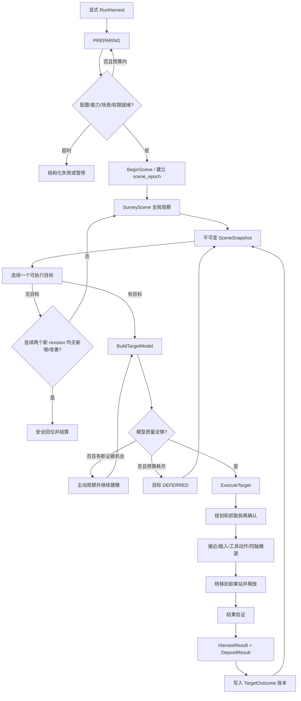

# 桃子感知—重建—抓取—卸果全链路重设计方案

> 状态：设计基线已核对并冻结，尚未进入重构、联调或真机执行  
> 日期：2026-08-19  
> 适用工作区：`/home/mu/Desktop/aubo_e5_jazzy_ws`  
> 参考实现：当前工作区源码与文档、`/home/mu/aubo_boot/aubo_ros2_jazzy_ws/Robotics_Tutorial`  
> 变更性质：允许破坏性重设计；切换完成后直接删除旧实现，不保留兼容层或重复归档  
> 安全边界：AUBO 真机驱动栈冻结只读；禁止自动上电；未授权时不得产生真实运动或工具输出

## 1. 文档目的

本文固定桃子采摘系统下一版的业务流程、组件边界、状态机、输入输出、过程数据、算法、
故障语义、安全权限、迁移与验收门。后续实现必须从本文推导，不能通过临时服务、特殊参数
或节点间隐式共享状态绕过这些约束。

本文不是对当前代码“已经具备这些能力”的声明。当前实现中已经完成或正在修改的内容，
只有在通过本文定义的阶段门后，才可视为新架构能力。

## 2. 目标与非目标

### 2.1 目标

1. 建立可长期演进的采摘任务平台，而不是继续在现有批次脚本上补分支。
2. 将场景事实、目标模型、机械臂技能、任务业务和观测记录严格分离。
3. 每项事实只有一个权威所有者；所有跨包数据使用类型化、可版本化接口。
4. 感知、重建、规划、运动、工具、卸果和验证均可独立回放、量化和定位故障。
5. 通过稳定的能力接口和有限插件点吸收算法更新，避免每次替换模型或评分方式都小范围重构。
6. 默认安全：启动不自动执行、权限逐级提升、崩溃不自动续动、接触路径不任意降级。
7. 代码和文件保持简洁；迁移完成后删除旧接口、重复配置、重复事实文件和装饰性抽象。

### 2.2 非目标

1. 不修改冻结的 AUBO 驱动、控制器、dashboard、真机映射和自动上电策略。
2. 不在第一版引入神经 ReID、任意运行时脚本或可热替换的安全状态机。
3. 不把 BehaviorTree 用作数据总线，也不把 MTC 用作业务编排器。
4. 不用 Web、launch 或参数更新隐式启动采摘任务。
5. 不在工具 IO、物理反馈和卸果站未标定前宣称真实采摘闭环完成。

## 3. 当前链路审查结论

### 3.1 可保留的技术基础

- YOLO + MobileSAM 的检测分割组合，以及按容量限制批量推理的方向合理。
- 重建链中的精确深度时间戳 TF、有界 ICP、FK 回退判定、在线 TSDF 和几何精化可保留。
- 接近抓取中“自由空间转移 + 受约束接触段”的分层符合安全要求。
- Lifecycle、动作取消、只读监控和结构化结果已有基础，可在新边界中重建。
- `Robotics_Tutorial` 中的高层异步 BT、类型化端口、MTC 运动阶段、恢复预案、事件回放
  和主动感知信息增益原则适合本项目。

### 3.2 必须解决的结构问题

1. 感知消息混入 `selected`、`completed`、`run_id` 等业务状态，场景事实与任务决策耦合。
2. 批次推进依赖 reset/finalize/complete/reopen 等细粒度 RPC，跨节点事务边界过碎。
3. 旧流程依赖固定复扫轮次和 `OBSERVE_ONLY` 补丁，质量提升与正常目标执行形成两条业务链。
4. 单帧感知承担袋体圆柱、果体球和工具余量推断，过早混合观测事实、目标模型和工具决策。
5. 身份关联主要依赖固定半径近邻；大恢复半径会提高跨目标误合并风险。
6. 抓取端承担过多全局编排，BT 中存在阻塞循环、成员全局状态和单节点装饰子树倾向。
7. 工具当前主要是 SetIO 命令，命令回显不等于物理反馈；缺少完整准备、释放和卸果链。
8. 质量阈值在代码、配置和文档中不一致，无法形成唯一验收口径。
9. 过程落盘存在按帧重复事实或 `latest_*` 文件倾向，因果关系和回放能力不足。
10. 编排器派发协议测试存在 14 项跳过，当前“测试通过”不能覆盖真正的跨节点动作协议。

## 4. 设计原则与系统边界

### 4.1 单一所有权

| 数据或行为 | 唯一所有者 | 其他组件权限 |
|---|---|---|
| 原始观测、身份、场景快照 | `peach_scene_perception` | 只读消费 |
| 单目标多视角模型与形状假设 | `peach_target_reconstruction` | 请求构建、只读消费 |
| 机械臂、MTC、工具、转移和卸果技能 | `peach_manipulation_skills` | 仅通过动作调用 |
| job、scene、选择、重试、结果账本、终止 | `peach_task_executor` | 只读状态/事件 |
| 投影、记录、回放、分析 | `peach_observability` | 严格只读，不反向控制 |
| 跨语言 ROS IDL | `peach_interfaces` | 所有组件共同依赖 |

### 4.2 事实不可变、命令显式、状态可恢复

- `ObservationFrame` 和 `SceneSnapshot` 发布后不可修改；新证据产生新 revision。
- 命令必须带 `request_id`、目标 job 和期望状态序号，支持幂等与并发冲突检测。
- 任务状态来自持久事件日志重放，不从多个节点的“当前值”拼接恢复。
- 能力动作返回结构化结果；字符串只用于展示，不参与控制逻辑。

### 4.3 有限插件边界

只允许以下算法扩展点：

1. 全局观察策略；
2. 目标选择评分；
3. 主动视点评分；
4. 抓取候选生成与排序；
5. 结果验证。

任务状态机、安全门、权限升级、事件日志和持久恢复不得插件化。

## 5. 目标包结构

| 目标包 | 职责 | 迁移来源 |
|---|---|---|
| `peach_interfaces` | 唯一跨包 msg/srv/action 与枚举 | 合并并替代 `peach_pose_msgs`、`peach_harvest_msgs` |
| `peach_scene_perception` | RGB-D 观测、分割、锚点、协方差、身份、快照 | 重构 `peach_pose_ros2` |
| `peach_target_reconstruction` | 单目标采集、配准、TSDF、形状精化、质量 | 重构 `peach_reconstruction_ros2` |
| `peach_manipulation_skills` | 全局观察、主动观察、候选、MTC、工具、卸果 | 重构 `peach_approach_grasp` |
| `peach_task_executor` | job 所有权、选择、账本、控制、恢复、终止 | 重构 `peach_harvest_orchestrator` |
| `peach_observability` | 只读状态投影、JSONL/MCAP、回放与分析 | 重构 `peach_perception_web` 与 recorder 工具 |
| `peach_common_py` | 被至少两个包使用的零 ROS Python 小工具 | 严格收缩/重命名 `peach_core` |

`peach_common_py` 禁止包含业务状态、持久化仓库、ROS adapter、节点基类或万能 utilities。
某段代码只有一个消费者时留在所属包内。

四个核心能力包均使用 `LifecycleNode`：

- `peach_scene_perception`
- `peach_target_reconstruction`
- `peach_manipulation_skills`
- `peach_task_executor`

`peach_observability` 为普通只读节点。MoveIt/MTC 若因库限制需要伴随普通节点，只允许作为
`peach_manipulation_skills` 的内部实现，不能形成第二个运动所有者。

## 6. 总体工作流



### 6.1 启动与准备

1. launch 只启动和激活组件，绝不自动开始任务。
2. 任务只能由显式 `RunHarvest` action 创建。
3. `PREPARING` 在有界时间内检查：
   - profile 注册、schema、hash；
   - 感知、重建、技能和执行器 Lifecycle Active；
   - 相机内参与手眼标定版本；
   - TF 连通性与时间同步；
   - MoveIt/机器人状态；
   - 工具、卸果站和容器能力；
   - 请求的 job intent 与当前 authority 是否匹配。
4. 未就绪时持续发布结构化 blockers；超时返回明确失败，不使用最后一次陈旧状态继续。

### 6.2 场景建立

- `scene_key` 必填，由调用者代表一个物理工作区/树冠场景。
- 同一 `scene_key` 继续当前 `scene_epoch` 和身份记忆。
- `scene_key` 改变时创建新 epoch，清除跨场景身份关联，但保留历史任务日志。
- 若空间拓扑、静态背景或目标整体分布显示明显换场而调用者复用旧 key，返回
  `SCENE_MISMATCH`，不得静默混合。
- 同场景的新 job 只继承先前 `SUCCESS` 的排除记录；`FAILED`、`DEFERRED` 可重新评估。
- `force_reprocess` 可显式覆盖成功排除，但必须写审计事件。

### 6.3 全局观察和场景稳定

- 默认观察策略名为 `global_photo_pose`，由 profile 解析为命名姿态和观察参数。
- `ANALYZE_ONLY` 使用当前位置被动观察，不申请运动权限。
- 全局观察超时返回带证据和质量说明的降级快照，不伪装为稳定快照。
- 默认稳定条件：10 个有效观测帧，最后 5 帧身份集合稳定，总预算 40 s。
- 场景稳定与单目标质量分离；个别低质量或摆动目标不能阻塞整个场景进入选择阶段。

### 6.4 选择、延期和收口

- 选择模式支持：`ALL_ELIGIBLE` 和 `INCLUDE_TARGET_IDS`。
- 显式目标可带业务优先级 bucket；先比较 bucket，再用成功概率评分。
- 默认评分综合：观测质量、模型可达性预测、邻域拥挤度、运动代价、历史失败和新证据。
- 单次失败先进入 `DEFERRED` 和冷却，不立即形成永久失败。
- 只有以下新证据可重新开放延期目标：质量提高、位置/协方差显著更新、可达性改变、
  遮挡解除或工具/容器状态恢复。时间流逝本身不算新证据。
- 每目标最多 3 次 attempt、最多 2 次基于证据的 reopening；单 attempt 默认 120 s；
  job 默认 15 min。等待人工恢复的时间不计入 job timeout。
- 自动模式在连续两个新的 SceneSnapshot revision 中均无新增或改善目标后收口，不使用固定
  复扫轮数。
- 正常完成回到 profile 指定安全姿态，默认 `global_photo_pose`。

## 7. 任务、权限和暂停语义

### 7.1 job intent 与 authority 分离

`JobIntent`：

- `ANALYZE_ONLY`：只生成分析报告，不写采摘业务结果账本，不申请运动或工具权限。
- `EXECUTE`：允许在权限满足时执行完整目标链。

`AuthorityLevel` 单调提升：

```text
READ_ONLY -> SURVEY_MOTION -> CONTACT_MOTION -> TOOL_ENABLED
```

低级 authority 不可通过 profile 或内部重试隐式升级。真实工具能力未标定时，
`TOOL_ENABLED` 必须保持不可获得。

### 7.2 控制命令

`ControlTask` 支持：

- `SET_AUTHORITY`
- `PAUSE`
- `RESUME`
- `DEFER_CURRENT`
- `CANCEL`
- `ACK_RECOVERY`
- `CONFIRM_CONTAINER_REPLACED`

每个请求必须携带 `request_id`、`job_id`、`expected_state_seq`。重复 request 返回首次结果；
状态序号不匹配返回冲突，不执行命令。

### 7.3 安全检查点

- `PAUSE`：运行到最近安全检查点后暂停。
- `DEFER_CURRENT`：安全结束当前 attempt，并只在当前 job 中延期该目标。
- `CANCEL`：安全终止当前动作后结束 job。
- 若工具已经持果，PAUSE/CANCEL 优先完成安全撤退和卸果，不在工作区内长期持果等待。
- 崩溃恢复后未完成 job 进入持久 `RECOVERY_REQUIRED`，运动权限归零。
- `ACK_RECOVERY` 只把状态转为 `PAUSED`；仍需显式 `RESUME`，禁止自动续动。
- `RECOVERY_REQUIRED` 无自动超时；只能由人工检查后处理。

## 8. 状态机与结果语义

### 8.1 TaskPhase

```text
PREPARING
AWAITING_AUTHORITY
ESTABLISHING_SCENE
SURVEYING
SELECTING
EXECUTING_TARGET
VERIFYING
RESURVEYING
COMPLETING
PAUSING
PAUSED
RECOVERY_REQUIRED
TERMINAL
```

### 8.2 TargetPhase

```text
PENDING
MODELING
OBSERVING
PLANNING
RECONFIRMING
APPROACHING
INSERTING
TOOL_ACTION
RETREATING
TRANSFERRING
DEPOSITING
VERIFYING
DEFERRED
TERMINAL
```

### 8.3 终局类型

`TargetOutcome`：`SUCCESS`、`DEFERRED`、`FAILED`、`CANCELED`、
`RECOVERY_REQUIRED`。

`JobOutcome`：

- `COMPLETED`：所有纳入目标均成功或不存在可执行目标；
- `COMPLETED_PARTIAL`：至少一个成功，同时存在延期/目标级失败；
- `FAILED`：系统、安全或无法建立场景等 job 级失败；
- `CANCELED`：由明确取消结束。

`TargetOutcome.SUCCESS` 只有在 `HarvestResult` 和 `DepositResult` 都满足成功条件时成立。

## 9. 公共接口

接口字段以下列语义为冻结基线。具体 ROS IDL 为适应定长常量或数组可调整表示形式，但不得
改变所有权、有效性和失败语义。

### 9.1 Actions

#### `RunHarvest`

Goal：`request_id`、`scene_key`、`profile_id`、`intent`、`selection_mode`、
`include_target_ids`、`priority_buckets`、`force_reprocess`。

Feedback：`job_id`、`state_seq`、`task_phase`、当前 `target_ref`、进度计数、预算、
blockers、最近事件引用。

Result：`JobSummary`、最终事件序号、manifest 路径。

#### `SurveyScene`

Goal：`job_id`、`scene_ref`、`profile_ref`、观察策略、authority、时间预算。

Feedback：候选姿态、已完成姿态、有效帧数、稳定度、blockers。

Result：`SceneSnapshot` 引用、是否降级、证据引用、`FailureDetail`。

#### `BuildTargetModel`

Goal：`job_id`、`scene_ref`、`target_ref`、`profile_ref`、起始 snapshot revision、预算。

Feedback：接收/拒绝帧数、视角簇、覆盖度、质量级别、下一视角建议。

Result：`TargetModel`、模型质量、采集证据、`FailureDetail`。

#### `ExecuteTarget`

Goal：`job_id`、`attempt_id`、`scene_ref`、`target_ref`、`target_model_ref`、
`profile_ref`、authority、有效期。

Feedback：`TargetPhase`、候选漏斗、规划场景 revision、执行误差、工具/卸果/验证状态。

Result：`HarvestResult`、`DepositResult`、`Verification`、`TargetOutcome`、
`FailureDetail`、证据引用。

### 9.2 Services

- `BeginScene`：根据显式 `scene_key` 返回 `SceneRef`，检测 mismatch 和 epoch 变更。
- `ControlTask`：提供第 7.2 节定义的幂等控制命令。

不再提供 reset/finalize/save/complete/reopen 等细粒度业务 RPC。

### 9.3 Topics

- `TaskState`：当前状态投影，可使用 transient local；不作为恢复权威源。
- `TaskEvent`：低延迟事件流；权威副本在执行器持久 journal。
- `CapabilityStatus`：Lifecycle、健康、blockers、输入新鲜度、可授予 authority。
- `ObservationFrame`：单帧观测事实。
- `SceneSnapshot`：场景不可变 revision。

### 9.4 核心类型

- `ProfileRef`：`profile_id`、schema version、内容 hash。
- `SceneRef`：`scene_key`、`scene_epoch`、创建时间、场景签名版本。
- `TargetRef`：scene epoch 内稳定 `target_id` 和 `target_kind`。
- `ObservationFrame`：源图像引用、label mask、标定版本、TF 状态、观测列表、质量。
- `TargetObservation`：类别、置信度、label、相机/世界锚点、协方差、深度统计、跟踪状态。
- `SceneSnapshot`：revision、稳定度、目标事实、可见性、来源帧范围、有效期。
- `TargetModel`：融合模型、质量指标、ShapeHypothesis 列表、来源与有效期。
- `ShapeHypothesis`：不含工具语义的物体几何和协方差。
- `GraspHypothesis`：结合 ToolModel 后的 entry、travel、roll、余量、风险和排名。
- `FailureDetail`：reason code、scope、recovery hint、证据引用和展示文本。
- `Verification`：结论、置信等级、方法、依据 snapshot/传感器/operator 引用。
- `TargetOutcome`：attempt 历史、HarvestResult、DepositResult、Verification。
- `JobSummary`：场景、profile、各目标结果、耗时、blockers、事件和证据索引。

### 9.5 通用数据契约

1. 所有几何均携带 `frame_id`、`stamp`、`valid_until` 和协方差。
2. 禁止用 `-1`、空字符串、零姿态或 NaN 隐式表达无效；使用显式 validity/status。
3. 数组元素必须自包含或使用稳定 ID 关联，禁止靠多个平行数组的下标隐式绑定。
4. 每个动作结果都包含 `FailureDetail`，即使成功也使用明确 `NONE` reason。
5. 所有引用必须包含 scene epoch，防止跨场景复用相同 target_id。

## 10. 感知与身份链

### 10.1 输入

- RGB 图像；
- 与 RGB 对齐的深度图；
- `CameraInfo`；
- 深度图精确时间戳对应的 TF；
- 模型版本、相机标定版本、手眼标定版本；
- `SceneRef`。

### 10.2 单帧处理

```text
时间同步
 -> YOLO 检测
 -> 置信度/尺寸过滤与 NMS 去重
 -> MobileSAM 批量分割
 -> 生成单张 mono16 label mask
 -> 深度有效性和连通性检查
 -> 反投影与鲁棒锚点估计
 -> 观测协方差
 -> 世界系身份关联
 -> ObservationFrame
```

- 每帧只发布一张 `mono16` label mask；目标通过 label 引用区域，禁止为每个目标复制整图 mask。
- 圆柱、球、插入方向和工具余量不属于单帧场景感知，迁移到目标重建或抓取候选阶段。
- 精确 TF 不可用时可发布仅供诊断的相机系观测，但不得进入身份 registry、SceneSnapshot
  或任何可执行目标。
- SAM 失败时允许用深度连通区域维持低置信跟踪；该结果不得参与 TargetModel、抓取或结果验证。

### 10.3 身份关联

第一版使用协方差门控的全局一对一匹配，不使用神经 ReID：

1. 候选边必须通过类别、空间马氏距离、尺寸相容性和邻域拓扑门。
2. 在所有合法边上求全局最小代价一对一分配，禁止逐目标贪心近邻。
3. 多解接近或拓扑冲突时标记 `AMBIGUOUS`，不得强制合并。
4. 只有带精确世界 TF 的观测可以更新稳定身份。
5. 身份确认条件：至少 3 个有效观测，且时间跨度至少 2 s。
6. tentative 目标 8 s 无命中删除；30 s 标记 stale；120 s 标记 LOST；600 s 清理身份记忆。
7. 时间判定同时使用观测数量和单调墙钟，避免帧率变化改变业务语义。

系统检测并跟踪 `BAGGED_PEACH` 与 `BARE_PEACH`。标准 `ExecuteTarget` 只允许袋装目标；
裸果可以生成研究模型，但请求接触动作时返回 `TARGET_KIND_NOT_EXECUTABLE`。

### 10.4 SceneSnapshot

- snapshot 是当前 scene epoch 的不可变事实集合，包含 revision 和来源帧区间。
- 场景稳定度描述身份集合是否稳定；目标质量独立记录。
- 摆动、逆光、深度空洞、出视野等均是目标事实，不直接替任务执行器做永久跳过决策。
- snapshot 不包含 selected、completed、job_id 或 run_id。

## 11. 单目标重建与主动观察

### 11.1 重建链

```text
BuildTargetModel
 -> 绑定 scene/target/snapshot revision
 -> mask、目标、质量、新鲜度、漂移、视角增量、精确 TF 门
 -> 深度反投影
 -> 有界 ICP
 -> ICP/FK 接受判定
 -> 在线 TSDF 融合
 -> 几何精化
 -> ShapeHypothesis[] + covariance
 -> TargetModel 质量评估
```

配准约束：

- ICP 修正上限：平移 10 mm、旋转 3°。
- ICP 合格时使用 ICP 修正。
- ICP 不合格但 FK 对齐重叠度足够时使用 FK。
- 两者均不合格时拒绝该帧；拒绝帧绝不能进入 TSDF。
- TSDF 需要回滚时，通过已接受帧的确定性重放重建，禁止就地猜测性反融合。

硬拒绝条件：非有限数、非半正定协方差、身份歧义、缺少精确 TF、退化几何、超出
profile 物理范围。

### 11.2 Shape 与 Grasp 分离

- `ShapeHypothesis` 只描述物体：袋体圆柱/截锥、果体球、袋底、袋颈、轴线、尺寸和协方差。
- `GraspHypothesis` 由 manipulation 结合 ShapeHypothesis 与 `ToolModel` 生成。
- 重建节点不得发布“某工具可直接执行”的抓取结论。

### 11.3 主动视点

候选视点来自确定性球面采样；评分使用几何信息增益混合模型：

```text
score = 预计覆盖增益
      + 预计协方差下降
      + 目标可见性
      + 可达性
      - 运动代价
      - 碰撞/奇异/保护区风险
```

重建端给出期望观察方向和信息价值，manipulation 决定实际安全姿态。插件只能替换评分或
候选生成策略，不能绕过运动安全门。

### 11.4 统一质量口径

| 指标 | USABLE | HIGH_CONFIDENCE |
|---|---:|---:|
| 视角簇数量 | >= 3 | >= 5 |
| 最大基线 | >= 15° | >= 22° |
| 平均最近视角间隔 | >= 6° | >= 8° |
| 平均有效深度比例 | >= 0.35 | >= 0.40 |
| 圆柱内点率 | >= 0.35 | >= 0.50 |
| 几何精化 RMSE | <= 10 mm | <= 5 mm |
| 中心标准差 | <= 10 mm | <= 5 mm |
| 轴向标准差 | <= 10° | <= 5° |

标准执行 profile 要求 `HIGH_CONFIDENCE`；明确命名的降级 profile 可接受 `USABLE`，
但仍须通过全部硬安全门。默认模型采集预算 45 s、最多 5 次观察移动，包含在 120 s attempt
预算中。

## 12. 抓取、运动、工具与卸果

### 12.1 插入几何

袋装桃的工具插入方向固定为：从袋底外侧进入，沿“袋底指向袋颈”的轴线前进。

抓取候选计算：

1. 从 ShapeHypothesis 得到袋底、袋颈、中心轴、上置信尺寸和保护平面关系。
2. 结合 ToolModel 得到 entry、standoff、travel、闭合/剪切位置和工具包络。
3. 横向误差预算至少包含：位置标准差 + 路径长度 × `sin(轴向标准差)`。
4. 硬门检查：工具净空、有效行程、保护平面、IK、关节限位、碰撞、可操作度。
5. 围绕轴线生成多个确定性 roll 候选并排序，禁止固定使用世界 X 轴姿态。

### 12.2 PlanningScene

每次 attempt 使用短生命周期本地场景，包含：

- 最新局部深度障碍物快照；
- 当前目标几何；
- 按协方差膨胀的邻近目标；
- 静态保护区和桌面/树干等约束；
- 真实空心工具 mesh，而不是实心粗略包络。

必须记录场景 revision、来源帧、构建时间和 `valid_until`。超过有效期必须重建场景，
不得用参数延长陈旧障碍物寿命。

### 12.3 MTC 与执行约束

在接触前一次性预规划并验证：

1. 自由空间到入口前姿态；
2. 沿轴 Cartesian 插入；
3. 工具动作后的同轴 Cartesian 撤退。

接触路径不得回退到任意 OMPL。若工具动作后实际关节状态偏离，只允许重新规划受约束的
同轴撤退；无法满足时进入人工恢复，不尝试自由空间逃逸。

BT 只负责能力级异步编排、超时、取消和恢复检查点；MTC 只负责运动阶段。禁止在 BT tick
中执行长阻塞循环，禁止通过节点成员变量形成隐藏黑板，禁止保留只有一个动作节点的装饰子树。

### 12.4 工具顺序

完整工具流程：

```text
prepare/open
 -> actuate/close/cut
 -> constrained retreat
 -> transfer
 -> deposit/release
 -> reset
```

现有 `fun=3, pin=0` 只能视为历史实现，不能作为新 ToolProfile 的真实映射依据。
工具 IO 映射、打开/闭合/剪切状态、传感器极性和故障态必须现场标定后注册。

### 12.5 卸果站与容器

每个采摘目标立即转移并卸果，不积攒在工具中。

`DepositStation` profile 至少包含：命名姿态或 frame、安全区、释放姿态、释放状态、
容量上限、可用反馈和 `container_instance_id`。

容量判定同时考虑 profile 的计数上限和可选物理传感器，取更保守结果。容器满时在下一次
抓取前进入 PAUSED；操作员更换后发送 `CONFIRM_CONTAINER_REPLACED`，必须携带新的
`container_instance_id`。

`HarvestResult` 与 `DepositResult` 分开记录；采摘成功但卸果失败不能计为目标 SUCCESS。

### 12.6 物理反馈等级

```text
UNKNOWN < ASSUMED < VERIFIED
```

验证方法：`COMMAND`、`TOOL_SENSOR`、`VISION`、`CONTAINER_SENSOR`、`OPERATOR`。

- IO 命令回显只证明命令被接口接受，不证明工具已物理动作。
- 当前硬件若只有命令成功、受控撤退和卸果流程，可将业务结果标为 `ASSUMED`，不得标为
  传感器验证。
- 若稳定复扫中原目标锚点处于有效视野和有效深度范围，且跨稳定 snapshots 持续消失，
  可升级为 `VISUAL_VERIFIED`。

## 13. Profile 与配置治理

- job 只接受注册过的 `profile_id`，不接受任意 YAML 路径或运行时字段覆盖。
- profile 必须有 schema version、内容 hash、适用机器人/相机/工具/卸果站版本。
- job 创建后 profile 不可变；manifest 记录完整引用。
- 删除 `SetOperationPolicy` 和 execution/grasp/tool 的运行时两阶段参数拼装。
- 行为差异通过有名称、可审核的 profile 表达，例如：
  - `standard_harvest_v1`
  - `degraded_geometry_v1`
  - `analysis_only_v1`
- 配置文件是参数唯一权威源；代码默认值、schema、README 和测试必须自动校验一致。

## 14. 故障分类与恢复

### 14.1 FailureScope

- `ATTEMPT`：局部瞬态问题，可在预算内重试。
- `TARGET`：该目标当前不可执行，可延期或失败。
- `SCENE`：场景身份、标定或全局观察失效，需要重新建场景。
- `SYSTEM`：节点、通信、存储或机器人能力故障，job 失败/恢复。
- `SAFETY`：保护区、碰撞、急停、状态未知等，立即阻止权限和执行。

### 14.2 RecoveryHint

```text
RETRY_LOCAL
REOBSERVE_TARGET
RESURVEY_SCENE
CHECK_TOOL
REPLACE_CONTAINER
CHECK_ROBOT
OPERATOR_RECOVERY
NONE
```

### 14.3 reason code 分段

| 范围 | 含义 |
|---|---|
| 1xx | 契约、输入、版本和幂等冲突 |
| 2xx | Lifecycle、能力、权限和就绪 |
| 3xx | 感知、TF、身份和场景 |
| 4xx | 建模、配准、质量和几何 |
| 5xx | 候选、规划、运动和再确认 |
| 6xx | 工具、转移、卸果、容量和验证 |
| 7xx | 任务控制、人工操作和预算 |
| 8xx | 进程、DDS、存储和内部系统 |
| 9xx | 碰撞、保护区、急停和其他安全 |

数字 code 是逻辑依据；文本 message 只用于展示，可本地化。

## 15. 过程数据、持久化和分析

### 15.1 存储格式

采用 JSONL 领域事件日志 + MCAP 遥测/证据：

```text
harvest_runs/<job_id>/
  manifest.yaml
  events.jsonl
  summary.json
  telemetry.mcap
  evidence/
    <event-or-attempt-id>.mcap
```

- `peach_task_executor` 是 canonical event 的唯一写入者。
- `summary.json` 必须从 `events.jsonl` 派生，不由各组件分别维护计数。
- `telemetry.mcap` 保存低频全程状态和关键话题。
- 原始 RGB-D/点云采用触发式 evidence capture，避免无界落盘。
- 禁止生成重复权威事实的 per-frame YAML、`latest_*.json` 或多份当前状态文件。

### 15.2 manifest

记录：job/scene/profile、Git revision 与 dirty 标志、ROS/系统版本、模型 hash、相机内参、
手眼标定、ToolModel、DepositStation、容器实例、参数 schema、开始/结束时间、MCAP QoS
和时钟来源。

### 15.3 canonical event 字段

- 严格递增 `sequence`；
- ROS stamp 与进程单调 elapsed；
- `job_id`、`scene_epoch`、`target_id`、`attempt_id`、`request_id`；
- component、TaskPhase、TargetPhase、event type；
- reason code、scope、recovery hint；
- 输入引用、输出摘要、证据引用；
- profile hash 和相关 snapshot/model/planning-scene revision。

### 15.4 触发式原始证据

默认环形缓存：触发前 30 s、触发后 10 s。触发条件：

- 精确 TF 失败或时间跳变；
- 身份歧义、疑似切换或场景 mismatch；
- 连续低质量、几何退化或配准拒绝；
- action 失败、取消、恢复和安全事件；
- 操作员手动触发。

### 15.5 自动分析

每个 job 自动生成轻量指标；完整曲线、A/B 和离线算法回放按需运行。

| 环节 | 必须分析的指标 |
|---|---|
| 感知 | 输入帧率、同步丢帧、YOLO→SAM→有效深度漏斗、延迟、身份歧义/切换 |
| 重建 | 帧拒绝原因、ICP/FK 使用率、视角覆盖、质量演进、精化重复性 |
| 候选/规划 | 候选生成→几何门→IK→碰撞→可执行漏斗、最小余量、规划耗时 |
| 执行 | 各阶段耗时、轨迹误差、再确认漂移、取消到安全检查点耗时 |
| 工具/卸果 | 命令、物理反馈等级、持果时间、容量、释放和验证结果 |
| job | blocker 占比、目标尝试/重开次数、成功/延期/失败分布、终止原因 |

`ANALYZE_ONLY` 可以生成上述报告，但不得写入成功/失败业务账本。

## 16. 冗余删除与迁移规则

### 16.1 必删语义

- 感知中的 `selected`、`completed`、`run_id` 和 `GlobalHarvestPlan`。
- reset/finalize/save/complete/reopen 等细粒度跨包 RPC。
- 固定 rescan rounds、`OBSERVE_ONLY` 业务旁路、运行时 `SetOperationPolicy`。
- 重建输出中的工具专属抓取结论。
- 巨型阻塞循环、成员全局 BT 状态、只有单节点的装饰性子树。
- 重复配置、重复 launch、重复测试夹具、重复当前事实文件和过期说明。

### 16.2 切换原则

1. 先以新包和新 IDL 构建完整离线/仿真闭环。
2. 旧链在迁移期只作为对照，不为新旧接口编写兼容桥。
3. 新链达到相应阶段门后一次性切换 launch 和入口。
4. 切换同一变更中删除旧包/旧接口/旧配置/旧测试，不保留 `legacy`、`v2` 并存目录。
5. 只保留一份旧→新名称迁移表；历史实现由 Git 保存。
6. 删除前用 `rg` 验证无编译、launch、文档和工具引用，并运行全量构建测试。

### 16.3 旧到新映射

| 旧概念 | 新概念 |
|---|---|
| `PeachTargetObservationArray` 混合计划状态 | `ObservationFrame` + `SceneSnapshot` 纯事实 |
| `RunTargetCycle` | `BuildTargetModel` + `ExecuteTarget` 粗粒度能力 |
| `ControlHarvest` | 幂等、带 expected state 的 `ControlTask` |
| `SetOperationPolicy` | 不可变、注册化 `ProfileRef` |
| fixed rescan/observe retry | 新证据驱动的 DEFERRED/reopening |
| reconstruction `GraspDecision` | `TargetModel.ShapeHypothesis[]` |
| Web 写代理 | `peach_observability` 只读投影 |

## 17. 实施顺序

以下顺序用于后续编写可执行 implementation plan；本次只保存设计，不开始改造。

1. **M0—契约冻结**：为 IDL、枚举、profile schema、事件 schema 和 golden MCAP 建测试。
2. **M1—接口与公共核**：创建 `peach_interfaces`，严格收缩 `peach_common_py`。
3. **M2—场景感知**：实现纯观测管线、精确 TF 门、全局一对一身份和不可变 snapshot。
4. **M3—目标重建**：实现 BuildTargetModel、拒帧审计、确定性 TSDF 重放和统一质量级。
5. **M4—机械臂技能 dry-run**：实现 SurveyScene、候选、PlanningScene、MTC 预规划和无 IO 执行。
6. **M5—任务执行器**：实现 job ledger、选择、延期、控制、持久恢复和分级终局。
7. **M6—可观测性**：实现唯一事件落盘、MCAP、触发证据、只读 Web 和分析报告。
8. **M7—仿真闭环与切换**：覆盖卸果、容器、取消、恢复；切换入口并删除旧链。
9. **M8—现场标定**：标定 ToolProfile、DepositStation、反馈和容器，才允许真实工具门。

每个里程碑必须独立可构建、可回放、可测试、可审查。代码实现遵循 TDD；不以“大重构后
统一补测试”的方式推进。

## 18. 调试与验收阶段门

### G0：静态契约

- 新 IDL、profile、状态转换和 journal schema 测试通过。
- 选定包 build、lint、单测全绿。
- 默认值、YAML、schema 和文档一致。

### G1：固定 MCAP 感知回放

- 使用精确时间戳，无 latest TF 回退。
- 输出无 NaN/隐式 sentinel，队列有界。
- 同一输入得到确定性 ObservationFrame/SceneSnapshot。

### G2：身份回放

- 测试交叉、短时消失、长时恢复、相邻目标和场景切换。
- 已标注集合中错误合并为 0；无法决定时必须输出 AMBIGUOUS。

### G3：重建回放/合成测试

- HIGH_CONFIDENCE 袋体：中心误差 <= 5 mm、轴误差 <= 5°、直径误差 <= 5 mm。
- 被拒绝帧从未进入 TSDF。
- 确定性重放结果一致。

### G4：候选与规划

- 净空失败时候选数必须为 0。
- 接触前已有有效同轴撤退轨迹。
- 接触路径无 OMPL 任意回退。
- PlanningScene revision 和有效期可追溯。

### G5：ROS 集成

- 覆盖 Lifecycle、actions、取消、超时、DDS 丢包、节点重启和 RECOVERY_REQUIRED。
- 所有非硬件测试真正执行，跳过数为 0。
- 修复当前 14 个因 fake DDS endpoint 不匹配而跳过的派发协议测试盲区。

### G6：sim 全链闭环

- 覆盖观察、建模、规划、模拟工具、转移、卸果、容器满、暂停、取消和恢复。
- 检查结果账本与事件重放一致。

### G7：真机只分析/只规划

- 不发送运动 goal，不调用 SetIO。
- 验证真实相机、TF、模型、碰撞场景和候选。

### G8：真机自由空间观察

- 人工授权；速度和加速度缩放均不超过 0.1；工具保持关闭。
- 先验证急停、限位、碰撞等级和低速模式。

### G9：假工具/软目标接触演练

- IO 禁用；验证插入、取消、受约束撤退和 recovery。

### G10：单目标真实工具 + 卸果

- 仅在 ToolProfile、DepositStation、物理反馈和容器流程完成现场标定后开放。

### G11：小批量真实采摘

- 批量前复核单目标证据、故障分布、卸果可靠性和恢复演练。

当前在工具 IO 映射和 DepositStation 未确认的条件下，系统最高只允许推进到 **G9**。

## 19. 完成判据

设计实现只有同时满足以下条件才算完成：

1. 所有业务事实均能指出唯一所有者，跨包无重复可写状态。
2. 四个动作和两个服务覆盖完整链路，不再依赖旧细粒度 RPC。
3. 同一 MCAP 回放可重现身份、模型、选择和结果分析。
4. job 崩溃恢复后不自动运动，必须 ACK + RESUME。
5. 工具回显不会被标成物理 VERIFIED，采摘和卸果结果分离。
6. 标准执行只消费 HIGH_CONFIDENCE 模型，所有接触路径均有预规划同轴撤退。
7. ANALYZE_ONLY 从启动到结束没有运动 goal、SetIO 和业务结果账本写入。
8. 旧接口、旧包、重复配置和重复文档已删除，仓库只保留一条现行实现路径。
9. 非硬件测试无跳过，全量 build/lint/test 通过。
10. 真机阶段严格按 G7→G11 递进，并保留每阶段证据。

## 20. 已冻结决策与现场待确认项

### 20.1 已冻结，不在实现中重新讨论

- 破坏性重设计、领域核 + 粗粒度能力架构。
- 七个目标包及单一所有权。
- 显式 RunHarvest、scene_key/epoch、不可变 profile。
- 新证据驱动延期/重开、分级 job 终局。
- 权限单调升级、持久恢复需人工 ACK + 显式 RESUME。
- 协方差门控全局一对一身份、精确 TF、TSDF 有界配准。
- Shape/Grasp 分离、信息增益主动视点、两级质量门。
- 袋底外侧沿底到颈轴插入、接触前预规划同轴撤退。
- 每目标立即卸果、HarvestResult/DepositResult 分离。
- JSONL canonical journal + MCAP telemetry/evidence。
- 切换后删除旧实现，不保留兼容层。

### 20.2 不改变软件架构、但阻塞 G10 的现场标定

1. 工具各 IO 的 fun/pin、有效电平、打开/闭合/剪切时序和安全默认态。
2. 工具是否具有真实位置、夹持、剪切或故障反馈；反馈如何接入。
3. 工具实际 mesh、TCP、行程、包络和允许横向误差。
4. 卸果站命名姿态/frame、安全区、释放动作和复位动作。
5. 容器容量、物理传感器、满载策略和人工更换步骤。
6. 裸果是否未来进入生产执行；当前版本明确禁止接触执行。

这些项必须形成版本化 `ToolModel`、`ToolProfile` 和 `DepositStation` 记录，不能以临时参数
或代码常量补入。

## 21. 后续动作边界

本文落盘后，下一步应单独生成按里程碑拆分的 implementation plan，逐项列出准确文件、
失败测试、最小实现、验证命令和审查检查点。未经用户明确确认开始实施，不修改当前感知、
重建、抓取或编排代码；未经现场授权，不运行任何真机运动或工具命令。
