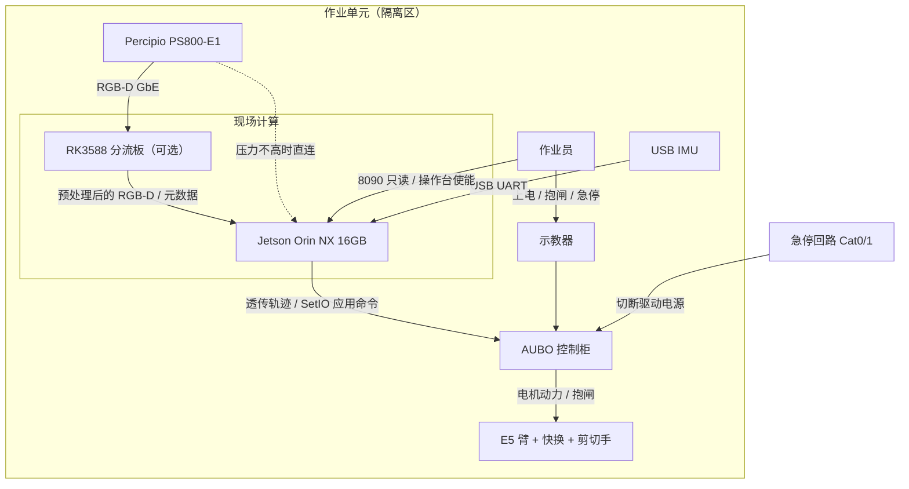
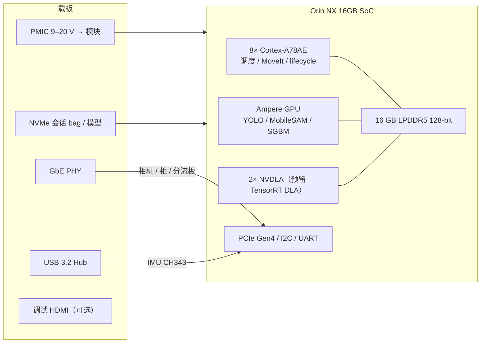
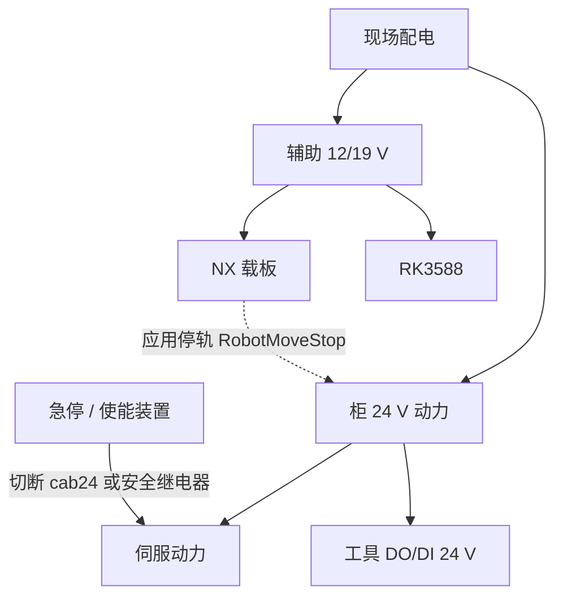
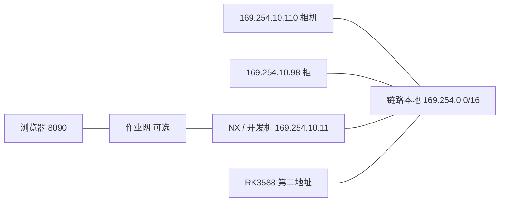
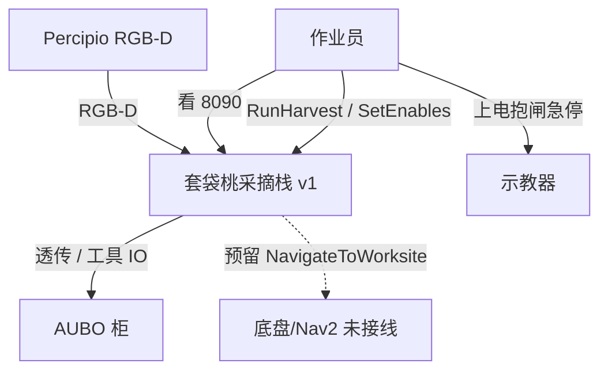
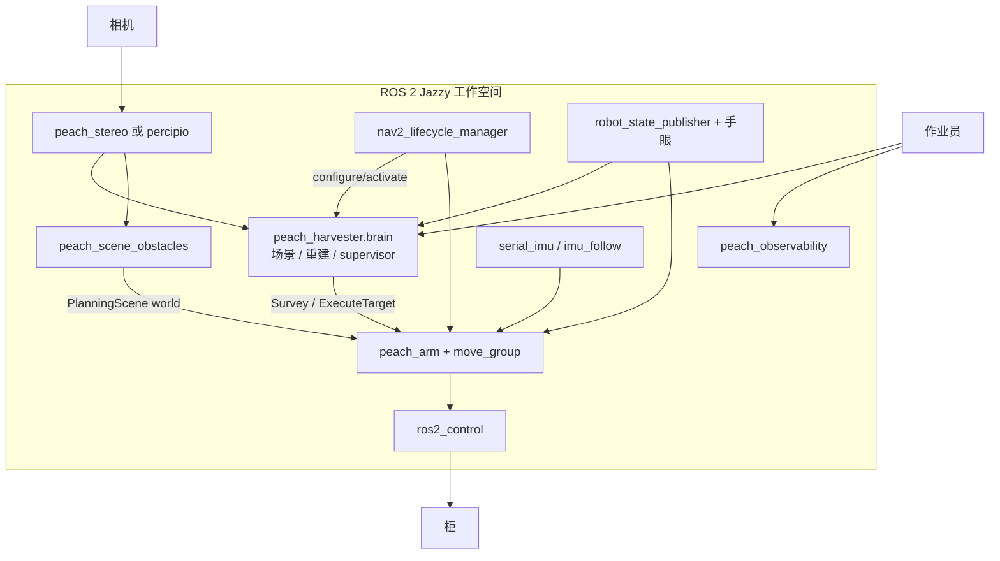
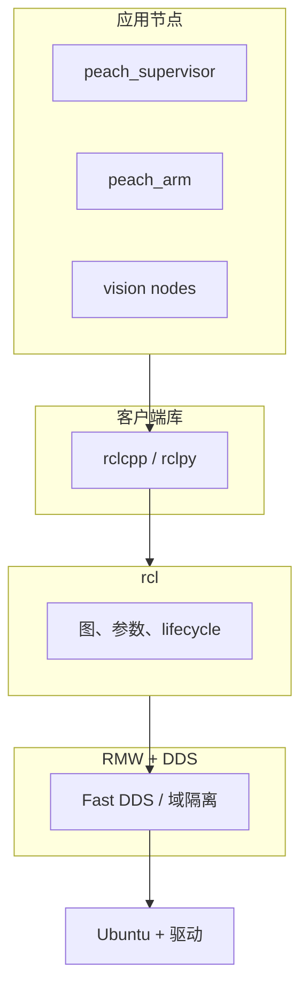
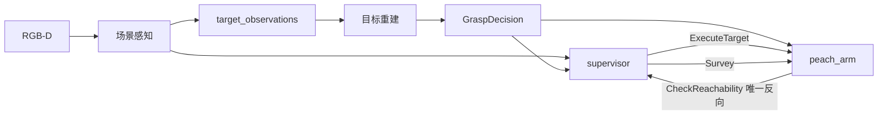
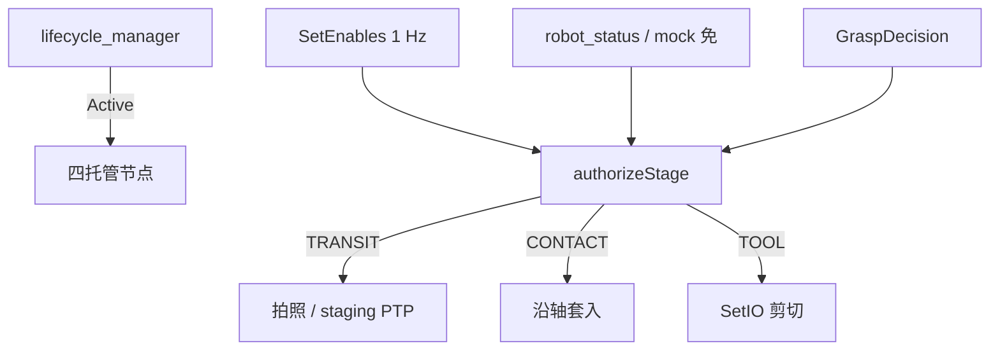

# 套袋桃采摘机器人项目设计书（v1 · 现行采摘核）

| 项 | 内容 |
|----|------|
| 工程名称 | 套袋桃采摘机器人感知—抓取联合工程 |
| 文档名称 | 项目设计书（概要设计 / 体系结构描述） |
| 系统代次 | **v1**（仓库 `src/peach_*` + 驱动九包只读面） |
| 版本 | V1.0 |
| 日期 | 2026-09-30 |
| 设计阶段 | 已建成固定座采摘核；真机预抓取多轮验证；满程剪切待授权 |
| 硬件基线 | 现场主控 **NVIDIA Jetson Orin NX 16GB**；压力分流 **RK3588**（预留）；臂 **AUBO E5**；腕载 **Percipio PS800-E1** |
| 编制依据 | GB/T 8567-2006；ISO/IEC/IEEE 42010:2022；ISO 10218 / ISO 13850 / IEC 60204-1；ROS 2 Jazzy Developer Guide；C4 模型；NVIDIA Jetson 产品设计指南式框图 |
| 读者 | 项目负责人、总体/分项设计、现场实施、评审委员会 |
| 与活文档关系 | 本文是**代次冻结的设计书**。现行参数与图名以 `docs/architecture.md` / `docs/io.md` / `docs/testing.md` 为 SNAPSHOT |

---

## 摘要

v1 在固定座 AUBO E5 上建成「开批 → 场景锁定 → 选果 → 近距重建/许可 → staging 接近 → 预抓取停靠（默认干跑）→ 授权后进入-剪切 → 记账」的完整采摘核。末端为三把剪切手（连杆对切 / 咬合喉道 / 圆盘自适应），由工具档案整栈切换。功能安全在柜与示教器，ROS 只做应用护栏。

本轮补充的验证口径：**真实立体相机在环 + mock 臂仿真全流程抓取**；**一次完整抓取（ExecuteTarget FULL 干跑，不含栈启动）墙钟 ≤ 120 s**。柜体不通、禁止 `hardware_mode:=real`、刀具使能保持关闭。

**结论：** v1 作为固定座方案已可评审、可详细设计展开；剪切许可公式、刃面偏移、避障豁免范围等结构性问题在 v2 重写中处理，不在 v1 上打补丁冒充已解决。

---

## 目录

1. 引言  
2. 术语与缩略语  
3. 需求规定与成功口径  
4. 体系结构视点（ISO 42010）  
5. 硬件架构  
6. 软件架构  
7. 工艺流程  
8. 分项设计  
9. 接口控制  
10. 安全与运行控制  
11. 验证、测试与三末端 HIL  
12. 实施计划、风险与遗留  
13. 结论与建议  
附录 A 引用标准 · B 三末端混合测试记录

---

## 1 引言

### 1.1 编制目的

说明 v1 采摘核的建设内容、总体方案、软硬件结构、主要接口、安全分层和验证门，供方案评审使用，并作为 v2 重构对照基线。

### 1.2 工程概况

作业对象是室外果园**套袋桃**。产品工艺由早期「空心圆柱套袋取走」切换为**剪切手剪柄/剪袋颈**（决策 0033）：开口对准袋轴接近，刃口在袋颈区域闭合。三种末端共用冻结帧名（`tool_axis` / `tcp` / `sleeve_mouth` / `cutting_plane`），作业中不热切换。

导航（底盘 / Nav2）已归档为预留：到位一步直通 `NAV_OK`。本文硬件仍按「将来上底盘」预留电源与网络，但不设计行驶控制。

### 1.3 范围与非范围

**范围内：** 固定座六轴臂、腕载 RGB-D、三剪切手、批次调度、感知与重建、MoveIt 接触链、观测与会话 bag、mock/real 硬件切换、Jetson 部署构想与 RK3588 分流。

**范围外：** 改厂商驱动栈（`aubo_e5_hardware` 等只读）；未授权真机运动或 SetIO；把 ROS 话题叫作急停；成熟度分选；夹持/真空吸盘主路径。

### 1.4 设计原则

1. 契约先于实现：跨包只走 `peach_interfaces`。  
2. 调度为唯一指挥；感知不发运动；技能不写账本。  
3. 停走式感知（产品相机模型），重建只用精确 stamp TF。  
4. 运动与 IO 收敛授权矩阵；默认使能全关。  
5. 跟 ROS 2 主流（UR Driver 的 mock/real 切换、MoveIt/MTC、Nav2 lifecycle）。  
6. 硬件急停不经 ROS（ISO 13850）。

---

## 2 术语与缩略语

| 术语 | 定义 |
|------|------|
| 采摘核 | v1 固定座开批、观察、选目标、近距、许可、进入-剪切、记账能力 |
| 工具档案 | `aubo_description/config/<profile>.yaml`，几何与 IO 的单一事实源 |
| 干跑 | 默认 `PREGRASP_ONLY`：停预抓取、不开刀、不回 stow |
| FULL 干跑 | `execute_pregrasp_only=false` 且 `tool.enabled=false`：套入并原路撤出，不 SetIO |
| 一次完整抓取 | 对单目标走 ExecuteTarget：再确认 → staging → 预抓取 → 沿轴套入 →（跳过刀）→ 倒放撤离 → stow |
| HIL | 真相机在环、臂用 `mock_components` + 标准 JTC |
| 授权矩阵 | `ExecutionAuthority`：TRANSIT / CONTACT / TOOL 分级 |
| staging | 冠外轴上中转，再沿轴 LIN 升到预抓取 |
| NX | Jetson Orin NX 16GB 模块 |
| 分流板 | RK3588 前端协处理板（预留） |

---

## 3 需求规定与成功口径

### 3.1 功能规定

| 项 | v1 规定 |
|----|---------|
| 作业对象 | 套袋桃；剪切手剪袋颈/短果柄 |
| 场景感知 | YOLO 检测 → MobileSAM 分割 → 圆柱 RANSAC 袋位姿 → 世界系身份 |
| 近距重建 | 采帧门 → ICP → TSDF（精确 stamp）→ Huber 融合 → 工具预算许可 |
| 机械臂 | 拍照位、观察短移、staging 接近、进入-剪切、原路撤退 |
| 末端 A `shear_v1` | 连杆对切；D_inner 0.080 m；L_insert / L_blade 0.030 / 0.030 m |
| 末端 B `bite_shear_v1` | 双刃对夹 + 220 mm 喉道；D_inner 0.104 m；L_insert / L_blade 0.030 / 0.037 m |
| 末端 C `adaptive_shear_v1` | Ø136 圆盘 + 拉钩弹簧 + MPU6050；D_inner 0.120 m；L_insert / L_blade 0.090 / 0.079 m |
| 干跑默认 | PREGRASP_ONLY；套入须另开 FULL 且刀具使能默认关 |
| 现场主控 | Orin NX 16GB 整机部署；RK3588 仅当 GPU/CPU/IO 压力不足时启用 |

### 3.2 性能口径

| 指标 | v1 锚点（开发机 3090 实测，须在 NX 重标） | HIL 门（本设计书增补） |
|------|------------------------------------------|------------------------|
| 立体深度 | peach_stereo hh4：13.5–13.7 fps | 彩色/深度可测 hz，锁集 FPS≥2 |
| 感知整链 | stereo ~7.5 fps；percipio ~2.5 fps | 本 HIL 不评重建多视 |
| 感知锁定 | stereo 现场对照 ~2.8 s vs percipio ~48 s | 本 HIL 用 skip_reconstruction |
| 一次完整抓取 | 产品方向 ≤20 s/可达果（观察+接触） | **mock FULL 干跑墙钟 ≤ 120 s**（含规划，不含栈启动） |
| 损伤 | 田间 ≤5%（真机 KEEP） | mock 不评损伤 |

120 s 是 **HIL/仿真验收上限**（MoveIt 规划 + mock JTC + 三把不同包络），不是田间节拍目标。田间节拍仍按 20–25 s 方向设计，在 v2 用闭环近距重测与 RSS 预算去实现。

### 3.3 安全规定

1. 急停在示教器/柜安全回路（ISO 13850 Cat 0/1），不经 DDS。  
2. 未授权不得真机运动或 SetIO。  
3. 故障后禁止 resume 原轨迹。  
4. 带刀单元按工业作业区隔离，不宣称协作（ISO/TS 15066 须实测）。  
5. 测完即停，`pgrep` 复核无残留。

---

## 4 体系结构视点（ISO/IEC/IEEE 42010）

| 视点 | 关心方 | 回答的问题 | 本文图表 |
|------|--------|------------|----------|
| 上下文 | 业主、评审 | 系统与人、柜、相机、示教器如何交往 | 图 SW-1 |
| 部署 / 硬件 | 电气、现场 | 盒子、网、电、安全回路 | 图 HW-1～HW-5 |
| 容器 / 进程 | 软件总体 | 工控机里跑哪些进程 | 图 SW-2 |
| 信息 / 契约 | 接口负责人 | 话题/动作/QoS | 第 9 章 |
| 功能 / 工艺 | 工艺、臂 | 一批怎么走 | 第 7 章、图 SW-4 |
| 并发 / 生命周期 | 运行 | 谁先 Active、bond | 图 SW-5 |
| 安全 | 安全员 | 功能安全 vs 应用护栏 | 图 HW-4、第 10 章 |
| 验证 | QA | 怎样证明三末端 | 第 11 章、附录 B |

画法约定：上下文与容器遵循 [C4 模型](https://c4model.com/)（一层一个缩放级）。硬件框图遵循 NVIDIA Jetson 产品设计指南的「功能块 + 总线标注」以及 ISO 10218 机器人单元「安全回路与应用回路分离」。软件分层遵循 ROS 2 官方「OS → RMW → rcl → 客户端库 → 节点」再叠业务五层。

---

## 5 硬件架构

### 5.1 设备清单

| 名称 | 规格 / 角色 | 备注 |
|------|-------------|------|
| 机械臂 | AUBO E5，约 5 kg / 0.9 m 臂展，固定座快换 | 关节序冻结：shoulder → upperArm → foreArm → wrist1/2/3 |
| 控制柜 + 示教器 | 以太网透传；上电/抱闸/急停/复位只走示教器 | 本仓不起 dashboard、不远程 power_on |
| 末端 A/B/C | 三把剪切手，见 §3.1 | TCP 见工具档案；张口为 CAD 推导，真机标定遗留 |
| 腕载相机 | Percipio PS800-E1：彩色 640×480、IR 双目 1280×960、基线 62.2 mm | 深度 uint16；双前端 percipio / peach_stereo |
| IMU | MPU6050 级，USB CH343，udev `/dev/imu` | 仅 adaptive 档接触窗使用 |
| 现场主控 | **Jetson Orin NX 16GB**（Ampere 1024 CUDA / 32 Tensor、8×A78AE、16 GB LPDDR5、最高约 100 TOPS INT8 sparse、10/15/25 W 档） | 整机栈默认全在 NX |
| 分流协处理 | **RK3588**（4×A76+4×A55、Mali-G610、约 6 TOPS NPU、双 ISP） | 仅当 NX 深度/推理/IO 压力不足时启用 |
| 开发机 | Ubuntu 24.04、Jazzy、RTX 3090 级 | 本设计书 HIL 在此执行；不随车 |
| 急停 | 示教器红钮 + 柜安全回路 | 与 NX 电源域隔离 |

相机与柜地址（实验室）：相机 `169.254.10.110`，柜 `169.254.10.98`，链路口 `169.254.10.11/16`。HIL 时柜不通，只证明相机。

### 5.2 图 HW-1 — 机器人单元部署（ISO 10218 作业单元）

物理盒子与人。内部进程不要出现在这张图上。安全回路与应用以太网分离。



**读图：** 中间计算盒是我们部署的计算机。急停是独立回路，箭头不经过 NX。RK3588 画虚线直连备选：默认相机进 NX；压力大才进分流板。

### 5.3 图 HW-2 — Orin NX 模块功能块（NVIDIA 产品设计指南式）

对照 Jetson Orin NX 数据手册的功能分区，只画本系统用到的块。Percipio 是 **GbE 相机**，不走 CSI。



部署注意：JetPack L4T 用户空间与 Jazzy 官方 Noble 不一致。NX 上走 `ros:jazzy` arm64 容器 + CUDA 设备直通，或源编。`numpy == 1.26.4` 为 cv_bridge ABI 红线，NX 同样遵守。

### 5.4 图 HW-3 — 计算压力分流（默认 vs 加压）

**默认（压力可承受）：** 相机 GbE → NX。立体 SGBM、检测、分割、重建、调度、MoveIt、8090 全在 NX。

**加压（深度+推理+bag 同时打满 25 W / 热墙 / 内存）：** 启用 RK3588。


分流板上建议承担（不进运动决策）：

| RK3588 | Orin NX |
|--------|---------|
| 相机 GbE 接收、时钟、曝光/触发 | TensorRT 检测/分割、重建、许可 |
| SGBM 或厂商深度解码、时域中值 | 调度、MoveIt、命令门、bag 主写 |
| 置信度图、ROI 裁剪、H.264/H.265 预览 | 8090 聚合 `/diagnostics` |
| 丢帧计数与前端诊断 | 生命周期管理与 bond |

禁止：RK3588 直写透传或 SetIO（命令门必须在 NX 上最后一环）。两板之间用 RELIABLE 小消息 + BEST_EFFORT 图像，QoS 与 v1 相机契约同构，感知节点不改编译面。

### 5.5 图 HW-4 — 电源与安全域



应用停轨可以让臂受控停，**不能**替代急停切断。NX 掉电不得妨碍急停回路。

### 5.6 图 HW-5 — 网络



实验室 HIL：开发机承担 NX 角色；柜 ICMP 不通则只跑 mock。8090 默认回环。

---

## 6 软件架构

### 6.1 逻辑分层（业务五层 + 契约）

对照 Autoware「感知 → 规划 → 控制」与本仓 R1–R7 解耦不变量。

```
契约层   peach_interfaces（IDL + manifest 双向核对）
L0 驱动  相机前端 / ros2_control / TF（只读红线）
L1 感知  检测→身份→重建→融合→许可（事实）
L2 调度  选果→FSM→派发→账本（决策）
L3 执行  授权矩阵→MoveIt/MTC→JTC 或透传→IO（动作）
L4 呈现  RViz + HTTP 8090（只读横切）
L5 记录  会话 bag + ledger.json（只读横切）
```

### 6.2 图 SW-1 — C4 系统上下文



### 6.3 图 SW-2 — C4 容器（可运行进程）

打开图 SW-1 中间盒子。盒子是进程，不是 colcon 包名。



**读图：** 3b 起大脑三节点同进程，图名不变。lifecycle 名单：场景 → 重建 → 技能 → 调度。obstacles 与 observability 不进名单。`imu_follow` 仅 `adaptive_shear_v1` Include。

### 6.4 图 SW-3 — ROS 2 官方分层（发行版 + 本栈）



本仓 HIL 用独立 `ROS_DOMAIN_ID`（附录 B 用 71），避免与开发机其他栈抢域。

### 6.5 图 SW-4 — 一批数据流（单向）



选果只订观测，不订许可。许可是接触令牌，臂侧 CONTACT/TOOL 分级复检。

### 6.6 图 SW-5 — 生命周期与命令门



mock 下 `require_robot_status=false`。TOOL 默认关，HIL FULL 干跑不走到 SetIO。

### 6.7 包布局（v1）

应用九包：`peach_interfaces` / `peach_common` / `peach_harvester` / `peach_arm` / `peach_bringup` / `peach_observability` / `peach_vegetation` / `peach_system_tests` / `peach_stereo`。场景包 `peach_sim` 不进整栈。驱动九包只读。旁路 IVG 三包不进 harvest。

---

## 7 工艺流程

批次由人发 `RunHarvest`，launch 不自动开批。

1. 到位（固定座直通）。  
2. Survey 到 `global_photo_pose`，收齐窗口锁定。  
3. 选果：深度窗 ∩ CheckReachability ∩ 框面积。  
4. 近距观察与重建（HIL 用 `skip_reconstruction` 钉住场景几何）。  
5. staging → 预抓取；默认 Hold 等 ACK。  
6. FULL：沿轴套入 → 剪切（须 tool 使能）→ 倒放撤退 → stow。  
7. 记账；失败码入 `ledger.json`。

三末端差异：shear / bite 套入走 MTC LIN；adaptive 在预抓取后开 imu_follow 接触窗（mock 下 `motion.enabled` 默认 false，插入等待不证明真实跟随位移）。

---

## 8 分项设计

### 8.1 调度

纯核 `harvest_fsm.react`。9 批次态 / 12 目标相。使能意图源为操作台，臂侧看门狗断流回落本地参数。

### 8.2 感知与相机前端

默认 `camera_frontend:=stereo`（主机 SGBM），percipio 备用。深度在边界换成米。重建禁止 latest TF。HIL 物理相机不跟随 mock TF，故接触链走 `skip_reconstruction`，不放宽 `min_views`。

### 8.3 臂与接近

接近主路径：PTP 到预抓取下方 staging（多滚转 IK）+ 垂直/沿轴 LIN。四层约束：果实胶囊、反爬、场景障碍快照（护相机）、近果降速。接近门真机标定：绕行比 2.6 / 弦偏离 0.32 m / 回退 0.12 m。

### 8.4 三末端

| 档案 | TCP（法兰系，m） | 包络 L×r | IMU | HIL 路径 |
|------|------------------|----------|-----|----------|
| shear_v1 | (0, 0.0479, 0.15107) | 0.120 × 0.100 | 否 | MTC LIN FULL 干跑 |
| bite_shear_v1 | (0, 0.03024, 0.1655) | 0.260 × 0.090 | 否 | 同左；长喉道审查更严 |
| adaptive_shear_v1 | (0, 0.047, 0.16866) | 0.140 × 0.110 | 是 | 接触窗；mock 不开发送 |

切换须整栈重启 `tool_profile`。TF `wrist3_Link→tcp` 必须等于档案 ±2 mm。

已知 v1 结构性限制（不在本代次内假装已修）：轴向许可线性相加易恒负；`cutting_plane` 与 TCP 零偏移；避障主要护相机。对照见 v2 设计书。

---

## 9 接口控制

权威表在 `docs/io.md` 与 `interface_manifest.yaml`。本文只列 HIL 用到的通道。

| 名字 | 类型 | 说明 |
|------|------|------|
| `/peach_supervisor/run_harvest` | action | 批次入口；HIL 全流程抓取不经此，直连 ExecuteTarget |
| `/peach_arm/execute_target` | action | 一次完整抓取；FULL + PROFILE_FULL + skip_observation |
| `/peach_supervisor/set_enables` | srv | execution/grasp/tool |
| `/camera/color/image_raw` 等 | topic | 真相机；SensorDataQoS |
| `/joint_states` | topic | mock JTC |
| `/tf` `/tf_static` | TF | 关节序 + 手眼 + 工具帧 |

QoS：传感 BEST_EFFORT；命令/动作 RELIABLE；许可与 HarvestState transient_local。

---

## 10 安全与运行控制

三层：功能安全（柜） / 应用护栏（授权矩阵、使能、超时） / 网络安全（SROS2 非本 v1 强制项）。

HIL 额外约束：

- `hardware_mode:=mock`，柜不通不视为故障。  
- `tool.enabled=false`，日志不得出现 SetIO。  
- `harvest.grasped` 必须为 false。  
- 测完按 PID 清域 71 进程，禁止宽泛 pkill。

---

## 11 验证、测试与三末端 HIL

### 11.1 测试金字塔（v1 已有）

Lint → 纯核 pytest/gtest → `peach_system_tests` 三档工具冒烟（域 91/92/93）→ 回放塔 / `peach_sim` 矩阵 → 真机 KEEP。

### 11.2 本设计书增补的 HIL 门

**形式：** 真实立体相机在环 + mock 臂仿真全流程抓取。  
**对象：** `shear_v1` / `bite_shear_v1` / `adaptive_shear_v1` 各一次。  
**用例：** `scripts/sim_field_targets.py --mode full --case 1757 --velocity 1.0`（现场可达夹具 1757，skip_observation，PROFILE_FULL，刀具关）。  
**时限：** 从 ExecuteTarget 发 goal 到结果返回 **≤ 120 s**。超时 SIGINT 取消，记失败。  
**同时核：** 相机 ping 与 `topic hz`；`tool.profile_id`；TF 对档案；imu_follow 服务仅 adaptive 在图；无 SetIO。

脚本：`plans/v1_三末端混合测试/run_hil.py`。记录：同目录 `results/`。

### 11.3 不测什么

不评套袋方向真值；不评田间损伤；不跑 `hardware_mode:=real`；不做网格全量（网格是战役，不是本设计书的 2 分钟门）。

---

## 12 实施计划、风险与遗留

| 风险 | 等级 | 对策 |
|------|------|------|
| NX 上 Jazzy 发行差 | 高 | 容器 + 重标表 3-2 |
| 剪切许可恒负 | 高 | 不在 v1 热修；v2 RSS + 台架 w_capture |
| 真相机与 mock TF 不一致 | 中 | skip_reconstruction；示教器把真臂停拍照位 |
| RK3588 时钟域 | 中 | TIME_SYNC 失败即拒用该帧 |
| 120 s 门在默认 0.1 速档失败 | 中 | HIL 仅允许 `--velocity 1.0` 仿真缩放；真机不得用此档 |

遗留：真机满程剪切、三 TCP 标定、刀反馈 DI、NX 节拍、bondpy 开启、导航恢复。

---

## 13 结论与建议

v1 固定座采摘核结构完整、安全分层正确、三末端可切换，满足方案评审与详细设计。HIL 用真相机证明前端活着，用 mock FULL 在 120 s 内证明三把档案的接触链可闭合。产品节拍与剪切正确性交给 v2 重构，不在 v1 上继续叠令牌与豁免。

建议：详细设计继续以三活文档为运行权威；本设计书作为 v1 代次基线入库 `plans/`。

---

## 附录 A 引用标准（摘要）

- GB/T 8567-2006 计算机软件文档编制规范  
- ISO/IEC/IEEE 42010:2022 体系结构描述  
- ISO 10218-1/-2、ISO 13850、IEC 60204-1  
- ROS 2 Jazzy Developer Guide、REP-103/144/149/2004  
- NVIDIA Jetson Orin NX 模块数据手册 / 产品设计指南  
- Rockchip RK3588 技术参考手册（分流板）  
- C4 model（Simon Brown）；Autoware / Nav2 / UR ROS2 Driver 架构文档  

## 附录 B 三末端混合测试记录

试验程序、原始日志与 `summary.json` 见 [v1_三末端混合测试](v1_三末端混合测试/)。正文表在试验结束后写入该目录 `results/summary.json`，并在同目录 README 做门结论。

| 档案 | 相机在环 | 用例 | 抓取墙钟 (s) | ≤120 s | 门 |
|------|----------|------|--------------|--------|----|
| shear_v1 | stereo mock | 1757 FULL | （见 results） | | |
| bite_shear_v1 | stereo mock | 1757 FULL | （见 results） | | |
| adaptive_shear_v1 | stereo mock | 1757 FULL | （见 results） | | |
