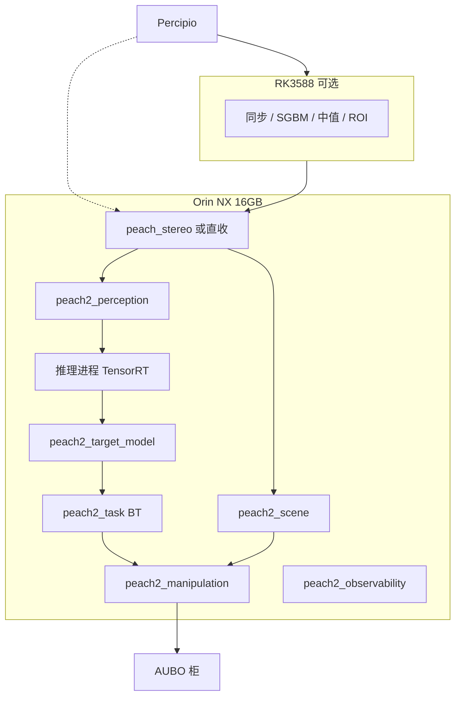
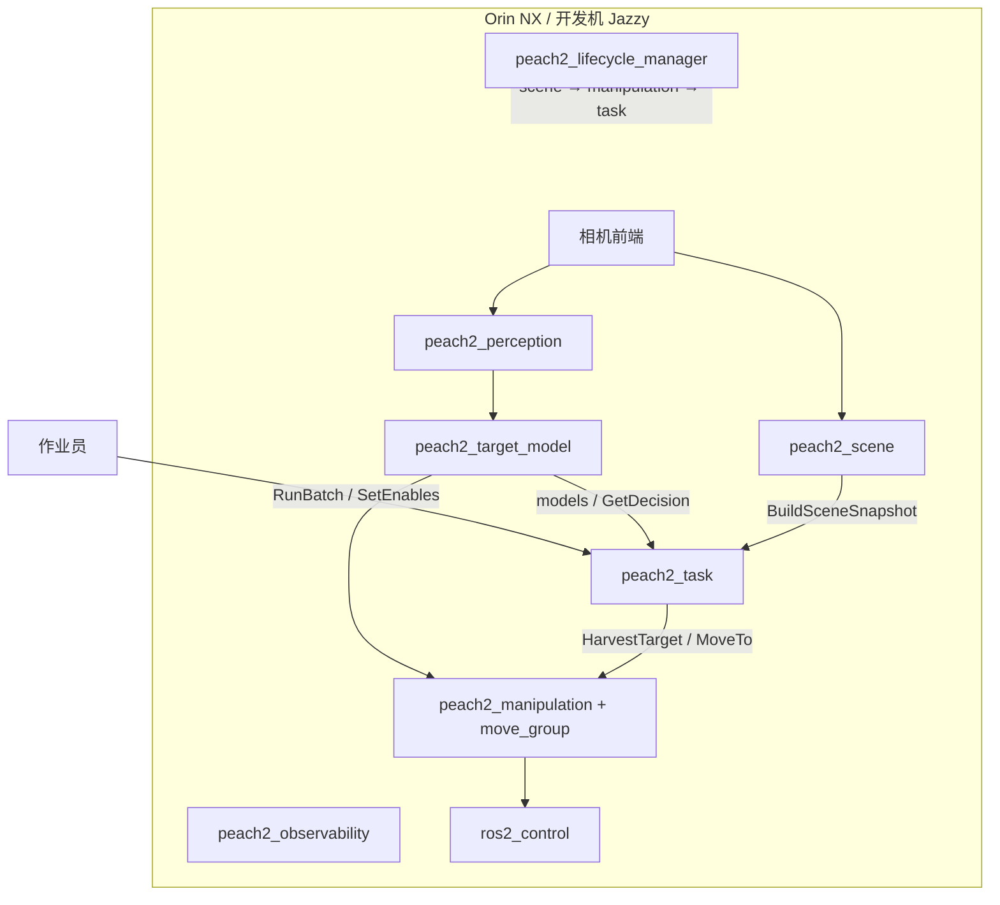

# 套袋桃采摘机器人项目设计书（v2 · 重构栈与后续优化）

| 项 | 内容 |
|----|------|
| 工程名称 | 套袋桃采摘机器人感知—抓取联合工程 |
| 文档名称 | 项目设计书（重构概要设计 + 已落地优化） |
| 系统代次 | **v2**（仓库 `src/peach2/*`；旧栈 `src/peach_*` 只读对照） |
| 版本 | V2.1 |
| 日期 | 2026-09-30 |
| 设计阶段 | 方案 M0–M7 已定；M1 骨架与纯核/集成测已落地；后续优化见第 8 章 |
| 硬件基线 | 与 v1 相同：Orin NX 16GB 主控；RK3588 加压分流；AUBO E5；Percipio |
| 编制依据 | 同 v1；另对照 BehaviorTree.CPP v4、MoveIt Task Constructor、pluginlib、generate_parameter_library |
| 读者 | 项目负责人、实现代理、安全评审 |
| 与活文档关系 | v2 运行后以 peach2 包 README + `peach2_interfaces` 为契约；三活文档在切换期仍描述 v1 |

---

## 摘要

v2 按「忽略现行包结构、保留物理与法规四条红线」完全重构。目标是让三种剪切手在室外套袋桃上真正闭环：找到 → 对准袋轴 → 套入 → 剪断 → 撤出 → 放果。v1 审查出的 P0（剪切许可恒负、刃面当 TCP、令牌窗错配、避障只护相机、adaptive 套入无真机通路等）在 v2 用单一事实源、RSS 预算、pluginlib 末端、BT+MTC、全臂受查和独立刀反馈重做。

**后续优化（方案印发当日已落入 peach2 源码，超出原 M1 空插件骨架）：** 接口变更 01、邻袋碰撞分工、空运动塌缩、倒放加速度符号、命令门 `motion_possible` 语义、摆幅未知显式化、视点按 `camera_pose` 分段、系统测 PREGRASP mock 执行链等。这些不是另一份设计书，并入本文第 8 章。

硬件部署与 v1 共用 Orin NX / RK3588 分流；软件按 UR / Nav2 主流重新切包。HIL 一次完整抓取墙钟上限与 v1 附录相同：**≤ 120 s**（mock）；产品节拍首期 ≤ 25 s、二期 ≤ 15 s。

---

## 目录

1. 引言与红线  
2. 从 v1 到 v2 的问题清单  
3. 需求与成功口径  
4. 体系结构视点  
5. 硬件架构（沿用并强化分流）  
6. 软件架构（peach2）  
7. 分项设计  
8. 后续已落地优化  
9. 接口控制  
10. 安全  
11. 测试与验收  
12. 分期与开放问题  
13. 结论  
附录 A 引用 · B 优化对照表

---

## 1 引言与红线

重构不改变四条物理/法规事实：

1. 急停走柜/示教器，ROS 只做应用护栏。  
2. 未经人授权不动真机、不 SetIO。  
3. 带刀单元按工业应用隔离（ISO 10218-2:2025），不宣称协作。  
4. Jazzy `cv_bridge` 锁 `numpy == 1.26.4`。

旧栈只读对照，新代码只写 `src/peach2/`。launch 永不自动 `RunBatch`。

---

## 2 从 v1 到 v2 的问题清单

### 2.1 P0（核心需求不可达）

| ID | 问题 | v2 对策 |
|----|------|---------|
| P0-1 | 轴向余量线性相加 → `cut_ok` 恒负 | RSS 合成；`w_capture` 台架单源；未标定只禁剪不禁接近 |
| P0-2 | 未精化链几乎不校验轴向 | 取消双路授权；GetDecision 同步复检 |
| P0-3 | 剪切确认可能读回自己的 DO | cmd_pin ≠ feedback_pin；反证测试；自回读 → FAULT |
| P0-4 | adaptive 套入 Servo 写 JTC、真机只起透传 | 套入走真机实际控制器；IMU 修正进命令门内 |
| P0-5 | 令牌窗 3–10 s vs FULL 链 30–60 s | 有效期 120 s；新鲜度=模型 revision，不靠心跳时间戳 |
| P0-6 | 避障只护相机 | 全臂受查；stage 局部豁免自动回滚 |
| P0-7 | 刃面=TCP 零偏移 | `blade_in_tcp = (0,0,−L_blade)`；TCP=开口 |
| P0-8 | 重建采帧门死锁 | 邻距按视角；漂移门按摆幅；精确 TF 失败丢帧 |

### 2.2 设计原则

一个事实一个源；闭环优先于一次看准；机械容差吸收剩余误差；全臂受查只按阶段局部豁免；剪切确认独立于命令；末端/检测器/规划器 pluginlib。

---

## 3 需求与成功口径

作业链不变。分项首期（固定座，可达果）：检测召回 ≥95%；袋轴横向 ≤8 mm、轴角 ≤4°；袋颈轴向融合 ≤10 mm、近距重测 ≤5 mm；套入 ≥85%；一次剪断 ≥80%；整体 60–75%；每果 ≤25 s（二期 ≤15 s）；损伤 ≤5%。

HIL 门（与 v1 附录对齐）：mock 一次完整抓取 **≤ 120 s**。产品节拍不得用 120 s 当目标。

---

## 4 体系结构视点

视点表与 v1 第 4 章相同。容器级盒子换成 peach2 进程名。安全视点增加：撤退/放果不依赖感知许可（只依赖 Active ∧ robotReady ∧ ¬e_stop）。

---

## 5 硬件架构

硬件清单、急停域、网络与 v1 第 5 章相同（Orin NX 16GB 主控，RK3588 加压分流）。v2 强化三点：

1. **刀反馈必须是独立 DI**，与命令 DO 不同脚；上线前断电反证。  
2. **强烈建议腕部六维力**（adaptive 贴果与全程接触监测）。无 F/T 时用电流模型残差，监测在控制循环侧。  
3. **分流板上禁止运动决策。** peach2 命令门只在 NX 的 `peach2_manipulation`。

### 图 HW-V2 — 与软件进程的部署对应



NX 热设计：检测+分割+MoveIt 同卡时优先保证 manipulation 的 CPU 核隔离（taskset / cgroup 为二期）。加压时把 SGBM 从 NX GPU/CPU 挪到 RK3588，NX 只跑 TensorRT + 规划。

---

## 6 软件架构

### 6.1 包切分（UR / Nav2 主流）

```
peach2_interfaces      精简 IDL
peach2_core            Python 纯库：地标、跟踪、融合、RSS 预算
peach2_perception      同步、深度质量、检测分割、观测
peach2_target_model    多视融合、GetDecision
peach2_scene           硬障碍快照（挖空目标袋）
peach2_end_effector    pluginlib 三插件 + 刀具状态机
peach2_manipulation    命令门 + HarvestCycle + MoveIt 后端
peach2_task            BT.CPP v4 批次树 + 账本
peach2_bringup         唯一整栈入口 + 预检
peach2_observability   诊断 / bag / 只读 8090
peach2_calibration     误差常数单源
peach2_system_tests    isolated launch_testing
```

依赖：`interfaces ← 能力包`；能力包不互 import 业务；驱动只读。

### 6.2 图 SW-1 — C4 上下文

与 v1 相同的人/柜/相机/示教器；中间盒子改名为「Peach v2 采摘栈」。

### 6.3 图 SW-2 — C4 容器



生命周期默认 `bond_timeout: 4.0`。系统测可关 bond。`camera_enabled:=false` 时 perception/scene 从名单省略，测试夹具桩 BeginScene / 快照 / 合成观测。

### 6.4 图 SW-3 — 一颗果的 MTC / 周期

```
PREPARE_TOOL → TRANSIT_STAGING → APPROACH_PREGRASP → VERIFY_PREGRASP
 → [PREGRASP_ONLY 结束]
 → INSERT（刃面对准袋颈）→ CUT → CONFIRM → RETREAT → RELEASE → DONE
```

规划：冠外 OMPL/STOMP 竞赛；接近 Pilz LIN；`min_fraction=1.0`；起点容差 0.02 rad；倒放速度取反、加速度不变号。

场景相位：APPROACH 写全部 `peach_bag_*`；CONTACT 起去掉当前目标。peach2_scene 负责挖空袋体素。

### 6.5 图 SW-4 — 行为树（批次）

`HarvestBatch`：ReactiveSequence(CheckSafety, Survey, KeepRunningUntilFailure(NextTarget))。  
`HarvestOne`：Observe → CheckDecision(approach) → HarvestTarget → 失败记 skip。  
恢复：WaitForAck，不自动继续。FULL 可插 NeckRemeasure。

### 6.6 ROS 2 分层

同 v1 图 SW-3。C++ 新包默认 generate_parameter_library；Python 节点 yaml 直读 + 校验。话题名不是参数。

---

## 7 分项设计

### 7.1 感知 v2.0 / v2.1

v2.0：现有 `best.pt` 检测 + MobileSAM；2D 宽度剖面颈/底；3D 剖面 + 协方差；KF 跟踪；失败丢 TF。  
v2.1：飞轮伪标签训练 YOLO11-seg + 三关键点，接口不变。

深度：置信度独立话题；静止才时域中值；TIME_SYNC 失败拒帧。

### 7.2 许可预算（RSS）

径向：

\[
m_r=\tfrac12 D_\mathrm{inner}-\tfrac12 d_{95}-c_\mathrm{wall}
-\sqrt{\sigma_\mathrm{lat}^{2}+(L\sin\theta_{95})^{2}+e_\mathrm{tcp}^{2}+e_\mathrm{handeye}^{2}+e_\mathrm{runout}^{2}+A^{2}}
\]

轴向：

\[
m_a=w_\mathrm{capture}-\sqrt{\sigma_\mathrm{ax}^{2}+e_\mathrm{blade}^{2}+e_\mathrm{robot}^{2}+A^{2}}
\]

常数只来自 `peach2_calibration/results/<tool>.yaml`。`status != calibrated` 时 `cut_ok=false`（`calibration_pending`），接近仍可按余量走。

### 7.3 末端插件

`EndEffector`：`blade_in_tcp` / `roll_constraint` / `feasible` / `prepare` / `insert` / `cut` / `confirm_cut` / `abort_safe` / `release`。  
插件：`ShearV1` / `BiteShearV1` / `AdaptiveShearV1`。  
滚转：shear 刃背离枝 ±60°；bite 钳口 ⟂ 枝 ±20°；adaptive 全周。  
刀具状态机：UNKNOWN → OPEN_CONFIRMED → CLOSING → CLOSED_CONFIRMED → …；FAULT 须 ACK。

### 7.4 命令门

`Active ∧ drives ∧ ¬e_stop ∧ ¬in_error ∧ 年龄<0.3 s ∧ enables 链 ∧ 心跳 ∧ ¬cancel ∧ 阶段许可`。  
**新轨迹前**才查 `motion_possible`（执行中该位为 0 是柜语义，不能当持续条件）。  
关门即停：取消轨迹 + stop + `abort_safe`。  
撤退/开刀/放果不看感知许可。

---

## 8 后续已落地优化（V2.1）

下列条目在原重构方案印发后已写入 peach2，属于本设计书「后续优化」范围。

| 编号 | 优化 | 包 | 相对原方案的增量 |
|------|------|----|------------------|
| O1 | 接口变更 01：`NECK_REMEASURE_PENDING`、`camera_pose`、`swing_known`、`locked_target_ids`、`branch_direction`、`plan_only`、`ToolState.feedback` 三态、`recovery_required`、`BeginScene` | peach2_interfaces | 方案 §11 精简后第一次增补 |
| O2 | 碰撞分工：scene 挖空袋（含颈端 overshoot）；manipulation 写 `peach_bag_*` 原子 diff | scene + manipulation | 主审跨包决定 |
| O3 | `MotionBackend` 缝；`finalize_plan` 把已在目标的赶路塌缩为空运动，残差修正不塌缩 | manipulation | 修重勘 `empty_trajectory` |
| O4 | 倒放加速度不变号；起点 0.02 rad；空运动不下发 | manipulation | 修 v1 P1 |
| O5 | 命令门：`motion_possible` 仅新轨迹前；使能心跳丢失即关门 | manipulation | 对齐 aubo_msgs 语义 |
| O6 | HarvestCycle 场景相位 APPROACH/CONTACT；INSERT/CUT 前再 GetDecision | manipulation | 实现方案 §5.3 |
| O7 | PREGRASP_ONLY 的 `reached` 不超过 PREGRASP | manipulation | 避免干跑误计已采 |
| O8 | ACK 幂等；无待确认直接 success | manipulation + task | 操作台可重复点 |
| O9 | 视点分段改用 `camera_pose` 平移/旋转阈值，不再只用距离 | target_model | 停走式相机 |
| O10 | `require_known_swing`：未知摆幅显式拒绝接近 | target_model | 不再用 0 表示未知 |
| O11 | 2D/3D 交叉校验分底/颈/扎口；结点独立协方差 | perception + core | 地标质量 |
| O12 | 3D 剖面 Tukey 圆拟合 / 加权 PCA | peach2_core | 飞点稳健 |
| O13 | BT：WaitForAck、NeckRemeasure、BatchGate、非阻塞叶子 | peach2_task | 方案 §8 落地 |
| O14 | bringup 同域预检；Include 作用域隔离，避免 launch_arguments 泄漏 | peach2_bringup | Jazzy launch 坑 |
| O15 | 系统测：bringup mock、plan-only 关节不动、PREGRASP mock 执行+ACK | peach2_system_tests | 方案 M1 退出门 |
| O16 | 果园外观重建管线（Blender）照明/实拍特征对照 | peach_sim reconstruction | 仿真资产，供后续 Gazebo 系统测 |

**未落地（仍按分期）：** 台架 w_capture 标定、刀电流通道、腕力、IKFast、Gazebo `gz_ros2_control` 日回归、NX 容器部署、RK3588 实装、v2.1 关键点模型。

---

## 9 接口控制

图名单源 `peach2_interfaces/config/interfaces.yaml`。

| 名字 | 类型 |
|------|------|
| `/peach/perception/observations` | TargetObservationArray |
| `/peach/target_model/models` | TargetModelArray latched |
| `/peach/target_model/get_decision` | srv GetDecision |
| `/peach/target_model/observe` | action ObserveTarget |
| `/peach/scene/build_snapshot` | srv |
| `/peach/manipulation/harvest_target` | action |
| `/peach/manipulation/move_to` | action |
| `/peach/manipulation/check_reachability` | srv（plan-only 同口径） |
| `/peach/task/run_batch` | action |
| `/peach/enables` | 1 Hz 心跳 |
| `/peach/manipulation/recovery_required` | latched Bool |
| `/diagnostics` | 全节点 |

身份只保留 `request_id`、`target_id`、`model_revision`。深度单位在边界用 `depth_unit_m` 换米。

---

## 10 安全

与 v1 三层相同。v2 额外：

- 所有 SetIO 经 `GatedIoBackend`；8090 不得写 IO。  
- 流式命令超时 0.1 s。  
- 急停沿：取消 goal、刀 UNKNOWN、锁 recovery；示教器复位后 ACK 再 `prepare()`。  
- 禁止故障后 resume 原轨迹。

---

## 11 测试与验收

| 层 | v2 载体 | 门 |
|----|---------|----|
| 纯核 | peach2_core pytest；end_effector / manipulation / task gtest | CI |
| 集成 | peach2_system_tests 域 95–97 | lifecycle、plan-only 不动、PREGRASP 执行 |
| HIL | 真相机 + mock；一次 HarvestTarget/ExecuteTarget FULL **≤ 120 s** | 与 v1 附录同门，工具改 peach2 后迁脚本 |
| 台架 M0 | 三末端各 50 次 | 进园前 |
| 田间 | 第 3 章分项 | KEEP |

进园硬门：IO 反证通过；台架剪断 ≥90%；急停恢复演练；PREGRASP_ONLY 定位达标。

---

## 12 分期与开放问题

M0 实测台架 → M1 骨架（已）→ M2 感知 v2.0 → M3 预算 → M4 运动避障 → M5 三插件实机 → M6 果园 → M6.5 关键点 → M7 提速与底盘。

开放问题仍须实测：袋颈可剪空间、刃口捕获带、DI 是否独立、透传能否接流式、腕力、室外深度、摆幅分布、接果方式。

---

## 13 结论

v2 用主流切包和可证明的预算/门控，替换 v1 上叠出来的令牌、双路授权和护相机豁免。V2.1 已把接口、碰撞分工、空运动、倒放、BT 恢复和 mock PREGRASP 链做成可测的软件。硬件仍是 Orin NX 16GB + 可选 RK3588 分流；运动决策不离开 NX 上的命令门。下一步是 M0 台架标定与 NX 部署，而不是继续改 v1。

---

## 附录 A 引用（增量）

- BehaviorTree.CPP v4；MoveIt Task Constructor；pluginlib；generate_parameter_library  
- Bac 2014 JFR；SWEEPER；HAVS；ISO 10218-2:2025  
- 其余同 v1 附录 A  

## 附录 B v1 能力 → v2 包映射

| v1 | v2 |
|----|----|
| peach_harvester vision | peach2_perception + peach2_core |
| peach_harvester reconstruction | peach2_target_model |
| peach_harvester supervisor FSM | peach2_task BT |
| peach_arm cycle/MTC | peach2_manipulation HarvestCycle |
| 工具档案直读 + imu_follow 旁路 | peach2_end_effector 插件 + 门内修正 |
| peach_scene_obstacles | peach2_scene |
| GraspDecision 令牌复制进 goal | GetDecision 同步查询 |
