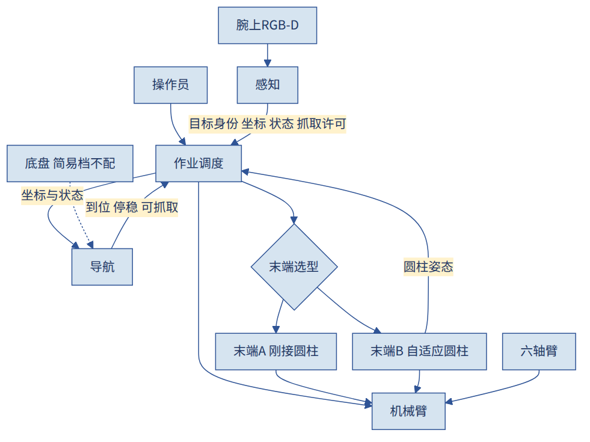
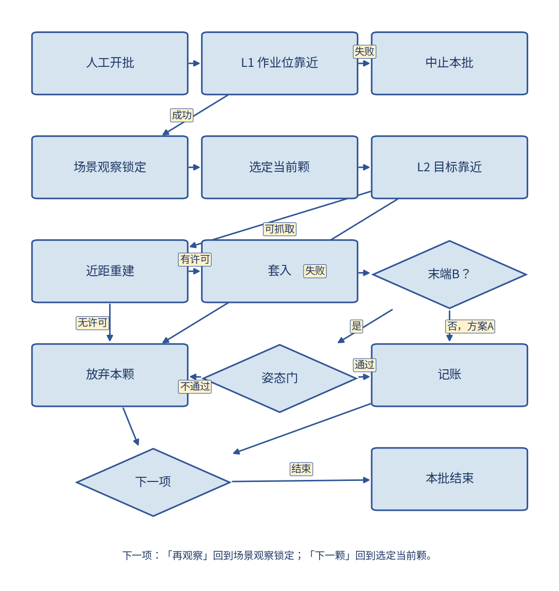
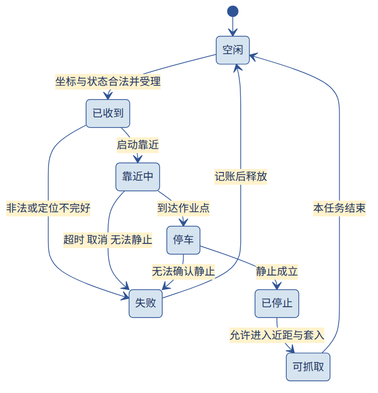
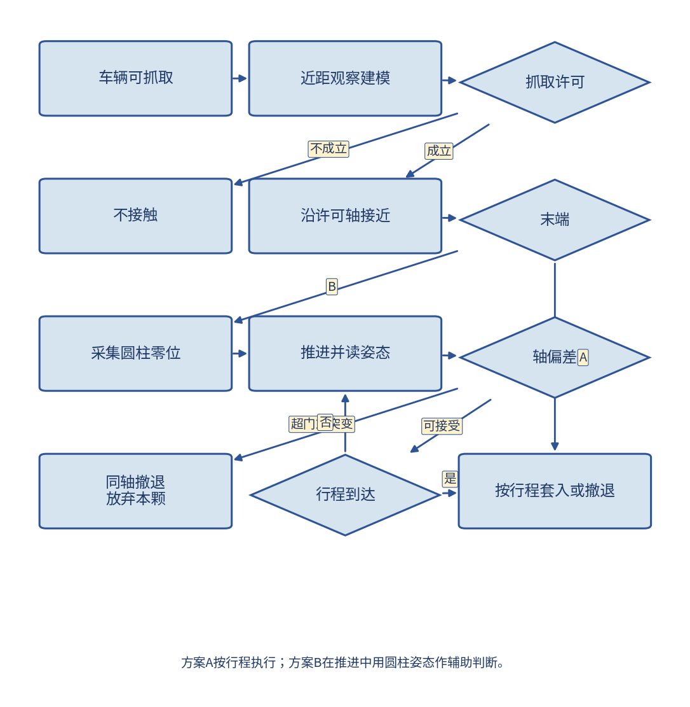
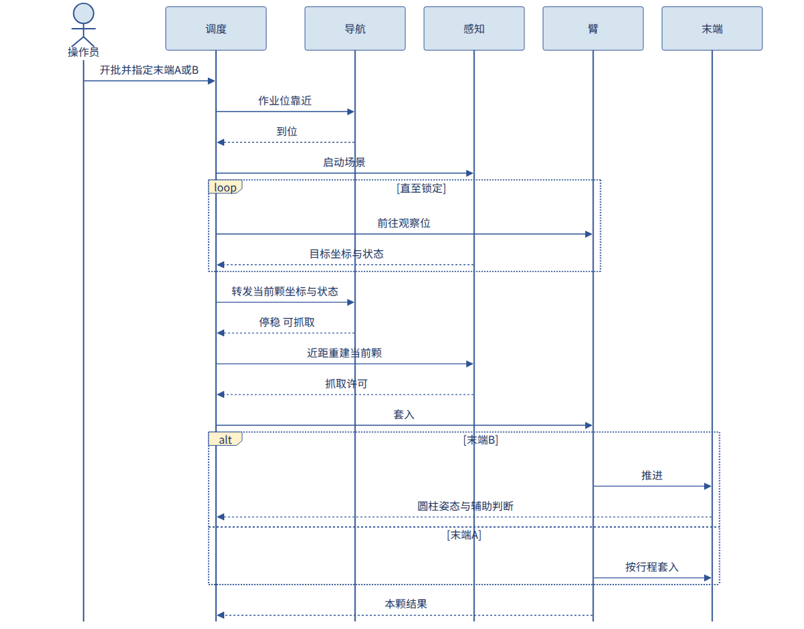
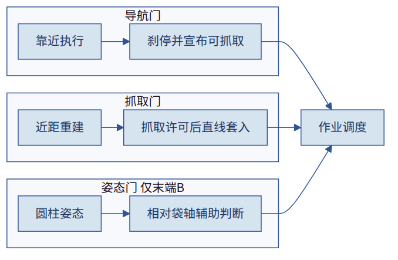

# 套袋桃采摘机器人感知抓取与自主导航联合工程
# 初步设计说明书

| 项目 | 内容 |
|------|------|
| 工程名称 | 套袋桃采摘机器人感知抓取与自主导航联合工程 |
| 文件名称 | 初步设计说明书 |
| 设计阶段 | 初步设计 |
| 版本 | V3.0 |
| 日期 | 2026-08-25 |
| 设计深度 | 明确总体方案、工艺流程、系统划分、主要接口及设备配置，满足方案评审及开展详细设计 |
| 附图 | 同目录 `figures/` |
| 附表 | 《采摘机器人工作空间.xlsx》 |

**目录**

1 概述  
2 需求规定与设计原则  
3 总体方案  
4 工艺流程  
5 分项设计  
6 设备配置  
7 接口设计  
8 运行与出错处理  
9 实施计划与遗留问题  
10 结论与建议  
附录  

---

## 1 概述

### 1.1 编写目的

编制本说明书，说明本工程的建设内容、总体方案、工艺流程、系统组成、主要设备及接口关系，供方案评审使用，并作为详细设计的依据。

预期读者为项目负责人、总体设计、分项设计及现场实施人员。

### 1.2 工程概况

本工程作业对象为果园套袋桃。产品方案为：空心圆柱沿袋轴套入袋体，袋子由内孔通过后连袋带果取走。圆柱内孔约百毫米量级，插入行程约二十厘米量级。

现已建成固定座采摘能力，可完成开批、场景观察、目标选定、近距重建、抓取许可、圆柱套入及记账。机械臂工作空间有限，行间作业时须移动到位后再观察、再接触。车辆位移后，原臂基座坐标系下的目标坐标失效。套入过程中袋体变形、枝叶遮挡，腕上视觉难以持续估计袋轴。

本工程不另建采摘产线，在现有采摘能力上增加车辆到位及双末端接触判断，实现移动作业条件下的联合运行。

### 1.3 设计依据

1. 本工程建设任务：感知抓取与自主导航联合。  
2. 现有固定座采摘核的作业能力及末端几何。  
3. 五级功能分解参照表（底盘、定位、规划、臂、视觉、末端）。  
4. 配套工作簿《采摘机器人工作空间.xlsx》。

详细设计阶段的接口文件、程序说明及施工图不在本阶段编制。本工程不修改现行仓库已交付的运行行为。

### 1.4 设计范围

本设计包括：总体方案及方案比选，工艺流程，调度、感知、导航、机械臂及末端的分项方案，主要设备配置，用户/内外部接口原则，运行控制及出错处理，实施分期。

本设计不包括：底盘厂家驱动、导航参数整定、RTK 布站、器件品牌招标、源码与接口变更。

### 1.5 主要任务

1. 确定车辆两层靠近（作业位、目标）的工艺及对外状态。  
2. 确定末端 A（刚接圆柱）与末端 B（自适应圆柱加姿态传感）的配置及判断关系。  
3. 确定调度指挥下导航、抓取、姿态三门的划分与失败处理。

---

## 2 需求规定与设计原则

### 2.1 建设规模

按单车（或固定座）、单臂、单工位、批次作业设计。每批由人工启动，处理视野内若干目标后结束。导航分简易、主流两档，对外状态一致，内部行驶能力可替换。

### 2.2 功能与性能规定

表2-1 主要功能规定

| 项目 | 规定 |
|------|------|
| 作业对象 | 套袋桃；主路径为圆柱套入 |
| 不纳入主路径 | 夹持、真空吸附、成熟度分选、果柄扭转 |
| 感知 | 场景检测；当前目标近距重建；输出身份、坐标、状态、抓取许可 |
| 导航简易档 | 接收坐标与状态，按序宣布可抓取；不展开真实行驶 |
| 导航主流档 | 同一对外状态下完成定位、规划、底盘控制 |
| 机械臂 | 观察位运动；许可后沿袋轴直线套入及撤退 |
| 末端 A | 刚接空心圆柱，按行程套入 |
| 末端 B | 同形圆柱，有限自适应，接触段读取圆柱姿态 |
| L1 失败 | 中止本批 |
| L2 失败、许可失败、姿态失败 | 放弃当前目标 |

抓取许可为套入几何的唯一依据。可抓取仅表示允许进入近距观察。末端 B 姿态用于接触段辅助判断，不替代许可，不用于发现下一目标。

### 2.3 设计原则

1. 调度为唯一指挥。感知报送观察结果，导航报送车辆状态，机械臂执行许可运动。  
2. 先停车，后近距；先许可，后接触。行驶中不进行近距积分和套入。  
3. 简易档无位移时，仍须经历靠近中等规定状态，保证与主流档时序一致。  
4. 车体惯导与圆柱姿态传感分属。  
5. 批次人工启动；工具动作默认关闭。

### 2.4 运行环境

室外果园，行间作业，光照变化大，枝叶遮挡。计算设备为现场工控机。腕上配置 RGB-D 相机。臂侧沿用现有急停与停轨。主流档另设底盘急停切断。

---

## 3 总体方案

### 3.1 方案比选

导航提出简易、主流两档。简易档验证调度与采摘的衔接；主流档承担园内行驶。两档共用对外状态，避免升级时改变指挥关系。

表3-1 导航方案比选

| 比选项目 | 方案一 简易档 | 方案二 主流档 |
|----------|---------------|---------------|
| 定位 | 固定座，臂基座为世界系 | RTK 双天线、车体 IMU、轮式里程计、雷达与视觉融合 |
| 规划与控制 | 无路径规划，不发底盘速度 | 全局规划、局部避障、行间巡航、刹停、紧急停车 |
| 作业位 L1 | 视为已到达 | 航点及行间规划，失败中止本批 |
| 目标靠近 L2 | 校验后宣布可抓取，允许无位移 | 驶入臂可达区并确认静止 |
| 硬件 | 不增加底盘、天线、雷达 | 底盘、RTK、车体 IMU、3D 雷达、行间相机、底盘急停 |
| 与采摘衔接 | 坐标、状态 → 靠近 → 停车 → 可抓取 | 衔接相同，靠近为真实行驶 |

**推荐：** 本阶段采用方案一，方案二作为后续实施内容接入同一对外状态。先实施真车、调度门未定时，车辆与机械臂易争用同一作业节拍。

末端在满足空心圆柱套袋几何的前提下比选刚接与自适应两套，接近轨迹按同量级圆柱设计，以便共用规划。

表3-2 末端方案比选

| 比选项目 | 方案 A 刚接圆柱 | 方案 B 自适应圆柱 |
|----------|-----------------|-------------------|
| 机械 | 相对腕部刚接 | 相对腕部有限顺应 |
| 接触段信息 | 无工具反馈 | 圆柱姿态相对规划袋轴及零位 |
| 几何依据 | 近距抓取许可 | 许可不变；姿态不得替代许可 |
| 失败记录 | 视觉或不可达 | 另计偏轴、卡住、回不到零位 |
| 与车辆关系 | 不依赖 | 不依赖 |
| 本阶段 | 现行配置 | 纳入设计，不作为已接线交付 |

**推荐：** 方案 A、方案 B 均纳入。开批时指定其一，作业过程中不切换。方案 B 传感器失效时停止套入，不按方案 A 自动降级。

夹持器、真空吸盘不参与比选，与套袋几何不符。

### 3.2 推荐方案

本工程推荐方案为：保留现有采摘核；增设作业调度为指挥中心；导航按表3-1方案一实施，预留方案二；末端按表3-2配置 A、B；工艺顺序为场景观察、目标选定、目标靠近、近距许可、套入。

系统组成见图3-1。

{width=14.5cm}

腕上 RGB-D 仅用于采摘感知，不作为车辆主定位。简易档不配置底盘；主流档底盘由导航分项内部驱动，采摘核只使用可抓取状态。

### 3.3 功能分配

表3-3 系统功能分配

| 分项 | 功能 | 边界 |
|------|------|------|
| 作业调度 | 开批、末端选型、选目标、下达 L1/L2、接收门结果、记账、互锁 | 不计算袋轴，不搜索路径 |
| 感知 | 场景检测、当前目标近距重建 | 不发送运动指令，不选定下一目标，不读取圆柱姿态 |
| 导航 | 作业位及目标靠近，回报可抓取 | 不改写抓取许可，不指挥机械臂 |
| 机械臂 | 观察位、许可后套入及撤退 | 行驶中不规划接触 |
| 末端 A | 按行程套入 | 无姿态门 |
| 末端 B | 套入并报送圆柱姿态 | 不选定目标，不指挥车辆 |

参照功能分解表中，底盘、融合定位、路径规划列入主流导航预留；关节伺服、直线套入、可达与遮挡纳入主路径；成熟度、夹持、真空、果柄细分割不纳入。调度为本工程新增分项。条目级取舍见工作簿「功能树定义」。

---

```{=openxml}
<w:p><w:r><w:br w:type="page"/></w:r></w:p>
```

## 4 工艺流程

### 4.1 工艺总流程

工艺总流程见图4-1。批次由人工启动并指定末端类型，不自动开批。

{width=14.5cm}

主要工序：作业位靠近（L1）→ 场景观察 → 选定当前目标 → 目标靠近（L2）→ 近距重建 → 套入 → 记账。L1 失败则中止本批。L2、许可或姿态失败则放弃当前目标，转入下一目标或再次观察。接触异常待确认时，不选定下一目标、不下达新的靠近任务。存在卸果位时再放置，否则跳过。

L1 到达仅表示可以开始场景观察，不表示某一目标可抓取。

### 4.2 靠近工序

L1 在开批之后、拍照之前进行。简易档视为到达。主流档按航点及行间规划行驶，定位不完好时不启动；失败中止本批。L1 进行中不执行 L2、拍照及套入。

L2 为目标靠近，对外状态见图4-2。调度将当前目标的坐标与状态发往导航，感知不直接向车辆发送坐标。

{width=12cm}

坐标或状态缺项、过期、坐标系不明时，不进入靠近中，直接失败。靠近中在简易档允许瞬时经过，但不得省略。已停止后给出可抓取。主流档在未确认静止前不给出可抓取。可抓取后才允许近距重建。

L2 所用场景坐标以满足停入臂工作空间为度。车辆发生位移后该坐标作废，近距重建须重新观察。简易档无位移时坐标仍有效，工艺上仍进行近距许可。

### 4.3 套入工序

套入工序见图4-3。进入条件为车辆可抓取且当前目标未变更。

{width=14.5cm}

近距重建给出袋口、袋轴、入口及是否允许套入。许可绑定当前目标。机械臂沿许可轴直线推进，绕行不超过既定范围。方案 A 按行程执行。方案 B 接触前采集圆柱相对腕部零位，推进中比较圆柱轴与规划袋轴；超限或突变则停止推进并沿原轴撤退。接触过程不要求视觉重新给出完整袋轴。剪切或锁紧类工具默认关闭。

### 4.4 联合运行时序

调度与各分项的运行时序见图4-4。

{width=14.5cm}

---

## 5 分项设计

### 5.1 作业调度

调度管理批次寿命、当前目标、末端类型，下达 L1 和 L2，接收可抓取、抓取许可及姿态结果并记账。发往导航的数据绑定当前目标身份。可抓取、许可、姿态分项统计。开批时写入末端类型，作业中不更换。

### 5.2 感知

感知完成场景检测和当前目标近距重建。场景坐标供 L2 使用。套入几何仅采用停稳后的近距结果。行驶中不以最新相机位姿积分当前目标。

### 5.3 导航

简易档实现图4-2 状态机，不输出底盘速度。主流档在分项内部完成定位、规划和底盘控制，对外仅出现图4-2 所列状态。车体 IMU、轮速、雷达、行间相机数据终止于本分项。

### 5.4 机械臂

沿用六轴臂及直线套入。规划参考点位于工具侧。方案 A 下规划末端近似圆柱轴；方案 B 下圆柱实际轴以姿态传感为准，允许在门限内偏离，超出则停止。行驶中不规划接触。停轨采用现有臂侧硬件。

### 5.5 末端执行器

方案 A 为刚接空心圆柱。方案 B 为同形圆柱、有限自适应机构及圆柱姿态传感器。零位在每次接触前采集。可选电流作为卡住的辅助判据。

---

## 6 设备配置

表6-1 主要设备

| 名称 | 简易档 | 主流档 | 备注 |
|------|--------|--------|------|
| 六轴机械臂 | 有，快换 | 同左，基座随车 | 车辆移动后更新坐标 |
| 末端 A | 刚接空心圆柱 | 同左 | 现行 |
| 末端 B | 自适应圆柱、姿态传感 | 同左 | 不依赖底盘 |
| 腕上 RGB-D | 有 | 同左 | 非车端主定位 |
| 底盘 | 无 | 低速差速或阿克曼，可刹停 | 不与臂同时作业运动 |
| 车体定位 | 无 | RTK、车体 IMU、轮式里程计 | 非圆柱姿态 |
| 行间感知 | 无 | 3D 雷达、行间相机 | 避障与巡航 |
| 工控机 | 有 | 有 | 可同机或分机 |
| 急停 | 臂侧现有 | 增加底盘切断 | 软件互锁不能替代 |

---

## 7 接口设计

### 7.1 用户接口

操作员启动批次、指定末端类型、确认现场安全，并在待确认状态下人工解除。不提供自动开批。监视将车辆靠近、臂套入、圆柱姿态分列显示。抓取执行关闭时，不将套入显示为完成。

### 7.2 外部接口

表7-1 外部接口

| 接口 | 内容 | 说明 |
|------|------|------|
| 操作员 → 调度 | 开批、末端类型、确认 | 人工 |
| 腕上相机 → 感知 | 图像与深度 | 停稳后用于观察及近距 |
| 导航 ↔ 底盘 | 速度、刹停、状态 | 仅主流档 |
| 臂控制器 ↔ 机械臂分项 | 轨迹与停轨 | 沿用现有 |
| 末端 B → 调度 | 圆柱姿态 | 接触段 |

### 7.3 内部接口

表7-2 内部接口

| 源 | 宿 | 内容 |
|----|----|------|
| 感知 | 调度 | 目标身份、坐标、状态、抓取许可 |
| 调度 | 导航 | 作业位或当前目标坐标与状态 |
| 导航 | 调度 | 到位、停稳、可抓取、失败 |
| 调度 | 机械臂 | 观察、套入、撤退 |
| 末端 B | 调度 | 姿态及辅助判断 |

---

## 8 运行与出错处理

### 8.1 运行控制

运行控制采用三门，见图8-1。导航门给出可抓取，抓取门给出许可并执行套入，姿态门仅方案 B 在接触段有效。任一扇门的通过不改写其余门的结论。

{width=14.5cm}

表8-1 三门对照

| 项目 | 导航 | 机械臂抓取 | 末端 B |
|------|------|------------|--------|
| 对象 | 车辆到位与静止 | 沿许可轴套入 | 圆柱轴相对袋轴 |
| 坐标系 | 园地平面 | 停车后臂基座 | 圆柱相对腕部或袋轴 |
| 到达 | 可抓取 | 行程完成且臂侧安全未触发 | 偏差在门限内且无突变 |
| 失败范围 | L1 本批，L2 单目标 | 单目标 | 单目标 |

手眼标定误差与圆柱安装零位误差分别记录。

### 8.2 互锁

表8-2 运行互锁

| 运行状态 | L1 | L2 | 扫场 | 近距 | 套入 | 读姿态 |
|----------|----|----|------|------|------|--------|
| 未开批 | 否 | 否 | 否 | 否 | 否 | 否 |
| L1 | — | 否 | 否 | 否 | 否 | 否 |
| 扫场 | 否 | 否 | 是 | 否 | 否 | 否 |
| L2 | 否 | — | 否 | 否 | 否 | 否 |
| 可抓取未许可 | 否 | 否 | 否 | 是 | 否 | 可采零位 |
| 套入 | 否 | 否 | 否 | 否 | — | B 连续 |
| 待确认 | 否 | 否 | 否 | 否 | 否 | 否 |

### 8.3 出错处理

表8-3 出错处理

| 故障 | 处理 | 范围 |
|------|------|------|
| L1 失败 | 结束本批 | 整批 |
| 无可用目标 | 更换观察位或结束本批 | 不记单颗套入失败 |
| L2 失败 | 放弃当前目标 | 单颗 |
| 许可不成立 | 不接触 | 单颗 |
| 臂侧安全 / 姿态超限 | 停止推进并撤退 | 单颗 |
| 末端 B 传感无效 | 禁止套入 | 人工明确降级除外 |
| 紧急停车 | 底盘与臂停止；主流切断底盘使能 | 最高优先 |

---

## 9 实施计划与遗留问题

表9-1 实施分期

| 期次 | 内容 | 状态 | 初步设计完成标志 |
|------|------|------|------------------|
| 0 | 固定座、末端 A、导航关闭 | 已建成 | 采摘核可运行 |
| 1 | 简易导航，坐标与状态至可抓取 | 本阶段 | 图4-2、图4-4 可指导详细设计 |
| 2 | 末端 B 姿态门 | 本阶段 | 图4-3 可指导详细设计 |
| 3 | 主流导航接入同一对外状态 | 后续 | 表3-1、表6-1、表8-3 |

详细设计应完成各分项算法、通信约定、电气接线和测试大纲。现行仓库运行行为不随本说明书变更。

尚未解决、留待详细设计或后续期次的问题：实车行驶指标、RTK 固定解、行间避障达标、末端 B 传感器型号及安装公差、姿态门限数值。

---

## 10 结论与建议

本初步设计在现有固定座采摘能力上，增加车辆到位闭环和双末端接触判断。导航推荐先实施简易档，主流档在同一对外状态下后续接入。末端以空心圆柱套入为主路径，方案 A 为现行配置，方案 B 纳入设计。调度按图8-1 组织三门。

**结论：方案可行，深度满足开展详细设计。**

建议：详细设计按图3-1 组成、第4章工艺、第7章接口展开；功能分解表与本说明书不一致时，以本说明书为准修订工作簿。

---

## 附录

### A 术语

| 术语 | 定义 |
|------|------|
| 采摘核 | 已建成的固定座开批、观察、选目标、近距、许可、套入、记账能力 |
| L1 | 作业位靠近 |
| L2 | 目标靠近 |
| 可抓取 | 导航允许进入近距与套入 |
| 抓取许可 | 近距重建给出的袋轴、入口及允许套入 |
| 姿态门 | 末端 B 接触段轴向偏差判据 |

### B 附图目录

| 图号 | 图名 | 章节 |
|------|------|------|
| 图3-1 | 系统组成 | 3.2 |
| 图4-1 | 工艺总流程 | 4.1 |
| 图4-2 | 目标靠近状态 | 4.2 |
| 图4-3 | 套入工序 | 4.3 |
| 图4-4 | 联合运行时序 | 4.4 |
| 图8-1 | 运行控制 | 8.1 |

### C 附表

《采摘机器人工作空间.xlsx》：功能树定义、方案对照。与本说明书冲突时，修订工作簿。
