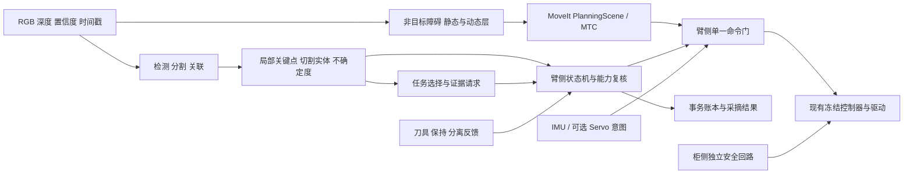

# peach 室外套袋水果感知、承接、剪切与收集：最终重构方案

日期：2026-09-23。版本：设计 v1.0。状态：**完整实施设计，尚未实施，尚未通过田间验收**。

本方案依据当前工作区源码、已有实验记录、三路专项静态审查以及 ROS 2 Jazzy / MoveIt / ros2_control 官方资料。历史实验数字均标出来源；设计目标不代表实测性能。没有启动机器人、相机、ROS 或 SetIO，没有修改驱动与运行源码。本文是冻结分析报告；`docs/architecture.md`、`io.md`、`testing.md` 继续记录现状，实施各阶段时才同步更新。

## 1. 最终裁定

采用**渐进式能力重构**：保留 AUBO E5、现有两种圆柱末端档案、ROS 2 Jazzy、MoveIt 2 / MTC / Pilz、现有可测试几何与 FSM；重建感知证据契约、执行事务、末端反馈、环境模型与性能路径。先获得一条可证明、可取消、可恢复的单果闭环，再扩大室外可用范围与批次吞吐量。

推荐产品顺序：**观察 → 选择 → 近距复核 → 套入/承接 → 确认保持 → 剪切 → 确认分离 → 保持撤离 → 转运 → 定点释放 → 确认收集**。如果末端只能剪切后落入筒中，必须先验证防掉落承接结构及落果路径，才能采用该工艺。软件不假定筒体天然等于抓手。

初始边界按“固定座 E5、室外套袋桃、允许补充传感器/照明/遮光/末端反馈”设计。若现有硬件无法提供保持和切割几何，则该工艺只能做到预抓取或受控套入验证，完整自主采摘须改造末端。其他水果通过经过标定的工艺档案扩展，不从名称相似推断兼容。

三个候选方案的裁定：

1. **只修当前缺口**：开发量最小，可快速验证单果；保留大 Python 进程、脆弱身份和重建慢路径，难以稳定扩大室外能力。用于第一阶段止损，不能作为终态。
2. **渐进式能力重构，推荐**：先修正确性，再分离任务/感知/执行；高带宽热路径按性能证据迁 C++ composition；保留 Python 推理和纯核。每一步能与旧版回放对照，硬件可行性早验证。
3. **全部 C++ / 全换算法 / 全换硬件**：验证面、迁移风险和数据需求最大，且仍不能自动解决遮挡果柄和承接问题。不采用。硬件替换只针对验收失败的能力。

## 2. 成功定义与不可混淆的状态

### 2.1 单果结果

- `OBSERVED`：发现一个对象，有位置与不确定度；不承诺能采。
- `MODEL_VALID`：袋体几何具有足够观测证据；不代表剪切位置已知。
- `PREGRASP_REACHED`：机械臂实际到预抓取位；不等于视觉残差合格。
- `PREGRASP_VERIFIED`：新观测证实相对位置/轴向误差满足当前套入预算。
- `SLEEVED`：由实际行程和状态反馈确认套入；计时结束不算。
- `RETAINED`：经工艺认可的夹持/防落/承接证据确认，剪切后不会无控制掉落。
- `CUT_COMMAND_ACCEPTED`：控制器受理命令。
- `BLADE_CLOSED`：机构到位。这个状态仍不等于 `SEPARATION_CONFIRMED`。
- `SEPARATION_CONFIRMED`：有物理分离证据；组合策略须经真实剪切实验验证。
- `RETRACTED_WITH_FRUIT`：沿验证路径撤离且果实仍被保持。
- `DEPOSIT_CONFIRMED`：释放后果实进入指定收集位置，末端为空。

默认产品 KPI 使用 `DEPOSIT_CONFIRMED` 计一次完整采摘；同时独立统计切断成功、保持成功、果损与掉落。软件 action 成功、流程走完、回 `harvest_stow` 都不直接计采摘成功。可额外报告“已分离并承接”中间产量，名称必须明确。

### 2.2 批次结果

返回 `COMPLETED / PARTIAL / NO_ELIGIBLE_TARGETS / ABORTED / CANCELED / RECOVERY_REQUIRED`，附 eligible、attempted、deposited、skipped、failed、unknown、damaged、dropped。空批完成不伪装成成功采到果实。分母分别记录：全部标注可见果、现场可达果、系统判定可采果、实际尝试果，避免靠大量跳过提高表面成功率。

### 2.3 设计不变量

1. 没有当前、完整、匹配的证据，接触与剪切能力为 `UNKNOWN/INVALID`。
2. 同一时刻只有一个运动所有者；每条命令经过臂侧最后授权门。
3. 不以缓存发布时刻替代图像采集时刻；不以心跳延长观测有效期。
4. 未确认切断时，不进入正常携果撤离；未知状态进入独立恢复流程。
5. 取消请求、取消被接受、执行器已停是不同事件。
6. 重启、换工具、换标定、时钟跳变、失去目标关联均撤销旧许可。
7. ROS 护栏与柜侧安全回路分层；单进程看门狗不能保证该进程死亡后的物理停车。

## 3. 当前源码结论：先处理的阻断

### 3.1 P0：工艺闭环与执行真实性

**轴向预算结构性负值。** 当前 `ToolBudgetParams`：捕获半宽 8 mm，安全余量 4 mm，刀平面误差 2 mm，机械臂轴向误差 2 mm，目标运动 3 mm。即使位置误差为零，轴向余额也是 `8−4−2−2−3 = −3 mm`。融合位置误差下限 6 mm 时余额至多 −9 mm；有效深度比在正常范围内的当前逐视角估计常将下限提高至 8 mm，余额更差。它明确说明当前默认配置不能授权自动剪切。不能通过删除安全项、直接减小 sigma 或放宽阈值“修通”。见 [tool_budget.py](/home/mu/Desktop/aubo_e5_jazzy_ws/src/peach_harvester/peach_harvester/vision/common/tool_budget.py:19)、[refine.py](/home/mu/Desktop/aubo_e5_jazzy_ws/src/peach_harvester/peach_harvester/vision/target_reconstruction/refine.py:1071)。

**剪切反馈缺失且撤退过早。** `stageVerifyCut()` 只检查命令 accepted，随后进入撤退与回收纳；`cut_confirmed=false` 直到最终验证才报失败。不能把“不报假成功”等同于“动作顺序安全”。应在进入正常撤退前建立物理证据门。见 [stages.cpp](/home/mu/Desktop/aubo_e5_jazzy_ws/src/peach_arm/src/stages.cpp:1240)。

**自适应套入完成靠计时。** `waitImuFollowTravel()` 按 travel/speed 等待，没有验证真实位姿、跟随节点终态和 Servo 状态；`motion.enabled=false` 时相关服务仍可成功。当前 Servo 输出是 mock JTC 话题，真机透传 FJT 路径不是等价接口。不能据此声称真机自适应闭环可用。见 [stages.cpp](/home/mu/Desktop/aubo_e5_jazzy_ws/src/peach_arm/src/stages.cpp:302)、[moveit_servo.yaml](/home/mu/Desktop/aubo_e5_jazzy_ws/src/imu_follow/config/moveit_servo.yaml:14)。

**保持、分离与投放缺证据。** 当前单条 close IO 和回 `harvest_stow` 没有覆盖完整 grip/hold/release 工艺。没有硬件反馈时软件应如实停留在已到位或命令已受理。

**袋口是剪切代理。** `_cut_station()` 给出袋口/分割极限参考点，未建立真实果柄—主枝拓扑关系。遮挡时不能凭袋体轴向推断柄一定处于刀口捕获带。将“袋体形状估计”与“可剪实体估计”分为两份证据。

### 3.2 P0：授权、身份、取消

- `imu_follow` 运动源仍存在绕过主阶段门的缺口；需统一所有者和最后出口。
- `RunHarvest.request_id` 空值回退为 `harvest`，账本恢复与重启后目标 ID 缺少可靠物理身份绑定，存在跨批误跳过风险。
- `TargetModel.capture_start/end` 当前填生成时间，`config_revision` 不是全配置摘要，标定可回退 `unspecified`。字段存在不代表语义可靠。见 [publish.py](/home/mu/Desktop/aubo_e5_jazzy_ws/src/peach_harvester/peach_harvester/vision/target_reconstruction/publish.py:761)。
- 调度 `on_deactivate()` 不完整取消在途；`_cancel_handle()` 发取消后即清句柄；goal 接收超时后的迟到 accepted 缺少可靠回收。下一目标不得在这些命令仍可能活动时开始。
- PREVIEW 绑定、scene_epoch、model_revision、run/calibration/config 校验不完整；跳过重建路径必须也执行同一能力门，不能靠一个“unrefined”标签绕过。

### 3.3 P1：室外环境与工程能力

- `sensors_3d.yaml` 当前 `sensors: []`；工具对 whole octomap 的豁免以及 Servo 未检查 octomap，使“有 MoveIt”不等于“有树冠障碍感知”。
- 目标掩膜 TSDF 的局部切片不覆盖非目标枝条，`corridor_clear` 不能当成完整自由空间证据。
- `brain.py` 三个 Python 节点共 executor；推理、重建、任务与停止响应的资源隔离不足。
- 重建历史峰值 EMA 达秒至十秒级，风动条件下更容易构建过时模型，不能靠把 TTL 设为 120 s 解决。
- recorder 固定订阅与 catch-all 可能重复；全局 drop-oldest 混合队列会丢重要事件。

### 3.4 修正旧报告的几处口径

1. adaptive 内径 116 mm、袋径 80 mm、壁余量 2 mm 时，径向可用量为 `58−40−2=16 mm`，不是 26 mm。若误差为约 19 mm，仍应拒绝套入。
2. 工具 DI 的含义由实际接线决定。刀具闭合限位只能证明闭合，不能独立证明果柄已切断；不能“接上 DI 就置 cut_confirmed=true”。
3. 不自动删除 6 mm 下限。应以实测误差模型替代启发式 sigma，验证轴向/横向投影与覆盖率后再改。
4. 当前重建已有优先选择有同戳掩膜原帧的缓存逻辑；继续保持精确帧绑定，不把旧报告中的“最近邻掩膜跨帧匹配”当优化方向。
5. 未确认切断时不能笼统“保持抓紧并自动退安全位”；可能仍连接枝条，必须走 §13 的状态相关恢复。

## 4. 室外运行范围与环境策略

先建立可声明的运行范围 ODD（Operating Design Domain），范围之外输出原因并停止发起新接触。数值来自测试分布与厂商限制，不能凭本方案给温度/风速任意放行。

### 4.1 光照与成像

- 直射阳光、背光、树影快速切换：记录照度、饱和像素比例、袋 ROI 动态范围、有效深度比例和近颈纹理。采用遮光罩、受控补光、合理短曝光；补光对太阳的改善需实测。
- 不同颜色、蜡面、褶皱、污渍和湿袋：实例分割输出边界不确定带；保守外包络用于净空，袋颈不因高置信分类而自动可信。
- 多曝光只在目标近静止时融合；风中 HDR、时域深度平均可能混合不同实体位置。动态场景选短曝光、单帧质量门和带时间戳的多次观测。
- 使用偏振或滤光片前验证亮度损失、主动红外兼容与标定变化。遮光/防护窗更换触发光学与深度再标定。

### 4.2 风动、雨露与温度

- 风速传感器用于环境预警；接触决策主要使用目标位移、速度、加速度上界与短时预测误差。相同风速对不同枝长和果重的影响不同。
- 出现摆动时：等待稳定窗口 → 选择更近/信息更好的观察位 → 在验证过的保持结构下固定 → 复核再剪。禁止未经验证的高速追风视觉伺服。
- 雨、露水、结露、镜头水滴、湿袋强度下降分别测试。未验证 IP、绝缘、防护窗和刀具环境条件前，降雨工况不进入自动模式。
- 记录 CPU/GPU/相机温度、降频、丢帧和供电；在厂商规定范围内再设置降额阈值。相机温漂影响外参与深度，冷启动预热到稳定才建立精标定基线。

### 4.3 场景与果实变化

- 叶片遮挡、枝条穿过袋口、贴邻双果、袋体交叠、果体在袋中偏心：分别标注，单独评估。
- 袋尺寸超内径、刀口距果体不足、颈部与枝条不可分辨、退路被挡：明确拒采；不得用较小拟合圆柱漏掉褶皱外突。
- 固定座当前覆盖范围由机械臂、工具、相机最小有效距离和树冠共同决定；移动底盘是后续独立项目，引入后按 REP-105 建 `map→odom→base_link`，不能直接复用旧场景 epoch。
- 地面倾斜、支架弹性、底座震动需纳入手眼/世界系误差；固定座并不等于外参永远不变。

### 4.4 运行模式

`REPLAY`、`MOCK`、`OBSERVE_REAL`、`PREGRASP_REAL`、`CONTACT_VALIDATION`、`HARVEST_VALIDATED` 六档。模式由部署和操作员意图共同选择，臂侧最终门强制。禁止从 mock 校验成功自动升级到真机；真机上线须已有人的运动与 IO 授权。`autostart` 默认关，其已有授权语义保持。

## 5. 硬件方案与必须得到的物理证据

### 5.1 保留并复核

- AUBO E5 与冻结驱动栈；复核实际整机载荷、腕端力矩、工具/相机/线缆质量及惯量。不能只比较果重与名义额定负载。
- hollow：内径 104 mm、外径 120 mm、筒长 200 mm；adaptive：内径 116 mm、外径 120 mm、筒长 200 mm。机械尺寸只作为初始值，刀具包络、TCP 和柔顺行程要实测。
- PS800-E1 双前端做 A/B，保留 host stereo 作为候选，不将室内帧率等同于室外深度准确性。
- serial_imu 保留姿态观测；IMU 不能直接证明插入距离、夹持力、滑落或切断。

厂商 2024-11-18 手册给 PS800-E1 测距 300–1000 mm、深度 0.8 fps、工作温度 0–45℃；仓内记录与其他规格版本不同。实施前按本机序列号、固件和模式核定范围。host SGBM 是另一条处理路径，必须单独验证。来源：[PS800-E1 官方手册](https://doc.percipio.xyz/cam/manual/PS800_manual.pdf)。

### 5.2 完整工艺的最低能力，而非任意采购清单

1. **机构状态反馈**：刀开/刀闭或可验证行程、夹持/承接机构状态、供气/供电状态。DI 数量不足时使用独立 I/O 模块与应用适配节点，不修改冻结驱动偷塞协议。
2. **保持能力**：可控夹持、机械防落底托/闸门或经验证的承接结构之一；覆盖剪切冲击、撤离加速度、袋破损和断电场景。单靠侧壁摩擦必须有滑落/损伤实测。
3. **分离证据**：刀行程配合切割负载特征、颈部视觉拓扑变化、受控的小幅低力分离检验等。具体组合依末端选型；任何单一证据的假阳性率须实测。
4. **保持/掉落证据**：光电/距离/重量/力/夹持位置中至少可构成工艺认可的判别方案；不能仅依“刚才看见水果”。
5. **接触止损**：若真实控制链没有可用力反馈，则只能进入经过测量验证的低速、短行程、被动柔顺和限能量接触；需要主动力控时新增腕部力矩传感器及兼容控制能力。
6. **收集工位**：固定已标定箱位、缓冲/软垫、箱满或入口堵塞检测、释放确认。`harvest_stow` 只是位姿，不能直接成为投放证据。
7. **环境与维护**：镜头遮光防护、线缆应力释放、防水接头、刀具清洁更换、供气过滤和电源稳压。传感器防护等级不能代表整机系统防护等级。

### 5.3 两条剪切几何路线

- **可见果柄路线**：近距 RGB/深度识别果柄、果体禁切包络、主枝和安全切割区；计算刀口扫掠体，不只输出一个点。
- **遮挡果柄路线**：只有机械导向/夹持能把果柄约束进可验证捕获区域，且能排除主枝与果体时才可自动剪。记录 `cut_geometry_source=MECHANICALLY_CONSTRAINED`。若袋口只是视觉代理、没有机械约束，`cut_capability=UNKNOWN`。

先台架比较两条路线的可观测率、损伤率和成本；优先选择覆盖真实果园常见袋型的路线。不能假定更大模型可以看见不透明袋后的果柄。

### 5.4 标定交付物

每个实物工具单独 `tool_serial + geometry_revision + calibration_revision`。产物包含：TCP 六维、刀平面、筒口/底托位置、内径随深度变化、柔顺位移范围、刀口捕获域、力/位置/电流零点、闭合时序、保持/释放曲线、数据日期/温度/原始测量引用。更换刀片、拆装相机、碰撞后、工具换型触发规定的再验证；实测超期时 capability 降级。

## 6. 最终软件边界与进程布局

### 6.1 包职责

- `peach_interfaces`：唯一跨包业务 IDL。保留标准 Image / CameraInfo / PointCloud2 / JointState / Imu / PoseWithCovariance 等；新增领域字段仅表达证据与事务。
- `peach_common`：零业务依赖的参数检查、时间/身份验证、错误码映射和公共工具；不成为循环依赖的大杂烩。
- `peach_stereo`：相机前端、深度规范化、置信度与诊断。厂商节点继续薄适配。
- **新 `peach_perception`**：从 `peach_harvester/vision` 迁入场景检测/跟踪/局部目标建模/不确定度；先保持 Python 纯核，逐个把已证实的热路径迁 C++ 组件。
- `peach_vegetation`：保留枝叶特征算法，转为非目标障碍观测的可替换插件/旁证，不直接产生剪切授权。
- **新 `peach_scene`**：非目标障碍、静态结构和动态占据的时间管理，向标准 MoveIt PlanningScene 发布可验证几何；接收 perception 标准点云/IDL，避免相互 import。
- `peach_arm`：执行、运动规划、命令权威、末端协议、接触状态机、恢复。工具协议内部独立模块；只有复用/设备隔离确有需要时再拆 `peach_tool` 包。
- `peach_harvester`：批次策略、目标预约、预算、恢复调度和账本，保留可测试 `harvest_fsm.react`。
- `peach_observability`：诊断、可视化、会话归集与只读报告；录制后端使用 rosbag2，控制按钮只是已授权 API 的客户端。
- `peach_bringup`：唯一应用编排、配置解析与预检；Include 原驱动 bringup。
- `peach_system_tests`：纯核组合、隔离域 launch_testing、回放、故障注入和性能测试。

新 C++ 可替换算法用 pluginlib 的最小基类与导出；不新建 dict 注册框架。现有 Python 算法先保留直接调用，避免只为 pluginlib 包一个跨语言空壳。新增 C++ 参数用 generate_parameter_library，Python 继续现有 typed attach 方式并补交叉校验。

### 6.2 运行进程

1. `camera_container`：厂商/host stereo 与可组合预处理。相机崩溃不能拖垮停止与任务账本。
2. `perception_worker`：Python GPU 推理/关联；有界输入，最新帧策略；不阻塞任务线程。
3. `geometry_container`：迁移后的 C++ 点云/ROI/不确定度等热路径；条件满足时合入 camera_container，必须用 A/B 测拷贝与故障隔离收益。
4. `scene_server`：障碍维护，与慢 TSDF worker 分离。
5. `arm_server` + MoveIt：专用控制/停止回调与规划 worker。共享 MoveGroupInterface 禁止无锁并发使用；优先每个规划上下文独立或集中排队。
6. `supervisor`：独立进程，单线程事件归约 + 异步客户端回调；不承担 GPU 与磁盘写入。
7. `rosbag2 recorder`、`observability`：独立进程和 I/O 预算，故障不会拖慢命令门。

Composition 是减少同进程数据传递成本的工具；跨 Python/C++、跨进程与不同内存所有权并不自动零拷贝。官方依据：[Jazzy Composition](https://raw.githubusercontent.com/ros2/ros2_documentation/jazzy/source/Tutorials/Intermediate/Composition.rst)。

### 6.3 系统数据流



## 7. 数据契约、坐标、版本与许可

### 7.1 身份层次

- `run_id`：系统生成 UUID，一次作业唯一；用户 `request_id` 仅幂等键，不能直接拼文件路径。
- `scene_session_id`：场景会话 UUID；`scene_epoch` 是该会话内代数。底座/相机世界关系改变时推进。
- `target_uuid`：当前场景物理对象身份；原 `target_id` 可保留显示短名。跨重启不凭数字 ID 认同一果。
- `observation_id`：原帧与观测唯一标识，绑定 stamp、sensor_serial、frame_id。
- `model_revision`：不可变模型版本，绑定源帧集和算法/配置/标定摘要。
- `plan_id`：成功规划后的内容标识；绑定模型、工具、环境版本、起始关节状态与容差。规划失败不更新有效 plan。
- `attempt_id`、`contact_transaction_id`、`command_id`：一次尝试、一次接触、一次工具命令分别标识。
- `authority_generation`：重启/撤销/恢复时单调换代；旧请求与迟到响应不能获得新一代权威。

所有接触入口核对完整元组，空版本不进入真机接触。兼容期旧接口只允许观测/预览/受控预抓取，禁止把缺字段自动填“当前值”升级为接触证据。

### 7.2 观测和几何扩展

`TargetObservation`：沿用 Header、实例掩膜引用、类别；增加 source_frame、深度模式/scale、局部有效深度比例、遮挡类别、边界缺失标志、质量原因集合、袋/颈/柄语义及各自可见性。

`TargetModel`：保存原始采集窗 `source_start/end`、生成时间、模型参考时间；袋体外包络/分段半径、袋底/袋颈、轴向符号来源、柄段和主枝局部模型、果体禁切包络、刀口捕获区域；以有效标志区分未知协方差与真实零协方差。保留旧字段供显示，不再以全零协方差代表精准。

`ToolState`（拟新增）：拆分 `blade_state`（UNKNOWN/OPEN/CLOSING/CLOSED/OPENING/FAULT）、`retention_state`（UNKNOWN/READY/ENGAGING/HOLDING/RELEASING/FAULT）、`payload_state`（UNKNOWN/ABSENT/PRESENT/SECURED/LOST）；刀闭合与保持可以同时成立。各状态有独立 stamp/quality/来源，另带原始 DI / 位置 / 力摘要、去抖状态、tool_serial、command_id、fault_code。

`StageEvidence`（拟新增）：stage、evidence_id、来源帧/反馈、测量值/界限、置信覆盖说明、有效时间、身份元组、reason_code。证据可审计，不带执行权。

`ExecutionPermit`（可为 arm 内部强类型，跨进程才做 IDL）：stage、身份元组、单调时钟截止、lease generation、速度/行程/空间边界、必须持有的证据 ID。由臂侧生成和消费；perception 只能发布事实/能力建议，不能直接授权硬件。

### 7.3 分级能力

沿用 `geometry/pregrasp/sleeve/cut` 三态能力；新增保持与收集证据时按工艺明确字段。

- 预抓取：机器人就绪、execution 开、目标关联有效、自由空间/规划可达。
- 套入：以上 + grasp 开 + geometry/sleeve VALID + 新鲜相对几何 + 走廊覆盖 + 退路 + 合格工艺档案。
- 剪切：以上阶段状态 + tool 开 + cut VALID + 保持或防落已确认 + 刀口/主枝/果体约束 + 机构预备状态。
- 携果撤离：分离确认 + 保持确认 + 撤离空间仍有效。目标被工具遮挡后可依工具证据维持保持状态，但不能维持旧剪切定位。
- 释放：收集位到达 + 收集工位有效 + 完成分离 + 工具允许释放。

`allowed` 作为整套工艺可行性摘要保留，禁止继续作为所有阶段唯一 bool；每个入口按自己的能力和状态决定。套入许可与剪切许可分开后，新增“套入后不可剪”的状态必须具备明确恢复策略。

### 7.4 时钟和坐标

内部单位米、弧度、秒；光学系符合 REP-103。深度 scale 从相机实际模式/元数据确定：当前 host 路径 uint16×0.25 mm 不应泛化成所有 Percipio 模式，也不能因 AGENTS 概述“毫米”而改错比例。边界只转换一次，保存 mode/scale 便于回放。

积分、mask、RGB、depth、CameraInfo 使用同一原始采集身份；tf2 查询采集时刻，精确 stamp TF 不可用即拒绝该帧。latest 仅显示并标 stale。允许 ApproximateTime 的流必须记录实际时间差，阈值来自目标速度×时间误差预算。变更分辨率、裁剪或深度模式必须同步内参。

ROS 时间用于传感器/TF/回放；本地 deadline 和 heartbeat 用 monotonic/steady clock。ROS 时钟回跳、sensor 重启、时间映射跳变立刻换代和撤销许可。跨机用稳定时钟同步并记录误差；不能把不同主机 monotonic 数字直接比较。

## 8. 感知与建模最终算法

### 8.1 相机前端

输入模块输出不可变帧包：原始图、校正图定义、深度、置信度、CameraInfo、曝光/温度、设备帧号、采集起止、时间戳定义和处理时间。设备多图案深度即使输出一帧也可能跨时间采集；单帧不等于瞬时测量，预算覆盖曝光/采集整个区间，未知时用经过实验验证的保守上界。所有中间结果引用该帧包身份。使用成熟 `image_transport`、`cv_bridge`、`message_filters`、tf2；先核对 Jazzy 公共 API 与本机安装版本再编码。

先核相机几何一致性：SDK配准内参、文件覆盖后的CameraInfo、raw/rectified定义和回投公式必须一致。当前源码存在SDK配准用 `calib_c_`、CameraInfo可外部覆盖而回投只用K的组合，且仓内记录过约+8像素系统偏差；须按距离/视场位置复测。先修注册/投影模型，再标手眼，禁止用一组刚体外参吸收随深度变化的配准误差。

双目质量至少检查左右一致性、纹理不足、视差边界、重投影误差、相机运动和遮挡。SGBM 的 disparities/block/uniqueness/speckle 等作为一个相机模式联合标定；不按“看起来更密”选参。每次 A/B 同时检查深度偏差、尾部误差、RGB-D 边界配准与有效 ROI 覆盖。

当前 `temporal_k=3` 的历史像素融合需拆成两路：单帧权威深度供动态接触判断；稳定流供静态显示/经过验证的静态融合。若生产使用时域滤波，必须携带源时间范围与运动模型，测其滞后及旧像素残留。用当前 stamp 包装历史深度会低估风摆误差。

### 8.2 场景发现与身份保持

1. YOLO + MobileSAM 保留冻结基线。全图检测用于发现与关联；选定目标使用高质量 ROI 分割/关键点。无关目标保持低频可见性更新，不能锁定一果后让其他目标长期断粮。
2. 比较“一次实例分割+关键点网络”与当前多框 SAM 的端到端收益；只有按袋材/遮挡分层评测优于基线才替换。模型大小不是优先决策指标。
3. 关联使用预测位置、协方差、mask/外观与物理尺寸联合 gate，再做一对一分配。身份冲突、新旧轨迹交叉、遮挡后重现可保留候选，不自动续用旧切割许可。
4. `tentative/confirmed/occluded/lost/removed` 以持续秒数和观测质量表达，不用固定帧数隐含不同相机不同确认时间。保持当前 confirmed 机制，但明确单位迁移。
5. 全局目标存储只管理事实、身份、时间与可见性；优先级、是否重试、是否已采的决策归 supervisor/账本。

### 8.3 关键点与局部几何

输入：相同原始帧的 mask、可见关键点、深度、置信度、精确 TF 和当前工具档案。

处理顺序：

1. 在 mask 内去除低置信、边缘混合像素与明显离群深度；保留“边界未知”标志，不能因侵蚀 mask 把袋径缩小。
2. 可见关键点邻域鲁棒提升到 3D，记录观测法线、采样覆盖与不确定度。无深度时可用多视三角化，但基线、关联和运动假设必须满足；不能用背景深度填充袋颈。
3. 同时保留袋底/袋口轴正负假设，直到语义证据确认；重力只作为先验，水平果袋不强行翻轴。
4. 构建分段外包络 `r_upper(s)`，包含褶皱、邻接不确定区域和袋体可能变形；径向许可检查全插入长度的最大占用，不能只看拟合平均圆柱。
5. 独立估计可切组织及安全区间，输出可见/机械约束/推断/未知来源。切点合法性要排除主枝与果体包络。
6. 多视融合优先选择 2–3 个有独立信息的停稳视点作为初始候选；视数不是固定保证。以轴/关键点观测条件数、覆盖和误差收敛决定是否足够。
7. 保留圆柱 RANSAC、截面、Huber 等纯核作辅助一致性检查，出现相互矛盾就降级；不让拟合成功覆盖关键语义失败。

### 8.4 主动观察

候选观察位先按全臂可达、场景碰撞、相机有效工作距离与退路筛选，再按预期信息增益排序：袋口/果柄可见性、观测基线、轴向可观性、邻枝分离程度、移动代价。可用少量可解释候选，不引入全局强化学习作为首版依赖。

每次观察必须达到实际位姿、关节/TCP 速度稳定，再收集有效窗口。若袋随风动，机械臂停稳不等于场景静止。观察结束检查目标运动及前后身份，不能将不同物理姿态强制融合成静物。

超过视点/时间预算仍无可剪证据：`SKIPPED_UNOBSERVABLE`，附具体缺失字段。跳过统计进作业覆盖率，不隐藏。

### 8.5 TSDF / ICP 的位置

把 `collect_bag_views + fuse_bag_views` 提升为独立 `TaskGeometryEstimator`，直接消费原始观测；BuildTargetModel 成功不再要求 mesh/TSDF 存在。当前代码的 finalize/refit 与 `tsdf.enable` 有结构耦合，不能只关一个参数实现此方案。

TSDF 作为静态短窗的包络补证、可视化和离线分析任务，异步、低优先级、有界 ROI/内存/时长；只有实验证明必要且满足时延预算的产物进入许可链。动态叶片、风摆袋不能无条件长时间积分。ICP 只检查有限残差与退化性，不覆盖真实 TF、不通过“把目标配准回原位”抹掉目标运动。

## 9. 不确定度、误差预算与有效期

### 9.1 统一数学口径

将随机协方差、系统偏差界、经验误差分位和机械硬界分开存储。现有 `sigma` 混合启发式毫米数与 95% 项，必须先统一含义。

3D 点 `p=f(u,v,z,K,T)` 的随机协方差可用雅可比传播 `Σp=JΣinputJᵀ`，包括 RGB-D 注册与外参相关项；随后在盲测上检验覆盖率。沿袋轴 `a` 的随机轴向方差为 `aᵀΣp a`，横向在 `P=I−aaᵀ` 子空间计算；角误差用明确的切空间模型。系统偏差单列，不因多视数量增加就除以 √N。

单个 95% 项相加不是自动成为联合 95% 保证，RSS 也依赖独立性。工程首版采用经过验证的保守包络；统计建模成熟后用联合分布/相关项估计并明确总体风险口径。不能以降低统计可信度换“通过”。

### 9.2 径向套入预算

以最不利截面为准：

```text
M_rad(s) = R_inner(s) − r_target_upper(s) − wall_clearance
           − E_lateral − s·sin(E_axis)
           − E_TCP − E_handeye − E_runout
           − E_deformation − E_tracking − E_time − E_motion(horizon)
sleeve_valid = min_s M_rad(s) > required_reserve
```

同一误差不能在多个项重复扣除；每项记录坐标、来源和是否已包含于联合协方差。`E_time` 覆盖 RGB-D/TF 时差；`E_motion` 覆盖观测到最迟接触/停车时刻的目标运动。自适应末端的实际变形可能增大捕获能力，也可能增大外部扫掠范围，两个方向都要算。

示例只解释现有公式：D_inner=104/116 mm，D_bag=80 mm，wall=2 mm 时可用净空为10/16 mm；若横向6 mm、有效长度150 mm、轴误差2°、其他项8 mm，则误差约19.23 mm，两工具均不通过。这不是针对实物的最终测试结论。

### 9.3 剪切预算

选择命令切割位姿，使其定位误差集合**完整包含于已验证安全切割域**，同时可切组织在刀口捕获域内、刀片扫掠体排除果体/主枝。仅有区间交集不够。以下标量式只适用于对称捕获带、命令居中且组织尺寸已计入的情况；一般情况额外扣除名义偏置与组织尺寸，使用集合包含/膨胀后的扫掠体判据：

```text
M_axial = capture_half_width − required_reserve − E_cut_axial
cut_valid = M_axial > 0
            AND cutting_swept_volume excludes fruit/main_branch
            AND retained_or_catcher_ready
            AND cut_geometry_source is validated
```

`E_cut_axial` 来自实际切割实体定位、刀平面标定、控制跟踪、柔顺变形与预测运动，不再将袋底位置散布直接代入袋颈轴向误差。果体禁切距离和捕获带内安全余量是否重叠，必须按几何定义检查，不能仅因数值相似删项。

工具捕获域测量：台架对不同柄径、倾角、湿度、袋材、刀片磨损、供压和轴/径偏移扫描，形成成功/损伤概率图与工作域；选择满足目标质量的内部区域。单条理想纸带的 95% 捕获范围不能直接代表真实果柄。

### 9.4 动态有效期

```text
E_motion(Δt) = v_bound·Δt + 0.5·a_bound·Δt² + model_prediction_bound
Δt = 当前观测龄期 + 排队/规划/下发预算 + 到接触时间 + 必要停止时间
```

从剩余径向/轴向余量反解允许的最大 Δt，并与传感器/工艺最长寿命取最小值。无法给出可信运动界时接触能力为 UNKNOWN。模型对象可以缓存 120 s 供显示或重新观察，但接触许可不得沿用这个常数。

预抓取停稳后必须刷新视觉证据；套入后目标被遮挡时，只能使用已经验证的机械约束与工具反馈缩短后续未知区间。心跳不产生新几何证据。

## 10. 环境模型与碰撞逻辑

### 10.1 三份不同的几何

1. 目标内部/包络几何：用于判断筒内是否装得下。
2. 外部工具走廊：工具外壁、刀具、相机、线缆和承接器扫掠体与枝叶/邻果的关系。
3. 全臂环境：主干、粗枝、支架、地面、收集工位及其他固定设施。

每份输出 `CLEAR/BLOCKED/UNKNOWN`、受检体积、源帧时间、覆盖比例和最小距离。没有深度或被叶遮住不等于空闲；密集场景必要时主动补视或拒采。

标准 PlanningScene 不原生承载本项目“未观测/过龄区域禁止通行”的证据语义。`scene_server` 同步发布 `SceneCoverage` 领域证据（scene版本、已覆盖体积、时间/质量、未知区），臂侧对本段完整扫掠体检查覆盖与新鲜度；UNKNOWN必须在命令门拒绝，或保守映射成禁入几何。只发布已看见的 CollisionObject 不能落实未知区约束。

### 10.2 静态与动态分层

主干/设施等稳定结构采用标准 CollisionObject 或受验证 octomap；叶、细枝、邻果使用局部动态层、时间衰减和运动膨胀。过期障碍不能直接删除后视为空闲；其区域转 UNKNOWN 等待重新观察。

自体过滤利用 URDF、工具真实包络与精确 TF。空心筒不能永久用实体圆柱后再豁免整张地图解决：改为合适的环形/分段凸体碰撞表示，明确内部可容纳目标的部位。

ACM 仅在指定阶段开放“当前目标 × 指定工具接触面”；不豁免整个 octomap 或所有枝叶。取消/结束/异常必须恢复；恢复失败锁存不可继续。先修自滤与接触模型再启用地图，避免旧鬼影使系统只能通过全局豁免运行。

### 10.3 动态停车包络

最小障碍余量至少覆盖观测误差、障碍运动，以及机器人在探测/处理/通信/停车期间的位移：

```text
d_required >= E_obstacle + E_robot
              + robot_displacement_during_response
              + robot_brake_displacement_measured
              + obstacle_motion_bound_over_response_and_braking
```

响应时间只到实际开始制动，刹车位移另计，避免重复计算；障碍运动覆盖响应与制动的整个时域。制动位移在最坏姿态、负载、速度、通信与温度条件下测量。控制频率、软件设置速度、10 Hz 碰撞检查都不自动给出物理停止能力。人员保护继续依独立安全方案，不依赖这张场景地图。

## 11. 运动、接触与单一命令门

### 11.1 ExecutionAuthority

权威拥有者置于 `peach_arm`，所有 MoveTo、Survey、ExecuteTarget、MTC、Servo、imu_follow、恢复和工具 IO 走同一门。owner 为 `NONE / PLANNED / CONTACT / RECOVERY`；工具命令是当前事务的子权限。

每次命令提交检查：生命周期 Active、robot/joint 状态新鲜、操作意图有效、使能、身份元组、owner/generation、stage permit、deadline、当前停止/恢复锁。长轨迹执行期间持续监视撤权条件；使能变 false 不能只更新 bool。

`managed` 模式下 supervisor 心跳丢失必须撤权并停，不回退本地 `true`；`standalone` 模式是显式部署选择、独立授权来源，运行中不能自动切换。transient_local 的旧 true 不能复活新进程。

同一个 JTC 上的两个客户端不能靠 controller_manager 自动区分所有权：必须让应用有唯一输出端，并限制直连入口。不同控制器争用同 command interface 时才使用标准严格切换；仍需实际停稳检查。SROS2 可减少未授权客户端绕接，但不提供功能安全。

具体出口拓扑采用 arm 内薄 `FollowJointTrajectory` action 代理：应用侧 MoveIt 控制器映射/TEM/MTC 输出指向代理，代理以现有标准FJT客户端转发到冻结控制器；保持joint_names、时间、容差、反馈、result、取消语义，不重采样轨迹。代理匹配当前已登记轨迹摘要/事务、复核owner和状态，未登记直连请求拒绝。MoveIt配置变更放应用overlay，不改冻结控制器yaml。Servo输出先到同一门的独立输入，只有CONTACT lease有效才转发到**已验证支持**的控制器接口。工具SetIO同样只有arm后端持有客户端。部署核验控制器实际publisher/client图并限制旁路；单加arm内部owner变量不能拦住原move_group直连FJT。

### 11.2 接口能力裁定

固定筒优先沿用已支持的规划轨迹执行，短受限 LIN 完成接近/套入。自适应接触分两步：

1. 在冻结驱动支持的轨迹链上验证被动柔顺、低速有界短程；可停稳再观察再修正，不冒充连续力控。
2. 连续 Servo 只有在真机控制器支持的流式命令、替换、取消和超时语义全部验收后开放。不能把每10 ms发单点 FJT 当成可靠实时流式桥。若需要修改厂商驱动，作为驱动维护方的独立依赖，本仓不绕过只读限制。

MoveIt Jazzy Servo 明确区分输入时效、输出 JointTrajectory/Float64MultiArray、状态和碰撞检查配置；参数存在不证明本机输出链兼容。依据：[Jazzy Servo 参数源码](https://raw.githubusercontent.com/moveit/moveit2/jazzy/moveit_ros/moveit_servo/config/servo_parameters.yaml)。

### 11.3 接触 Action

替代 Trigger+sleep，定义可取消 `ContactMotion`（内部能力 action，可按包边界决定是否对外公开）：

- goal：完整事务、参考轴/入口、最大实际行程、姿态/横向/接触边界、期望目标、deadline、工具策略。
- feedback：实测 TCP/工具口位置、投影行程、径向/角残差、关节速度、IMU/力/位移新鲜度、Servo/控制器状态、无进展时长。
- result：`REACHED/STOPPED/CANCELED/FAULT/UNKNOWN`，达到的位置和证据，停止是否确认。

实际行程沿起点参考轴计算并同时限制侧向偏移；adaptive 工具口位置必须包含柔顺几何，不能只用法兰 FK。时间只作截止，不作到位证明。dry-run 只产生规划/预测结果，不能产生 SLEEVED。

IMU 先完成安装与轴符号标定，比较“FK 预测刚性姿态”与“实际工具姿态”得到相对柔顺偏转；处理 yaw 漂移、串口迟延、重复样本和方差未知。未经该处理直接跟 IMU 可能把机器人自己的动作正反馈放大。

### 11.4 模式交接

MTC → 接触：旧 action 终态 → 实测停稳 → 撤旧 owner → 检查接触 permit/起点/场景 → follower ready 与接口确认 → 授新 lease。

接触 → MTC：停止推进 → 控制器/Servo 停请求并确认 → 实测停稳 → 撤 lease → 用实际关节状态重建起点 → 授规划 owner。任一步超时进入 STOP_UNKNOWN，不发新运动。

### 11.5 规划流程

全链预检观察位、预抓取、套入、剪切、携果撤离和收集位；单点 IK 可达不够。候选考虑关节/奇异余量、姿态滚转、相机视野、线缆、障碍与携果包络。

自由空间用 Pilz PTP 或 OMPL；接触方向限定短 LIN/Cartesian 及接触策略。LIN 碰撞失败不能用任意 OMPL 绕行去兜接触段。MTC 组织阶段与场景修改，不另造轨迹插值器。

预抓取复核分别看径向、与预期 standoff 的轴向差、姿态、目标运动、机器人停稳；使用新图像窗口及其 TF。当前只比较工具 Z 角的两次 latest TF 不够。修正次数有限，失败回观察/跳过。

PREVIEW 只有规划成功后登记 plan_id；执行前核起始关节、场景与模型版本，不满足则重新规划。内部自动 FULL 可以生成自己的计划，无需 UI 必先预览，但必须具有同等绑定与验证。

## 12. 工具事务与完整状态机

### 12.1 主状态

```text
IDLE → TOOL_READY → OBSERVING → MODEL_READY → PREGRASP
→ PREGRASP_VERIFIED → SLEEVING → SEATED → RETENTION_READY
→ CUT_REQUESTED → BLADE_MOTION_COMPLETE → SEPARATION_CONFIRMED
→ LOAD_SECURED → RETREAT_READY → RETRACTING_WITH_LOAD → CLEAR_OF_CANOPY → TRANSFER
→ DEPOSITING → DEPOSIT_CONFIRMED → COMPLETE
```

任何阶段可进入 `STOPPING / FAULT / RECOVERY_REQUIRED`。状态变更只由“动作终态 + 必需证据”驱动，不由进度条或定时器直接推进。

### 12.2 各阶段约束

- `TOOL_READY`：实物/档案匹配；刀/夹持状态互斥合理；压力/电源/收集通道正常；上轮无未知命令。
- `SEATED`：实际套入距离和工具姿态合格；接触力/柔顺/电流等已选监测有效。没有硬件监测时只能使用经过台架验收的受限工况。
- `RETENTION_READY`：主动保持已到位或防落结构已就绪；剪后载荷路径明确。
- `CUT_REQUESTED`：先持久化 INTENT，再至多一次发送；返回 accepted 记录 ACK，不自动升级切断。
- `BLADE_MOTION_COMPLETE`：反馈为本命令后的新事件，行程/限位时序合法；早已卡高的 DI 不算新完成。
- `SEPARATION_CONFIRMED`：组合证据满足已标定判别规则；果体/主枝无禁切碰撞，保持反馈持续有效。
- `LOAD_SECURED`：必须有本次剪切之后的新鲜载荷/物体存在及保持反馈。剪前承接机构READY不代表剪后已经接住。
- `RETREAT_READY`：载荷已承接，刀具处于工艺允许撤离状态，无夹枝/夹袋/缠绕证据；刀应开或闭由实物工艺验证，不根据“已分离”自动推定脱开。
- `RETRACTING_WITH_LOAD`：撤离路线按实际状态和携果包络复检；保留监测，不因上一阶段成功就释放保持。
- `DEPOSITING`：处于收集区且箱/承接工位有效；释放后末端为空和接收端有物的证据一致。

### 12.3 工具命令协议

每个命令包含 `command_id/transaction/tool_serial/profile/calibration/intent/deadline`；记录发送、受理、物理开始、物理完成/未知。SetIO ACK、DO 回显、闭合 DI、果柄分离分开。

IO 映射从完整工具档案加载；限制 fun/pin/state 范围，机械断电默认状态由硬件设计决定，不能统一“所有 IO 置零”。切刀时若接线只支持一次电平 close，必须定义复位/open 的可支持路径以及反馈；不存在的接口不能在软件里假设。

反馈处理包含去抖、上下沿、断线/卡高、互斥限位、超时、时序不可能和反馈来源诊断。输入可信度不够时标 UNKNOWN。`resetSafe()` 一类仅改内存的方法改名表达逻辑复位，不能宣称已物理安全。

### 12.4 剪切幂等与重启

不能在无设备幂等支持时承诺跨掉电 exactly-once。实现目标是：持久化命令意图、同进程去重、已发送或发送结果未知时不自动重发；重启后对未终结事务强制核对实物。

## 13. 失败、取消与恢复

### 13.1 停止事务

顺序：撤销当前 generation 与 owner → 拒新命令 → 向精确的在途 MoveIt/FJT/Servo goal 发停止/取消 → 等 action 终态与新鲜关节/机器人状态证实停稳 → 记录 `STOP_CONFIRMED`。超时或状态断流为 `STOP_UNKNOWN`，禁止启动下一目标。

停止请求需边沿触发和去重，不能在等待循环里每50 ms重复 cancel 形成风暴。现有 detach worker 可以避免服务阻塞，但不证明旧执行终结；旧 worker 的 cancel/generation 不允许被新周期清零复用。

进程死亡时不可能依赖它自己运行取消。必须验收现有驱动/控制器/柜支持的超时与停止链；若无此能力，在本仓驱动只读条件下，这是部署前外部依赖，不能宣称应用已解决。`RobotMoveStop` 为应用停轨，保持硬件急停独立。

### 13.2 状态相关恢复

- **未接触**：停稳后可重观察、重新规划或跳过；旧 plan 和 permit 作废。
- **部分套入、未发刀**：先确定刀具状态与是否缠绕/夹住；满足低力、有界反向通道和传感反馈条件时，可由显式 RECOVERY owner 按实际位置小步退出。否则等待人工处理。
- **刀已发、切断未知**：停止推进，保持经验证的承接/保持状态，不自动重发刀，不执行正常撤离。追加观测或工艺认可的低力诊断；仍不明则人工核查。不能用“反向原路”替代分离确认。
- **已切断且载荷保持确认**：允许依据当前场景和实际位姿进入验证过的携果恢复路径，不要求再次看见已被工具遮挡的袋颈。
- **保持失效/掉落迹象**：先执行该硬件工艺定义的止损动作；机械被动防落优先，不能指望网络命令追上自由落体。停止其他运动，记录掉落/损伤，不继续计成功。
- **投放未知**：维持收集区限制，核对末端和箱内状态；不靠再次 open 无限重试，不自动开始下一果。
- **保护停止/急停/掉电**：硬件层优先。应用撤销旧作业，记录刀/果状态未知；人在示教器处理原因并复位后，先确认旧队列/程序已结束，再创建新事务。禁止 resume 旧轨迹。

保持状态不是无限期通电等待。每种工具要定义保持能量、失压/掉电默认状态、最大等待时间、人员介入方式和超时后的硬件安全状态；这些由真实机构验收决定。当前未知硬件条件下，软件只锁存恢复请求，不能生成通用“安全复位动作”。

### 13.3 失败码与重试

按域定义稳定码：`SENSOR_STALE`、`TF_UNAVAILABLE`、`CALIBRATION_INVALID`、`IDENTITY_CONFLICT`、`GEOMETRY_UNOBSERVABLE`、`CORRIDOR_UNKNOWN/BLOCKED`、`BUDGET_RADIAL/AXIAL`、`PLAN_FAILED`、`AUTHORITY_REVOKED`、`GOAL_ACCEPT_UNKNOWN`、`STOP_UNKNOWN`、`NO_CONTACT_PROGRESS`、`CONTACT_LIMIT`、`TOOL_FEEDBACK_STALE`、`CUT_UNCONFIRMED`、`LOAD_LOST`、`DEPOSIT_UNCONFIRMED`、`RECOVERY_REQUIRED`。旧数值 enum 不随意重排；新码追加并提供兼容映射。

观察/规划类错误在预算内有限重试；接触/工具 UNKNOWN 默认零自动重试。重试必须说明恢复了哪个缺失证据，不允许同一输入重复碰运气。`SKIPPED`、`FAILED`、`CANCELED`、`HARVESTED` 的账本含义独立，跳过不写 harvested。

## 14. 调度、账本和并发重构

### 14.1 单一状态写者

保留 `harvest_fsm.react()` 和纯策略，将 `executor_node.py` 分为本包内少量模块：

- `node.py`：ROS 实体与结构校验。
- `orchestrator.py`：事件归约、作业状态、预算与状态快照。
- `action_clients.py`：标准 action 的薄异步适配和句柄生命周期。
- `run_store.py`：事务持久化与恢复。
- 现有 `batch.py/observe.py`：纯选择/观察策略。

回调只投不可变事件，唯一事件循环更新状态。原操作 session/generation 在发送时捕获；迟到回调不从“当前状态”补写身份。锁不跨 ROS RPC、磁盘 I/O、推理或等待。共享 MoveGroupInterface、TSDF session、记录器各有唯一拥有者。

Jazzy 的 ReentrantCallbackGroup 允许同一回调并发，MultiThreadedExecutor 不会自动保护共享变量。异步回调与状态所有权需明确，依据：[Jazzy Callback Groups](https://raw.githubusercontent.com/ros2/ros2_documentation/jazzy/source/How-To-Guides/Using-callback-groups.rst)。

### 14.2 子动作生命周期

`REGISTERED → SENT → ACCEPTED → RUNNING → CANCEL_REQUESTED → TERMINAL`；另有 `ABANDONED_PENDING_ACCEPT / UNKNOWN`。

发送前登记 operation，再安装 accepted/result 回调。accepted 超时后保留 future，迟到 accepted 必须取消该确切 goal 并追踪终态；旧反馈只写旧操作审计，不推进新任务。cancel response 不是终态；终态也不自动证明机械停稳。只有停止闭环完成才能释放运动所有权。

ACK 恢复请求带 `recovery_id + expected_state_revision`；跨节点等待返回后再次 compare-and-commit，防止 ACK 期间已换场景或出现新故障。普通控制不允许用 expected_seq=0 静默绕版本校验；“取消当前作业”作为明确语义处理。

### 14.3 选果与预算

资格先筛：身份、质量、工具适配、完整路径、切割可观测性、环境/保持条件。排序再考虑：成功概率、预期合格产量、移动代价、观察代价、枝簇干扰与等待风稳成本。首版使用可解释加权规则并日志化；后续权重由真实数据估计。

每目标一条 reservation，防双 claim；失败/取消释放或冻结的规则按物理状态决定。视点/观察/规划/套入/切割/恢复各有预算，另设目标与整批总预算。候选初值：观察补拍最多3次、预抓取修正最多2次，接触 UNKNOWN 自动重试0次；这些为流程上限候选，不是硬件安全阈值。

全批只并行无运动冲突的任务：预处理下一候选、报告/低优先级建模可并行；机械臂观察和执行只能由单一 owner 串行。Build 与 Observe 可并行，但 Build 必须绑定 Observe 产生的确切目标/帧，不许另一会话 reset 正在使用的 session。

### 14.4 持久化

目录 `runs/<run_uuid>/`，统一关联 bag、配置、标定、journal、结果、诊断与报告。建议 `run.sqlite` 单写者，明确 synchronous/fsync 策略和 I/O 故障处置；JSONL 导出供审阅，原子写入最终摘要。

存储实体：run、scene、target、attempt、operation、evidence、tool_command、outcome；每条事件含单调序号、ROS/墙钟时间、source/generation。状态快照可由 journal 重建；禁止只保存 claimed 集就声称可以恢复物理任务。

重启默认不自动继续接触。显式恢复新 attempt，重新认领物理目标、比较工具/标定/配置、处理已发刀未知事务。跨场景去重只有在可靠物理关联/人工确认下进行。

## 15. Lifecycle、部署与通信

### 15.1 生命周期

默认部署实际使用 Nav2 manager。生产模式安装并声明 bondpy/bondcpp 依赖，要求正值 bond_timeout 并验证配对；不允许缺包时 WARN 后继续宣称有死检。旧自研 lifecycle manager 与只报日志 watchdog 在迁移后删除。

configure 分配资源、校验配置/模型/标定；activate 才开放处理/动作；deactivate 先拒新 goal、撤权、取消并收口，再断 bond；cleanup 仅在 worker 和回调不再访问资源后释放全部实体，包括 `_reach` 等容易漏掉的 client。停止未确认时保留恢复锁，不返回普通 ready。

启动顺序：硬件与时钟/TF就绪 → 传感 → 感知/场景 → 臂执行 → 调度。关闭反向。感知 configure 时可以加载模型，但 active readiness 必须核相机数据与 TF，新相机上线不自动续旧事务。

Nav2 bond 检测用作进程失联收口；快速命令失效由 arm 本地 lease/状态新鲜度处理。8 s 的 bond 若采用，仅是较慢的管理层故障检测参数，不能承担接触停止时限。依据：[Nav2 Jazzy 生命周期实现](https://raw.githubusercontent.com/ros-navigation/navigation2/jazzy/nav2_lifecycle_manager/src/lifecycle_manager.cpp)。

ready Bool 桥若保留，改为含 boot_id、stamp、required_nodes、status 的短寿命状态；最多一个 RPC 在途，失联/超时/旧响应立即 STALE。消费者持续检查，不能只在 goal 受理时检查一次。

### 15.2 QoS 与数据流

- RGB/IR/depth/大点云：BEST_EFFORT + volatile + 小队列；具体 depth 从测得的抖动与处理周期选取，初始1–3为候选。
- 目标观测：最新值语义的小队列；模型结果 reliable、需要后加入显示时可 transient_local，但消费者必须检查源时刻与版本。
- action/service/关键事件：reliable；可靠传输不等于执行成功，仍有应用 deadline。
- `/tf` volatile，`/tf_static` transient_local；同一 child frame 只有一个权威发布者。
- 使能/权威：带会话与到期语义；若保留 transient_local 也不能凭历史消息自动使能。
- topic 名用 launch remap；第三方库自带 topic 参数按其官方 API 适配，不新造一套业务 topic 参数系统。

检查 offered/requested 兼容，不凭 BEST_EFFORT/RELIABLE 字面推断能否匹配；记录 deadline/liveliness/incompatible QoS 事件。依据：[Jazzy QoS](https://raw.githubusercontent.com/ros2/ros2_documentation/jazzy/source/Concepts/Intermediate/About-Quality-of-Service-Settings.rst)。

### 15.3 预检与环境锁定

预检包括版本/ABI、numpy1.26.4、模型权重摘要、CPU/GPU/内存/磁盘、相机序列与模式、唯一 TF 树、工具序列/标定、joint name 映射、控制器状态、IO反馈、clock 模式、bond、禁绕接出口。

ROS Jazzy 依赖 apt，其他依赖 pin 在 venv requirements；不因推理库升级更换 NumPy2。各模式保存 resolved parameter snapshot，避免 launch overlay 临时文件名掩盖实际配置。

`use_sim_time=true` 只在明确模拟/回放图；真机拒绝误开。回放与 mock 使用隔离域且不连接真实运动/IO端口。默认不开 debug 控制面外网监听；8090 保留本机调试，控制调用仍遵守已有操作授权。

## 16. 参数最终治理方案

### 16.1 分类与所有者

1. **机械事实**：内外径、刀口、TCP、质量/惯量、关节与工具包络。工具档案/URDF 单一来源，改动要求停机和标定。
2. **标定产物**：外参、误差模型、捕获域、传感器零点与反馈时序。带来源数据、适用条件、版本和有效状态；不能用默认常数冒充标定完成。
3. **算法配置**：检测/分割/滤波/几何参数。版本化，active 接触时不切换。
4. **流程策略**：候选优先级、观察次数、批次预算。允许在目标边界提交，保留作业配置快照。
5. **应用护栏**：状态年龄、lease/取消期限、速度/行程界、接触门。收紧可即时撤权，放宽只在 inactive/新事务并经过验证。
6. **运行意图**：execution/grasp/tool 使能。走专用服务和单一意图源，不混入持久参数自动恢复。

### 16.2 当前基线与去向

以下是读取到的现值，不是建议直接开真机的参数集；完整 YAML 叶值快照随本报告附带。

- `execution/grasp/tool.enabled=false`：保持默认关闭；添加持续撤权与 lease 语义。
- `autostart=false`：保留部署参数和既有授权语义。
- `execute_pregrasp_only=true`：作为迁移期默认；完整工艺独立验收后再选择生产 mode。
- 深度窗场景约0.3–1.5 m，选择约0.3–1.6 m：统一为相机已验证 ODD、工具/机械臂可达的交集，不互相复制两个范围。
- RGB-D sync slop 0.05 s：保留对照，按目标速度×时间误差预算重定；高风摆时50 ms可能过大。
- YOLO conf0.35、最小conf0.4、NMS0.5、img640、half=false：清楚区分模型/后滤阈值；FP16 或模型替换须测假阳性与关键点误差。
- SAM max16、最小区域100、mask最小50：从全场景最坏目标数和计算预算确定上限；选定 ROI 与背景发现分配预算。
- 关联半径0.06 m、EMA0.3、confirm5帧、anchor30 s/drop120 s：迁为时间/协方差/运动状态驱动；不直接保留固定半径作所有距离 gate。
- 重建 min_views2/recommended5/max24、baseline8°、mean6°：迁为信息量/可观性条件加次数上限，视数仅审计指标。
- ICP0.006/0.003 m voxel、0.015/0.007 m对应距离、20/10迭代、fitness0.35、RMSE0.008、delta0.01 m/3°：保留离线基线，生产是否需要由误放行收益验证。
- TSDF voxel0.003、trunc0.012、volume0.3×0.3×0.4 m、depthmax1.5：降为可选后台配置；内存预估与取消粒度加入交叉校验。
- decision_validity120 s、frameage2 s、arm target age3 s：拆“缓存寿命”和“接触证据龄期”，后者由 §9 预算确定。
- entry standoff0、pregrasp0.03 m：与实物口缘/TCP/目标入口定义统一；不可同时保留档案未消费的另一组0.03/0.04并误当生效。
- tool 内径104/116 mm、捕获半宽8 mm及error_m：全部完整注入，运行快照可查询；结构性不可行即诊断，不给静默回退。
- contact monitor 默认关/阈值0：未标定仍保持不具备该监测能力；生产接触模式要有经过验收的替代或启用门，不能只显示开关。
- Servo publish0.01 s、incoming timeout0.2 s、collision10 Hz：记录为当前配置；真机能力/停止包络未验证前不当承诺。
- record budget100 GB、queue512条：总预算保留，队列改按字节和数据类别，关键事件独立。

### 16.3 配置原子性与约束

新增 C++ 按 GPL；Python `on_set` 只校验，全部回调成功后的 `post_set` 更新镜像，避免后一个校验拒绝但内部 namespace 已变化。批量参数通过 atomic API。不得 active 接触中切模型、改TCP/IO映射或换工具。

cross-field 至少检查：min≤max；正长度/有限数值；工具内径小于外径；刀具捕获域与误差可行；视角/次数/超时协调；队列内存预算；超时层级；反馈采样率与去抖；完整 profile/hash；全部产物同版本。废弃未消费参数和重复真值，但保留可明确拒绝的迁移报错，不静默忽略旧字段。

每参数登记类型、单位、范围、默认来源、动态级别、消费函数、验证数据和所属档案；报告附的自动快照仅证明声明值，消费关系需按文件级实施补齐。临时放宽值不进入生产 profile。

## 17. 性能目标、计算资源与降级

### 17.1 已有测量证据

来源：[perf_baseline.json](/home/mu/Desktop/aubo_e5_jazzy_ws/src/peach_system_tests/test/perf_baseline.json)。2026-09-21 双目标活流记录：相机约13.7 fps，感知有效7.5–8 fps，感知总127.3–144.7 ms，其中检测4.9–5.6、分割25.9–28.5、几何85.3–99.3 ms。该实验的 output_frame 调参条件不能代表户外接触精度。

历史另一组重建峰值 EMA：ICP26.45 ms、TSDF积分7497.3 ms、帧总11075.1 ms；refit/finalize记录约13.0/12.18 s。不同数据集、轮次与负载不能直接比较成“当前稳定速度”。它们支持优先优化几何和稠密重建，而不是先优化已约5 ms的检测器。

### 17.2 候选工程 SLO，实施后测定

- 选定目标 ROI 的采集→几何发布 P95≤200 ms、P99≤300 ms 作为第一轮优化目标；最终接触允许运动龄期可能更短，仍以物理预算为准。
- 停稳后局部模型计算 P95≤1 s，不包含机械臂换视点。该目标要求 TSDF 从必经路径解耦。
- 控制/撤权事件到停止请求分发 P99≤100 ms；这是软件调度目标，不是机械停止承诺。
- action 取消终态初始预算2 s，超时锁存 UNKNOWN；真实停止门按实测确定。
- 无推理时 backlog 不增长；满负载输入采用丢旧保证源龄期；CPU/GPU/内存留出约30%工程余量作为压测起点。
- 标准录制开启前后主链 P95 回退不超过10%作为候选回归线；如果不满足，优先减大图记录，不扩队列缓存旧证据。
- 单果周期先测分阶段分布，不预承诺每分钟产量。量化 `T_observe + T_move + T_verify + T_sleeve + T_cut + T_retreat + T_deposit + T_recovery`；有效产能用合格入箱果数/完整作业时间。

### 17.3 优化顺序

1. trace 所有源时间、等待、推理、几何、重建、规划、控制与记录 span；计 P50/P95/P99、最大值和输入负载。
2. 选定 ROI 优先、相同原帧结果复用、去除重复几何与全场景高频 SAM。
3. 独立任务几何，TSDF/mesh/ICP降后台；限制线程数和线程池相互抢占。
4. 热点 NumPy/Python 核按剖析迁 Eigen/PCL/标准C++组件；先黄金样本对拍再替换。
5. 评估 FP16、编译推理后端和模型蒸馏；锁定权重/依赖并验证输出漂移。
6. 只有剩余瓶颈属于算力/带宽且算法路径已合理，再选择 GPU/CPU/相机升级。

### 17.4 带宽、内存与热管理

按 `width×height×bytes_per_pixel×fps×订阅副本数` 估算，再测实际网络/DDS/拷贝成本。640×480、RGB3B+depth2B、15fps，仅这两流约23 MB/s，十分钟约13.8 GB，尚未计IR/点云/协议；100 GB预算不支持盲目全量连续录一整天。

队列有字节上限和龄期上限；点云按需求生成、下采样；不在多个节点重复构造全帧云。GPU只保留受控模型实例数，慢任务可抢占/取消。控制进程 CPU/内存预算独立，实时调度和CPU绑核只在测得需要、核验权限与饥饿风险后采用，不随意给Python推理高优先级。

### 17.5 降级顺序

先关 mesh/overlay和低价值诊断图 → 降背景目标更新 → 降非关键录制 → 降新目标接单率。不得降掉当前接触监测和停止处理。主链源龄期/环境覆盖仍超预算时，撤销接触许可、停止发起动作。

## 18. 可观测性、录制与数据闭环

使用 `diagnostic_updater` 统一关键源状态，逐源检查相机、TF、joint、robot、工具、执行owner、场景、磁盘与时间同步；不能用网页最近一条自更新指标掩盖相机断流。

保留8090调试视图：显示“观测事实 / 许可 / 当前动作 / 物理证据 / 恢复要求”，让操作者能分辨“刀已发”和“已切断”。按钮不直写SetIO，不替代授权，不称急停。

录制迁独立 rosbag2；topic清单唯一拥有者，去重订阅；QoS override按源配置，保留tf_static、必要clock、配置事件和有效快照。标准数据格式及录制能力按 [rosbag2 Jazzy](https://raw.githubusercontent.com/ros2/rosbag2/jazzy/README.md) 适配；正式实现核本机插件支持。

三层数据：

1. **不可静默丢失的事务证据**：命令、撤权、刀反馈、状态迁移、结果和版本。单独持久化队列；失败时当前工艺收口后禁止新不可逆动作，并上报存储故障。正在保持果实期间不能因磁盘满直接松开。
2. **事件前后环形原始帧**：按时间/字节缓存，触发失败、切割、标定或人工标记时落盘；长度初始5–10 s作为资源测试候选。
3. **长期概览**：抽帧图、摘要指标、轨迹和诊断，有限频率；完整 all 模式只用于有时长和磁盘预算的实验。

每个 bag 与 journal 同 run_uuid，保存开始/结束、topic/实际QoS、丢帧/写失败、传感器/模型/配置摘要、进程PID→角色和硬件模式。记录器只有 writer确实打开且写入进展正常才显示 recording。

关闭先停接单与执行，封存记录，再退出 ROS；报告生成由独立离线命令完成，不让55 s join超时后的非daemon线程拖住进程。保留所有关键审计与失败报告，按预算回收原始大流并留下删除manifest，不能悄悄删除仍被标定引用的数据。

## 19. 数据集、训练与阈值标定

数据单位为独立果实/枝簇/作业，不是相邻帧。按果园、树、日期、季节和袋材分组划分训练/校准/盲测；同一果连续帧不跨集合。最终盲测集在阈值调参之后使用。

标注：实例mask；袋底/袋口/可切柄段/主枝；各点可见性；果体禁切包络；枝叶/邻果；刀/保持/分离/投放逐阶段真实结果。隐藏点允许 UNKNOWN，不能迫使标注员猜精确位置。双人复核争议样本，保留参考测量误差。

采集分层：阴天/直射/逆光/斑驳；干/湿/皱/破/不同颜色袋；静止/规则摆动/随机风摆；不同袋径/工具净空/姿态；单果/双果贴近/多枝遮挡；不同距离、视场边角、温度、刀具磨损与供压。逐层报告误差和覆盖率，不用总体均值掩盖某一工况失败。

关键指标：可见果召回、实例误合并/换ID、包络欠估率、轴符号错误率、切割语义误判、净空误判、关键点3D分位误差、证据误放行/误拒绝、分阶段成功率、掉落/损伤率、干预次数和周期分布。mAP只能是模型指标之一。

阈值顺序：量测工具工作域 → 测传感与标定误差 → 构建预算 → 校准门限 → 独立盲测覆盖率 → 台架工艺 → 真机现场。连续帧不当独立样本；一棵树上的多果也考虑簇相关。

候选统计目标示例：若希望“危险误放行率<1%”且观察到零次事件，约299个独立、代表性试验才可得到约95%单侧上界；公式 `p_upper=1−0.05^(1/n)`。这不是证明绝对安全，也不能替代法规/硬件风险评估。损伤率、成功率采用明确置信区间，各环境层样本不足就标不足，不能报0风险。

## 20. 验证矩阵与上线门

### 20.1 G0：静态与纯核

lint、类型/单位、有限数值、姿态归一化、轴符号、预算单调性、UNKNOWN传播、身份比较、版本失效、状态迁移、恢复决策、命令去重、账本崩溃恢复。采用有物理意义的边界/性质测试，不写只镜像实现的断言。

最重要反例：增大误差不得提高许可；目标直径增大不得增加径向余量；新代不能消费旧证据；反馈变旧不得保持已确认；无切断确认不得进入正常撤离；未知工具命令不得自动重发。

### 20.2 G1：离线回放

原始RGB-D/IR/TF/Joint/IO一致回放，固定权重/配置/版本，比较旧新几何、身份、危险误放行和时延。对光照、风摆、重复/延迟/乱序、时钟跳变、TF缺失、慢mask、温度降频输入进行注入。允许丢帧，但必须取原帧，不能跨帧贴mask。

### 20.3 G2：隔离域集成

使用官方 `launch_testing` 和 `run_test_isolated.py` 分配独立 ROS_DOMAIN_ID；当前单纯 `add_launch_test` 不足以证明隔离。测试包括 active行为和 post-shutdown退出，依据：[Jazzy Integration Testing](https://raw.githubusercontent.com/ros2/ros2_documentation/jazzy/source/Tutorials/Intermediate/Testing/Integration.rst)。

必须覆盖：

1. 四类 action 的正常、拒绝、accepted迟到、结果迟到、取消拒绝/超时。
2. Run取消→子动作终态→arm停止确认；旧generation不能推进新批。
3. lifecycle activate/deactivate/cleanup重复循环、半配置失败、节点crash、manager失联、bond断裂。
4. supervisor心跳失联/旧true重播、enable下降、robot_status或joint过龄，执行中必须撤权。
5. MTC与Servo同时申请、交接失败、pause无响应、独立follower请求，不能出现两个输出拥有者。
6. tool ACK丢失、DI卡高/抖动/迟到/矛盾、闭合但未切断、已切断但载荷丢失、箱满/释放未知。
7. config原子更新失败、工具/标定换代、相机重启/时钟回跳，旧model/plan/permit失效。
8. 磁盘满、bag打开失败、慢writer、重复订阅、审计拥塞，停止处理仍满足预算。
9. SIGINT正常关机、卡worker、迟到回调；普通退出不能把允许-9当成功。故意kill的故障测试另计。

### 20.4 G3：机械与传感台架

先不带机械臂测刀/保持/释放/反馈/断电/失压/磨损，建立工艺域与错误判别；再用独立量具测工具和相机。通过条件：正余量来自真实误差和捕获域、反馈能区分关键物理状态、掉电处置和人工解困已验证。

### 20.5 G4：mock 与仿真

标准 mock 验证接口/状态/路径接线；Gazebo Harmonic等如引入，按标准ros2_control仿真适配、独立配置，不能触碰冻结真机驱动文件。模拟可测接触逻辑和规划但不证明纸袋摩擦、真实剪切或安全回路。

**真相机+mock关节特别限制**：若相机实际装在不动真臂上，而mock关节改变TF，重建世界几何会不一致。只能使用与物理相机一致的固定TF/关节状态，或有一致轨迹的录制/仿真输入；禁止把该混合试验的精度当真机精度。

### 20.6 G5：授权真机分级

顺序：无刀空载路径/停轨测量 → 真实目标无接触预抓取 → 假果/无刃有界套入 → 保持与撤离 → 台架已验证工具的真实剪切 → 定点投放 → 室外小批 → 分层田间统计。

每一级验证停止时延/距离、反馈真实性和恢复，前一级失败不进入下一级。真实动作与SetIO按项目人的授权纪律执行；本报告不代替未来现场操作授权。

### 20.7 G6：产品放行

所有P0关闭；ODD每层有证据；完整入箱成功/损伤/误切/掉落/人工干预与周期满足已签定产品指标；持续运行无队列/内存增长；故障可定位且安全层责任明确；操作规程/维护/标定期限/回滚可执行。尚无用户指定产量和果损目标，本文不编造合格率承诺；首轮基线之后以这些指标作为硬性合同填入。

每次运行均记录启动前后进程清单，正常结束清理本轮PID、ROS节点、bag writer和组件；不杀其他任务进程，不留下采集器。CI禁止连接真机，失败保存短日志/回放种子，默认分支持续可编可测。

## 21. 文件与函数级实施清单

本节路径均相对工作区根；“新增”为拟议文件，不代表当前已存在。详细原函数证据见随附三个专项审查。迁移前使用 `rg` 查所有生产者/消费者和测试，禁止只移动目录不处理依赖。

### 21.1 臂与工具

- `src/peach_arm/src/cycle.cpp`：`authorizeStage/authorizeActionGoal` 使用完整identity、stage能力、owner/lease；worker代际隔离；撤权持续生效，取消不复用共享旗标。
- `src/peach_arm/src/move_to.cpp`：`onEnables/heartbeat` 区分managed和standalone，managed丢心跳停并锁存；MoveTo的未实现 joints/speed_scaling 要明确拒绝或完整支持，禁止接受但忽略。
- `src/peach_arm/src/stages.cpp`：保留工艺步骤，拆出纯阶段转移和证据判定；替换 `waitImuFollowTravel`；`stageVerifyPregraspResidual`消费新视觉；`stageVerifyCut`真正等待分离；新增保持/撤离准备/释放确认；run_id不能再填target_id。
- `src/peach_arm/src/{motion,grasp_task}.cpp`：规划与执行分离；实际状态起点；单出口；MTC/Servo交接；取消边沿/终态；无证据的detach不得释放新运动。
- `src/peach_arm/src/tool_actuator.cpp` 与对应hpp：逻辑状态拆刀/保持/载荷；feedback新鲜度与命令关联；至多一次发刀；逻辑reset不伪称SAFE。
- `src/peach_arm/src/target_cache.cpp`：不可变ModelRef，禁止同target混revision；unrefined只有观察/受限预抓取能力，不额外创建接触旁路。
- `src/peach_arm/include/peach_arm/{acm_policy,pregrasp_residual,contact_monitor,execution_guard}.hpp`：去整图豁免，定义残差/有效监测/停稳/故障不变量。
- 新增本包 `execution_authority.*`、`trajectory_gate.*`、`tool_feedback.*`、`recovery_policy.*`、`contact_motion.*`：职责明确的薄模块，优先复用现有同责类；不新建“通用机器人框架”。
- `src/imu_follow/imu_follow/follow_node.py`：移除对驱动的独立写出口；只提交有界跟随意图/工具相对偏转，或将必要控制核迁入arm接触策略；其调试模式明确不可执行。
- `src/imu_follow/config/moveit_servo.yaml` 与launch：输出经门；状态/超时监测；真机接口不合格直接拒启该模式。
- `src/serial_imu` 对应node/config：明确接收时间与设备时间、质量/方差未知、重复/乱序/断流；不把自动align当长期标定。

### 21.2 感知、场景与预算

- `vision/scene_perception/{scene_perception_node,pipeline,inference}.py`：迁 `peach_perception`；单帧身份贯通；异步推理worker；全图发现/选定ROI分离；模型一次加载。
- `vision/scene_perception/{identity,plan_updater}.py`：保留事实关联；时窗替换帧数；任务计划状态迁supervisor；协方差和目标运动进入关联。
- `vision/{pose_pipelines,common/bag_landmarks,common/geometry}.py`：保留黄金算法；显式可见性/轴符号/尺度缺失；核心关键点/包络单次计算；删除“启发式点=可剪点”的隐含语义。
- `vision/target_reconstruction/{target_reconstruction_node,reconstruction_core,capture}.py`：session创建/reset/取消统一所有者，goal完整身份；严格原帧缓存；Build输出与decision同一immutable模型。
- `vision/target_reconstruction/{refine,refit_orchestrator,integrate}.py`：拆 `TaskGeometryEstimator`、不确定度传播和可选TSDF/ICP；主几何不依赖mesh；后台job有取消点/上限。
- `vision/target_reconstruction/publish.py`：真实source/capture时间、统一valid_until、完整revision；未知协方差有valid标志。
- `vision/common/tool_budget.py`、`vision/domain/{budget,evidence,model_contract,cross_field}.py`：完整工具参数；方向性误差/物理域；删除恒VALID/ready占位；能力来源可追溯。迁公共纯核前确认不形成跨包业务import。
- `vision/tool_profiles.py`：从仅profile_id/d_inner升级为完整typed档案加载；IO/误差/机械/标定各消费端一致校验，不再登记却不消费。
- `src/peach_stereo/src/stereo_camera_node.cpp`：相机内参/注册一致性、原始单帧/滤波流分开、采集区间与温度/质量诊断；SGBM参数A/B后再变。
- 新 `src/peach_scene/`：标准包结构，`scene_server`发布MoveIt障碍和SceneCoverage；自体滤除、动态过龄UNKNOWN、完整扫掠体覆盖检查；不在植被节点里直接开运动权限。
- `src/peach_vegetation`：明确枝叶算法只提供候选/辅助证据；接入3D与评测之后才进入生产障碍链。

### 21.3 调度、IDL、参数

- `supervisor/executor_node.py`：`_send_goal/_wait_result/_cancel_handle/_cancel_inflight` 改标准异步操作状态；`_on_build_feedback/_on_exec_feedback`捕获发送时身份；`_on_control`进行恢复事务CAS；`on_deactivate/on_cleanup`收口资源。
- `supervisor/{harvest_fsm,batch,observe}.py` 与domain reducer：保留纯核；补NO_ELIGIBLE_TARGETS、RECOVERY_REQUIRED、阶段预算；资格判断只用同revision事实；已采结果来自物理证据。
- `src/peach_common/peach_common/{paths,yaml_params}.py`：UUID目录、非法外部ID明确拒绝/仅展示；参数post-set镜像同步；不把通用helper变成业务状态存储。
- `src/peach_interfaces/msg/{TargetModel,GraspDecision,Clearance,...}.msg`：ModelRef、时间/可见性/误差/覆盖一致化；扩ToolState/StageEvidence/SceneCoverage等最小契约。
- `src/peach_interfaces/action/{RunHarvest,BuildTargetModel,ExecuteTarget,MoveTo,SurveyScene}.action`：完整操作身份、稳定结果语义、停止证据和兼容策略；未消费 `profile_id/selection_mode/speed_scaling` 实现或明确reject/deprecate。
- `src/peach_interfaces/config/interface_manifest.yaml`：同时维护active/reserved/deprecated及消费者，保留现有数值码，不保留永远无人消费的“未来字段”。

### 21.4 部署、观测与测试

- `src/peach_harvester/peach_harvester/brain.py` / `launch/brain.launch.py`：先提供独立进程profile再迁包，默认生产不再合并三Python重负载节点；避免双启动旧brain与新节点。
- `src/peach_bringup/launch/harvest_system.launch.py`：单一resolved配置、Nav2/bond必需检查、mode互斥、应用MoveIt控制映射overlay；保留camera include顺序问题的回归测试。
- `src/peach_bringup/peach_bringup/lifecycle_flag_bridge.py`：TTL/boot_id/单飞RPC，或删除由标准状态替代。
- 旧 `supervisor/lifecycle_manager.py` / 旧launch：消费者迁Nav2后删除；不保留两套同责管理器。
- `src/peach_observability/peach_observability/{observability_node,recorder,catch_all_recorder,state}.py`：标准rosbag2委托、唯一订阅清单、逐源诊断、真实writer状态、独立报告进程。
- `src/peach_system_tests/CMakeLists.txt` 与test目录：isolated runner、故障用例、post-shutdown、真实回放性能；`perf_baseline.json`每次变更保留来源，不用测试JSON结构代替测性能。
- 新包 `package.xml/CMakeLists.txt/setup.cfg` 按Jazzy标准；跨包只IDL；Python迁移临时兼容入口有移除版本，不长期双实现。
- 每阶段同步三份活文档，并向testing-log/REFACTORING追加证据。禁止更改冻结驱动源码、ros2_control xacro与对应控制器yaml。

## 22. 分阶段交付与合并顺序

每个交付可独立审阅，默认关闭新接触功能；不把所有变更堆成无法定位回归的大提交。以下依赖是实施顺序，硬件台架与软件前段可并行。

### M0：冻结基线与物理可行性（最先）

交付：版本/配置/函数清单、代表性回放、已证P0反例测试、工具与相机校准计划、全链工艺图。台架验证捕获窗口/保持/反馈/失压，确认至少一个可采工作域。

退出门：明确“现有硬件可闭环”或“缺哪些最小硬件能力”；不能只写以后标定。软件工作可继续，但未通过机械门不启用FULL。

### M1：事务与停止正确性

改动：action迟到回收、cancel终态、generation、使能/心跳撤权、lifecycle+bonds、UUID账本、日志真实状态；保持现有PREGRASP默认。

退出门：G0/G2故障矩阵对应项通过；任何未知停止都封锁下一动作；重启不会自动续刀。建议先分成“异步取消”“lifecycle”“身份账本”三个小PR。

### M2：工具证据与唯一出口

改动：FJT/Servo唯一出口、工具状态/反馈、接触Action、dry-run真实性、保持/分离/撤离准备/投放状态。先fake tool + mock验证，再与M0硬件对接。

退出门：不能从ACK推出切断；不能从等待推出到位；无保持/未脱开不得正常撤离；所有旁路入口拒绝；完整控制链停止能力已明确。

### M3：感知契约与任务几何

改动：源帧/时间/版本、方向性误差、完整工具档案、预抓取新观测、局部关键点独立主路径、TSDF异步、相机几何/时域质量。

退出门：同一回放新旧结果可追溯；UNKNOWN/误差覆盖率合格；在指定ODD出现有实测依据的正预算；性能不靠TTL放宽。

### M4：环境模型与包/进程边界

改动：peach_perception、peach_scene、独立supervisor进程、SceneCoverage、动态障碍与受限ACM、标准录制、必要C++组件。

退出门：未知区不被规划当自由通道；完整工具/携果路径验证；节点crash不拖垮停止；连续压测无积压/重复录制/资源泄漏。

### M5：单果实物闭环

依赖M0–M4相关门，通过授权分级真机测试，依次验证不带刀、保持、剪切、撤离、投放和故障恢复。

退出门：在受控室外子域可重复完整入箱，分离/保持/投放状态均有独立证据；无假成功；失败不自动重发不可逆动作。出现工艺负预算返回机械/标定，不继续“调通”。

### M6：室外扩域与吞吐优化

扩展照明/风摆/湿袋/遮挡/温度/袋材层；采集和盲测；按阶段耗时优化目标排序和观察策略，必要时替换相机/末端能力。FP16、推理后端、更多C++仅在指标驱动下进入。

退出门：完整G6，ODD与不支持范围清楚；用合格入箱产能和干预成本评价，不以单次demo验收。

### 人力与工期表达

至少覆盖机器人控制/ROS、感知/标定、机械电气/末端和测试数据四种职责，可由多人兼任。M0机械可行性结果决定后续工期；在刀具、承接和传感器未验收前给固定“几周全部完成”没有依据。建议以每个里程碑的反例关闭数、回放/台架/现场门和实际工程人日跟踪，首轮测量后排期。

## 23. 兼容、回滚与发布

IDL变更采用成套版本迁移：同域生产者/消费者同步构建；旧bag保留转换工具和schema版本；在线不混用旧TargetModel与新能力语义。兼容桥只供显示/回放，不把缺失字段补成可执行许可。

先并行“新算法影子输出/旧主链观察”，同一原始帧对拍；禁止同时有两套执行者。新能力完成门后单向切换。每个发布保存git/依赖/模型/标定/工具/配置/硬件mode manifest。

回滚必须先收口在途动作与物理工具状态，停稳后回退软件；未知刀/载荷状态不能通过重启旧版解决。旧版存在已知P0时只允许回退到观察/PREGRASP用途，不重开缺陷FULL路径。

发布包中删除已被替代的自研lifecycle、旧dict扩展缝、重复录制和无消费者参数；删除前检索入口/launch/manifest/脚本/文档。驱动栈仍独立、只读；驱动能力阻断交其维护方解决并取得验证结果。

## 24. 关键决策记录与剩余现场输入

已经确定的设计：

- 保留ROS/MoveIt生态与可用纯核，渐进迁移；感知、任务、执行职责分离。
- 果袋几何与可剪实体独立；隐藏果柄靠可验证机械约束或拒剪。
- 先保持/防落就绪，再剪切；剪后承接、分离、刀脱开和撤离分别有证据。
- MTC/Servo/工具IO同一实际出口；取消、终态、停稳三层分清。
- 源时刻/身份/标定/配置贯穿；许可短寿命，心跳不续签。
- 局部任务几何为主路径，稠密重建可选；UNKNOWN环境由执行门强制。
- 现场合格入箱结果决定成功，mock和日志成功不等同物理成功。

实施需要测量/确认的输入（不妨碍本设计交付，未取得时相应能力关闭）：实际工具保持/释放机构与电气图、DI物理含义、捕获域、刀片寿命、传感器序列/固件、控制器取消/队列/流式支持、最坏停车包络、袋型尺寸分布、目标产能/果损容限、现场防护/供电/人员隔离方案。它们在M0或对应上线门形成具名产物，不永久停留TODO。

## 25. 官方依据与适用边界

本方案的包边界、局部几何路线、预算和阈值是结合本仓证据作出的工程设计，不是官方库承诺。实现每个新API前仍须按AGENTS读取本机Jazzy头文件/源码与限制，禁止复制rolling接口直接使用。

- [Jazzy Composition官方源码文档](https://raw.githubusercontent.com/ros2/ros2_documentation/jazzy/source/Tutorials/Intermediate/Composition.rst)：组件与进程部署依据。
- [Jazzy Callback Groups](https://raw.githubusercontent.com/ros2/ros2_documentation/jazzy/source/How-To-Guides/Using-callback-groups.rst)：并发/互斥和异步调用边界。
- [Jazzy QoS](https://raw.githubusercontent.com/ros2/ros2_documentation/jazzy/source/Concepts/Intermediate/About-Quality-of-Service-Settings.rst)：兼容性、传感与命令通信。
- [Nav2 Jazzy lifecycle manager](https://raw.githubusercontent.com/ros-navigation/navigation2/jazzy/nav2_lifecycle_manager/src/lifecycle_manager.cpp)：有序生命周期与bond，替代本地平行框架。
- [ros2_control Jazzy Controller Manager](https://control.ros.org/jazzy/doc/ros2_control/controller_manager/doc/userdoc.html)：控制器资源/状态管理依据；不提供本机停止距离保证。
- [MoveIt Jazzy Servo参数](https://raw.githubusercontent.com/moveit/moveit2/jazzy/moveit_ros/moveit_servo/config/servo_parameters.yaml)：命令时效/输出接口/碰撞与状态参数。
- [MoveIt PlanningScene Monitor](https://moveit.picknik.ai/main/doc/examples/planning_scene_monitor/planning_scene_monitor_tutorial.html)：场景职责概念；页面为rolling，编码以Jazzy安装源码核对。
- [Jazzy launch_testing集成示例](https://raw.githubusercontent.com/ros2/ros2_documentation/jazzy/source/Tutorials/Intermediate/Testing/Integration.rst)：隔离域与退出后测试。
- [rosbag2 Jazzy](https://raw.githubusercontent.com/ros2/rosbag2/jazzy/README.md)：标准录制/回放能力。
- [generate_parameter_library](https://github.com/PickNikRobotics/generate_parameter_library)：类型/验证与声明模式，实际用Jazzy安装版本。
- [Percipio官方手册](https://doc.percipio.xyz/cam/manual/PS800_manual.pdf)：机型额定规格，须核本机固件与模式。
- [ISO 10218-1:2025官方概述](https://www.iso.org/standard/73933.html)：机器人本体与应用集成的安全责任区分；本轮未获得完整标准文本，本文不构成符合性认证，室外整机与带刀工艺另需专业风险评估。

## 26. 交付索引与完成范围

- `FINAL_PLAN.md`：本完整设计，含26节。
- `execution-review.md`、`perception-review.md`、`orchestration-review.md`：冻结的专项源码证据，部分候选包名由本文统一裁定；若建议冲突以本文为最终设计。
- `baseline-inventory.json`：机械抽取的当前配置叶值、Python函数/方法位置与公开接口文件清单。它是声明/位置索引，不声称每个键都实际生效，也不代替函数语义审查。
- 交互总览：优先级、实施阶段、环境矩阵、误差预算示例和源码/参数查询；所有可调示例都是解释工具，不连接机器人、不输出生产参数。

本轮完成的是可执行、可审阅的重构方案与证据。没有实施应用源码迁移、硬件改造、真实剪切或性能复测；这些按M0–M6和G0–G6落实。首要交付是关闭真实闭环缺口，再以测量结果优化性能与规模。

SQLite 单写者事务记录 INTENT → SENT/ACK → PHYSICAL_RESULT；崩溃发生在任意两个步骤之间都可能产生 UNKNOWN。恢复时先禁新接触，读取工具/载荷真实状态，再由允许的恢复流程或人工处理。禁止把账本缺 ACK 当成“肯定没剪”。
