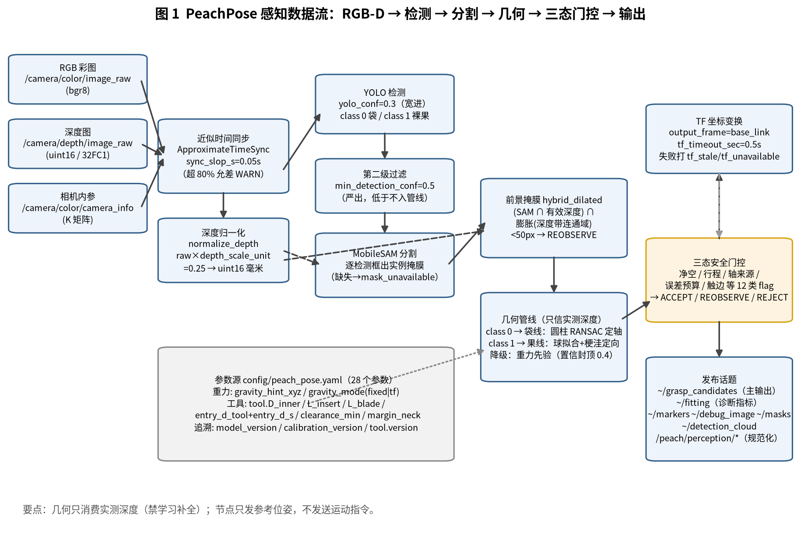
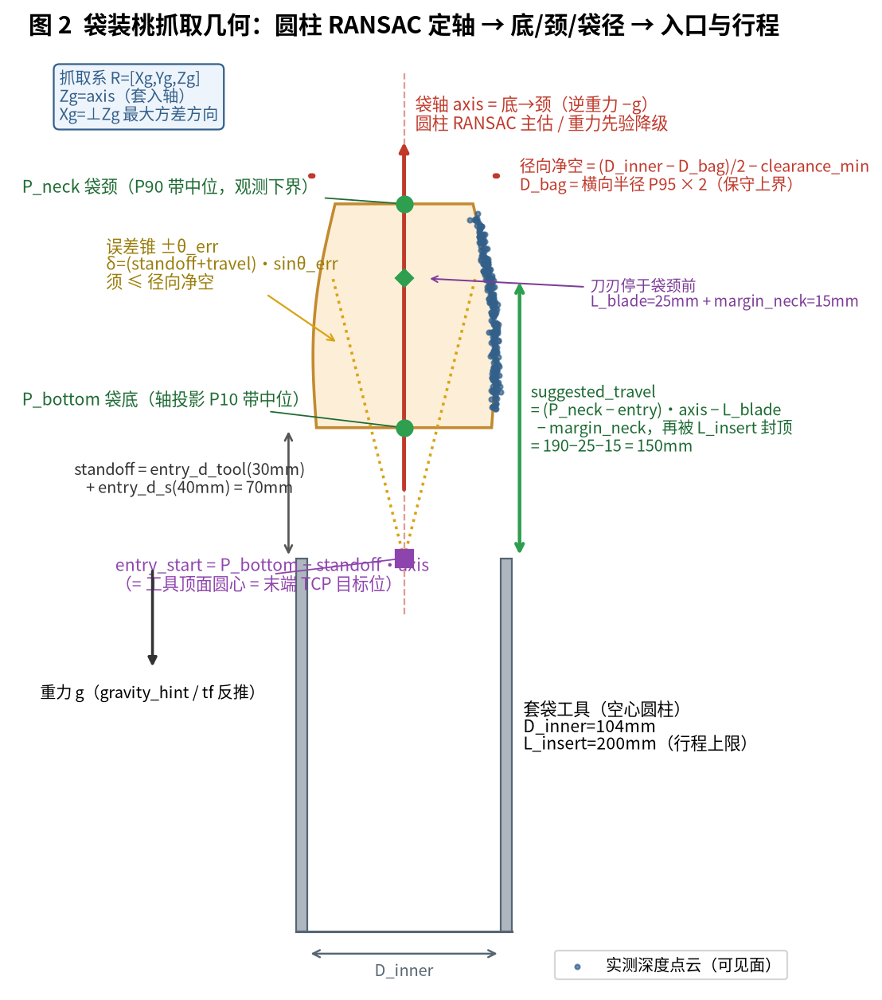
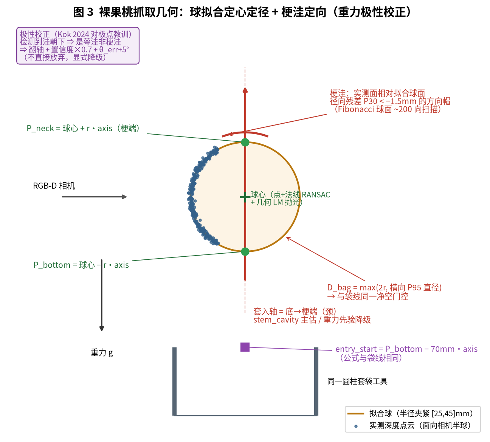
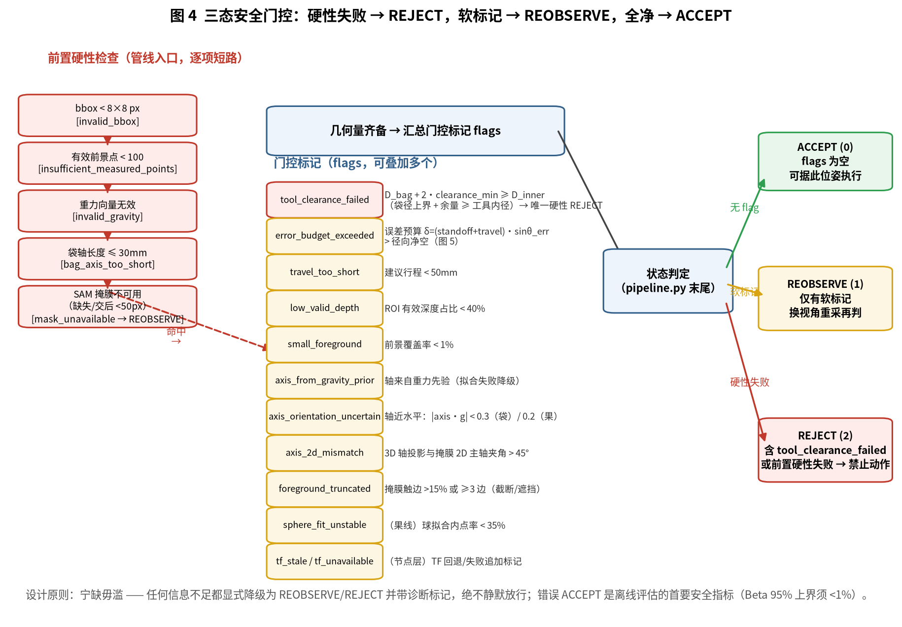
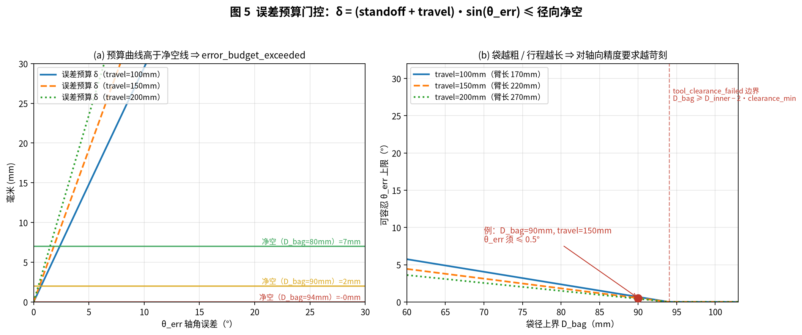
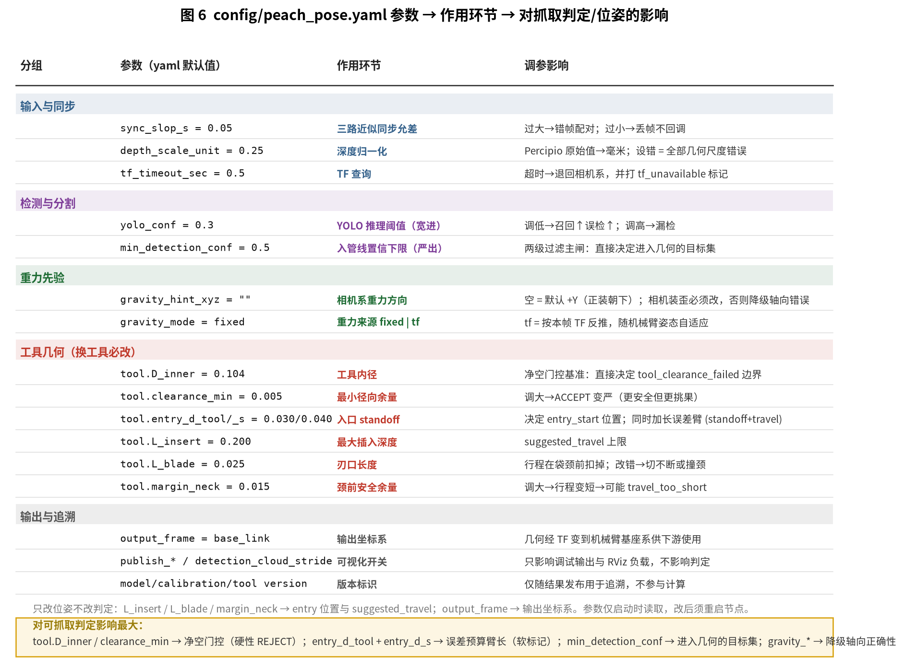

# PeachPose 桃姿感知包 项目汇报
## 抓取方向与定位的确认方法 · 可抓取判定逻辑 · 参数影响

> 适用代码：`src/peach_pose_ros2`（ROS 2 Jazzy，Python，venv `aubo_py3.12`）
> 配图：`figures/fig1`–`fig6`，可由 `draw_figures.py` 一键复现（见附录 A）
> 汇报日期：2026-08-07

---

## 1. 项目概述

PeachPose（`peach_pose_ros2`）是桃子套袋/采摘作业中的**感知与抓取参考解算包**。
它订阅 Percipio RGB-D 相机的对齐彩图/深度/内参，运行
**YOLO 检测 → MobileSAM 分割 → 实测深度几何管线**，为每个检测到的桃子输出：

- 抓取参考位姿（入口点 `entry_start` + 抓取系姿态 R + 套入轴方向）；
- 袋/果的底、颈位置与袋径上界；
- 建议套入行程 `suggested_travel`；
- **三态安全结论**：`ACCEPT / REOBSERVE / REJECT` + 诊断标记。

三条设计铁律贯穿全包：

1. **只信实测深度**：几何计算只消费传感器实测深度（法线是深度的一阶派生量），
   禁用任何学习深度/补全深度；任何掩膜必须先与有效实测深度求交才能进几何。
2. **宁缺毋滥**：信息不足一律显式降级为 `REOBSERVE`/`REJECT` 并附诊断标记，
   绝不静默放行。错误 ACCEPT 是离线评估的首要安全指标
   （Beta 95% 置信上界须 < 1%）。
3. **只发参考位姿，不发运动指令**：节点是纯感知节点，运动决策在下游。

作业工具为**空心圆柱套袋工具**（内径 104mm、最大插入 200mm、刃口 25mm），
袋装桃与裸果桃共用同一工具、同一套入口/行程公式与同一套安全门控。

---

## 2. 系统架构与数据流



模块与代码文件对应关系：

| 模块 | 文件 | 职责 |
|---|---|---|
| ROS 节点 | `peach_pose_ros2/peach_pose_node.py` | 参数加载、RGB-D 同步回调、TF 变换、消息组装与发布 |
| 推理 | `peach_pose/inference.py` | YOLO 检测（class 0 袋 / class 1 裸果）、MobileSAM 实例分割 |
| 深度归一化 | `peach_pose/depth_geometry.py` | 统一为 uint16 毫米（uint16×`depth_scale_unit`；32FC1 米×1000） |
| 前景构造与分流 | `peach_pose/candidates.py` | `hybrid_dilated` 掩膜构造；按 class_id 路由袋线/果线 |
| 几何管线 | `peach_pose/pipeline.py` | `RobustBagPosePipeline`（袋）、`RobustFruitPosePipeline`（果）：轴/底颈/袋径/入口/行程 + 三态门控 |
| 拟合原语 | `peach_pose/fitting.py` | 法线估计、球 RANSAC+LM、圆柱 RANSAC+Eberly 抛光 |
| 数据合约 | `peach_pose/contracts.py` | `ToolGeometry`、`BagObservation`、`BagGrasp2D/3D`、entry/travel 纯函数 |
| 离线评估 | `peach_pose/e2e_validate.py`、`validation.py` | 录制数据复测；错误 ACCEPT 的 Beta 上界安全门 |

一帧数据的完整旅程（`peach_pose_node.py:_on_rgbd`）：

1. 三路话题经 `ApproximateTimeSynchronizer`（`sync_slop_s=0.05s`）对齐；
   时间戳偏差超 80% 允差时 WARN 节流提示。
2. 深度归一化为 uint16 毫米；RGB/深度/CameraInfo 尺寸一致性校验，内参 K 只取
   本机 CameraInfo（不回退 FOV 推导）。
3. YOLO 以 `yolo_conf=0.3` **宽进**，再以 `min_detection_conf=0.5` **严出**，
   低于下限的目标不进几何管线。
4. 逐目标 MobileSAM 出实例掩膜 → `hybrid_dilated` 前景（见 §3.1）。
5. 按 `class_id` 分流袋线/果线，得到相机光学系下的抓取参考 + 三态结论（§3、§4）。
6. 经 TF（手眼外参链）变换到 `output_frame=base_link`；TF 按帧时间戳查询，
   失败退最新 TF 并打 `tf_stale`，彻底失败退回相机系并打 `tf_unavailable`。
7. 发布 `~/grasp_candidates`（主输出）、`~/fitting`（诊断指标）、`~/markers`、
   `~/debug_image`、`~/masks`、`~/detection_cloud`，并行的规范化话题
   `/peach/perception/*` 供下游按固定命名订阅；`/peach/perception/axis`
   选本帧最优候选（第一个 ACCEPT，否则第一个有效方向）的套入轴方向。

---

## 3. 抓取方向与定位如何确认

### 3.1 公共前处理：前景掩膜 hybrid_dilated

两条线共用唯一前景路线（`candidates.py:build_masks`）：

```
hybrid_dilated = (SAM 掩膜 ∩ 有效深度) ∩ 膨胀(深度带连通域)
```

- **有效深度**：非 0、非饱和（<65535），且在 [0.3, 2.5] m 内；
- **深度带连通域**（膨胀母体）：ROI 中心 1/3 区域深度中位数 ± max(25mm, 3·MAD)
  的深度带 → 8 连通域取中心所在域，再椭圆核膨胀 5px——它把 SAM 掩膜约束在
  实测表面上，防止 SAM 边缘漂到背景；
- 交后像素 < 50 → 掩膜不可用，直接给显式 `REOBSERVE(mask_unavailable)`，
  **禁止静默回退纯深度**；
- 反投影后的前景点再按 z 的 MAD 剔除离群（|z−中位| > 3.5·MAD）。

### 3.2 袋装桃（class 0）：圆柱 RANSAC 定轴



袋装桃近似回转体，套入轴即袋轴。**方向确认采用三级策略**
（`pipeline.py:RobustBagPosePipeline.estimate`）：

1. **主估——圆柱 RANSAC**（`fitting.py:fit_cylinder_robust`）：
   有序深度图邻域叉积估法线（深度跳变 >30mm 处法线置无效），利用
   "圆柱面法线 ⊥ 轴"这一几何事实：两不平行法线叉积即轴向
   `a = (n₁×n₂)/|n₁×n₂|`，投影到 ⊥a 平面后 3D 圆柱退化为 2D 圆求圆心；
   半径夹紧 [25, 50]mm 剪掉退化假设，RANSAC 后经 Eberly 法把 5 维问题消元为
   2 维做轴向 Powell 抛光，半径用 `mean(d_i)` 几何重估（避免 Eberly 代数残差
   带来的 ~1.9mm 系统性半径偏差）。有效拟合点 ≥200 且内点率 ≥0.35 才采信。
2. **显式降级——重力先验**：拟合失败时轴取 −g（袋自由悬垂假设），
   置信度封顶 0.4，θ_err 取保守 20°，并打 `axis_from_gravity_prior` 标记。
3. **2D 交叉校验**：3D 轴投影到图像（底→颈像素连线）与前景掩膜 PCA 主轴
   的夹角 > 45° 时打 `axis_2d_mismatch`（掩膜近圆形/投影过短时该校验自动
   放弃，返回 None 不参与门控）。

**轴定向**：axis·g > 0 则翻轴，保证轴恒为"袋底→袋颈"（逆重力）；
|axis·g| < 0.3 视为近水平歧义，打 `axis_orientation_uncertain` 并加角罚。

**定位（底/颈/袋径）**：

- 全部前景点沿轴投影，P10 分位带中位 = **P_bottom**，P90 分位带中位 =
  **P_neck**（单目可见面遮挡时它们是观测下界，偏保守）；
- 横向（⊥轴）中心取中位，袋径上界 **D_bag = 2 × 横向半径 P95**（保守上界，
  直接进净空门控）；
- 轴长 ≤ 30mm 直接 `REJECT(bag_axis_too_short)`。

**抓取系与入口/行程**（与果线完全同式，`contracts.py`）：

```
Zg = axis（袋底→袋颈）；Xg = ⊥Zg 平面内点云最大方差方向；Yg = Zg × Xg
entry_start      = P_bottom − (entry_d_tool + entry_d_s)·Zg      # 70mm 外起套
s_neck           = (P_neck − entry_start)·Zg − L_blade
suggested_travel = min(max(0, s_neck − margin_neck), L_insert)   # 颈前 15mm 停刀
```

`entry_start` 即工具顶面圆心 = 末端 TCP 的目标位置，从袋外 70mm 处起套；
行程在袋颈前扣掉刃口 25mm 再留 15mm 余量，并被工具插入深度 200mm 封顶。

### 3.3 裸果桃（class 1）：球拟合定心 + 梗洼定向



裸果是近球体、没有圆柱结构，`RobustFruitPosePipeline` 换一套几何原语：

1. **定心定径——球拟合**（`fitting.py:fit_sphere_robust`）：
   球面法线满足 `c = p − r·n`（射线约束），点+法线 RANSAC（2 点采样解半径，
   半径夹紧 [25, 45]mm，对应成熟桃 Ø60–85mm），内点做几何正交距离 LM 抛光
   （MLE；固定半径删去 Fisher 信息矩阵最病态方向）。内点率 < 0.35 判
   `sphere_fit_unstable`。
2. **定向——梗洼检测**（`_stem_cavity_axis`）：桃的果梗附着处有凹陷
   （植物学事实）。在拟合球面上按 Fibonacci 格点扫 ~200 个方向，对每个 20°
   方向帽统计"实测表面相对拟合球面"的径向残差，取 P30 分位 < −1.5mm 且点数
   ≥12 的最深帽作为梗端方向，帽内点残差加权精化。这是零标注的局部几何原语。
   检出洼区后还会剔除洼帽对球心做二次抛光，消除洼区拉偏。
3. **重力极性校正**：桃挂枝梗朝上，若检测到的洼朝下（axis·g > 0）说明
   看到的是萼洼而非梗洼（Kok 2024 的对极点混淆教训）——**翻轴 + 置信度×0.7 +
   θ_err+5°**，显式降级而不是直接放弃。
4. **降级**：梗洼不可见（被叶挡/背对相机/表面过光滑）→ 重力先验，与袋线
   同样置信封顶 0.4、至多 REOBSERVE。

参考点定义：`P_bottom = 球心 − r·axis`，`P_neck = 球心 + r·axis`（梗端），
袋径取 `max(2r, 横向 P95 直径)` 的保守大者；entry/行程/误差预算公式与袋线
**逐行相同**，保证两条线对下游是完全一致的契约。

### 3.4 坐标变换与输出契约

几何在相机光学系求解后（`peach_pose_node.py:_apply_T_to_grasp3d`）：

- 点（entry_start / bag_bottom / bag_neck / suggested_travel_end）：`R@p + t`；
- 方向（translation_direction）：只乘 R 并归一化；
- 抓取系姿态矩阵：左乘 R。

TF 链为 `base_link → wrist3_Link → camera_link → camera_color_optical_frame`，
其中手眼外参由 `extrinsics_publisher` 发静态 TF。变换失败不会让结果静默
落在错的坐标系——退回相机系并在 `diagnostic_flags` 追加
`tf_stale / tf_unavailable` 供下游甄别。

---

## 4. 是否可以抓取：三态门控逻辑



### 4.1 前置硬性失败（逐项短路，不进门控表）

| 条件 | 标记 | 结果 |
|---|---|---|
| bbox < 8×8 px | `invalid_bbox` | REJECT |
| 有效前景点 < 100 | `insufficient_measured_points` | REJECT |
| 重力向量无效 | `invalid_gravity` | REJECT |
| 袋轴长度 ≤ 30mm（袋线） | `bag_axis_too_short` | REJECT |
| SAM 掩膜缺失/交后 < 50px | `mask_unavailable` | REOBSERVE |

### 4.2 门控标记（flags，可叠加）

| flag | 触发条件 | 性质 |
|---|---|---|
| `tool_clearance_failed` | D_bag + 2·clearance_min ≥ D_inner | **唯一硬性 → REJECT** |
| `error_budget_exceeded` | (standoff+travel)·sin θ_err > 径向净空 | 软 |
| `travel_too_short` | suggested_travel < 50mm | 软 |
| `low_valid_depth` | ROI 有效深度占比 < 40% | 软 |
| `small_foreground` | 前景覆盖率 < 1% | 软 |
| `axis_from_gravity_prior` | 轴来自重力降级 | 软 |
| `axis_orientation_uncertain` | 轴近水平（袋 |axis·g|<0.3，果 <0.2） | 软 |
| `axis_2d_mismatch` | 3D 轴投影与掩膜主轴夹角 > 45° | 软 |
| `foreground_truncated` | 掩膜触边 > 15% 或 ≥ 3 边 | 软 |
| `sphere_fit_unstable` | 果线球拟合内点率 < 35% | 软 |
| `tf_stale` / `tf_unavailable` | 节点层 TF 回退/失败追加 | 软 |

**状态判定**（`pipeline.py` 末尾，两线同式）：

```
flags 为空                    → ACCEPT     （可据此位姿执行）
含 tool_clearance_failed     → REJECT     （禁止据此动作）
其余任意 flag                → REOBSERVE  （换视角重采一帧再判）
```

### 4.3 误差预算 vs 径向净空（门控的物理核心）



安全门控的本质是比较两个毫米量：

```
径向净空  clearance = (D_inner − D_bag)/2 − clearance_min        [mm]
误差预算  δ        = (standoff + travel) · sin(θ_err)            [mm]
门控      δ ≤ clearance，否则 error_budget_exceeded
```

物理含义：轴角估计误差 θ_err 经"standoff+travel"力臂放大后，袋体相对工具
轴线的最大横向偏移不能超过袋体与工具内壁之间的净空间隙。

- θ_err 不是拍脑袋常数：圆柱 RANSAC 成功时取
  `clip(atan2(2·rms, length), 2°, 30°)`（拟合残差/袋长 = 指向误差代理）；
  重力降级取保守 20°；定向歧义至少 12°；梗洼线由球拟合 RMS + 置信度折算；
- 图 5(b) 给出直观结论：**袋越粗、行程越长，对轴向精度的要求越苛刻**。
  例：D_bag=90mm、travel=150mm 时净空仅 2mm，θ_err 须 ≤ 0.5°——
  这就是为什么粗袋/长行程目标几乎必然落在 REOBSERVE/REJECT，
  以及为什么换更细的工具（D_inner 更大）能直接放宽 ACCEPT 率。

### 4.4 置信度与下游使用建议

`confidence = clip(min(valid_ratio/0.65, 1) × min(n_points/800, 1)
× (1 − min(boundary_touch, 0.8)), 0, 1)`，是数据质量的连续度量，
**不参与门控**（门控只看 flags），供下游排序多目标用。建议下游：

- 只对 `status=ACCEPT(0)` 的候选直接规划套袋动作；
- `REOBSERVE(1)`：按 `diagnostic_flags` 决定重采策略（如
  `foreground_truncated` 说明目标在视场边缘，`axis_from_gravity_prior`
  说明拟合失败需换角度）；
- `REJECT(2)`：跳过该目标。

---

## 5. 参数（config/peach_pose.yaml）影响



yaml 是参数默认值的**权威源**（28 个参数，launch 全量加载；节点内
`declare_parameter` 默认值逐一对齐，改默认值两边必须同步；参数仅启动时
读取，改后须重启节点）。

### 5.1 全参数速查

| 分组 | 参数（默认） | 影响 |
|---|---|---|
| 输入 | `color/depth/camera_info_topic` | RGB-D 源话题；深度须 registration 对齐 |
| 输入 | `sync_slop_s = 0.05` | 三路同步允差：过大错帧配对，过小丢帧 |
| 输入 | `depth_scale_unit = 0.25` | uint16→毫米因子；**设错=全部几何尺度错误**（数据集回放设 1.0；32FC1 不生效） |
| 坐标 | `camera_optical_frame` / `output_frame=base_link` | 手眼链挂载帧 / 输出系（空=保持相机系） |
| 坐标 | `tf_timeout_sec = 0.5` | TF 查询超时，超时→退回相机系+打标 |
| 检测 | `yolo_conf = 0.3`（宽进）/ `min_detection_conf = 0.5`（严出） | 两级过滤：前者管召回，后者是决定进几何目标集的主闸 |
| 重力 | `gravity_hint_xyz = ""` / `gravity_mode = fixed` | 降级轴向的方向来源；相机装歪必须设；tf 模式随臂姿自适应 |
| 工具 | `tool.D_inner = 0.104` | **净空门控基准**，直接决定硬性 REJECT 边界 |
| 工具 | `tool.clearance_min = 0.005` | 径向余量：调大→ACCEPT 变严（更安全更挑果） |
| 工具 | `tool.entry_d_tool/_s = 0.030/0.040` | entry 起套距离；同时是误差预算臂长的一部分 |
| 工具 | `tool.L_insert = 0.200` / `L_blade = 0.025` / `margin_neck = 0.015` | 行程上限 / 颈前扣刃 / 颈前余量——只改位姿与行程，不改判定严格度（过短会触发 travel_too_short） |
| 追溯 | `model_version` / `calibration_version` / `tool.version` | 仅随结果发布用于追溯，不参与计算 |
| 输出 | `publish_debug_image/masks/detection_cloud`、`detection_cloud_stride` | 调试可视化与 RViz 负载，不影响判定 |

### 5.2 典型调参场景

- **误 REJECT 太多（好果被抓不到）**：先查 `~/fitting` 里是哪类 flag 最多——
  `error_budget_exceeded` 居多说明 θ_err 代理太保守或袋径上界太松
  （换视角/改善深度质量）；`tool_clearance_failed` 居多是工具与果径匹配的
  物理事实，只能换工具或放宽 `clearance_min`（牺牲安全余量）。
- **错误 ACCEPT（最危险）**：收紧方向为加大 `clearance_min`、提高
  `min_detection_conf`、把 `gravity_mode` 切到 `tf`（相机姿态变化大时
  固定重力提示会系统性带偏降级轴向）。
- **换相机/换安装姿态**：改 `gravity_hint_xyz`（或 `gravity_mode:=tf`）、
  `depth_scale_unit`、三个输入话题与 `camera_optical_frame`。
- **换工具**：`tool.*` 整组必改并升 `tool.version`，改完重跑离线 e2e 评估
  确认错误 ACCEPT 上界仍 < 1%。

---

## 6. 验证手段

- **单测**（`test/`，pytest，须用 venv 解释器）：拟合原语、掩膜构造、
  管线门控、TF 矩阵/四元数双实现一致性、深度归一化、消息合约；
- **离线 e2e**（`e2e_validate.py` + `validation.py`）：录制 RGB-D 复测，
  有标注时计算检测召回、状态一致率、关键点像素误差、掩膜 IoU，
  以及安全首要指标——错误 ACCEPT 的 Beta(0.95) 上界 < 1% 才算
  `offline_safety_gate_pass`；
- **数据集回放冒烟**：`tools/peach_dataset_replayer.py`（注意此时
  `depth_scale_unit` 应为 1.0）。

---

## 7. 已知局限

1. **单目可见面**：底/颈/袋径均为观测下界（背面遮挡），门控因此系统性
   偏保守——这是设计取舍，不是 bug；
2. **梗洼定向只对可见半球有效**：梗端背对相机时必然走重力降级，
   至多 REOBSERVE；
3. **重力降级假设自由悬垂**：被枝叶托住/挤压的袋，重力先验轴向可能
   错误——靠 2D 交叉校验与 `axis_orientation_uncertain` 兜底降级；
4. **error_budget 的 θ_err 是代理量**（拟合残差/袋长折算），并非真值
   误差分布；离线评估用错误 ACCEPT 上界做最终裁决。

---

## 附录 A：配图复现

```bash
cd /home/mu/Desktop/aubo_e5_jazzy_ws
aubo_py3.12/bin/python src/peach_pose_ros2/docs/grasp_report/draw_figures.py
# 输出：src/peach_pose_ros2/docs/grasp_report/figures/fig1..fig6 PNG
```

| 图 | 内容 |
|---|---|
| fig1_pipeline_overview.png | 系统数据流与模块拓扑 |
| fig2_bag_geometry.png | 袋装桃：圆柱 RANSAC 定轴、底/颈/袋径、入口/行程、误差锥 |
| fig3_fruit_geometry.png | 裸果桃：球拟合 + 梗洼定向 + 重力极性校正 |
| fig4_gating_decision.png | 三态门控决策流程（硬性失败 / flags 表 / 状态判定） |
| fig5_error_budget.png | 误差预算 vs 径向净空（数值曲线与门控边界） |
| fig6_param_influence.png | yaml 参数 → 作用环节 → 调参影响 |

图中所有数值（工具几何 104/200/25/30/40/5/15mm、阈值 0.35/0.4/45°/
50px/100 点、θ_err 区间等）均与 `config/peach_pose.yaml` 及
`peach_pose/` 源码逐一对齐。
