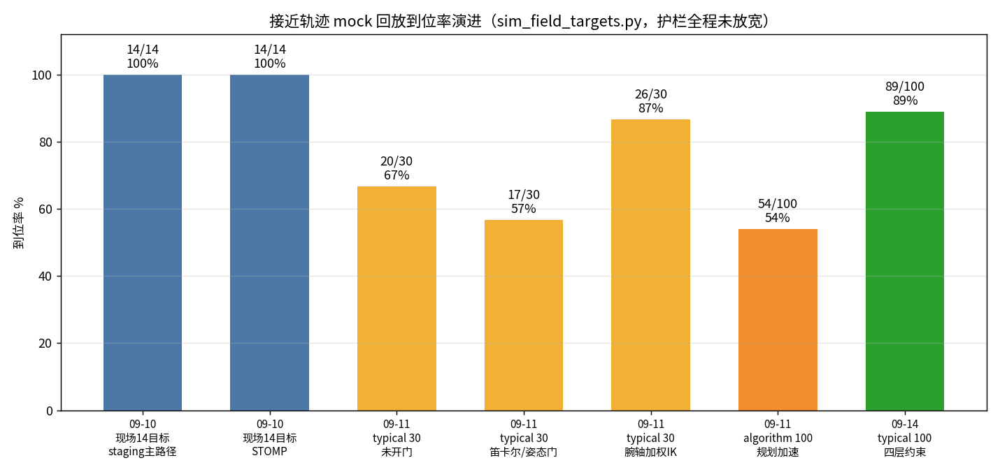
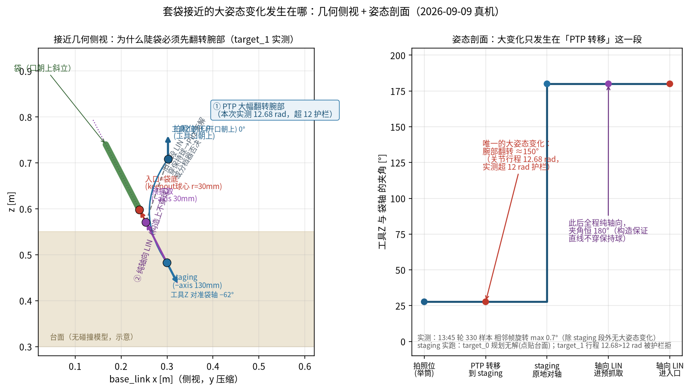

# 工作总结（截至 2026-09-14）

1. **接近轨迹重写（核心成果）**：主路径定为 staging PTP + 轴向 LIN，mock 典型包络 100 随机 **89/100 到位**（从拍照位 70/70 全成、绕行比 1.27–1.65、回退 0），现场真机 14 目标回放 **14/14**、watchdog 零违例；护栏（12 rad / 8 cm / 12 cm / 姿态门）全程未放宽。
2. **重写的几何依据**：解析复刻证实拍照位→预抓取直连弦 **2379/10014 穿袋囊**（直线不可行，删 G 弦）；09-09 真机姿态剖面证实大姿态变化只能集中在转移段（12.68 rad 超 12 护栏），此后纯轴向。

3. **四层安全约束（决策 0019）**：果实胶囊 / octomap 点云避障（监听 `/camera/depth_registered/points`，规划系 `world`）/ 近果降速 / 接触检测纯核；解析不变量 I1 复核 **0/8280 违例**。
4. **万位姿解析覆盖**：`analyze_approach_envelope.py` 分层 10000 + 现场袋，约束对齐后闭式 **10014/10014**（含现场 14/14、近水平 2000/2000）。
5. **仿真验证闭环（三套自研工具，随仓入库）**：`sim_field_targets.py` 注入现场真机坐标驱动真实技能节点逐用例实测；`trajectory_watchdog.py` 执行中 15 Hz FK 监测超门停轨；用例集来自 09-09 真机 16 批采集的 14 个目标坐标（`field_pregrasp_cases.yaml`）。
6. **规划加速**：MTC `plan(1)` 不凑解数、回拍照位 PTP 时限 0.5 s、各滚转并行 IK，单例中位 **4.63 s**（归档基线接近曾 25–29 s）。
7. **真机预抓取基线打通**：09-01 `1704` 重构后首次 HoldPregrasp SUCCEEDED，`1757` 现行基线（0 后撤停拟合袋底，现场目视「定位中上水平」），09-03 `1717` 复现 Hold。
8. **感知致命 bug 修复**：重建写点 Python `or` 致 TSDF 回滚、融合失败误回滚已积分体积——修复后链路走通；TCP IK 选果预检 + 有效深度窗实现物理超程目标零浪费；选果次序现场定夺「检测框大者优先」。
9. **工程质量重构**：感知抓取质量重构（`9994d5a`，单实现直接构造、球拟合索引错位/圆柱抽稀污染修复）、参数库 GPL 迁移（决策 0016，运行 yaml 单一事实源）、保行为修复轮 0017（B1–B7）、头文件 27→19、零调用服务全删；纯核 pytest 当前 **41 通过 / 1 跳过**。
10. **监控 Web 手动调试操作面**：四区重排，按就绪-开批-单步-收尾分组；运动类需 `debug.motion_enabled`（默认关）+ 操作审计。
11. **周边栈扩展**：serial_imu 帧重构随 `harvest_system` 接入（含纯核测试 2 件）；旁路视觉抓取四包入库（GraspNet 纯 torch 后端，与 peach 栈隔离）；dsh 系统监控插件入库。
12. **数据资产**：`runs/` 21 GB（402 目录 + 104 顶层 jsonl，约 30 万张图像）；文本层随仓推 Gitee，二进制只留本地；归档基线数据根 `_archive/runs/root_2026-08-24/`。
13. **在途**：工作区 92 文件感知清理 + 文档同步（+2 587/−8 704），未提交。

注：mock/解析/纯核数字为仿真与审查证据，真机 FULL 全流程验收未做；全程无 SetIO、`tool.enabled=false`，原始数据未删改。
